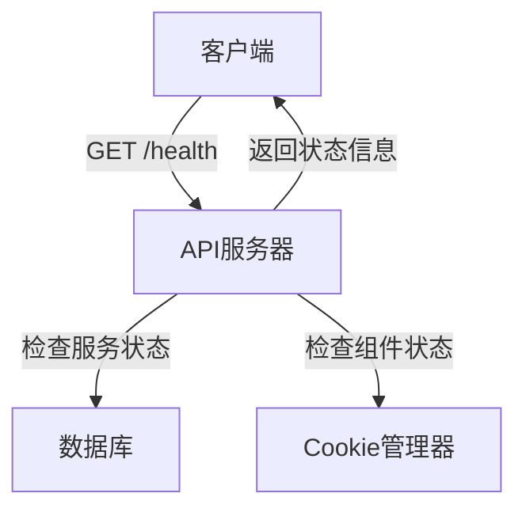
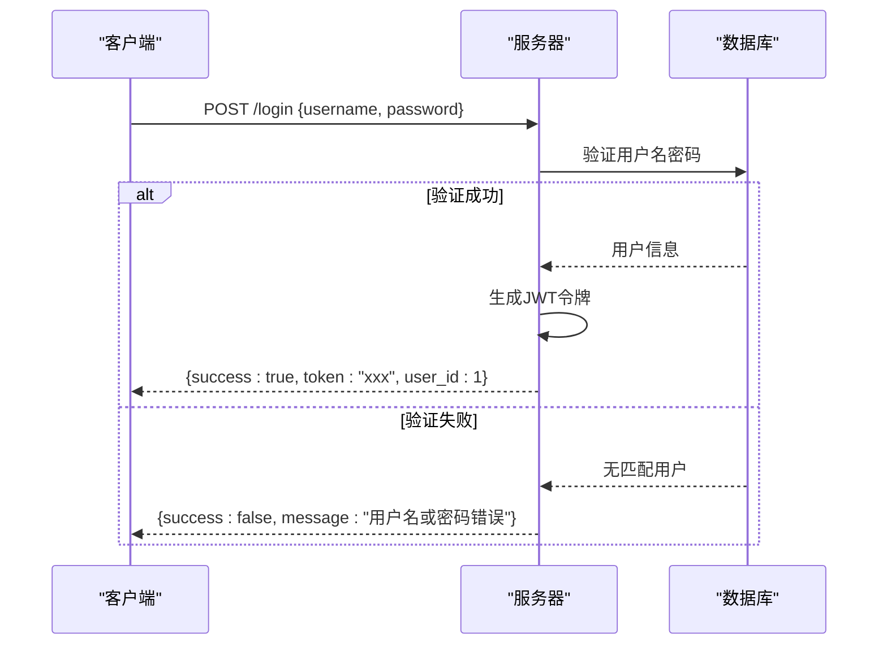

# API参考文档

<cite>
**本文档引用的文件**
- [reply_server.py](file://reply_server.py)
- [api_captcha_remote.py](file://api_captcha_remote.py)
- [simple_stats_server.py](file://simple_stats_server.py)
- [file_log_collector.py](file://file_log_collector.py)
- [config.py](file://config.py)
- [static/js/app.js](file://static/js/app.js)
- [XianyuAutoAsync.py](file://XianyuAutoAsync.py)
</cite>

## 目录
1. [简介](#简介)
2. [认证机制](#认证机制)
3. [核心API端点](#核心api端点)
4. [WebSocket通信协议](#websocket通信协议)
5. [验证码远程控制API](#验证码远程控制api)
6. [统计接口](#统计接口)
7. [日志收集接口](#日志收集接口)
8. [示例代码](#示例代码)

## 简介
本API参考文档详细描述了闲鱼自动回复系统暴露的所有接口。文档覆盖了系统的主要功能，包括用户认证、账号管理、消息处理、WebSocket通信、验证码远程控制、系统统计和日志收集等。所有API均通过FastAPI框架实现，提供RESTful接口和WebSocket实时通信能力。

## 认证机制
系统采用JWT（JSON Web Token）Bearer认证机制，大多数接口都需要在请求头中包含有效的认证令牌。

### 认证流程
1. 用户通过`/login`端点进行登录，成功后服务器返回包含JWT令牌的响应。
2. 客户端在后续请求中，将令牌放入`Authorization`请求头，格式为`Bearer <token>`。
3. 服务器验证令牌的有效性，包括检查令牌是否过期（默认24小时）和是否属于有效用户。
4. 管理员权限通过检查用户名是否为`admin`来确定。

### 认证相关端点
- **登录**: `POST /login` - 支持用户名/密码、邮箱/密码和邮箱/验证码三种登录方式。
- **验证令牌**: `GET /verify` - 验证当前令牌是否有效，返回用户信息。
- **登出**: `POST /logout` - 使当前令牌失效。
- **修改管理员密码**: `POST /change-admin-password` - 需要管理员权限。

**Section sources**
- [reply_server.py](file://reply_server.py#L112-L245)

## 核心API端点
本节详细描述`reply_server.py`中定义的核心API端点。

### 健康检查
健康检查端点用于Docker容器健康检查和负载均衡器监控。



**请求**
- **方法**: GET
- **路径**: `/health`

**响应**
- **状态码**: 
  - `200`: 服务健康
  - `503`: 服务不健康
- **响应体**: 
```json
{
  "status": "healthy",
  "timestamp": 1721721600,
  "services": {
    "cookie_manager": "ok",
    "database": "ok"
  },
  "system": {
    "cpu_percent": 15.5,
    "memory_percent": 45.2,
    "memory_available": 2147483648
  }
}
```

**Section sources**
- [reply_server.py](file://reply_server.py#L373-L418)

### 用户登录与注册
提供用户登录、注册和密码管理的API。

#### 登录


**请求**
- **方法**: POST
- **路径**: `/login`
- **请求体 (JSON)**:
```json
{
  "username": "string",
  "password": "string"
}
```
或
```json
{
  "email": "string",
  "password": "string"
}
```
或
```json
{
  "email": "string",
  "verification_code": "string"
}
```

**响应**
- **状态码**: `200`
- **响应体**:
```json
{
  "success": true,
  "token": "jwt_token_string",
  "message": "登录成功",
  "user_id": 1,
  "username": "admin",
  "is_admin": true
}
```

**Section sources**
- [reply_server.py](file://reply_server.py#L541-L659)

#### 注册
**请求**
- **方法**: POST
- **路径**: `/register`
- **请求体 (JSON)**:
```json
{
  "username": "string",
  "email": "string",
  "password": "string",
  "verification_code": "string"
}
```

**响应**
- **状态码**: `200`
- **响应体**:
```json
{
  "success": true,
  "message": "注册成功，请登录"
}
```

**Section sources**
- [reply_server.py](file://reply_server.py#L843-L905)

### 消息处理API
提供与闲鱼消息交互的核心API。

#### 发送消息
此API允许外部系统通过秘钥验证向闲鱼用户发送消息。

**请求**
- **方法**: POST
- **路径**: `/send-message`
- **请求头**:
  - `Authorization`: `Bearer <token>` (可选，如果使用API秘钥则不需要)
- **请求体 (JSON)**:
```json
{
  "api_key": "string",
  "cookie_id": "string",
  "chat_id": "string",
  "to_user_id": "string",
  "message": "string"
}
```

**响应**
- **状态码**: `200`
- **响应体**:
```json
{
  "success": true,
  "message": "消息发送成功"
}
```

**Section sources**
- [reply_server.py](file://reply_server.py#L944-L1045)

#### 自动回复接口
此接口是闲鱼自动回复的核心，当收到新消息时，系统会调用此接口获取回复内容。

**请求**
- **方法**: POST
- **路径**: `/xianyu/reply`
- **请求体 (JSON)**:
```json
{
  "cookie_id": "string",
  "msg_time": "string",
  "user_url": "string",
  "send_user_id": "string",
  "send_user_name": "string",
  "item_id": "string",
  "send_message": "string",
  "chat_id": "string"
}
```

**响应**
- **状态码**: `200`
- **响应体**:
```json
{
  "code": 200,
  "data": {
    "send_msg": "亲爱的{send_user_name} 老板你好！所有宝贝都可以拍，秒发货的哈~"
  }
}
```

**Section sources**
- [reply_server.py](file://reply_server.py#L1047-L1090)

### 账号管理API
提供对闲鱼账号的增删改查操作。

#### 获取账号列表
**请求**
- **方法**: GET
- **路径**: `/cookies`
- **认证**: 需要用户登录

**响应**
- **状态码**: `200`
- **响应体**: 账号ID数组
```json
["account1", "account2"]
```

**Section sources**
- [reply_server.py](file://reply_server.py#L1140-L1151)

#### 添加账号
**请求**
- **方法**: POST
- **路径**: `/cookies`
- **认证**: 需要用户登录
- **请求体 (JSON)**:
```json
{
  "id": "string",
  "value": "string"
}
```

**响应**
- **状态码**: `200`
- **响应体**:
```json
{"msg": "success"}
```

**Section sources**
- [reply_server.py](file://reply_server.py#L1182-L1215)

#### 更新账号状态
**请求**
- **方法**: PUT
- **路径**: `/cookies/{cid}/status`
- **认证**: 需要用户登录
- **请求体 (JSON)**:
```json
{
  "enabled": true
}
```

**响应**
- **状态码**: `200`
- **响应体**:
```json
{"msg": "status updated", "enabled": true}
```

**Section sources**
- [reply_server.py](file://reply_server.py#L2337-L2357)

## WebSocket通信协议
系统通过WebSocket实现与闲鱼服务器的实时通信，处理消息接收和发送。

### 消息类型
WebSocket通信中定义了多种消息类型，用于不同的业务场景。

| 消息类型 | 描述 | 数据格式 |
|---------|------|---------|
| `message.receive` | 接收到新消息 | `{ "send_user_name": "张三", "send_message": "你好", "chat_id": "123" }` |
| `account.status.update` | 账号状态更新 | `{ "account_id": "acc1", "status": "online", "last_active": "2023-01-01T00:00:00Z" }` |
| `token.refresh.success` | Cookie刷新成功 | `{ "account_id": "acc1", "refresh_time": "2023-01-01T00:00:00Z" }` |
| `token.refresh.failed` | Cookie刷新失败 | `{ "account_id": "acc1", "error": "刷新失败原因" }` |
| `face.verification.required` | 需要人脸验证 | `{ "account_id": "acc1", "verification_url": "https://verify.example.com" }` |

### 事件订阅机制
客户端可以通过发送特定的消息来订阅或取消订阅事件。

**订阅消息格式**:
```json
{
  "type": "subscribe",
  "events": ["message.receive", "account.status.update"]
}
```

**取消订阅消息格式**:
```json
{
  "type": "unsubscribe",
  "events": ["message.receive"]
}
```

**心跳机制**:
客户端和服务器通过定期发送心跳消息来维持连接。
```json
{
  "type": "ping"
}
// 服务器响应
{
  "type": "pong"
}
```

**Section sources**
- [XianyuAutoAsync.py](file://XianyuAutoAsync.py#L7173-L7481)
- [utils/ws_utils.py](file://utils/ws_utils.py#L6-L89)

## 验证码远程控制API
`api_captcha_remote.py`提供了对滑块验证码的远程控制功能，允许用户通过Web界面远程操作验证过程。

### WebSocket端点
提供实时通信能力，传输截图和接收鼠标事件。

**请求**
- **方法**: WebSocket
- **路径**: `/api/captcha/ws/{session_id}`

**消息类型**:
- **客户端发送**:
  - `mouse_event`: 包含鼠标事件类型（down, move, up）和坐标
  - `check_completion`: 手动检查验证是否完成
  - `ping`: 心跳包
- **服务器发送**:
  - `session_info`: 初始会话信息，包含截图和验证码信息
  - `screenshot_update`: 截图更新
  - `completed`: 验证成功
  - `completion_status`: 完成状态检查结果
  - `pong`: 心跳响应

**Section sources**
- [api_captcha_remote.py](file://api_captcha_remote.py#L38-L156)

### HTTP端点
提供RESTful API用于管理验证码会话。

#### 获取活跃会话
**请求**
- **方法**: GET
- **路径**: `/api/captcha/sessions`

**响应**
- **状态码**: `200`
- **响应体**:
```json
{
  "count": 1,
  "sessions": [
    {
      "session_id": "sess123",
      "completed": false,
      "has_websocket": true
    }
  ]
}
```

#### 获取会话信息
**请求**
- **方法**: GET
- **路径**: `/api/captcha/session/{session_id}`

**响应**
- **状态码**: `200`
- **响应体**:
```json
{
  "session_id": "sess123",
  "screenshot": "base64_encoded_image",
  "captcha_info": {
    "selector": "#nocaptcha",
    "x": 100,
    "y": 200,
    "width": 300,
    "height": 150,
    "in_iframe": false
  },
  "viewport": {
    "width": 1280,
    "height": 720
  },
  "completed": false
}
```

#### 处理鼠标事件
**请求**
- **方法**: POST
- **路径**: `/api/captcha/mouse_event`
- **请求体 (JSON)**:
```json
{
  "session_id": "string",
  "event_type": "down|move|up",
  "x": 0,
  "y": 0
}
```

**响应**
- **状态码**: `200`
- **响应体**:
```json
{
  "success": true,
  "completed": false
}
```

**Section sources**
- [api_captcha_remote.py](file://api_captcha_remote.py#L162-L227)

## 统计接口
`simple_stats_server.py`提供用户统计功能，用于收集和展示系统使用情况。

### 接收用户统计
**请求**
- **方法**: POST
- **路径**: `/statistics`
- **请求体 (JSON)**:
```json
{
  "anonymous_id": "string",
  "timestamp": "string",
  "project": "string",
  "info": {
    "os": "string",
    "version": "string"
  }
}
```

**响应**
- **状态码**: `200`
- **响应体**:
```json
{
  "status": "success",
  "message": "用户统计已收到"
}
```

### 获取统计摘要
**请求**
- **方法**: GET
- **路径**: `/stats`

**响应**
- **状态码**: `200`
- **响应体**:
```json
{
  "total_users": 100,
  "daily_active_users": 50,
  "weekly_active_users": 80,
  "os_distribution": {
    "Windows": 60,
    "Linux": 30,
    "macOS": 10
  },
  "version_distribution": {
    "2.2.0": 80,
    "2.1.0": 20
  },
  "last_updated": "2023-01-01T00:00:00Z"
}
```

**Section sources**
- [simple_stats_server.py](file://simple_stats_server.py#L97-L167)

## 日志收集接口
`file_log_collector.py`提供基于文件监控的日志收集功能。

### 获取日志记录
**请求**
- **方法**: GET
- **路径**: `/logs` (此端点在`reply_server.py`中通过`get_file_log_collector()`集成)
- **查询参数**:
  - `lines`: 返回的日志行数 (默认200)
  - `level_filter`: 日志级别过滤 (如INFO, ERROR)
  - `source_filter`: 源文件过滤

**响应**
- **状态码**: `200`
- **响应体**: 日志条目数组
```json
[
  {
    "timestamp": "2023-01-01T00:00:00.000Z",
    "level": "INFO",
    "source": "__main__",
    "function": "debug_collector",
    "line": 70,
    "message": "消息内容"
  }
]
```

### 获取日志统计
**请求**
- **方法**: GET
- **路径**: `/logs/stats`

**响应**
- **状态码**: `200`
- **响应体**:
```json
{
  "total_logs": 1000,
  "level_counts": {
    "INFO": 800,
    "ERROR": 100,
    "WARNING": 100
  },
  "source_counts": {
    "__main__": 500,
    "reply_server": 300
  },
  "max_capacity": 2000,
  "log_file": "realtime.log"
}
```

**Section sources**
- [file_log_collector.py](file://file_log_collector.py#L148-L190)

## 示例代码
本节提供API调用的示例代码，帮助开发者快速集成。

### curl命令示例

#### 登录
```bash
curl -X POST "http://localhost:8000/login" \
  -H "Content-Type: application/json" \
  -d '{
    "username": "admin",
    "password": "admin123"
  }'
```

#### 发送消息
```bash
curl -X POST "http://localhost:8000/send-message" \
  -H "Content-Type: application/json" \
  -d '{
    "api_key": "xianyu_api_secret_2024",
    "cookie_id": "account1",
    "chat_id": "chat123",
    "to_user_id": "user456",
    "message": "你好，这是测试消息"
  }'
```

#### 获取账号列表
```bash
curl -X GET "http://localhost:8000/cookies" \
  -H "Authorization: Bearer your_jwt_token_here"
```

### JavaScript调用示例

#### 登录并获取令牌
```javascript
async function login() {
  const response = await fetch('/login', {
    method: 'POST',
    headers: {
      'Content-Type': 'application/json'
    },
    body: JSON.stringify({
      username: 'admin',
      password: 'admin123'
    })
  });
  
  const data = await response.json();
  if (data.success) {
    localStorage.setItem('authToken', data.token);
    console.log('登录成功');
  } else {
    console.error('登录失败:', data.message);
  }
}
```

#### 发送消息
```javascript
async function sendMessage(cookieId, chatId, toUserId, message) {
  const authToken = localStorage.getItem('authToken');
  const response = await fetch('/send-message', {
    method: 'POST',
    headers: {
      'Content-Type': 'application/json',
      'Authorization': `Bearer ${authToken}`
    },
    body: JSON.stringify({
      api_key: 'xianyu_api_secret_2024',
      cookie_id: cookieId,
      chat_id: chatId,
      to_user_id: toUserId,
      message: message
    })
  });
  
  const data = await response.json();
  if (data.success) {
    console.log('消息发送成功');
  } else {
    console.error('消息发送失败:', data.message);
  }
}
```

#### WebSocket连接示例
```javascript
function connectWebSocket(sessionId) {
  const ws = new WebSocket(`ws://localhost:8000/api/captcha/ws/${sessionId}`);
  
  ws.onopen = function(event) {
    console.log('WebSocket连接已建立');
  };
  
  ws.onmessage = function(event) {
    const data = JSON.parse(event.data);
    if (data.type === 'screenshot_update') {
      document.getElementById('captcha-image').src = `data:image/jpeg;base64,${data.screenshot}`;
    } else if (data.type === 'completed') {
      console.log('验证成功！');
      ws.close();
    }
  };
  
  ws.onclose = function(event) {
    console.log('WebSocket连接已关闭');
  };
  
  // 发送鼠标事件
  function sendMouseEvent(eventType, x, y) {
    ws.send(JSON.stringify({
      type: 'mouse_event',
      event_type: eventType,
      x: x,
      y: y
    }));
  }
  
  return ws;
}
```

**Section sources**
- [static/js/app.js](file://static/js/app.js#L3296-L3495)
- [reply_server.py](file://reply_server.py#L1-L5558)
- [api_captcha_remote.py](file://api_captcha_remote.py#L1-L319)