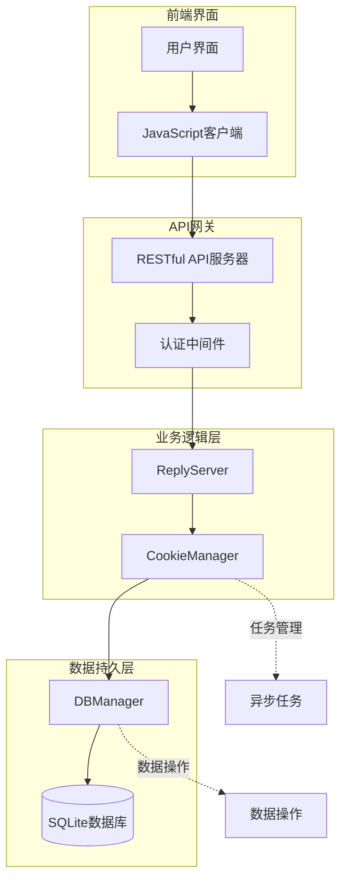
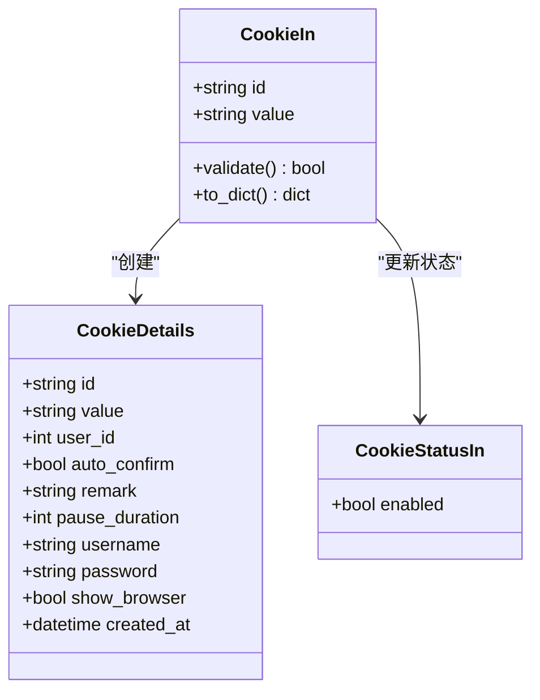
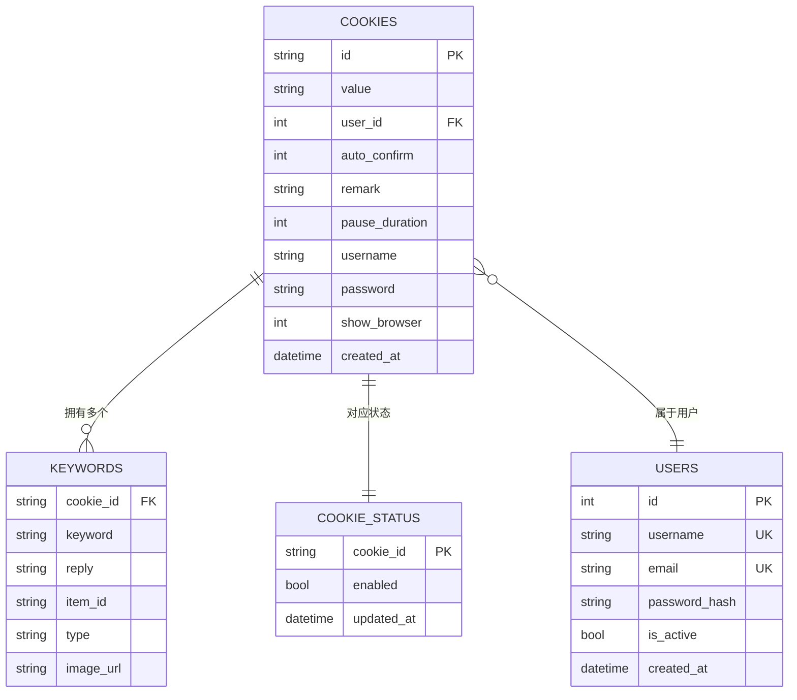
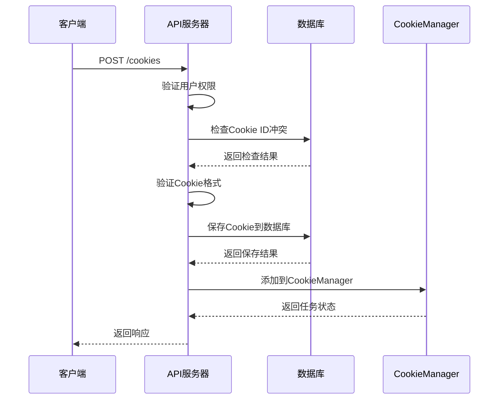
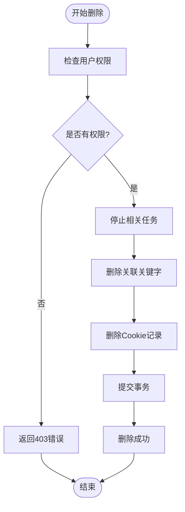
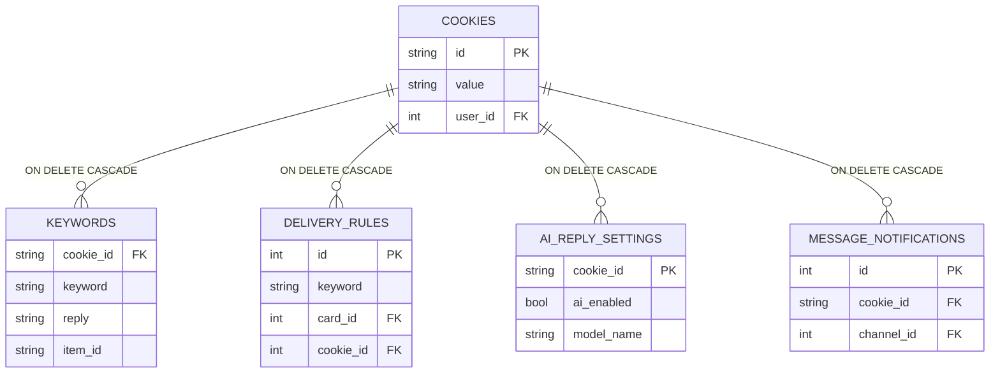
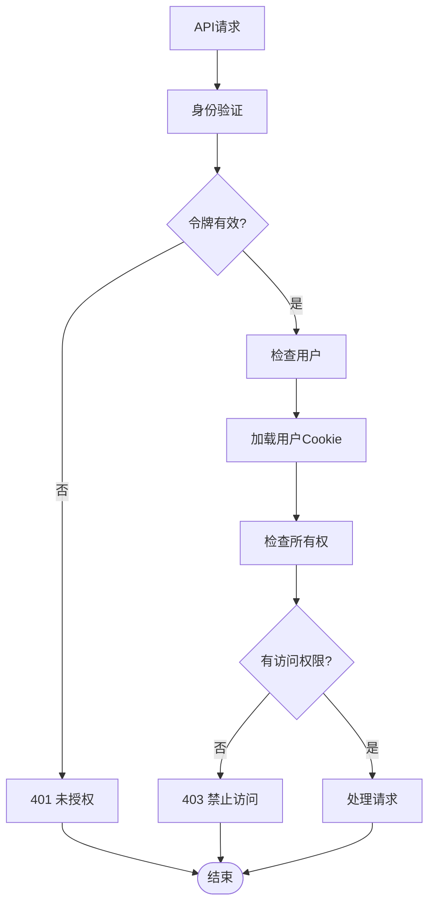
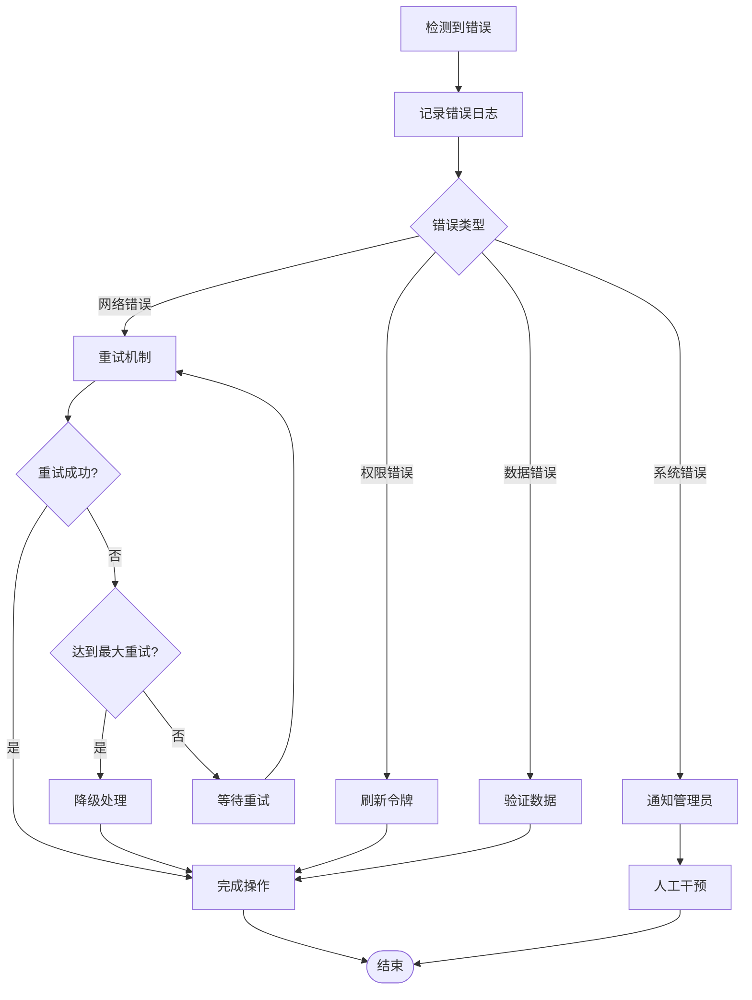

# Cookie基础管理接口文档

<cite>
**本文档引用的文件**
- [cookie_manager.py](file://cookie_manager.py)
- [db_manager.py](file://db_manager.py)
- [reply_server.py](file://reply_server.py)
- [config.py](file://config.py)
</cite>

## 目录
1. [简介](#简介)
2. [系统架构概览](#系统架构概览)
3. [核心数据模型](#核心数据模型)
4. [Cookie账号增删改查操作](#cookie账号增删改查操作)
5. [级联删除机制](#级联删除机制)
6. [数据验证规则](#数据验证规则)
7. [错误处理策略](#错误处理策略)
8. [API请求响应示例](#api请求响应示例)
9. [最佳实践](#最佳实践)
10. [故障排除指南](#故障排除指南)

## 简介

闲鱼自动回复系统提供了完整的Cookie基础管理接口，用于管理多个闲鱼账号的Cookie信息。该系统支持Cookie的增删改查操作，具备完善的用户权限控制、级联删除机制和数据验证功能。

### 主要特性

- **多用户隔离**：每个用户只能操作自己创建的Cookie账号
- **级联删除**：删除Cookie时自动清理关联的关键字、自动发货规则等数据
- **实时同步**：Cookie变更会自动重启相关任务
- **数据完整性**：通过数据库约束保证数据一致性
- **权限控制**：严格的API权限验证机制

## 系统架构概览



**图表来源**
- [cookie_manager.py](file://cookie_manager.py#L10-L428)
- [reply_server.py](file://reply_server.py#L1-L50)

### 核心组件说明

1. **CookieManager**：负责Cookie的生命周期管理，包括添加、删除、更新和任务启动
2. **DBManager**：数据库操作层，提供数据持久化服务
3. **ReplyServer**：API服务器，处理HTTP请求和响应
4. **Task**：异步任务系统，管理Cookie相关的后台任务

**章节来源**
- [cookie_manager.py](file://cookie_manager.py#L10-L428)
- [db_manager.py](file://db_manager.py#L16-L100)

## 核心数据模型

### CookieIn 数据模型

Cookie账号的基本信息模型，用于创建和更新Cookie账号。



**图表来源**
- [reply_server.py](file://reply_server.py#L1094-L1102)

#### 字段说明

| 字段名 | 类型 | 必填 | 说明 |
|--------|------|------|------|
| id | string | 是 | Cookie唯一标识符，最大长度限制 |
| value | string | 是 | 实际的Cookie值，包含登录凭据 |
| enabled | boolean | 否 | 账号启用状态，默认为true |
| auto_confirm | boolean | 否 | 自动确认发货设置，默认为true |
| remark | string | 否 | 备注信息，用于标记账号用途 |
| pause_duration | integer | 否 | 自动回复暂停时间（分钟），默认10分钟 |

**章节来源**
- [reply_server.py](file://reply_server.py#L1094-L1102)

### 数据库表结构



**图表来源**
- [db_manager.py](file://db_manager.py#L109-L148)

**章节来源**
- [db_manager.py](file://db_manager.py#L109-L148)

## Cookie账号增删改查操作

### 创建Cookie账号

#### API端点
```
POST /cookies
```

#### 请求参数

```json
{
    "id": "cookie_001",
    "value": "your_cookie_value_here"
}
```

#### 请求头
```
Content-Type: application/json
Authorization: Bearer <your_token>
```

#### 响应示例

成功响应：
```json
{
    "msg": "success"
}
```

错误响应：
```json
{
    "detail": "该Cookie ID已被其他用户使用"
}
```

#### 实现流程



**图表来源**
- [reply_server.py](file://reply_server.py#L1183-L1214)
- [db_manager.py](file://db_manager.py#L1170-L1194)

**章节来源**
- [reply_server.py](file://reply_server.py#L1183-L1214)

### 查询Cookie账号

#### 获取所有Cookie ID
```
GET /cookies
```

响应：
```json
["cookie_001", "cookie_002", "cookie_003"]
```

#### 获取所有Cookie详细信息
```
GET /cookies/details
```

响应：
```json
[
    {
        "id": "cookie_001",
        "value": "encrypted_cookie_value",
        "enabled": true,
        "auto_confirm": true,
        "remark": "主账号",
        "pause_duration": 10
    }
]
```

#### 获取单个Cookie详细信息
```
GET /cookie/{cid}/details
```

响应：
```json
{
    "id": "cookie_001",
    "value": "encrypted_cookie_value",
    "user_id": 1,
    "auto_confirm": true,
    "remark": "主账号",
    "pause_duration": 10,
    "username": "user@example.com",
    "password": "",
    "show_browser": false,
    "created_at": "2024-01-01T00:00:00Z"
}
```

**章节来源**
- [reply_server.py](file://reply_server.py#L1141-L1180)

### 更新Cookie账号

#### 更新Cookie值
```
PUT /cookies/{cid}
```

请求：
```json
{
    "id": "cookie_001",
    "value": "new_encrypted_cookie_value"
}
```

#### 更新账号信息
```
POST /cookie/{cid}/account-info
```

请求：
```json
{
    "value": "new_cookie_value",
    "username": "user@example.com",
    "password": "secure_password",
    "show_browser": false
}
```

#### 更新启用状态
```
PUT /cookies/{cid}/status
```

请求：
```json
{
    "enabled": true
}
```

**章节来源**
- [reply_server.py](file://reply_server.py#L1217-L1299)

### 删除Cookie账号

#### API端点
```
DELETE /cookies/{cid}
```

#### 删除流程



**图表来源**
- [reply_server.py](file://reply_server.py#L2796-L2815)
- [db_manager.py](file://db_manager.py#L1196-L1211)

**章节来源**
- [reply_server.py](file://reply_server.py#L2796-L2815)

## 级联删除机制

系统采用数据库级联删除机制，确保数据完整性。

### 删除触发器



**图表来源**
- [db_manager.py](file://db_manager.py#L109-L148)

### 级联删除影响范围

1. **关键字数据**：删除所有与该Cookie关联的关键词
2. **自动发货规则**：删除所有自动发货规则
3. **AI回复设置**：删除AI回复配置
4. **消息通知**：删除消息通知配置
5. **订单记录**：删除相关订单数据
6. **风控日志**：删除风控相关日志

**章节来源**
- [db_manager.py](file://db_manager.py#L1196-L1211)

## 数据验证规则

### Cookie ID验证

| 规则 | 说明 | 错误信息 |
|------|------|----------|
| 长度限制 | 最大64字符 | "Cookie ID过长" |
| 字符集 | 只允许字母数字和下划线 | "Cookie ID包含非法字符" |
| 唯一性 | 在系统内必须唯一 | "该Cookie ID已被使用" |

### Cookie值验证

| 规则 | 说明 | 错误信息 |
|------|------|----------|
| 非空检查 | 必须提供Cookie值 | "Cookie值不能为空" |
| 格式验证 | 必须是有效的Cookie格式 | "Cookie格式无效" |
| 长度限制 | 最大4096字符 | "Cookie值过长" |

### 用户权限验证



**图表来源**
- [reply_server.py](file://reply_server.py#L1183-L1214)

**章节来源**
- [reply_server.py](file://reply_server.py#L1183-L1214)

## 错误处理策略

### HTTP状态码

| 状态码 | 场景 | 处理方式 |
|--------|------|----------|
| 200 | 成功 | 返回成功响应 |
| 400 | 客户端错误 | 返回具体错误信息 |
| 401 | 未认证 | 要求重新登录 |
| 403 | 权限不足 | 拒绝访问 |
| 404 | 资源不存在 | 返回未找到 |
| 500 | 服务器错误 | 记录日志并返回通用错误 |

### 错误分类处理

#### 数据库错误
```python
try:
    # 数据库操作
    db_operation()
except sqlite3.IntegrityError as e:
    # 唯一约束冲突
    raise HTTPException(status_code=400, detail="数据冲突")
except sqlite3.OperationalError as e:
    # 表结构错误
    raise HTTPException(status_code=500, detail="数据库操作失败")
```

#### 权限错误
```python
if cookie_id not in user_cookies:
    raise HTTPException(status_code=403, detail="无权限操作该Cookie")
```

#### 参数验证错误
```python
if not cookie_id or not re.match(r'^[a-zA-Z0-9_]+$', cookie_id):
    raise HTTPException(status_code=400, detail="Cookie ID格式错误")
```

**章节来源**
- [reply_server.py](file://reply_server.py#L1183-L1214)
- [db_manager.py](file://db_manager.py#L1170-L1194)

## API请求响应示例

### 创建Cookie账号

#### 请求
```bash
curl -X POST "http://localhost:8080/cookies" \
  -H "Content-Type: application/json" \
  -H "Authorization: Bearer your_token_here" \
  -d '{
    "id": "xiaoyu_001",
    "value": "sid=abc123; _tb_token_=xyz789;"
  }'
```

#### 响应
```json
{
    "msg": "success"
}
```

### 查询Cookie详情

#### 请求
```bash
curl -X GET "http://localhost:8080/cookies/details" \
  -H "Authorization: Bearer your_token_here"
```

#### 响应
```json
[
    {
        "id": "xiaoyu_001",
        "value": "sid=abc123; _tb_token_=xyz789;",
        "enabled": true,
        "auto_confirm": true,
        "remark": "小鱼儿主账号",
        "pause_duration": 10
    },
    {
        "id": "xiaoyu_002",
        "value": "sid=def456; _tb_token_=uvw123;",
        "enabled": false,
        "auto_confirm": false,
        "remark": "备用账号",
        "pause_duration": 15
    }
]
```

### 更新Cookie值

#### 请求
```bash
curl -X PUT "http://localhost:8080/cookies/xiaoyu_001" \
  -H "Content-Type: application/json" \
  -H "Authorization: Bearer your_token_here" \
  -d '{
    "id": "xiaoyu_001",
    "value": "sid=new123; _tb_token_=new789;"
  }'
```

#### 响应
```json
{
    "msg": "updated"
}
```

### 删除Cookie账号

#### 请求
```bash
curl -X DELETE "http://localhost:8080/cookies/xiaoyu_001" \
  -H "Authorization: Bearer your_token_here"
```

#### 响应
```json
{
    "msg": "removed"
}
```

### 获取Cookie备注

#### 请求
```bash
curl -X GET "http://localhost:8080/cookies/xiaoyu_001/remark" \
  -H "Authorization: Bearer your_token_here"
```

#### 响应
```json
{
    "remark": "这是我的主账号",
    "message": "获取备注成功"
}
```

### 更新Cookie备注

#### 请求
```bash
curl -X PUT "http://localhost:8080/cookies/xiaoyu_001/remark" \
  -H "Content-Type: application/json" \
  -H "Authorization: Bearer your_token_here" \
  -d '{
    "remark": "这是我的主账号，用于日常运营"
  }'
```

#### 响应
```json
{
    "message": "备注更新成功",
    "remark": "这是我的主账号，用于日常运营"
}
```

## 最佳实践

### Cookie管理建议

1. **命名规范**
   - 使用有意义的ID：`xiaoyu_main_001`
   - 避免特殊字符和空格
   - 保持ID唯一性

2. **安全性考虑**
   - 定期轮换Cookie值
   - 不要在日志中记录明文Cookie
   - 使用HTTPS传输Cookie数据

3. **性能优化**
   - 批量操作减少API调用
   - 合理设置暂停时间
   - 监控Cookie有效性

4. **维护策略**
   - 定期备份Cookie数据
   - 建立Cookie失效预警机制
   - 记录Cookie变更历史

### 错误恢复



## 故障排除指南

### 常见问题及解决方案

#### 1. Cookie ID冲突错误

**问题描述**：收到"该Cookie ID已被其他用户使用"错误

**解决方案**：
```python
# 检查Cookie是否已存在
existing_cookies = db_manager.get_all_cookies()
if cookie_id in existing_cookies:
    # 检查是否属于当前用户
    user_cookies = db_manager.get_all_cookies(current_user['user_id'])
    if cookie_id not in user_cookies:
        # 使用不同的ID或联系管理员
        raise HTTPException(status_code=400, detail="该Cookie ID已被其他用户使用")
```

#### 2. 权限不足错误

**问题描述**：收到403错误，提示无权限操作

**解决方案**：
- 确认用户已登录
- 检查Cookie是否属于当前用户
- 验证API权限配置

#### 3. 数据库连接错误

**问题描述**：数据库操作失败

**解决方案**：
```python
try:
    # 数据库操作
    db_operation()
except sqlite3.OperationalError as e:
    if "database is locked" in str(e):
        # 等待一段时间后重试
        time.sleep(1)
        retry_operation()
    else:
        # 记录错误并报告
        logger.error(f"数据库操作失败: {e}")
```

#### 4. Cookie值格式错误

**问题描述**：Cookie值验证失败

**解决方案**：
```python
def validate_cookie_format(cookie_value):
    """验证Cookie值格式"""
    if not cookie_value:
        return False, "Cookie值不能为空"
    
    # 检查基本格式
    if "=" not in cookie_value or ";" not in cookie_value:
        return False, "Cookie格式不正确"
    
    # 检查长度
    if len(cookie_value) > 4096:
        return False, "Cookie值过长"
    
    return True, ""
```

### 监控和日志

#### 关键指标监控

| 指标 | 说明 | 告警阈值 |
|------|------|----------|
| Cookie创建成功率 | 成功创建的Cookie占总请求数 | < 95% |
| 删除操作延迟 | 删除Cookie的平均响应时间 | > 5秒 |
| 权限错误率 | 权限相关错误占总错误数 | > 10% |
| 数据库连接数 | 当前活跃的数据库连接数 | > 100 |

#### 日志记录建议

```python
# 关键操作日志
logger.info(f"用户 {user_id} 创建Cookie {cookie_id}")
logger.warning(f"Cookie {cookie_id} 不存在，尝试创建")
logger.error(f"删除Cookie {cookie_id} 失败: {error_message}")

# 性能监控
start_time = time.time()
# 执行操作
duration = time.time() - start_time
logger.info(f"Cookie操作耗时: {duration:.2f}秒")
```

**章节来源**
- [reply_server.py](file://reply_server.py#L1183-L1214)
- [db_manager.py](file://db_manager.py#L1170-L1194)