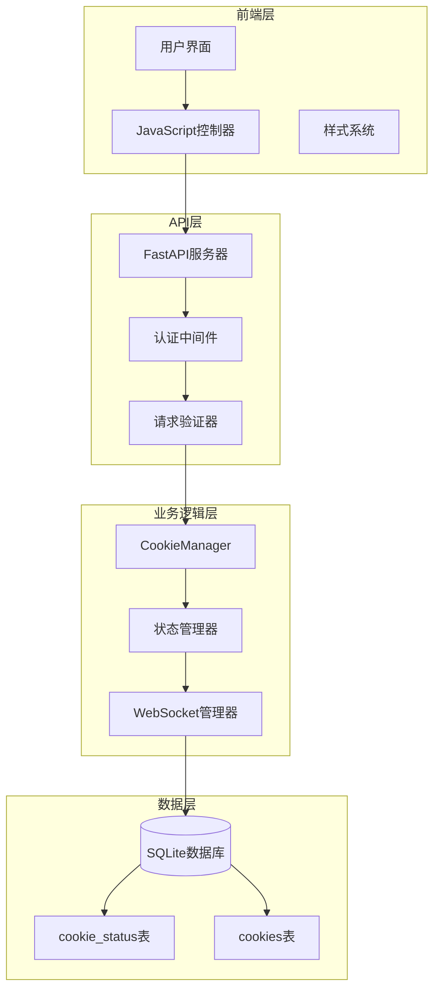
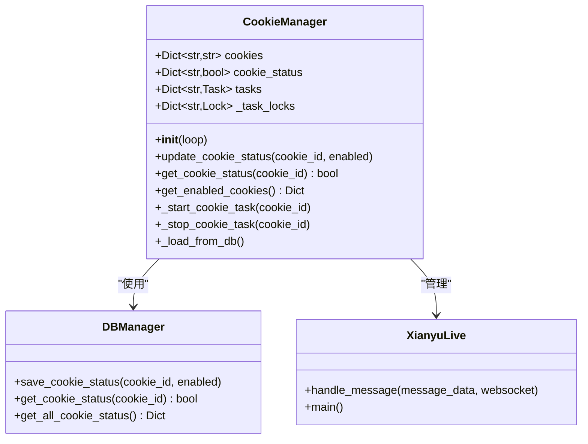
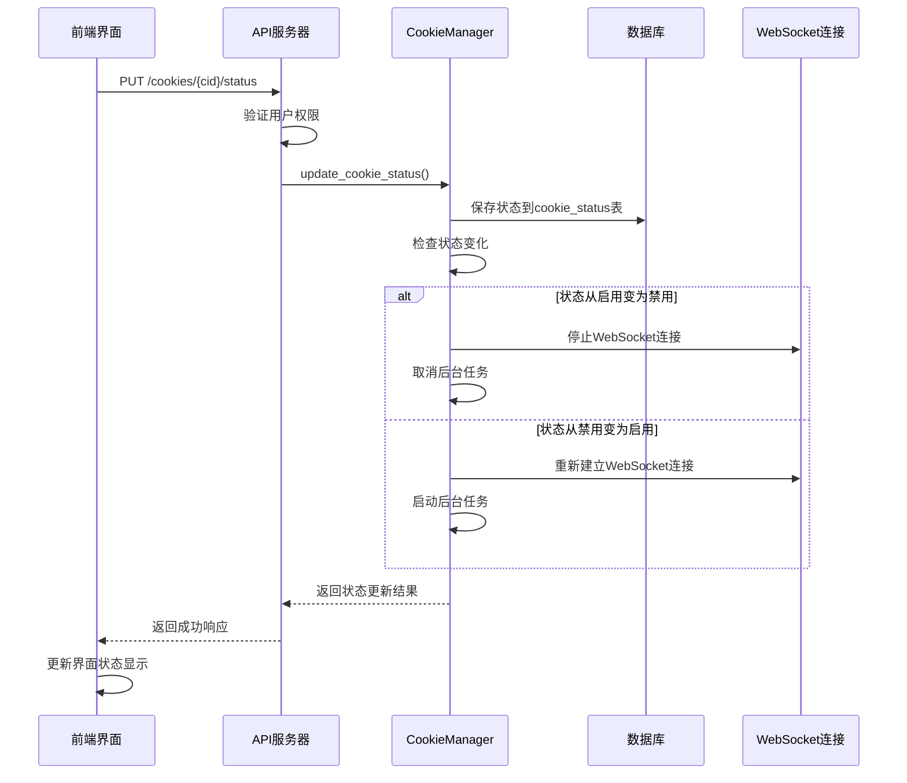
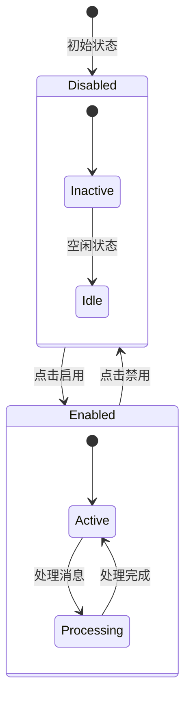
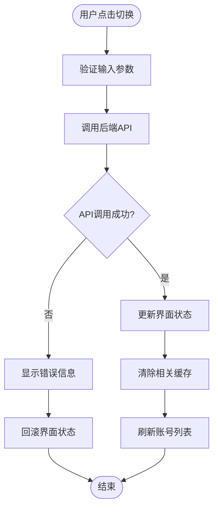
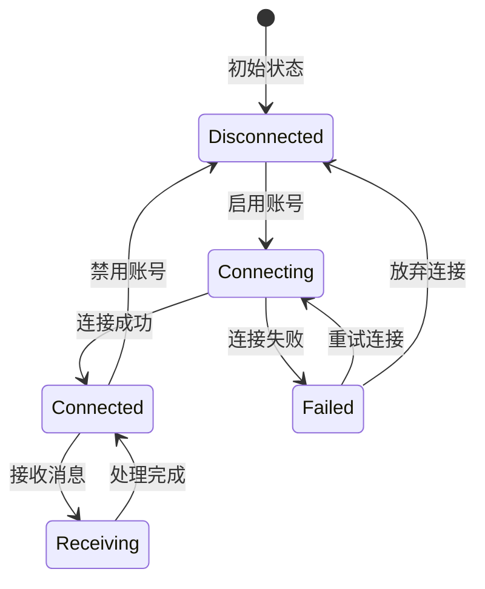
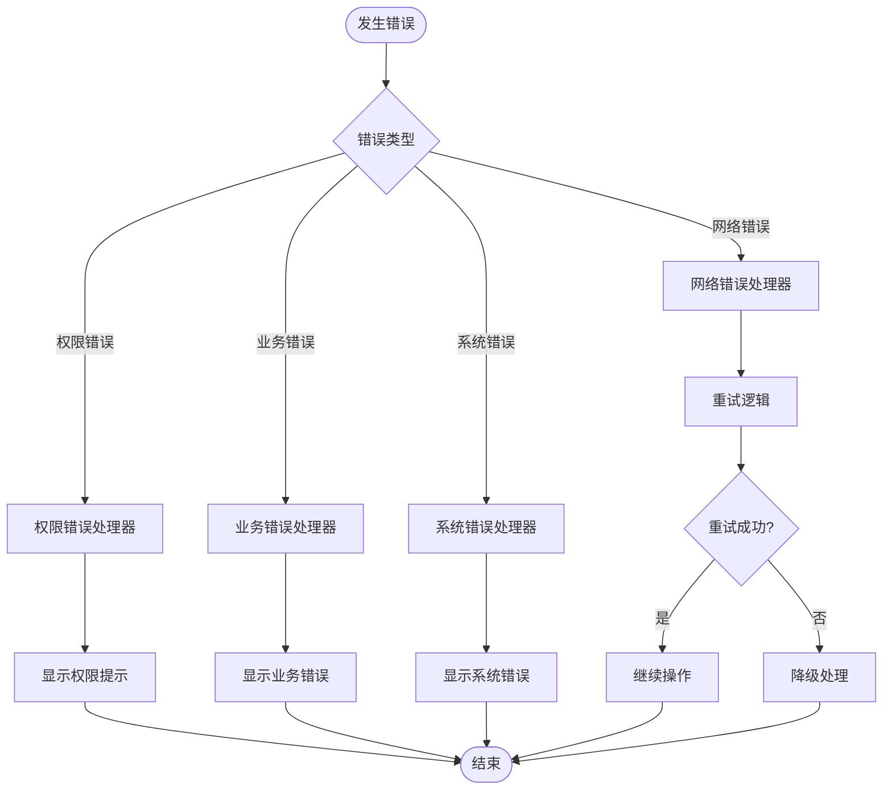

# Cookie状态控制接口详细文档

<cite>
**本文档引用的文件**
- [db_manager.py](file://db_manager.py)
- [cookie_manager.py](file://cookie_manager.py)
- [reply_server.py](file://reply_server.py)
- [XianyuAutoAsync.py](file://XianyuAutoAsync.py)
- [static/js/app.js](file://static/js/app.js)
- [static/css/accounts.css](file://static/css/accounts.css)
- [utils/ws_utils.py](file://utils/ws_utils.py)
</cite>

## 目录
1. [简介](#简介)
2. [系统架构概览](#系统架构概览)
3. [数据库表结构](#数据库表结构)
4. [状态管理核心组件](#状态管理核心组件)
5. [API接口详解](#api接口详解)
6. [前端状态控制](#前端状态控制)
7. [WebSocket连接管理](#websocket连接管理)
8. [错误处理机制](#错误处理机制)
9. [最佳实践指南](#最佳实践指南)
10. [故障排除](#故障排除)

## 简介

Cookie状态控制系统是闲鱼自动回复平台的核心功能模块，负责管理多个账号的启用/禁用状态。该系统通过`cookie_status`表维护每个账号的状态信息，并通过前后端协作实现状态的实时切换和同步。

### 主要功能特性

- **账号状态管理**：支持启用和禁用多个闲鱼账号
- **实时状态同步**：前端界面与后端状态实时同步
- **WebSocket连接控制**：禁用账号时自动停止WebSocket连接
- **权限隔离**：基于用户ID的账号访问权限控制
- **错误处理**：完善的错误响应和降级机制

## 系统架构概览



**图表来源**
- [reply_server.py](file://reply_server.py#L1-L200)
- [cookie_manager.py](file://cookie_manager.py#L1-L428)
- [db_manager.py](file://db_manager.py#L1-L800)

## 数据库表结构

### cookie_status表设计

`cookie_status`表是状态控制系统的核心数据结构，专门用于存储和管理账号的启用状态。

| 字段名 | 数据类型 | 约束 | 说明 |
|--------|----------|------|------|
| cookie_id | TEXT | PRIMARY KEY, FOREIGN KEY | 关联的Cookie ID，外键引用cookies表 |
| enabled | BOOLEAN | DEFAULT TRUE | 账号启用状态，true为启用，false为禁用 |
| updated_at | TIMESTAMP | DEFAULT CURRENT_TIMESTAMP | 状态最后更新时间 |

#### 表结构定义

```sql
CREATE TABLE IF NOT EXISTS cookie_status (
    cookie_id TEXT PRIMARY KEY,
    enabled BOOLEAN DEFAULT TRUE,
    updated_at TIMESTAMP DEFAULT CURRENT_TIMESTAMP,
    FOREIGN KEY (cookie_id) REFERENCES cookies(id) ON DELETE CASCADE
)
```

### 状态字段业务含义

- **enabled字段**：布尔值，决定账号是否参与自动回复和消息监听
  - `TRUE`：账号处于启用状态，正常接收消息和执行自动回复
  - `FALSE`：账号处于禁用状态，停止所有活动，不接收消息

**章节来源**
- [db_manager.py](file://db_manager.py#L140-L148)

## 状态管理核心组件

### CookieManager类

CookieManager是状态管理的核心控制器，负责协调前端状态与后端状态的一致性。



**图表来源**
- [cookie_manager.py](file://cookie_manager.py#L10-L428)
- [db_manager.py](file://db_manager.py#L1737-L1764)

### 状态变更流程



**图表来源**
- [cookie_manager.py](file://cookie_manager.py#L304-L323)
- [reply_server.py](file://reply_server.py#L2337-L2356)

**章节来源**
- [cookie_manager.py](file://cookie_manager.py#L304-L323)

## API接口详解

### 状态更新接口

#### 接口定义
```
PUT /cookies/{cid}/status
Content-Type: application/json
Authorization: Bearer {token}

{
    "enabled": true/false
}
```

#### 请求参数

| 参数名 | 类型 | 必需 | 说明 |
|--------|------|------|------|
| cid | string | 是 | Cookie ID，即账号标识符 |
| enabled | boolean | 是 | 目标状态值 |

#### 响应格式

**成功响应 (200 OK)**
```json
{
    "msg": "status updated",
    "enabled": true/false
}
```

**错误响应 (400 Bad Request)**
```json
{
    "detail": "更新Cookie状态失败: Cookie ID不存在"
}
```

**权限错误 (403 Forbidden)**
```json
{
    "detail": "无权限操作该Cookie"
}
```

#### 实现细节

状态更新接口的完整实现包含以下步骤：

1. **权限验证**：检查当前用户是否拥有目标Cookie的操作权限
2. **状态持久化**：将新状态保存到`cookie_status`表
3. **状态同步**：更新内存中的状态缓存
4. **任务管理**：根据状态变化启动或停止相关任务
5. **响应返回**：返回操作结果和当前状态

**章节来源**
- [reply_server.py](file://reply_server.py#L2337-L2356)

### 状态查询接口

#### 接口定义
```
GET /cookies/details
Authorization: Bearer {token}
```

#### 响应格式
```json
[
    {
        "id": "cookie_id_1",
        "value": "cookie_value_1",
        "enabled": true,
        "auto_confirm": true,
        "remark": "备用账号",
        "pause_duration": 10
    },
    {
        "id": "cookie_id_2",
        "value": "cookie_value_2",
        "enabled": false,
        "auto_confirm": true,
        "remark": "",
        "pause_duration": 10
    }
]
```

#### 字段说明

| 字段名 | 类型 | 说明 |
|--------|------|------|
| id | string | Cookie ID |
| value | string | Cookie值 |
| enabled | boolean | 启用状态 |
| auto_confirm | boolean | 自动确认发货状态 |
| remark | string | 账号备注 |
| pause_duration | integer | 自动回复暂停时间(秒) |

**章节来源**
- [reply_server.py](file://reply_server.py#L1153-L1180)

## 前端状态控制

### 状态切换UI组件

前端提供了直观的状态切换界面，采用开关式控件实现状态的快速切换。



**图表来源**
- [static/js/app.js](file://static/js/app.js#L1690-L1795)
- [static/css/accounts.css](file://static/css/accounts.css#L1-L75)

### JavaScript状态管理

前端状态管理通过`toggleAccountStatus`函数实现，该函数负责：

1. **UI状态更新**：即时更新界面显示
2. **API调用**：向后端发送状态更新请求
3. **错误处理**：处理网络错误和业务错误
4. **缓存同步**：确保前端状态与后端状态一致

#### 状态切换流程



**图表来源**
- [static/js/app.js](file://static/js/app.js#L1690-L1795)

### 样式系统

状态切换组件采用现代化的CSS样式，提供良好的用户体验：

- **启用状态**：绿色背景，表示账号活跃
- **禁用状态**：灰色背景，表示账号休眠
- **过渡动画**：平滑的状态切换效果
- **响应式设计**：适配不同屏幕尺寸

**章节来源**
- [static/js/app.js](file://static/js/app.js#L1690-L1795)
- [static/css/accounts.css](file://static/css/accounts.css#L1-L75)

## WebSocket连接管理

### 连接状态监控

系统通过WebSocket连接监听闲鱼平台的消息推送，状态控制直接影响连接的生命周期。



**图表来源**
- [XianyuAutoAsync.py](file://XianyuAutoAsync.py#L711-L727)
- [utils/ws_utils.py](file://utils/ws_utils.py#L1-L43)

### 状态变更对WebSocket的影响

当账号状态发生变化时，系统会自动调整WebSocket连接：

#### 启用账号
- **连接建立**：创建新的WebSocket连接
- **消息监听**：开始接收平台消息
- **任务启动**：激活自动回复和通知功能

#### 禁用账号
- **连接断开**：关闭现有的WebSocket连接
- **消息停止**：不再接收新消息
- **任务暂停**：停止所有相关后台任务

### 消息处理过滤

在消息处理阶段，系统会检查账号状态以决定是否处理消息：

```python
# 消息处理伪代码
async def handle_message(self, message_data, websocket):
    # 检查账号是否启用
    if not cookie_manager.get_cookie_status(self.cookie_id):
        logger.warning(f"账号已禁用，跳过消息处理")
        return
    # 处理启用状态下的消息...
```

**章节来源**
- [XianyuAutoAsync.py](file://XianyuAutoAsync.py#L7173-L7180)

## 错误处理机制

### 常见错误场景

#### 1. 操作不存在的Cookie账号

**错误响应**
```json
{
    "detail": "Cookie ID不存在"
}
```

**处理策略**：
- 前端显示友好的错误提示
- 禁用相关操作按钮
- 提供重试机制

#### 2. 权限不足错误

**错误响应**
```json
{
    "detail": "无权限操作该Cookie"
}
```

**处理策略**：
- 显示权限不足提示
- 导航到权限申请页面
- 记录安全审计日志

#### 3. 数据库操作失败

**错误响应**
```json
{
    "detail": "更新Cookie状态失败: 数据库连接异常"
}
```

**处理策略**：
- 降级到前端模拟状态
- 提供离线模式支持
- 记录详细错误日志

### 错误处理流程



**章节来源**
- [reply_server.py](file://reply_server.py#L2355-L2356)
- [static/js/app.js](file://static/js/app.js#L1741-L1755)

## 最佳实践指南

### 状态管理最佳实践

#### 1. 状态一致性保证
- 使用事务确保数据库操作的原子性
- 实现状态缓存同步机制
- 定期验证前后端状态一致性

#### 2. 性能优化建议
- 缓存常用的状态查询结果
- 批量处理状态更新操作
- 使用连接池管理数据库连接

#### 3. 用户体验优化
- 提供状态变更的进度反馈
- 实现状态变更的撤销功能
- 显示状态变更的历史记录

### 安全考虑

#### 1. 权限控制
- 实施严格的用户权限验证
- 记录所有状态变更操作日志
- 支持角色基础的访问控制

#### 2. 数据保护
- 加密敏感的状态信息
- 实现数据备份和恢复机制
- 定期清理过期的状态记录

### 监控和告警

#### 1. 关键指标监控
- 状态变更频率统计
- WebSocket连接成功率
- API响应时间监控

#### 2. 告警机制
- 状态变更异常告警
- 连接断开告警
- 性能瓶颈告警

## 故障排除

### 常见问题及解决方案

#### 1. 状态无法更新
**症状**：前端显示状态已更改，但实际状态未改变

**排查步骤**：
1. 检查网络连接状态
2. 验证API响应结果
3. 查看后端日志信息
4. 确认数据库更新情况

**解决方案**：
- 重新发起状态更新请求
- 检查数据库连接状态
- 清除浏览器缓存

#### 2. WebSocket连接异常
**症状**：启用账号后无法接收消息

**排查步骤**：
1. 检查账号状态是否正确启用
2. 验证WebSocket连接状态
3. 查看消息处理日志
4. 确认网络防火墙设置

**解决方案**：
- 重新启动账号任务
- 检查网络连接
- 重启服务进程

#### 3. 前端状态显示错误
**症状**：界面显示的状态与实际状态不一致

**排查步骤**：
1. 刷新页面重新加载状态
2. 检查前端缓存机制
3. 验证API响应数据
4. 查看浏览器控制台错误

**解决方案**：
- 清除前端缓存
- 强制刷新页面
- 检查网络请求状态

### 调试工具和技巧

#### 1. 日志分析
- 启用详细的调试日志
- 分析状态变更的时间戳
- 跟踪错误传播路径

#### 2. 网络监控
- 使用浏览器开发者工具
- 监控API请求和响应
- 分析WebSocket通信过程

#### 3. 数据库检查
- 查询`cookie_status`表状态
- 验证外键约束完整性
- 检查数据一致性

**章节来源**
- [db_manager.py](file://db_manager.py#L1737-L1764)
- [cookie_manager.py](file://cookie_manager.py#L304-L323)