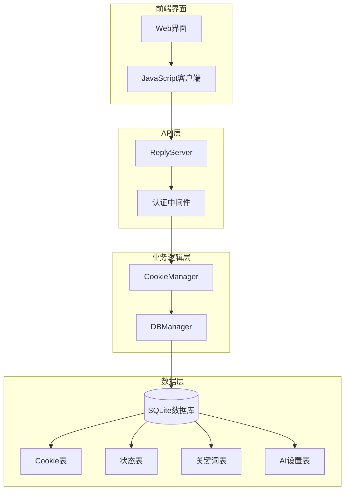
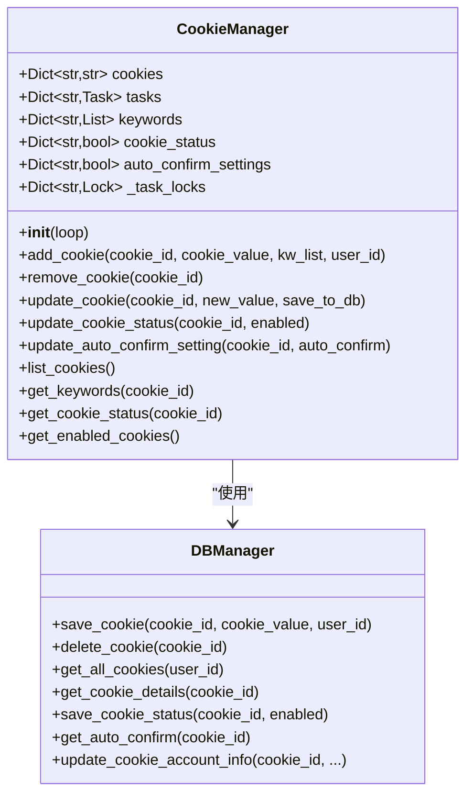
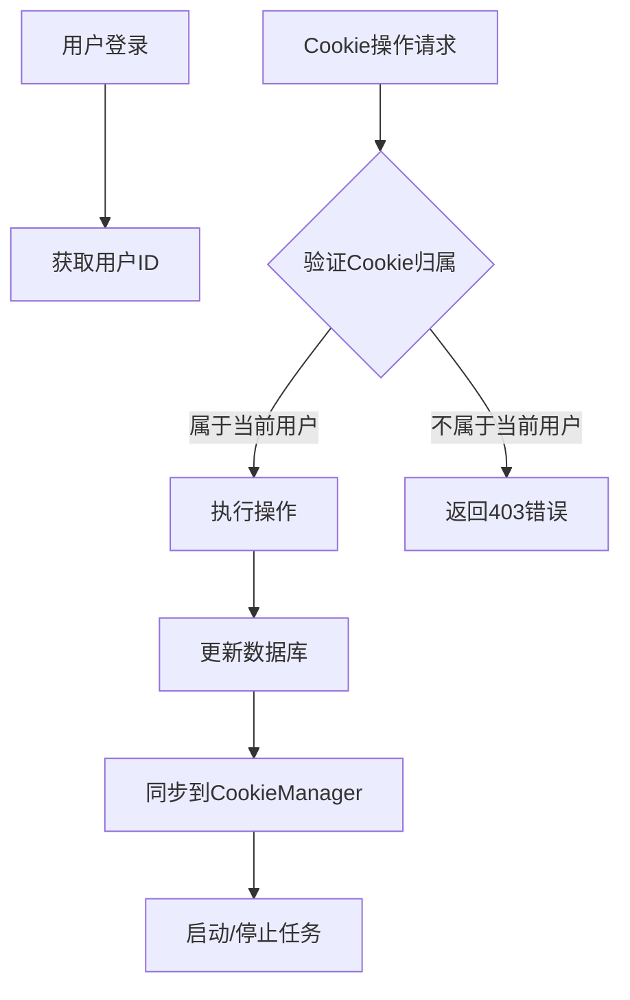
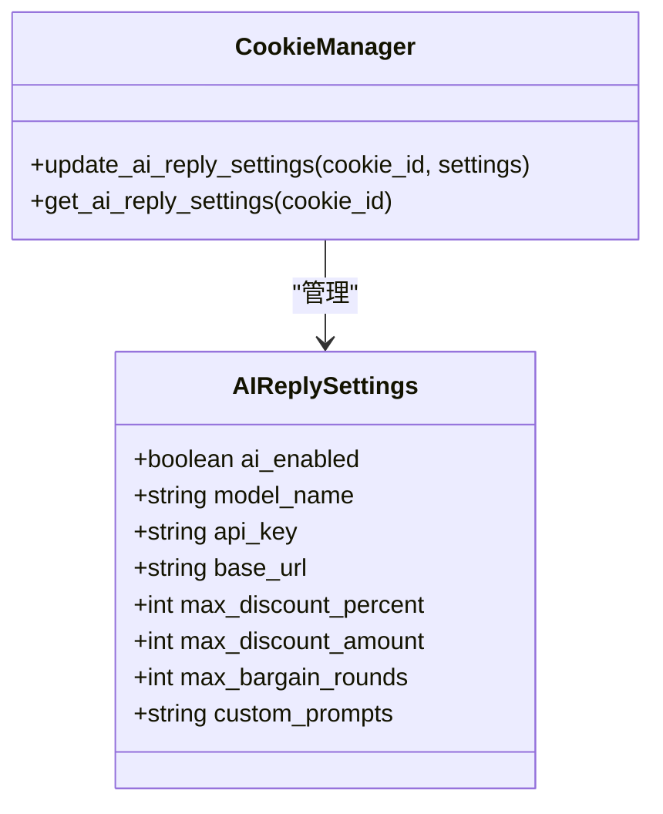

# Cookie账号管理接口

<cite>
**本文档引用的文件**
- [cookie_manager.py](file://cookie_manager.py)
- [db_manager.py](file://db_manager.py)
- [reply_server.py](file://reply_server.py)
- [config.py](file://config.py)
- [global_config.yml](file://global_config.yml)
- [static/js/app.js](file://static/js/app.js)
- [static/index.html](file://static/index.html)
</cite>

## 目录
1. [简介](#简介)
2. [系统架构](#系统架构)
3. [核心组件](#核心组件)
4. [API接口详解](#api接口详解)
5. [数据模型与关系](#数据模型与关系)
6. [用户权限与数据隔离](#用户权限与数据隔离)
7. [高级功能配置](#高级功能配置)
8. [批量操作支持](#批量操作支持)
9. [请求响应示例](#请求响应示例)
10. [故障排除指南](#故障排除指南)

## 简介

闲鱼自动回复系统提供了完整的Cookie账号管理接口，支持多账号的增删改查、状态管理、备注维护和批量操作等功能。系统采用基于用户ID的数据隔离机制，确保不同用户之间的账号数据完全独立。

### 主要特性

- **多账号管理**：支持同时管理多个闲鱼账号
- **数据隔离**：基于用户ID的严格数据隔离机制
- **状态控制**：灵活的启用/禁用状态管理
- **高级配置**：支持自动确认、暂停时长等高级功能
- **批量操作**：提供批量添加、删除和状态更新功能
- **AI集成**：内置AI回复引擎配置支持

## 系统架构



**图表来源**
- [cookie_manager.py](file://cookie_manager.py#L10-L50)
- [db_manager.py](file://db_manager.py#L16-L70)
- [reply_server.py](file://reply_server.py#L1-L50)

## 核心组件

### CookieManager - Cookie管理器

CookieManager是系统的核心组件，负责管理所有Cookie账号的生命周期：



**图表来源**
- [cookie_manager.py](file://cookie_manager.py#L10-L50)
- [db_manager.py](file://db_manager.py#L16-L70)

**章节来源**
- [cookie_manager.py](file://cookie_manager.py#L10-L428)
- [db_manager.py](file://db_manager.py#L16-L200)

### 数据库管理器

DBManager负责所有数据的持久化存储，支持事务管理和数据一致性保证。

**章节来源**
- [db_manager.py](file://db_manager.py#L16-L800)

## API接口详解

### Cookie账号基础操作

#### 1. 获取所有Cookie列表

**接口**: `GET /cookies`  
**描述**: 获取当前用户的所有Cookie ID列表

**请求参数**: 无  
**响应格式**: `List[str]`

**响应示例**:
```json
[
    "account_001",
    "account_002",
    "account_003"
]
```

#### 2. 获取Cookie详细信息

**接口**: `GET /cookies/details`  
**描述**: 获取所有Cookie的详细信息，包括状态、备注等

**请求参数**: 无  
**响应格式**: `List[CookieDetails]`

**CookieDetails结构**:
```typescript
interface CookieDetails {
    id: string;           // Cookie ID
    value: string;        // Cookie值
    enabled: boolean;     // 启用状态
    auto_confirm: boolean;// 自动确认发货
    remark: string;       // 备注信息
    pause_duration: number; // 暂停时长（分钟）
}
```

**响应示例**:
```json
[
    {
        "id": "account_001",
        "value": "your_cookie_value_here",
        "enabled": true,
        "auto_confirm": true,
        "remark": "主力账号",
        "pause_duration": 10
    }
]
```

#### 3. 添加新Cookie

**接口**: `POST /cookies`  
**描述**: 添加新的Cookie账号并绑定到当前用户

**请求体**:
```typescript
interface CookieIn {
    id: string;      // Cookie ID
    value: string;   // Cookie值
}
```

**响应格式**: `{"msg": "success"}`

**章节来源**
- [reply_server.py](file://reply_server.py#L1141-L1215)

#### 4. 更新Cookie

**接口**: `PUT /cookies/{cid}`  
**描述**: 更新指定Cookie的值

**路径参数**:
- `cid`: Cookie ID

**请求体**:
```typescript
interface CookieIn {
    id: string;
    value: string;
}
```

**响应格式**: `{"msg": "updated"}`

#### 5. 删除Cookie

**接口**: `DELETE /cookies/{cid}`  
**描述**: 删除指定的Cookie账号

**路径参数**:
- `cid`: Cookie ID

**响应格式**: `{"msg": "removed"}`

**章节来源**
- [reply_server.py](file://reply_server.py#L1183-L1299)

### Cookie状态管理

#### 6. 更新启用状态

**接口**: `PUT /cookies/{cid}/status`  
**描述**: 更新Cookie的启用/禁用状态

**路径参数**:
- `cid`: Cookie ID

**请求体**:
```typescript
interface CookieStatusIn {
    enabled: boolean;
}
```

**响应格式**: `{"msg": "status updated", "enabled": boolean}`

#### 7. 获取Cookie状态

**接口**: `GET /cookies/{cid}/status`  
**描述**: 获取指定Cookie的状态

**路径参数**:
- `cid`: Cookie ID

**响应格式**: `boolean`

**章节来源**
- [reply_server.py](file://reply_server.py#L2337-L2357)

### 备注信息管理

#### 8. 更新备注

**接口**: `PUT /cookies/{cid}/remark`  
**描述**: 更新Cookie的备注信息

**路径参数**:
- `cid`: Cookie ID

**请求体**:
```typescript
interface RemarkUpdate {
    remark: string;
}
```

**响应格式**: `{"msg": "remark updated"}`

#### 9. 获取备注

**接口**: `GET /cookies/{cid}/remark`  
**描述**: 获取Cookie的备注信息

**路径参数**:
- `cid`: Cookie ID

**响应格式**: 
```json
{
    "remark": "账号备注信息",
    "message": "获取备注成功"
}
```

**章节来源**
- [reply_server.py](file://reply_server.py#L2889-L2946)

### 自动确认设置

#### 10. 更新自动确认设置

**接口**: `PUT /cookies/{cid}/auto-confirm`  
**描述**: 更新Cookie的自动确认发货设置

**路径参数**:
- `cid`: Cookie ID

**请求体**:
```typescript
interface AutoConfirmUpdate {
    auto_confirm: boolean;
}
```

**响应格式**: `{"msg": "auto confirm updated"}`

#### 11. 获取自动确认设置

**接口**: `GET /cookies/{cid}/auto-confirm`  
**描述**: 获取Cookie的自动确认设置

**路径参数**:
- `cid`: Cookie ID

**响应格式**: 
```json
{
    "auto_confirm": true,
    "message": "自动确认发货当前开启"
}
```

**章节来源**
- [reply_server.py](file://reply_server.py#L2829-L2887)

### 暂停时长配置

#### 12. 更新暂停时长

**接口**: `PUT /cookies/{cid}/pause-duration`  
**描述**: 更新Cookie的自动回复暂停时间

**路径参数**:
- `cid`: Cookie ID

**请求体**:
```typescript
interface PauseDurationUpdate {
    pause_duration: number; // 暂停时长（分钟），0表示不暂停
}
```

**响应格式**: `{"msg": "pause duration updated"}`

**章节来源**
- [reply_server.py](file://reply_server.py#L2948-L3000)

### 账号信息管理

#### 13. 更新账号信息

**接口**: `POST /cookie/{cid}/account-info`  
**描述**: 更新Cookie的账号信息（包括用户名、密码等）

**路径参数**:
- `cid`: Cookie ID

**请求体**:
```typescript
interface CookieAccountInfo {
    value?: string;        // Cookie值
    username?: string;     // 用户名
    password?: string;     // 密码
    show_browser?: boolean;// 显示浏览器
}
```

**响应格式**: `{"msg": "updated", "success": true}`

#### 14. 获取账号详情

**接口**: `GET /cookie/{cid}/details`  
**描述**: 获取Cookie的详细信息

**路径参数**:
- `cid`: Cookie ID

**响应格式**: 
```json
{
    "id": "account_001",
    "value": "cookie_value",
    "username": "user@example.com",
    "password": "",
    "show_browser": false,
    "remark": "主力账号",
    "pause_duration": 10,
    "auto_confirm": true
}
```

**章节来源**
- [reply_server.py](file://reply_server.py#L1262-L1331)

## 数据模型与关系

### 数据库表结构

```mermaid
erDiagram
USERS {
int id PK
string username UK
string email UK
string password_hash
boolean is_active
timestamp created_at
timestamp updated_at
}
COOKIES {
string id PK
string value
int user_id FK
int auto_confirm
string remark
int pause_duration
string username
string password
int show_browser
timestamp created_at
foreign key (user_id) references USERS(id)
}
COOKIE_STATUS {
string cookie_id PK
boolean enabled
timestamp updated_at
foreign key (cookie_id) references COOKIES(id)
}
KEYWORDS {
string cookie_id FK
string keyword
string reply
string item_id
string type
string image_url
foreign key (cookie_id) references COOKIES(id)
}
AI_REPLY_SETTINGS {
string cookie_id PK
boolean ai_enabled
string model_name
string api_key
string base_url
int max_discount_percent
int max_discount_amount
int max_bargain_rounds
string custom_prompts
timestamp created_at
timestamp updated_at
foreign key (cookie_id) references COOKIES(id)
}
USERS ||--o{ COOKIES : owns
COOKIES ||--o{ COOKIE_STATUS : has
COOKIES ||--o{ KEYWORDS : contains
COOKIES ||--o{ AI_REPLY_SETTINGS : has
```

**图表来源**
- [db_manager.py](file://db_manager.py#L74-L166)

### 关键字段说明

| 表名 | 字段名 | 类型 | 描述 |
|------|--------|------|------|
| COOKIES | id | TEXT | Cookie唯一标识符 |
| COOKIES | value | TEXT | 实际的Cookie值 |
| COOKIES | user_id | INTEGER | 关联的用户ID |
| COOKIES | auto_confirm | INTEGER | 自动确认发货（0/1） |
| COOKIES | remark | TEXT | 备注信息 |
| COOKIES | pause_duration | INTEGER | 暂停时长（分钟） |
| COOKIES | username | TEXT | 登录用户名 |
| COOKIES | password | TEXT | 登录密码 |
| COOKIES | show_browser | INTEGER | 是否显示浏览器 |

**章节来源**
- [db_manager.py](file://db_manager.py#L110-L123)

## 用户权限与数据隔离

### 数据隔离机制

系统采用基于用户ID的严格数据隔离机制，确保不同用户之间的账号数据完全独立：



**图表来源**
- [reply_server.py](file://reply_server.py#L1183-L1215)

### 权限验证流程

1. **用户认证**: 通过JWT令牌验证用户身份
2. **Cookie归属检查**: 验证操作的Cookie是否属于当前用户
3. **权限拒绝**: 如不匹配，返回403 Forbidden错误

**章节来源**
- [reply_server.py](file://reply_server.py#L1183-L1299)

## 高级功能配置

### AI回复设置

系统支持为每个Cookie账号配置独立的AI回复设置：



**图表来源**
- [reply_server.py](file://reply_server.py#L2360-L2450)

### AI回复配置选项

| 配置项 | 类型 | 默认值 | 描述 |
|--------|------|--------|------|
| ai_enabled | boolean | false | 是否启用AI回复 |
| model_name | string | qwen-plus | AI模型名称 |
| api_key | string | "" | API密钥 |
| base_url | string | https://dashscope.aliyuncs.com/compatible-mode/v1 | API基础URL |
| max_discount_percent | integer | 10 | 最大折扣百分比 |
| max_discount_amount | integer | 100 | 最大折扣金额 |
| max_bargain_rounds | integer | 3 | 最大议价轮次 |
| custom_prompts | string | "" | 自定义提示词 |

**章节来源**
- [reply_server.py](file://reply_server.py#L2360-L2559)

### 自动确认发货

自动确认发货功能允许系统在收到买家确认收货后自动确认发货：

- **启用条件**: 买家确认收货且订单状态符合要求
- **配置方式**: 通过`/cookies/{cid}/auto-confirm`接口设置
- **影响范围**: 影响所有通过该Cookie账号处理的订单

### 暂停时长配置

暂停时长功能用于控制自动回复的时间间隔：

- **单位**: 分钟
- **特殊值**: 0表示不暂停
- **默认值**: 10分钟
- **应用场景**: 防止频繁回复导致账号被封

**章节来源**
- [cookie_manager.py](file://cookie_manager.py#L407-L426)

## 批量操作支持

### 批量添加Cookie

目前系统支持单个Cookie的添加操作，未来计划扩展批量添加功能：

```javascript
// 示例：批量添加Cookie（伪代码）
async function batchAddCookies(cookiesArray) {
    const results = [];
    for (const cookie of cookiesArray) {
        try {
            const response = await fetch('/cookies', {
                method: 'POST',
                body: JSON.stringify(cookie)
            });
            results.push({id: cookie.id, success: true});
        } catch (error) {
            results.push({id: cookie.id, success: false, error: error.message});
        }
    }
    return results;
}
```

### 批量状态更新

```javascript
// 示例：批量更新Cookie状态（伪代码）
async function batchUpdateStatus(cookiesIds, enabled) {
    const results = [];
    for (const id of cookiesIds) {
        try {
            const response = await fetch(`/cookies/${id}/status`, {
                method: 'PUT',
                body: JSON.stringify({enabled})
            });
            results.push({id, success: true});
        } catch (error) {
            results.push({id, success: false, error: error.message});
        }
    }
    return results;
}
```

### 批量删除

```javascript
// 示例：批量删除Cookie（伪代码）
async function batchDeleteCookies(cookiesIds) {
    const results = [];
    for (const id of cookiesIds) {
        try {
            const response = await fetch(`/cookies/${id}`, {
                method: 'DELETE'
            });
            results.push({id, success: true});
        } catch (error) {
            results.push({id, success: false, error: error.message});
        }
    }
    return results;
}
```

## 请求响应示例

### 成功响应示例

#### 添加Cookie成功
```http
POST /cookies HTTP/1.1
Content-Type: application/json
Authorization: Bearer your_token_here

{
    "id": "account_001",
    "value": "your_cookie_value_here"
}
```

```http
HTTP/1.1 200 OK
Content-Type: application/json

{
    "msg": "success"
}
```

#### 更新Cookie状态
```http
PUT /cookies/account_001/status HTTP/1.1
Content-Type: application/json
Authorization: Bearer your_token_here

{
    "enabled": false
}
```

```http
HTTP/1.1 200 OK
Content-Type: application/json

{
    "msg": "status updated",
    "enabled": false
}
```

#### 获取Cookie详情
```http
GET /cookies/details HTTP/1.1
Authorization: Bearer your_token_here
```

```http
HTTP/1.1 200 OK
Content-Type: application/json

[
    {
        "id": "account_001",
        "value": "your_cookie_value_here",
        "enabled": true,
        "auto_confirm": true,
        "remark": "主力账号",
        "pause_duration": 10
    }
]
```

### 错误响应示例

#### Cookie ID冲突
```http
POST /cookies HTTP/1.1
Content-Type: application/json
Authorization: Bearer your_token_here

{
    "id": "account_001",
    "value": "another_cookie_value"
}
```

```http
HTTP/1.1 400 Bad Request
Content-Type: application/json

{
    "detail": "该Cookie ID已被其他用户使用"
}
```

#### 权限不足
```http
PUT /cookies/account_001/status HTTP/1.1
Content-Type: application/json
Authorization: Bearer wrong_token_here

{
    "enabled": false
}
```

```http
HTTP/1.1 403 Forbidden
Content-Type: application/json

{
    "detail": "无权限操作该Cookie"
}
```

#### Cookie不存在
```http
GET /cookies/nonexistent/status HTTP/1.1
Authorization: Bearer your_token_here
```

```http
HTTP/1.1 404 Not Found
Content-Type: application/json

{
    "detail": "账号不存在"
}
```

## 故障排除指南

### 常见问题及解决方案

#### 1. Cookie验证失败

**症状**: 添加Cookie后无法正常工作
**原因**: Cookie值过期或格式不正确
**解决方法**:
- 检查Cookie值的有效性
- 重新登录闲鱼获取新的Cookie
- 确保Cookie值包含所有必需的字段

#### 2. 数据隔离问题

**症状**: 可以看到其他用户的Cookie
**原因**: 用户权限验证失效
**解决方法**:
- 检查JWT令牌的有效性
- 确认用户认证流程正常
- 验证数据库中user_id字段正确

#### 3. 任务启动失败

**症状**: 添加Cookie后任务没有启动
**原因**: 事件循环问题或依赖服务不可用
**解决方法**:
- 检查系统日志中的错误信息
- 验证数据库连接状态
- 确认相关服务正常运行

#### 4. 状态同步问题

**症状**: 修改状态后界面没有更新
**原因**: 前端缓存或WebSocket连接问题
**解决方法**:
- 刷新页面重新加载数据
- 检查WebSocket连接状态
- 清除浏览器缓存

### 调试工具

#### 日志配置
系统支持多种日志级别配置：
```yaml
LOG_CONFIG:
  level: DEBUG  # 可选: DEBUG, INFO, WARNING, ERROR
  format: "<green>{time:YYYY-MM-DD HH:mm:ss.SSS}</green> | <level>{level: <8}</level> | <cyan>{name}</cyan>:<cyan>{function}</cyan>:<cyan>{line}</cyan> - <level>{message}</level>"
  rotation: 1 day
  retention: 7 days
```

#### 性能监控
- 监控Cookie任务的启动和停止时间
- 跟踪数据库查询性能
- 检查内存使用情况

**章节来源**
- [config.py](file://config.py#L48-L55)
- [global_config.yml](file://global_config.yml#L49-L56)

### API限制

#### 请求频率限制
- 单个Cookie的操作建议间隔至少1秒
- 批量操作建议分批执行，每批不超过10个

#### 数据大小限制
- Cookie值最大长度：65535字符
- 备注信息最大长度：255字符
- 关键词和回复内容长度限制

### 安全注意事项

1. **Cookie保护**: 不要在前端显示完整的Cookie值
2. **权限验证**: 确保所有操作都经过用户权限验证
3. **数据加密**: 敏感信息（如密码）应加密存储
4. **审计日志**: 记录所有重要操作的审计日志

## 结论

闲鱼自动回复系统的Cookie账号管理接口提供了完整的企业级功能，支持多账号管理、数据隔离、状态控制和高级配置。通过RESTful API设计，系统具有良好的可扩展性和易用性，能够满足不同规模用户的需求。

系统的设计充分考虑了安全性、可靠性和性能，采用了严格的权限验证机制和数据隔离策略，确保用户数据的安全性和隐私保护。同时，丰富的配置选项和灵活的API设计使得系统能够适应各种复杂的业务场景。