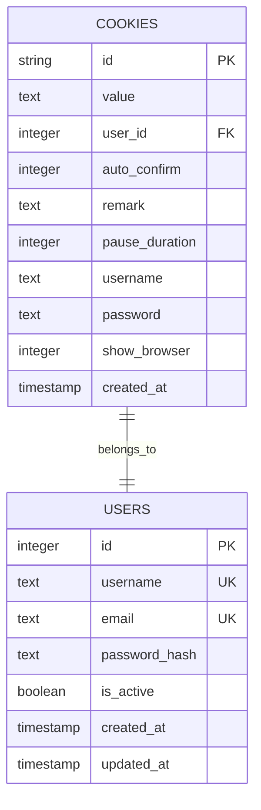
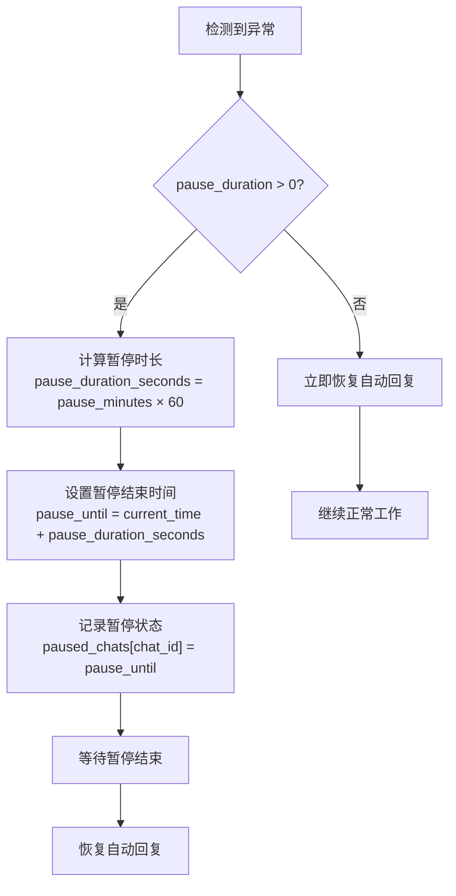
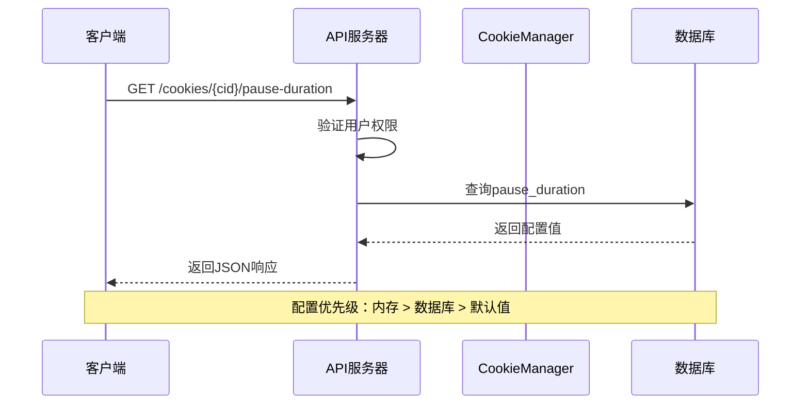
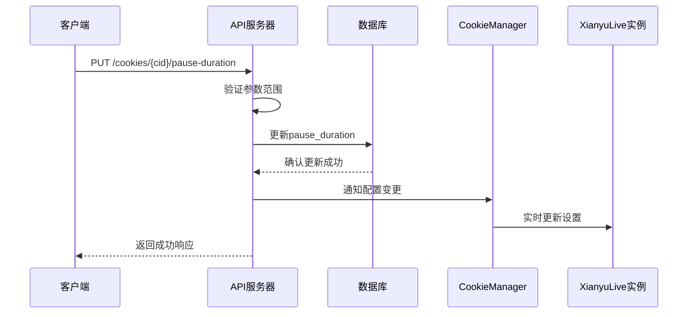
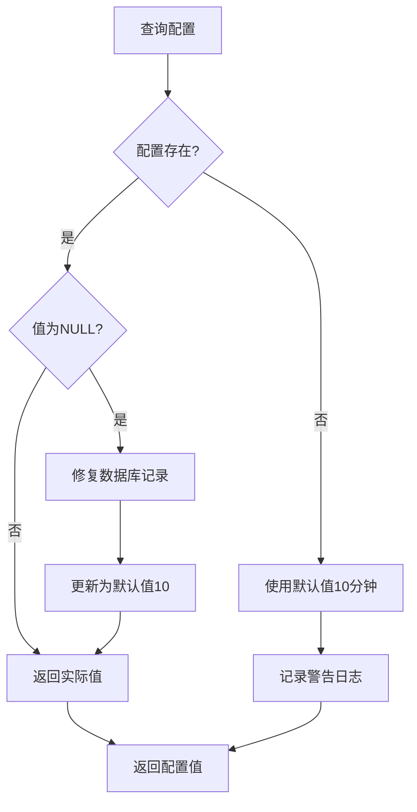
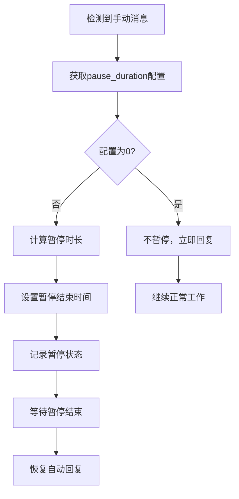
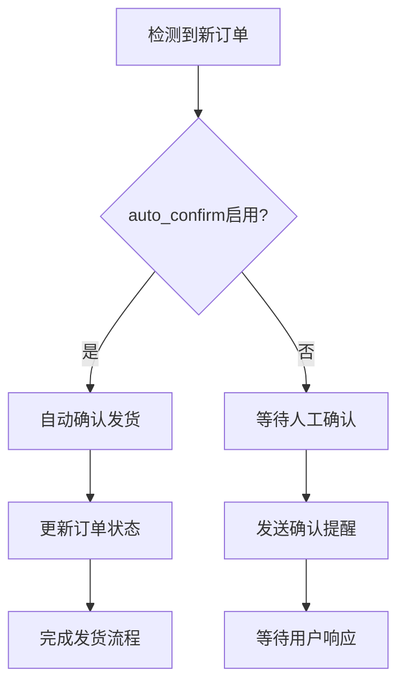

# Cookie高级配置接口详细文档

<cite>
**本文档引用的文件**
- [db_manager.py](file://db_manager.py)
- [cookie_manager.py](file://cookie_manager.py)
- [reply_server.py](file://reply_server.py)
- [XianyuAutoAsync.py](file://XianyuAutoAsync.py)
- [config.py](file://config.py)
- [app.js](file://static/js/app.js)
</cite>

## 目录
1. [简介](#简介)
2. [数据库架构](#数据库架构)
3. [核心配置字段](#核心配置字段)
4. [API接口详解](#api接口详解)
5. [配置管理流程](#配置管理流程)
6. [业务规则与约束](#业务规则与约束)
7. [集成与影响](#集成与影响)
8. [故障排除指南](#故障排除指南)
9. [总结](#总结)

## 简介

本系统提供了完整的Cookie高级配置管理功能，主要包含两个核心配置字段：`pause_duration`（账号暂停时长配置）和`auto_confirm`（自动确认设置）。这些配置直接影响系统的自动回复行为和发货流程，为用户提供精细化的运营控制能力。

## 数据库架构

### Cookies表结构



**图表来源**
- [db_manager.py](file://db_manager.py#L110-L123)

### 字段说明

| 字段名 | 类型 | 默认值 | 说明 |
|--------|------|--------|------|
| `pause_duration` | INTEGER | 10 | 账号自动回复暂停时间（分钟），0表示不暂停 |
| `auto_confirm` | INTEGER | 1 | 自动确认发货设置（1开启，0关闭） |

**章节来源**
- [db_manager.py](file://db_manager.py#L115-L117)

## 核心配置字段

### pause_duration 字段

#### 功能描述
`pause_duration`字段控制账号在异常情况后的自动回复暂停时间，主要用于防止频繁触发风控机制。

#### 配置范围
- **最小值**: 0（不暂停）
- **最大值**: 60（60分钟）
- **默认值**: 10分钟

#### 业务逻辑


**图表来源**
- [XianyuAutoAsync.py](file://XianyuAutoAsync.py#L50-L62)

### auto_confirm 字段

#### 功能描述
`auto_confirm`字段控制自动发货流程中的确认设置，决定是否自动确认订单发货。

#### 配置选项
- **1 (开启)**: 自动确认发货，系统自动完成发货确认
- **0 (关闭)**: 手动确认发货，需要人工干预

#### 影响范围
- **自动发货**: 控制是否自动执行发货确认
- **风控处理**: 影响系统的风控策略判断
- **用户体验**: 决定发货流程的自动化程度

**章节来源**
- [XianyuAutoAsync.py](file://XianyuAutoAsync.py#L798-L805)

## API接口详解

### 获取暂停时间配置

#### 接口定义
```http
GET /cookies/{cid}/pause-duration
```

#### 请求参数
- `cid`: Cookie ID（路径参数）

#### 响应格式
```json
{
    "pause_duration": 10,
    "message": "获取暂停时间成功"
}
```

#### 业务规则
- 验证用户权限，确保只能访问自己的Cookie
- 返回实际存储的暂停时间，包括0值（不暂停）
- 错误时返回默认值10分钟

**章节来源**
- [reply_server.py](file://reply_server.py#L2982-L3001)

### 更新暂停时间配置

#### 接口定义
```http
PUT /cookies/{cid}/pause-duration
```

#### 请求体
```json
{
    "pause_duration": 15
}
```

#### 响应格式
```json
{
    "message": "暂停时间更新成功",
    "pause_duration": 15
}
```

#### 参数验证
- **范围检查**: 0 ≤ pause_duration ≤ 60
- **类型检查**: 必须为整数
- **权限验证**: 用户必须拥有该Cookie的访问权限

#### 错误处理
- **400错误**: 参数超出有效范围
- **403错误**: 无权限操作该Cookie
- **500错误**: 数据库操作失败

**章节来源**
- [reply_server.py](file://reply_server.py#L2948-L2975)

### 获取自动确认配置

#### 接口定义
```http
GET /cookies/{cid}/auto-confirm
```

#### 响应格式
```json
{
    "auto_confirm": true,
    "message": "自动确认发货当前开启"
}
```

**章节来源**
- [reply_server.py](file://reply_server.py#L2863-L2882)

### 更新自动确认配置

#### 接口定义
```http
PUT /cookies/{cid}/auto-confirm
```

#### 请求体
```json
{
    "auto_confirm": false
}
```

#### 响应格式
```json
{
    "msg": "success",
    "auto_confirm": false,
    "message": "自动确认发货已关闭"
}
```

#### 实时同步机制
更新配置后，系统会：
1. **数据库更新**: 立即保存到数据库
2. **内存同步**: 通知CookieManager更新内存中的设置
3. **实例通知**: 如果账号正在运行，通知XianyuLive实例更新设置

**章节来源**
- [reply_server.py](file://reply_server.py#L2829-L2856)

## 配置管理流程

### 配置读取流程



**图表来源**
- [reply_server.py](file://reply_server.py#L2982-L3001)
- [cookie_manager.py](file://cookie_manager.py#L414-L424)

### 配置更新流程



**图表来源**
- [reply_server.py](file://reply_server.py#L2948-L2975)
- [cookie_manager.py](file://cookie_manager.py#L414-L424)

**章节来源**
- [reply_server.py](file://reply_server.py#L2948-L2975)
- [cookie_manager.py](file://cookie_manager.py#L414-L424)

## 业务规则与约束

### 配置有效性规则

| 规则类型 | 具体要求 | 违规处理 |
|----------|----------|----------|
| 暂停时间范围 | 0 ≤ pause_duration ≤ 60 | 自动修正为边界值 |
| 自动确认类型 | auto_confirm ∈ {0, 1} | 自动转换为布尔值 |
| 权限验证 | 用户只能操作自己的Cookie | 返回403错误 |
| 数据完整性 | NULL值自动修复 | 使用默认值10分钟 |

### 默认值策略



**图表来源**
- [db_manager.py](file://db_manager.py#L1331-L1351)

### 配置继承机制

系统采用多层次的配置继承策略：

1. **内存配置**: 运行时的最新配置
2. **数据库配置**: 持久化的配置值
3. **默认配置**: 系统预设的默认值

**章节来源**
- [db_manager.py](file://db_manager.py#L1331-L1351)
- [cookie_manager.py](file://cookie_manager.py#L414-L424)

## 集成与影响

### 与自动回复系统的集成

#### 暂停时间的影响


**图表来源**
- [XianyuAutoAsync.py](file://XianyuAutoAsync.py#L50-L62)

### 与自动发货系统的集成

#### 自动确认的影响


**图表来源**
- [XianyuAutoAsync.py](file://XianyuAutoAsync.py#L798-L805)

### 与风控处理的关联

#### 风控触发条件
- **频繁回复**: pause_duration过小可能导致风控
- **异常行为**: auto_confirm设置不当可能触发风控
- **并发限制**: 系统对并发操作有限制

#### 风控缓解策略
- **动态调整**: 根据风控反馈调整配置
- **监控告警**: 监控配置变更对风控的影响
- **日志记录**: 详细记录配置变更和风控事件

**章节来源**
- [XianyuAutoAsync.py](file://XianyuAutoAsync.py#L798-L822)

## 故障排除指南

### 常见问题及解决方案

#### 问题1: 暂停时间设置无效
**症状**: 设置pause_duration后仍立即回复
**原因**: 
- 配置未正确保存到数据库
- CookieManager未及时更新内存配置
- XianyuLive实例未接收配置变更

**解决步骤**:
1. 验证数据库更新: `SELECT pause_duration FROM cookies WHERE id = ?`
2. 检查CookieManager状态: 查看内存中的配置值
3. 重启相关实例: 确保配置变更生效

#### 问题2: 自动确认设置不生效
**症状**: 设置auto_confirm后仍需要手动确认
**原因**:
- 配置更新后未通知XianyuLive实例
- 实例仍在使用旧的配置值
- 权限问题导致配置无法保存

**解决步骤**:
1. 检查配置更新日志
2. 验证实例状态
3. 重新加载配置

#### 问题3: 配置值异常
**症状**: pause_duration显示为NULL或异常值
**原因**:
- 数据库迁移过程中出现错误
- 配置字段损坏
- 默认值修复失败

**解决步骤**:
1. 执行数据库修复脚本
2. 重置为默认值
3. 验证数据完整性

### 监控与诊断

#### 关键指标监控
- **配置更新频率**: 监控配置变更的频率
- **成功率**: 记录配置更新的成功率
- **错误率**: 跟踪各类错误的发生率
- **性能影响**: 监控配置变更对系统性能的影响

#### 日志分析
系统提供详细的日志记录，包括：
- 配置变更的时间戳
- 操作用户信息
- 配置前后的值对比
- 错误堆栈信息

**章节来源**
- [db_manager.py](file://db_manager.py#L1331-L1351)
- [cookie_manager.py](file://cookie_manager.py#L414-L424)

## 总结

Cookie高级配置接口提供了完整的账号控制能力，通过`pause_duration`和`auto_confirm`两个核心字段，实现了精细化的运营控制。系统采用多层次的配置管理策略，确保配置的可靠性、一致性和实时性。

### 主要特性
- **灵活的配置范围**: 支持0-60分钟的暂停时间和开/关的自动确认
- **实时同步机制**: 配置变更立即生效，无需重启服务
- **完善的错误处理**: 自动修复异常值，提供默认配置
- **严格的权限控制**: 确保用户只能操作自己的配置
- **详细的日志记录**: 提供完整的审计跟踪

### 最佳实践建议
1. **合理设置暂停时间**: 根据业务需求平衡用户体验和风控风险
2. **谨慎使用自动确认**: 在确保系统稳定后再启用自动确认功能
3. **定期监控配置状态**: 确保配置按预期工作
4. **备份重要配置**: 在重大变更前备份当前配置

通过合理的配置管理和监控，可以最大化系统的自动化能力，同时确保业务的稳定性和安全性。