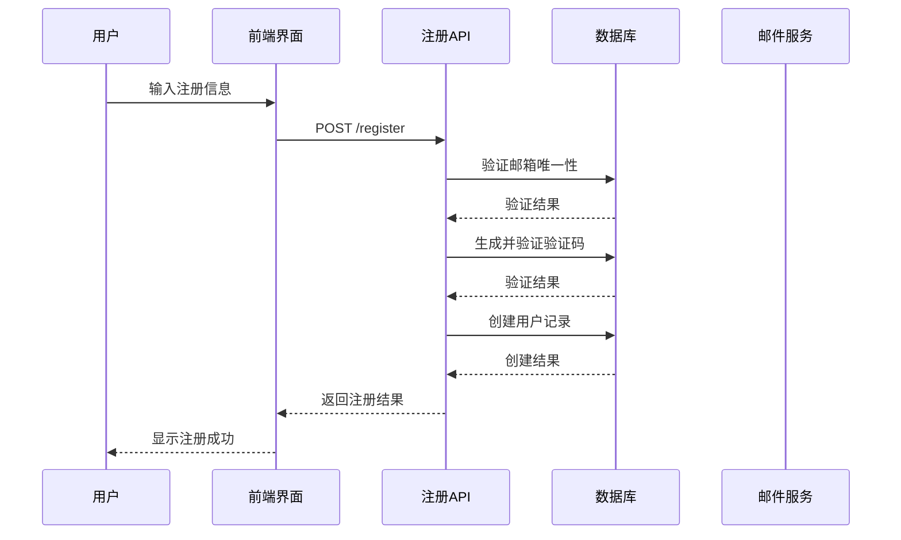
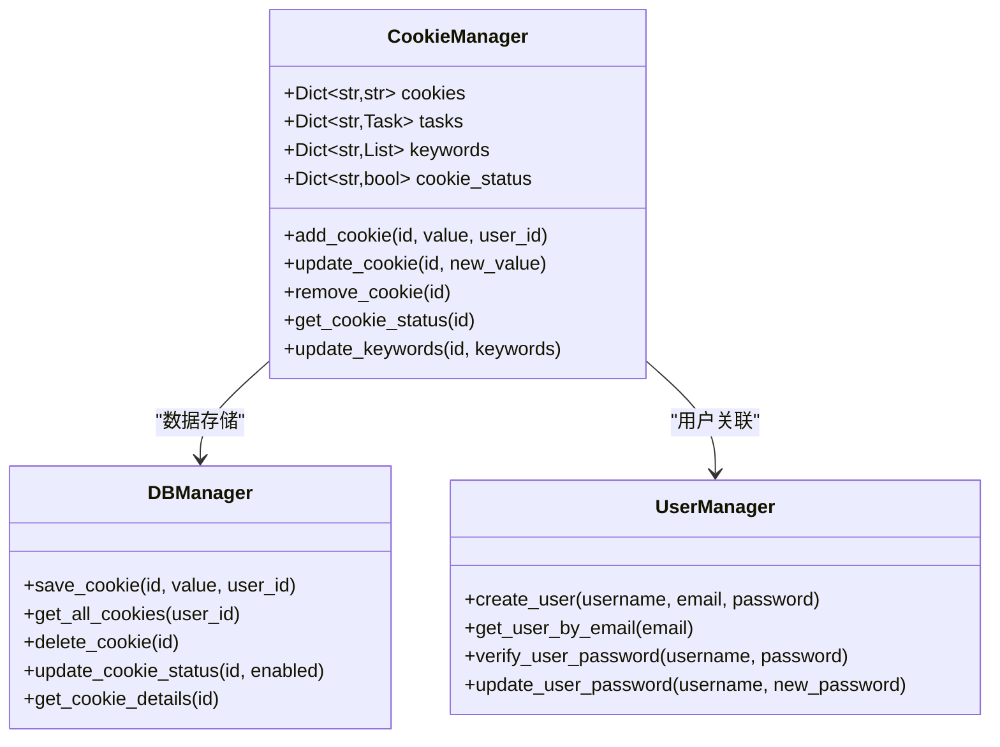
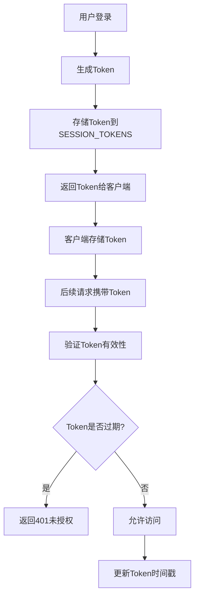
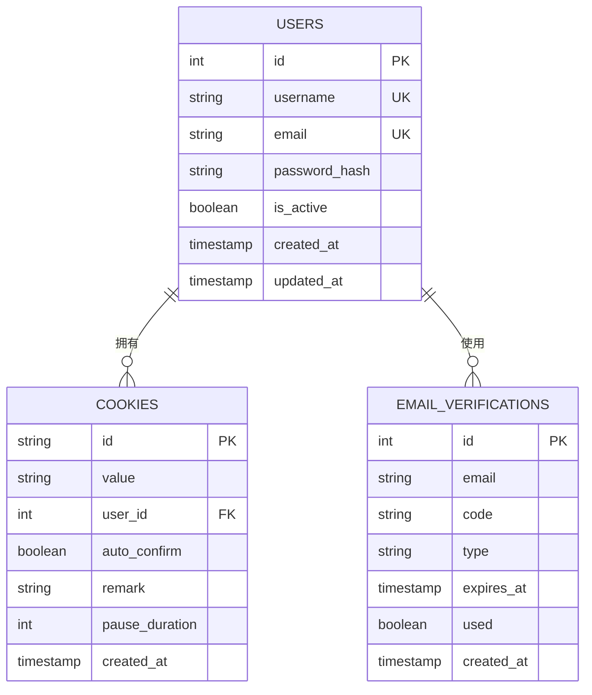
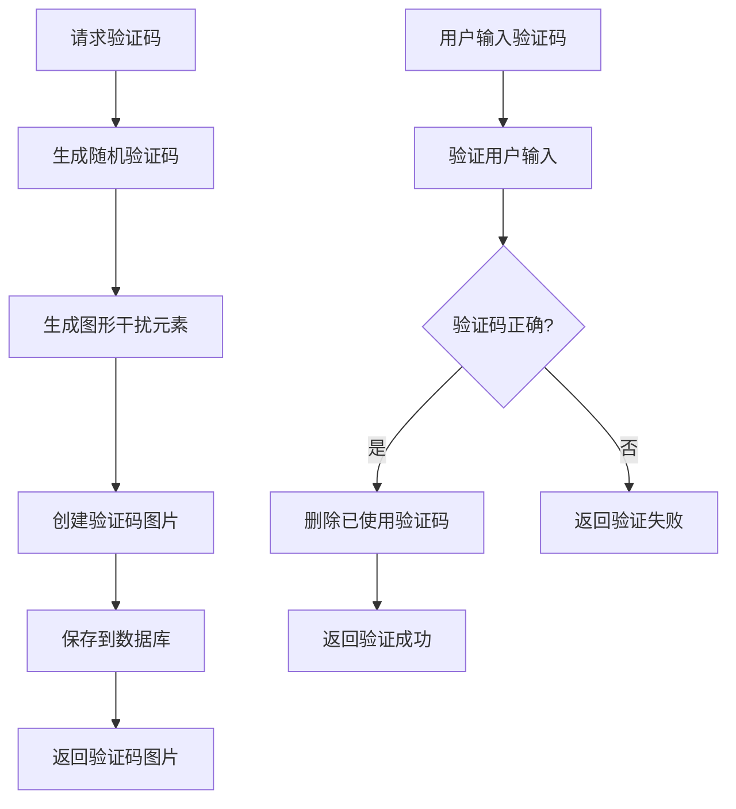

# 用户与账号管理接口

<cite>
**本文档引用的文件**
- [Start.py](file://Start.py)
- [reply_server.py](file://reply_server.py)
- [cookie_manager.py](file://cookie_manager.py)
- [db_manager.py](file://db_manager.py)
- [config.py](file://config.py)
- [static/register.html](file://static/register.html)
- [static/login.html](file://static/login.html)
- [static/index.html](file://static/index.html)
- [static/js/app.js](file://static/js/app.js)
</cite>

## 目录
1. [系统概述](#系统概述)
2. [用户注册与验证机制](#用户注册与验证机制)
3. [Cookie账号管理](#cookie账号管理)
4. [安全认证体系](#安全认证体系)
5. [API接口详解](#api接口详解)
6. [数据隔离与权限控制](#数据隔离与权限控制)
7. [验证码系统](#验证码系统)
8. [批量管理功能](#批量管理功能)
9. [故障排除指南](#故障排除指南)

## 系统概述

闲鱼自动回复系统采用多层架构设计，提供完整的用户与账号管理功能。系统支持多种登录方式，具备完善的安全防护机制和数据隔离功能。

### 核心特性
- **多用户支持**：每个用户拥有独立的账号空间
- **多种登录方式**：支持用户名密码、邮箱验证码、扫码登录
- **Cookie管理**：完整的Cookie生命周期管理
- **安全防护**：完善的验证码机制和权限控制
- **批量操作**：支持批量添加、修改、删除账号

## 用户注册与验证机制

### 注册流程架构



**图表来源**
- [reply_server.py](file://reply_server.py#L843-L905)
- [db_manager.py](file://db_manager.py#L2657-L2705)

### 注册接口规范

#### 请求格式
```json
{
  "username": "用户名",
  "email": "邮箱地址",
  "password": "密码",
  "verification_code": "验证码"
}
```

#### 响应格式
```json
{
  "success": true,
  "message": "注册成功，请登录"
}
```

### 邮箱验证机制

系统采用双重验证机制确保邮箱有效性：

1. **邮箱唯一性检查**：注册前验证邮箱未被占用
2. **验证码时效性**：验证码有效期10分钟
3. **防刷机制**：限制同一邮箱频繁注册

**章节来源**
- [reply_server.py](file://reply_server.py#L843-L905)
- [db_manager.py](file://db_manager.py#L2657-L2705)

## Cookie账号管理

### 账号管理架构



**图表来源**
- [cookie_manager.py](file://cookie_manager.py#L10-L428)
- [db_manager.py](file://db_manager.py#L16-L800)

### 账号增删改查操作

#### 添加账号
```python
# 接口路径：POST /cookies
# 参数：
{
    "id": "账号唯一标识",
    "value": "Cookie值"
}
```

#### 更新账号
```python
# 接口路径：PUT /cookies/{cid}
# 参数：
{
    "id": "账号ID",
    "value": "新的Cookie值"
}
```

#### 删除账号
```python
# 接口路径：DELETE /cookies/{cid}
```

#### 查询账号详情
```python
# 接口路径：GET /cookies/details
# 返回：包含所有账号的详细信息列表
```

**章节来源**
- [reply_server.py](file://reply_server.py#L1142-L1330)
- [cookie_manager.py](file://cookie_manager.py#L184-L212)

## 安全认证体系

### Token认证机制

系统采用基于JWT的Token认证机制，提供以下安全特性：



**图表来源**
- [reply_server.py](file://reply_server.py#L178-L220)

### 权限控制层次

1. **用户级别权限**：每个用户只能访问自己的账号数据
2. **管理员权限**：管理员可以访问所有用户的数据
3. **会话隔离**：不同用户的会话相互隔离

### 安全防护措施

- **Token过期机制**：24小时自动过期
- **会话管理**：支持登出和会话清理
- **权限验证**：每个API都进行权限检查
- **CSRF防护**：通过Token验证防止跨站攻击

**章节来源**
- [reply_server.py](file://reply_server.py#L178-L220)
- [reply_server.py](file://reply_server.py#L542-L679)

## API接口详解

### 用户认证接口

#### 登录接口
```python
# POST /login
# 支持多种登录方式
# 参数：username/password 或 email/password 或 email/verification_code
```

#### 注册接口
```python
# POST /register
# 参数：username, email, password, verification_code
```

#### 验证Token
```python
# GET /verify
# 返回：认证状态和用户信息
```

#### 登出接口
```python
# POST /logout
```

### Cookie管理接口

#### 获取账号列表
```python
# GET /cookies
# 返回：当前用户的所有账号ID列表
```

#### 获取账号详情
```python
# GET /cookies/details
# 返回：包含Cookie值、状态、备注等详细信息
```

#### 添加账号
```python
# POST /cookies
# 参数：id, value
```

#### 更新账号
```python
# PUT /cookies/{cid}
# 参数：id, value
```

#### 删除账号
```python
# DELETE /cookies/{cid}
```

### 验证码接口

#### 生成图形验证码
```python
# POST /generate-captcha
# 参数：session_id
# 返回：base64编码的验证码图片
```

#### 验证图形验证码
```python
# POST /verify-captcha
# 参数：session_id, captcha_code
```

#### 发送邮箱验证码
```python
# POST /send-verification-code
# 参数：email, session_id, type
# type: 'register' | 'login'
```

**章节来源**
- [reply_server.py](file://reply_server.py#L542-L1330)
- [reply_server.py](file://reply_server.py#L708-L841)

## 数据隔离与权限控制

### 用户数据隔离机制

系统通过用户ID实现严格的数据隔离：



**图表来源**
- [db_manager.py](file://db_manager.py#L74-L123)

### 权限控制实现

1. **查询权限**：每个查询都会检查用户ID
2. **修改权限**：只有账号所属用户才能修改
3. **删除权限**：删除操作同样受权限控制
4. **数据加密**：敏感信息如密码使用哈希存储

### 多账号管理实现

系统支持为每个账号配置独立的设置：

- **自动确认发货**：每个账号可独立设置
- **回复关键词**：支持账号级别的关键词配置
- **暂停时间**：可为每个账号设置不同的回复间隔
- **备注信息**：支持为账号添加自定义备注

**章节来源**
- [reply_server.py](file://reply_server.py#L1142-L1330)
- [db_manager.py](file://db_manager.py#L16-L800)

## 验证码系统

### 验证码类型与时效性

系统提供多种类型的验证码，每种都有不同的时效性和用途：

| 验证码类型 | 有效期 | 用途 | 生成方式 |
|-----------|--------|------|----------|
| 图形验证码 | 5分钟 | 防止机器人攻击 | 随机字符+干扰线 |
| 邮箱验证码 | 10分钟 | 用户身份验证 | 数字验证码 |
| 登录验证码 | 10分钟 | 登录安全验证 | 数字验证码 |

### 验证码生成算法



**图表来源**
- [db_manager.py](file://db_manager.py#L2575-L2604)
- [db_manager.py](file://db_manager.py#L2606-L2655)

### 验证码安全特性

1. **时效性控制**：过期自动清理
2. **防重放攻击**：验证码使用后立即删除
3. **防暴力破解**：限制验证次数
4. **防机器识别**：复杂的图形干扰

**章节来源**
- [db_manager.py](file://db_manager.py#L2575-L2655)
- [reply_server.py](file://reply_server.py#L708-L841)

## 批量管理功能

### 批量操作支持

系统提供完整的批量管理功能：

#### 批量添加账号
```python
# 支持一次性添加多个账号
# 参数：账号列表，每个账号包含id和value
```

#### 批量更新设置
```python
# 支持批量修改账号的自动确认、备注等设置
```

#### 批量删除账号
```python
# 支持选择多个账号进行批量删除
```

### 数据导出与导入

系统支持账号数据的导出和导入功能：

- **导出格式**：JSON格式，包含所有账号信息
- **导入验证**：导入前验证数据完整性
- **增量导入**：支持增量更新现有账号

### 性能优化

1. **批量数据库操作**：减少数据库交互次数
2. **异步处理**：大量数据操作使用异步处理
3. **缓存机制**：缓存频繁访问的数据

**章节来源**
- [reply_server.py](file://reply_server.py#L1142-L1330)
- [cookie_manager.py](file://cookie_manager.py#L184-L212)

## 故障排除指南

### 常见问题与解决方案

#### 登录问题
1. **Token过期**：重新登录获取新Token
2. **权限不足**：检查用户权限设置
3. **会话丢失**：重新认证并更新Token

#### 验证码问题
1. **验证码过期**：刷新验证码重新输入
2. **图形验证码识别困难**：刷新获取新验证码
3. **邮箱验证码未收到**：检查垃圾邮件文件夹

#### 账号管理问题
1. **账号无法添加**：检查账号ID是否重复
2. **权限拒绝**：确认账号归属关系
3. **数据同步失败**：检查数据库连接状态

### 日志分析

系统提供详细的日志记录，便于问题诊断：

- **用户操作日志**：记录所有用户操作
- **系统错误日志**：记录系统异常情况
- **安全事件日志**：记录安全相关事件

### 性能监控

建议监控以下指标：
- API响应时间
- 数据库连接状态
- Token使用频率
- 验证码成功率

**章节来源**
- [reply_server.py](file://reply_server.py#L263-L290)
- [db_manager.py](file://db_manager.py#L16-L800)