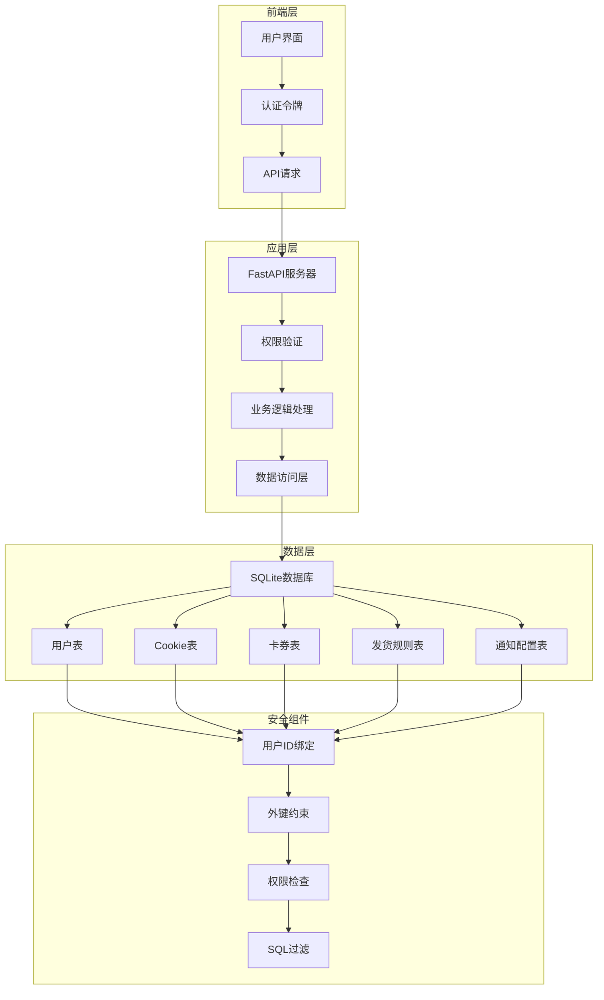
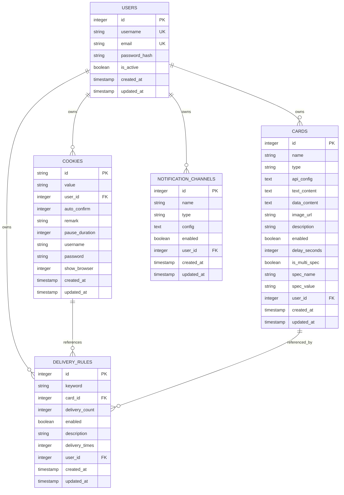
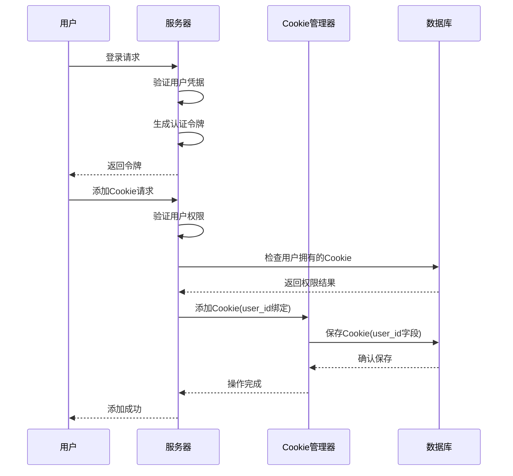
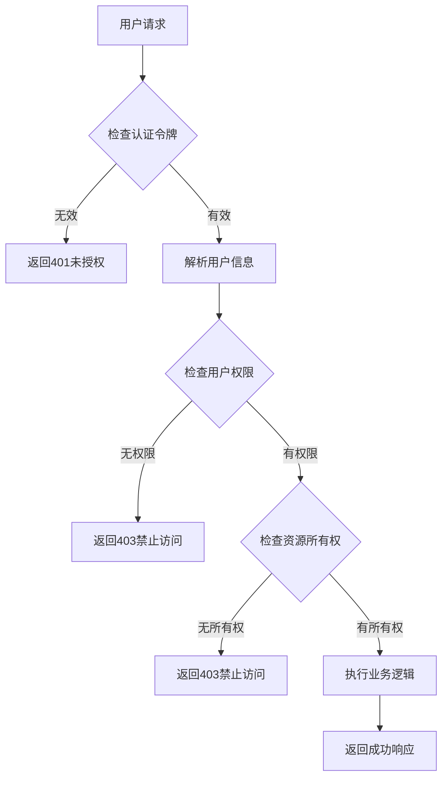
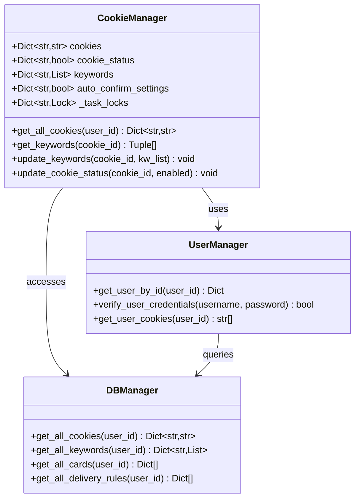
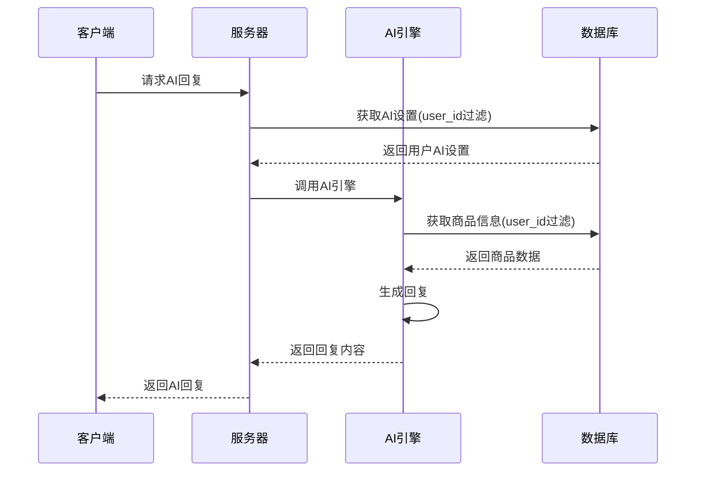
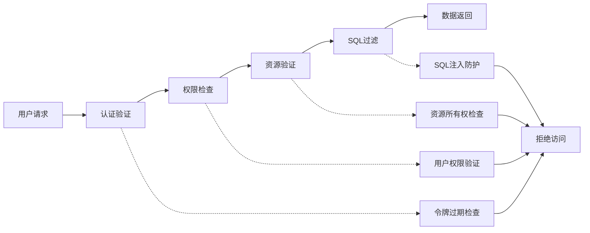

# 用户数据隔离机制详细文档

<cite>
**本文档引用的文件**
- [config.py](file://config.py)
- [db_manager.py](file://db_manager.py)
- [cookie_manager.py](file://cookie_manager.py)
- [reply_server.py](file://reply_server.py)
- [order_status_handler.py](file://order_status_handler.py)
- [ai_reply_engine.py](file://ai_reply_engine.py)
- [XianyuAutoAsync.py](file://XianyuAutoAsync.py)
- [utils/slider_patch.py](file://utils/slider_patch.py)
- [utils/xianyu_slider_stealth.py](file://utils/xianyu_slider_stealth.py)
</cite>

## 目录
1. [概述](#概述)
2. [系统架构](#系统架构)
3. [用户ID绑定机制](#用户id绑定机制)
4. [数据库层面的数据隔离](#数据库层面的数据隔离)
5. [权限检查机制](#权限检查机制)
6. [服务间的数据隔离实现](#服务间的数据隔离实现)
7. [安全防护措施](#安全防护措施)
8. [代码示例](#代码示例)
9. [故障排除指南](#故障排除指南)
10. [总结](#总结)

## 概述

本系统采用多层次的数据隔离机制，确保多用户环境下的数据安全性和隐私保护。通过用户ID绑定、数据库外键约束、权限检查和SQL查询过滤等技术手段，实现了严格的用户数据隔离。

### 核心设计原则

- **最小权限原则**：每个用户只能访问和操作自己的数据
- **数据绑定**：所有资源通过user_id字段与特定用户关联
- **多重验证**：前端、后端、数据库三层权限验证
- **级联删除**：用户删除时自动清理相关数据

## 系统架构



**图表来源**
- [reply_server.py](file://reply_server.py#L1-L50)
- [db_manager.py](file://db_manager.py#L16-L100)

## 用户ID绑定机制

### 用户ID字段设计

系统中的所有核心表都包含`user_id`字段，用于将资源与特定用户绑定：



**图表来源**
- [db_manager.py](file://db_manager.py#L74-L216)

### Cookie管理中的用户绑定

Cookie管理器通过`user_id`字段实现账号级别的数据隔离：



**图表来源**
- [cookie_manager.py](file://cookie_manager.py#L112-L153)
- [reply_server.py](file://reply_server.py#L3022-L3028)

**章节来源**
- [db_manager.py](file://db_manager.py#L1166-L1171)
- [cookie_manager.py](file://cookie_manager.py#L140-L150)

## 数据库层面的数据隔离

### 外键约束和级联删除策略

系统通过外键约束确保数据完整性，并实现级联删除：

| 表名 | 外键字段 | 关联表 | 级联操作 |
|------|----------|--------|----------|
| cookies | user_id | users(id) | RESTRICT |
| cards | user_id | users(id) | RESTRICT |
| delivery_rules | user_id | users(id) | RESTRICT |
| notification_channels | user_id | users(id) | RESTRICT |
| ai_reply_settings | cookie_id | cookies(id) | CASCADE |
| keywords | cookie_id | cookies(id) | CASCADE |
| cookie_status | cookie_id | cookies(id) | CASCADE |

### SQL查询中的数据过滤

所有数据库操作都包含`user_id`过滤条件：

```sql
-- 获取用户的所有Cookie
SELECT id, value FROM cookies WHERE user_id = ?

-- 获取用户的所有关键字
SELECT k.cookie_id, k.keyword, k.reply
FROM keywords k
JOIN cookies c ON k.cookie_id = c.id
WHERE c.user_id = ?

-- 获取用户的所有卡券
SELECT * FROM cards WHERE user_id = ?
```

**章节来源**
- [db_manager.py](file://db_manager.py#L1225-L1234)
- [db_manager.py](file://db_manager.py#L1694-L1706)
- [db_manager.py](file://db_manager.py#L2898-L2908)

## 权限检查机制

### 认证和授权流程



**图表来源**
- [reply_server.py](file://reply_server.py#L183-L220)

### API端点权限验证

系统在每个API端点都实现了权限检查：

```python
# 示例：Cookie关键字权限检查
@app.get("/keywords/{cid}")
def get_keywords(cid: str, current_user: Dict[str, Any] = Depends(get_current_user)):
    # 检查cookie是否属于当前用户
    user_id = current_user['user_id']
    from db_manager import db_manager
    user_cookies = db_manager.get_all_cookies(user_id)
    
    if cid not in user_cookies:
        raise HTTPException(status_code=403, detail="无权限访问该Cookie")
    
    # 获取关键字...
```

### 前端权限控制

前端通过认证令牌和用户角色控制界面访问：

```javascript
// 检查用户权限
function checkUserPermission(resourceId) {
    const currentUser = getCurrentUser();
    const userCookies = getUserCookies(currentUser.id);
    
    if (!userCookies.includes(resourceId)) {
        throw new Error('无权限访问');
    }
}
```

**章节来源**
- [reply_server.py](file://reply_server.py#L3022-L3028)
- [reply_server.py](file://reply_server.py#L3078-L3089)

## 服务间的数据隔离实现

### Cookie管理器的数据隔离

Cookie管理器维护用户级别的Cookie集合：



**图表来源**
- [cookie_manager.py](file://cookie_manager.py#L10-L50)
- [db_manager.py](file://db_manager.py#L1225-L1234)

### AI回复引擎的用户隔离

AI回复引擎通过Cookie ID关联用户设置：



**图表来源**
- [ai_reply_engine.py](file://ai_reply_engine.py#L62-L81)

### 订单状态处理器的权限控制

订单状态处理器确保只处理属于当前用户的订单：

```python
def update_order_status(self, order_id: str, new_status: str, cookie_id: str, context: str = "") -> bool:
    # 检查订单是否属于当前用户
    from db_manager import db_manager
    current_order = db_manager.get_order_by_id(order_id)
    
    if not current_order or current_order.get('cookie_id') != cookie_id:
        logger.error(f"订单 {order_id} 不属于当前用户")
        return False
    
    # 执行状态更新...
```

**章节来源**
- [cookie_manager.py](file://cookie_manager.py#L1-L428)
- [ai_reply_engine.py](file://ai_reply_engine.py#L1-L200)
- [order_status_handler.py](file://order_status_handler.py#L192-L301)

## 安全防护措施

### 防止越权访问

系统通过以下措施防止越权访问：

1. **认证令牌验证**：每次请求都验证JWT令牌
2. **用户ID绑定**：所有资源都与用户ID关联
3. **SQL注入防护**：使用参数化查询
4. **权限边界检查**：在业务逻辑层验证权限

### 数据泄露防护



### 审计和监控

系统记录所有敏感操作：

```python
def log_with_user(level: str, message: str, user_info: Dict[str, Any] = None):
    """带用户信息的日志记录"""
    prefix = get_user_log_prefix(user_info)
    full_message = f"{prefix} {message}"
    
    if level.lower() == 'info':
        logger.info(full_message)
    elif level.lower() == 'error':
        logger.error(full_message)
    # ... 其他日志级别
```

**章节来源**
- [reply_server.py](file://reply_server.py#L246-L260)
- [db_manager.py](file://db_manager.py#L633-L667)

## 代码示例

### 用户数据查询示例

```python
# 获取用户的所有Cookie（安全实现）
def get_user_cookies(user_id: int):
    """安全获取用户Cookie列表"""
    with db_manager.lock:
        try:
            cursor = db_manager.conn.cursor()
            db_manager._execute_sql(cursor, "SELECT id, value FROM cookies WHERE user_id = ?", (user_id,))
            return {row[0]: row[1] for row in cursor.fetchall()}
        except Exception as e:
            logger.error(f"获取用户Cookie失败: {e}")
            return {}

# 更新用户Cookie（带权限检查）
def update_user_cookie(user_id: int, cookie_id: str, new_value: str):
    """安全更新用户Cookie"""
    # 首先验证用户权限
    user_cookies = get_user_cookies(user_id)
    if cookie_id not in user_cookies:
        raise PermissionError(f"用户无权限操作Cookie: {cookie_id}")
    
    # 执行更新
    db_manager.save_cookie(cookie_id, new_value, user_id)
```

### 权限检查装饰器

```python
def require_user_ownership(model_class):
    """权限检查装饰器，确保用户只能访问自己的资源"""
    def decorator(func):
        @wraps(func)
        def wrapper(*args, **kwargs):
            # 获取当前用户
            current_user = get_current_user()
            user_id = current_user['user_id']
            
            # 获取要访问的资源ID
            resource_id = kwargs.get('resource_id')
            
            # 验证资源所有权
            if not model_class.has_ownership(user_id, resource_id):
                raise HTTPException(status_code=403, detail="无权限访问")
            
            return func(*args, **kwargs)
        return wrapper
    return decorator

# 使用示例
@require_user_ownership(Cookie)
@app.get("/cookies/{cookie_id}")
def get_cookie(cookie_id: str, current_user: Dict[str, Any] = Depends(get_current_user)):
    # 函数内部自动验证权限
    return db_manager.get_cookie_details(cookie_id)
```

### 数据库操作的安全封装

```python
class SecureDataManager:
    """安全的数据管理器，自动添加用户ID过滤"""
    
    @staticmethod
    def get_user_resources(user_id: int, resource_type: str):
        """获取用户的所有资源，自动添加用户过滤"""
        with db_manager.lock:
            try:
                cursor = db_manager.conn.cursor()
                
                # 根据资源类型动态构建查询
                queries = {
                    'cookies': "SELECT id, value FROM cookies WHERE user_id = ?",
                    'cards': "SELECT * FROM cards WHERE user_id = ?",
                    'rules': "SELECT * FROM delivery_rules WHERE user_id = ?",
                    'notifications': "SELECT * FROM notification_channels WHERE user_id = ?"
                }
                
                if resource_type not in queries:
                    raise ValueError(f"不支持的资源类型: {resource_type}")
                
                db_manager._execute_sql(cursor, queries[resource_type], (user_id,))
                return cursor.fetchall()
                
            except Exception as e:
                logger.error(f"获取用户资源失败: {e}")
                return []
```

**章节来源**
- [db_manager.py](file://db_manager.py#L1225-L1234)
- [reply_server.py](file://reply_server.py#L3022-L3028)

## 故障排除指南

### 常见问题及解决方案

#### 1. 用户无法访问自己的数据

**症状**：用户登录后无法看到自己添加的Cookie或卡券

**排查步骤**：
1. 检查用户表中的`is_active`字段是否为`TRUE`
2. 验证Cookie表中的`user_id`字段是否正确设置
3. 确认数据库连接和事务处理是否正常

**解决方案**：
```sql
-- 检查用户状态
SELECT id, username, is_active FROM users WHERE id = ?

-- 检查用户Cookie
SELECT id, user_id, value FROM cookies WHERE user_id = ?

-- 修复用户权限
UPDATE users SET is_active = TRUE WHERE id = ?
```

#### 2. 权限验证失败

**症状**：API返回403错误，提示无权限访问

**排查步骤**：
1. 验证JWT令牌的有效性
2. 检查令牌中的用户ID
3. 确认请求的资源ID是否存在且属于当前用户

**解决方案**：
```python
# 调试权限检查
def debug_permission_check(user_id: int, resource_id: str):
    from db_manager import db_manager
    
    # 检查用户是否存在
    user = db_manager.get_user_by_id(user_id)
    if not user:
        print(f"用户不存在: {user_id}")
        return False
    
    # 检查资源所有权
    resources = db_manager.get_all_cookies(user_id)
    if resource_id not in resources:
        print(f"用户无权限访问资源: {resource_id}")
        return False
    
    print(f"权限检查通过: 用户 {user_id} 可以访问资源 {resource_id}")
    return True
```

#### 3. 数据库外键约束错误

**症状**：删除用户时出现外键约束错误

**解决方案**：
系统通过级联删除自动处理相关数据，但如果出现问题，可以手动清理：

```sql
-- 手动清理用户相关数据
DELETE FROM cookies WHERE user_id = ?
DELETE FROM cards WHERE user_id = ?
DELETE FROM delivery_rules WHERE user_id = ?
DELETE FROM notification_channels WHERE user_id = ?
DELETE FROM user_settings WHERE user_id = ?
```

### 性能优化建议

1. **索引优化**：确保`user_id`字段上有适当的索引
2. **查询优化**：避免不必要的全表扫描
3. **连接池**：使用数据库连接池提高性能
4. **缓存策略**：缓存频繁访问的用户数据

**章节来源**
- [db_manager.py](file://db_manager.py#L1200-L1212)
- [reply_server.py](file://reply_server.py#L183-L220)

## 总结

本系统通过以下关键技术实现了全面的用户数据隔离：

### 技术亮点

1. **多层防护体系**：前端、后端、数据库三层权限验证
2. **细粒度控制**：每个资源都通过`user_id`字段绑定到特定用户
3. **自动化管理**：通过外键约束和级联删除确保数据一致性
4. **审计追踪**：完整的操作日志记录和用户行为追踪

### 安全特性

- **最小权限原则**：用户只能访问自己的数据
- **数据加密存储**：敏感信息如密码使用哈希存储
- **防SQL注入**：使用参数化查询防止注入攻击
- **会话管理**：安全的JWT令牌管理和过期处理

### 扩展性考虑

系统设计具有良好的扩展性，可以轻松添加新的资源类型和权限控制规则。通过统一的用户ID绑定机制，新功能可以无缝集成到现有的数据隔离体系中。

这种设计不仅满足了当前的功能需求，还为未来的功能扩展和安全加固提供了坚实的基础。