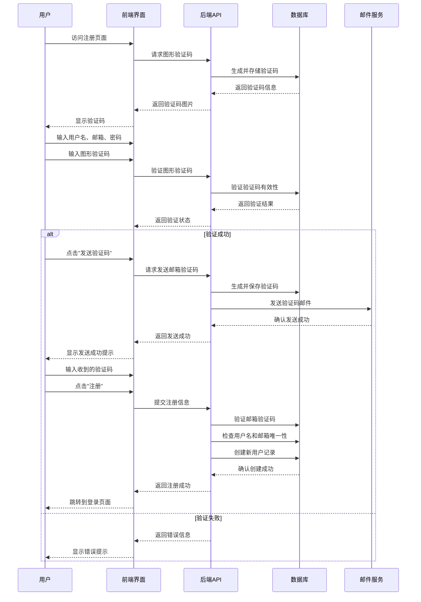
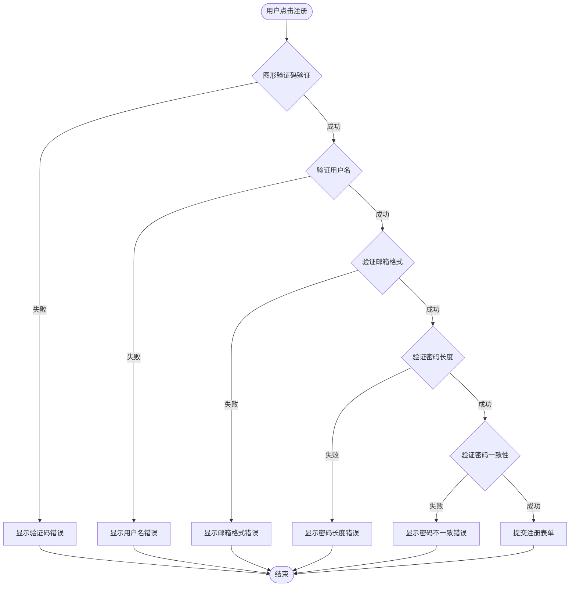
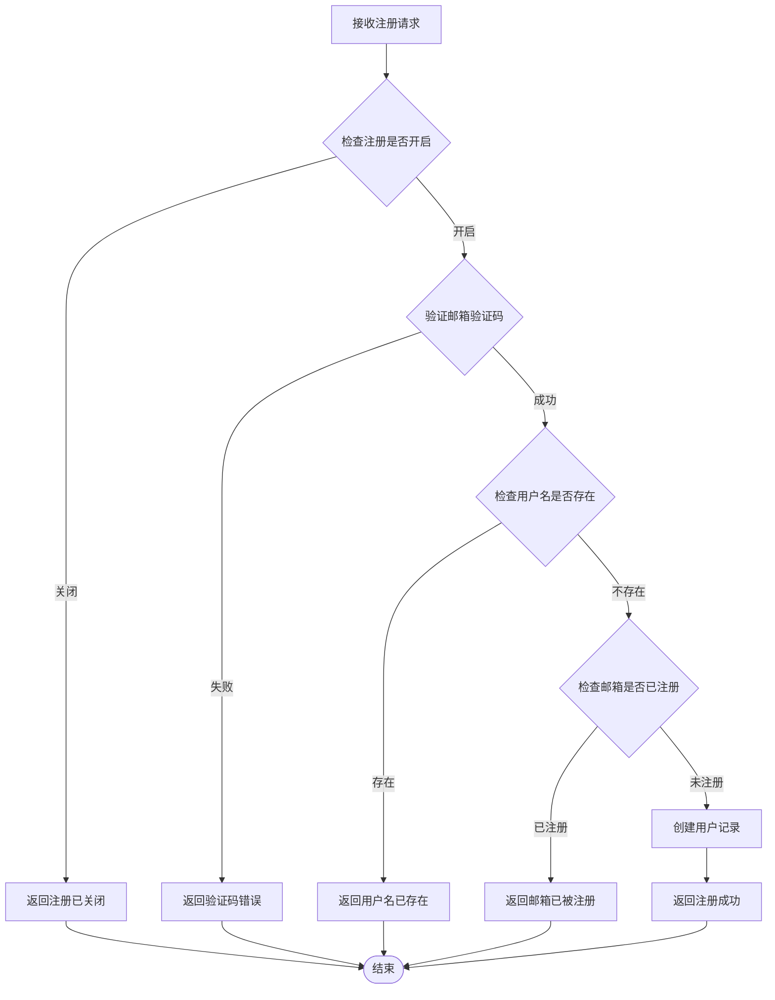
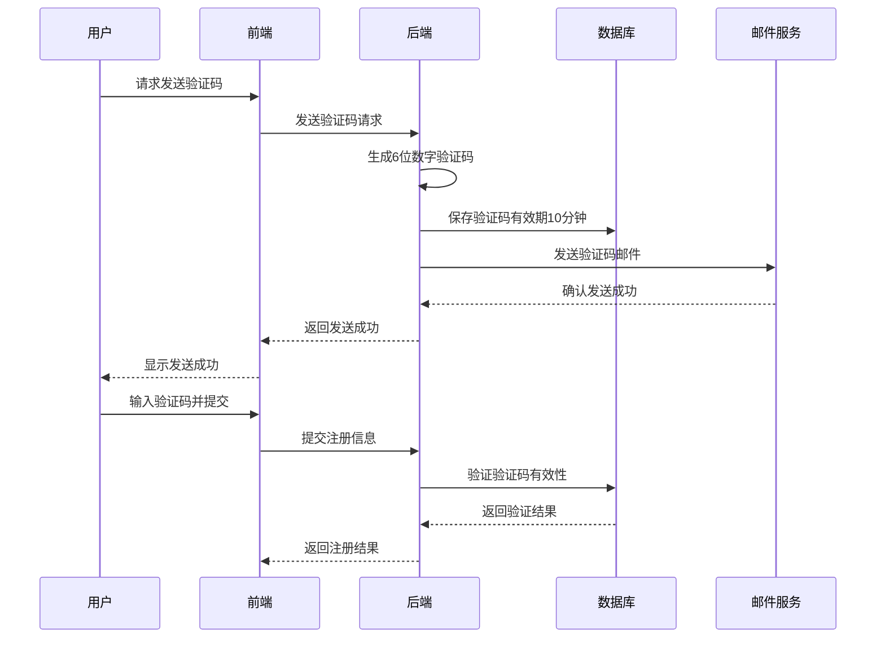
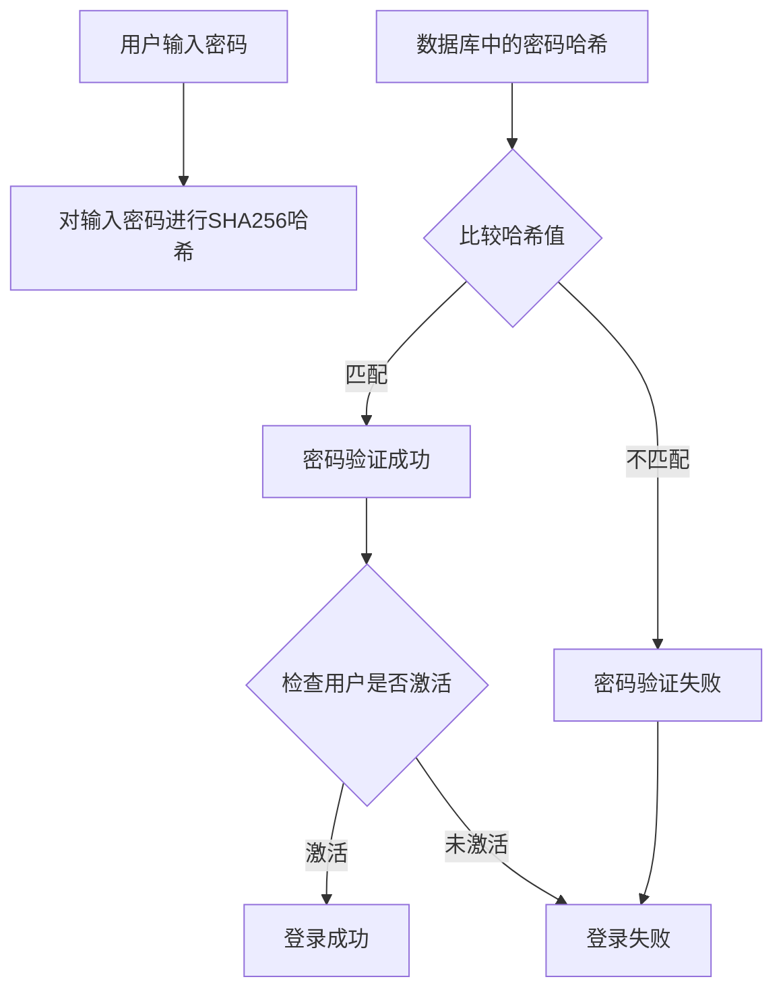
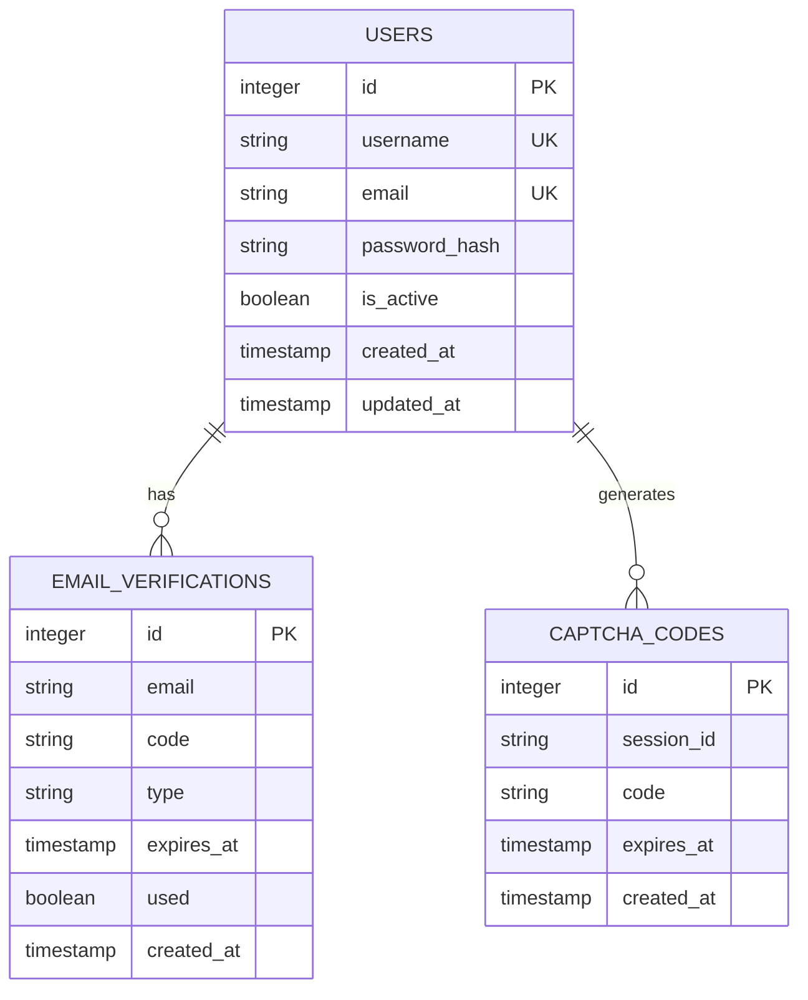

# 用户注册功能详细文档

<cite>
**本文档引用的文件**
- [README.md](file://README.md)
- [config.py](file://config.py)
- [db_manager.py](file://db_manager.py)
- [reply_server.py](file://reply_server.py)
- [static/register.html](file://static/register.html)
- [static/login.html](file://static/login.html)
- [api_captcha_remote.py](file://api_captcha_remote.py)
</cite>

## 目录
1. [系统概述](#系统概述)
2. [注册流程架构](#注册流程架构)
3. [前端注册界面](#前端注册界面)
4. [后端API接口](#后端api接口)
5. [验证码机制](#验证码机制)
6. [安全防护措施](#安全防护措施)
7. [数据库设计](#数据库设计)
8. [配置管理](#配置管理)
9. [请求响应示例](#请求响应示例)
10. [故障排除指南](#故障排除指南)

## 系统概述

闲鱼自动回复系统采用现代化的多用户架构，支持用户注册、邮箱验证和图形验证码保护。系统提供完整的用户注册功能，包括用户名验证、邮箱验证、密码安全处理和可配置的注册开关。

### 核心特性

- **邮箱验证注册**：支持通过邮箱验证码完成用户注册
- **图形验证码保护**：防止机器人注册攻击
- **密码安全处理**：使用SHA256哈希算法保护用户密码
- **可配置注册开关**：系统管理员可随时开启或关闭注册功能
- **数据隔离**：每个用户的数据完全独立存储
- **防暴力破解**：验证码时效性和频率限制

## 注册流程架构



**图表来源**
- [static/register.html](file://static/register.html#L277-L565)
- [reply_server.py](file://reply_server.py#L776-L842)
- [db_manager.py](file://db_manager.py#L2657-L2705)

## 前端注册界面

### 页面结构

注册页面采用现代化的响应式设计，包含以下核心元素：

- **用户名输入框**：验证长度（3-20字符）和格式（字母、数字、下划线）
- **邮箱输入框**：验证邮箱格式和唯一性
- **密码输入框**：验证最小长度（6字符）
- **确认密码输入框**：验证密码一致性
- **图形验证码**：防止机器人攻击
- **邮箱验证码输入框**：接收系统发送的验证码
- **注册按钮**：提交注册信息

### 前端验证逻辑



**图表来源**
- [static/register.html](file://static/register.html#L478-L540)

### 图形验证码功能

前端实现了完整的图形验证码功能：

- **验证码生成**：通过 `/generate-captcha` 接口获取
- **实时验证**：输入4位验证码后自动验证
- **防刷新**：验证成功后才能刷新验证码
- **状态提示**：实时显示验证状态

**章节来源**
- [static/register.html](file://static/register.html#L296-L380)

## 后端API接口

### 注册接口 (/register)

注册接口是用户注册的核心入口，提供完整的注册流程处理。

#### 接口规范

| 属性 | 值 |
|------|-----|
| URL | `/register` |
| 方法 | POST |
| 内容类型 | application/json |
| 认证 | 无需认证 |

#### 请求体结构

```json
{
  "username": "string (3-20字符)",
  "email": "string (邮箱格式)",
  "verification_code": "string (6位数字)",
  "password": "string (6位以上)"
}
```

#### 响应体结构

```json
{
  "success": "boolean",
  "message": "string"
}
```

#### 处理流程



**图表来源**
- [reply_server.py](file://reply_server.py#L844-L905)

### 发送验证码接口 (/send-verification-code)

该接口负责生成和发送邮箱验证码，支持注册和登录两种场景。

#### 接口规范

| 属性 | 值 |
|------|-----|
| URL | `/send-verification-code` |
| 方法 | POST |
| 内容类型 | application/json |
| 认证 | 无需认证 |

#### 请求体结构

```json
{
  "email": "string (邮箱地址)",
  "session_id": "string (会话ID)",
  "type": "string (register/login)"
}
```

#### 响应体结构

```json
{
  "success": "boolean",
  "message": "string"
}
```

**章节来源**
- [reply_server.py](file://reply_server.py#L776-L842)

### 验证码状态查询接口

#### 注册状态查询 (/registration-status)

```json
{
  "enabled": "boolean",
  "message": "string"
}
```

**章节来源**
- [reply_server.py](file://reply_server.py#L2684-L2710)

## 验证码机制

### 图形验证码

#### 生成机制

系统使用随机生成的4位数字验证码，具有以下特点：

- **生成算法**：`random.choices(string.digits, k=4)`
- **存储方式**：保存在 `captcha_codes` 表中
- **有效期**：5分钟
- **过期处理**：自动清理过期验证码

#### 存储结构

| 字段 | 类型 | 描述 |
|------|------|------|
| id | INTEGER | 主键 |
| session_id | TEXT | 会话标识 |
| code | TEXT | 验证码（大写） |
| expires_at | TIMESTAMP | 过期时间 |
| created_at | TIMESTAMP | 创建时间 |

**章节来源**
- [db_manager.py](file://db_manager.py#L2606-L2627)

### 邮箱验证码

#### 生成和验证流程



**图表来源**
- [db_manager.py](file://db_manager.py#L2657-L2705)

#### 验证码存储

| 字段 | 类型 | 描述 |
|------|------|------|
| id | INTEGER | 主键 |
| email | TEXT | 邮箱地址 |
| code | TEXT | 验证码 |
| type | TEXT | 验证码类型（register/login） |
| expires_at | TIMESTAMP | 过期时间 |
| used | BOOLEAN | 是否已使用 |
| created_at | TIMESTAMP | 创建时间 |

**章节来源**
- [db_manager.py](file://db_manager.py#L2677-L2705)

### 验证码时效性控制

- **图形验证码**：5分钟过期
- **邮箱验证码**：10分钟过期
- **自动清理**：过期验证码自动删除
- **防重放**：验证码使用后标记为已使用

## 安全防护措施

### 密码安全

#### 哈希处理

系统使用SHA256算法对用户密码进行哈希处理：

```python
password_hash = hashlib.sha256(password.encode()).hexdigest()
```

#### 密码验证流程



**图表来源**
- [db_manager.py](file://db_manager.py#L2502-L2510)

### 防暴力破解

#### 频率限制

- **验证码发送间隔**：60秒
- **验证码有效期**：10分钟
- **图形验证码有效期**：5分钟
- **会话管理**：基于session_id的验证码验证

#### 注册限制

- **用户名唯一性**：每个用户名只能注册一次
- **邮箱唯一性**：每个邮箱只能注册一个账号
- **注册开关**：管理员可随时关闭注册功能

### 数据隔离

#### 用户数据结构



**图表来源**
- [db_manager.py](file://db_manager.py#L73-L106)

**章节来源**
- [db_manager.py](file://db_manager.py#L2426-L2448)

## 数据库设计

### 用户表结构

#### users 表

| 字段 | 类型 | 约束 | 描述 |
|------|------|------|------|
| id | INTEGER | PRIMARY KEY AUTOINCREMENT | 用户ID |
| username | TEXT | UNIQUE NOT NULL | 用户名 |
| email | TEXT | UNIQUE NOT NULL | 邮箱地址 |
| password_hash | TEXT | NOT NULL | 密码哈希 |
| is_active | BOOLEAN | DEFAULT TRUE | 是否激活 |
| created_at | TIMESTAMP | DEFAULT CURRENT_TIMESTAMP | 创建时间 |
| updated_at | TIMESTAMP | DEFAULT CURRENT_TIMESTAMP | 更新时间 |

### 验证码表结构

#### email_verifications 表

| 字段 | 类型 | 约束 | 描述 |
|------|------|------|------|
| id | INTEGER | PRIMARY KEY AUTOINCREMENT | 验证码ID |
| email | TEXT | NOT NULL | 邮箱地址 |
| code | TEXT | NOT NULL | 验证码 |
| type | TEXT | DEFAULT 'register' | 验证码类型 |
| expires_at | TIMESTAMP | NOT NULL | 过期时间 |
| used | BOOLEAN | DEFAULT FALSE | 是否已使用 |
| created_at | TIMESTAMP | DEFAULT CURRENT_TIMESTAMP | 创建时间 |

#### captcha_codes 表

| 字段 | 类型 | 约束 | 描述 |
|------|------|------|------|
| id | INTEGER | PRIMARY KEY AUTOINCREMENT | 验证码ID |
| session_id | TEXT | NOT NULL | 会话ID |
| code | TEXT | NOT NULL | 验证码 |
| expires_at | TIMESTAMP | NOT NULL | 过期时间 |
| created_at | TIMESTAMP | DEFAULT CURRENT_TIMESTAMP | 创建时间 |

**章节来源**
- [db_manager.py](file://db_manager.py#L73-L106)

## 配置管理

### 注册功能配置

系统提供灵活的注册功能配置：

#### 系统设置表

| 键名 | 默认值 | 描述 |
|------|--------|------|
| registration_enabled | true | 是否开启用户注册 |
| show_default_login_info | true | 是否显示默认登录信息 |
| smtp_server | 空 | SMTP服务器地址 |
| smtp_port | 587 | SMTP端口 |
| smtp_user | 空 | SMTP登录用户名 |
| smtp_password | 空 | SMTP登录密码 |
| smtp_from | 空 | 发件人显示名 |

#### 配置接口

##### 获取注册状态

```http
GET /registration-status
```

##### 更新注册设置

```http
PUT /registration-settings
Authorization: Bearer <admin_token>
Content-Type: application/json

{
  "enabled": true
}
```

**章节来源**
- [db_manager.py](file://db_manager.py#L427-L437)
- [reply_server.py](file://reply_server.py#L2684-L2765)

## 请求响应示例

### 成功注册示例

#### 请求

```http
POST /register
Content-Type: application/json

{
  "username": "testuser",
  "email": "test@example.com",
  "verification_code": "123456",
  "password": "mypassword123"
}
```

#### 响应

```http
HTTP/1.1 200 OK
Content-Type: application/json

{
  "success": true,
  "message": "注册成功，请登录"
}
```

### 失败注册示例

#### 请求

```http
POST /register
Content-Type: application/json

{
  "username": "testuser",
  "email": "test@example.com",
  "verification_code": "wrongcode",
  "password": "short"
}
```

#### 响应

```http
HTTP/1.1 200 OK
Content-Type: application/json

{
  "success": false,
  "message": "验证码错误或已过期"
}
```

### 发送验证码示例

#### 请求

```http
POST /send-verification-code
Content-Type: application/json

{
  "email": "test@example.com",
  "session_id": "session_123456789",
  "type": "register"
}
```

#### 响应

```http
HTTP/1.1 200 OK
Content-Type: application/json

{
  "success": true,
  "message": "验证码已发送到您的邮箱，请查收"
}
```

### 获取注册状态示例

#### 请求

```http
GET /registration-status
```

#### 响应

```http
HTTP/1.1 200 OK
Content-Type: application/json

{
  "enabled": true,
  "message": "注册功能已开启"
}
```

## 故障排除指南

### 常见问题及解决方案

#### 1. 验证码发送失败

**症状**：用户点击"发送验证码"后收到"验证码发送失败"提示

**可能原因**：
- SMTP配置不正确
- 邮箱地址无效
- 邮件服务器连接问题

**解决步骤**：
1. 检查SMTP配置是否正确
2. 验证邮箱地址格式
3. 测试邮件服务器连接
4. 查看系统日志获取详细错误信息

#### 2. 图形验证码验证失败

**症状**：输入正确的图形验证码仍提示验证失败

**可能原因**：
- 验证码过期
- 会话ID不匹配
- 数据库连接问题

**解决步骤**：
1. 刷新页面重新获取验证码
2. 检查网络连接
3. 清除浏览器缓存
4. 查看数据库连接状态

#### 3. 注册功能被禁用

**症状**：用户无法看到注册选项或收到"注册功能已关闭"提示

**解决步骤**：
1. 管理员登录系统
2. 进入系统设置
3. 启用注册功能
4. 保存设置并刷新页面

#### 4. 密码安全问题

**症状**：用户密码无法正常验证

**解决步骤**：
1. 检查密码哈希算法
2. 验证数据库连接
3. 确认密码字段完整性
4. 重新设置用户密码

### 调试信息

系统提供了详细的日志记录功能，可通过以下方式查看调试信息：

- **系统日志**：查看 `logs/` 目录下的日志文件
- **数据库日志**：启用SQL日志记录
- **邮件日志**：检查邮件发送状态
- **验证码日志**：查看验证码生成和验证过程

**章节来源**
- [db_manager.py](file://db_manager.py#L2707-L2761)

## 总结

闲鱼自动回复系统的用户注册功能提供了完整的安全保障和用户体验。通过图形验证码、邮箱验证、密码哈希处理和可配置的注册开关，系统确保了用户注册的安全性和可靠性。完善的API接口和前端交互设计使得注册流程简单直观，而强大的后端验证机制则有效防止了恶意注册和暴力破解攻击。

系统的设计充分考虑了安全性、可用性和可维护性，为用户提供了一个安全可靠的注册环境。管理员可以通过系统设置灵活控制注册功能，确保系统的安全运营。