# 用户登录功能详细文档

<cite>
**本文档引用的文件**
- [README.md](file://README.md)
- [reply_server.py](file://reply_server.py)
- [db_manager.py](file://db_manager.py)
- [config.py](file://config.py)
- [login.html](file://static/login.html)
- [register.html](file://static/register.html)
- [Start.py](file://Start.py)
- [XianyuAutoAsync.py](file://XianyuAutoAsync.py)
- [utils/qr_login.py](file://utils/qr_login.py)
</cite>

## 目录
1. [简介](#简介)
2. [系统架构概览](#系统架构概览)
3. [登录方式详解](#登录方式详解)
4. [JWT Token认证机制](#jwt-token认证机制)
5. [验证码系统](#验证码系统)
6. [安全措施](#安全措施)
7. [API接口文档](#api接口文档)
8. [前端实现](#前端实现)
9. [会话管理](#会话管理)
10. [故障排除](#故障排除)

## 简介

闲鱼自动回复系统提供了完整的用户登录功能，支持多种登录方式和严格的安全认证机制。系统采用JWT（JSON Web Token）技术实现无状态认证，支持用户名/密码登录、邮箱/密码登录和邮箱/验证码登录三种认证方式，并集成了图形验证码、邮箱验证等多重安全保护措施。

### 核心特性

- **多登录方式支持**：用户名/密码、邮箱/密码、邮箱/验证码
- **JWT Token认证**：24小时有效期，自动续期机制
- **图形验证码保护**：防止机器人攻击和暴力破解
- **邮箱验证系统**：注册和登录双重验证
- **会话管理**：安全的会话生命周期管理
- **安全日志**：完整的登录行为记录和监控

## 系统架构概览

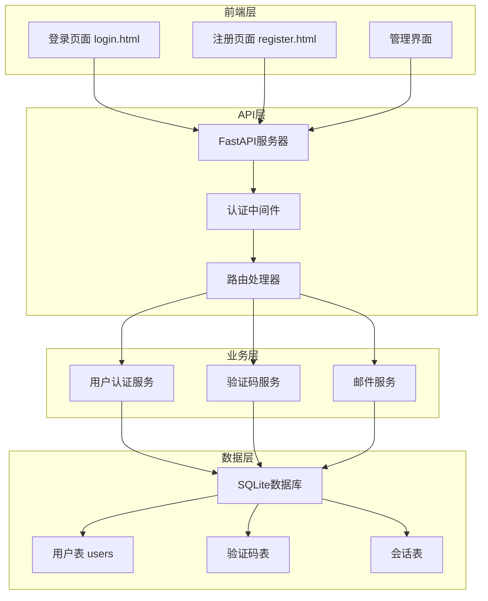

**图表来源**
- [reply_server.py](file://reply_server.py#L308-L320)
- [db_manager.py](file://db_manager.py#L70-L120)

## 登录方式详解

### 1. 用户名/密码登录

这是最传统的登录方式，用户使用系统分配的用户名和密码进行身份验证。

#### 认证流程

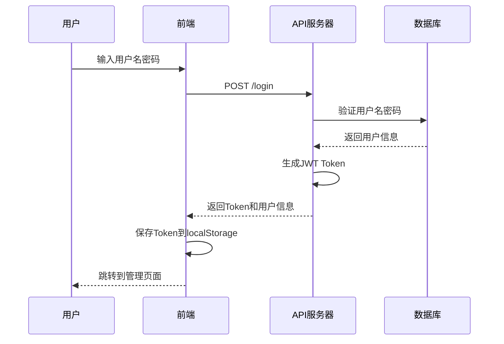

**图表来源**
- [reply_server.py](file://reply_server.py#L542-L576)
- [login.html](file://static/login.html#L307-L408)

#### 请求示例

```json
POST /login
Content-Type: application/json

{
    "username": "admin",
    "password": "admin123"
}
```

#### 响应示例

```json
{
    "success": true,
    "token": "eyJ0eXAiOiJKV1QiLCJhbGciOiJIUzI1NiJ9...",
    "message": "登录成功",
    "user_id": 1,
    "username": "admin",
    "is_admin": true
}
```

**节来源**
- [reply_server.py](file://reply_server.py#L542-L576)

### 2. 邮箱/密码登录

用户使用注册时的邮箱地址和密码进行登录，这种方式更加便捷，特别适合移动设备使用。

#### 认证流程

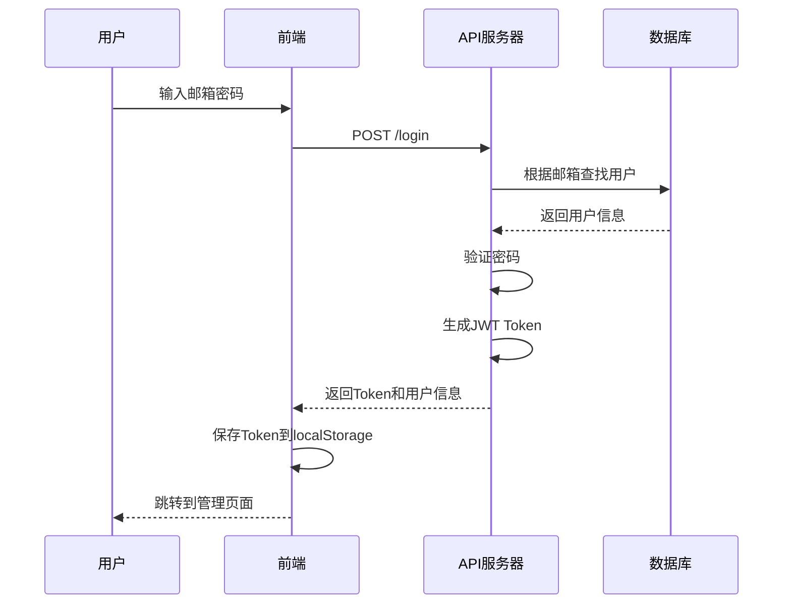

**图表来源**
- [reply_server.py](file://reply_server.py#L584-L607)

#### 请求示例

```json
POST /login
Content-Type: application/json

{
    "email": "user@example.com",
    "password": "securepassword123"
}
```

**节来源**
- [reply_server.py](file://reply_server.py#L584-L607)

### 3. 邮箱/验证码登录

这是最安全的登录方式，结合了邮箱验证和图形验证码双重保护。

#### 认证流程

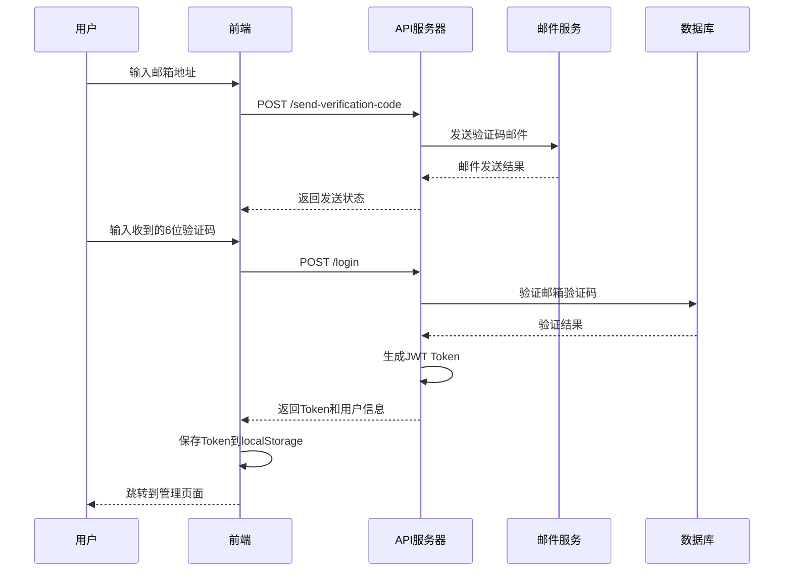

**图表来源**
- [reply_server.py](file://reply_server.py#L615-L653)
- [login.html](file://static/login.html#L602-L644)

#### 请求示例

```json
POST /login
Content-Type: application/json

{
    "email": "user@example.com",
    "verification_code": "123456"
}
```

**节来源**
- [reply_server.py](file://reply_server.py#L615-L653)

## JWT Token认证机制

系统采用JWT（JSON Web Token）技术实现无状态认证，具有以下特点：

### Token生成机制

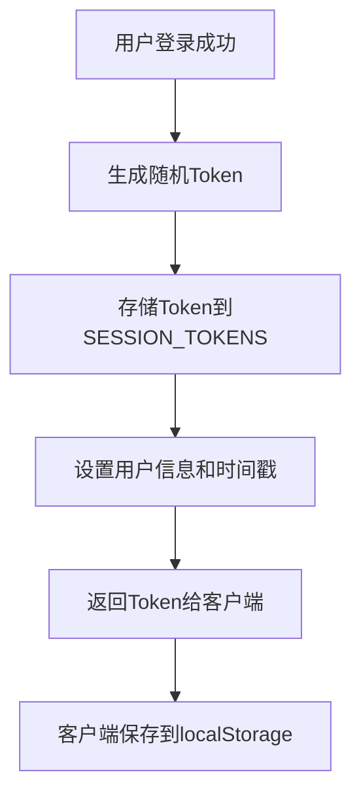

**图表来源**
- [reply_server.py](file://reply_server.py#L178-L180)
- [reply_server.py](file://reply_server.py#L556-L561)

### Token验证流程

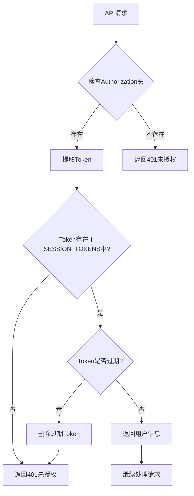

**图表来源**
- [reply_server.py](file://reply_server.py#L183-L199)

### Token配置参数

| 参数 | 值 | 说明 |
|------|-----|------|
| 过期时间 | 24小时 | Token的有效期为24小时 |
| 存储位置 | SESSION_TOKENS | 内存中的会话令牌存储 |
| 验证方式 | HTTP Bearer | 使用Authorization头携带Token |

**节来源**
- [reply_server.py](file://reply_server.py#L46-L47)
- [reply_server.py](file://reply_server.py#L183-L199)

### Token过期处理

系统实现了智能的Token过期处理机制：

1. **自动清理**：定期清理过期的Token
2. **即时验证**：每次请求都验证Token有效性
3. **安全删除**：过期Token自动从内存中删除

**节来源**
- [reply_server.py](file://reply_server.py#L183-L199)

## 验证码系统

系统提供了完整的验证码保护机制，包括图形验证码和邮箱验证码。

### 图形验证码

#### 生成流程

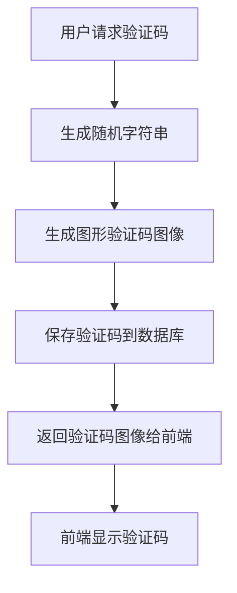

**图表来源**
- [reply_server.py](file://reply_server.py#L708-L738)

#### 验证流程

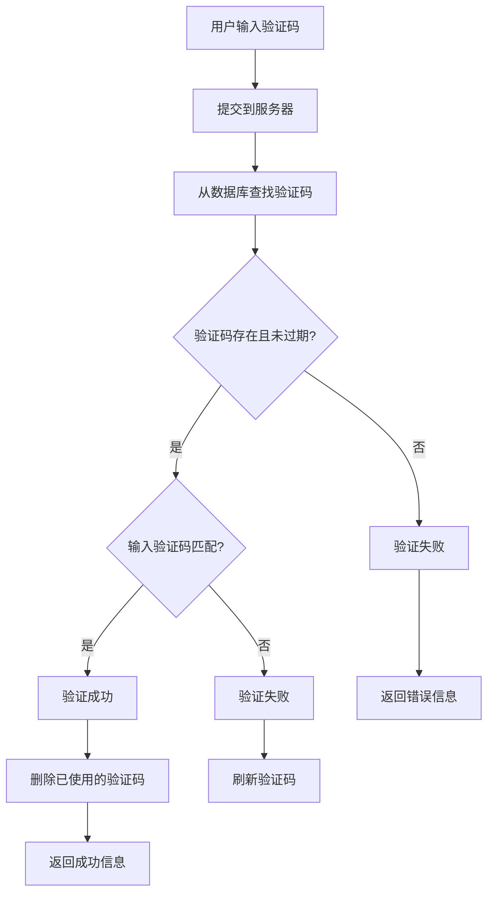

**图表来源**
- [reply_server.py](file://reply_server.py#L751-L772)

### 邮箱验证码

#### 发送流程

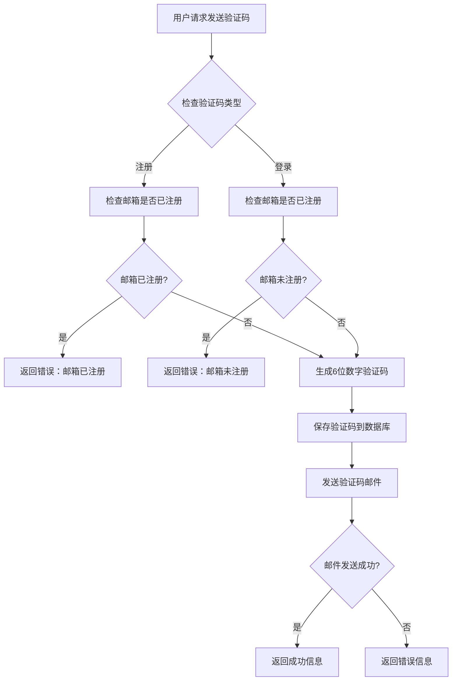

**图表来源**
- [reply_server.py](file://reply_server.py#L776-L833)

#### 验证码配置

| 参数 | 值 | 说明 |
|------|-----|------|
| 验证码长度 | 6位数字 | 数字验证码，易于用户输入 |
| 有效期 | 10分钟 | 防止验证码被恶意使用 |
| 发送间隔 | 60秒 | 防止频繁发送导致垃圾邮件 |
| 类型区分 | register/login | 注册和登录使用不同类型的验证码 |

**节来源**
- [reply_server.py](file://reply_server.py#L776-L833)

## 安全措施

### 失败尝试监控

系统实现了完善的失败尝试监控机制：

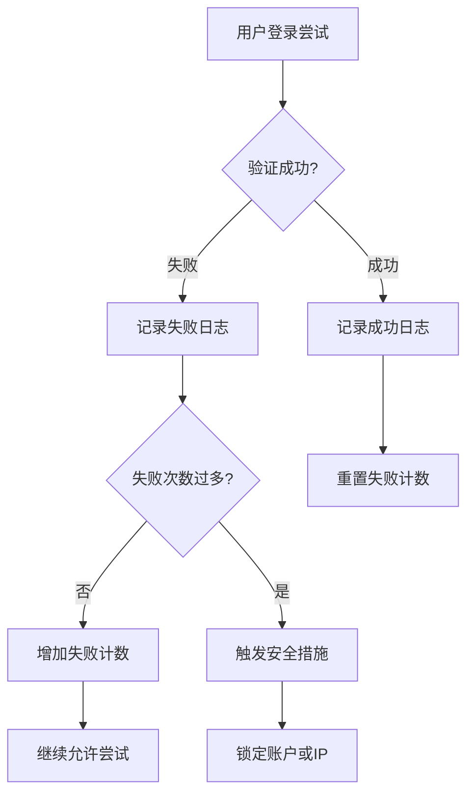

### 安全日志记录

系统记录所有重要的安全事件：

| 事件类型 | 记录内容 | 日志级别 |
|----------|----------|----------|
| 登录成功 | 用户名、时间戳、IP地址 | INFO |
| 登录失败 | 用户名、失败原因、IP地址 | WARNING |
| Token生成 | 用户ID、生成时间 | INFO |
| Token过期 | 用户ID、过期时间 | INFO |
| 密码修改 | 用户名、操作时间 | INFO |

**节来源**
- [reply_server.py](file://reply_server.py#L563-L567)
- [reply_server.py](file://reply_server.py#L621-L622)

### CSRF保护

虽然系统主要面向内部使用，但仍实现了基本的CSRF保护：

- **Token验证**：所有敏感操作都需要有效的JWT Token
- **Origin检查**：API接口检查请求的Origin头部
- **HTTPS强制**：建议使用HTTPS传输，防止Token被窃取

## API接口文档

### 登录接口

#### POST /login

用户登录接口，支持多种登录方式。

**请求参数**

| 参数名 | 类型 | 必填 | 说明 |
|--------|------|------|------|
| username | string | 否 | 用户名（用户名/密码登录时必填） |
| password | string | 否 | 密码（用户名/密码登录时必填） |
| email | string | 否 | 邮箱地址（邮箱登录时必填） |
| verification_code | string | 否 | 验证码（邮箱验证码登录时必填） |

**请求示例**

```json
// 用户名/密码登录
{
    "username": "admin",
    "password": "admin123"
}

// 邮箱/密码登录
{
    "email": "user@example.com",
    "password": "securepassword123"
}

// 邮箱/验证码登录
{
    "email": "user@example.com",
    "verification_code": "123456"
}
```

**响应参数**

| 参数名 | 类型 | 说明 |
|--------|------|------|
| success | boolean | 是否登录成功 |
| token | string | JWT Token（成功时返回） |
| message | string | 响应消息 |
| user_id | integer | 用户ID（成功时返回） |
| username | string | 用户名（成功时返回） |
| is_admin | boolean | 是否为管理员（成功时返回） |

**响应示例**

```json
{
    "success": true,
    "token": "eyJ0eXAiOiJKV1QiLCJhbGciOiJIUzI1NiJ9...",
    "message": "登录成功",
    "user_id": 1,
    "username": "admin",
    "is_admin": true
}
```

**节来源**
- [reply_server.py](file://reply_server.py#L542-L659)

### 验证Token接口

#### GET /verify

验证当前Token的有效性。

**请求头**

| 头名称 | 值 | 说明 |
|--------|-----|------|
| Authorization | Bearer {token} | 包含JWT Token的Authorization头 |

**响应参数**

| 参数名 | 类型 | 说明 |
|--------|------|------|
| authenticated | boolean | 是否已认证 |
| user_id | integer | 用户ID（已认证时返回） |
| username | string | 用户名（已认证时返回） |
| is_admin | boolean | 是否为管理员（已认证时返回） |

**响应示例**

```json
{
    "authenticated": true,
    "user_id": 1,
    "username": "admin",
    "is_admin": true
}
```

**节来源**
- [reply_server.py](file://reply_server.py#L663-L672)

### 登出接口

#### POST /logout

用户登出，销毁当前会话。

**请求头**

| 头名称 | 值 | 说明 |
|--------|-----|------|
| Authorization | Bearer {token} | 包含JWT Token的Authorization头 |

**响应参数**

| 参数名 | 类型 | 说明 |
|--------|------|------|
| message | string | 响应消息 |

**响应示例**

```json
{
    "message": "已登出"
}
```

**节来源**
- [reply_server.py](file://reply_server.py#L676-L680)

### 生成图形验证码接口

#### POST /generate-captcha

生成图形验证码。

**请求参数**

| 参数名 | 类型 | 必填 | 说明 |
|--------|------|------|------|
| session_id | string | 是 | 会话ID |

**请求示例**

```json
{
    "session_id": "session_abc123_1234567890"
}
```

**响应参数**

| 参数名 | 类型 | 说明 |
|--------|------|------|
| success | boolean | 是否成功 |
| captcha_image | string | Base64编码的验证码图像 |
| session_id | string | 会话ID |
| message | string | 响应消息 |

**响应示例**

```json
{
    "success": true,
    "captcha_image": "data:image/png;base64,iVBORw0KGgoAAAANSUhEUgAA...",
    "session_id": "session_abc123_1234567890",
    "message": "图形验证码生成成功"
}
```

**节来源**
- [reply_server.py](file://reply_server.py#L708-L738)

### 验证图形验证码接口

#### POST /verify-captcha

验证图形验证码。

**请求参数**

| 参数名 | 类型 | 必填 | 说明 |
|--------|------|------|------|
| session_id | string | 是 | 会话ID |
| captcha_code | string | 是 | 验证码内容 |

**请求示例**

```json
{
    "session_id": "session_abc123_1234567890",
    "captcha_code": "ABCD"
}
```

**响应参数**

| 参数名 | 类型 | 说明 |
|--------|------|------|
| success | boolean | 是否验证成功 |
| message | string | 响应消息 |

**响应示例**

```json
{
    "success": true,
    "message": "图形验证码验证成功"
}
```

**节来源**
- [reply_server.py](file://reply_server.py#L751-L772)

### 发送验证码接口

#### POST /send-verification-code

发送邮箱验证码。

**请求参数**

| 参数名 | 类型 | 必填 | 说明 |
|--------|------|------|------|
| email | string | 是 | 邮箱地址 |
| session_id | string | 是 | 会话ID |
| type | string | 否 | 验证码类型（register/login，默认为register） |

**请求示例**

```json
// 注册验证码
{
    "email": "user@example.com",
    "session_id": "session_abc123_1234567890",
    "type": "register"
}

// 登录验证码
{
    "email": "user@example.com",
    "session_id": "session_abc123_1234567890",
    "type": "login"
}
```

**响应参数**

| 参数名 | 类型 | 说明 |
|--------|------|------|
| success | boolean | 是否发送成功 |
| message | string | 响应消息 |

**响应示例**

```json
{
    "success": true,
    "message": "验证码已发送到您的邮箱，请查收"
}
```

**节来源**
- [reply_server.py](file://reply_server.py#L776-L840)

### 用户注册接口

#### POST /register

用户注册接口。

**请求参数**

| 参数名 | 类型 | 必填 | 说明 |
|--------|------|------|------|
| username | string | 是 | 用户名 |
| email | string | 是 | 邮箱地址 |
| password | string | 是 | 密码 |
| verification_code | string | 是 | 邮箱验证码 |

**请求示例**

```json
{
    "username": "newuser",
    "email": "newuser@example.com",
    "password": "securepassword123",
    "verification_code": "123456"
}
```

**响应参数**

| 参数名 | 类型 | 说明 |
|--------|------|------|
| success | boolean | 是否注册成功 |
| message | string | 响应消息 |

**响应示例**

```json
{
    "success": true,
    "message": "注册成功，请登录"
}
```

**节来源**
- [reply_server.py](file://reply_server.py#L844-L905)

## 前端实现

### 登录页面

登录页面提供了三种登录方式的切换功能：

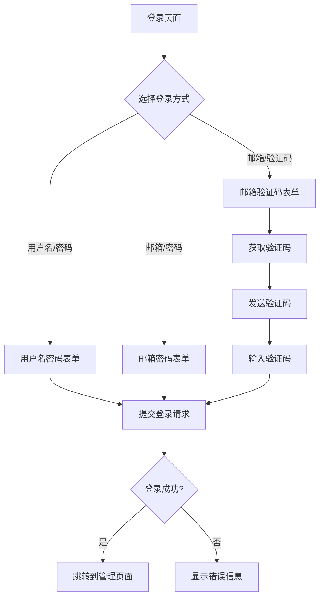

**图表来源**
- [login.html](file://static/login.html#L129-L139)
- [login.html](file://static/login.html#L307-L408)

### 注册页面

注册页面包含了完整的用户注册流程：

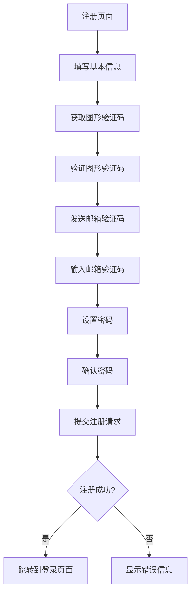

**图表来源**
- [register.html](file://static/register.html#L467-L531)

### 前端安全措施

前端实现了多项安全措施：

1. **输入验证**：实时验证用户名、邮箱、密码格式
2. **防抖处理**：验证码发送按钮有60秒冷却时间
3. **错误提示**：清晰的错误信息提示
4. **状态保持**：登录状态通过localStorage持久化

**节来源**
- [login.html](file://static/login.html#L307-L408)
- [register.html](file://static/register.html#L467-L531)

## 会话管理

### 会话生命周期

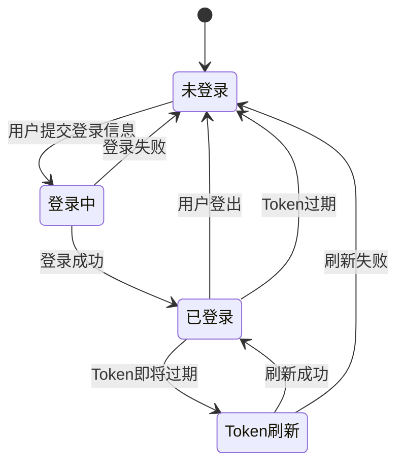

### 会话状态管理

系统维护了完整的会话状态：

| 状态 | 描述 | 触发条件 |
|------|------|----------|
| 未登录 | 用户尚未登录 | 初始状态 |
| 登录中 | 正在处理登录请求 | 用户提交登录信息 |
| 已登录 | 登录成功，Token有效 | 登录验证通过 |
| Token刷新 | 正在刷新过期Token | Token即将过期 |
| 未登录 | 会话结束 | 用户登出或Token过期 |

**节来源**
- [reply_server.py](file://reply_server.py#L46-L47)
- [reply_server.py](file://reply_server.py#L183-L199)

### 会话清理机制

系统实现了自动的会话清理机制：

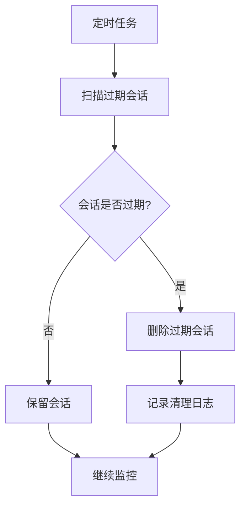

**图表来源**
- [reply_server.py](file://reply_server.py#L61-L77)

## 故障排除

### 常见问题及解决方案

#### 1. 登录失败

**问题描述**：用户无法登录系统

**可能原因**：
- 用户名或密码错误
- 账户被禁用
- 系统维护中

**解决方案**：
1. 检查用户名和密码是否正确
2. 确认账户状态是否正常
3. 查看系统日志了解具体错误

**节来源**
- [reply_server.py](file://reply_server.py#L578-L582)
- [reply_server.py](file://reply_server.py#L609-L613)

#### 2. 验证码问题

**问题描述**：验证码无法正常工作

**可能原因**：
- 图形验证码生成失败
- 邮箱验证码发送失败
- 验证码过期

**解决方案**：
1. 检查图形验证码生成服务
2. 验证邮件服务器配置
3. 确认验证码有效期设置

**节来源**
- [reply_server.py](file://reply_server.py#L714-L722)
- [reply_server.py](file://reply_server.py#L824-L833)

#### 3. Token过期

**问题描述**：Token过期导致认证失败

**可能原因**：
- Token有效期已过
- 服务器重启导致内存中的Token丢失

**解决方案**：
1. 重新登录获取新的Token
2. 检查服务器配置和重启策略

**节来源**
- [reply_server.py](file://reply_server.py#L195-L197)

#### 4. 注册功能不可用

**问题描述**：用户无法注册新账户

**可能原因**：
- 注册功能被管理员关闭
- 邮箱配置不正确
- 数据库连接问题

**解决方案**：
1. 检查系统设置中的注册开关
2. 验证邮件服务器配置
3. 确认数据库连接状态

**节来源**
- [reply_server.py](file://reply_server.py#L849-L855)
- [reply_server.py](file://reply_server.py#L824-L833)

### 日志分析

系统提供了详细的日志记录，帮助诊断问题：

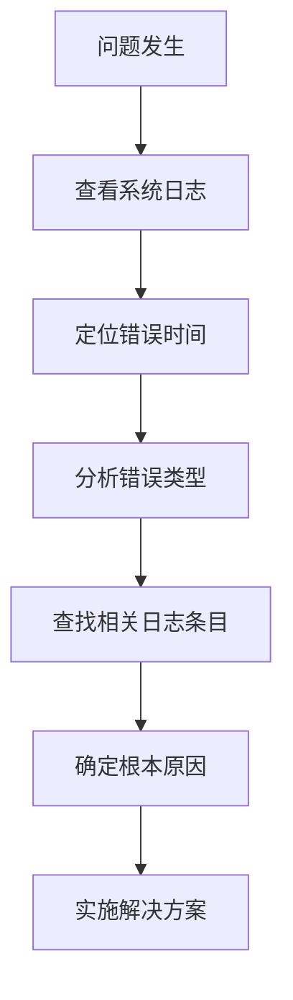

**节来源**
- [reply_server.py](file://reply_server.py#L246-L261)

### 性能监控

系统提供了基本的性能监控功能：

| 监控指标 | 说明 | 阈值建议 |
|----------|------|----------|
| 登录成功率 | 成功登录/总登录尝试 | >95% |
| Token生成时间 | Token生成耗时 | <100ms |
| 验证码发送时间 | 邮件验证码发送耗时 | <5s |
| 并发登录数 | 同时在线用户数 | 根据服务器性能调整 |

通过监控这些指标，可以及时发现和解决系统性能问题。