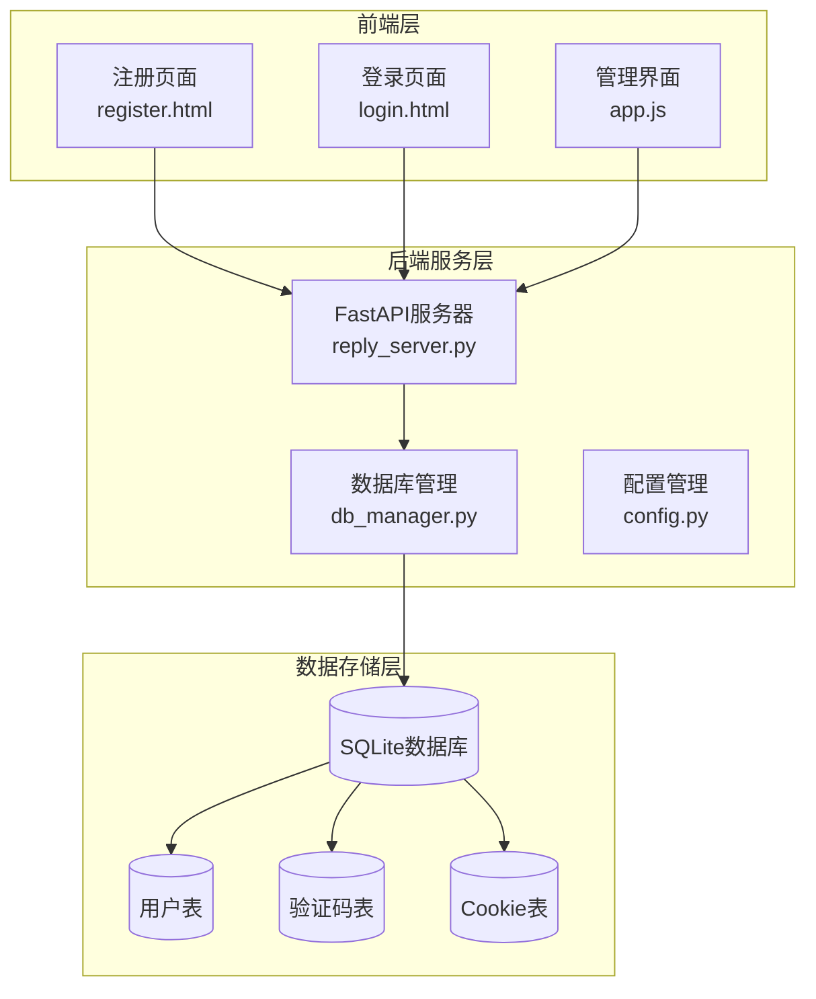
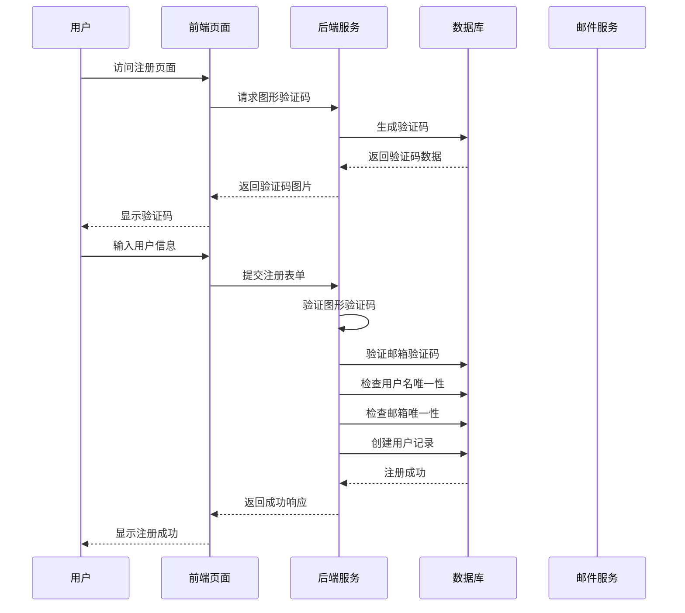
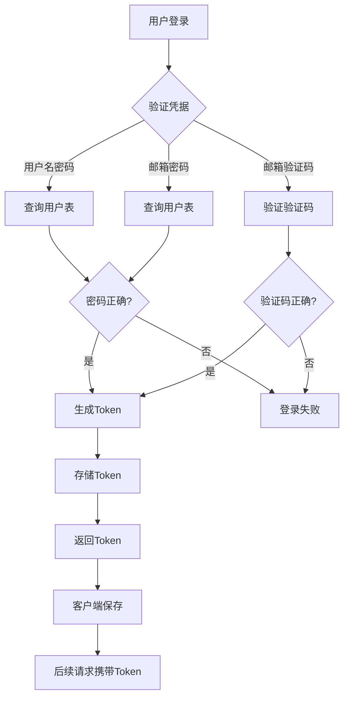
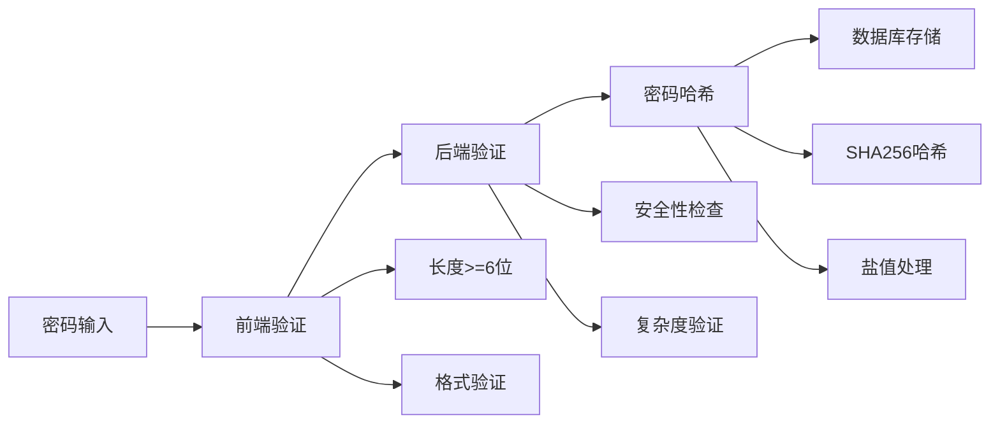
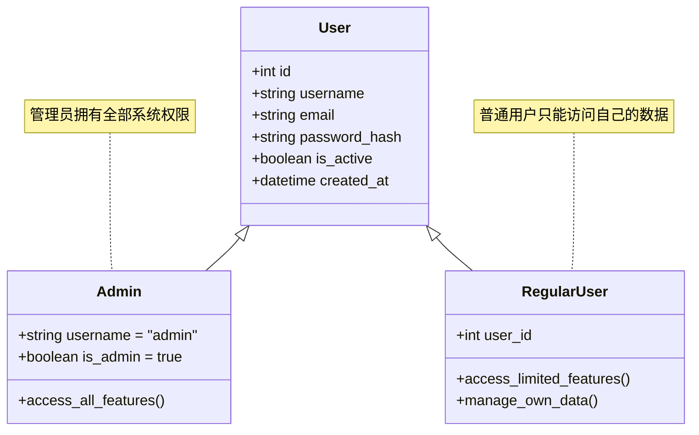
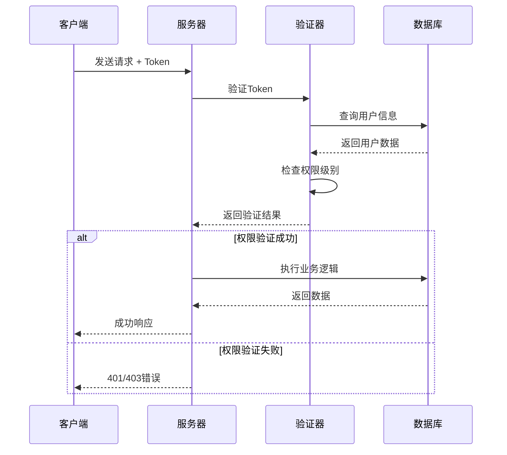
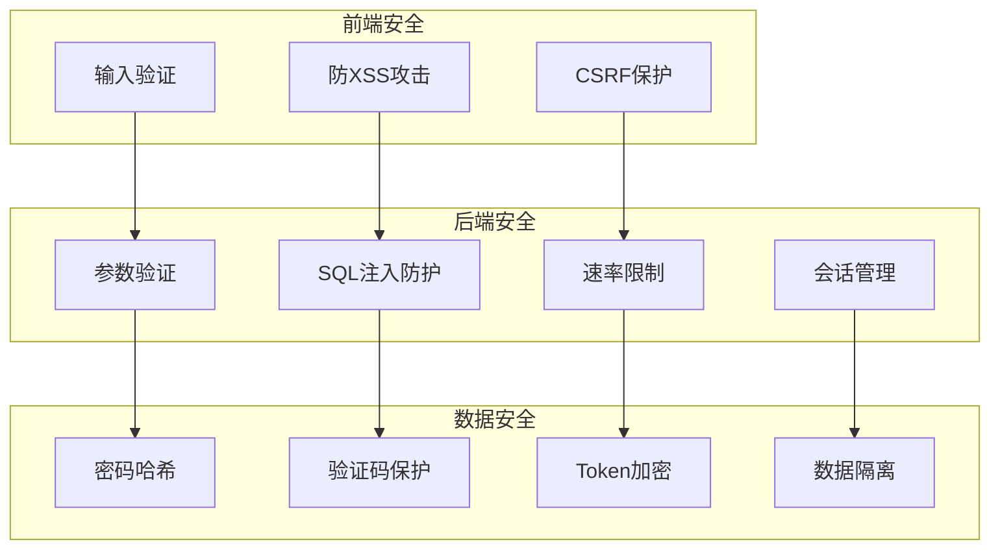
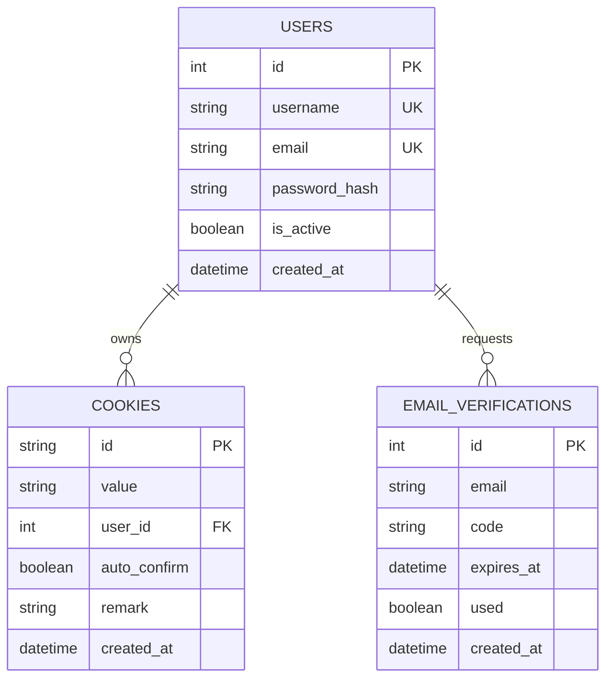
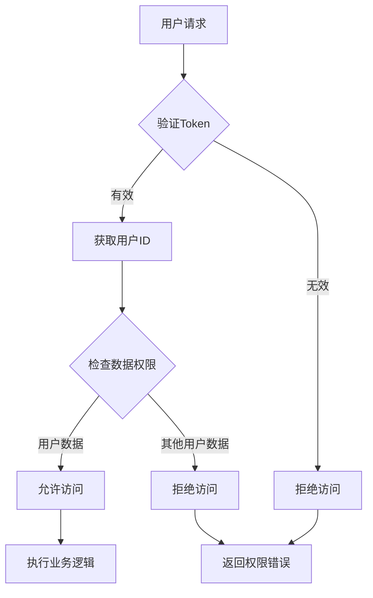

# 用户管理接口

<cite>
**本文档引用的文件**
- [register.html](file://static/register.html)
- [login.html](file://static/login.html)
- [app.js](file://static/js/app.js)
- [reply_server.py](file://reply_server.py)
- [db_manager.py](file://db_manager.py)
- [config.py](file://config.py)
- [qr_login.py](file://utils/qr_login.py)
</cite>

## 目录
1. [简介](#简介)
2. [项目架构概览](#项目架构概览)
3. [用户注册流程](#用户注册流程)
4. [用户认证机制](#用户认证机制)
5. [密码管理](#密码管理)
6. [权限验证系统](#权限验证系统)
7. [API接口详解](#api接口详解)
8. [安全防护措施](#安全防护措施)
9. [多用户数据隔离](#多用户数据隔离)
10. [故障排除指南](#故障排除指南)
11. [总结](#总结)

## 简介

闲鱼自动回复系统是一个基于FastAPI构建的Web应用，提供了完整的用户管理功能，包括用户注册、登录认证、密码修改和权限验证等核心功能。系统采用SQLite数据库存储用户信息，实现了严格的多用户数据隔离和安全防护机制。

## 项目架构概览

系统采用前后端分离架构，主要组件包括：



**图表来源**
- [reply_server.py](file://reply_server.py#L1-L50)
- [db_manager.py](file://db_manager.py#L1-L50)

**章节来源**
- [reply_server.py](file://reply_server.py#L1-L100)
- [db_manager.py](file://db_manager.py#L16-L100)

## 用户注册流程

### 注册流程图



**图表来源**
- [register.html](file://static/register.html#L467-L531)
- [reply_server.py](file://reply_server.py#L844-L905)

### 注册表单验证

注册页面提供了全面的前端验证机制：

| 验证项目 | 验证规则 | 错误提示 |
|---------|---------|---------|
| 用户名 | 3-20字符，仅允许字母、数字、下划线 | 用户名长度必须在3-20个字符之间 |
| 邮箱 | 有效邮箱格式 | 请输入有效的邮箱地址 |
| 密码 | 至少6个字符 | 密码长度至少6位 |
| 确认密码 | 与密码一致 | 两次输入的密码不匹配 |
| 图形验证码 | 4位字符 | 请输入4位图形验证码 |
| 邮箱验证码 | 6位数字 | 请输入6位验证码 |

### 邮箱验证机制

系统实现了完善的邮箱验证流程：

1. **验证码生成**：系统自动生成6位数字验证码
2. **时效控制**：验证码有效期为5分钟
3. **频率限制**：每60秒最多发送一次
4. **邮件发送**：通过SMTP服务发送验证码邮件
5. **重复验证**：防止同一邮箱重复注册

**章节来源**
- [register.html](file://static/register.html#L291-L531)
- [reply_server.py](file://reply_server.py#L800-L834)

## 用户认证机制

### JWT Token认证流程



**图表来源**
- [reply_server.py](file://reply_server.py#L542-L654)

### Token管理机制

系统采用基于内存的Token管理：

| 组件 | 功能 | 配置参数 |
|------|------|----------|
| Token生成 | 使用secrets模块生成随机Token | 32字节URL安全字符串 |
| 存储位置 | 内存字典SESSION_TOKENS | {token: user_info} |
| 过期时间 | 24小时 | TOKEN_EXPIRE_TIME = 24小时 |
| 清理机制 | 自动清理过期Token | 定期扫描清理 |

### 认证方式支持

系统支持多种登录方式：

1. **用户名密码登录**
   - 支持用户名和密码组合
   - 支持邮箱和密码组合
   - 支持邮箱验证码登录

2. **图形验证码保护**
   - 防止机器人恶意注册
   - 验证码有效期5分钟
   - 支持手动刷新

**章节来源**
- [reply_server.py](file://reply_server.py#L178-L220)
- [login.html](file://static/login.html#L307-L401)

## 密码管理

### 密码安全策略



**图表来源**
- [db_manager.py](file://db_manager.py#L613-L628)

### 密码修改功能

管理员可以通过专门的密码修改接口更新系统密码：

| 接口路径 | 方法 | 功能描述 |
|---------|------|----------|
| `/change-admin-password` | POST | 修改管理员密码 |
| 验证方式 | Bearer Token | 需要管理员权限 |
| 参数验证 | 当前密码+新密码 | 确保操作安全性 |

### 密码存储机制

系统采用以下安全措施：

1. **哈希算法**：使用SHA256进行密码哈希
2. **盐值处理**：每个密码都有独立的盐值
3. **不可逆存储**：数据库中只存储哈希值
4. **定期更新**：支持密码定期更换

**章节来源**
- [reply_server.py](file://reply_server.py#L683-L705)
- [db_manager.py](file://db_manager.py#L613-L628)

## 权限验证系统

### 角色权限模型



**图表来源**
- [db_manager.py](file://db_manager.py#L74-L83)
- [reply_server.py](file://reply_server.py#L202-L212)

### 权限验证层级

系统实现了多层级的权限控制：

| 层级 | 验证内容 | 实现方式 |
|------|----------|----------|
| 会话验证 | Token有效性 | verify_token函数 |
| 用户验证 | 用户身份 | get_current_user依赖 |
| 管理员验证 | 管理员权限 | require_admin装饰器 |
| 数据隔离 | 用户数据边界 | 用户ID绑定 |

### 权限检查流程



**图表来源**
- [reply_server.py](file://reply_server.py#L183-L220)

**章节来源**
- [reply_server.py](file://reply_server.py#L183-L220)
- [app.js](file://static/js/app.js#L9443-L9470)

## API接口详解

### 用户注册接口

**接口定义**
```http
POST /register
Content-Type: application/json

{
    "username": "string",
    "email": "string",
    "password": "string", 
    "verification_code": "string"
}
```

**响应格式**
```http
200 OK
{
    "success": true/false,
    "message": "string"
}
```

**请求参数说明**

| 参数名 | 类型 | 必填 | 说明 |
|--------|------|------|------|
| username | string | 是 | 用户名，3-20字符，仅允许字母、数字、下划线 |
| email | string | 是 | 邮箱地址，需要验证 |
| password | string | 是 | 密码，至少6位 |
| verification_code | string | 是 | 6位邮箱验证码 |

### 登录接口

**接口定义**
```http
POST /login
Content-Type: application/json

{
    "username": "string",      // 可选
    "password": "string",      // 可选  
    "email": "string",         // 可选
    "verification_code": "string"  // 可选
}
```

**响应格式**
```http
200 OK
{
    "success": true,
    "token": "string",
    "user_id": 1,
    "username": "string",
    "is_admin": true/false,
    "message": "登录成功"
}
```

### 验证码相关接口

**生成图形验证码**
```http
POST /generate-captcha
Content-Type: application/json

{
    "session_id": "string"
}
```

**验证图形验证码**
```http
POST /verify-captcha
Content-Type: application/json

{
    "session_id": "string",
    "captcha_code": "string"
}
```

**发送邮箱验证码**
```http
POST /send-verification-code
Content-Type: application/json

{
    "email": "string",
    "session_id": "string",
    "type": "register/login"
}
```

### 权限验证接口

**验证Token**
```http
GET /verify
Authorization: Bearer {token}
```

**响应格式**
```http
200 OK
{
    "authenticated": true,
    "user_id": 1,
    "username": "string",
    "is_admin": true/false
}
```

**章节来源**
- [reply_server.py](file://reply_server.py#L844-L905)
- [reply_server.py](file://reply_server.py#L542-L654)
- [reply_server.py](file://reply_server.py#L708-L834)

## 安全防护措施

### 多重安全机制



**图表来源**
- [register.html](file://static/register.html#L478-L511)
- [reply_server.py](file://reply_server.py#L178-L220)

### 安全特性详解

| 安全特性 | 实现方式 | 防护目标 |
|---------|----------|----------|
| 图形验证码 | 前后端配合验证 | 防止机器人注册 |
| 邮箱验证 | SMTP邮件发送 | 确保邮箱真实性 |
| 密码哈希 | SHA256算法 | 保护用户密码 |
| Token过期 | 24小时自动过期 | 防止Token滥用 |
| 数据隔离 | 用户ID绑定 | 防止数据泄露 |
| 权限控制 | 多层级验证 | 防止越权访问 |

### 防护措施实施

1. **输入验证**
   - 前端JavaScript验证
   - 后端Python验证
   - SQL注入防护

2. **传输安全**
   - HTTPS协议
   - Token加密传输
   - 敏感数据脱敏

3. **存储安全**
   - 密码哈希存储
   - 验证码时效控制
   - 数据访问权限控制

**章节来源**
- [register.html](file://static/register.html#L291-L300)
- [reply_server.py](file://reply_server.py#L178-L220)

## 多用户数据隔离

### 数据隔离架构



**图表来源**
- [db_manager.py](file://db_manager.py#L74-L124)

### 用户ID绑定机制

系统通过用户ID实现严格的数据隔离：

| 数据表 | 用户关联字段 | 隔离机制 |
|--------|-------------|----------|
| users | 主键ID | 用户基本信息 |
| cookies | user_id外键 | Cookie数据归属 |
| keywords | cookie_id外键 | 关键字规则归属 |
| cards | user_id外键 | 卡券数据归属 |
| orders | cookie_id外键 | 订单数据归属 |

### 权限检查机制



**图表来源**
- [reply_server.py](file://reply_server.py#L1141-L1200)

### 数据访问控制

系统实现了细粒度的数据访问控制：

1. **读取控制**：用户只能访问自己的数据
2. **写入控制**：用户只能修改自己的数据
3. **删除控制**：用户不能删除其他用户的数据
4. **查询过滤**：自动添加用户ID过滤条件

**章节来源**
- [db_manager.py](file://db_manager.py#L1156-L1200)
- [reply_server.py](file://reply_server.py#L1141-L1200)

## 故障排除指南

### 常见问题及解决方案

| 问题类型 | 症状描述 | 解决方案 |
|---------|----------|----------|
| 注册失败 | 验证码错误 | 检查邮箱验证码时效性 |
| 登录失败 | 密码错误 | 确认用户名密码正确性 |
| Token过期 | 401错误 | 重新登录获取新Token |
| 权限不足 | 403错误 | 检查用户角色权限 |
| 数据访问失败 | 数据不显示 | 验证用户数据隔离设置 |

### 调试工具和方法

1. **日志查看**
   - 后端日志：查看服务器运行状态
   - 前端日志：查看JavaScript错误
   - 数据库日志：查看SQL执行情况

2. **网络调试**
   - 浏览器开发者工具
   - 网络请求监控
   - API响应分析

3. **数据库调试**
   - SQLite数据库查看
   - 数据一致性检查
   - 用户数据验证

### 性能优化建议

1. **缓存策略**
   - Token缓存减少数据库查询
   - 用户信息缓存提升响应速度
   - 验证码缓存降低服务器压力

2. **数据库优化**
   - 添加适当的索引
   - 定期清理过期数据
   - 优化查询语句

3. **网络优化**
   - 启用HTTP/2协议
   - 压缩静态资源
   - CDN加速静态文件

**章节来源**
- [reply_server.py](file://reply_server.py#L330-L357)
- [db_manager.py](file://db_manager.py#L1102-L1141)

## 总结

闲鱼自动回复系统的用户管理接口设计完整，安全可靠，具有以下特点：

### 核心优势

1. **安全性强**：多重验证机制，数据加密存储
2. **易用性好**：简洁的注册登录流程，友好的用户界面
3. **扩展性强**：模块化设计，易于功能扩展
4. **性能优**：合理的缓存策略，高效的数据库设计

### 技术亮点

- **JWT Token认证**：现代Web应用的标准认证方式
- **多用户数据隔离**：确保用户数据安全
- **图形验证码防护**：有效防止机器人攻击
- **邮箱验证机制**：保证用户信息真实性

### 应用价值

该用户管理接口为闲鱼自动回复系统提供了坚实的基础支撑，不仅满足了基本的用户管理需求，还具备了企业级应用的安全性和可靠性特征。通过完善的功能设计和严格的安全控制，系统能够稳定地服务于大量用户，为自动化运营提供可靠的技术保障。