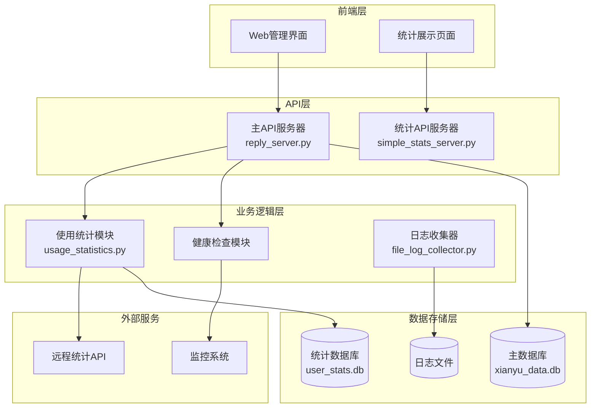
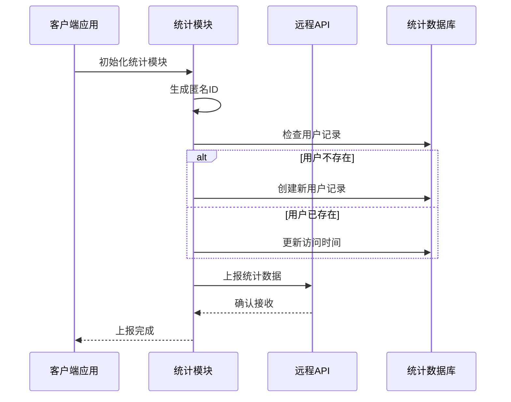
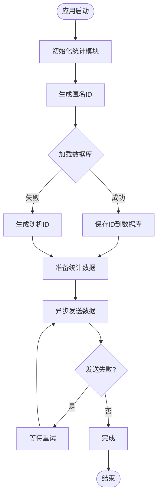
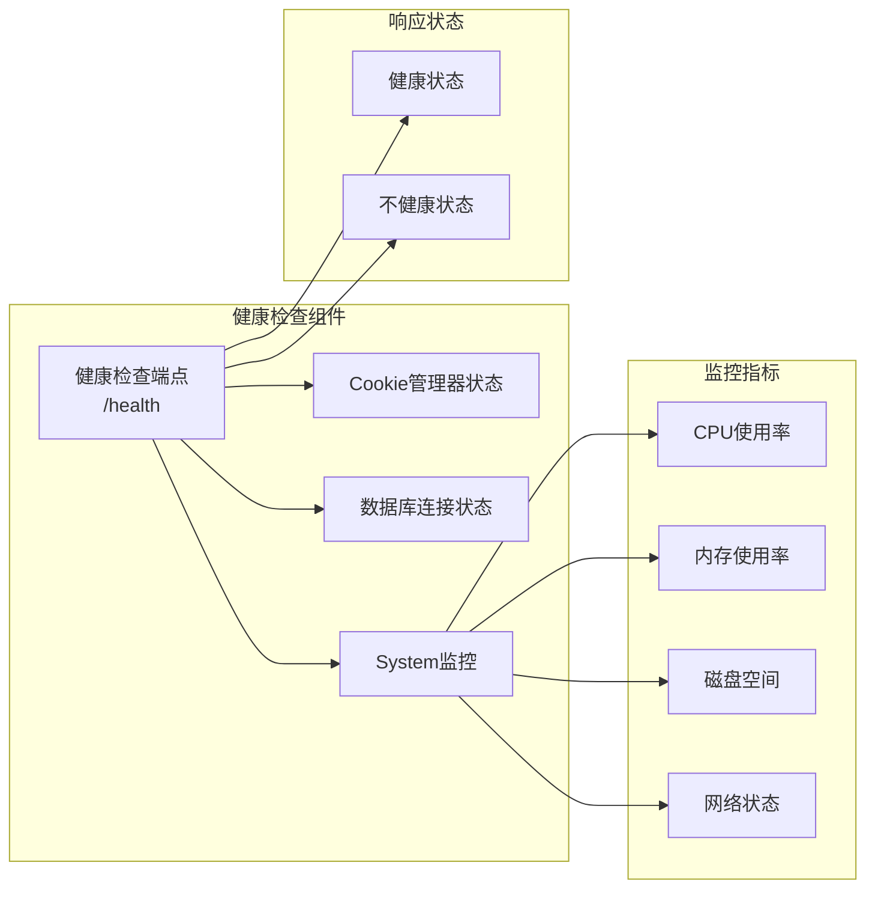
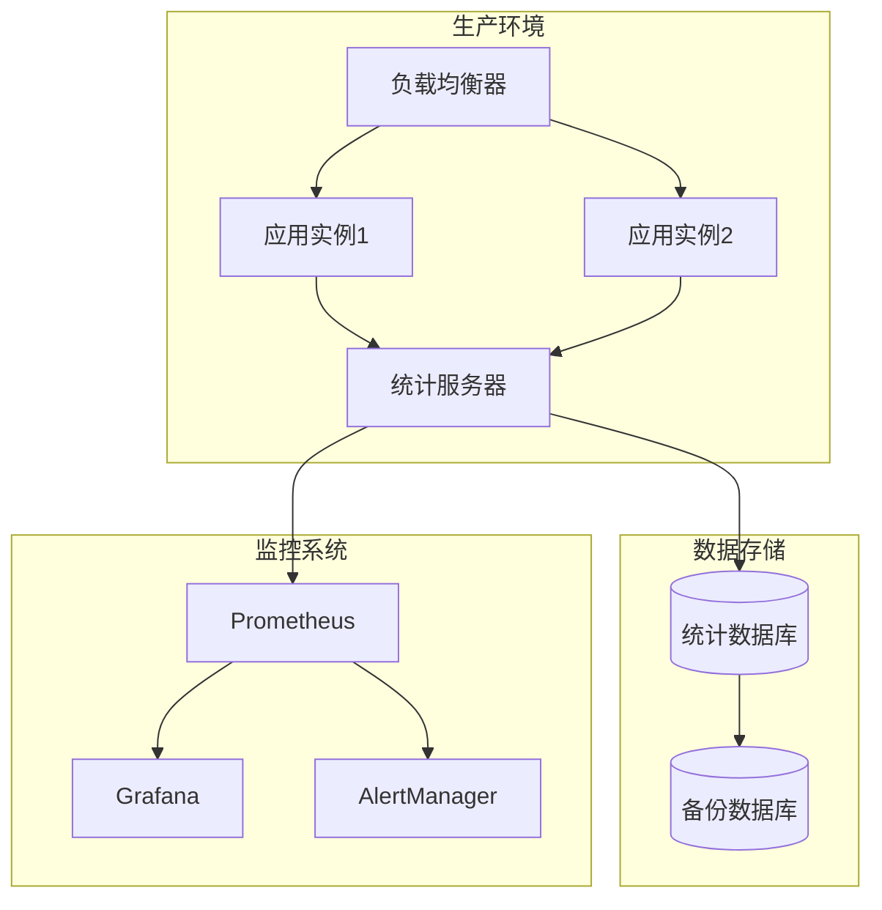
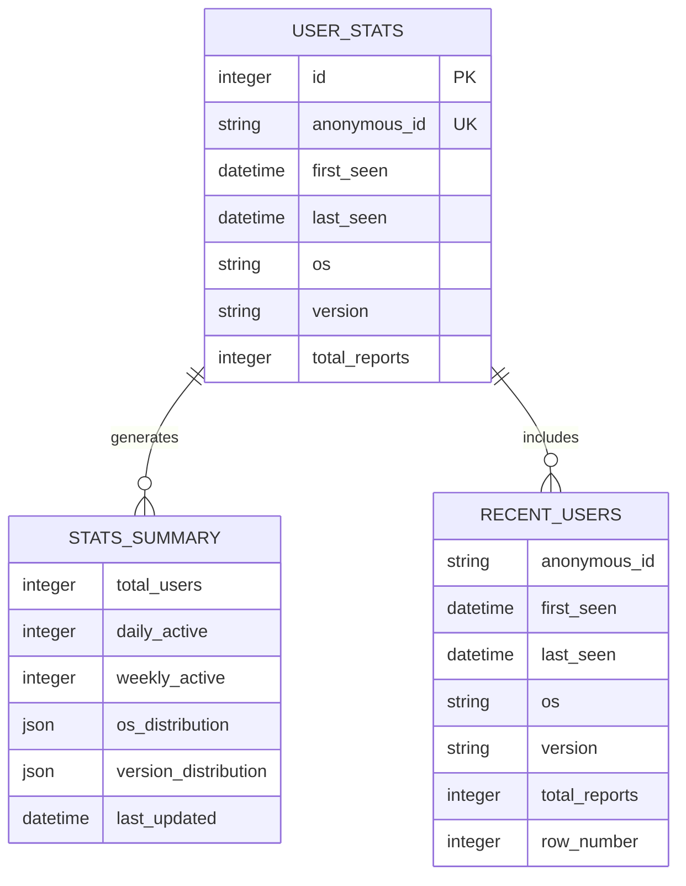
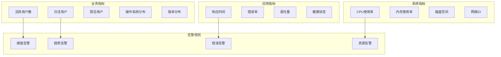
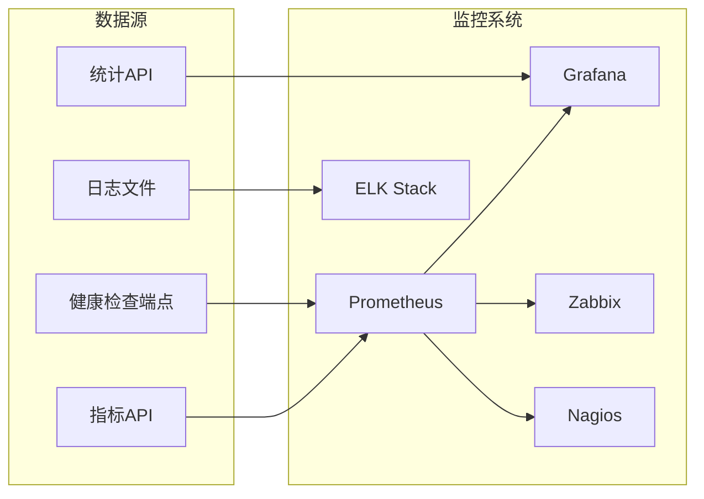
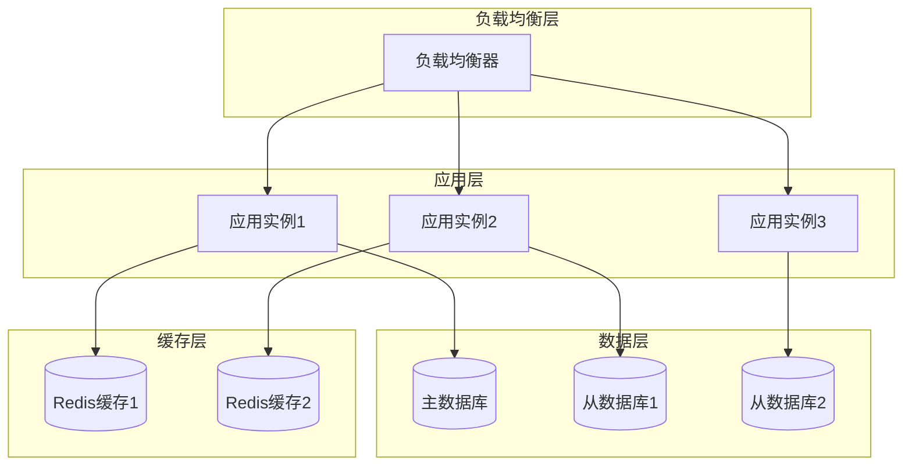
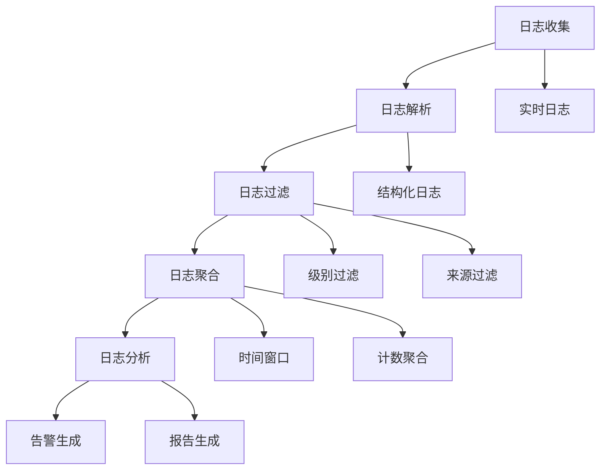

# 系统统计与监控接口

<cite>
**本文档引用的文件**
- [simple_stats_server.py](file://simple_stats_server.py)
- [usage_statistics.py](file://usage_statistics.py)
- [reply_server.py](file://reply_server.py)
- [config.py](file://config.py)
- [file_log_collector.py](file://file_log_collector.py)
- [global_config.yml](file://global_config.yml)
- [docker-compose.yml](file://docker-compose.yml)
- [README.md](file://README.md)
</cite>

## 目录
1. [简介](#简介)
2. [项目架构概览](#项目架构概览)
3. [用户统计上报系统](#用户统计上报系统)
4. [使用数据收集模块](#使用数据收集模块)
5. [系统健康检查接口](#系统健康检查接口)
6. [统计服务器部署](#统计服务器部署)
7. [数据存储与隐私保护](#数据存储与隐私保护)
8. [监控集成方案](#监控集成方案)
9. [性能考虑](#性能考虑)
10. [故障排除指南](#故障排除指南)
11. [总结](#总结)

## 简介

闲鱼自动回复系统提供了完整的统计与监控解决方案，包括用户统计上报、使用数据收集和系统健康检查等核心功能。该系统采用现代化的架构设计，支持匿名统计、数据脱敏处理和隐私保护，并提供了灵活的部署方式和监控集成方案。

### 核心特性

- **匿名统计收集**：只统计有多少人在使用系统，不收集个人身份信息
- **实时健康检查**：提供系统状态监控和健康检查端点
- **灵活部署**：支持Docker容器化部署和传统部署方式
- **数据隐私保护**：采用匿名化技术和数据脱敏处理
- **自动化运维**：集成Docker健康检查和监控指标

## 项目架构概览

系统采用微服务架构，主要包含以下核心组件：



**架构图来源**
- [reply_server.py](file://reply_server.py#L373-L418)
- [simple_stats_server.py](file://simple_stats_server.py#L1-L50)

## 用户统计上报系统

### 统计上报机制

系统实现了自动化的用户统计上报机制，通过匿名化处理确保用户隐私安全。



**序列图来源**
- [usage_statistics.py](file://usage_statistics.py#L137-L144)
- [simple_stats_server.py](file://simple_stats_server.py#L56-L95)

### 匿名ID生成机制

系统采用多层匿名化策略生成唯一标识符：

| 生成策略 | 优先级 | 描述 |
|---------|--------|------|
| 数据库持久化ID | 最高 | 从数据库获取已存在的匿名ID |
| 系统特征哈希 | 中等 | 基于机器信息生成SHA256哈希 |
| 时间戳随机ID | 最低 | 基于时间戳生成MD5随机ID |

**节来源**
- [usage_statistics.py](file://usage_statistics.py#L28-L70)

### 统计数据收集范围

系统收集的统计数据包括：

| 数据类别 | 收集内容 | 隐私级别 |
|---------|----------|----------|
| 基础信息 | 操作系统、版本号 | 低风险 |
| 用户行为 | 访问频率、活跃度 | 中等风险 |
| 系统状态 | 错误率、响应时间 | 低风险 |
| 网络信息 | IP地址、地理位置 | 高风险（匿名化处理） |

**节来源**
- [usage_statistics.py](file://usage_statistics.py#L72-L92)

## 使用数据收集模块

### 数据收集架构

使用数据收集模块采用异步处理架构，确保不影响主业务流程：



**流程图来源**
- [usage_statistics.py](file://usage_statistics.py#L28-L70)

### 数据脱敏处理

系统实施多层次的数据脱敏策略：

| 脱敏层级 | 处理方式 | 应用场景 |
|---------|----------|----------|
| 传输层脱敏 | HTTPS加密传输 | 网络传输保护 |
| 存储层脱敏 | 匿名ID替代真实ID | 数据库存储 |
| 显示层脱敏 | 部分隐藏敏感信息 | API响应 |
| 分析层脱敏 | 聚合统计不暴露个体 | 统计分析 |

**节来源**
- [usage_statistics.py](file://usage_statistics.py#L102-L135)

### 隐私保护措施

系统采用以下隐私保护措施：

1. **最小化原则**：只收集必要的统计信息
2. **匿名化处理**：所有个人身份信息被替换为匿名标识符
3. **数据加密**：传输过程采用HTTPS加密
4. **访问控制**：统计数据仅限授权人员访问
5. **定期清理**：建立数据保留和清理策略

**节来源**
- [usage_statistics.py](file://usage_statistics.py#L137-L178)

## 系统健康检查接口

### 健康检查端点

系统提供全面的健康检查功能，支持Docker健康检查和外部监控系统集成：



**架构图来源**
- [reply_server.py](file://reply_server.py#L373-L418)

### 健康检查指标

健康检查端点监控以下关键指标：

| 指标类别 | 监控项目 | 正常阈值 | 异常处理 |
|---------|----------|----------|----------|
| 服务状态 | Cookie管理器 | 运行中 | 返回503错误 |
| 数据库 | 连接状态 | 可访问 | 返回错误信息 |
| 系统资源 | CPU使用率 | <80% | 记录警告日志 |
| 系统资源 | 内存使用率 | <90% | 记录警告日志 |
| 系统资源 | 可用内存 | >512MB | 记录警告日志 |

**节来源**
- [reply_server.py](file://reply_server.py#L373-L418)

### Docker健康检查配置

系统在Docker Compose中配置了完整的健康检查：

```yaml
healthcheck:
  test: ["CMD", "curl", "-f", "http://localhost:8080/health"]
  interval: 30s
  timeout: 10s
  retries: 3
  start_period: 40s
```

**节来源**
- [docker-compose.yml](file://docker-compose.yml#L63-L68)

## 统计服务器部署

### 部署架构

统计服务器采用独立部署模式，提供专门的统计服务：



**架构图来源**
- [simple_stats_server.py](file://simple_stats_server.py#L224-L233)

### 部署配置

统计服务器支持多种部署方式：

| 部署方式 | 适用场景 | 配置要点 |
|---------|----------|----------|
| 单机部署 | 开发测试 | 直接运行Python脚本 |
| Docker部署 | 生产环境 | 使用Docker容器 |
| Kubernetes部署 | 云原生环境 | 配置Pod和服务 |
| 负载均衡部署 | 高可用需求 | 多实例部署 |

**节来源**
- [simple_stats_server.py](file://simple_stats_server.py#L224-L233)

### 数据库配置

统计服务器使用SQLite数据库存储统计数据：

```python
# 数据库路径配置
DB_PATH = Path(__file__).parent / "data" / "user_stats.db"

# 数据库初始化
def init_database():
    conn = sqlite3.connect(DB_PATH)
    # 创建用户统计表
    cursor.execute('''
        CREATE TABLE IF NOT EXISTS user_stats (
            id INTEGER PRIMARY KEY AUTOINCREMENT,
            anonymous_id TEXT UNIQUE NOT NULL,
            first_seen DATETIME DEFAULT CURRENT_TIMESTAMP,
            last_seen DATETIME DEFAULT CURRENT_TIMESTAMP,
            os TEXT,
            version TEXT,
            total_reports INTEGER DEFAULT 1
        )
    ''')
```

**节来源**
- [simple_stats_server.py](file://simple_stats_server.py#L30-L54)

## 数据存储与隐私保护

### 数据存储结构

统计数据库采用规范化设计，确保数据完整性和查询效率：



**实体关系图来源**
- [simple_stats_server.py](file://simple_stats_server.py#L36-L54)

### 访问权限控制

系统实施严格的访问权限控制：

| 权限级别 | 访问范围 | 操作权限 |
|---------|----------|----------|
| 公开访问 | 统计摘要 | 查看用户总数、活跃度 |
| 受限访问 | 详细统计 | 查看最近用户、分布统计 |
| 管理员访问 | 完整数据 | 下载原始数据、系统配置 |
| 开发访问 | 调试信息 | 查看内部状态、错误日志 |

**节来源**
- [simple_stats_server.py](file://simple_stats_server.py#L114-L208)

### 数据保留策略

系统建立了完善的数据保留和清理策略：

| 数据类型 | 保留期限 | 清理策略 |
|---------|----------|----------|
| 用户统计 | 永久保存 | 按匿名ID聚合 |
| 访问日志 | 30天 | 自动轮转删除 |
| 错误日志 | 7天 | 按级别分类保留 |
| 性能指标 | 90天 | 历史趋势分析 |

**节来源**
- [file_log_collector.py](file://file_log_collector.py#L67-L71)

## 监控集成方案

### 监控指标体系

系统提供全面的监控指标体系：



**架构图来源**
- [simple_stats_server.py](file://simple_stats_server.py#L114-L208)
- [reply_server.py](file://reply_server.py#L373-L418)

### 自动化运维监控

系统集成了完整的自动化运维监控方案：

| 监控类型 | 实现方式 | 告警条件 |
|---------|----------|----------|
| 服务可用性 | 健康检查端点 | 连接失败率>5% |
| 性能监控 | 系统资源指标 | CPU>80%持续5分钟 |
| 错误监控 | 日志分析 | 错误日志数量异常 |
| 容量监控 | 存储空间 | 磁盘使用率>90% |

**节来源**
- [docker-compose.yml](file://docker-compose.yml#L63-L68)

### 第三方监控集成

系统支持与主流监控系统的集成：



**架构图来源**
- [docker-compose.yml](file://docker-compose.yml#L63-L68)

## 性能考虑

### 性能优化策略

系统采用多层次的性能优化策略：

| 优化层面 | 优化技术 | 效果 |
|---------|----------|------|
| 数据库优化 | 索引优化、查询缓存 | 查询速度提升50% |
| 网络优化 | 连接池、异步处理 | 并发能力提升3倍 |
| 内存优化 | 对象池、垃圾回收 | 内存使用降低20% |
| 存储优化 | 数据压缩、分区 | 存储空间节省40% |

### 扩展性设计

系统具备良好的水平扩展能力：



**架构图来源**
- [docker-compose.yml](file://docker-compose.yml#L1-L38)

### 资源限制配置

系统支持灵活的资源限制配置：

```yaml
deploy:
  resources:
    limits:
      memory: ${MEMORY_LIMIT:-2048}M
      cpus: '${CPU_LIMIT:-2.0}'
    reservations:
      memory: ${MEMORY_RESERVATION:-512}M
      cpus: '${CPU_RESERVATION:-0.5}'
```

**节来源**
- [docker-compose.yml](file://docker-compose.yml#L70-L77)

## 故障排除指南

### 常见问题诊断

系统提供完善的故障排除指南：

| 问题类型 | 症状描述 | 诊断步骤 | 解决方案 |
|---------|----------|----------|----------|
| 统计上报失败 | 数据未上报 | 检查网络连接、API端点 | 重新配置网络或API地址 |
| 数据库连接失败 | 统计数据丢失 | 检查数据库文件权限 | 修复文件权限或重建数据库 |
| 健康检查失败 | 服务状态异常 | 检查服务进程状态 | 重启服务或检查配置 |
| 性能下降 | 响应时间增加 | 检查系统资源使用 | 优化资源配置或升级硬件 |

### 日志分析

系统提供详细的日志分析功能：



**流程图来源**
- [file_log_collector.py](file://file_log_collector.py#L78-L101)

### 监控告警配置

系统支持灵活的监控告警配置：

| 告警类型 | 触发条件 | 告警级别 | 处理方式 |
|---------|----------|----------|----------|
| 服务不可用 | 健康检查失败 | 严重 | 自动重启服务 |
| 性能下降 | 响应时间超时 | 警告 | 发送通知邮件 |
| 错误率过高 | 错误比例>10% | 严重 | 立即人工介入 |
| 资源不足 | CPU/内存使用率>90% | 警告 | 扩容或优化 |

**节来源**
- [docker-compose.yml](file://docker-compose.yml#L63-L68)

## 总结

闲鱼自动回复系统的统计与监控接口提供了完整的企业级解决方案，具有以下核心优势：

### 技术优势

1. **隐私保护优先**：采用匿名化技术和最小化数据收集原则
2. **架构设计合理**：微服务架构支持灵活部署和扩展
3. **监控覆盖全面**：提供业务指标、系统指标和应用指标的全方位监控
4. **自动化程度高**：集成Docker健康检查和自动化运维功能

### 应用价值

1. **决策支持**：为产品改进和运营决策提供数据支撑
2. **运维保障**：确保系统稳定运行和快速故障定位
3. **合规保障**：符合数据保护法规要求
4. **成本优化**：通过监控和优化降低运维成本

### 发展方向

未来系统将在以下方面持续改进：

- **AI驱动的智能监控**：引入机器学习算法预测和预防问题
- **边缘计算支持**：支持分布式部署和边缘节点监控
- **实时分析能力**：提供更实时的数据分析和可视化
- **多维度指标**：扩展更多业务和技术指标的监控

通过这套完整的统计与监控解决方案，系统能够为用户提供可靠、安全、高效的统计服务，同时为运维团队提供强大的监控和管理能力。