# AI智能回复引擎接口

<cite>
**本文档引用的文件**
- [ai_reply_engine.py](file://ai_reply_engine.py)
- [reply_server.py](file://reply_server.py)
- [config.py](file://config.py)
- [db_manager.py](file://db_manager.py)
</cite>

## 目录
1. [简介](#简介)
2. [系统架构](#系统架构)
3. [核心组件](#核心组件)
4. [AIReplyEngine类详解](#aireplyengine类详解)
5. [异步处理流程](#异步处理流程)
6. [意图识别算法](#意图识别算法)
7. [多模型API支持](#多模型api支持)
8. [数据库集成](#数据库集成)
9. [API端点集成](#api端点集成)
10. [配置管理](#配置管理)
11. [性能优化](#性能优化)
12. [故障排除](#故障排除)

## 简介

AI智能回复引擎是闲鱼自动回复系统的核心组件，负责基于用户消息生成智能化的AI回复。该引擎采用无状态设计，支持多种AI模型，具备强大的意图识别能力和灵活的配置系统。

### 主要特性

- **无状态设计**：支持多进程部署，移除客户端缓存
- **多模型支持**：兼容OpenAI、Gemini、DashScope API
- **智能意图识别**：基于关键词的本地意图检测
- **防抖机制**：10秒消息收集窗口和防抖处理
- **议价控制**：基于数据库的议价次数统计和轮数限制
- **异步处理**：支持异步调用和线程池执行

## 系统架构

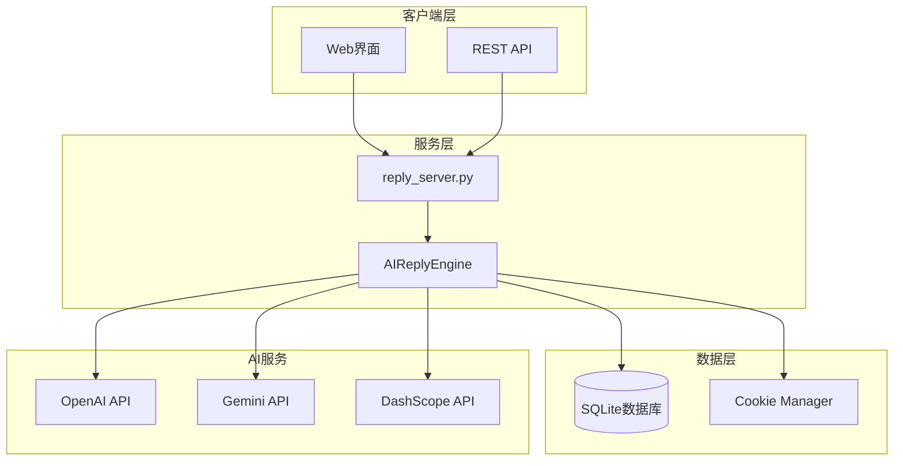

**图表来源**
- [reply_server.py](file://reply_server.py#L1-L50)
- [ai_reply_engine.py](file://ai_reply_engine.py#L24-L50)

## 核心组件

### AIReplyEngine类

AIReplyEngine是整个系统的核心类，负责AI回复的生成和管理。

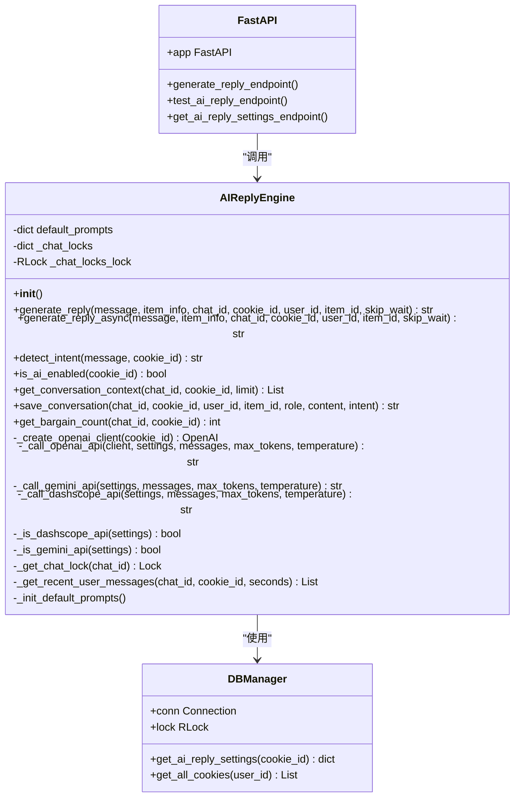

**图表来源**
- [ai_reply_engine.py](file://ai_reply_engine.py#L24-L100)
- [db_manager.py](file://db_manager.py#L16-L50)
- [reply_server.py](file://reply_server.py#L1-L50)

**章节来源**
- [ai_reply_engine.py](file://ai_reply_engine.py#L24-L100)

## AIReplyEngine类详解

### 初始化与配置

AIReplyEngine采用无状态设计，移除了所有有状态的缓存机制，以支持多进程部署。

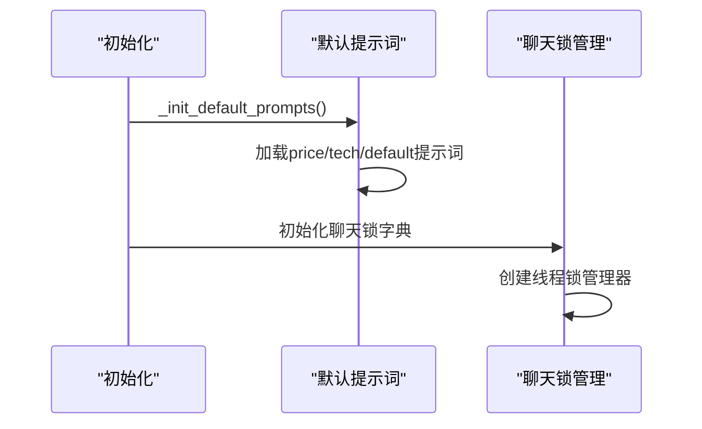

**图表来源**
- [ai_reply_engine.py](file://ai_reply_engine.py#L27-L35)
- [ai_reply_engine.py](file://ai_reply_engine.py#L37-L60)

### 核心方法概览

| 方法名 | 功能描述 | 返回类型 |
|--------|----------|----------|
| `generate_reply` | 生成AI回复的主要方法 | `Optional[str]` |
| `generate_reply_async` | 异步包装器 | `Optional[str]` |
| `detect_intent` | 意图识别 | `str` |
| `is_ai_enabled` | 检查AI是否启用 | `bool` |
| `get_bargain_count` | 获取议价次数 | `int` |
| `save_conversation` | 保存对话记录 | `Optional[str]` |

**章节来源**
- [ai_reply_engine.py](file://ai_reply_engine.py#L283-L420)

## 异步处理流程

### generate_reply方法流程

generate_reply方法是AI回复生成的核心流程，包含10秒的消息收集窗口和防抖机制。

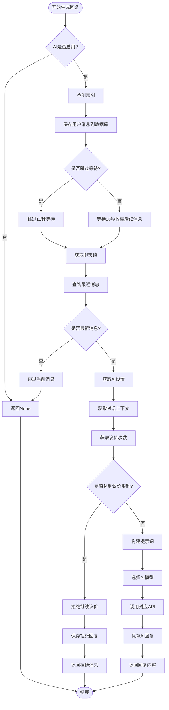

**图表来源**
- [ai_reply_engine.py](file://ai_reply_engine.py#L283-L420)

### 消息收集窗口机制

系统实现了智能的消息收集窗口机制：

- **内部防抖**：当`skip_wait=False`时，固定等待10秒
- **外部防抖**：当`skip_wait=True`时，等待6秒（1秒防抖 + 5秒缓冲）
- **时间窗口**：查询最近25秒或6秒内的用户消息

**章节来源**
- [ai_reply_engine.py](file://ai_reply_engine.py#L298-L315)

## 意图识别算法

### 基于关键词的本地检测

AIReplyEngine采用基于关键词的本地意图识别算法，替代了之前的AI调用方式，显著降低了成本和延迟。

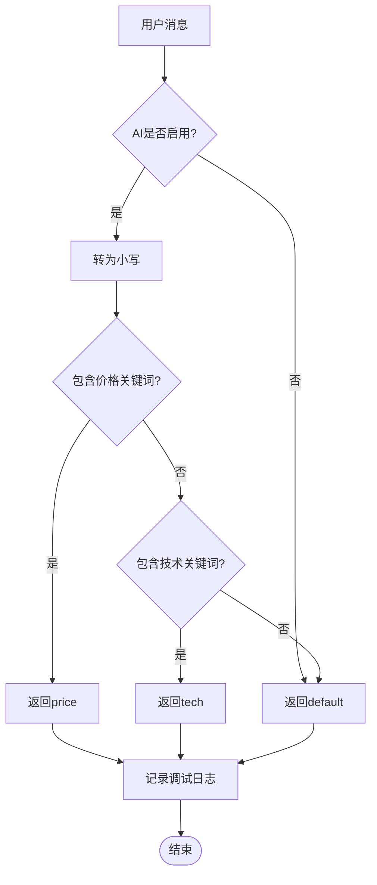

**图表来源**
- [ai_reply_engine.py](file://ai_reply_engine.py#L237-L274)

### 关键词配置

| 意图类型 | 关键词列表 | 示例 |
|----------|------------|------|
| **价格** | `便宜`, `优惠`, `刀`, `降价`, `包邮`, `价格`, `多少钱`, `能少`, `还能`, `最低`, `底价`, `实诚价`, `到100`, `能到`, `包个邮`, `给个价`, `什么价` | "这个多少钱？", "能便宜点吗？" |
| **技术** | `怎么用`, `参数`, `坏了`, `故障`, `设置`, `说明书`, `功能`, `用法`, `教程`, `驱动` | "怎么设置？", "坏了怎么办？" |

**章节来源**
- [ai_reply_engine.py](file://ai_reply_engine.py#L249-L270)

## 多模型API支持

### 无状态客户端设计

AIReplyEngine采用无状态设计，每个API调用都创建新的客户端实例，支持多进程部署。

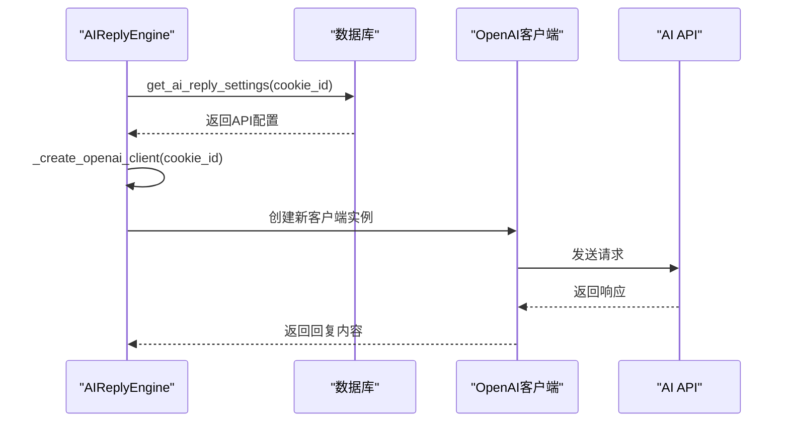

**图表来源**
- [ai_reply_engine.py](file://ai_reply_engine.py#L62-L81)

### API类型识别

系统支持三种主要的AI API：

| API类型 | 检测方法 | 基础URL示例 | 特殊处理 |
|---------|----------|-------------|----------|
| **OpenAI兼容** | 默认情况 | `https://api.openai.com/v1` | 直接调用chat.completions.create |
| **Gemini API** | `_is_gemini_api()` | `https://generativelanguage.googleapis.com/v1beta` | 需要特殊的消息格式转换 |
| **DashScope API** | `_is_dashscope_api()` | `https://dashscope.aliyuncs.com/api/v1` | 需要特殊的请求体格式 |

### 模型调用逻辑

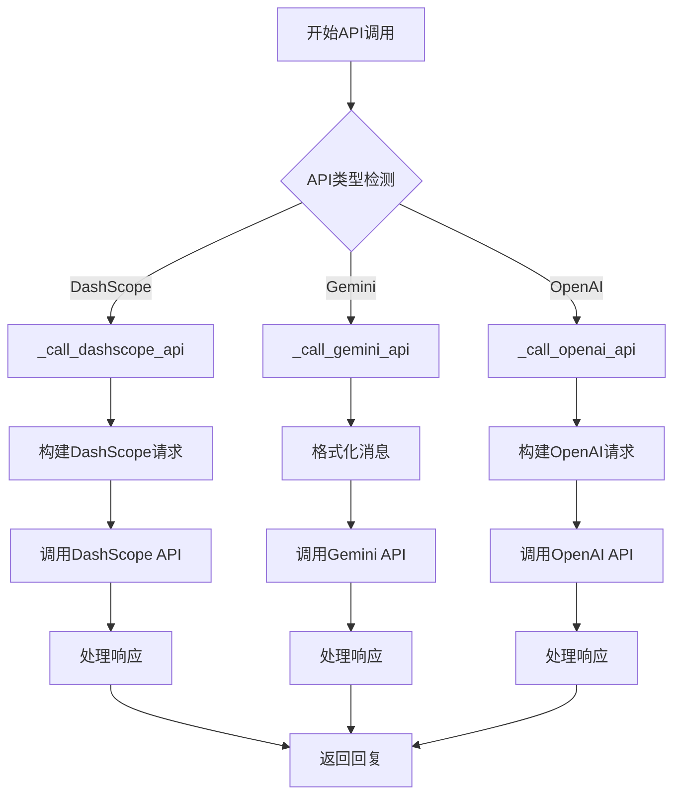

**图表来源**
- [ai_reply_engine.py](file://ai_reply_engine.py#L386-L401)

**章节来源**
- [ai_reply_engine.py](file://ai_reply_engine.py#L62-L401)

## 数据库集成

### 议价次数统计

系统通过数据库查询实现议价次数统计，支持议价轮数限制策略。

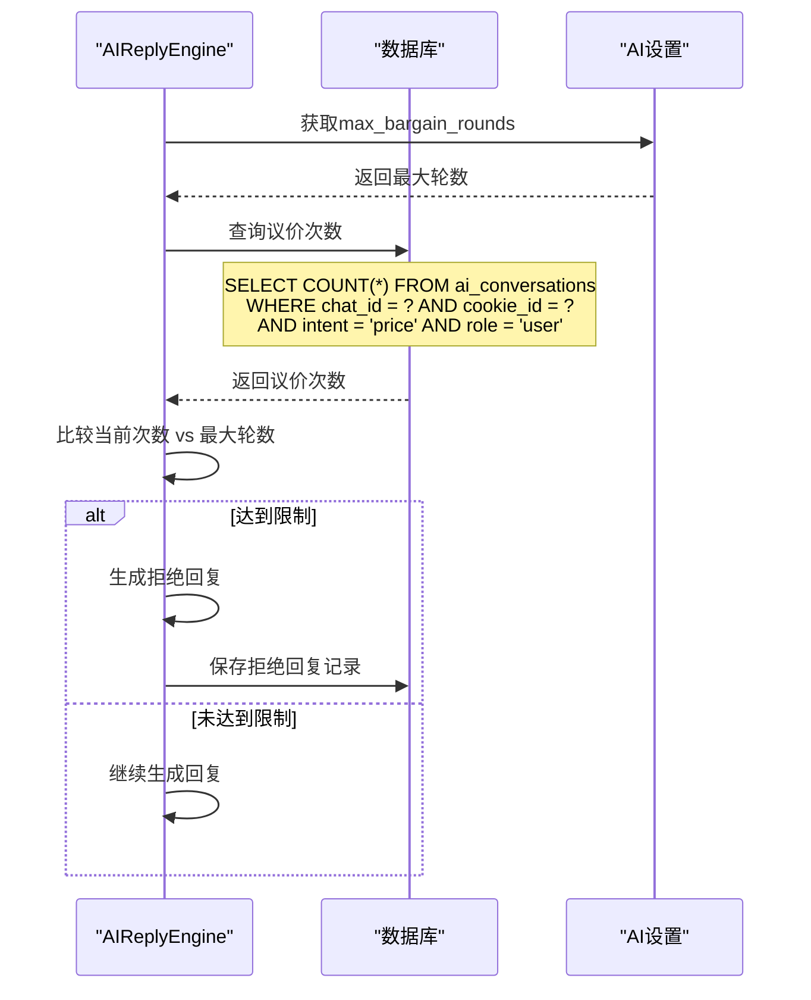

**图表来源**
- [ai_reply_engine.py](file://ai_reply_engine.py#L477-L489)
- [ai_reply_engine.py](file://ai_reply_engine.py#L336-L343)

### 对话历史管理

系统维护详细的对话历史记录，包括：

- **消息内容**：用户和AI的对话内容
- **角色标识**：区分用户消息和AI回复
- **意图标签**：记录消息的意图类型
- **时间戳**：精确的时间记录
- **商品信息**：关联的商品ID和聊天ID

**章节来源**
- [ai_reply_engine.py](file://ai_reply_engine.py#L436-L476)
- [ai_reply_engine.py](file://ai_reply_engine.py#L477-L489)

## API端点集成

### AI回复测试端点

reply_server.py提供了完整的AI回复测试API，支持在线测试和配置验证。

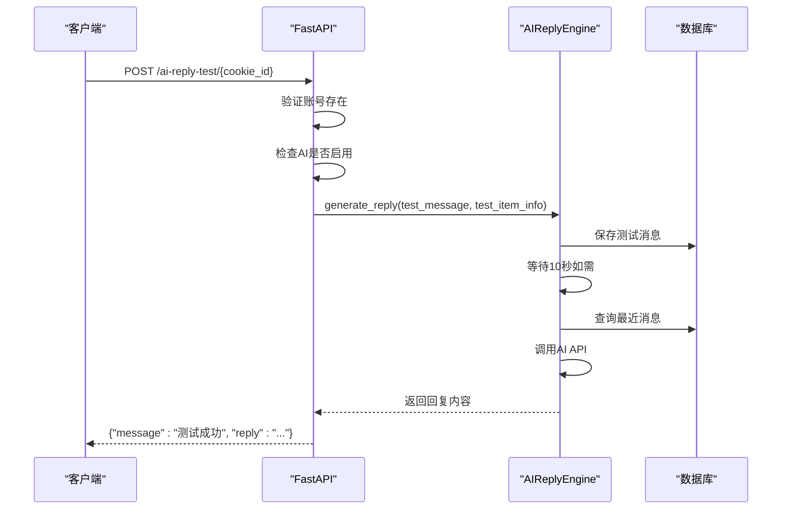

**图表来源**
- [reply_server.py](file://reply_server.py#L4360-L4396)

### 配置管理端点

| 端点 | 方法 | 功能描述 |
|------|------|----------|
| `/ai-reply-settings` | GET | 获取所有账号的AI回复设置 |
| `/ai-reply-settings/{cookie_id}` | PUT | 更新特定账号的AI回复设置 |
| `/ai-reply-test/{cookie_id}` | POST | 测试AI回复功能 |

### API响应格式

```json
{
  "success": true,
  "data": {
    "ai_enabled": true,
    "model_name": "qwen-plus",
    "api_key": "sk-...",
    "base_url": "https://dashscope.aliyuncs.com/compatible-mode/v1",
    "max_discount_percent": 10,
    "max_discount_amount": 100,
    "max_bargain_rounds": 3,
    "custom_prompts": "{}"
  }
}
```

**章节来源**
- [reply_server.py](file://reply_server.py#L4342-L4357)
- [reply_server.py](file://reply_server.py#L4360-L4396)

## 配置管理

### AI设置配置

AIReplyEngine支持丰富的配置选项，通过数据库持久化存储。

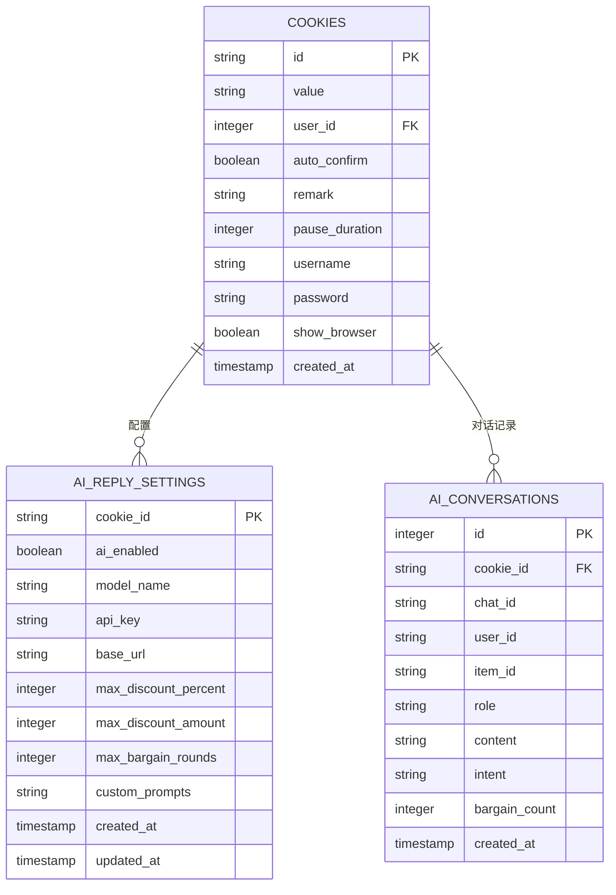

**图表来源**
- [db_manager.py](file://db_manager.py#L150-L166)
- [db_manager.py](file://db_manager.py#L168-L182)

### 默认提示词配置

系统提供三套默认提示词模板：

| 提示词类型 | 用途 | 语言要求 | 主要特点 |
|------------|------|----------|----------|
| **price** | 议价场景 | 简短直接，≤10字/句，≤40字 | 递减优惠策略，强调商品价值 |
| **tech** | 技术咨询 | 简短专业，≤10字/句，≤40字 | 产品功能、使用方法、注意事项 |
| **default** | 通用客服 | 简短友好，≤10字/句，≤40字 | 商品介绍、物流、售后等常见问题 |

**章节来源**
- [ai_reply_engine.py](file://ai_reply_engine.py#L37-L60)
- [db_manager.py](file://db_manager.py#L1809-L1844)

## 性能优化

### 锁机制优化

系统采用细粒度的锁机制，确保同一聊天ID的消息串行处理：

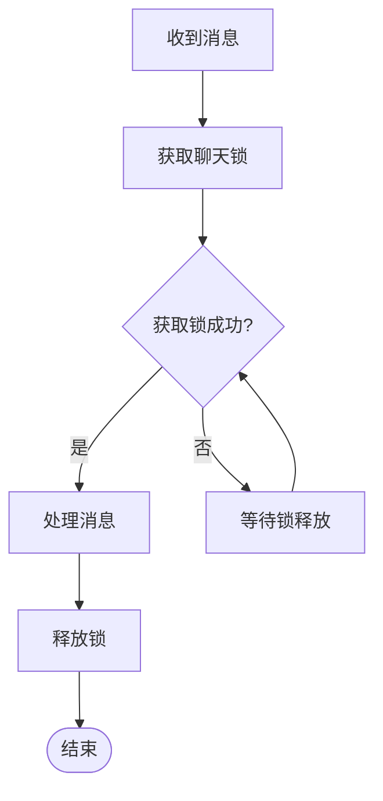

**图表来源**
- [ai_reply_engine.py](file://ai_reply_engine.py#L276-L281)

### 异步处理支持

系统提供异步包装器，支持在异步环境中调用：

```python
# 异步调用示例
reply = await ai_reply_engine.generate_reply_async(
    message="你好",
    item_info=item_info,
    chat_id="chat_123",
    cookie_id="cookie_456",
    user_id="user_789",
    item_id="item_101"
)
```

**章节来源**
- [ai_reply_engine.py](file://ai_reply_engine.py#L422-L434)

## 故障排除

### 常见问题及解决方案

| 问题类型 | 症状 | 可能原因 | 解决方案 |
|----------|------|----------|----------|
| **API调用失败** | 返回None | API密钥无效、网络问题 | 检查API配置和网络连接 |
| **意图识别错误** | 默认回复过多 | 关键词匹配不准确 | 调整关键词列表或使用自定义提示词 |
| **议价次数异常** | 议价轮数超出限制 | 数据库查询错误 | 检查数据库连接和查询语句 |
| **消息丢失** | 对话历史不完整 | 数据库事务问题 | 检查数据库锁定和事务处理 |

### 日志监控

系统提供详细的日志记录，便于问题诊断：

```python
# 关键日志级别
logger.info(f"检测到意图: {intent} (账号: {cookie_id})")
logger.info(f"使用{api_type} API生成回复")
logger.error(f"AI回复生成失败 {cookie_id}: {e}")
```

**章节来源**
- [ai_reply_engine.py](file://ai_reply_engine.py#L414-L420)

### 性能监控指标

- **响应时间**：从接收消息到返回回复的时间
- **API调用成功率**：各API类型的调用成功率
- **消息处理吞吐量**：每秒处理的消息数量
- **数据库查询性能**：对话历史查询的响应时间

## 结论

AI智能回复引擎通过无状态设计、多模型支持、智能意图识别和完善的数据库集成，为闲鱼自动回复系统提供了强大而灵活的AI回复能力。其模块化的设计使得系统易于扩展和维护，同时保证了高性能和高可用性。

系统的持续演进方向包括：
- 更智能的意图识别算法
- 更多的AI模型支持
- 更精细的配置管理
- 更完善的监控和告警机制