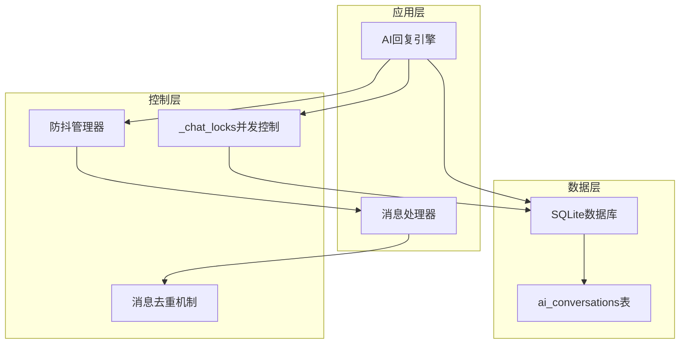
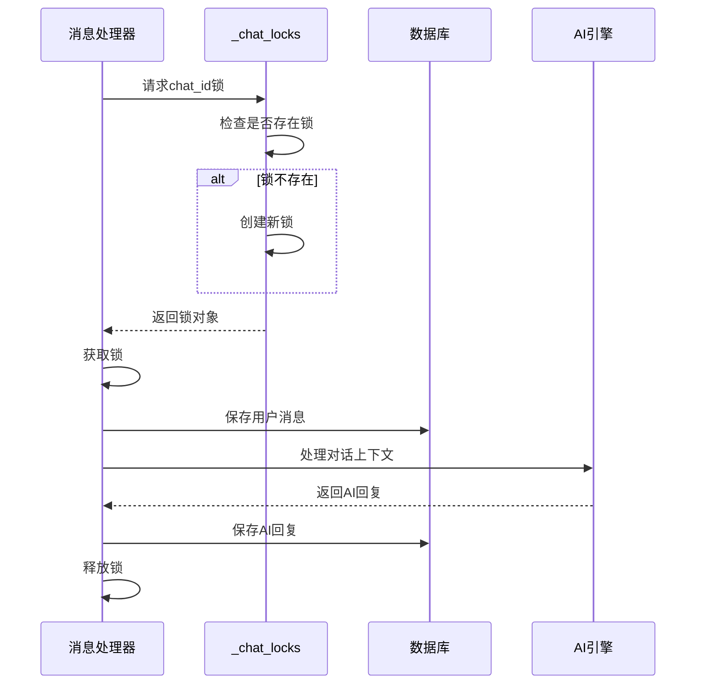
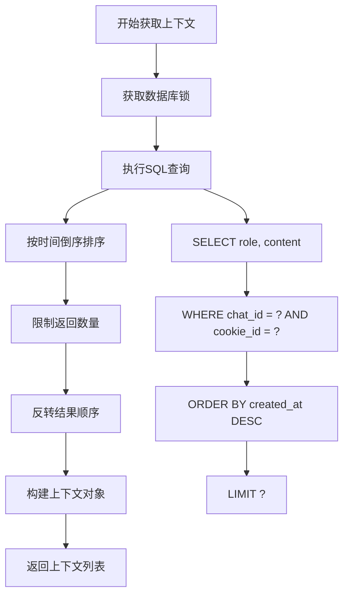
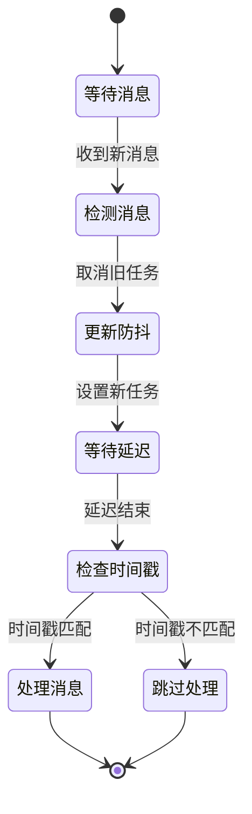
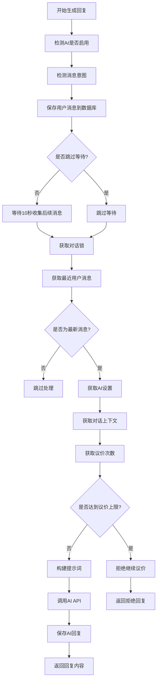

# 上下文与会话管理

<cite>
**本文档引用的文件**
- [ai_reply_engine.py](file://ai_reply_engine.py)
- [db_manager.py](file://db_manager.py)
- [XianyuAutoAsync.py](file://XianyuAutoAsync.py)
</cite>

## 目录
1. [简介](#简介)
2. [系统架构概览](#系统架构概览)
3. [_chat_locks与并发控制机制](#_chat_locks与并发控制机制)
4. [对话上下文管理](#对话上下文管理)
5. [消息防抖机制](#消息防抖机制)
6. [数据库表结构](#数据库表结构)
7. [核心方法详解](#核心方法详解)
8. [性能优化策略](#性能优化策略)
9. [故障排除指南](#故障排除指南)
10. [总结](#总结)

## 简介

本文档详细阐述了Xianyu自动回复系统中的上下文与会话管理机制。该系统通过精密设计的锁机制、防抖算法和数据库管理，确保AI回复的准确性、一致性和高性能。核心组件包括`_chat_locks`并发控制、`get_conversation_context`上下文查询、`save_conversation`对话记录保存以及智能防抖机制。

## 系统架构概览

系统采用分层架构设计，主要包含以下核心层次：



**图表来源**
- [ai_reply_engine.py](file://ai_reply_engine.py#L27-L35)
- [XianyuAutoAsync.py](file://XianyuAutoAsync.py#L730-L733)

## _chat_locks与并发控制机制

### 并发控制原理

系统使用`_chat_locks`字典配合`_chat_locks_lock`锁来确保同一对话的消息串行处理，防止并发问题导致的数据不一致。



**图表来源**
- [ai_reply_engine.py](file://ai_reply_engine.py#L276-L281)
- [ai_reply_engine.py](file://ai_reply_engine.py#L306-L310)

### 锁管理实现

系统通过双重锁机制确保线程安全：

1. **全局锁**：`_chat_locks_lock`保护`_chat_locks`字典的并发访问
2. **对话锁**：每个`chat_id`对应一个独立的`threading.Lock()`实例

**章节来源**
- [ai_reply_engine.py](file://ai_reply_engine.py#L27-L35)
- [ai_reply_engine.py](file://ai_reply_engine.py#L276-L281)

## 对话上下文管理

### get_conversation_context方法

该方法负责从数据库查询历史对话记录，并按时间顺序构建上下文，为AI回复提供必要的背景信息。



**图表来源**
- [ai_reply_engine.py](file://ai_reply_engine.py#L436-L449)

### save_conversation方法

该方法将用户和AI的对话记录保存到`ai_conversations`表，包含角色、内容和意图信息。

```mermaid
flowchart TD
A[开始保存对话] --> B[获取数据库锁]
B --> C[执行INSERT语句]
C --> D[提交事务]
D --> E[查询刚插入记录]
E --> F[返回创建时间]
C --> C1[INSERT INTO ai_conversations]
C1 --> C2[(cookie_id, chat_id, user_id, item_id, role, content, intent)]
E --> E1[SELECT created_at FROM ai_conversations]
E1 --> E2[WHERE rowid = last_insert_rowid()]
```

**图表来源**
- [ai_reply_engine.py](file://ai_reply_engine.py#L454-L473)

**章节来源**
- [ai_reply_engine.py](file://ai_reply_engine.py#L436-L473)

## 消息防抖机制

### 防抖算法设计

系统实现了双重防抖机制，确保在用户连续发送消息时只处理最后一条消息，避免重复处理和资源浪费。



**图表来源**
- [XianyuAutoAsync.py](file://XianyuAutoAsync.py#L6922-L7067)

### 防抖延迟配置

系统提供了灵活的防抖延迟配置：

| 参数 | 默认值 | 说明 |
|------|--------|------|
| message_debounce_delay | 1秒 | 用户停止发送消息1秒后才回复 |
| message_debounce_tasks | {} | 存储每个chat_id的防抖任务 |
| processed_message_ids_max_size | 10000 | 最大保存10000个消息ID |

**章节来源**
- [XianyuAutoAsync.py](file://XianyuAutoAsync.py#L731-L733)
- [XianyuAutoAsync.py](file://XianyuAutoAsync.py#L6922-L7067)

### _get_recent_user_messages防抖机制

该方法通过时间窗口查询识别最新消息，避免重复处理：

```mermaid
flowchart TD
A[开始查询最近消息] --> B[获取数据库锁]
B --> C[查询所有用户消息]
C --> D[计算时间差]
D --> E[过滤时间窗口内消息]
E --> F[按时间升序排序]
F --> G[返回结果列表]
C --> C1[SELECT content, created_at]
C1 --> C2[WHERE role = 'user']
C2 --> C3[ORDER BY created_at DESC]
E --> E1[WHERE julianday('now') - julianday(created_at) < (? / 86400.0)]
```

**图表来源**
- [ai_reply_engine.py](file://ai_reply_engine.py#L493-L520)

**章节来源**
- [ai_reply_engine.py](file://ai_reply_engine.py#L493-L520)

## 数据库表结构

### ai_conversations表结构

| 字段名 | 类型 | 约束 | 说明 |
|--------|------|------|------|
| id | INTEGER | PRIMARY KEY AUTOINCREMENT | 主键ID |
| cookie_id | TEXT | NOT NULL | Cookie标识符 |
| chat_id | TEXT | NOT NULL | 聊天ID |
| user_id | TEXT | NOT NULL | 用户ID |
| item_id | TEXT | NOT NULL | 商品ID |
| role | TEXT | NOT NULL | 角色：user/assistant |
| content | TEXT | NOT NULL | 消息内容 |
| intent | TEXT | | 意图分类 |
| bargain_count | INTEGER | DEFAULT 0 | 议价次数 |
| created_at | TIMESTAMP | DEFAULT CURRENT_TIMESTAMP | 创建时间 |

### SQL查询语句

#### 获取对话上下文
```sql
SELECT role, content 
FROM ai_conversations 
WHERE chat_id = ? AND cookie_id = ? 
ORDER BY created_at DESC LIMIT ?
```

#### 保存对话记录
```sql
INSERT INTO ai_conversations 
(cookie_id, chat_id, user_id, item_id, role, content, intent)
VALUES (?, ?, ?, ?, ?, ?, ?)
```

#### 获取议价次数
```sql
SELECT COUNT(*) 
FROM ai_conversations 
WHERE chat_id = ? AND cookie_id = ? AND intent = 'price' AND role = 'user'
```

#### 获取最近用户消息
```sql
SELECT content, created_at 
FROM ai_conversations 
WHERE chat_id = ? AND cookie_id = ? AND role = 'user' 
AND julianday('now') - julianday(created_at) < (? / 86400.0)
ORDER BY created_at ASC
```

**章节来源**
- [db_manager.py](file://db_manager.py#L168-L182)

## 核心方法详解

### generate_reply方法

该方法是整个回复流程的核心，集成了防抖、上下文获取、AI调用和结果保存等功能。



**图表来源**
- [ai_reply_engine.py](file://ai_reply_engine.py#L283-L412)

### 内部等待窗口设计

系统采用10秒固定等待窗口，平衡了响应速度和消息完整性：

- **外部防抖**：当`skip_wait=True`时，查询窗口为6秒（1秒防抖 + 5秒缓冲）
- **内部等待**：当`skip_wait=False`时，查询窗口为25秒（10秒等待 + 10秒消息间隔 + 5秒缓冲）

**章节来源**
- [ai_reply_engine.py](file://ai_reply_engine.py#L283-L412)
- [ai_reply_engine.py](file://ai_reply_engine.py#L312-L314)

## 性能优化策略

### 数据库连接优化

1. **使用可重入锁**：`db_manager.lock`采用`threading.RLock()`确保数据库操作的线程安全
2. **批量操作**：所有数据库操作都在锁保护下进行，避免并发冲突
3. **索引优化**：`ai_conversations`表的关键字段已建立适当索引

### 内存管理优化

1. **消息ID去重**：维护`processed_message_ids`字典，防止重复处理
2. **定期清理**：超过1小时的消息ID会被自动清理，防止内存泄漏
3. **大小限制**：最多保存10000个消息ID，超出时删除最旧的一半

### 并发控制优化

1. **细粒度锁**：使用`_chat_locks`实现对话级别的并发控制
2. **非阻塞设计**：防抖机制在锁外执行，避免阻塞其他消息处理
3. **超时保护**：所有异步操作都有适当的超时设置

**章节来源**
- [db_manager.py](file://db_manager.py#L51)
- [XianyuAutoAsync.py](file://XianyuAutoAsync.py#L736-L740)

## 故障排除指南

### 常见问题及解决方案

#### 1. 对话上下文为空
**症状**：AI回复缺乏上下文信息
**原因**：`get_conversation_context`查询失败或历史记录不足
**解决方案**：
- 检查数据库连接状态
- 验证`ai_conversations`表结构
- 确认查询参数正确性

#### 2. 消息重复处理
**症状**：同一条消息被多次处理
**原因**：防抖机制失效或消息ID去重失败
**解决方案**：
- 检查`message_debounce_delay`配置
- 验证`processed_message_ids`清理机制
- 确认防抖任务正常取消

#### 3. 并发冲突导致的数据不一致
**症状**：对话记录混乱或丢失
**原因**：锁机制失效或数据库事务处理异常
**解决方案**：
- 检查`_chat_locks`锁状态
- 验证数据库事务提交
- 监控锁等待时间

#### 4. 性能下降
**症状**：消息处理延迟增加
**原因**：锁竞争或数据库查询效率低
**解决方案**：
- 优化查询语句
- 调整防抖延迟参数
- 监控内存使用情况

### 调试工具和技巧

1. **日志分析**：启用详细日志记录，跟踪消息处理流程
2. **性能监控**：监控锁等待时间和数据库查询时间
3. **状态检查**：定期检查各组件的状态和配置

**章节来源**
- [ai_reply_engine.py](file://ai_reply_engine.py#L451-L452)
- [ai_reply_engine.py](file://ai_reply_engine.py#L521-L523)

## 总结

Xianyu自动回复系统的上下文与会话管理机制通过精密设计的多层防护体系，确保了AI回复的准确性、一致性和高性能。主要特点包括：

1. **并发安全保障**：通过`_chat_locks`实现对话级别的串行处理
2. **智能防抖机制**：双重防抖算法有效避免重复处理
3. **完整上下文管理**：数据库驱动的对话历史保存和查询
4. **性能优化**：多层次的缓存和优化策略
5. **故障恢复**：完善的错误处理和恢复机制

这套机制不仅保证了系统的稳定性，还为未来的功能扩展提供了坚实的基础。通过持续的监控和优化，系统能够适应不断增长的业务需求，为用户提供高质量的AI自动回复服务。