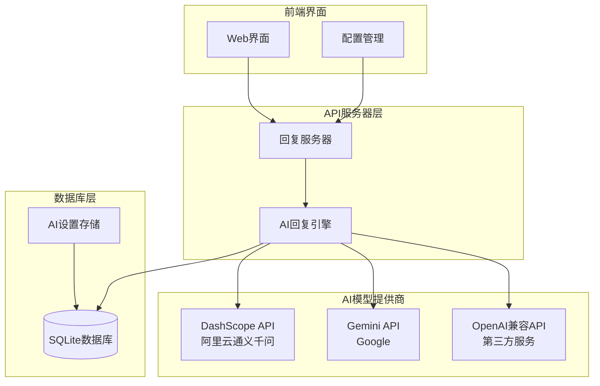
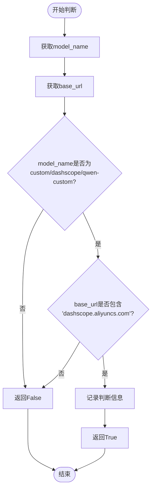
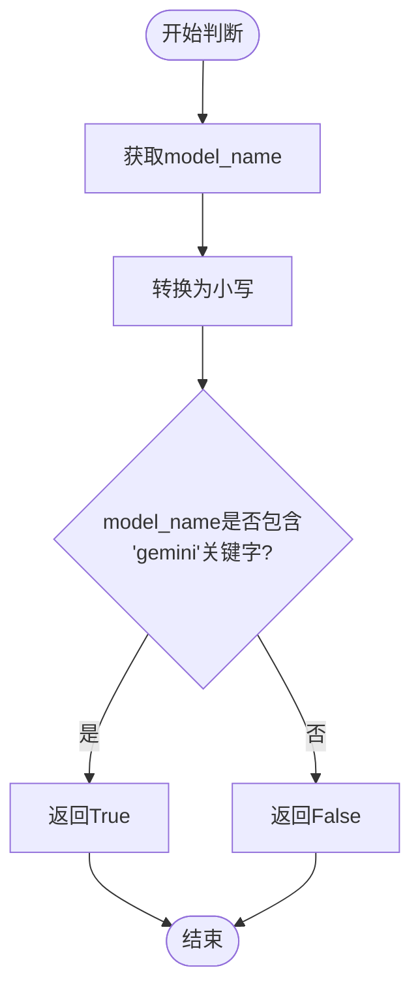
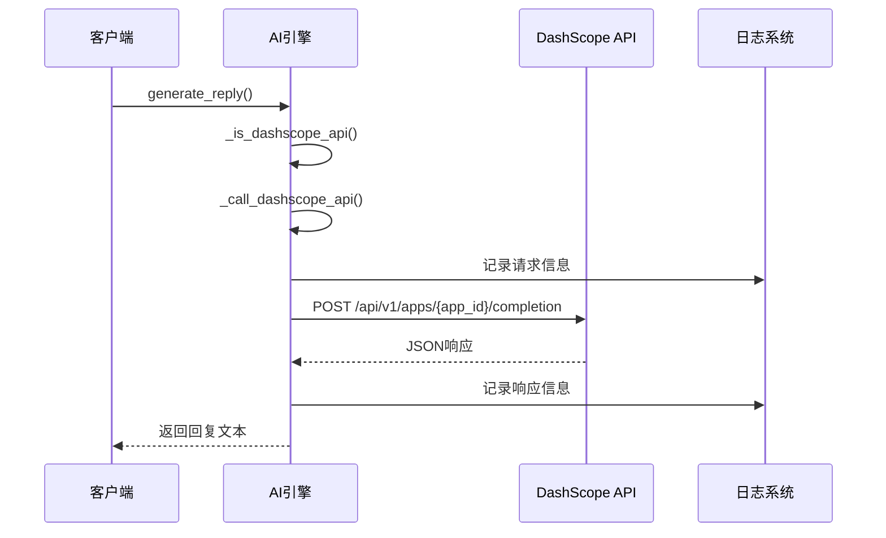
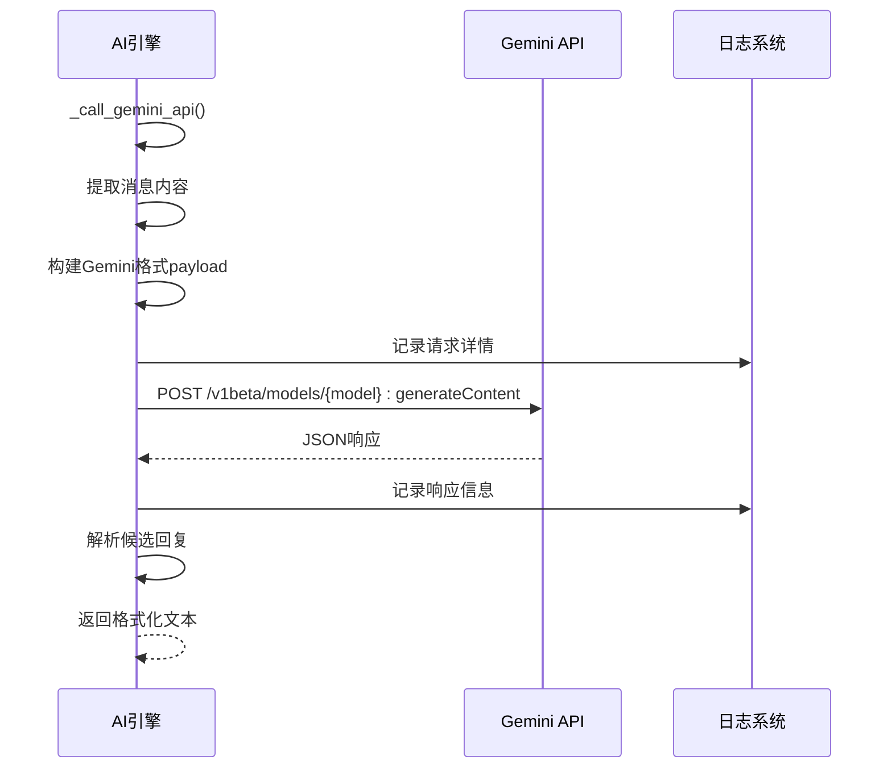
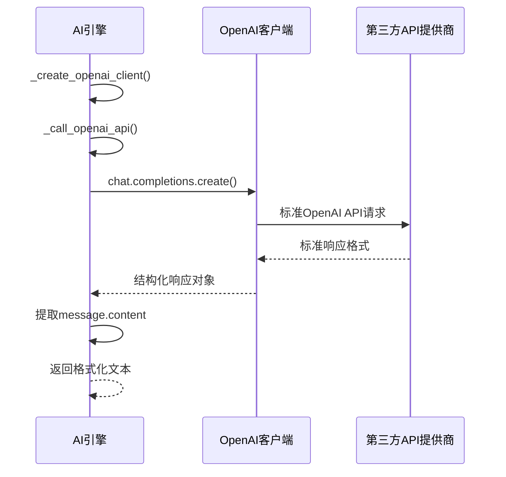
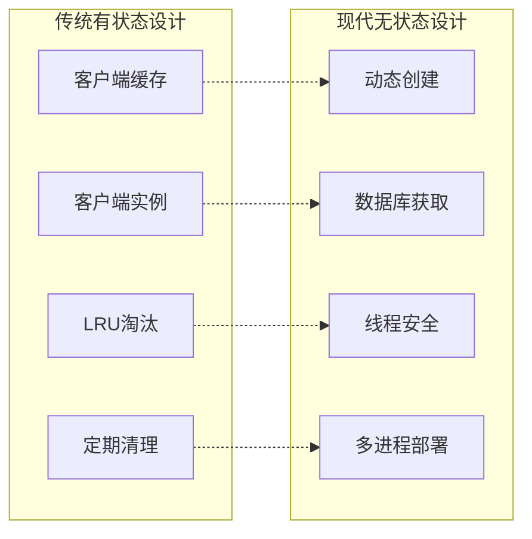
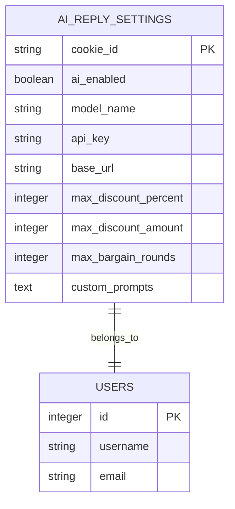
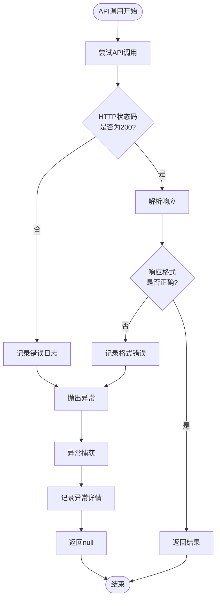

# 多AI模型集成与调用机制

<cite>
**本文档引用的文件**
- [ai_reply_engine.py](file://ai_reply_engine.py)
- [db_manager.py](file://db_manager.py)
- [config.py](file://config.py)
- [global_config.yml](file://global_config.yml)
- [reply_server.py](file://reply_server.py)
- [static/js/app.js](file://static/js/app.js)
- [static/index.html](file://static/index.html)
</cite>

## 目录
1. [简介](#简介)
2. [系统架构概览](#系统架构概览)
3. [API类型判断机制](#api类型判断机制)
4. [多模型调用实现](#多模型调用实现)
5. [无状态客户端设计](#无状态客户端设计)
6. [配置管理系统](#配置管理系统)
7. [错误处理与日志记录](#错误处理与日志记录)
8. [API集成示例](#api集成示例)
9. [部署考虑因素](#部署考虑因素)
10. [总结](#总结)

## 简介

本文档详细介绍了XianyuAuto项目中的多AI模型集成与调用机制。该系统支持三种主要的AI模型提供商：DashScope（通义千问）、Gemini（Google）和OpenAI兼容API，通过智能的API类型判断和路由机制，为用户提供灵活且高效的AI回复服务。

核心特性包括：
- **多模型支持**：同时集成DashScope、Gemini和OpenAI兼容API
- **智能路由**：基于配置自动选择最适合的API调用方式
- **无状态设计**：支持多进程部署，无需客户端缓存
- **灵活配置**：支持自定义模型名称和API地址
- **健壮错误处理**：完善的错误捕获和日志记录机制

## 系统架构概览



**图表来源**
- [ai_reply_engine.py](file://ai_reply_engine.py#L24-L544)
- [reply_server.py](file://reply_server.py#L4342-L4402)

**章节来源**
- [ai_reply_engine.py](file://ai_reply_engine.py#L24-L50)
- [reply_server.py](file://reply_server.py#L4342-L4402)

## API类型判断机制

系统通过两个核心方法实现智能的API类型判断，确保正确路由到相应的AI模型提供商。

### DashScope API判断



**图表来源**
- [ai_reply_engine.py](file://ai_reply_engine.py#L83-L93)

#### 判断逻辑详解

`_is_dashscope_api`方法采用双重条件判断：

1. **模型名称检查**：验证是否选择了自定义模型
   - 支持的模型名称：`custom`、`自定义`、`dashscope`、`qwen-custom`
   - 不区分大小写

2. **基础URL检查**：确认API地址指向阿里云DashScope服务
   - 必须包含`dashscope.aliyuncs.com`子域名

3. **日志记录**：详细记录判断过程，便于调试和监控

**章节来源**
- [ai_reply_engine.py](file://ai_reply_engine.py#L83-L93)

### Gemini API判断



**图表来源**
- [ai_reply_engine.py](file://ai_reply_engine.py#L95-L98)

#### 判断逻辑详解

`_is_gemini_api`方法采用简单而有效的字符串匹配：

1. **标准化处理**：将模型名称转换为小写，确保判断的鲁棒性
2. **关键字匹配**：检查模型名称是否包含`gemini`关键字
3. **快速决策**：单条件判断，性能优异

**章节来源**
- [ai_reply_engine.py](file://ai_reply_engine.py#L95-L98)

## 多模型调用实现

系统为每种AI模型提供了专门的调用方法，每个方法都针对特定API的特点进行了优化。

### DashScope API调用



**图表来源**
- [ai_reply_engine.py](file://ai_reply_engine.py#L100-L151)

#### 调用流程详解

1. **URL构建**：从base_url提取app_id，构建完整的API端点
2. **消息格式转换**：将标准消息格式转换为DashScope特定格式
3. **请求头设置**：包含Authorization和Content-Type
4. **请求体构造**：封装prompt和生成参数
5. **响应解析**：提取输出文本，进行格式化处理

**章节来源**
- [ai_reply_engine.py](file://ai_reply_engine.py#L100-L151)

### Gemini API调用



**图表来源**
- [ai_reply_engine.py](file://ai_reply_engine.py#L153-L221)

#### 调用流程详解

1. **消息格式转换**：将系统指令和用户内容分离
2. **payload构建**：按照Gemini v1beta API规范组织数据
3. **系统指令处理**：可选的systemInstruction字段
4. **响应结构解析**：从candidates数组中提取回复文本

**章节来源**
- [ai_reply_engine.py](file://ai_reply_engine.py#L153-L221)

### OpenAI兼容API调用



**图表来源**
- [ai_reply_engine.py](file://ai_reply_engine.py#L222-L230)

#### 调用流程详解

1. **客户端创建**：动态创建OpenAI兼容客户端
2. **标准API调用**：使用标准的OpenAI SDK接口
3. **响应处理**：直接从choices数组提取回复内容

**章节来源**
- [ai_reply_engine.py](file://ai_reply_engine.py#L222-L230)

## 无状态客户端设计

系统采用无状态设计模式，完全移除了客户端缓存机制，以支持多进程部署环境。

### 设计原则



**图表来源**
- [ai_reply_engine.py](file://ai_reply_engine.py#L62-L81)

### 实现细节

#### `_create_openai_client`方法

该方法实现了真正的无状态客户端创建：

1. **数据库查询**：每次调用都从数据库获取最新配置
2. **即时创建**：不缓存任何客户端实例
3. **异常处理**：完善的错误捕获和日志记录
4. **资源隔离**：每个请求使用独立的客户端实例

**章节来源**
- [ai_reply_engine.py](file://ai_reply_engine.py#L62-L81)

#### 多进程部署优势

1. **无共享状态**：避免了分布式缓存的一致性问题
2. **弹性扩展**：可以轻松水平扩展多个进程实例
3. **故障隔离**：单个进程故障不影响其他进程
4. **简化运维**：无需复杂的缓存同步机制

## 配置管理系统

系统提供了完整的配置管理功能，支持灵活的AI模型配置和动态调整。

### 配置数据结构

| 配置项 | 类型 | 默认值 | 描述 |
|--------|------|--------|------|
| ai_enabled | Boolean | False | 是否启用AI回复 |
| model_name | String | qwen-plus | AI模型名称 |
| api_key | String | '' | API密钥 |
| base_url | String | compatible-mode/v1 | API基础URL |
| max_discount_percent | Integer | 10 | 最大折扣百分比 |
| max_discount_amount | Integer | 100 | 最大折扣金额 |
| max_bargain_rounds | Integer | 3 | 最大议价轮数 |
| custom_prompts | JSON | '{}' | 自定义提示词 |

**章节来源**
- [db_manager.py](file://db_manager.py#L1809-L1844)

### 前端配置界面

系统提供了直观的Web配置界面，支持：

1. **模型选择**：预设模型和自定义模型切换
2. **API配置**：密钥和基础URL设置
3. **参数调节**：折扣和议价参数配置
4. **实时测试**：配置后立即测试AI回复效果

**章节来源**
- [static/js/app.js](file://static/js/app.js#L2328-L2529)
- [static/index.html](file://static/index.html#L3292-L3337)

### 配置持久化



**图表来源**
- [db_manager.py](file://db_manager.py#L1809-L1844)

## 错误处理与日志记录

系统实现了完善的错误处理和日志记录机制，确保系统的稳定性和可维护性。

### 错误处理策略



**图表来源**
- [ai_reply_engine.py](file://ai_reply_engine.py#L139-L151)
- [ai_reply_engine.py](file://ai_reply_engine.py#L206-L221)

### 日志记录层次

1. **INFO级别**：API调用开始、配置信息、成功响应
2. **DEBUG级别**：请求详情、响应内容、中间变量
3. **WARNING级别**：格式错误、缺失内容、潜在问题
4. **ERROR级别**：HTTP错误、解析失败、异常情况

### 测试API

系统提供了专门的测试API，支持：

1. **配置验证**：测试API连接和认证
2. **功能测试**：验证AI回复生成能力
3. **响应测试**：检查不同输入的回复质量
4. **错误模拟**：测试各种异常情况的处理

**章节来源**
- [reply_server.py](file://reply_server.py#L4360-L4402)

## API集成示例

以下是各种API调用的实际示例和最佳实践。

### DashScope API示例

#### 请求格式
```json
{
  "input": {
    "prompt": "系统指令\n\n用户问题：具体问题\n\n请直接回答用户的问题："
  },
  "parameters": {
    "max_tokens": 100,
    "temperature": 0.7
  },
  "debug": {}
}
```

#### 响应格式
```json
{
  "output": {
    "text": "AI回复内容"
  },
  "status_code": 200
}
```

### Gemini API示例

#### 请求格式
```json
{
  "contents": [
    {
      "role": "user",
      "parts": [{"text": "用户消息内容"}]
    }
  ],
  "generationConfig": {
    "temperature": 0.7,
    "maxOutputTokens": 100
  }
}
```

#### 响应格式
```json
{
  "candidates": [
    {
      "content": {
        "parts": [
          {"text": "AI回复内容"}
        ]
      }
    }
  ]
}
```

### OpenAI兼容API示例

#### 请求格式
```json
{
  "model": "gpt-3.5-turbo",
  "messages": [
    {"role": "system", "content": "系统指令"},
    {"role": "user", "content": "用户消息"}
  ],
  "max_tokens": 100,
  "temperature": 0.7
}
```

#### 响应格式
```json
{
  "choices": [
    {
      "message": {
        "content": "AI回复内容"
      }
    }
  ]
}
```

## 部署考虑因素

### 性能优化

1. **连接池管理**：虽然无状态设计，但仍需合理管理网络连接
2. **超时设置**：统一设置30秒超时，避免长时间阻塞
3. **并发控制**：通过异步调用支持高并发场景
4. **缓存策略**：虽然移除客户端缓存，但可以考虑应用级缓存

### 安全考虑

1. **API密钥保护**：敏感信息不在日志中明文记录
2. **访问控制**：通过认证机制限制API访问
3. **输入验证**：对用户输入进行必要的验证和过滤
4. **速率限制**：防止API滥用和费用超支

### 监控和运维

1. **健康检查**：定期检查各API提供商的可用性
2. **性能监控**：跟踪API响应时间和成功率
3. **错误统计**：收集和分析各类错误的发生频率
4. **容量规划**：根据使用情况调整资源配置

## 总结

XianyuAuto项目的多AI模型集成与调用机制展现了现代AI应用开发的最佳实践：

### 核心优势

1. **灵活性**：支持多种AI模型提供商，满足不同需求
2. **可靠性**：完善的错误处理和日志记录机制
3. **可扩展性**：无状态设计支持大规模部署
4. **易用性**：直观的配置界面和测试功能

### 技术亮点

1. **智能路由**：基于配置的自动API选择
2. **格式转换**：统一的消息格式适配不同API
3. **无状态设计**：简化部署和运维复杂度
4. **健壮性**：多层次的错误处理和恢复机制

### 应用价值

该系统不仅解决了多AI模型集成的技术挑战，还为电商客服自动化提供了完整的解决方案，显著提升了用户体验和运营效率。通过合理的架构设计和完善的错误处理，确保了系统的稳定性和可维护性，为未来的功能扩展和技术升级奠定了坚实基础。