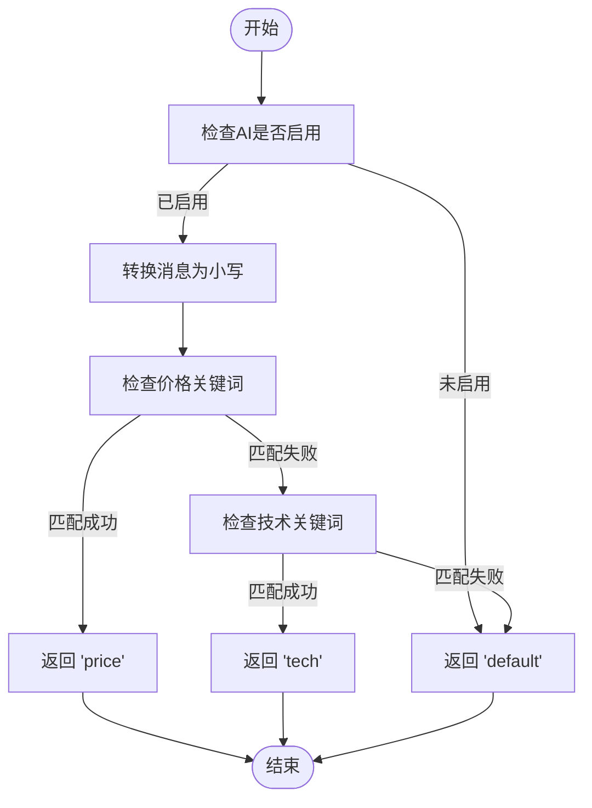

# 意图检测机制

<cite>
**本文档引用的文件**   
- [ai_reply_engine.py](file://ai_reply_engine.py)
</cite>

## 目录
1. [简介](#简介)
2. [核心组件](#核心组件)
3. [意图检测算法详解](#意图检测算法详解)
4. [关键词匹配策略](#关键词匹配策略)
5. [实际应用示例](#实际应用示例)
6. [性能与成本优化](#性能与成本优化)
7. [错误处理与默认行为](#错误处理与默认行为)

## 简介
意图检测机制是本系统中用于识别用户消息目的的核心功能。该机制通过基于关键词的本地检测算法，快速准确地判断用户消息属于价格、技术咨询还是默认类别，从而指导后续的自动回复策略。此设计替代了成本高昂的AI调用，显著降低了系统延迟和运行成本。

## 核心组件

意图检测功能主要由`AIReplyEngine`类中的`detect_intent`方法实现。该方法接收用户消息和账号ID作为输入，返回对应的意图类型。

**Section sources**
- [ai_reply_engine.py](file://ai_reply_engine.py#L237-L274)

## 意图检测算法详解

`detect_intent`方法实现了基于关键词的本地意图识别算法。算法首先检查AI功能是否启用，然后将用户消息转换为小写进行不区分大小写的匹配。算法按顺序检查三个意图类别：价格、技术和默认。

算法流程如下：
1. 检查账号的AI功能是否启用
2. 将用户消息转换为小写
3. 依次检查是否包含价格相关关键词
4. 检查是否包含技术相关关键词
5. 如果以上都不匹配，则返回默认意图



**Diagram sources **
- [ai_reply_engine.py](file://ai_reply_engine.py#L237-L274)

**Section sources**
- [ai_reply_engine.py](file://ai_reply_engine.py#L237-L274)

## 关键词匹配策略

### 价格意图关键词
价格意图的关键词列表包含16个与价格谈判相关的词汇，涵盖了常见的议价用语和价格询问方式：

```python
price_keywords = [
    '便宜', '优惠', '刀', '降价', '包邮', '价格', '多少钱', '能少', '还能', '最低', '底价',
    '实诚价', '到100', '能到', '包个邮', '给个价', '什么价'
]
```

这些关键词设计考虑了用户的口语化表达，如"能少"、"能到"等，能够有效捕捉用户的价格谈判意图。

### 技术意图关键词
技术意图的关键词列表包含10个与产品使用和技术问题相关的词汇：

```python
tech_keywords = ['怎么用', '参数', '坏了', '故障', '设置', '说明书', '功能', '用法', '教程', '驱动']
```

这些关键词覆盖了用户可能提出的技术咨询场景，从基本使用方法到故障排除。

**Section sources**
- [ai_reply_engine.py](file://ai_reply_engine.py#L251-L264)

## 实际应用示例

当用户发送不同类型的查询时，`detect_intent`方法会根据关键词匹配返回相应的意图类型：

- 用户消息："这个能便宜点吗？" → 匹配"便宜"关键词 → 返回`price`
- 用户消息："怎么用这个设备？" → 匹配"怎么用"关键词 → 返回`tech`
- 用户消息："你好，我想买这个" → 无关键词匹配 → 返回`default`

这些意图类型随后被用于指导AI回复生成，确保回复内容与用户意图相匹配。

**Section sources**
- [ai_reply_engine.py](file://ai_reply_engine.py#L259-L266)

## 性能与成本优化

该本地检测机制通过移除对AI服务的调用，实现了显著的性能和成本优化：

1. **降低延迟**：本地关键词匹配的响应时间远低于网络API调用
2. **减少成本**：避免了每次消息处理的AI服务调用费用
3. **提高可靠性**：不依赖外部服务，减少了因网络或服务故障导致的失败

通过在`generate_reply`方法中首先调用`detect_intent`，系统能够在不消耗AI资源的情况下完成意图分类，只有在需要生成回复时才调用AI服务。

**Section sources**
- [ai_reply_engine.py](file://ai_reply_engine.py#L291-L292)

## 错误处理与默认行为

当检测过程中发生异常或AI功能未启用时，方法会返回默认的`default`意图。这种设计确保了系统的健壮性：

1. **AI未启用**：如果账号的AI功能被禁用，直接返回`default`
2. **异常处理**：任何运行时异常都会被捕获，并返回`default`意图
3. **无匹配情况**：当消息不包含任何关键词时，返回`default`意图

这种默认行为确保了系统在各种情况下都能提供一致的响应，避免了因检测失败而导致的服务中断。

**Section sources**
- [ai_reply_engine.py](file://ai_reply_engine.py#L246-L247)
- [ai_reply_engine.py](file://ai_reply_engine.py#L272-L274)