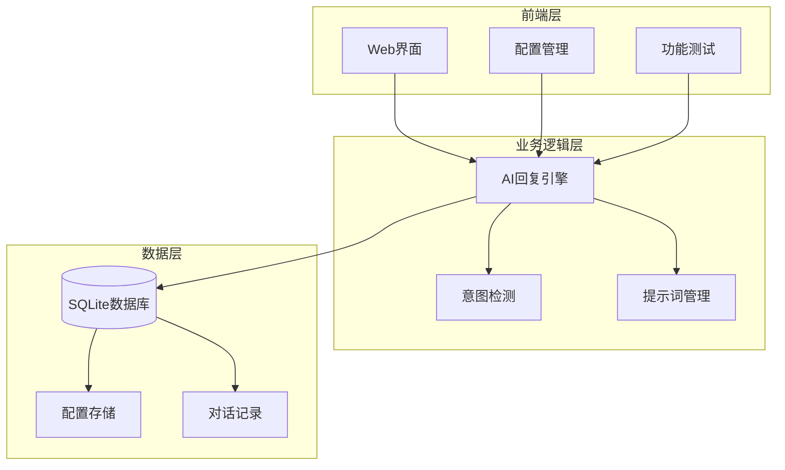
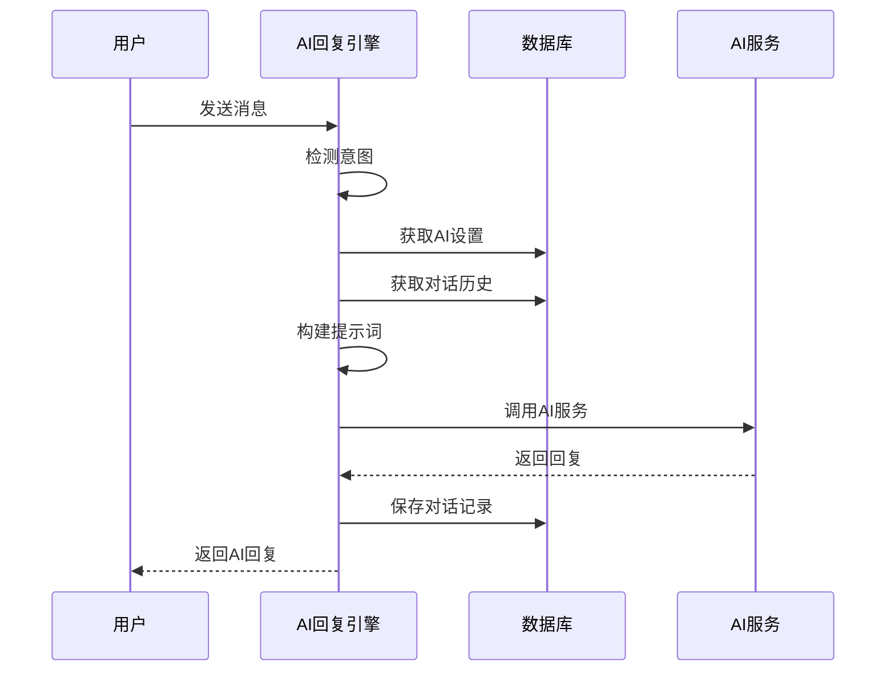
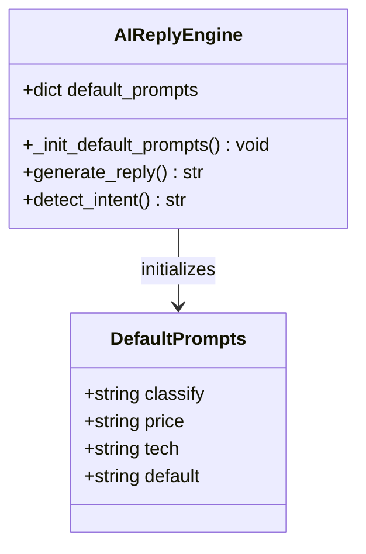
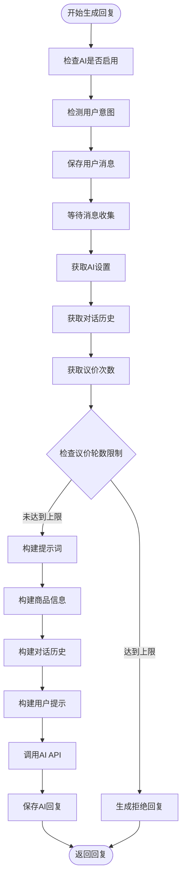
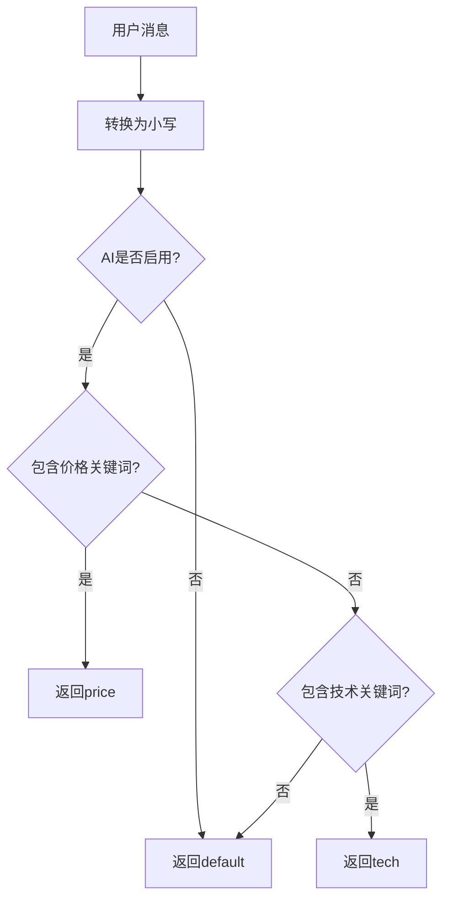
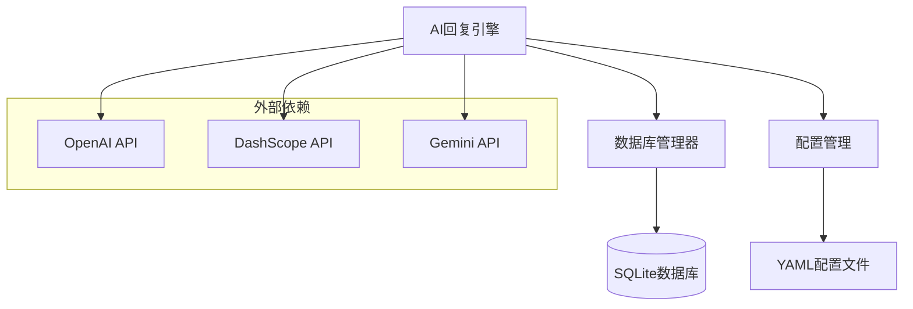

# 提示词工程与管理机制

<cite>
**本文档引用的文件**
- [ai_reply_engine.py](file://ai_reply_engine.py)
- [db_manager.py](file://db_manager.py)
- [config.py](file://config.py)
- [index.html](file://static/index.html)
- [app.js](file://static/js/app.js)
</cite>

## 目录
1. [简介](#简介)
2. [项目结构概览](#项目结构概览)
3. [核心组件分析](#核心组件分析)
4. [架构概览](#架构概览)
5. [详细组件分析](#详细组件分析)
6. [依赖关系分析](#依赖关系分析)
7. [性能考虑](#性能考虑)
8. [故障排除指南](#故障排除指南)
9. [结论](#结论)

## 简介

本文档详细阐述了Xianyu Auto Reply项目中的提示词工程与管理系统。该系统通过精心设计的提示词模板和智能管理机制，实现了针对不同意图的个性化AI回复生成。系统支持三种主要意图：价格谈判（price）、技术支持（tech）和通用客服（default），并通过用户自定义提示词提供了高度灵活的配置能力。

## 项目结构概览

该项目采用模块化架构设计，核心功能集中在AI回复引擎模块中，通过数据库管理配置信息，并提供Web界面进行可视化配置。



**图表来源**
- [ai_reply_engine.py](file://ai_reply_engine.py#L24-L544)
- [db_manager.py](file://db_manager.py#L126-L1844)

## 核心组件分析

### AI回复引擎（AIReplyEngine）

AI回复引擎是整个系统的核心，负责处理用户消息、检测意图、生成回复等功能。其主要特性包括：

- **无状态设计**：移除了有状态的缓存机制，支持多进程部署
- **意图检测**：基于关键词的本地意图识别，无需额外AI调用
- **提示词管理**：支持系统默认提示词和用户自定义提示词
- **多API支持**：兼容OpenAI、DashScope、Gemini等多种AI服务

### 提示词初始化机制

系统通过`_init_default_prompts`方法初始化默认提示词字典，包含四种意图类型的提示词模板：

- **classify**：意图分类专家（已弃用）
- **price**：价格谈判专家
- **tech**：技术支持专家  
- **default**：通用客服专家

**章节来源**
- [ai_reply_engine.py](file://ai_reply_engine.py#L36-L59)

## 架构概览

系统采用分层架构，通过清晰的职责分离实现高度可维护性和扩展性。



**图表来源**
- [ai_reply_engine.py](file://ai_reply_engine.py#L282-L419)

## 详细组件分析

### 提示词初始化与管理

#### `_init_default_prompts`方法

该方法负责初始化系统默认提示词字典，为不同意图提供专门的提示词模板。



**图表来源**
- [ai_reply_engine.py](file://ai_reply_engine.py#L36-L59)

#### 价格谈判提示词策略

价格谈判提示词具有严格的语言要求和议价策略：

- **语言规范**：简短直接，每句≤10字，总字数≤40字
- **议价策略**：
  1. 根据议价次数递减优惠
  2. 接近最大轮数时坚持底线
  3. 优惠不能超过设定的百分比和金额
  4. 语气友好但坚定

#### 技术支持提示词特点

技术支持提示词专注于产品相关问题的专业解答：

- **语言要求**：简短专业，每句≤10字，总字数≤40字
- **回答重点**：产品功能、使用方法、注意事项
- **原则**：基于商品信息回答，避免过度承诺

#### 通用客服提示词特征

通用客服提示词提供全面的商品和服务信息：

- **语言要求**：简短友好，每句≤10字，总字数≤40字
- **回答重点**：商品介绍、物流、售后等常见问题
- **原则**：结合商品信息，给出实用建议

**章节来源**
- [ai_reply_engine.py](file://ai_reply_engine.py#L41-L59)

### 提示词生成与选择机制

#### `generate_reply`方法流程

该方法是提示词生成的核心流程，实现了智能的提示词选择和回复生成。



**图表来源**
- [ai_reply_engine.py](file://ai_reply_engine.py#L282-L419)

#### 提示词优先级机制

系统采用智能的提示词选择策略：

1. **优先使用用户自定义提示词**：从数据库中获取`custom_prompts`配置
2. **回退到系统默认提示词**：当自定义提示词不存在时使用`default_prompts`
3. **JSON格式存储**：自定义提示词以JSON格式存储，便于管理和验证

**章节来源**
- [ai_reply_engine.py](file://ai_reply_engine.py#L345-L347)

### 意图检测机制

#### `detect_intent`方法

该方法实现了基于关键词的本地意图检测，具有高性能和低成本的特点。



**图表来源**
- [ai_reply_engine.py](file://ai_reply_engine.py#L237-L274)

#### 关键词匹配策略

系统维护了两类关键词集合：

- **价格相关关键词**：便宜、优惠、降价、包邮、价格、多少钱等
- **技术相关关键词**：怎么用、参数、坏了、故障、设置、说明书等

**章节来源**
- [ai_reply_engine.py](file://ai_reply_engine.py#L251-L267)

### 提示词模板结构与变量替换

#### 商品信息模板

系统构建详细的商品信息模板，包含以下关键字段：

| 字段 | 描述 | 示例 |
|------|------|------|
| 商品标题 | 商品的名称 | "iPhone 14 Pro Max 128GB" |
| 商品价格 | 商品的价格（元） | "5999" |
| 商品描述 | 商品的详细描述 | "全新未拆封，支持验货" |

#### 对话历史模板

系统提取最近10条对话记录，形成上下文信息：

```
user: 你好，这个多少钱？
assistant: 5999元
user: 能便宜点吗？
```

#### 议价设置模板

系统整合议价相关的配置参数：

| 参数 | 描述 | 默认值 |
|------|------|--------|
| 当前议价次数 | 已进行的议价轮数 | 0 |
| 最大议价轮数 | 允许的最大议价次数 | 3 |
| 最大优惠百分比 | 单次议价的最大折扣 | 10% |
| 最大优惠金额 | 单次议价的最大减免 | 100元 |

**章节来源**
- [ai_reply_engine.py](file://ai_reply_engine.py#L349-L375)

### 自定义提示词管理

#### JSON格式存储机制

系统采用JSON格式存储自定义提示词，提供灵活的配置能力：

```json
{
    "classify": "你是一个意图分类专家...",
    "price": "你是一位经验丰富的销售专家，擅长议价...",
    "tech": "你是一位技术专家，专业解答产品相关问题...",
    "default": "你是一位资深电商卖家，提供优质客服..."
}
```

#### 前端配置界面

Web界面提供了直观的提示词配置功能：

- **文本区域**：用于输入JSON格式的自定义提示词
- **格式提示**：提供标准的JSON格式示例
- **实时验证**：前端对JSON格式进行初步验证
- **测试功能**：允许用户测试自定义提示词的效果

**章节来源**
- [index.html](file://static/index.html#L3386-L3409)
- [app.js](file://static/js/app.js#L2397-L2457)

### 错误处理与验证机制

#### JSON格式验证

系统在多个层面实施JSON格式验证：

1. **前端验证**：在用户提交前验证JSON格式
2. **后端验证**：在服务器端再次验证JSON格式
3. **异常处理**：捕获并处理JSON解析异常

#### 默认值保护

当自定义提示词无效或缺失时，系统自动回退到默认提示词：

```python
custom_prompts = json.loads(settings['custom_prompts']) if settings['custom_prompts'] else {}
system_prompt = custom_prompts.get(intent, self.default_prompts[intent])
```

**章节来源**
- [app.js](file://static/js/app.js#L2410-L2419)

## 依赖关系分析

### 组件耦合关系

系统各组件之间具有清晰的依赖关系：



**图表来源**
- [ai_reply_engine.py](file://ai_reply_engine.py#L24-L544)
- [db_manager.py](file://db_manager.py#L126-L1844)

### 数据流依赖

系统的数据流遵循单向依赖原则：

1. **配置层**：提供全局配置信息
2. **数据库层**：存储用户设置和对话记录
3. **业务层**：实现核心业务逻辑
4. **API层**：调用外部AI服务

**章节来源**
- [ai_reply_engine.py](file://ai_reply_engine.py#L24-L36)

## 性能考虑

### 并发处理优化

系统采用多种策略优化并发性能：

- **消息去重**：通过时间戳检测重复消息
- **对话锁机制**：确保同一对话的消息串行处理
- **异步支持**：提供异步版本的回复生成方法

### 缓存策略

虽然移除了有状态的缓存，但系统仍通过以下方式优化性能：

- **连接池管理**：复用HTTP连接
- **批量操作**：合并数据库操作
- **延迟加载**：按需加载配置信息

## 故障排除指南

### 常见问题诊断

#### 提示词配置问题

**问题**：自定义提示词不生效
**原因**：JSON格式错误或数据库配置丢失
**解决方案**：
1. 检查JSON格式是否正确
2. 验证数据库中的`custom_prompts`字段
3. 重启应用以重新加载配置

#### 意图检测失效

**问题**：无法正确识别用户意图
**原因**：关键词匹配规则过于严格或宽松
**解决方案**：
1. 检查关键词列表配置
2. 调整关键词匹配逻辑
3. 增加测试用例验证

#### API调用失败

**问题**：AI回复生成失败
**原因**：API密钥无效或网络连接问题
**解决方案**：
1. 验证API密钥配置
2. 检查网络连接状态
3. 查看API响应错误信息

**章节来源**
- [ai_reply_engine.py](file://ai_reply_engine.py#L414-L419)

### 调试工具

系统提供了多种调试工具：

- **日志记录**：详细的执行日志
- **测试功能**：前端提供的测试界面
- **状态监控**：实时的状态信息展示

## 结论

Xianyu Auto Reply项目的提示词工程与管理系统展现了现代AI应用的最佳实践。通过精心设计的提示词模板、智能的管理机制和灵活的配置选项，系统实现了高效、准确的AI回复生成。

### 主要优势

1. **模块化设计**：清晰的职责分离和良好的可维护性
2. **灵活性**：支持用户自定义提示词和多种配置选项
3. **性能优化**：高效的意图检测和并发处理机制
4. **错误处理**：完善的异常处理和回退机制

### 扩展建议

1. **提示词版本管理**：支持提示词的历史版本和回滚
2. **A/B测试支持**：允许对比不同提示词的效果
3. **智能推荐**：基于历史数据推荐优化的提示词
4. **多语言支持**：扩展支持更多语言的提示词模板

该系统为电商客服自动化提供了强大的技术基础，通过持续的优化和扩展，能够满足不断增长的业务需求。