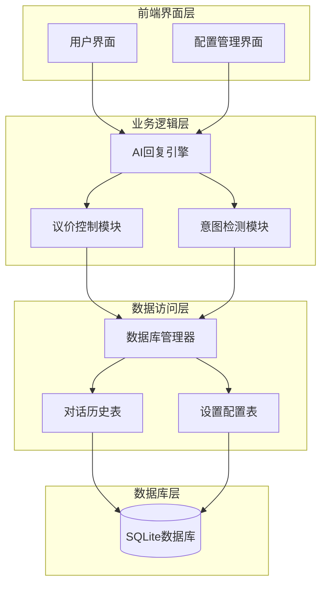
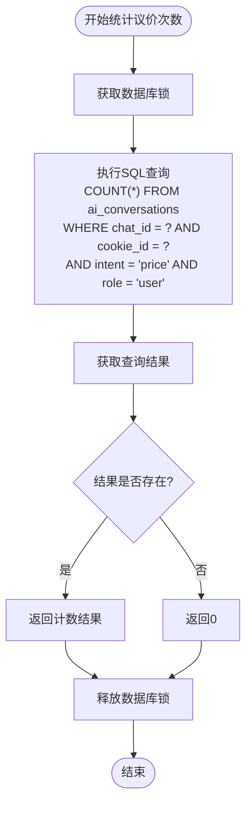
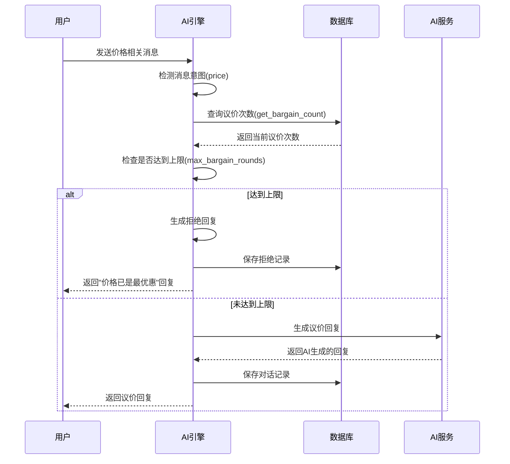
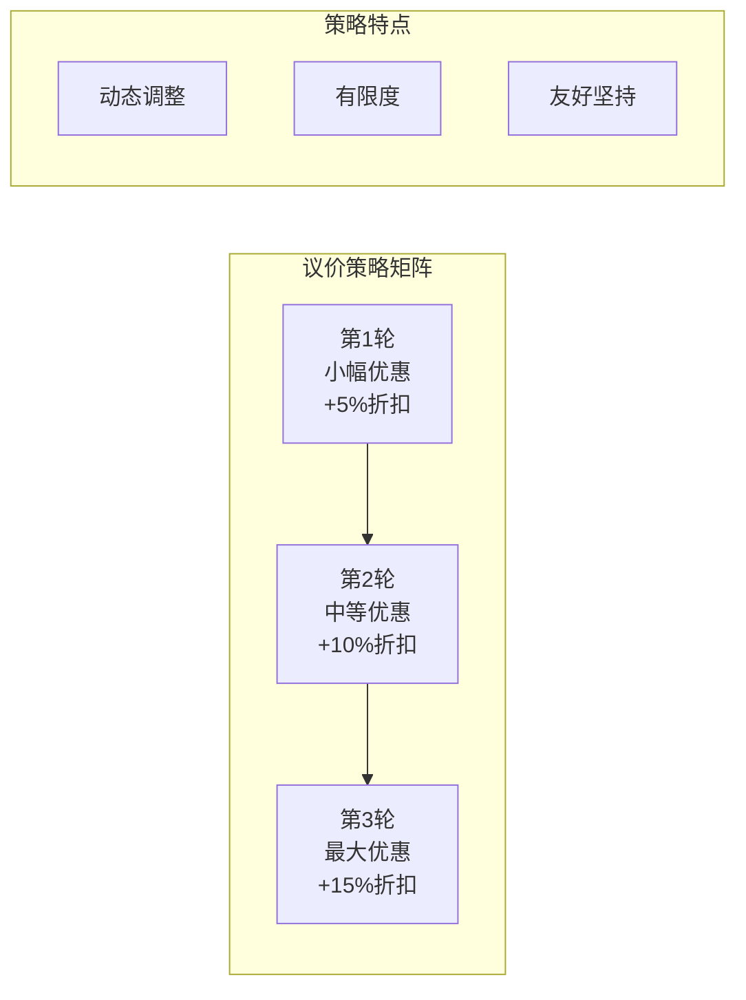
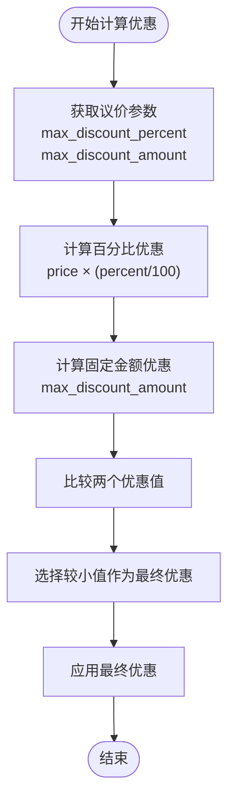
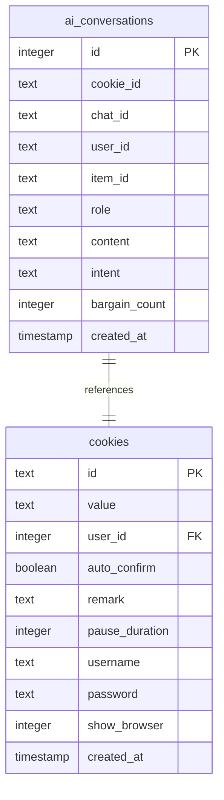
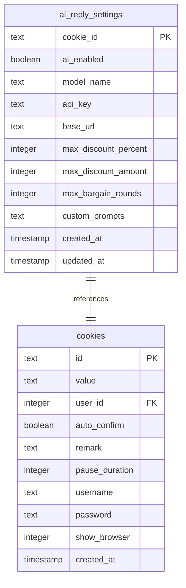
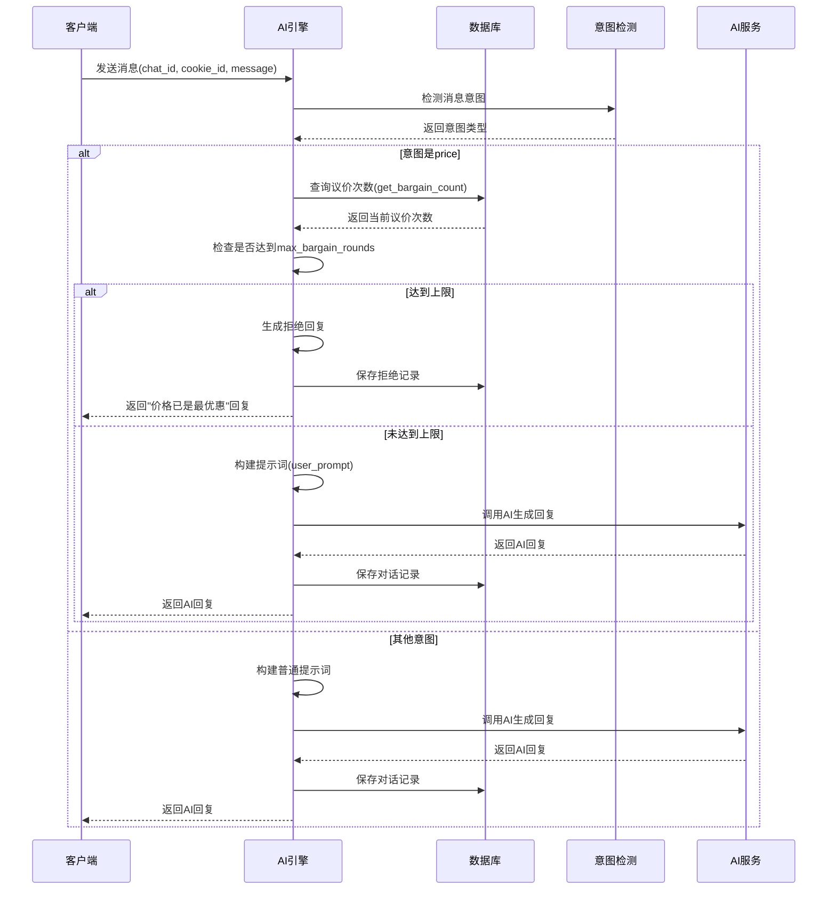
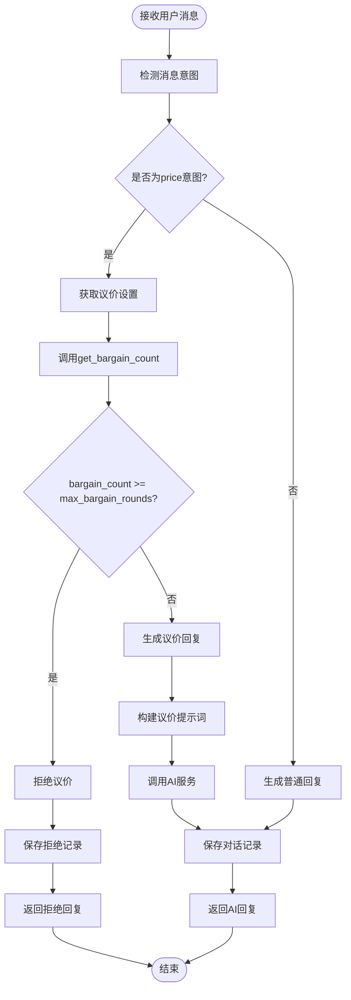
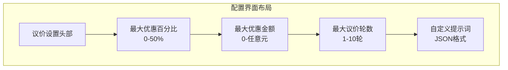

# 议价次数控制功能详细文档

<cite>
**本文档引用的文件**
- [ai_reply_engine.py](file://ai_reply_engine.py)
- [db_manager.py](file://db_manager.py)
- [config.py](file://config.py)
- [static/index.html](file://static/index.html)
- [static/js/app.js](file://static/js/app.js)
</cite>

## 目录
1. [简介](#简介)
2. [系统架构概览](#系统架构概览)
3. [核心组件分析](#核心组件分析)
4. [议价次数统计机制](#议价次数统计机制)
5. [议价轮数限制控制](#议价轮数限制控制)
6. [议价策略与动态调整](#议价策略与动态调整)
7. [限制参数详解](#限制参数详解)
8. [数据库设计](#数据库设计)
9. [完整流程时序图](#完整流程时序图)
10. [配置管理](#配置管理)
11. [故障排除指南](#故障排除指南)
12. [总结](#总结)

## 简介

议价次数控制功能是Xianyu Auto Reply系统中的核心智能功能，旨在通过SQL查询和AI策略相结合的方式，实现对在线交易中议价行为的有效管理和优化。该功能通过统计特定聊天ID和Cookie ID组合下的价格意图用户消息数量，动态控制议价轮数，并根据议价次数调整优惠策略，确保交易效率和用户体验的平衡。

## 系统架构概览

议价次数控制系统采用分层架构设计，包含以下主要层次：



**图表来源**
- [ai_reply_engine.py](file://ai_reply_engine.py#L24-L544)
- [db_manager.py](file://db_manager.py#L16-L5103)

## 核心组件分析

### AI回复引擎 (AIReplyEngine)

AI回复引擎是议价控制功能的核心控制器，负责协调整个议价流程的执行。其主要职责包括：

- **意图检测**：识别用户消息中的价格谈判意图
- **议价次数统计**：查询数据库获取当前议价轮数
- **轮数限制检查**：验证是否达到最大议价轮数
- **回复生成**：基于议价策略生成AI回复

### 数据库管理器 (DBManager)

数据库管理器提供持久化存储服务，维护议价相关的配置和历史数据：

- **ai_conversations表**：存储对话历史和议价记录
- **ai_reply_settings表**：存储议价参数配置
- **并发控制**：通过锁机制确保数据一致性

**章节来源**
- [ai_reply_engine.py](file://ai_reply_engine.py#L24-L544)
- [db_manager.py](file://db_manager.py#L16-L5103)

## 议价次数统计机制

### get_bargain_count方法实现

`get_bargain_count`方法是议价次数统计的核心实现，通过精确的SQL查询获取特定聊天会话的价格谈判次数：



**图表来源**
- [ai_reply_engine.py](file://ai_reply_engine.py#L476-L491)

#### SQL查询分析

该方法执行的关键SQL查询语句如下：

```sql
SELECT COUNT(*) FROM ai_conversations 
WHERE chat_id = ? AND cookie_id = ? AND intent = 'price' AND role = 'user'
```

查询条件说明：
- **chat_id**: 聊天会话标识符，确保统计范围的准确性
- **cookie_id**: 用户身份标识，区分不同用户的议价行为
- **intent = 'price'**: 仅统计与价格相关的用户消息
- **role = 'user'**: 仅统计用户发起的消息，排除系统回复

#### 错误处理机制

方法包含完善的错误处理逻辑：
- **异常捕获**：捕获数据库操作异常并记录错误日志
- **默认返回值**：发生异常时返回0，确保系统稳定性
- **日志记录**：详细记录错误信息便于调试和监控

**章节来源**
- [ai_reply_engine.py](file://ai_reply_engine.py#L476-L491)

## 议价轮数限制控制

### generate_reply方法中的轮数检查

在AI回复生成流程中，议价轮数检查是关键的安全机制：



**图表来源**
- [ai_reply_engine.py](file://ai_reply_engine.py#L282-L420)

#### 轮数检查逻辑

轮数检查的核心逻辑包含以下步骤：

1. **意图识别**：确认消息属于价格谈判意图
2. **参数获取**：从配置中获取最大议价轮数设置
3. **条件判断**：比较当前议价次数与最大限制
4. **分支处理**：
   - **超出限制**：生成拒绝回复并终止议价流程
   - **未超限制**：继续正常的AI回复生成流程

#### 配置参数

最大议价轮数的默认值和配置方式：

| 参数名称 | 默认值 | 配置位置 | 说明 |
|---------|--------|----------|------|
| max_bargain_rounds | 3 | ai_reply_settings表 | 单次交易允许的最大议价轮数 |
| 可选范围 | 1-10 | 前端输入验证 | 防止过高的议价轮数影响交易效率 |

**章节来源**
- [ai_reply_engine.py](file://ai_reply_engine.py#L336-L343)

## 议价策略与动态调整

### 递减优惠策略

议价策略基于议价次数实施递减优惠原则，具体表现为：



**图表来源**
- [ai_reply_engine.py](file://ai_reply_engine.py#L42-L48)

#### 策略实现细节

1. **优惠幅度递增**：随着议价轮数增加，提供的优惠幅度逐渐增大
2. **最大限制**：每个轮次的优惠都受到最大百分比和金额的双重限制
3. **语气控制**：在坚持底线的同时保持友好的沟通态度
4. **价值强调**：接近最终轮次时强调商品的独特价值

### 提示词中的策略体现

议价策略在提示词中的具体体现：

```python
# 示例提示词片段
system_prompt = '''
你是一位经验丰富的销售专家，擅长议价。
语言要求：简短直接，每句≤10字，总字数≤40字。
议价策略：
1. 根据议价次数递减优惠：第1次小幅优惠，第2次中等优惠，第3次最大优惠
2. 接近最大议价轮数时要坚持底线，强调商品价值
3. 优惠不能超过设定的最大百分比和金额
4. 语气要友好但坚定，突出商品优势
'''
```

**章节来源**
- [ai_reply_engine.py](file://ai_reply_engine.py#L42-L48)

## 限制参数详解

### max_discount_percent - 最大优惠百分比

#### 功能特性

最大优惠百分比参数控制单次议价中允许的最大折扣比例：

| 参数属性 | 数值范围 | 默认值 | 说明 |
|---------|----------|--------|------|
| 最小值 | 0% | - | 不允许负折扣 |
| 最大值 | 50% | 10% | 防止过度让利 |
| 默认值 | - | 10% | 平衡策略 |
| 配置方式 | 前端设置 | - | 实时调整 |

#### 实现机制



**图表来源**
- [ai_reply_engine.py](file://ai_reply_engine.py#L358-L360)

#### 配置示例

```javascript
// 前端配置示例
{
    "max_discount_percent": 15,    // 最大15%折扣
    "max_discount_amount": 200,    // 最大200元固定优惠
    "max_bargain_rounds": 4        // 最多4轮议价
}
```

### max_discount_amount - 最大优惠金额

#### 功能特性

最大优惠金额参数提供绝对的优惠上限控制：

- **固定金额限制**：无论商品价格高低，单次议价优惠不超过此金额
- **防止极端情况**：避免低价商品因百分比过高导致亏损
- **灵活搭配**：与百分比限制协同工作，提供双重保障

#### 计算逻辑

优惠计算采用双重限制策略：

1. **百分比计算**：`price × (max_discount_percent/100)`
2. **金额计算**：`max_discount_amount`
3. **最终优惠**：两者中的较小值

**章节来源**
- [ai_reply_engine.py](file://ai_reply_engine.py#L358-L360)
- [db_manager.py](file://db_manager.py#L157-L159)

## 数据库设计

### ai_conversations表结构

议价次数统计依赖于专门设计的对话历史表：



**图表来源**
- [db_manager.py](file://db_manager.py#L168-L182)

#### 关键字段说明

| 字段名 | 数据类型 | 约束 | 用途 |
|--------|----------|------|------|
| id | INTEGER | PRIMARY KEY AUTOINCREMENT | 主键标识 |
| cookie_id | TEXT | NOT NULL | 用户身份标识 |
| chat_id | TEXT | NOT NULL | 聊天会话标识 |
| role | TEXT | NOT NULL | 消息角色(user/assistant) |
| intent | TEXT | - | 消息意图(price/tech/default) |
| created_at | TIMESTAMP | DEFAULT CURRENT_TIMESTAMP | 时间戳 |

#### 索引优化

为了提高查询性能，数据库设计包含以下索引：

- **复合索引**：`(chat_id, cookie_id, intent, role)` - 支持快速议价次数统计
- **时间索引**：`(created_at)` - 支持时间范围查询
- **会话索引**：`(chat_id, created_at)` - 支持对话历史查询

**章节来源**
- [db_manager.py](file://db_manager.py#L168-L182)

### ai_reply_settings表结构

议价参数配置存储在专门的设置表中：



**图表来源**
- [db_manager.py](file://db_manager.py#L150-L166)

#### 默认配置值

| 参数 | 默认值 | 说明 |
|------|--------|------|
| max_discount_percent | 10 | 10%最大折扣 |
| max_discount_amount | 100 | 100元最大优惠 |
| max_bargain_rounds | 3 | 3轮议价限制 |

**章节来源**
- [db_manager.py](file://db_manager.py#L150-L166)

## 完整流程时序图

### 消息处理完整流程



**图表来源**
- [ai_reply_engine.py](file://ai_reply_engine.py#L282-L420)

### 议价次数检查流程



**图表来源**
- [ai_reply_engine.py](file://ai_reply_engine.py#L336-L343)

## 配置管理

### 前端配置界面

系统提供直观的Web界面用于议价参数配置：



**图表来源**
- [static/index.html](file://static/index.html#L3346-L3386)

#### 配置参数说明

| 输入字段 | 数据类型 | 验证规则 | 默认值 | 作用 |
|---------|----------|----------|--------|------|
| maxDiscountPercent | Number | 0-50 | 10 | 控制百分比优惠上限 |
| maxDiscountAmount | Number | ≥0 | 100 | 控制固定金额优惠上限 |
| maxBargainRounds | Number | 1-10 | 3 | 控制议价轮数上限 |

### 后端配置管理

配置数据通过数据库持久化存储：

```python
# 配置获取示例
settings = db_manager.get_ai_reply_settings(cookie_id)
max_discount_percent = settings.get('max_discount_percent', 10)
max_discount_amount = settings.get('max_discount_amount', 100)
max_bargain_rounds = settings.get('max_bargain_rounds', 3)
```

**章节来源**
- [static/index.html](file://static/index.html#L3346-L3386)
- [static/js/app.js](file://static/js/app.js#L2357-L2360)

## 故障排除指南

### 常见问题及解决方案

#### 1. 议价次数统计不准确

**症状**：议价次数显示异常或与预期不符

**可能原因**：
- 数据库查询条件不匹配
- 对话记录保存失败
- 并发访问冲突

**解决方案**：
```sql
-- 手动验证议价次数统计
SELECT COUNT(*) FROM ai_conversations 
WHERE chat_id = '目标chat_id' 
AND cookie_id = '目标cookie_id' 
AND intent = 'price' 
AND role = 'user';
```

#### 2. 议价轮数限制失效

**症状**：超过最大议价轮数仍能继续议价

**排查步骤**：
1. 检查数据库中对应的cookie_id设置
2. 验证max_bargain_rounds配置值
3. 确认generate_reply方法中的检查逻辑

#### 3. 性能问题

**症状**：议价次数查询响应缓慢

**优化措施**：
- 确保ai_conversations表有适当的索引
- 监控数据库连接池使用情况
- 考虑查询结果缓存机制

**章节来源**
- [ai_reply_engine.py](file://ai_reply_engine.py#L476-L491)

## 总结

议价次数控制功能通过精密的SQL查询、智能的AI策略和灵活的配置管理，实现了在线交易中议价行为的有效控制。该系统的主要优势包括：

### 技术优势

1. **精确统计**：基于SQL COUNT(*)的高效议价次数统计
2. **实时控制**：运行时动态检查议价轮数限制
3. **策略灵活**：支持递减优惠和多种限制参数
4. **配置便捷**：Web界面提供直观的参数调整

### 商业价值

1. **交易效率**：合理控制议价轮数，提升成交率
2. **利润保护**：通过限制参数防止过度让利
3. **用户体验**：在坚持底线的同时保持友好沟通
4. **系统稳定**：完善的错误处理和日志记录

### 扩展性

该功能设计具有良好的扩展性，可以：
- 支持更多的议价策略和算法
- 集成更复杂的AI模型
- 扩展到其他类型的谈判场景
- 提供更精细化的参数控制

通过持续优化和迭代，议价次数控制功能将继续为在线交易平台提供智能化的议价管理解决方案。