# 关键词回复配置接口

<cite>
**本文档引用的文件**
- [Start.py](file://Start.py)
- [reply_server.py](file://reply_server.py)
- [XianyuAutoAsync.py](file://XianyuAutoAsync.py)
- [db_manager.py](file://db_manager.py)
- [static/js/app.js](file://static/js/app.js)
- [static/css/keywords.css](file://static/css/keywords.css)
- [static/index.html](file://static/index.html)
- [config.py](file://config.py)
</cite>

## 目录
1. [简介](#简介)
2. [系统架构概览](#系统架构概览)
3. [match_reply函数实现逻辑](#match_reply函数实现逻辑)
4. [load_keywords函数支持的文件格式](#load_keywords函数支持的文件格式)
5. [关键词匹配的实时生效机制](#关键词匹配的实时生效机制)
6. [RequestModel消息处理流程](#requestmodel消息处理流程)
7. [前端界面配置方式](#前端界面配置方式)
8. [直接修改配置文件方式](#直接修改配置文件方式)
9. [多账号环境下的关键字隔离策略](#多账号环境下的关键字隔离策略)
10. [优先级处理机制](#优先级处理机制)
11. [故障排除指南](#故障排除指南)
12. [总结](#总结)

## 简介

关键词回复配置系统是闲鱼自动回复平台的核心功能模块，负责管理用户定义的关键词触发规则和相应的回复内容。该系统支持全局关键字与账号级关键字的优先级处理，提供实时生效机制，并在多账号环境下实现严格的数据隔离。

系统采用前后端分离架构，前端通过Web界面提供直观的操作体验，后端通过RESTful API处理关键词的增删改查操作，并将配置持久化到SQLite数据库中。

## 系统架构概览

关键词回复配置系统采用分层架构设计，包含以下核心组件：


**图表来源**
- [reply_server.py](file://reply_server.py#L1-L200)
- [db_manager.py](file://db_manager.py#L16-L50)

**章节来源**
- [reply_server.py](file://reply_server.py#L1-L200)
- [db_manager.py](file://db_manager.py#L16-L100)

## match_reply函数实现逻辑

`match_reply`函数是关键词匹配的核心逻辑，负责在收到消息时查找匹配的关键词并生成相应的回复。

### 匹配优先级算法

系统按照以下优先级顺序进行关键词匹配：


**图表来源**
- [XianyuAutoAsync.py](file://XianyuAutoAsync.py#L3169-L3250)

### 关键词匹配实现细节

匹配过程遵循以下步骤：

1. **获取当前账号的关键词列表**：从数据库中读取指定账号的所有关键词配置
2. **商品ID优先匹配**：如果消息包含商品ID，优先匹配该商品ID对应的关键词
3. **关键词类型判断**：区分文本关键词和图片关键词，分别处理
4. **空回复检查**：如果关键词匹配但回复内容为空，返回特殊标记
5. **变量替换**：对匹配到的回复内容进行动态变量替换

**章节来源**
- [XianyuAutoAsync.py](file://XianyuAutoAsync.py#L3169-L3250)

## load_keywords函数支持的文件格式

`load_keywords`函数负责从配置文件中读取关键词配置，支持多种分隔符格式。

### 支持的文件格式

| 分隔符 | 示例格式 | 说明 |
|--------|----------|------|
| 制表符(Tab) | `关键词<TAB>回复内容` | 推荐格式，避免空格冲突 |
| 空格 | `关键词 回复内容` | 常用格式，简单易读 |
| 冒号 | `关键词:回复内容` | 传统格式，兼容性好 |

### 注释语法支持

- **单行注释**：以`#`开头的行被视为注释，会被忽略
- **空行处理**：空行会被自动跳过
- **编码要求**：文件必须使用UTF-8编码

### 文件读取流程


**图表来源**
- [Start.py](file://Start.py#L490-L510)

**章节来源**
- [Start.py](file://Start.py#L490-L510)

## 关键词匹配的实时生效机制

系统实现了关键词配置的实时生效机制，确保用户在界面上所做的修改能够立即反映到自动回复逻辑中。

### 实时生效流程

```mermaid
sequenceDiagram
participant User as 用户
participant Frontend as 前端界面
participant API as 后端API
participant DB as 数据库
participant Matcher as 匹配引擎
participant MessageHandler as 消息处理器
User->>Frontend : 修改关键词配置
Frontend->>API : 发送更新请求
API->>DB : 保存到数据库
DB-->>API : 确认保存成功
API-->>Frontend : 返回成功响应
Frontend-->>User : 显示保存成功
Note over Matcher,MessageHandler : 下次消息到达时
MessageHandler->>Matcher : 触发关键词匹配
Matcher->>DB : 查询最新关键词配置
DB-->>Matcher : 返回当前配置
Matcher->>Matcher : 执行匹配逻辑
Matcher-->>MessageHandler : 返回匹配结果
```



**图表来源**
- [reply_server.py](file://reply_server.py#L3077-L3096)
- [db_manager.py](file://db_manager.py#L1616-L1640)

### 缓存管理策略

系统采用智能缓存策略来平衡性能和实时性：

- **关键词缓存**：关键词列表在一定时间内缓存，避免频繁数据库查询
- **缓存失效**：关键词变更时立即清除相关缓存
- **增量更新**：只更新变更的部分，减少系统开销

**章节来源**
- [reply_server.py](file://reply_server.py#L3077-L3096)
- [static/js/app.js](file://static/js/app.js#L323-L362)

## RequestModel消息处理流程

关键词匹配在消息处理流程中的具体位置和调用时机决定了系统的响应效率和用户体验。

### 消息处理完整流程


**图表来源**
- [XianyuAutoAsync.py](file://XianyuAutoAsync.py#L7069-L7171)

### 调用时机分析

关键词匹配在以下情况下被调用：

1. **消息到达时**：每次收到新消息时都会触发匹配检查
2. **商品信息可用时**：当消息包含商品ID时，优先进行商品级匹配
3. **自动回复启用时**：只有在自动回复功能启用的情况下才会进行匹配
4. **账号状态正常时**：禁用的账号不会参与关键词匹配

**章节来源**
- [XianyuAutoAsync.py](file://XianyuAutoAsync.py#L7069-L7171)

## 前端界面配置方式

系统提供了完整的Web界面来管理关键词配置，支持拖拽式操作和实时预览。

### 界面功能特性

| 功能模块 | 说明 | 用户体验 |
|----------|------|----------|
| 账号选择器 | 支持多账号切换 | 下拉选择，实时切换 |
| 关键词列表 | 显示当前账号的所有关键词 | 响应式布局，支持排序 |
| 添加关键词 | 提供多种输入方式 | 表单验证，即时反馈 |
| 编辑关键词 | 支持关键词和回复内容修改 | 实时预览，撤销功能 |
| 删除关键词 | 安全删除确认 | 确认对话框，防止误操作 |
| 导入导出 | Excel文件批量操作 | 支持模板下载，批量导入 |

### 关键词管理界面


**图表来源**
- [static/js/app.js](file://static/js/app.js#L536-L8661)
- [static/css/keywords.css](file://static/css/keywords.css#L1-L404)

### 实时配置更新

前端界面支持以下实时配置更新功能：

- **即时验证**：输入过程中实时检查关键词格式
- **重复检测**：自动检测关键词重复并给出提示
- **预览功能**：修改后立即看到效果预览
- **批量操作**：支持批量导入和导出关键词

**章节来源**
- [static/js/app.js](file://static/js/app.js#L536-L8661)
- [static/css/keywords.css](file://static/css/keywords.css#L1-L404)

## 直接修改配置文件方式

除了通过Web界面配置外，系统还支持直接修改配置文件的方式来管理关键词。

### 文件配置方法

1. **定位配置文件**：找到项目的`回复关键字.txt`文件
2. **编辑文件内容**：按照支持的格式编写关键词配置
3. **保存文件**：确保使用UTF-8编码保存
4. **重启服务**：某些情况下需要重启服务使配置生效

### 配置文件示例

```
# 这是一个关键词配置示例
# 欢迎咨询: 您好！欢迎来到我们的店铺，请问有什么可以帮您？
# 价格: 我们的价格非常优惠，具体价格可以私聊咨询哦~
# 物流: 我们支持全国包邮，下单后24小时内发货
# 售后: 支持7天无理由退换货，有任何问题随时联系客服
```

### 文件监控机制

系统会在启动时自动扫描配置文件的变化，并在必要时重新加载配置。

**章节来源**
- [Start.py](file://Start.py#L490-L510)

## 多账号环境下的关键字隔离策略

系统在多账号环境下实现了严格的数据隔离，确保不同账号的关键词配置互不干扰。

### 数据隔离架构


**图表来源**
- [db_manager.py](file://db_manager.py#L126-L137)

### 隔离策略实现

1. **账号维度隔离**：每个账号拥有独立的关键词配置空间
2. **数据库层面隔离**：通过外键约束确保数据完整性
3. **API访问控制**：每个API请求都验证用户权限
4. **前端权限控制**：界面操作只能影响当前登录用户的账号

### 权限验证流程


**图表来源**
- [reply_server.py](file://reply_server.py#L3082-L3089)

**章节来源**
- [db_manager.py](file://db_manager.py#L126-L137)
- [reply_server.py](file://reply_server.py#L3082-L3089)

## 优先级处理机制

系统实现了多层次的优先级处理机制，确保回复逻辑的准确性和灵活性。

### 优先级层次结构


**图表来源**
- [XianyuAutoAsync.py](file://XianyuAutoAsync.py#L7115-L7137)

### 优先级详细说明

| 优先级 | 类别 | 触发条件 | 处理方式 |
|--------|------|----------|----------|
| 1 | 商品ID关键词 | 消息包含商品ID且匹配 | 立即回复，停止后续匹配 |
| 2 | AI回复 | AI功能启用且匹配成功 | 继续匹配默认回复 |
| 3 | 默认回复 | 无关键词匹配且默认回复启用 | 发送默认回复 |
| 4 | 不回复 | 所有匹配失败 | 静默处理，不发送回复 |

### 空回复处理

系统对空回复有特殊的处理机制：

- **关键词匹配到空回复**：返回特殊标记`EMPTY_REPLY`，跳过回复
- **默认回复为空**：同样返回`EMPTY_REPLY`，避免发送空消息
- **日志记录**：记录空回复的匹配情况，便于调试

**章节来源**
- [XianyuAutoAsync.py](file://XianyuAutoAsync.py#L7115-L7137)

## 故障排除指南

### 常见问题及解决方案

| 问题类型 | 症状描述 | 可能原因 | 解决方案 |
|----------|----------|----------|----------|
| 关键词不生效 | 设置的关键词没有触发回复 | 关键词格式错误、账号未启用 | 检查格式，确认账号状态 |
| 配置丢失 | 修改后配置消失 | 数据库连接问题、权限不足 | 检查数据库状态，验证权限 |
| 性能问题 | 关键词匹配响应慢 | 关键词过多、数据库查询慢 | 优化关键词数量，检查索引 |
| 权限错误 | 无法访问关键词配置 | 用户权限不足、Cookie无效 | 重新登录，检查Cookie有效性 |

### 调试工具和方法

1. **日志分析**：查看系统日志了解匹配过程
2. **数据库检查**：直接查询数据库确认配置
3. **网络诊断**：检查API请求和响应
4. **浏览器开发者工具**：分析前端交互问题

### 性能优化建议

- **关键词数量控制**：单账号关键词数量建议不超过100个
- **定期清理**：删除长期不用的关键词配置
- **索引优化**：确保数据库索引正常工作
- **缓存策略**：合理利用缓存减少数据库查询

**章节来源**
- [db_manager.py](file://db_manager.py#L1616-L1640)
- [reply_server.py](file://reply_server.py#L3077-L3096)

## 总结

关键词回复配置系统是一个功能完善、架构合理的自动化回复解决方案。系统的主要优势包括：

### 核心特性

- **灵活的配置方式**：支持Web界面和文件两种配置方式
- **实时生效机制**：配置变更立即生效，无需重启服务
- **严格的权限控制**：多层级的安全保障，确保数据隔离
- **完善的优先级处理**：智能的回复优先级算法
- **丰富的扩展能力**：支持文本和图片两种关键词类型

### 技术亮点

- **前后端分离架构**：清晰的职责划分，易于维护和扩展
- **数据库设计合理**：满足多账号隔离需求，支持未来扩展
- **实时缓存机制**：平衡性能和实时性的最佳实践
- **完善的错误处理**：全面的异常捕获和用户友好的错误提示

### 应用价值

该系统为闲鱼卖家提供了强大的自动化回复能力，显著提升了客户服务效率，同时保持了高度的灵活性和可控性。通过合理的架构设计和完善的配置管理，系统能够适应各种复杂的业务场景需求。