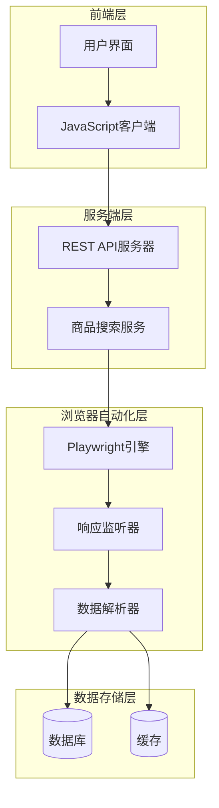
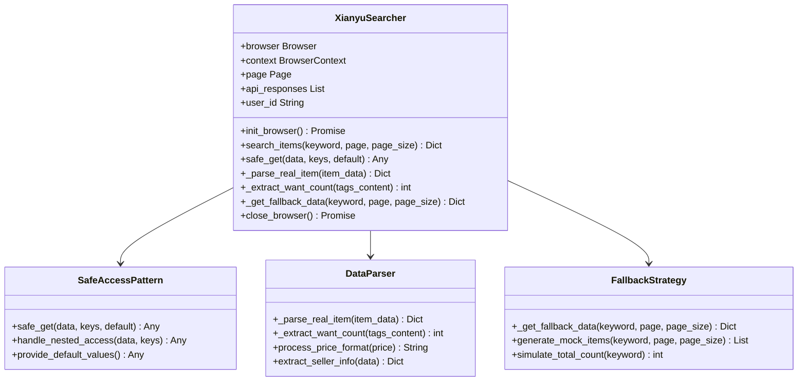
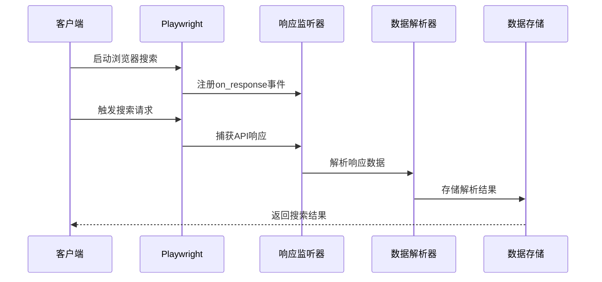
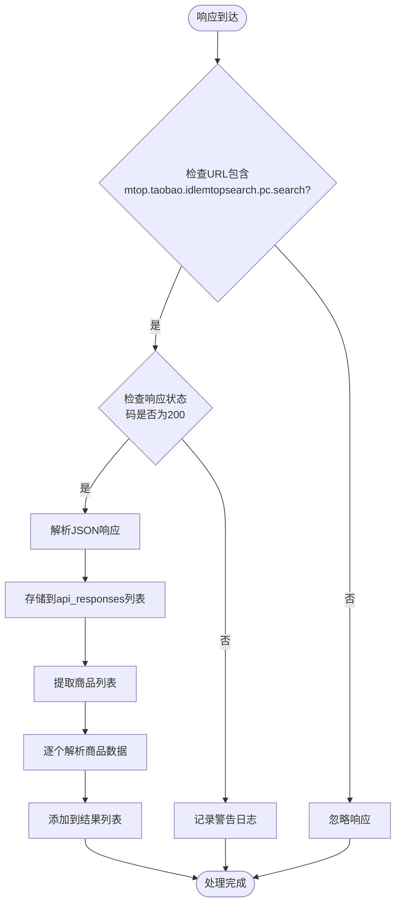

# API响应监听与数据解析

<cite>
**本文档中引用的文件**
- [item_search.py](file://utils/item_search.py)
- [XianyuAutoAsync.py](file://XianyuAutoAsync.py)
- [app.js](file://static/js/app.js)
- [xianyu_js_version_2.js](file://static/xianyu_js_version_2.js)
</cite>

## 目录
1. [简介](#简介)
2. [项目架构概览](#项目架构概览)
3. [核心组件分析](#核心组件分析)
4. [API响应监听机制](#api响应监听机制)
5. [数据捕获与解析流程](#数据捕获与解析流程)
6. [安全数据访问模式](#安全数据访问模式)
7. [降级策略与数据一致性](#降级策略与数据一致性)
8. [性能考虑](#性能考虑)
9. [故障排除指南](#故障排除指南)
10. [总结](#总结)

## 简介

本文档详细阐述了闲鱼商品搜索系统中`search_items`方法通过Playwright的`on_response`监听器捕获`mtop.taobao.idlemtopsearch.pc.search`接口真实商品数据的技术实现。该系统采用多层次的数据捕获策略，确保在各种网络环境下都能获取准确的商品信息。

## 项目架构概览

系统采用异步架构设计，主要由以下几个层次组成：



**图表来源**
- [item_search.py](file://utils/item_search.py#L42-L100)
- [app.js](file://static/js/app.js#L10820-L11010)

## 核心组件分析

### XianyuSearcher类

`XianyuSearcher`类是整个搜索系统的核心控制器，负责协调各个组件的工作：



**图表来源**
- [item_search.py](file://utils/item_search.py#L42-L100)
- [item_search.py](file://utils/item_search.py#L625-L632)

**章节来源**
- [item_search.py](file://utils/item_search.py#L42-L100)

## API响应监听机制

### 响应监听器注册

系统通过Playwright的事件监听机制捕获API响应：



**图表来源**
- [item_search.py](file://utils/item_search.py#L1201-L1235)
- [item_search.py](file://utils/item_search.py#L797-L831)

### API响应处理流程

响应监听器专门处理`mtop.taobao.idlemtopsearch.pc.search`接口的响应：



**图表来源**
- [item_search.py](file://utils/item_search.py#L1202-L1235)

**章节来源**
- [item_search.py](file://utils/item_search.py#L1202-L1235)

## 数据捕获与解析流程

### 商品数据提取机制

系统通过深度解析API响应来提取商品信息：

| 数据字段 | 提取方法 | 数据类型 | 示例值 |
|---------|---------|---------|--------|
| 商品ID | `safe_get(item_data, "data", "item", "main", "clickParam", "args", "item_id")` | String | `"123456789"` |
| 商品标题 | `safe_get(main_data, "title")` | String | `"二手手机"` |
| 商品价格 | `safe_get(main_data, "price")` + 正则处理 | String | `"¥1999"` |
| 卖家名称 | `safe_get(main_data, "userNickName")` | String | `"闲鱼卖家"` |
| 发布时间 | `click_params.get("publishTime")` + 时间戳转换 | String | `"2025-07-28 14:30"` |
| 商品图片 | `safe_get(main_data, "picUrl")` | String | `"https://example.com/image.jpg"` |
| 地区信息 | `safe_get(main_data, "area")` | String | `"北京"` |
| 想要人数 | `_extract_want_count()` | Integer | `123` |

### HTML标签解析与想要人数提取

系统使用正则表达式从HTML标签中提取"人想要"的数量：

```mermaid
flowchart TD
Start([开始提取想要人数]) --> CheckContent{标签内容<br/>是否包含"人想要"}
CheckContent --> |否| ReturnZero[返回0]
CheckContent --> |是| RegexMatch[使用正则表达式<br/>匹配数字模式]
RegexMatch --> Pattern[r'(\d+(?:\.\d+)?(?:万)?)\s*人想要']
Pattern --> HasUnit{是否包含"万"单位}
HasUnit --> |是| ConvertToNumber[转换为整数<br/>number * 10000]
HasUnit --> |否| DirectConvert[直接转换为整数]
ConvertToNumber --> ReturnResult[返回结果]
DirectConvert --> ReturnResult
ReturnZero --> End([结束])
ReturnResult --> End
```

**图表来源**
- [item_search.py](file://utils/item_search.py#L1072-L1096)

**章节来源**
- [item_search.py](file://utils/item_search.py#L1072-L1096)

## 安全数据访问模式

### safe_get方法实现

`safe_get`方法提供了安全的嵌套字典访问模式：

```mermaid
flowchart TD
Start([safe_get调用]) --> InitData[初始化数据为输入数据]
InitData --> IterateKeys[遍历所有键]
IterateKeys --> TryAccess[尝试访问数据[key]]
TryAccess --> CatchException{捕获异常<br/>KeyError/TypeError/IndexError}
CatchException --> |是| ReturnDefault[返回默认值]
CatchException --> |否| NextKey[下一个键]
NextKey --> MoreKeys{还有更多键?}
MoreKeys --> |是| TryAccess
MoreKeys --> |否| ReturnValue[返回最终值]
ReturnDefault --> End([结束])
ReturnValue --> End
```

**图表来源**
- [item_search.py](file://utils/item_search.py#L625-L632)

### 嵌套数据访问示例

系统使用`safe_get`方法安全访问复杂的嵌套JSON结构：

| 访问路径 | 安全访问代码 | 默认值 | 用途 |
|---------|-------------|--------|------|
| `data.item.main.exContent.title` | `await self.safe_get(item_data, "data", "item", "main", "exContent", "title", default="未知标题")` | `"未知标题"` | 商品标题 |
| `data.item.main.exContent.price` | `await self.safe_get(main_data, "price", default=[])` | `[]` | 价格部分 |
| `data.item.main.exContent.fishTags` | `await self.safe_get(main_data, "fishTags", default={})` | `{}` | 标签信息 |
| `data.item.main.clickParam.args.item_id` | `await self.safe_get(click_params, "item_id", default="未知ID")` | `"未知ID"` | 商品ID |

**章节来源**
- [item_search.py](file://utils/item_search.py#L625-L632)

## 降级策略与数据一致性

### 备选数据生成机制

当真实数据获取失败时，系统提供完整的降级策略：

```mermaid
flowchart TD
Start([数据获取失败]) --> CheckFallback{是否启用<br/>降级策略}
CheckFallback --> |否| ReturnEmpty[返回空结果]
CheckFallback --> |是| GenerateMock[生成模拟数据]
GenerateMock --> CreateItems[创建模拟商品项]
CreateItems --> SetPrice[设置价格(100+index*10)]
SetPrice --> SetSeller[设置卖家名称(卖家+index)]
SetSeller --> SetImage[设置占位图片URL]
SetImage --> SetPublishTime[设置固定发布时间]
SetPublishTime --> SetTags[设置标签和分类]
SetTags --> CalculateTotal[计算总数(100+hash%500)]
CalculateTotal --> ReturnMock[返回模拟数据]
ReturnEmpty --> End([结束])
ReturnMock --> End
```

**图表来源**
- [item_search.py](file://utils/item_search.py#L937-L975)

### 数据结构一致性保证

无论是真实数据还是模拟数据，系统都保证返回相同的数据结构：

| 字段名 | 真实数据格式 | 模拟数据格式 | 数据类型 | 必需性 |
|-------|-------------|-------------|---------|--------|
| `item_id` | `String` | `mock_{keyword}_{index}` | String | 必需 |
| `title` | `String` | `{keyword}相关商品 #{index} [模拟数据]` | String | 必需 |
| `price` | `String` | `¥{100 + index * 10}` | String | 必需 |
| `seller_name` | `String` | `卖家{index}` | String | 必需 |
| `item_url` | `String` | `https://www.goofish.com/item?id=mock_{keyword}_{index}` | String | 必需 |
| `publish_time` | `String` | 固定日期 | String | 必需 |
| `tags` | `List[String]` | `[标签{index}, 分类{index}]` | List | 必需 |
| `main_image` | `String` | 占位图片URL | String | 必需 |
| `want_count` | `Integer` | `0` | Integer | 可选 |
| `is_real_data` | `Boolean` | `False` | Boolean | 可选 |

**章节来源**
- [item_search.py](file://utils/item_search.py#L937-L975)

## 性能考虑

### 异步处理优化

系统采用异步编程模型来提高性能：

- **并发API请求**：多个商品数据同时解析
- **智能等待策略**：根据网络状况动态调整等待时间
- **资源池管理**：浏览器实例的复用和清理
- **内存优化**：及时清理不需要的响应数据

### 缓存策略

系统实现了多层缓存机制：

1. **浏览器缓存**：持久化上下文保存cookies和缓存
2. **内存缓存**：`api_responses`列表临时存储
3. **数据库缓存**：长期存储搜索结果

## 故障排除指南

### 常见问题及解决方案

| 问题类型 | 症状 | 可能原因 | 解决方案 |
|---------|------|---------|---------|
| 浏览器启动失败 | `BrowserType.launch`异常 | Playwright未安装或权限不足 | 运行`playwright install chromium` |
| 滑块验证失败 | 搜索中断且返回错误 | 网站反爬虫检测 | 使用人工验证或更换IP |
| API响应超时 | 等待时间过长 | 网络连接不稳定 | 增加超时时间或重试机制 |
| 数据解析失败 | 商品信息为空 | API格式变更 | 更新解析逻辑 |
| 降级策略触发 | 返回模拟数据 | 真实数据获取失败 | 检查网络连接和cookies |

### 调试技巧

1. **启用详细日志**：设置日志级别为DEBUG
2. **监控API响应**：检查`api_responses`列表内容
3. **页面截图**：在关键节点保存页面快照
4. **网络分析**：使用浏览器开发者工具分析请求

## 总结

闲鱼商品搜索系统的API响应监听与数据解析机制展现了现代Web自动化技术的精妙之处。通过Playwright的`on_response`监听器，系统能够实时捕获真实的API响应数据，结合安全的数据访问模式和完善的降级策略，确保了在各种复杂环境下的稳定性和可靠性。

该系统的核心优势包括：

- **实时数据捕获**：通过响应监听器直接获取API原始数据
- **安全数据访问**：`safe_get`方法提供健壮的嵌套数据访问
- **智能降级策略**：当真实数据不可用时提供一致的模拟数据
- **高性能异步处理**：充分利用异步编程模型提升效率
- **完善的错误处理**：多层次的错误检测和恢复机制

这种设计不仅保证了数据的准确性和完整性，也为后续的数据分析和业务决策提供了可靠的基础。随着Web技术的不断发展，这套系统的设计理念和实现方法为类似的自动化项目提供了宝贵的参考价值。