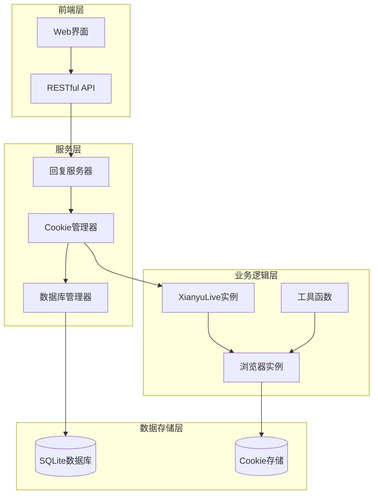
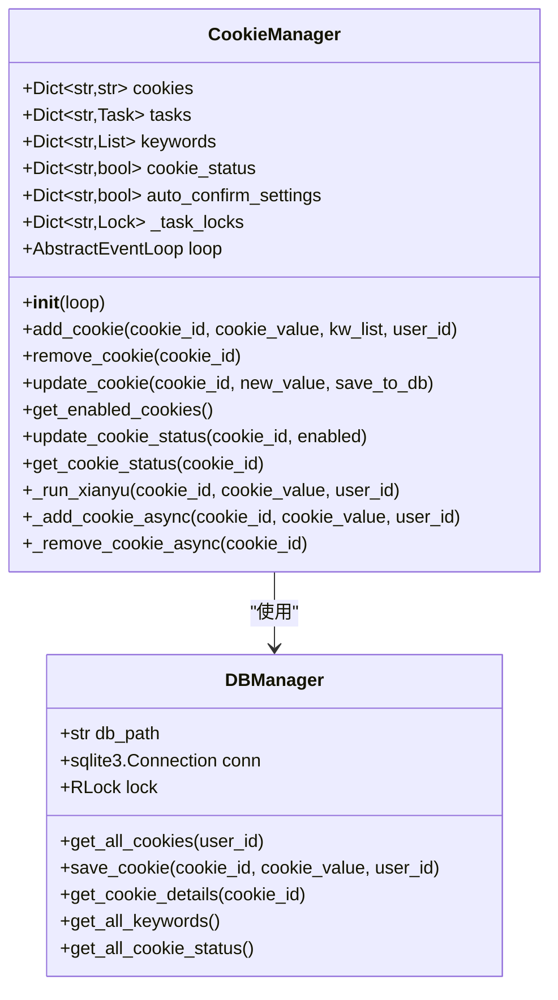
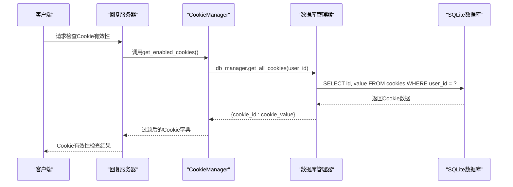
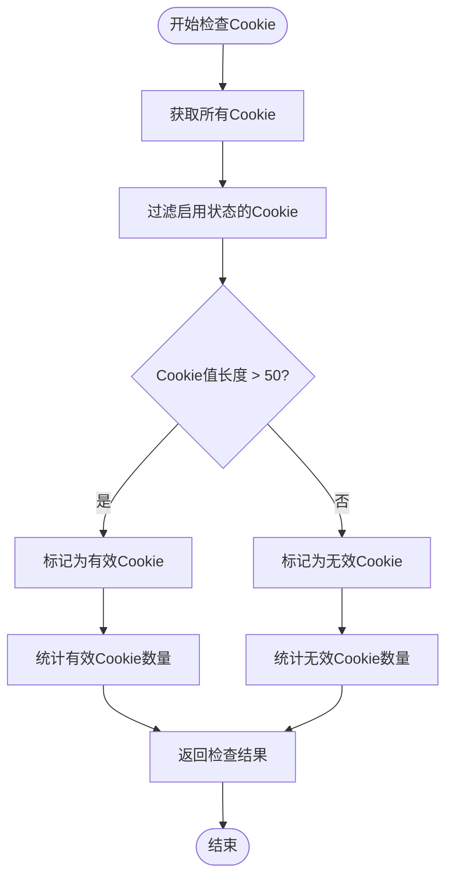
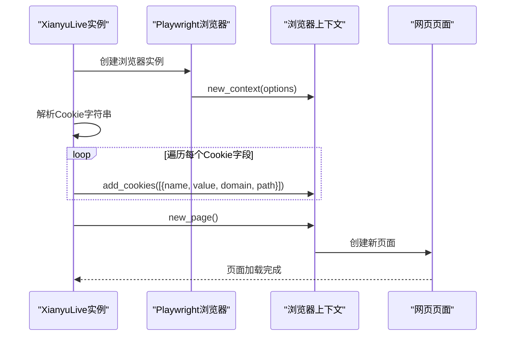
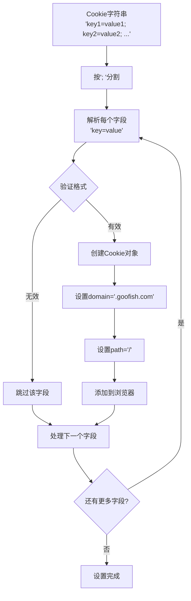
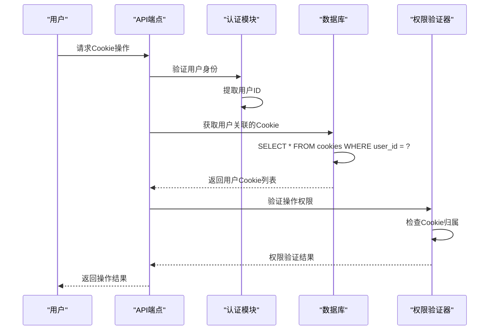
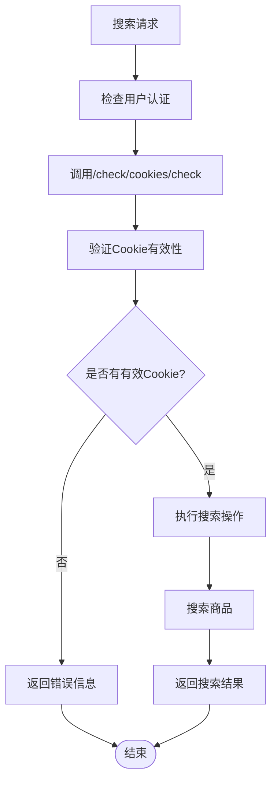
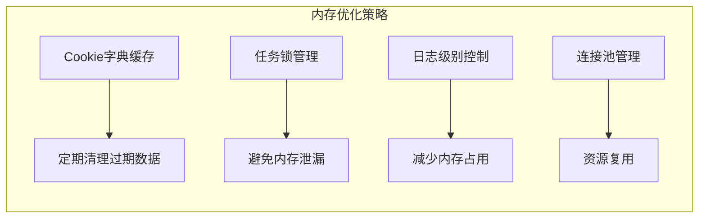

# Cookie管理与账号验证

<cite>
**本文档中引用的文件**
- [cookie_manager.py](file://cookie_manager.py)
- [db_manager.py](file://db_manager.py)
- [reply_server.py](file://reply_server.py)
- [XianyuAutoAsync.py](file://XianyuAutoAsync.py)
- [utils/xianyu_utils.py](file://utils/xianyu_utils.py)
- [utils/refresh_util.py](file://utils/refresh_util.py)
- [utils/item_search.py](file://utils/item_search.py)
</cite>

## 目录
1. [简介](#简介)
2. [项目架构概览](#项目架构概览)
3. [Cookie管理核心组件](#cookie管理核心组件)
4. [Cookie有效性验证机制](#cookie有效性验证机制)
5. [浏览器Cookie设置流程](#浏览器cookie设置流程)
6. [多用户权限隔离机制](#多用户权限隔离机制)
7. [搜索操作的Cookie验证](#搜索操作的cookie验证)
8. [性能考虑与优化](#性能考虑与优化)
9. [故障排除指南](#故障排除指南)
10. [总结](#总结)

## 简介

本文档详细阐述了闲鱼自动回复系统中的Cookie管理与账号验证机制。该系统采用多层Cookie验证策略，确保用户能够安全、可靠地使用自动回复功能。系统通过严格的Cookie有效性检查、多用户权限隔离和智能的浏览器Cookie设置机制，为用户提供稳定的服务体验。

## 项目架构概览

系统采用模块化设计，主要包含以下核心组件：

**图表来源**
- [reply_server.py](file://reply_server.py#L1-L50)
- [cookie_manager.py](file://cookie_manager.py#L1-L50)
- [db_manager.py](file://db_manager.py#L1-L50)

## Cookie管理核心组件

### CookieManager类架构

CookieManager是系统的核心组件，负责管理所有账号的Cookie及其相关配置：

**图表来源**
- [cookie_manager.py](file://cookie_manager.py#L10-L50)
- [db_manager.py](file://db_manager.py#L16-L100)

### 数据库表结构设计

系统使用SQLite数据库存储Cookie及相关信息，主要表结构如下：

| 表名 | 字段 | 类型 | 约束 | 描述 |
|------|------|------|------|------|
| cookies | id | TEXT | PRIMARY KEY | Cookie唯一标识符 |
| cookies | value | TEXT | NOT NULL | Cookie值字符串 |
| cookies | user_id | INTEGER | NOT NULL | 关联用户ID |
| cookies | auto_confirm | INTEGER | DEFAULT 1 | 自动确认发货设置 |
| cookies | remark | TEXT | DEFAULT '' | 备注信息 |
| cookies | pause_duration | INTEGER | DEFAULT 10 | 暂停时间（分钟） |
| cookies | username | TEXT | DEFAULT '' | 用户名 |
| cookies | password | TEXT | DEFAULT '' | 密码 |
| cookies | show_browser | INTEGER | DEFAULT 0 | 是否显示浏览器 |
| cookies | created_at | TIMESTAMP | DEFAULT CURRENT_TIMESTAMP | 创建时间 |

**章节来源**
- [db_manager.py](file://db_manager.py#L110-L125)

## Cookie有效性验证机制

### `get_all_cookies()`方法实现

系统通过`db_manager.get_all_cookies()`方法从数据库获取所有Cookie，支持用户级别的权限隔离：

**图表来源**
- [reply_server.py](file://reply_server.py#L4041-L4088)
- [db_manager.py](file://db_manager.py#L1224-L1236)

### Cookie有效性判断标准

系统采用严格的Cookie有效性判断机制，确保只有有效的Cookie才能参与自动回复：

**图表来源**
- [reply_server.py](file://reply_server.py#L4061-L4078)

### `check_valid_cookies` API端点

系统提供了专门的API端点用于检查Cookie的有效性：

| 参数 | 类型 | 描述 |
|------|------|------|
| success | boolean | 操作是否成功 |
| hasValidCookies | boolean | 是否存在有效Cookie |
| validCount | integer | 有效Cookie数量 |
| enabledCount | integer | 启用状态的Cookie数量 |
| totalCount | integer | 总Cookie数量 |

**章节来源**
- [reply_server.py](file://reply_server.py#L4041-L4088)

## 浏览器Cookie设置流程

### `set_browser_cookies`方法实现

系统通过Playwright浏览器引擎设置Cookie，确保与闲鱼网站的兼容性：

**图表来源**
- [XianyuAutoAsync.py](file://XianyuAutoAsync.py#L6068-L6083)
- [utils/item_search.py](file://utils/item_search.py#L663-L684)

### Cookie字段解析与设置

系统将Cookie字符串解析为Playwright所需的格式：

**图表来源**
- [XianyuAutoAsync.py](file://XianyuAutoAsync.py#L6071-L6080)
- [utils/item_search.py](file://utils/item_search.py#L664-L674)

### 硬编码域名和路径的原因

系统将所有Cookie的`domain`设置为`.goofish.com`，`path`设置为`/`，这是出于以下考虑：

1. **域名兼容性**：闲鱼网站使用goofish.com作为主域名
2. **路径覆盖**：设置为根路径确保所有页面都能访问Cookie
3. **安全性**：明确指定域名和路径，避免跨域风险
4. **一致性**：统一的设置简化了Cookie管理逻辑

**章节来源**
- [XianyuAutoAsync.py](file://XianyuAutoAsync.py#L6078-L6079)

## 多用户权限隔离机制

### 用户级别Cookie访问控制

系统实现了严格的多用户权限隔离机制，确保用户只能访问自己的Cookie：

**图表来源**
- [reply_server.py](file://reply_server.py#L4146-L4150)

### 权限隔离的具体实现

| 操作类型 | 权限检查 | 实现方式 |
|----------|----------|----------|
| Cookie查询 | 用户ID匹配 | `db_manager.get_all_cookies(user_id)` |
| Cookie更新 | Cookie归属验证 | `if cookie_id in user_cookies` |
| Cookie删除 | 管理员权限 | `require_admin()`装饰器 |
| 商品信息获取 | Cookie权限检查 | `if cookie_id in user_cookies` |

**章节来源**
- [reply_server.py](file://reply_server.py#L4140-L4158)

## 搜索操作的Cookie验证

### `/items/search`端点的Cookie验证流程

在执行商品搜索操作前，系统会通过`check_valid_cookies`API确保有可用的有效Cookie：

**图表来源**
- [reply_server.py](file://reply_server.py#L4041-L4088)

### 搜索操作的安全保障

系统在搜索操作中实施多层次的安全保障措施：

1. **Cookie有效性检查**：确保使用的Cookie处于有效状态
2. **用户权限验证**：确认用户有权访问目标Cookie
3. **操作频率控制**：防止恶意频繁搜索
4. **错误处理机制**：优雅处理各种异常情况

**章节来源**
- [reply_server.py](file://reply_server.py#L4090-L4137)

## 性能考虑与优化

### Cookie管理的性能优化策略

系统采用了多种性能优化策略来提升Cookie管理效率：

1. **异步处理**：所有Cookie操作都采用异步模式
2. **连接池管理**：合理管理数据库连接
3. **缓存机制**：缓存常用的Cookie信息
4. **批量操作**：支持批量Cookie更新

### 内存使用优化

**章节来源**
- [cookie_manager.py](file://cookie_manager.py#L112-L181)

## 故障排除指南

### 常见Cookie问题及解决方案

| 问题类型 | 症状 | 可能原因 | 解决方案 |
|----------|------|----------|----------|
| Cookie无效 | 搜索失败，无法登录 | Cookie长度小于50字符 | 重新获取有效Cookie |
| 权限拒绝 | 无法访问其他用户Cookie | 用户权限不足 | 检查用户权限设置 |
| 数据库连接失败 | Cookie管理器初始化失败 | 数据库文件损坏 | 重建数据库或恢复备份 |
| 浏览器启动失败 | Playwright初始化异常 | 浏览器驱动缺失 | 安装必要的浏览器驱动 |

### 调试技巧

1. **启用详细日志**：设置日志级别为DEBUG
2. **检查Cookie长度**：验证Cookie值是否符合长度要求
3. **验证用户权限**：确认用户具有相应的操作权限
4. **监控数据库状态**：检查数据库连接和表结构

**章节来源**
- [db_manager.py](file://db_manager.py#L44-L65)

## 总结

闲鱼自动回复系统的Cookie管理与账号验证机制体现了现代Web应用的安全性和可靠性设计原则。通过多层验证、权限隔离和智能优化，系统能够为用户提供稳定、安全的自动回复服务。

### 关键特性总结

1. **严格的有效性验证**：通过长度检查确保Cookie质量
2. **完善的权限控制**：实现细粒度的多用户隔离
3. **高效的浏览器集成**：无缝对接Playwright浏览器引擎
4. **健壮的错误处理**：提供完整的异常处理和恢复机制

### 最佳实践建议

1. **定期维护Cookie**：及时更新过期的Cookie
2. **监控系统状态**：定期检查Cookie有效性
3. **备份重要数据**：定期备份数据库和配置
4. **优化性能指标**：监控系统资源使用情况

通过遵循本文档的指导原则和最佳实践，管理员可以确保系统的稳定运行，并为用户提供优质的自动回复体验。