# 商品搜索与管理接口

<cite>
**本文档中引用的文件**
- [item_search.py](file://utils/item_search.py)
- [xianyu_slider_stealth.py](file://utils/xianyu_slider_stealth.py)
- [captcha_remote_control.py](file://utils/captcha_remote_control.py)
- [reply_server.py](file://reply_server.py)
- [api_captcha_remote.py](file://api_captcha_remote.py)
- [db_manager.py](file://db_manager.py)
</cite>

## 目录
1. [简介](#简介)
2. [系统架构概览](#系统架构概览)
3. [核心组件分析](#核心组件分析)
4. [验证码处理机制](#验证码处理机制)
5. [浏览器初始化与持久化](#浏览器初始化与持久化)
6. [API响应监听与数据解析](#api响应监听与数据解析)
7. [搜索端点实现](#搜索端点实现)
8. [容错机制与重试策略](#容错机制与重试策略)
9. [性能优化与并发控制](#性能优化与并发控制)
10. [故障排除指南](#故障排除指南)

## 简介

本文档详细介绍了闲鱼自动回复系统中的商品搜索API实现，重点阐述了`XianyuSearcher`类如何通过Playwright框架实现真实数据爬取。系统采用先进的反检测技术和智能验证码处理策略，能够高效获取闲鱼平台的真实商品数据。

核心特性包括：
- 基于Playwright的真实浏览器渲染
- 双重验证码处理策略（刮刮乐和普通滑块）
- 浏览器缓存持久化机制
- 智能Cookie管理和自动登录
- 多页搜索和数据解析
- 容错机制和重试策略

## 系统架构概览

系统采用模块化设计，主要包含以下核心组件：

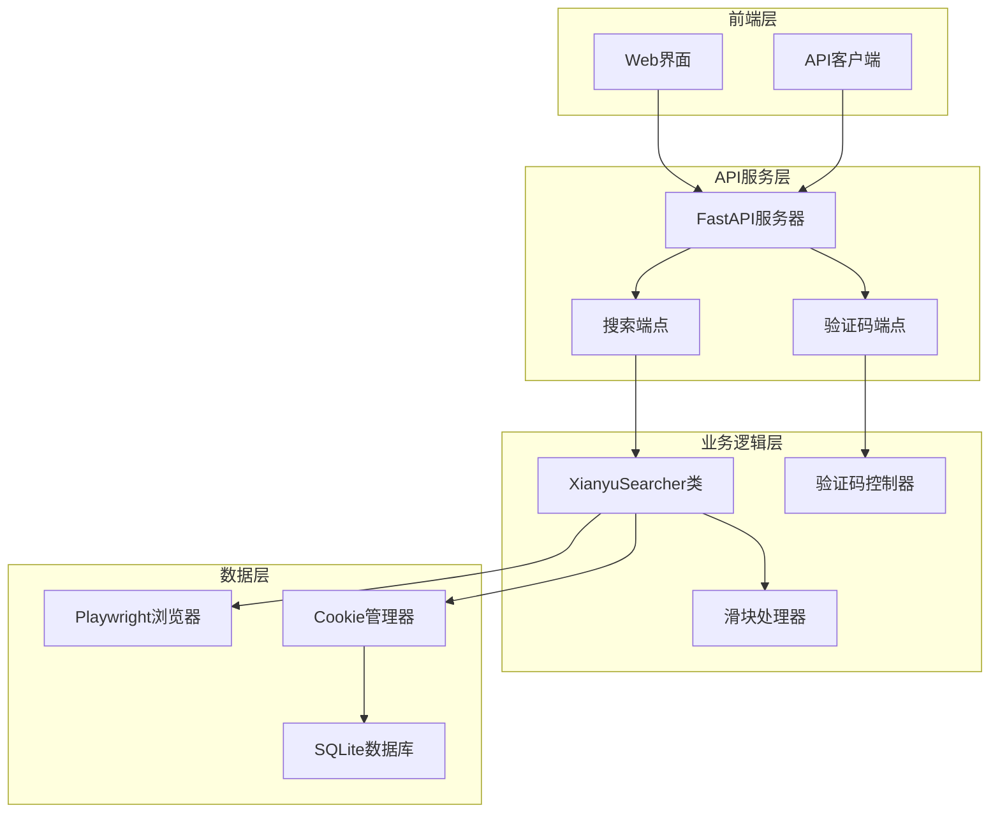

**图表来源**
- [reply_server.py](file://reply_server.py#L1-L50)
- [item_search.py](file://utils/item_search.py#L42-L80)

## 核心组件分析

### XianyuSearcher类设计

`XianyuSearcher`是系统的核心组件，负责执行闲鱼商品搜索的完整流程：

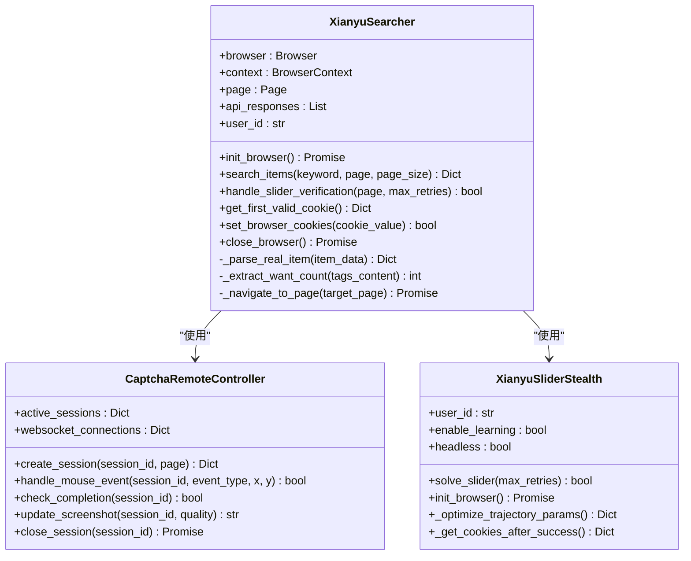

**图表来源**
- [item_search.py](file://utils/item_search.py#L42-L100)
- [captcha_remote_control.py](file://utils/captcha_remote_control.py#L14-L50)
- [xianyu_slider_stealth.py](file://utils/xianyu_slider_stealth.py#L244-L300)

**章节来源**
- [item_search.py](file://utils/item_search.py#L42-L100)

## 验证码处理机制

系统实现了双重验证码处理策略，能够智能识别并处理不同类型的验证码挑战。

### 刮刮乐验证码处理

刮刮乐验证码是最复杂的挑战类型，系统提供了两种处理方式：

#### 远程控制会话机制

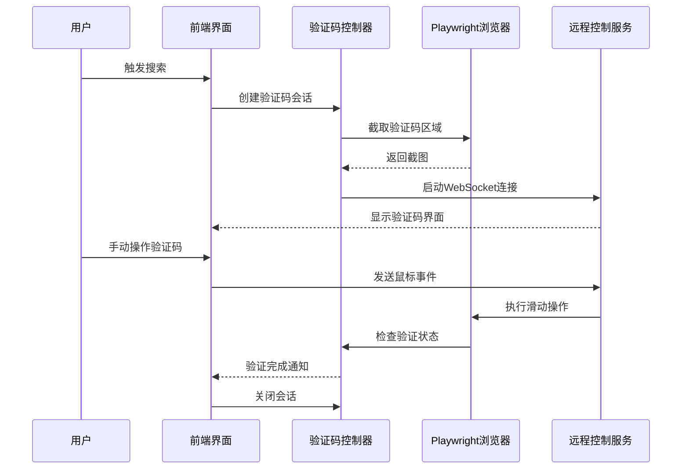

**图表来源**
- [captcha_remote_control.py](file://utils/captcha_remote_control.py#L17-L100)
- [api_captcha_remote.py](file://api_captcha_remote.py#L38-L150)

#### 异步滑块处理算法

对于普通滑块验证码，系统使用`XianyuSliderStealth`类实现智能轨迹生成：

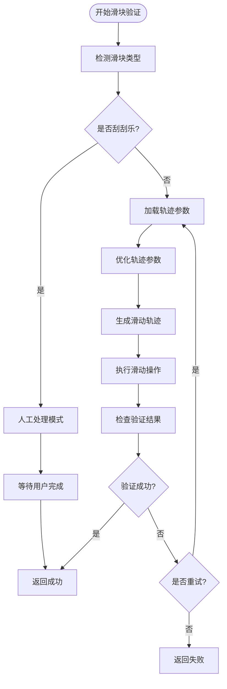

**图表来源**
- [item_search.py](file://utils/item_search.py#L411-L623)
- [xianyu_slider_stealth.py](file://utils/xianyu_slider_stealth.py#L244-L400)

**章节来源**
- [item_search.py](file://utils/item_search.py#L52-L150)
- [captcha_remote_control.py](file://utils/captcha_remote_control.py#L14-L100)

## 浏览器初始化与持久化

### launch_persistent_context机制

系统使用`launch_persistent_context`实现浏览器缓存持久化，这是提高效率的关键技术：

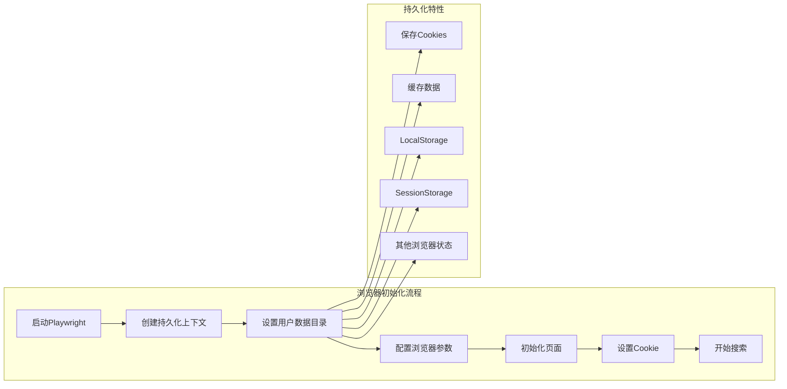

**图表来源**
- [item_search.py](file://utils/item_search.py#L685-L767)

### Cookie管理机制

系统通过数据库加载账号Cookie，实现自动登录：

| Cookie字段 | 描述 | 示例值 |
|-----------|------|--------|
| id | Cookie唯一标识 | "user123" |
| value | 完整Cookie字符串 | "cookie1=value1; cookie2=value2;" |
| user_id | 关联用户ID | 1 |
| auto_confirm | 自动确认状态 | 1 |
| remark | 备注信息 | "主账号" |
| pause_duration | 暂停时长 | 10 |

**章节来源**
- [item_search.py](file://utils/item_search.py#L634-L684)
- [db_manager.py](file://db_manager.py#L109-L148)

## API响应监听与数据解析

### mttop.taobao.idlemtopsearch.pc.search接口监听

系统通过Playwright的响应监听器捕获闲鱼搜索API的真实数据：

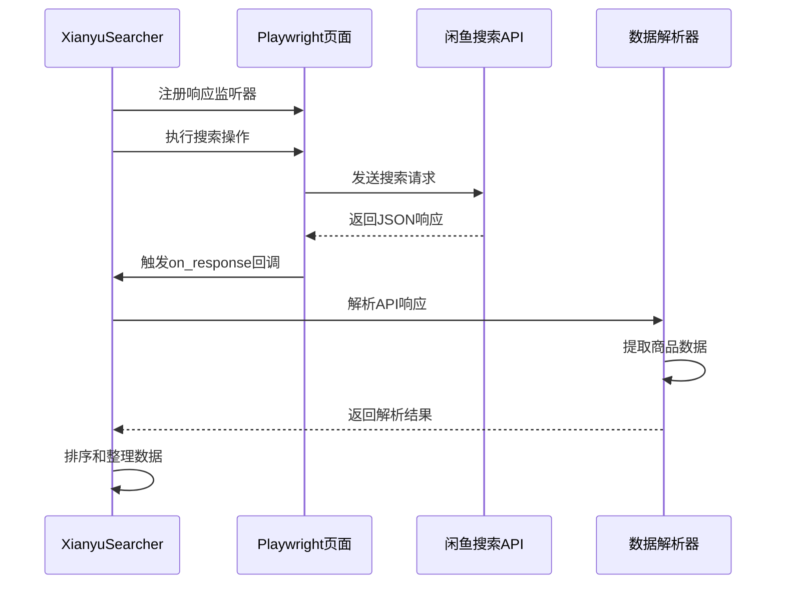

**图表来源**
- [item_search.py](file://utils/item_search.py#L800-L830)

### 数据解析与字段映射

系统将API响应解析为标准化的商品数据结构：

| 字段名称 | 数据源 | 类型 | 描述 |
|---------|--------|------|------|
| item_id | click_params.item_id | String | 商品唯一标识 |
| title | main_data.title | String | 商品标题 |
| price | main_data.price | String | 商品价格（带¥符号） |
| seller_name | main_data.userNickName | String | 卖家昵称 |
| item_url | main_data.targetUrl | String | 商品链接 |
| main_image | main_data.picUrl | String | 主图URL |
| publish_time | click_params.publishTime | String | 发布时间 |
| want_count | fish_tags_content | Integer | 想要人数 |
| area | main_data.area | String | 地区信息 |

**章节来源**
- [item_search.py](file://utils/item_search.py#L977-L1070)

## 搜索端点实现

### 单页搜索API

系统提供了RESTful API接口，支持关键词搜索和分页查询：

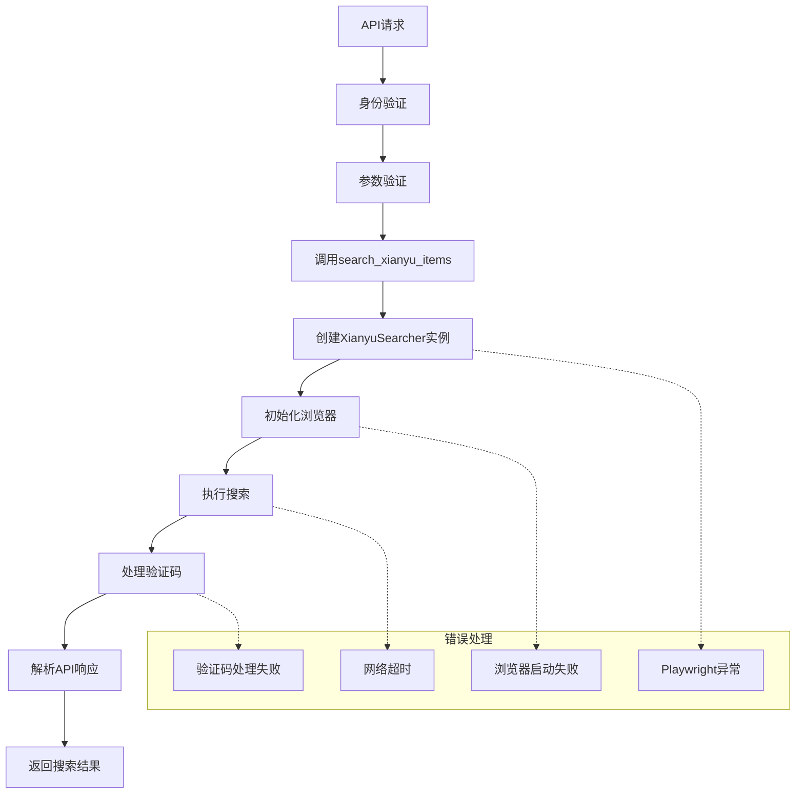

**图表来源**
- [reply_server.py](file://reply_server.py#L3980-L4030)

### 多页搜索功能

系统支持一次性获取多个页面的商品数据：

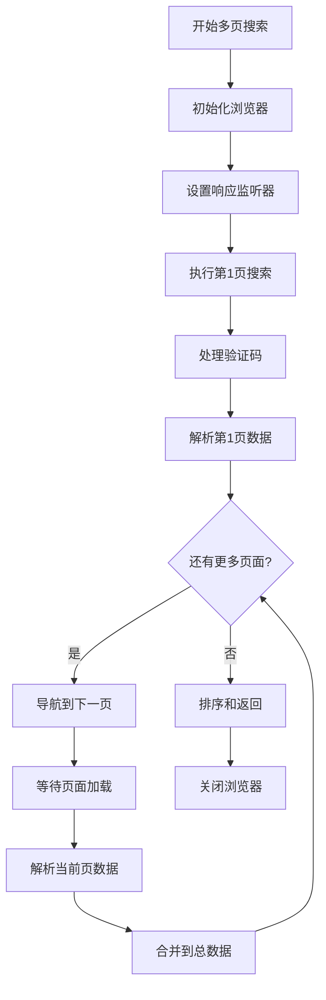

**图表来源**
- [item_search.py](file://utils/item_search.py#L1164-L1222)

**章节来源**
- [reply_server.py](file://reply_server.py#L3980-L4131)

## 容错机制与重试策略

### get_first_valid_cookie容错逻辑

系统实现了智能的Cookie选择机制：

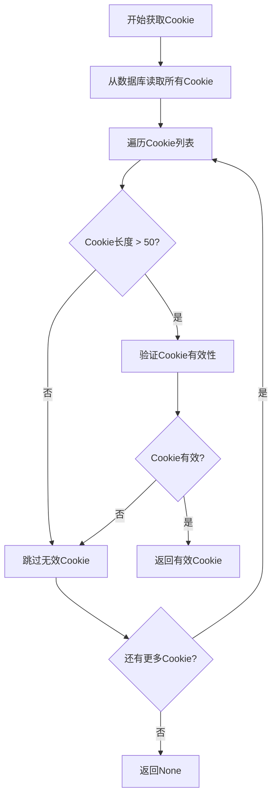

**图表来源**
- [item_search.py](file://utils/item_search.py#L634-L655)

### 搜索重试机制

系统在搜索过程中实现了多层次的重试策略：

| 重试层级 | 最大次数 | 重试条件 | 延迟时间 |
|---------|---------|---------|---------|
| 整体搜索 | 2次 | Playwright异常 | 5秒 |
| 滑块验证 | 5次 | 验证失败 | 动态 |
| 页面导航 | 3次 | 导航失败 | 2秒 |
| API请求 | 3次 | 网络超时 | 1秒 |

**章节来源**
- [item_search.py](file://utils/item_search.py#L1514-L1545)

## 性能优化与并发控制

### 并发管理机制

系统使用全局并发管理器控制滑块验证的并发数量：

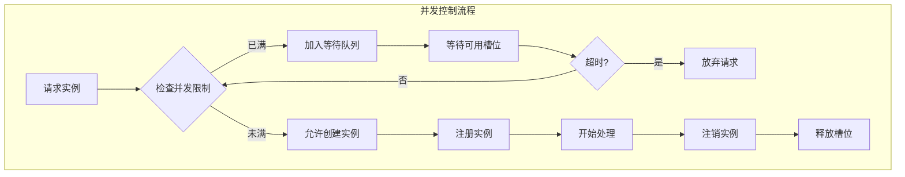

**图表来源**
- [xianyu_slider_stealth.py](file://utils/xianyu_slider_stealth.py#L34-L142)

### 轨迹学习与优化

`XianyuSliderStealth`类实现了智能轨迹学习机制：

| 优化维度 | 参数范围 | 学习策略 |
|---------|---------|---------|
| 总步数 | 110-130步 | 基于历史数据动态调整 |
| 延迟时间 | 0.020-0.030秒 | 标准差修正 |
| 抖动范围 | X: -3~12, Y: -2~12 | 固定范围优化 |
| 加速因子 | 8-15倍 | 慢启动优化 |
| 补全使用率 | 0-100% | 动态调整 |

**章节来源**
- [xianyu_slider_stealth.py](file://utils/xianyu_slider_stealth.py#L553-L646)

## 故障排除指南

### 常见问题与解决方案

#### Playwright相关问题

| 问题描述 | 可能原因 | 解决方案 |
|---------|---------|---------|
| 浏览器未安装 | Playwright未正确安装 | 运行`playwright install chromium` |
| 浏览器启动失败 | 权限不足或资源限制 | 检查Docker容器权限设置 |
| 执行文件不存在 | Playwright安装不完整 | 重新安装Playwright |
| 网络超时 | 网络连接不稳定 | 增加超时时间配置 |

#### 验证码处理问题

| 问题类型 | 症状 | 处理方式 |
|---------|------|---------|
| 刮刮乐验证码 | 需要人工干预 | 使用远程控制界面 |
| 普通滑块验证码 | 自动处理失败 | 调整重试参数 |
| 验证码识别失败 | 轨迹参数不准确 | 启用轨迹学习功能 |
| 会话超时 | 远程控制断开 | 检查WebSocket连接 |

#### 数据获取问题

| 问题场景 | 错误信息 | 解决策略 |
|---------|---------|---------|
| Cookie失效 | 登录状态丢失 | 更新有效Cookie |
| API限制 | 请求被拒绝 | 实施请求间隔 |
| 网络异常 | 响应超时 | 增加重试机制 |
| 数据解析失败 | 字段缺失 | 添加字段验证 |

**章节来源**
- [item_search.py](file://utils/item_search.py#L920-L935)

### 日志监控与调试

系统提供了详细的日志记录功能，支持不同级别的调试信息：

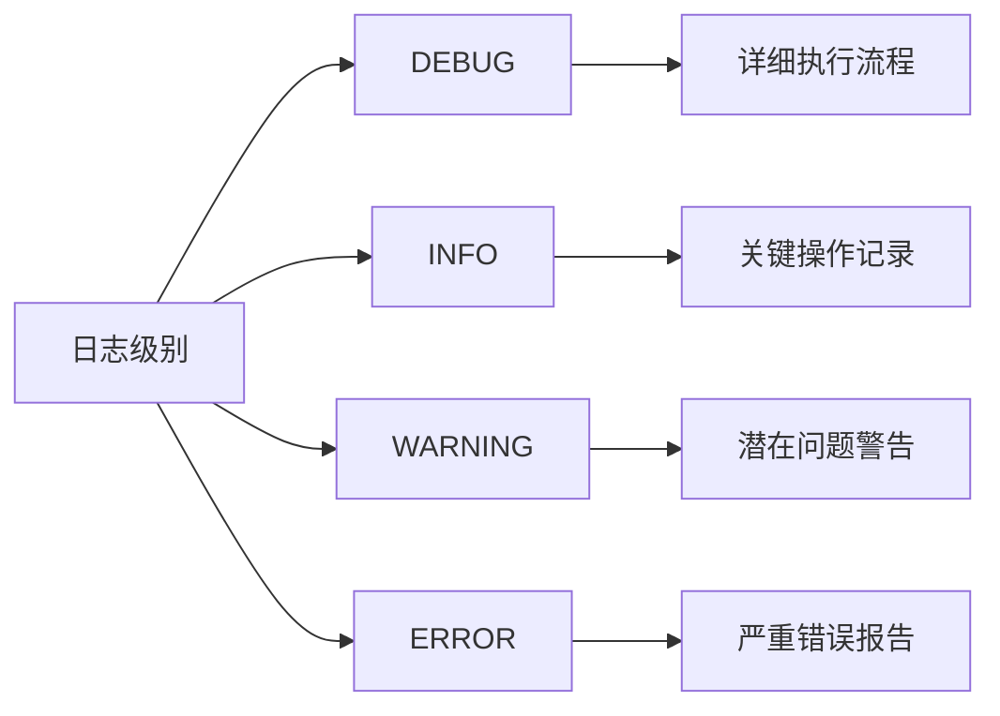

通过监控这些日志信息，可以快速定位和解决系统运行中的各种问题。