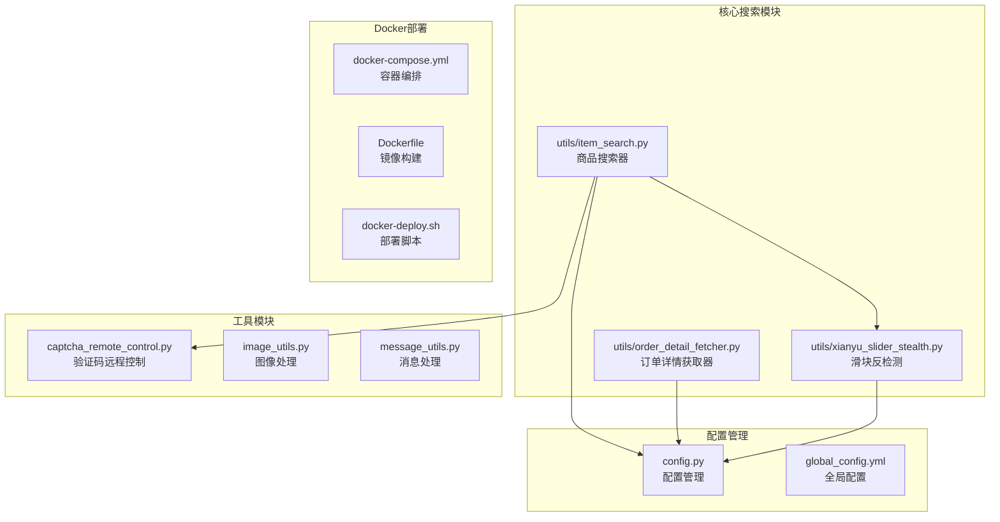
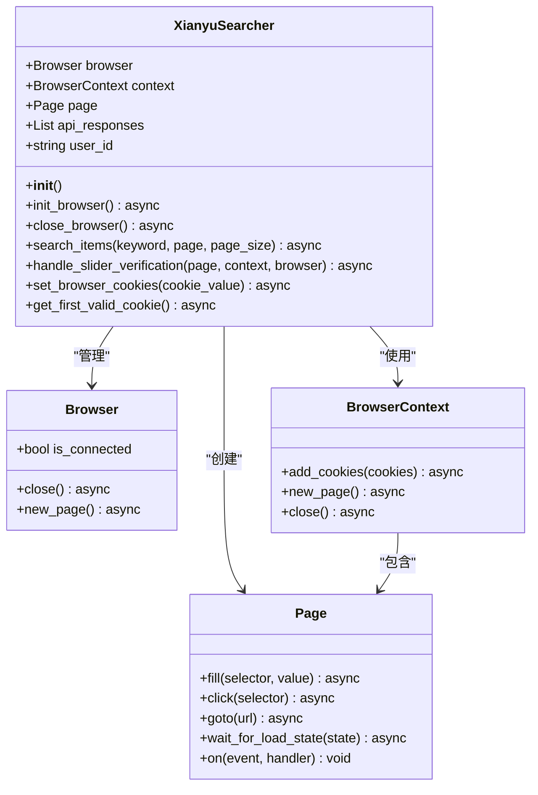
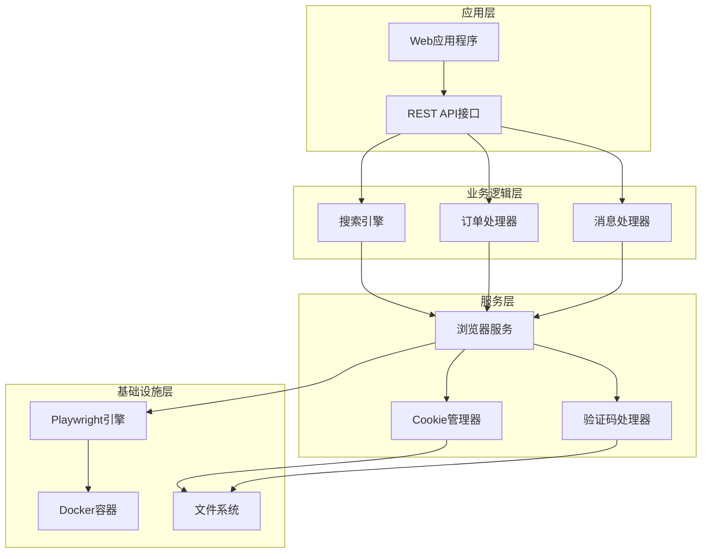
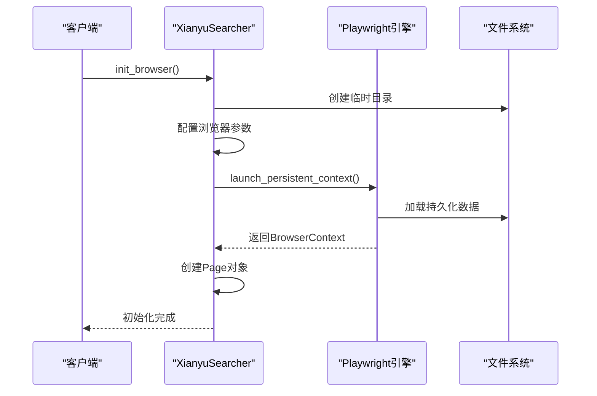
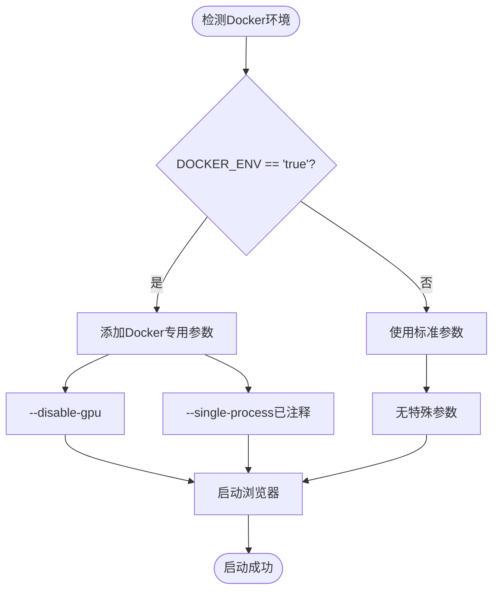
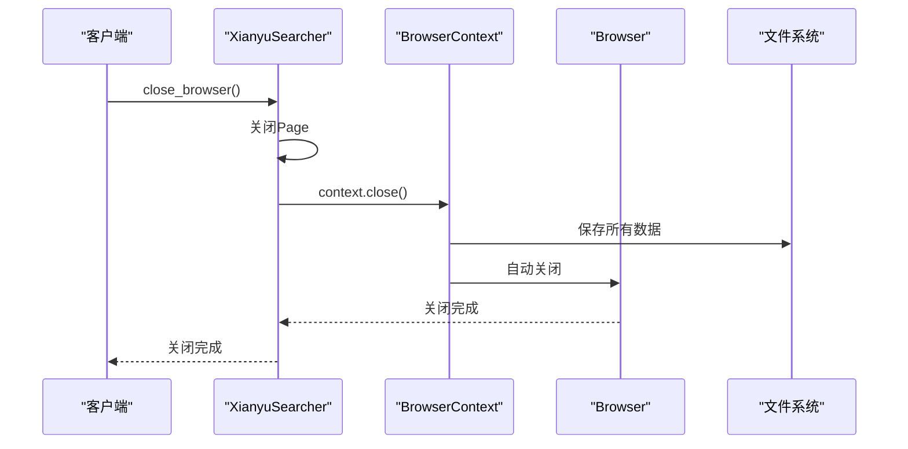
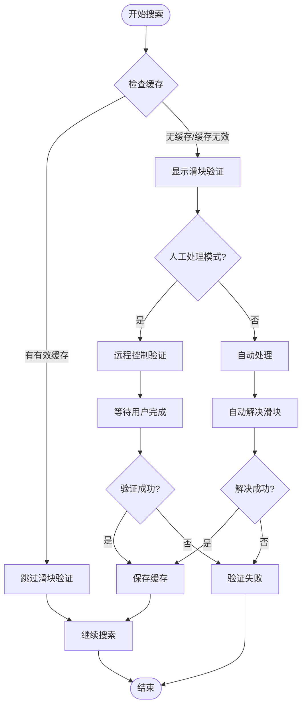
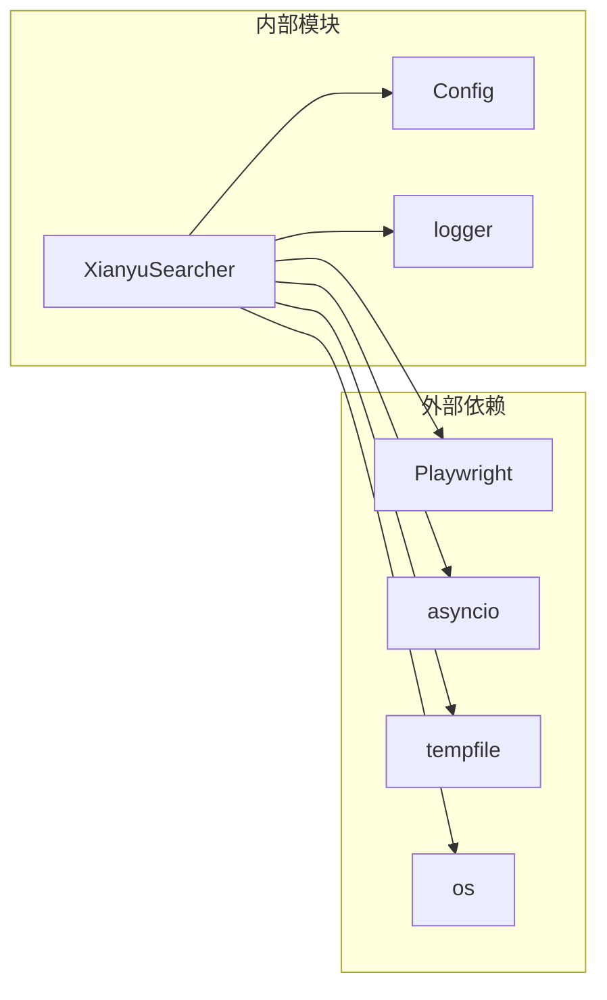

# 浏览器初始化与持久化缓存

<cite>
**本文档中引用的文件**
- [utils/item_search.py](file://utils/item_search.py)
- [config.py](file://config.py)
- [docker-compose.yml](file://docker-compose.yml)
- [Dockerfile](file://Dockerfile)
- [XianyuAutoAsync.py](file://XianyuAutoAsync.py)
</cite>

## 目录
1. [简介](#简介)
2. [项目结构概述](#项目结构概述)
3. [核心组件分析](#核心组件分析)
4. [架构概览](#架构概览)
5. [详细组件分析](#详细组件分析)
6. [依赖关系分析](#依赖关系分析)
7. [性能考虑](#性能考虑)
8. [故障排除指南](#故障排除指南)
9. [结论](#结论)

## 简介

本文档详细介绍了`XianyuSearcher.init_browser`方法的实现原理和最佳实践，重点说明了如何使用`launch_persistent_context`实现浏览器缓存持久化，避免重复出现滑块验证，并解释了Docker环境中的特殊配置。

该系统基于Playwright框架，通过持久化浏览器上下文实现了智能的缓存管理，使得用户只需在首次访问时处理滑块验证，后续搜索可以直接复用已保存的认证状态。

## 项目结构概述

该项目采用模块化设计，主要包含以下核心模块：

**图表来源**
- [utils/item_search.py](file://utils/item_search.py#L41-L1508)
- [config.py](file://config.py#L1-L126)
- [docker-compose.yml](file://docker-compose.yml#L1-L106)

**章节来源**
- [utils/item_search.py](file://utils/item_search.py#L41-L1508)
- [config.py](file://config.py#L1-L126)

## 核心组件分析

### XianyuSearcher类

`XianyuSearcher`类是整个系统的核心，负责管理浏览器实例和商品搜索功能：

**图表来源**
- [utils/item_search.py](file://utils/item_search.py#L41-L100)

**章节来源**
- [utils/item_search.py](file://utils/item_search.py#L41-L100)

## 架构概览

系统采用分层架构设计，从底层的浏览器管理到上层的商品搜索服务：

**图表来源**
- [utils/item_search.py](file://utils/item_search.py#L685-L747)
- [docker-compose.yml](file://docker-compose.yml#L1-L106)

## 详细组件分析

### init_browser方法详解

`init_browser`方法是系统的核心入口，负责初始化持久化浏览器上下文：

#### 方法签名与功能

**图表来源**
- [utils/item_search.py](file://utils/item_search.py#L685-L747)

#### 用户数据目录配置

`user_data_dir`参数是实现缓存持久化的关键：

| 参数 | 类型 | 描述 | 默认值 |
|------|------|------|--------|
| user_data_dir | string | 用户数据目录路径 | `tempfile.gettempdir()/xianyu_browser_cache` |
| 持久化内容 | 多种 | Cookies、缓存、LocalStorage、SessionStorage等 | 自动管理 |

#### 浏览器启动参数详解

系统针对不同环境配置了专门的启动参数：

| 参数 | 功能 | Docker环境特殊处理 |
|------|------|-------------------|
| `--no-sandbox` | 禁用沙盒模式 | 总是启用，确保容器内运行 |
| `--disable-setuid-sandbox` | 禁用setuid沙盒 | 总是启用，提高安全性 |
| `--disable-dev-shm-usage` | 避免/dev/shm使用 | 总是启用，防止内存不足 |
| `--disable-gpu` | 禁用GPU加速 | 仅在Docker环境启用 |
| `--single-process` | 单进程模式 | 注释掉，使用多进程提高稳定性 |

#### Docker环境特殊配置

**图表来源**
- [utils/item_search.py](file://utils/item_search.py#L713-L719)

#### 无头模式运行机制

系统采用无头模式运行，具有以下特点：

| 特性 | 描述 | 优势 |
|------|------|------|
| headless=True | 后台运行，不显示界面 | 提高性能，减少资源占用 |
| viewport设置 | 1280x720分辨率 | 模拟真实桌面环境 |
| locale设置 | zh-CN语言环境 | 确保中文界面显示 |
| user-agent | Windows Chrome 120 | 高度伪装真实浏览器 |

#### 上下文关闭机制

**图表来源**
- [utils/item_search.py](file://utils/item_search.py#L751-L767)

**章节来源**
- [utils/item_search.py](file://utils/item_search.py#L685-L767)

### 滑块验证处理机制

系统实现了智能的滑块验证处理，避免重复验证：

**图表来源**
- [utils/item_search.py](file://utils/item_search.py#L410-L622)

**章节来源**
- [utils/item_search.py](file://utils/item_search.py#L410-L622)

## 依赖关系分析

### 核心依赖关系

**图表来源**
- [utils/item_search.py](file://utils/item_search.py#L1-L30)
- [config.py](file://config.py#L1-L10)

### 环境变量依赖

| 环境变量 | 类型 | 描述 | 默认值 |
|----------|------|------|--------|
| DOCKER_ENV | string | Docker环境标识 | - |
| WEB_PORT | string | Web服务端口 | 8080 |
| TZ | string | 时区设置 | Asia/Shanghai |
| DB_PATH | string | 数据库路径 | /app/data/xianyu_data.db |

**章节来源**
- [docker-compose.yml](file://docker-compose.yml#L22-L60)
- [utils/item_search.py](file://utils/item_search.py#L713-L719)

## 性能考虑

### 内存优化策略

1. **持久化缓存管理**：通过`launch_persistent_context`避免重复下载资源
2. **上下文生命周期管理**：合理使用`init_browser`和`close_browser`配对
3. **Docker环境优化**：针对容器环境的内存和CPU限制进行了优化

### 并发处理

系统支持多个浏览器实例并发运行，每个实例都有独立的用户数据目录，避免数据冲突。

### 缓存策略

| 缓存类型 | 生命周期 | 存储位置 | 清理策略 |
|----------|----------|----------|----------|
| Cookies | 永久 | user_data_dir/Cookies | 手动清理 |
| 浏览器缓存 | 永久 | user_data_dir/Cache | 手动清理 |
| LocalStorage | 永久 | user_data_dir/Local State | 手动清理 |
| SessionStorage | 会话结束 | 内存 | 自动清理 |

## 故障排除指南

### 常见问题及解决方案

#### 1. 浏览器启动失败

**症状**：`BrowserType.launch`异常
**原因**：Playwright未正确安装或权限不足
**解决方案**：
- 在Docker容器中运行：`playwright install chromium`
- 检查Docker容器权限设置

#### 2. 滑块验证频繁出现

**症状**：每次搜索都需要重新处理滑块
**原因**：缓存数据损坏或过期
**解决方案**：
- 清理`user_data_dir`目录
- 检查网络连接稳定性
- 验证Cookie有效性

#### 3. Docker环境问题

**症状**：容器内浏览器无法正常工作
**原因**：缺少必要依赖或权限配置
**解决方案**：
- 确保安装了`playwright install-deps chromium`
- 检查Docker Compose配置中的环境变量
- 验证卷挂载权限

**章节来源**
- [utils/item_search.py](file://utils/item_search.py#L924-L935)
- [docker-compose.yml](file://docker-compose.yml#L1-L106)

## 结论

`XianyuSearcher.init_browser`方法通过`launch_persistent_context`实现了高效的浏览器缓存持久化机制。该设计具有以下优势：

1. **智能缓存管理**：通过持久化上下文避免重复滑块验证
2. **环境适配**：针对Docker环境进行了特殊优化
3. **资源高效利用**：合理的生命周期管理和内存优化
4. **易于维护**：清晰的代码结构和完善的错误处理

该系统为闲鱼商品搜索提供了稳定可靠的自动化解决方案，特别适合在容器化环境中部署和运行。