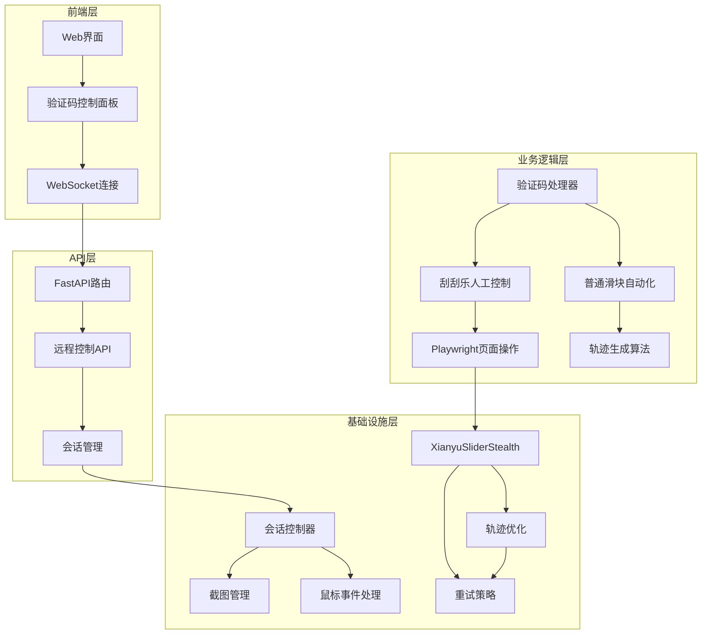
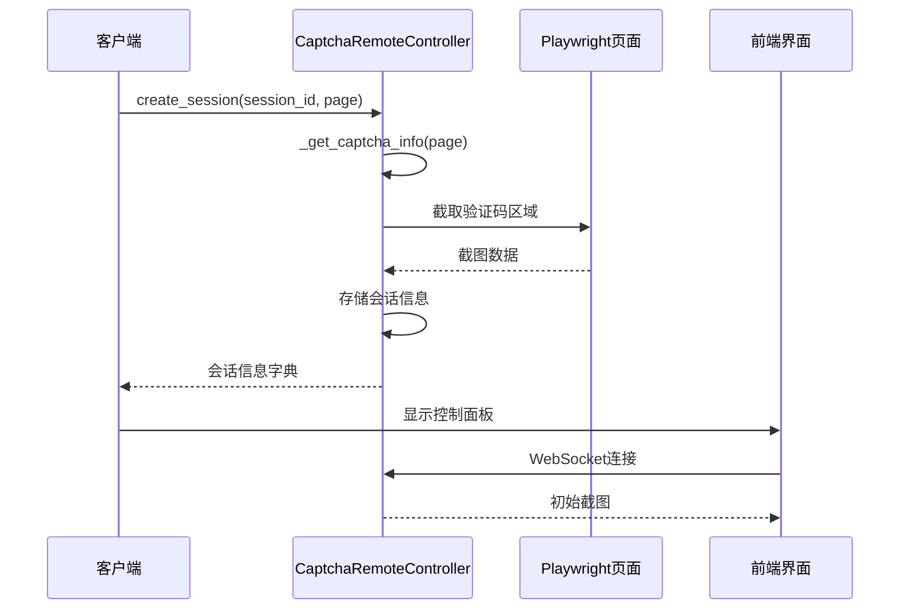
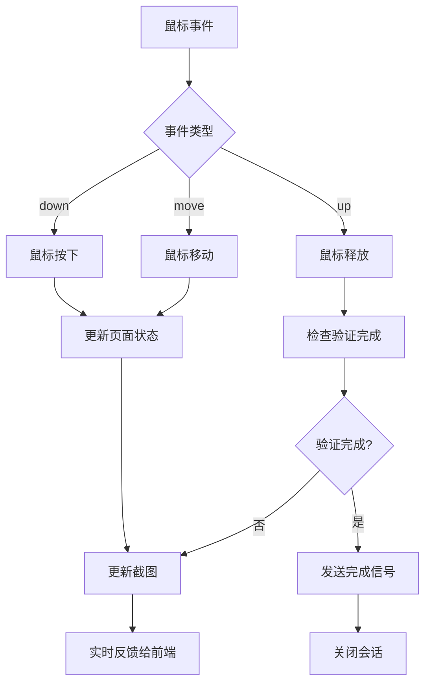
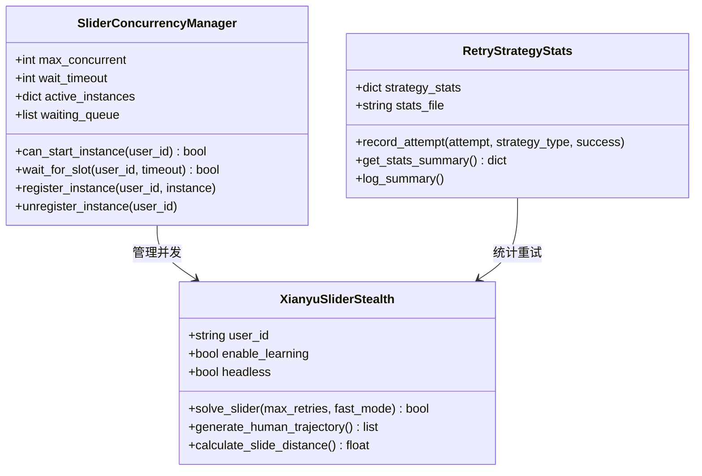
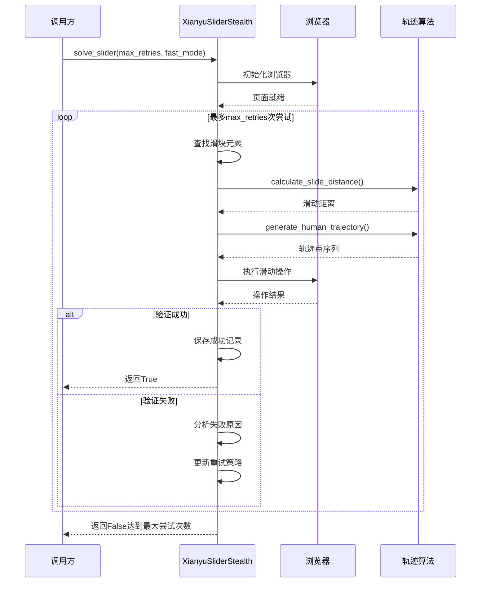
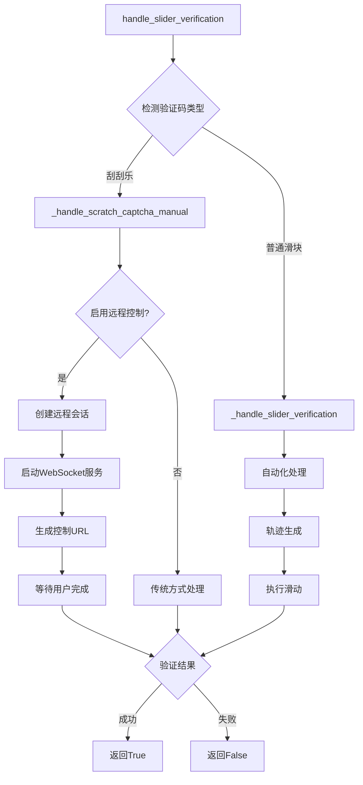
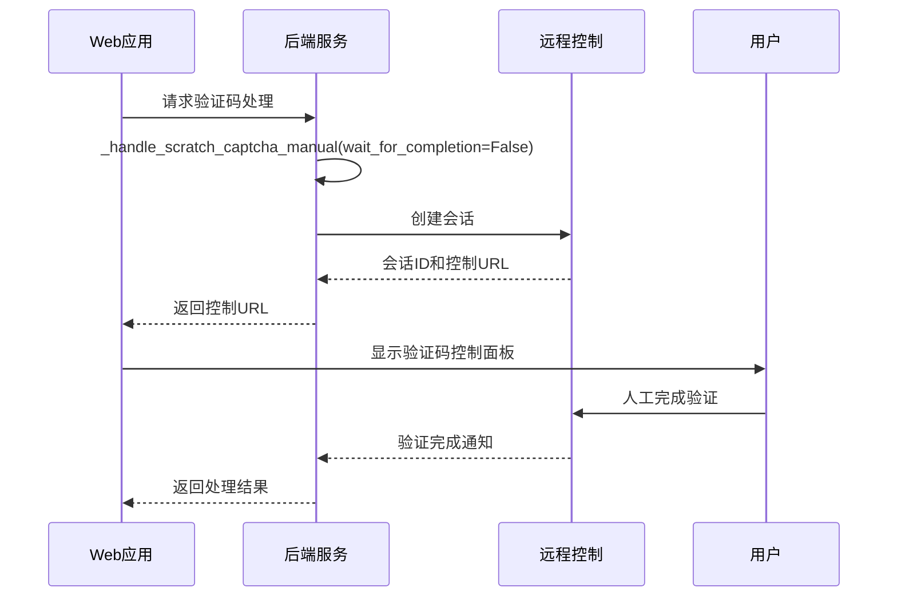
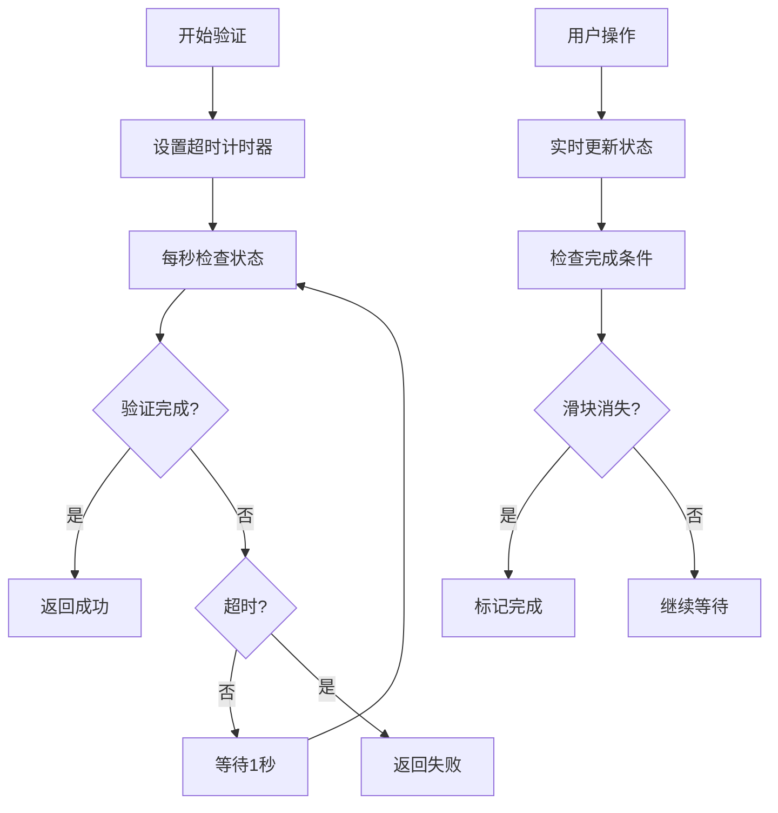
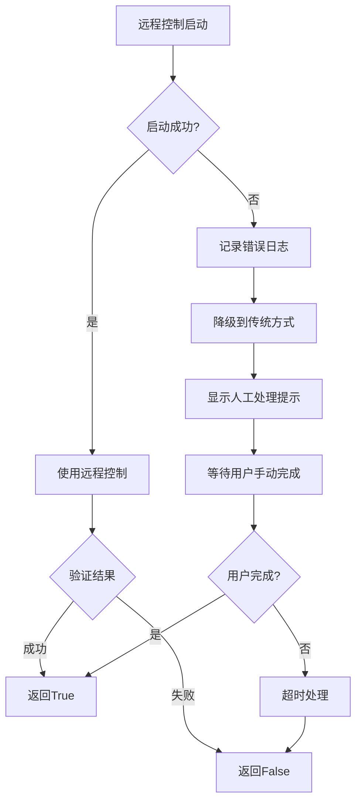
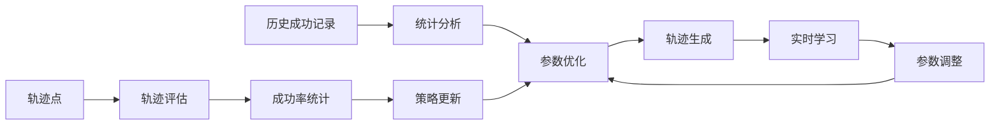

# 验证码处理策略

<cite>
**本文档中引用的文件**
- [utils/captcha_remote_control.py](file://utils/captcha_remote_control.py)
- [utils/xianyu_slider_stealth.py](file://utils/xianyu_slider_stealth.py)
- [api_captcha_remote.py](file://api_captcha_remote.py)
- [utils/item_search.py](file://utils/item_search.py)
- [utils/slider_patch.py](file://utils/slider_patch.py)
- [config.py](file://config.py)
- [captcha_control.html](file://captcha_control.html)
- [static/js/app.js](file://static/js/app.js)
</cite>

## 目录
1. [简介](#简介)
2. [系统架构概览](#系统架构概览)
3. [刮刮乐滑块的人工远程控制](#刮刮乐滑块的人工远程控制)
4. [普通滑块验证的自动化处理](#普通滑块验证的自动化处理)
5. [双重处理策略详解](#双重处理策略详解)
6. [前端集成与wait_for_completion参数](#前端集成与wait_for_completion参数)
7. [超时与重试机制](#超时与重试机制)
8. [容错处理流程](#容错处理流程)
9. [性能优化策略](#性能优化策略)
10. [总结](#总结)

## 简介

该系统实现了针对闲鱼平台滑块验证码的双重处理策略，结合了人工远程控制和自动化处理两种方式。这种设计既保证了高成功率，又提供了灵活的前端集成能力，特别适用于需要人工干预的刮刮乐验证场景。

## 系统架构概览

系统采用分层架构设计，包含以下核心组件：



**图表来源**
- [utils/captcha_remote_control.py](file://utils/captcha_remote_control.py#L14-L369)
- [utils/xianyu_slider_stealth.py](file://utils/xianyu_slider_stealth.py#L244-L800)
- [api_captcha_remote.py](file://api_captcha_remote.py#L1-L319)

## 刮刮乐滑块的人工远程控制

### CaptchaRemoteController核心功能

`CaptchaRemoteController`类是人工远程控制的核心组件，负责创建和管理远程控制会话。

#### 会话创建机制



**图表来源**
- [utils/captcha_remote_control.py](file://utils/captcha_remote_control.py#L21-L64)

#### 基于SERVER_HOST环境变量的控制URL生成逻辑

系统通过智能IP检测机制生成控制URL：

1. **环境变量优先级检测**：
   - 首先检查 `SERVER_HOST` 环境变量
   - 然后检查 `PUBLIC_IP` 环境变量
   - 如果未设置，尝试自动获取外网IP

2. **Docker环境适配**：
   - 检测内网IP地址（172.x.x.x 或 10.x.x.x）
   - 自动降级为 localhost 以确保本地访问

3. **URL构建规则**：
   ```
   http://{local_ip}:8000/api/captcha/control/{session_id}
   ```

**章节来源**
- [utils/item_search.py](file://utils/item_search.py#L70-L110)

### 鼠标事件处理与实时反馈

系统支持完整的鼠标事件处理，包括按下、移动和释放操作：



**图表来源**
- [utils/captcha_remote_control.py](file://utils/captcha_remote_control.py#L197-L238)

**章节来源**
- [utils/captcha_remote_control.py](file://utils/captcha_remote_control.py#L197-L238)

## 普通滑块验证的自动化处理

### XianyuSliderStealth类架构

`XianyuSliderStealth`类实现了高度智能化的滑块验证自动化处理：

#### 并发管理与重试策略



**图表来源**
- [utils/xianyu_slider_stealth.py](file://utils/xianyu_slider_stealth.py#L34-L143)
- [utils/xianyu_slider_stealth.py](file://utils/xianyu_slider_stealth.py#L146-L242)

#### solve_slider方法调用流程



**图表来源**
- [utils/xianyu_slider_stealth.py](file://utils/xianyu_slider_stealth.py#L2246-L2247)
- [utils/xianyu_slider_stealth.py](file://utils/xianyu_slider_stealth.py#L1890-L1916)

**章节来源**
- [utils/xianyu_slider_stealth.py](file://utils/xianyu_slider_stealth.py#L2246-L2247)

## 双重处理策略详解

### 主要处理入口点

系统通过统一的入口点协调两种处理策略：



**图表来源**
- [utils/item_search.py](file://utils/item_search.py#L410-L415)
- [utils/slider_patch.py](file://utils/slider_patch.py#L166-L177)

### 智能验证码类型识别

系统具备精确的验证码类型识别能力：

1. **刮刮乐特征检测**：
   - 检测 `scratch-captcha` 相关关键词
   - 分析页面HTML结构特征
   - 识别刮刮乐特有的交互模式

2. **普通滑块识别**：
   - 检测标准滑块元素（如 `#nc_1_n1z`）
   - 识别滑块轨道和按钮组合
   - 区分不同平台的滑块样式

**章节来源**
- [utils/item_search.py](file://utils/item_search.py#L52-L551)

## 前端集成与wait_for_completion参数

### wait_for_completion参数的作用

`wait_for_completion`参数是前端集成的关键控制开关：

#### 参数值对行为的影响

| 参数值 | 行为描述 | 适用场景 |
|--------|----------|----------|
| `True` | 等待用户完成验证后返回 | 直接处理模式，适合后台任务 |
| `False` | 创建会话后立即返回 | 前端集成模式，适合Web应用 |

#### 前端集成流程



**图表来源**
- [utils/item_search.py](file://utils/item_search.py#L121-L125)
- [static/js/app.js](file://static/js/app.js#L11584-L11635)

**章节来源**
- [utils/item_search.py](file://utils/item_search.py#L52-L59)

## 超时与重试机制

### 180秒超时设计

系统采用180秒（3分钟）的超时机制，平衡用户体验和处理效率：



**图表来源**
- [utils/item_search.py](file://utils/item_search.py#L129-L149)

### 重试策略与退化机制

#### 多层次重试策略

1. **滑块查找重试**：
   - 最多重试15次
   - 每次间隔0.3-0.5秒
   - 逐步增加超时时间

2. **页面刷新重试**：
   - 检测到滑块不可见时自动刷新
   - 最多重试3次
   - 使用递归调用避免无限循环

3. **远程控制降级**：
   - 远程控制失败时自动降级
   - 切换到传统人工处理方式
   - 记录降级原因用于优化

**章节来源**
- [utils/item_search.py](file://utils/item_search.py#L156-L157)
- [utils/slider_patch.py](file://utils/slider_patch.py#L353-L359)

## 容错处理流程

### 远程控制失败的降级处理

当远程控制功能不可用时，系统自动切换到传统处理方式：



**图表来源**
- [utils/item_search.py](file://utils/item_search.py#L152-L157)

### 错误恢复与状态清理

系统实现了完善的错误恢复机制：

1. **会话清理**：
   - 验证完成后自动清理会话
   - 超时情况下强制关闭会话
   - WebSocket连接异常时的安全关闭

2. **资源释放**：
   - 浏览器实例的正确关闭
   - 临时文件的清理
   - 内存占用的及时释放

**章节来源**
- [utils/item_search.py](file://utils/item_search.py#L148-L150)
- [utils/captcha_remote_control.py](file://utils/captcha_remote_control.py#L328-L332)

## 性能优化策略

### 截图优化与实时更新

系统采用智能截图策略提升性能：

1. **区域截图**：
   - 只截取验证码容器区域
   - 减少50%以上的传输数据量
   - 提升前端渲染速度

2. **动态质量调整**：
   - 操作时使用低质量JPEG（30%）
   - 完成后使用高质量JPEG（80%）
   - 平衡清晰度和性能

3. **自适应刷新频率**：
   - 空闲时降低刷新频率至1秒
   - 活动时保持0.5秒间隔
   - 减少CPU和网络负载

### 轨迹优化与学习机制

XianyuSliderStealth类实现了基于历史数据的轨迹优化：



**图表来源**
- [utils/xianyu_slider_stealth.py](file://utils/xianyu_slider_stealth.py#L553-L646)

**章节来源**
- [utils/captcha_remote_control.py](file://utils/captcha_remote_control.py#L160-L191)
- [utils/xianyu_slider_stealth.py](file://utils/xianyu_slider_stealth.py#L553-L646)

## 总结

该验证码处理系统通过双重策略设计，实现了高成功率和灵活的前端集成能力：

### 核心优势

1. **双重保障**：人工远程控制+自动化处理，确保验证成功率
2. **智能识别**：精确区分刮刮乐和普通滑块验证
3. **灵活集成**：支持同步和异步两种处理模式
4. **容错性强**：完善的降级和恢复机制
5. **性能优化**：智能截图和轨迹优化策略

### 技术创新点

- 基于环境变量的智能URL生成
- 实时WebSocket反馈机制  
- 基于历史数据的轨迹学习
- 多层次的重试和超时处理
- 完善的状态管理和资源清理

这套验证码处理策略为闲鱼平台的自动化操作提供了可靠的技术支撑，同时保持了良好的用户体验和系统稳定性。