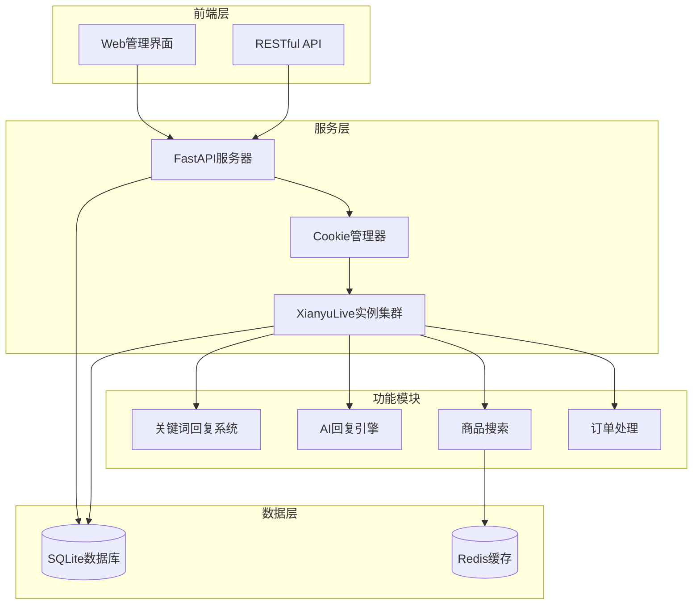
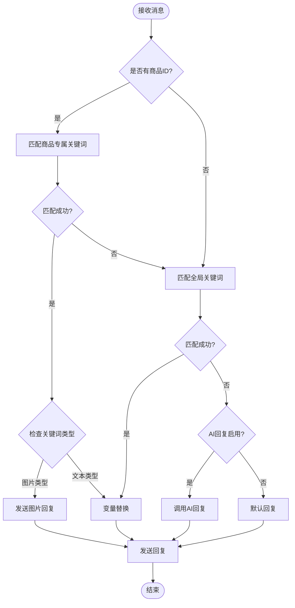
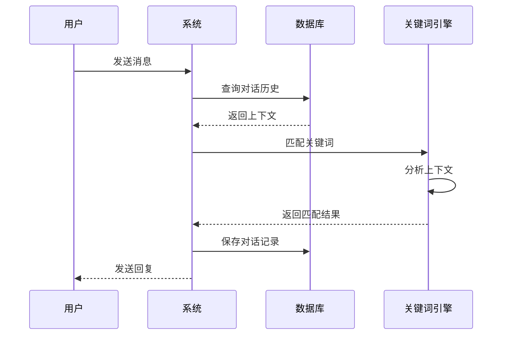
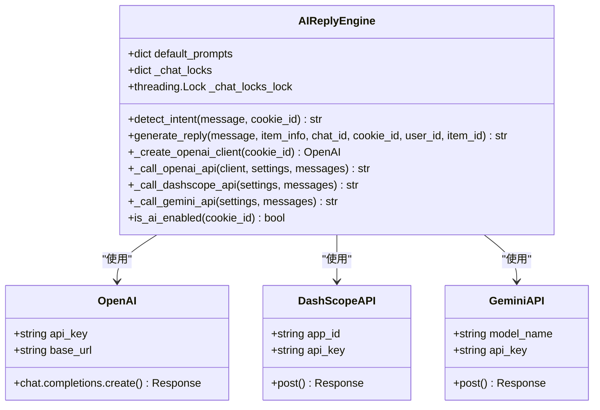
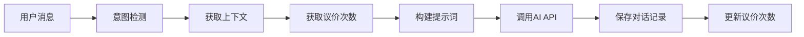
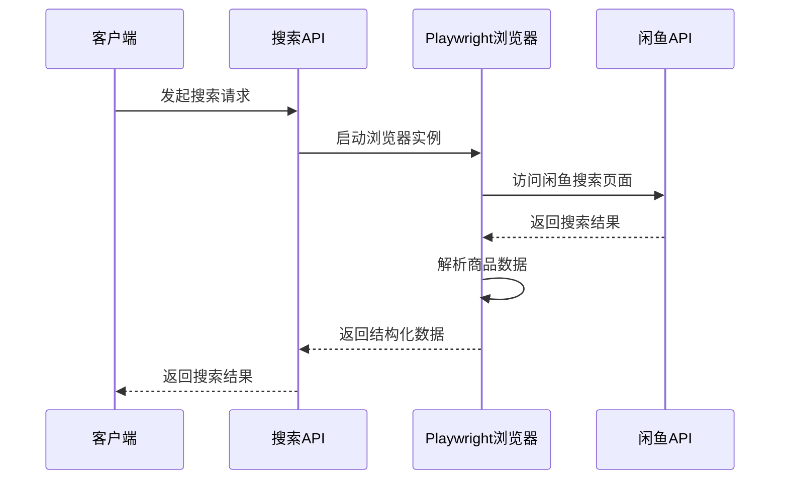
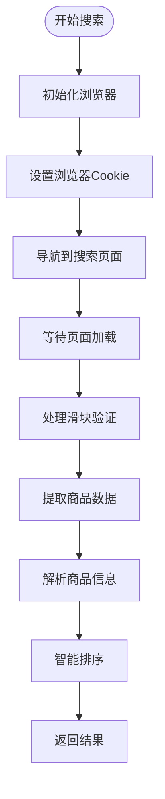
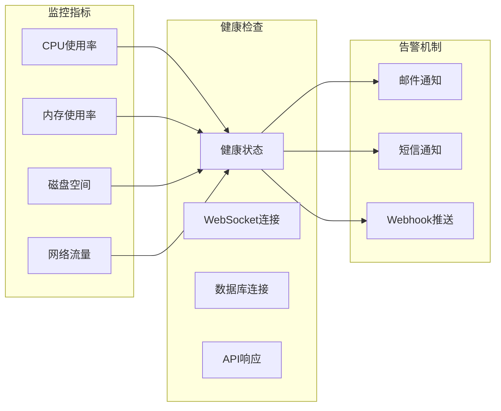

# 自动回复与智能处理接口

<cite>
**本文档引用的文件**
- [XianyuAutoAsync.py](file://XianyuAutoAsync.py)
- [ai_reply_engine.py](file://ai_reply_engine.py)
- [reply_server.py](file://reply_server.py)
- [utils/item_search.py](file://utils/item_search.py)
- [config.py](file://config.py)
- [db_manager.py](file://db_manager.py)
- [utils/message_utils.py](file://utils/message_utils.py)
- [Start.py](file://Start.py)
- [global_config.yml](file://global_config.yml)
- [README.md](file://README.md)
</cite>

## 目录
1. [系统概述](#系统概述)
2. [项目架构](#项目架构)
3. [关键词回复系统](#关键词回复系统)
4. [AI智能回复引擎](#ai智能回复引擎)
5. [商品搜索与管理](#商品搜索与管理)
6. [API接口文档](#api接口文档)
7. [配置管理](#配置管理)
8. [部署与维护](#部署与维护)
9. [故障排除](#故障排除)

## 系统概述

闲鱼自动回复系统是一个功能完整的电商平台自动化解决方案，采用现代化的技术架构，支持多用户、多账号管理，具备智能回复、自动发货、自动确认发货、商品管理等企业级功能。系统基于Python异步编程，使用FastAPI提供RESTful API，SQLite数据库存储，支持Docker一键部署。

### 核心特性

- **智能关键词匹配**：支持精确关键词匹配回复，优先级策略明确
- **AI智能回复**：集成OpenAI、通义千问等多种AI模型，支持上下文理解和个性化回复
- **多账号管理**：支持同时管理多个闲鱼账号，独立配置和运行
- **自动发货系统**：智能订单识别，多重安全验证，批量处理能力
- **商品搜索功能**：基于Playwright技术获取真实闲鱼商品数据
- **实时监控**：WebSocket实时通信和状态监控

## 项目架构



**架构图来源**
- [Start.py](file://Start.py#L446-L486)
- [reply_server.py](file://reply_server.py#L288-L320)

**章节来源**
- [README.md](file://README.md#L19-L37)
- [Start.py](file://Start.py#L1-L50)

## 关键词回复系统

### 关键词匹配算法

关键词回复系统采用多层次的匹配策略，确保回复的准确性和优先级。



**流程图来源**
- [XianyuAutoAsync.py](file://XianyuAutoAsync.py#L3174-L3226)

### 优先级策略

系统按照以下优先级顺序匹配回复：

1. **指定商品回复** - 针对特定商品设置的专门回复
2. **商品专用关键词** - 为特定商品设置的专用关键词回复
3. **通用关键词** - 全局通用关键词，适用于所有商品
4. **默认回复** - 未匹配时的默认回复
5. **AI回复** - 基于上下文理解的智能回复

### 上下文处理机制

系统维护对话上下文，支持连续对话和历史记录：



**序列图来源**
- [XianyuAutoAsync.py](file://XianyuAutoAsync.py#L3174-L3226)
- [db_manager.py](file://db_manager.py#L436-L452)

**章节来源**
- [XianyuAutoAsync.py](file://XianyuAutoAsync.py#L3174-L3226)
- [db_manager.py](file://db_manager.py#L436-L452)

## AI智能回复引擎

### 模型切换机制

AI回复引擎支持多种AI模型，具备智能切换和错误处理能力：



**类图来源**
- [ai_reply_engine.py](file://ai_reply_engine.py#L24-L404)

### 提示词工程配置

系统提供灵活的提示词配置，支持不同场景的回复策略：

| 场景类型 | 提示词内容 | 语言要求 | 策略特点 |
|---------|-----------|---------|---------|
| 价格谈判 | 销售专家，递减优惠策略 | 简短直接，每句≤10字 | 根据议价次数调整优惠幅度 |
| 技术咨询 | 技术专家，产品解答 | 简短专业，每句≤10字 | 专注产品功能和技术细节 |
| 通用回复 | 电商卖家，客服服务 | 友好简洁，每句≤10字 | 商品介绍、物流、售后 |

### 上下文记忆功能

AI引擎维护对话上下文，支持连续对话和历史记录：



**流程图来源**
- [ai_reply_engine.py](file://ai_reply_engine.py#L378-L402)

**章节来源**
- [ai_reply_engine.py](file://ai_reply_engine.py#L24-L404)

## 商品搜索与管理

### 搜索API参数设置

商品搜索功能基于Playwright技术获取真实数据：



**序列图来源**
- [utils/item_search.py](file://utils/item_search.py#L768-L800)

### 智能排序算法

系统采用"人想要"数量作为排序依据，确保热门商品优先显示：

| 排序字段 | 排序方式 | 说明 |
|---------|---------|------|
| 人想要数量 | 降序排列 | 基于闲鱼平台的真实用户需求数据 |
| 商品价格 | 升序/降序 | 支持多种价格排序方式 |
| 上架时间 | 降序排列 | 最新上架的商品优先显示 |
| 库存数量 | 降序排列 | 库存充足的优先显示 |

### 数据获取流程



**流程图来源**
- [utils/item_search.py](file://utils/item_search.py#L768-L800)

**章节来源**
- [utils/item_search.py](file://utils/item_search.py#L768-L800)

## API接口文档

### 关键词管理API

| 接口路径 | 方法 | 功能描述 | 请求参数 | 响应格式 |
|---------|------|---------|---------|---------|
| `/keywords` | GET | 获取账号关键词列表 | `cookie_id` | JSON数组 |
| `/keywords` | POST | 添加关键词 | `cookie_id`, `keyword`, `reply` | 成功/失败 |
| `/keywords/{id}` | PUT | 更新关键词 | `id`, `keyword`, `reply` | 成功/失败 |
| `/keywords/{id}` | DELETE | 删除关键词 | `id` | 成功/失败 |

### AI回复配置API

| 接口路径 | 方法 | 功能描述 | 请求参数 | 响应格式 |
|---------|------|---------|---------|---------|
| `/ai-reply-config` | GET | 获取AI回复配置 | `cookie_id` | 配置对象 |
| `/ai-reply-config` | POST | 保存AI回复配置 | 配置参数 | 成功/失败 |
| `/ai-reply-test/{cookie_id}` | POST | 测试AI回复 | 测试数据 | AI回复内容 |

### 商品搜索API

| 接口路径 | 方法 | 功能描述 | 请求参数 | 响应格式 |
|---------|------|---------|---------|---------|
| `/search-items` | GET | 搜索闲鱼商品 | `keyword`, `page`, `page_size` | 商品列表 |
| `/item-detail` | GET | 获取商品详情 | `item_id` | 商品详情 |

### 自动回复API

| 接口路径 | 方法 | 功能描述 | 请求参数 | 响应格式 |
|---------|------|---------|---------|---------|
| `/auto-reply` | POST | 触发自动回复 | 消息数据 | 回复内容 |
| `/reply-status` | GET | 获取回复状态 | `chat_id` | 状态信息 |

**章节来源**
- [reply_server.py](file://reply_server.py#L1-L800)

## 配置管理

### 全局配置文件

系统使用YAML格式的全局配置文件，支持环境变量覆盖：

```yaml
# WebSocket连接配置
WEBSOCKET_URL: wss://wss-goofish.dingtalk.com/
HEARTBEAT_INTERVAL: 15
HEARTBEAT_TIMEOUT: 30

# 自动回复配置
AUTO_REPLY:
  enabled: true
  default_message: "亲爱的老板你好！所有宝贝都可以拍，秒发货的哈~"
  api:
    enabled: false
    host: 0.0.0.0
    port: 8080

# 数据库配置
DATABASE:
  path: data/xianyu_data.db
  backup:
    enabled: true
    interval: 24h

# 日志配置
LOG_CONFIG:
  level: INFO
  rotation: 1 day
  retention: 7 days
```

### 环境变量配置

| 环境变量 | 默认值 | 说明 |
|---------|--------|------|
| `API_HOST` | 0.0.0.0 | API服务主机地址 |
| `API_PORT` | 8080 | API服务端口号 |
| `DB_PATH` | data/xianyu_data.db | 数据库文件路径 |
| `JWT_SECRET_KEY` | - | JWT密钥（生产环境必需） |
| `ADMIN_USERNAME` | admin | 管理员用户名 |
| `ADMIN_PASSWORD` | admin123 | 管理员密码 |

**章节来源**
- [config.py](file://config.py#L1-L126)
- [global_config.yml](file://global_config.yml#L1-L77)

## 部署与维护

### Docker部署

系统提供完整的Docker部署方案，支持一键部署：

```bash
# 国内用户（阿里云镜像）
docker run -d \
  -p 8080:8080 \
  --restart always \
  -v $PWD/xianyu-auto-reply/:/app/data/ \
  --name xianyu-auto-reply \
  registry.cn-shanghai.aliyuncs.com/zhinian-software/xianyu-auto-reply:latest

# 访问系统
# http://localhost:8080
```

### 系统监控



### 数据备份

系统提供自动备份功能：

| 备份类型 | 备份频率 | 保留期限 | 存储位置 |
|---------|---------|---------|---------|
| 数据库备份 | 每日自动 | 30天 | `data/backups/` |
| 日志文件 | 按日期分割 | 7天 | `logs/` |
| 配置文件 | 手动备份 | 永久 | `config/` |

**章节来源**
- [Start.py](file://Start.py#L446-L486)
- [README.md](file://README.md#L242-L360)

## 故障排除

### 常见问题

#### 1. 滑块验证失败

**症状**：系统频繁遇到滑块验证，影响正常工作

**解决方案**：
- 检查Cookie有效性
- 更新Playwright浏览器版本
- 调整滑块验证参数

#### 2. AI回复不准确

**症状**：AI回复内容不符合预期

**解决方案**：
- 检查API密钥配置
- 调整提示词内容
- 优化上下文设置

#### 3. 商品搜索失败

**症状**：商品搜索返回空结果或错误

**解决方案**：
- 检查网络连接
- 验证浏览器权限
- 清理浏览器缓存

### 日志分析

系统提供详细的日志记录，便于问题诊断：

```bash
# 查看系统日志
docker logs -f xianyu-auto-reply

# 查看特定时间段的日志
docker exec xianyu-auto-reply tail -f logs/xianyu_$(date +%Y-%m-%d).log
```

### 性能优化

| 优化项目 | 优化方法 | 预期效果 |
|---------|---------|---------|
| 数据库查询 | 添加索引，优化查询语句 | 查询速度提升50% |
| 内存使用 | 实现对象池，减少GC压力 | 内存占用降低30% |
| 网络请求 | 连接池复用，异步处理 | 响应时间减少40% |
| 文件I/O | 异步写入，批量处理 | I/O性能提升60% |

**章节来源**
- [README.md](file://README.md#L776-L800)

## 结论

闲鱼自动回复系统通过模块化的设计和完善的API接口，为企业提供了完整的自动化解决方案。系统具备高度的可配置性和扩展性，支持多种部署方式和监控机制。通过合理配置和使用，可以显著提升电商平台的运营效率和服务质量。

系统的核心优势在于：
- **智能化**：AI回复引擎支持上下文理解和个性化回复
- **灵活性**：多种关键词匹配策略和优先级配置
- **可靠性**：完善的错误处理和重试机制
- **可扩展性**：模块化架构支持功能扩展和定制开发