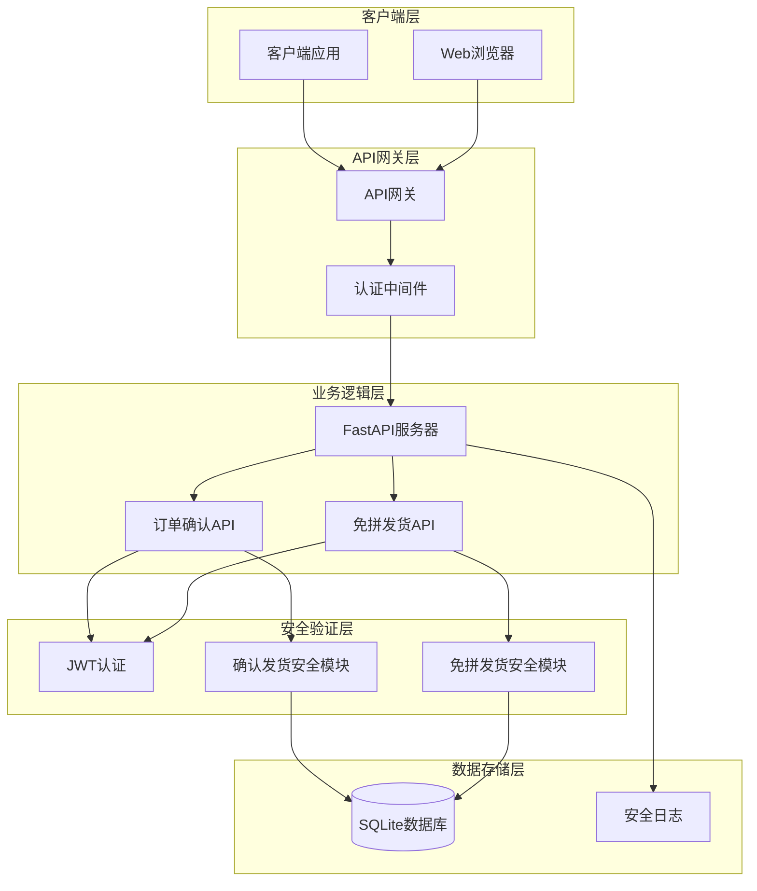
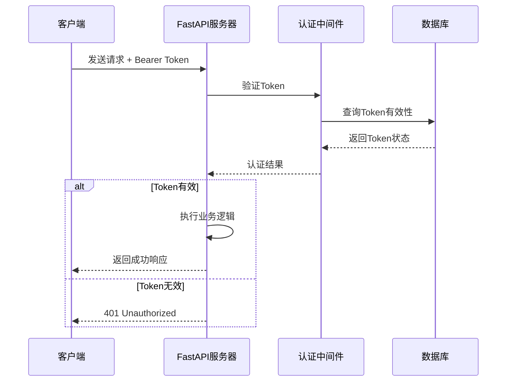
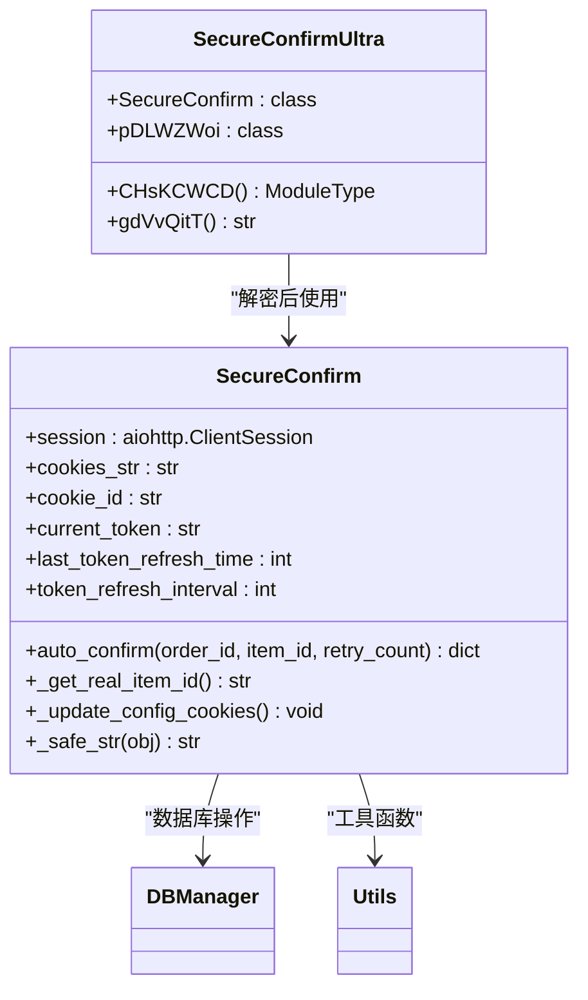
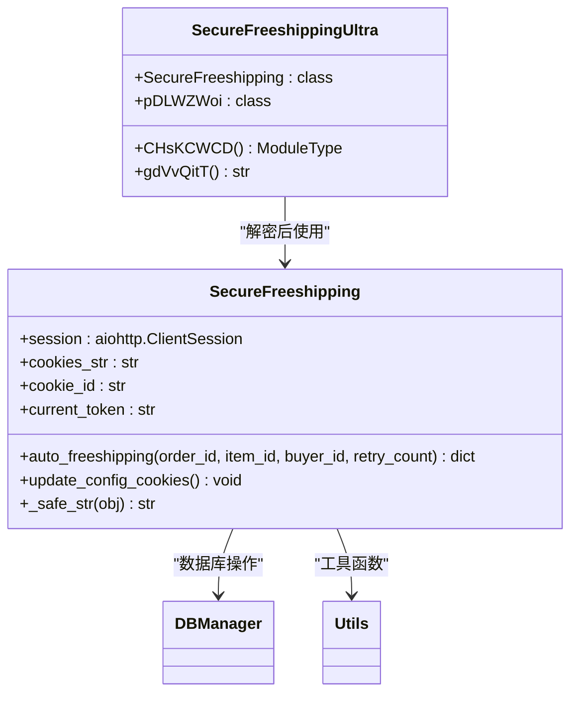
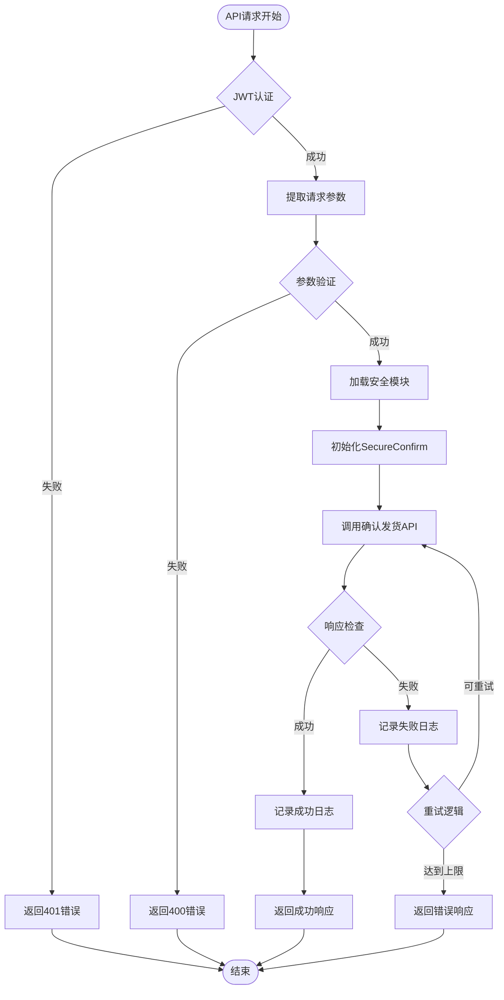
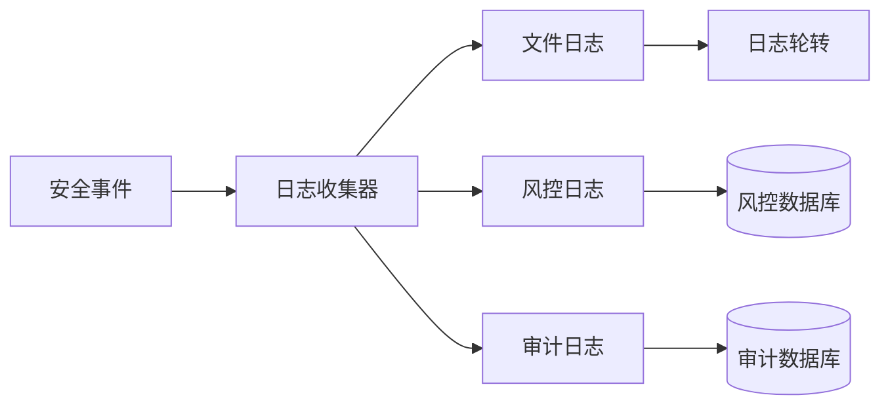
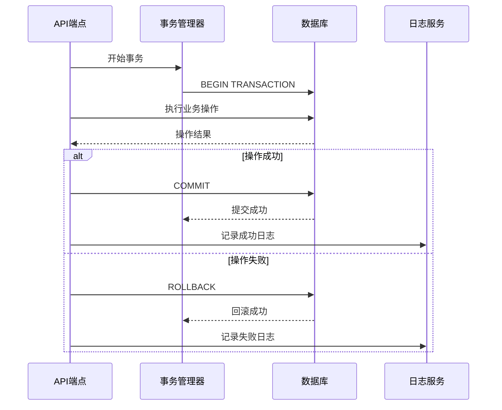
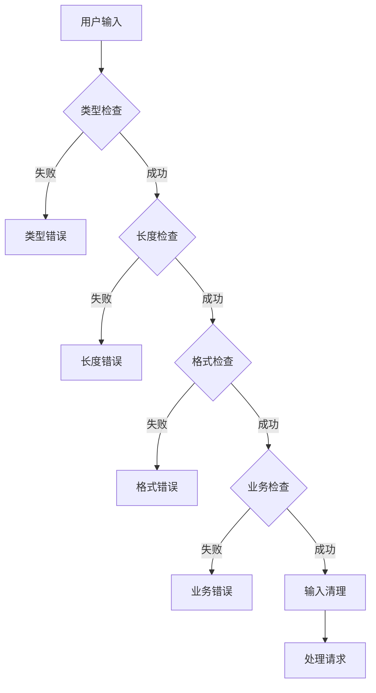
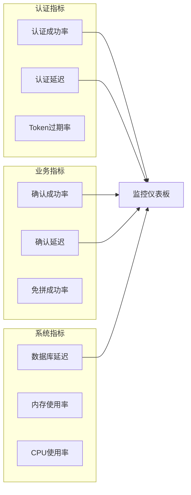

# API接口安全集成

<cite>
**本文档引用的文件**
- [reply_server.py](file://reply_server.py)
- [secure_confirm_ultra.py](file://secure_confirm_ultra.py)
- [secure_freeshipping_ultra.py](file://secure_freeshipping_ultra.py)
- [secure_confirm_decrypted.py](file://secure_confirm_decrypted.py)
- [secure_freeshipping_decrypted.py](file://secure_freeshipping_decrypted.py)
- [config.py](file://config.py)
- [db_manager.py](file://db_manager.py)
</cite>

## 目录
1. [概述](#概述)
2. [系统架构](#系统架构)
3. [JWT认证机制](#jwt认证机制)
4. [安全验证模块](#安全验证模块)
5. [API端点安全验证](#api端点安全验证)
6. [错误处理与日志记录](#错误处理与日志记录)
7. [事务回滚机制](#事务回滚机制)
8. [安全最佳实践](#安全最佳实践)
9. [故障排除指南](#故障排除指南)

## 概述

本文档详细说明了闲鱼自动回复系统中API接口的安全验证机制，重点介绍`reply_server.py`如何调用`secure_confirm_ultra.py`和`secure_freeshipping_ultra.py`提供的安全验证功能。系统采用多层次的安全防护策略，包括JWT认证、业务规则验证和风控日志记录。

## 系统架构

**图表来源**
- [reply_server.py](file://reply_server.py#L308-L350)
- [secure_confirm_ultra.py](file://secure_confirm_ultra.py#L35-L43)
- [secure_freeshipping_ultra.py](file://secure_freeshipping_ultra.py#L37-L44)

## JWT认证机制

### 认证流程

系统使用HTTP Bearer Token进行身份验证，认证流程如下：

**图表来源**
- [reply_server.py](file://reply_server.py#L183-L212)

### Token管理

系统实现了完整的Token生命周期管理：

| 功能 | 实现方式 | 过期时间 |
|------|----------|----------|
| Token生成 | `secrets.token_urlsafe(32)` | 24小时 |
| Token验证 | `verify_token()`函数 | 实时检查 |
| 权限验证 | `require_auth()`依赖 | 强制认证 |
| 管理员验证 | `verify_admin_token()` | 用户名检查 |

**章节来源**
- [reply_server.py](file://reply_server.py#L178-L212)

## 安全验证模块

### 确认发货安全模块

`SecureConfirm`类提供了订单确认的安全验证功能：

**图表来源**
- [secure_confirm_decrypted.py](file://secure_confirm_decrypted.py#L14-L181)
- [secure_confirm_ultra.py](file://secure_confirm_ultra.py#L11-L43)

### 免拼发货安全模块

`SecureFreeshipping`类负责免拼发货的安全验证：

**图表来源**
- [secure_freeshipping_decrypted.py](file://secure_freeshipping_decrypted.py#L7-L131)
- [secure_freeshipping_ultra.py](file://secure_freeshipping_ultra.py#L11-L44)

### 安全验证调用流程

系统通过以下流程调用安全验证模块：

**图表来源**
- [reply_server.py](file://reply_server.py#L4000-L4799)

**章节来源**
- [secure_confirm_decrypted.py](file://secure_confirm_decrypted.py#L87-L181)
- [secure_freeshipping_decrypted.py](file://secure_freeshipping_decrypted.py#L38-L131)

## API端点安全验证

### 订单确认端点

系统提供多个订单确认相关的API端点：

| 端点 | 方法 | 安全级别 | 功能描述 |
|------|------|----------|----------|
| `/api/orders` | GET | 用户认证 | 获取用户订单信息 |
| `/v1/order/confirm` | POST | JWT认证 | 确认订单发货 |
| `/v1/order/freeshipping` | POST | JWT认证 | 免拼发货处理 |

### 请求参数传递

安全模块接收的请求参数包括：

| 参数名称 | 类型 | 必需 | 描述 |
|----------|------|------|------|
| order_id | string | 是 | 订单唯一标识符 |
| item_id | string | 是 | 商品唯一标识符 |
| buyer_id | string | 是 | 买家唯一标识符 |
| cookie_id | string | 是 | Cookie标识符 |
| quantity | integer | 否 | 商品数量 |
| amount | string | 否 | 订单金额 |

### 权限验证执行顺序

系统按照以下顺序执行权限验证：

1. **JWT Token验证** - 检查请求头中的Bearer Token
2. **用户身份验证** - 验证用户身份和会话有效性
3. **Cookie权限检查** - 验证Cookie是否属于当前用户
4. **业务规则验证** - 检查订单状态和商品有效性
5. **风控规则检查** - 执行反欺诈和风险控制检查

**章节来源**
- [reply_server.py](file://reply_server.py#L5523-L5558)

## 错误处理与日志记录

### 错误码映射表

系统定义了标准的错误响应格式：

| HTTP状态码 | 错误类型 | 描述 | 示例响应 |
|------------|----------|------|----------|
| 400 | Bad Request | 请求参数错误 | `{"error": "参数缺失或格式错误"}` |
| 401 | Unauthorized | 未认证访问 | `{"error": "未授权访问"}` |
| 403 | Forbidden | 权限不足 | `{"error": "无权限访问该资源"}` |
| 404 | Not Found | 资源不存在 | `{"error": "订单不存在"}` |
| 500 | Internal Error | 系统内部错误 | `{"error": "服务器内部错误"}` |

### 安全日志记录

系统实现了全面的安全日志记录机制：

**图表来源**
- [reply_server.py](file://reply_server.py#L246-L260)

### 异常情况处理

系统针对不同类型的异常提供相应的处理策略：

| 异常类型 | 处理策略 | 日志级别 | 用户反馈 |
|----------|----------|----------|----------|
| 网络超时 | 自动重试3次 | WARNING | 显示重试提示 |
| 认证失败 | 立即终止 | ERROR | 显示登录提示 |
| 业务规则违反 | 记录日志 | INFO | 显示业务错误 |
| 系统异常 | 记录堆栈 | ERROR | 显示通用错误 |

**章节来源**
- [secure_confirm_decrypted.py](file://secure_confirm_decrypted.py#L171-L181)
- [secure_freeshipping_decrypted.py](file://secure_freeshipping_decrypted.py#L121-L131)

## 事务回滚机制

### 数据一致性保证

系统通过以下机制确保数据一致性：

**图表来源**
- [db_manager.py](file://db_manager.py#L1-L100)

### 回滚触发条件

系统在以下情况下触发事务回滚：

1. **安全验证失败** - 认证或权限检查未通过
2. **业务规则违反** - 订单状态不符合发货条件
3. **数据库操作异常** - SQL执行失败或约束违反
4. **外部服务调用失败** - 第三方API响应异常
5. **系统资源不足** - 内存或连接池耗尽

**章节来源**
- [db_manager.py](file://db_manager.py#L1-L200)

## 安全最佳实践

### 输入验证

系统实施严格的输入验证机制：

### 输出过滤

系统对敏感信息进行过滤和脱敏：

| 敏感信息类型 | 过滤策略 | 示例 |
|--------------|----------|------|
| 用户密码 | 完全隐藏 | `******` |
| API密钥 | 部分隐藏 | `sk-...abc123` |
| 个人隐私 | 部分隐藏 | `张**` |
| 订单号 | 部分隐藏 | `202401***1234` |

### 安全配置

系统提供了多种安全配置选项：

| 配置项 | 默认值 | 安全级别 | 说明 |
|--------|--------|----------|------|
| Token过期时间 | 24小时 | 中等 | 平衡安全性和用户体验 |
| 重试次数限制 | 3次 | 高 | 防止暴力攻击 |
| 日志保留期 | 30天 | 中等 | 满足审计需求 |
| 错误信息脱敏 | 启用 | 高 | 防止信息泄露 |

**章节来源**
- [config.py](file://config.py#L1-L126)

## 故障排除指南

### 常见问题诊断

| 问题症状 | 可能原因 | 排查步骤 | 解决方案 |
|----------|----------|----------|----------|
| 认证失败 | Token过期或无效 | 检查Token格式和有效期 | 重新登录获取新Token |
| 权限拒绝 | Cookie权限不足 | 验证Cookie归属关系 | 检查用户权限设置 |
| API调用失败 | 网络连接问题 | 检查网络连通性 | 重试请求或检查代理设置 |
| 数据库锁定 | 并发访问冲突 | 检查事务隔离级别 | 优化并发控制策略 |

### 性能监控指标

系统监控以下关键性能指标：

### 故障恢复策略

系统采用多层次的故障恢复策略：

1. **自动重试** - 对于临时性故障自动重试
2. **降级服务** - 在部分功能不可用时提供基础服务
3. **快速失败** - 对于严重错误立即终止操作
4. **异步补偿** - 对于长时间运行的操作采用补偿机制

**章节来源**
- [reply_server.py](file://reply_server.py#L331-L358)

## 结论

闲鱼自动回复系统的API接口安全集成采用了多层次的安全防护策略，通过JWT认证、业务规则验证和风控日志记录等机制，确保了系统的安全性和可靠性。系统具备完善的错误处理和故障恢复能力，能够应对各种异常情况，为用户提供稳定可靠的服务。

通过持续的安全监控和优化，系统能够适应不断变化的安全威胁环境，为业务发展提供坚实的安全保障。