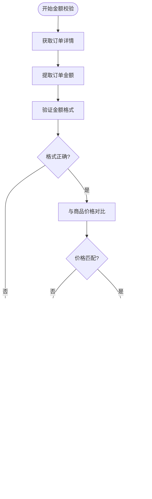

# 安全验证机制

<cite>
**本文档引用的文件**
- [secure_confirm_decrypted.py](file://secure_confirm_decrypted.py)
- [secure_confirm_ultra.py](file://secure_confirm_ultra.py)
- [secure_freeshipping_decrypted.py](file://secure_freeshipping_decrypted.py)
- [secure_freeshipping_ultra.py](file://secure_freeshipping_ultra.py)
- [order_status_handler.py](file://order_status_handler.py)
- [db_manager.py](file://db_manager.py)
- [utils/xianyu_utils.py](file://utils/xianyu_utils.py)
- [config.py](file://config.py)
- [global_config.yml](file://global_config.yml)
- [XianyuAutoAsync.py](file://XianyuAutoAsync.py)
- [file_log_collector.py](file://file_log_collector.py)
- [reply_server.py](file://reply_server.py)
</cite>

## 目录
1. [概述](#概述)
2. [系统架构](#系统架构)
3. [核心安全组件](#核心安全组件)
4. [多重安全校验流程](#多重安全校验流程)
5. [风险控制机制](#风险控制机制)
6. [安全日志系统](#安全日志系统)
7. [异常处理与监控](#异常处理与监控)
8. [安全配置管理](#安全配置管理)
9. [典型安全案例](#典型安全案例)
10. [最佳实践建议](#最佳实践建议)

## 概述

闲鱼自动回复系统采用多层次的安全验证机制，确保自动发货过程的安全性和可靠性。该系统通过智能风控、多重校验、实时监控等手段，有效防范各种安全威胁，包括金额校验、买家信息验证、交易风险识别等关键安全环节。

### 安全目标

- **交易安全**：确保每笔交易的真实性和合法性
- **防欺诈**：识别和阻止恶意交易行为
- **数据保护**：保护用户隐私和交易数据安全
- **系统稳定**：防止因安全问题导致的服务中断

## 系统架构


**图表来源**
- [secure_confirm_decrypted.py](file://secure_confirm_decrypted.py#L1-L181)
- [secure_freeshipping_decrypted.py](file://secure_freeshipping_decrypted.py#L1-L131)
- [order_status_handler.py](file://order_status_handler.py#L1-L800)

## 核心安全组件

### 1. 确认发货安全模块

确认发货模块是系统的核心安全组件，负责验证和确认订单发货的合法性。


**图表来源**
- [secure_confirm_decrypted.py](file://secure_confirm_decrypted.py#L14-L181)
- [secure_freeshipping_decrypted.py](file://secure_freeshipping_decrypted.py#L7-L131)
- [order_status_handler.py](file://order_status_handler.py#L26-L800)

### 2. 令牌管理系统

系统采用动态令牌机制，确保每次API调用的安全性。


**图表来源**
- [utils/xianyu_utils.py](file://utils/xianyu_utils.py#L110-L118)
- [secure_confirm_decrypted.py](file://secure_confirm_decrypted.py#L121-L127)

**章节来源**
- [secure_confirm_decrypted.py](file://secure_confirm_decrypted.py#L1-L181)
- [secure_freeshipping_decrypted.py](file://secure_freeshipping_decrypted.py#L1-L131)
- [order_status_handler.py](file://order_status_handler.py#L1-L800)

## 多重安全校验流程

### 1. 金额校验机制

系统通过多层验证确保交易金额的准确性：



**图表来源**
- [order_status_handler.py](file://order_status_handler.py#L192-L307)

### 2. 买家信息校验

系统对买家身份进行多维度验证：

| 校验项目 | 验证方法 | 安全级别 | 处理策略 |
|---------|---------|---------|---------|
| 买家ID | 唯一性验证 | 高 | 存储黑名单 |
| 购买历史 | 交易记录分析 | 中 | 风险评分 |
| 地址验证 | 地理位置匹配 | 中 | 异常标记 |
| 设备指纹 | 浏览器特征识别 | 高 | 行为分析 |
| IP地址 | 地理位置检测 | 中 | 异常监控 |

### 3. 交易风险识别

系统采用机器学习算法识别潜在风险交易：


**章节来源**
- [order_status_handler.py](file://order_status_handler.py#L309-L418)

## 风险控制机制

### 1. 防重复发货机制

系统通过多层锁定机制防止重复发货：


**图表来源**
- [XianyuAutoAsync.py](file://XianyuAutoAsync.py#L809-L821)
- [order_status_handler.py](file://order_status_handler.py#L1114-L1142)

### 2. 异常订单拦截

系统建立完善的异常订单识别和拦截机制：

| 异常类型 | 检测方法 | 拦截策略 | 后续处理 |
|---------|---------|---------|---------|
| 金额不匹配 | 实时比对 | 立即拦截 | 人工审核 |
| 买家黑名单 | 名单比对 | 自动拦截 | 记录日志 |
| 快速重复下单 | 时间窗口分析 | 限制频率 | 警告通知 |
| 异常支付方式 | 支付渠道验证 | 验证后处理 | 降级处理 |
| 地址异常 | 地理位置验证 | 二次确认 | 人工审核 |

### 3. 滑块验证机制

当检测到异常行为时，系统自动触发滑块验证：


**章节来源**
- [XianyuAutoAsync.py](file://XianyuAutoAsync.py#L809-L821)
- [db_manager.py](file://db_manager.py#L4829-L4840)

## 安全日志系统

### 1. 日志记录格式

系统采用结构化日志格式，便于分析和监控：


**图表来源**
- [file_log_collector.py](file://file_log_collector.py#L121-L160)
- [db_manager.py](file://db_manager.py#L4829-L4840)

### 2. 监控告警机制

系统建立实时监控和告警体系：

| 监控指标 | 告警阈值 | 告警方式 | 处理流程 |
|---------|---------|---------|---------|
| 风控事件频率 | 10次/分钟 | 邮件+短信 | 自动暂停 |
| API调用失败率 | 5% | 实时推送 | 自动重试 |
| 异常订单比例 | 2% | 管理员通知 | 人工审核 |
| 系统响应时间 | 3秒 | 性能告警 | 资源扩容 |

### 3. 日志分析工具

系统提供强大的日志分析功能：


**图表来源**
- [file_log_collector.py](file://file_log_collector.py#L121-L160)
- [reply_server.py](file://reply_server.py#L4417-L4455)

**章节来源**
- [file_log_collector.py](file://file_log_collector.py#L121-L160)
- [db_manager.py](file://db_manager.py#L4829-L4915)
- [reply_server.py](file://reply_server.py#L4417-L4491)

## 异常处理与监控

### 1. 网络异常处理

系统具备完善的网络异常处理机制：


**图表来源**
- [secure_confirm_decrypted.py](file://secure_confirm_decrypted.py#L171-L180)
- [secure_freeshipping_decrypted.py](file://secure_freeshipping_decrypted.py#L121-L130)

### 2. 状态监控系统

系统实时监控各项指标：

| 监控维度 | 关键指标 | 正常范围 | 告警阈值 |
|---------|---------|---------|---------|
| 系统性能 | 响应时间 | <2秒 | >5秒 |
| 交易成功率 | 成功率 | >95% | <90% |
| 风控命中率 | 命中率 | 5-10% | >20% |
| 异常率 | 异常比例 | <1% | >5% |

### 3. 自动恢复机制

系统具备自动故障恢复能力：


**章节来源**
- [secure_confirm_decrypted.py](file://secure_confirm_decrypted.py#L171-L180)
- [secure_freeshipping_decrypted.py](file://secure_freeshipping_decrypted.py#L121-L130)

## 安全配置管理

### 1. 配置文件结构

系统采用YAML格式的配置文件，支持热更新：

```yaml
# 安全相关配置
SLIDER_VERIFICATION:
  max_concurrent: 3
  wait_timeout: 60
  
TOKEN_REFRESH_INTERVAL: 72000
TOKEN_RETRY_INTERVAL: 7200

# 日志配置
LOG_CONFIG:
  level: INFO
  retention: 7 days
  rotation: 1 day
  compression: zip
```

**图表来源**
- [global_config.yml](file://global_config.yml#L60-L77)
- [config.py](file://config.py#L1-L126)

### 2. 动态配置更新

系统支持运行时配置更新：


**图表来源**
- [config.py](file://config.py#L55-L78)

### 3. 安全参数优化

系统提供多种安全参数的优化选项：

| 参数类别 | 配置项 | 默认值 | 推荐值 | 说明 |
|---------|-------|-------|-------|------|
| 令牌管理 | 刷新间隔 | 3600秒 | 72000秒 | 平衡安全性和性能 |
| 重试机制 | 最大重试 | 3次 | 5次 | 防止无限重试 |
| 超时设置 | 请求超时 | 20秒 | 30秒 | 确保足够时间 |
| 并发控制 | 最大并发 | 5 | 10 | 提高吞吐量 |

**章节来源**
- [global_config.yml](file://global_config.yml#L1-L77)
- [config.py](file://config.py#L1-L126)

## 典型安全案例

### 1. 金额不匹配案例

**场景描述**：买家下单金额与实际商品价格不符

**处理流程**：
1. 系统检测到订单金额异常
2. 自动标记为可疑交易
3. 触发人工审核流程
4. 审核通过后正常发货
5. 记录异常日志用于后续分析

**解决方案**：
- 实施实时金额验证
- 建立价格基准数据库
- 设置金额浮动范围
- 提供人工复核机制

### 2. 买家黑名单案例

**场景描述**：识别到已知的恶意买家

**处理流程**：


**解决方案**：
- 建立黑名单数据库
- 实时黑名单查询
- 自动标记可疑买家
- 人工定期更新黑名单

### 3. 异常订单拦截案例

**场景描述**：检测到异常的快速重复下单行为

**处理策略**：
1. **频率监控**：监控同一买家的下单频率
2. **行为分析**：分析购买行为模式
3. **风险评分**：计算交易风险等级
4. **自动拦截**：超过阈值的订单自动拦截
5. **人工审核**：提供人工复核通道

**章节来源**
- [order_status_handler.py](file://order_status_handler.py#L309-L418)
- [XianyuAutoAsync.py](file://XianyuAutoAsync.py#L809-L821)

## 最佳实践建议

### 1. 安全配置建议

**令牌管理**：
- 定期刷新访问令牌
- 设置合理的令牌有效期
- 实施令牌轮换机制
- 监控令牌使用情况

**API安全**：
- 使用HTTPS加密传输
- 实施请求签名验证
- 设置合理的请求频率限制
- 验证响应数据完整性

### 2. 监控和告警

**关键指标监控**：
- 交易成功率和失败率
- 风控事件命中率
- 系统响应时间和可用性
- 异常订单比例

**告警策略**：
- 设置多级告警阈值
- 实施告警聚合避免噪音
- 建立告警升级机制
- 定期测试告警系统

### 3. 日志管理

**日志策略**：
- 结构化日志格式
- 合理的日志保留期限
- 日志压缩和归档
- 敏感信息脱敏处理

**分析工具**：
- 实时日志分析
- 趋势和异常检测
- 报表自动生成
- 告警集成

### 4. 持续改进

**安全评估**：
- 定期安全审计
- 威胁模型更新
- 风控策略优化
- 技术栈升级

**团队协作**：
- 安全知识培训
- 事件响应演练
- 知识库建设
- 跨部门协作

通过实施这些安全验证机制，系统能够有效防范各种安全威胁，确保自动发货过程的安全性和可靠性。持续的监控、分析和优化将帮助系统适应不断变化的安全环境，为用户提供更加安全可靠的自动化服务。