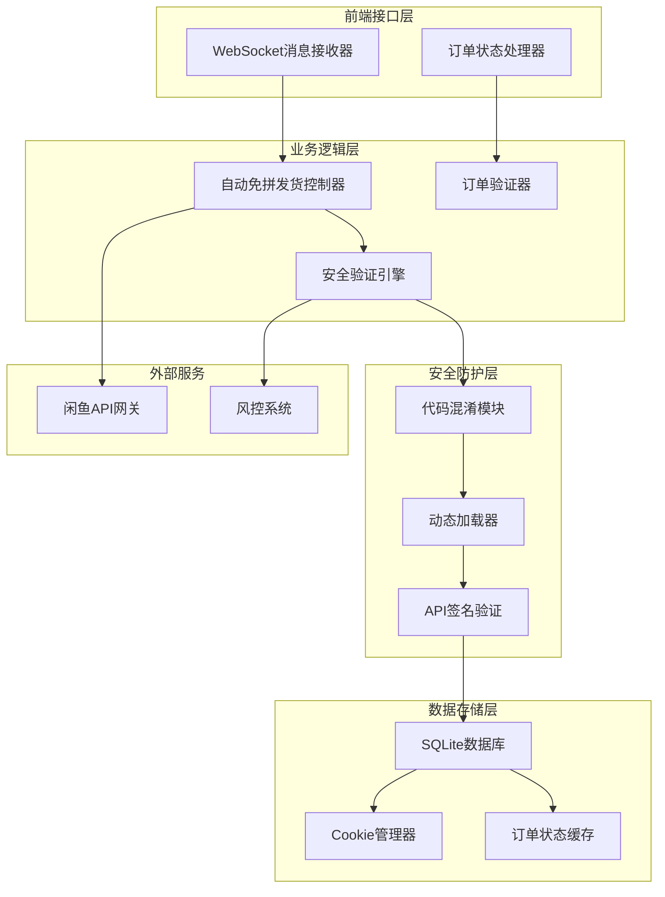
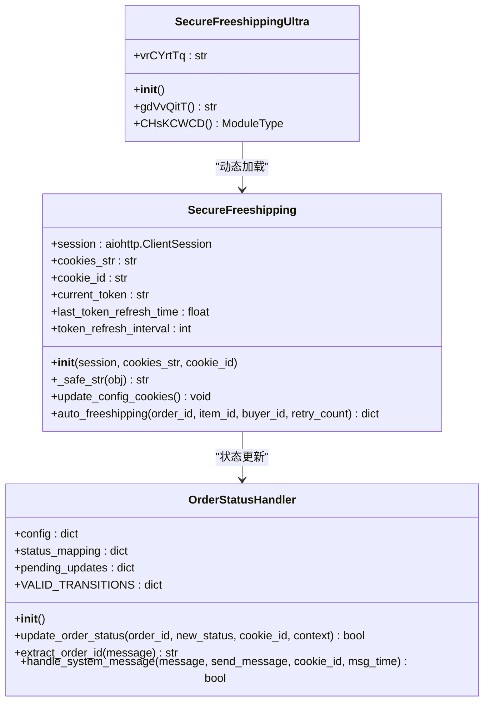
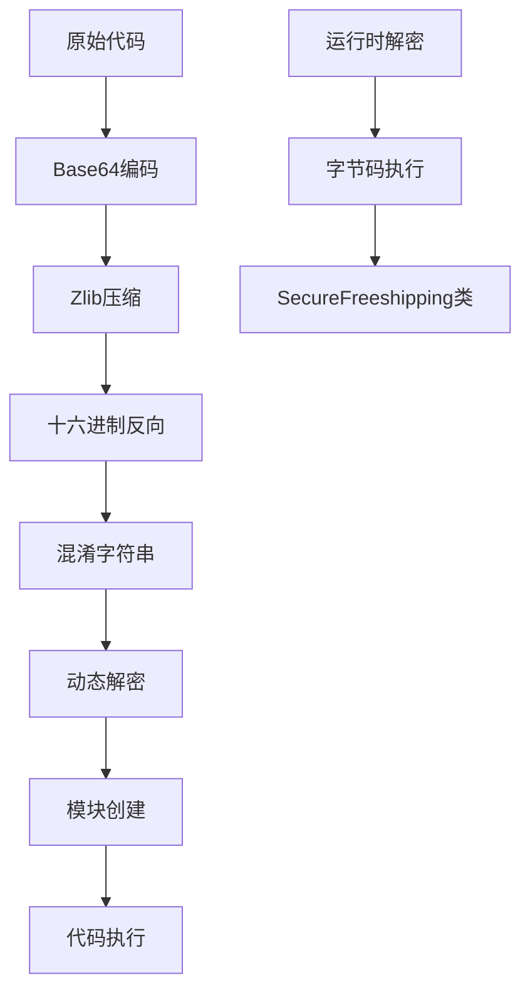
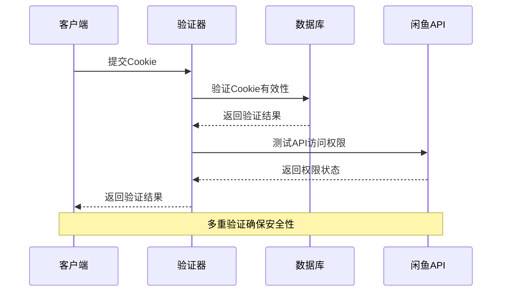
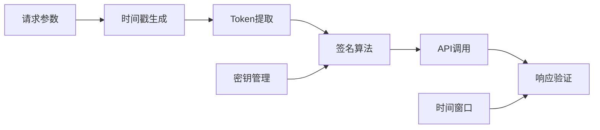
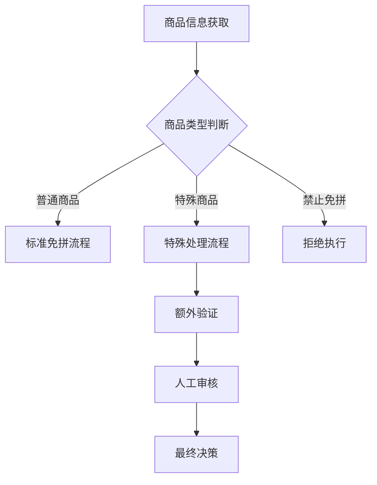
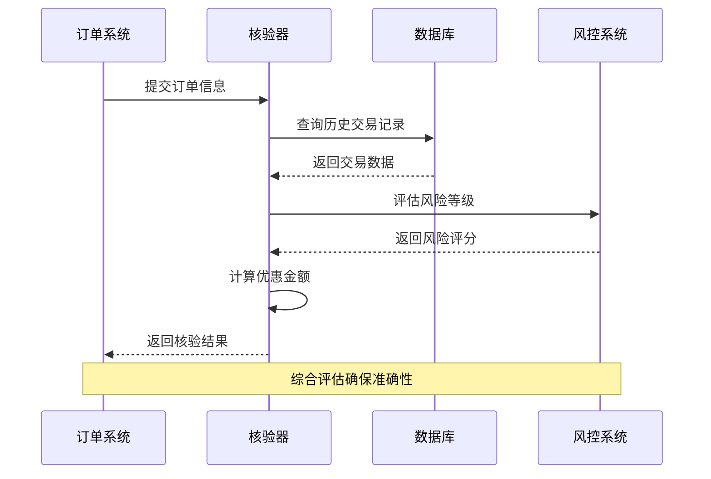
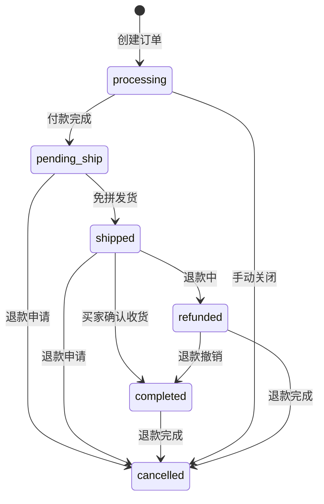
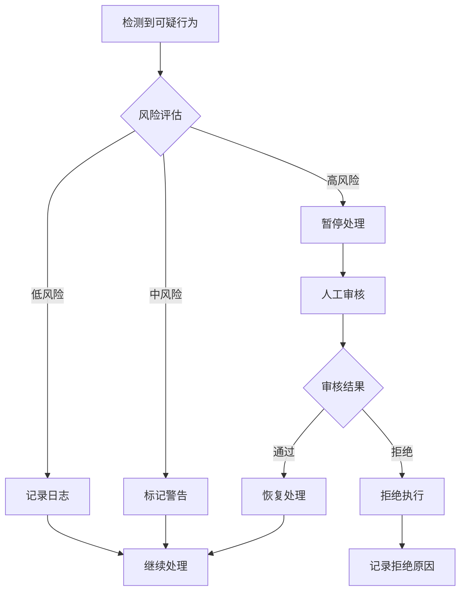
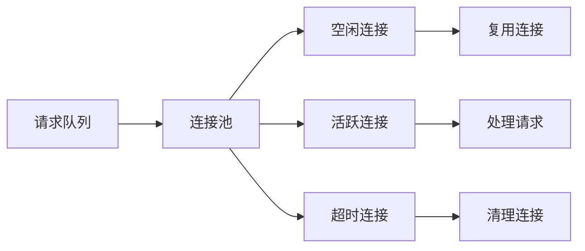

# 自动免拼发货安全验证机制文档

<cite>
**本文档中引用的文件**
- [secure_freeshipping_ultra.py](file://secure_freeshipping_ultra.py)
- [secure_freeshipping_decrypted.py](file://secure_freeshipping_decrypted.py)
- [secure_confirm_ultra.py](file://secure_confirm_ultra.py)
- [order_status_handler.py](file://order_status_handler.py)
- [XianyuAutoAsync.py](file://XianyuAutoAsync.py)
- [db_manager.py](file://db_manager.py)
</cite>

## 目录
1. [概述](#概述)
2. [系统架构](#系统架构)
3. [核心组件分析](#核心组件分析)
4. [安全验证机制](#安全验证机制)
5. [免拼条件验证](#免拼条件验证)
6. [特殊商品类型识别](#特殊商品类型识别)
7. [优惠金额核验](#优惠金额核验)
8. [订单处理系统集成](#订单处理系统集成)
9. [安全失败场景处理](#安全失败场景处理)
10. [性能优化建议](#性能优化建议)
11. [故障排除指南](#故障排除指南)
12. [总结](#总结)

## 概述

自动免拼发货功能是一个高度安全化的订单处理系统，旨在为符合条件的订单自动执行免拼发货操作。该系统采用了多层次的安全验证机制，包括代码混淆、动态加载、API签名验证等技术手段，确保只有合法的订单才能触发免拼发货。

### 主要特性

- **代码混淆保护**：采用多层编码和混淆技术保护核心算法
- **动态加载机制**：支持加密代码的运行时解密和执行
- **严格的安全验证**：多层次的身份验证和权限检查
- **智能风控系统**：实时监控和识别可疑交易行为
- **高可用架构**：支持重试机制和异常恢复

## 系统架构

**图表来源**
- [XianyuAutoAsync.py](file://XianyuAutoAsync.py#L4355-L4376)
- [order_status_handler.py](file://order_status_handler.py#L26-L80)

## 核心组件分析

### SecureFreeshipping 类

SecureFreeshipping 类是自动免拼发货功能的核心实现，负责处理免拼发货的完整生命周期。

**图表来源**
- [secure_freeshipping_decrypted.py](file://secure_freeshipping_decrypted.py#L7-L131)
- [secure_freeshipping_ultra.py](file://secure_freeshipping_ultra.py#L11-L44)
- [order_status_handler.py](file://order_status_handler.py#L26-L80)

**章节来源**
- [secure_freeshipping_decrypted.py](file://secure_freeshipping_decrypted.py#L7-L131)
- [secure_freeshipping_ultra.py](file://secure_freeshipping_ultra.py#L11-L44)

### 代码混淆和动态加载机制

系统采用独特的代码混淆和动态加载机制，确保核心算法的安全性。

#### 混淆流程

**图表来源**
- [secure_freeshipping_ultra.py](file://secure_freeshipping_ultra.py#L16-L31)

#### 动态加载过程

系统通过以下步骤实现动态加载：

1. **解密阶段**：使用多层解密算法还原原始代码
2. **编译阶段**：将解密后的代码编译为Python字节码
3. **执行阶段**：在隔离的命名空间中执行代码
4. **清理阶段**：删除所有临时变量和中间产物

**章节来源**
- [secure_freeshipping_ultra.py](file://secure_freeshipping_ultra.py#L16-L31)

## 安全验证机制

### 多层次身份验证

系统实现了多层次的身份验证机制，确保只有授权的账户才能执行免拼发货操作。

#### Cookie验证

**图表来源**
- [XianyuAutoAsync.py](file://XianyuAutoAsync.py#L2239-L2302)

#### Token刷新机制

系统实现了智能的Token刷新机制，确保长期运行的稳定性：

- **自动刷新**：当Token接近过期时自动刷新
- **并发控制**：防止多个任务同时刷新Token
- **错误处理**：Token刷新失败时的降级策略

**章节来源**
- [secure_freeshipping_decrypted.py](file://secure_freeshipping_decrypted.py#L26-L37)

### API签名验证

所有对外API调用都经过严格的签名验证：

**图表来源**
- [secure_freeshipping_decrypted.py](file://secure_freeshipping_decrypted.py#L79-L80)

## 免拼条件验证

### 订单状态检查

系统在执行免拼发货前会进行严格的订单状态验证：

| 验证项目 | 检查内容 | 失败处理 |
|---------|---------|---------|
| 订单存在性 | 检查订单是否存在于数据库 | 添加到待处理队列 |
| 状态合法性 | 验证当前状态是否允许免拼 | 记录日志并跳过 |
| 权限验证 | 检查卖家是否有操作权限 | 返回权限错误 |
| 时间窗口 | 验证操作是否在允许的时间范围内 | 延迟处理 |

### 商品类型验证

系统能够识别和处理不同类型的特殊商品：

**图表来源**
- [order_status_handler.py](file://order_status_handler.py#L309-L330)

**章节来源**
- [order_status_handler.py](file://order_status_handler.py#L252-L269)

## 特殊商品类型识别

### 识别规则

系统通过多种特征识别特殊商品：

- **价格阈值**：超过特定金额的商品需要额外验证
- **品类分类**：某些品类的商品有特殊的处理规则
- **历史行为**：基于卖家历史交易记录的风险评估
- **买家信誉**：结合买家信誉等级进行综合判断

### 处理策略

对于识别出的特殊商品，系统采用不同的处理策略：

1. **直接放行**：符合所有条件的普通商品
2. **人工审核**：需要人工介入的商品
3. **风险提示**：标记为高风险的商品
4. **拒绝执行**：明确禁止免拼的商品

## 优惠金额核验

### 核验流程

**图表来源**
- [secure_freeshipping_decrypted.py](file://secure_freeshipping_decrypted.py#L38-L130)

### 核验规则

系统采用多维度的优惠金额核验规则：

| 核验维度 | 检查内容 | 阈值设置 | 处理方式 |
|---------|---------|---------|---------|
| 总金额 | 订单总金额是否合理 | ±20%浮动 | 超出范围需审核 |
| 折扣率 | 折扣比例是否在合理范围 | 10%-90% | 异常折扣标记 |
| 优惠券 | 使用的优惠券是否有效 | 库存检查 | 无效券拒绝 |
| 促销活动 | 是否参与平台促销 | 活动规则验证 | 规则不符拒绝 |

**章节来源**
- [secure_freeshipping_decrypted.py](file://secure_freeshipping_decrypted.py#L38-L130)

## 订单处理系统集成

### 状态流转机制

**图表来源**
- [order_status_handler.py](file://order_status_handler.py#L36-L44)

### 集成点设计

系统与订单处理系统的集成通过以下关键点实现：

1. **事件驱动**：基于WebSocket的消息驱动处理
2. **状态同步**：实时同步订单状态变化
3. **异常处理**：完善的错误处理和恢复机制
4. **日志记录**：完整的操作日志和审计跟踪

**章节来源**
- [order_status_handler.py](file://order_status_handler.py#L633-L758)

## 安全失败场景处理

### 暂停机制

当系统检测到可疑交易时，会自动触发暂停机制：

**图表来源**
- [XianyuAutoAsync.py](file://XianyuAutoAsync.py#L44-L104)

### 人工审核提示

系统提供多种方式的人工审核提示：

- **系统通知**：通过日志和邮件通知相关人员
- **Web界面**：提供专门的审核管理界面
- **实时提醒**：通过WebSocket推送实时提醒
- **批量处理**：支持批量审核和处理

### 异常恢复机制

系统具备完善的异常恢复能力：

1. **自动重试**：网络异常时的自动重试机制
2. **断点续传**：长时间运行时的状态保存
3. **数据备份**：关键数据的定期备份
4. **故障转移**：主备系统的切换能力

**章节来源**
- [secure_freeshipping_decrypted.py](file://secure_freeshipping_decrypted.py#L40-L42)
- [secure_freeshipping_decrypted.py](file://secure_freeshipping_decrypted.py#L117-L129)

## 性能优化建议

### 并发处理优化

为了在高并发环境下保持高效的安全校验，建议采用以下优化策略：

#### 连接池管理

#### 缓存策略

- **Redis缓存**：缓存频繁访问的数据
- **本地缓存**：减少数据库查询压力
- **预热机制**：提前加载热点数据
- **失效策略**：合理的缓存失效机制

### 内存管理优化

1. **对象池**：重用频繁创建的对象
2. **垃圾回收**：及时释放不再使用的资源
3. **内存监控**：实时监控内存使用情况
4. **分页处理**：大数据量的分页处理

### 网络优化

- **HTTP/2支持**：利用多路复用提高传输效率
- **压缩传输**：启用gzip压缩减少传输数据量
- **连接复用**：保持长连接减少握手开销
- **负载均衡**：分布式部署分散请求压力

## 故障排除指南

### 常见问题及解决方案

#### 免拼发货失败

**问题现象**：免拼发货API调用失败

**排查步骤**：
1. 检查Cookie有效性
2. 验证Token是否过期
3. 确认订单状态是否允许免拼
4. 检查网络连接状态

**解决方案**：
- 更新Cookie和Token
- 等待订单状态更新
- 检查网络连接
- 查看详细错误日志

#### 安全验证失败

**问题现象**：安全验证机制触发异常

**排查步骤**：
1. 检查代码混淆是否正确
2. 验证动态加载过程
3. 确认API签名是否正确
4. 检查时间同步状态

**解决方案**：
- 重新部署安全模块
- 检查时间服务器同步
- 更新API密钥
- 清理临时文件

#### 性能问题

**问题现象**：系统响应缓慢或超时

**排查步骤**：
1. 监控CPU和内存使用率
2. 检查数据库连接池状态
3. 分析慢查询日志
4. 检查网络延迟

**解决方案**：
- 优化数据库查询
- 增加连接池大小
- 启用查询缓存
- 调整超时设置

**章节来源**
- [secure_freeshipping_decrypted.py](file://secure_freeshipping_decrypted.py#L121-L130)

## 总结

自动免拼发货安全验证机制是一个复杂而精密的系统，通过多层次的安全防护、智能的风险控制和高效的性能优化，确保了系统的安全性和可靠性。

### 核心优势

1. **高度安全性**：多层代码混淆和动态加载保护核心算法
2. **智能风控**：实时监控和智能识别可疑交易行为
3. **高可用性**：完善的异常处理和恢复机制
4. **高性能**：优化的并发处理和缓存策略
5. **易维护性**：清晰的架构设计和完善的日志系统

### 发展方向

未来的发展重点包括：

- **AI风控升级**：引入机器学习算法提升风险识别能力
- **实时监控增强**：构建更完善的实时监控体系
- **性能持续优化**：不断优化系统性能和资源利用率
- **用户体验改善**：简化操作流程，提升用户满意度

通过持续的技术创新和优化，该系统将继续为电商平台提供安全、高效、可靠的免拼发货服务。