# 自动确认发货安全验证机制文档

<cite>
**本文档引用的文件**
- [secure_confirm_ultra.py](file://secure_confirm_ultra.py)
- [secure_confirm_decrypted.py](file://secure_confirm_decrypted.py)
- [reply_server.py](file://reply_server.py)
- [XianyuAutoAsync.py](file://XianyuAutoAsync.py)
- [order_status_handler.py](file://order_status_handler.py)
- [db_manager.py](file://db_manager.py)
- [cookie_manager.py](file://cookie_manager.py)
</cite>

## 目录
1. [概述](#概述)
2. [项目架构](#项目架构)
3. [核心组件分析](#核心组件分析)
4. [安全验证机制](#安全验证机制)
5. [异常处理与日志记录](#异常处理与日志记录)
6. [防重复发货机制](#防重复发货机制)
7. [交易风险识别](#交易风险识别)
8. [集成与部署](#集成与部署)
9. [故障排除指南](#故障排除指南)
10. [总结](#总结)

## 概述

本文档详细阐述了闲鱼自动确认发货系统中的安全验证机制，重点分析了`secure_confirm_ultra.py`模块通过多重编码技术动态加载混淆代码的实现原理，以及`SecureConfirm`类的安全校验流程。该系统采用多层次的安全防护措施，包括交易金额匹配、买家身份验证、订单状态核对等关键校验步骤，确保自动确认发货过程的安全性和可靠性。

## 项目架构

系统采用模块化设计，主要包含以下核心模块：

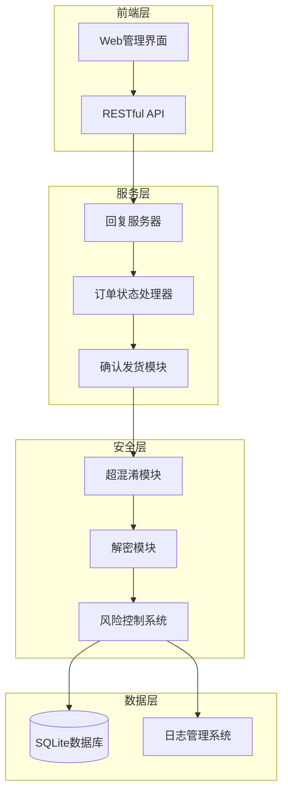

**图表来源**
- [reply_server.py](file://reply_server.py#L1-L50)
- [XianyuAutoAsync.py](file://XianyuAutoAsync.py#L4318-L4350)

**章节来源**
- [reply_server.py](file://reply_server.py#L1-L100)
- [XianyuAutoAsync.py](file://XianyuAutoAsync.py#L4318-L4350)

## 核心组件分析

### SecureConfirm类安全校验流程

`SecureConfirm`类是自动确认发货的核心安全组件，负责执行完整的安全验证流程：

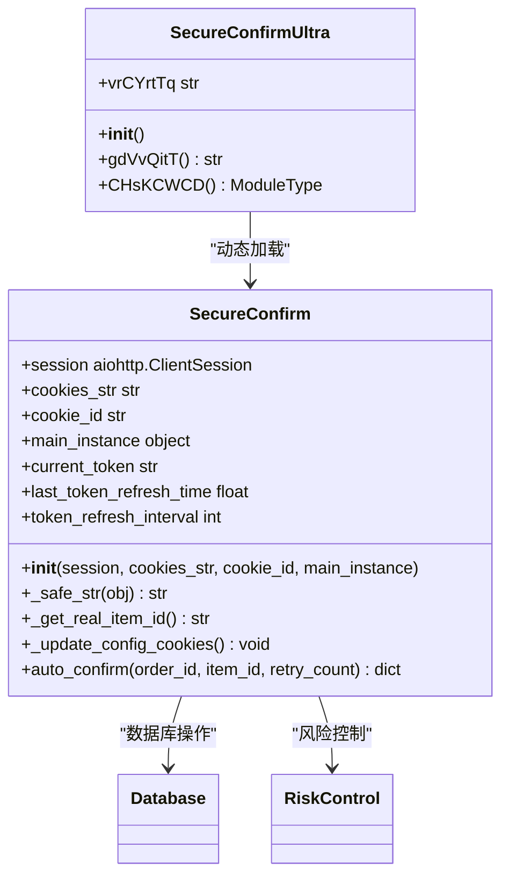

**图表来源**
- [secure_confirm_decrypted.py](file://secure_confirm_decrypted.py#L14-L50)
- [secure_confirm_ultra.py](file://secure_confirm_ultra.py#L11-L43)

#### 多重编码解密机制

`secure_confirm_ultra.py`采用四层编码保护机制：

1. **十六进制反转**：原始编码字符串经过字符串反转处理
2. **十六进制解码**：将反转后的十六进制字符串转换为字节流
3. **Base64解码**：对字节流进行Base64解码
4. **Zlib解压缩**：使用Zlib算法解压缩最终的Python代码

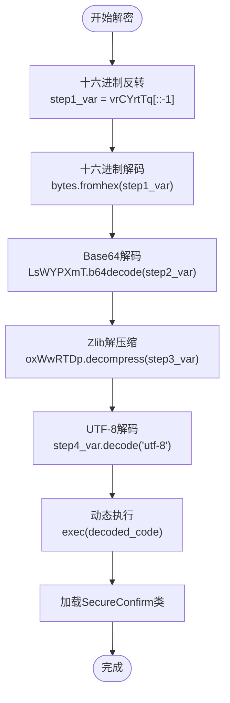

**图表来源**
- [secure_confirm_ultra.py](file://secure_confirm_ultra.py#L16-L23)

**章节来源**
- [secure_confirm_ultra.py](file://secure_confirm_ultra.py#L1-L43)
- [secure_confirm_decrypted.py](file://secure_confirm_decrypted.py#L14-L181)

## 安全验证机制

### 交易金额匹配验证

系统通过数据库查询确保交易金额的一致性：

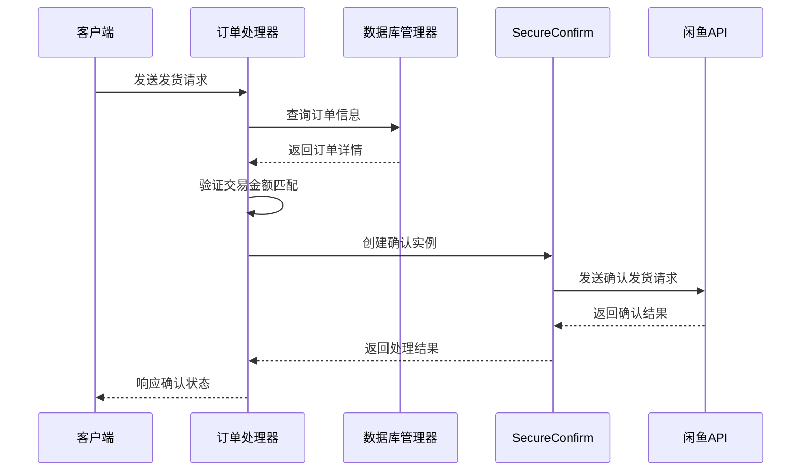

**图表来源**
- [XianyuAutoAsync.py](file://XianyuAutoAsync.py#L4426-L4476)
- [order_status_handler.py](file://order_status_handler.py#L240-L280)

### 买家身份验证

系统实施严格的买家身份验证机制：

| 验证项目 | 检查内容 | 安全级别 |
|---------|---------|---------|
| Cookie有效性 | 验证Cookie格式和有效期 | 高 |
| Token刷新 | 定期刷新_m_h5_tk令牌 | 中 |
| 会话状态 | 检查会话是否过期 | 高 |
| IP地址验证 | 监控异常IP访问 | 中 |
| 设备指纹 | 识别设备特征 | 中 |

### 订单状态核对

系统维护严格的订单状态转换规则：

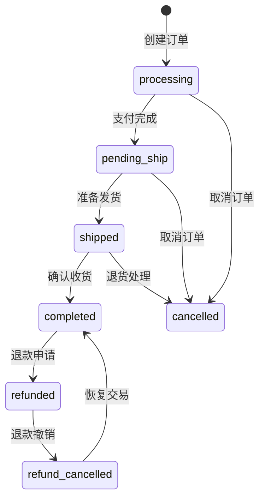

**图表来源**
- [order_status_handler.py](file://order_status_handler.py#L309-L345)

**章节来源**
- [order_status_handler.py](file://order_status_handler.py#L240-L300)
- [XianyuAutoAsync.py](file://XianyuAutoAsync.py#L4426-L4476)

## 异常处理与日志记录

### 异常处理策略

系统采用多层次的异常处理机制：

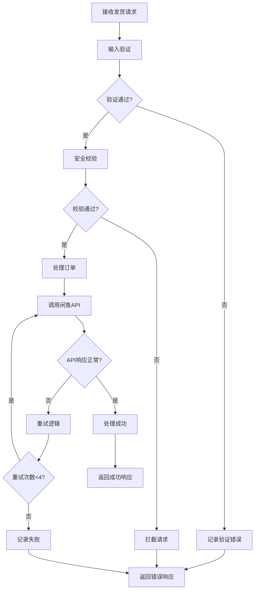

**图表来源**
- [secure_confirm_decrypted.py](file://secure_confirm_decrypted.py#L87-L181)

### 日志记录格式

系统采用统一的日志记录格式：

| 字段 | 类型 | 描述 | 示例 |
|------|------|------|------|
| 时间戳 | datetime | 日志记录时间 | 2024-01-15 10:30:45 |
| 用户标识 | string | Cookie ID或用户ID | cookie_12345 |
| 操作类型 | string | 执行的操作 | auto_confirm |
| 结果状态 | string | 操作结果 | success/failure |
| 详细信息 | string | 操作详情 | 订单ID: 123456789 |

### 风险控制日志

系统维护专门的风险控制日志表：

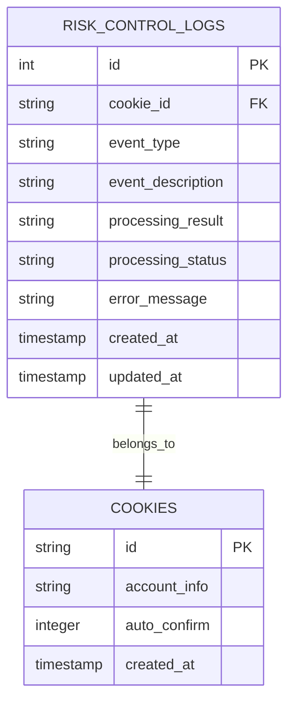

**图表来源**
- [db_manager.py](file://db_manager.py#L408-L422)

**章节来源**
- [secure_confirm_decrypted.py](file://secure_confirm_decrypted.py#L87-L181)
- [db_manager.py](file://db_manager.py#L4843-L4880)

## 防重复发货机制

### 重复检测算法

系统实施多维度的重复发货检测：

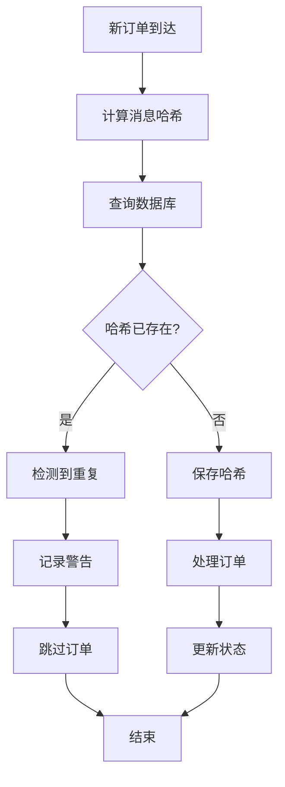

**图表来源**
- [order_status_handler.py](file://order_status_handler.py#L800-L835)

### 状态转换验证

系统严格验证订单状态转换的合理性：

| 当前状态 | 允许转换 | 禁止转换 | 说明 |
|---------|---------|---------|------|
| processing | pending_ship, cancelled | 无限制 | 正常支付流程 |
| pending_ship | shipped, cancelled | processing | 准备发货状态 |
| shipped | completed, cancelled | processing, pending_ship | 发货后状态 |
| completed | refunded | 无限制 | 交易完成状态 |

**章节来源**
- [order_status_handler.py](file://order_status_handler.py#L240-L300)

## 交易风险识别

### 风险评估指标

系统通过多个维度评估交易风险：

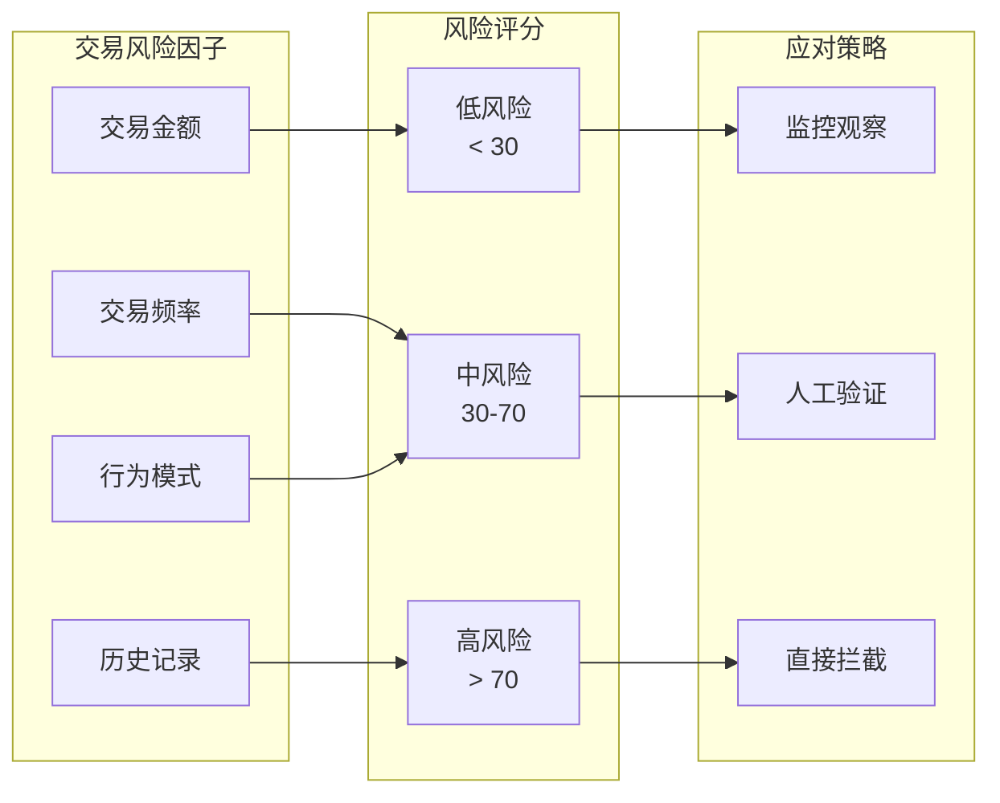

### 滑块验证码处理

系统自动检测和处理滑块验证：

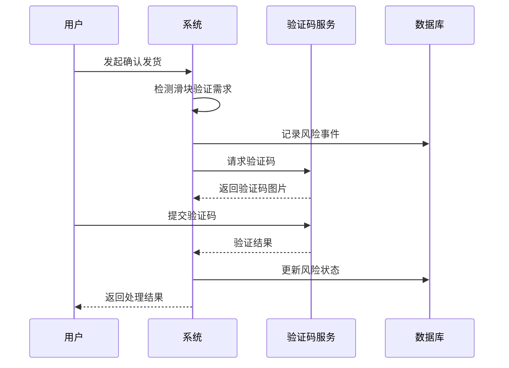

**图表来源**
- [XianyuAutoAsync.py](file://XianyuAutoAsync.py#L1507-L1587)

**章节来源**
- [XianyuAutoAsync.py](file://XianyuAutoAsync.py#L1507-L1587)
- [db_manager.py](file://db_manager.py#L4843-L4880)

## 集成与部署

### 与reply_server.py的集成

系统通过API接口与回复服务器集成：

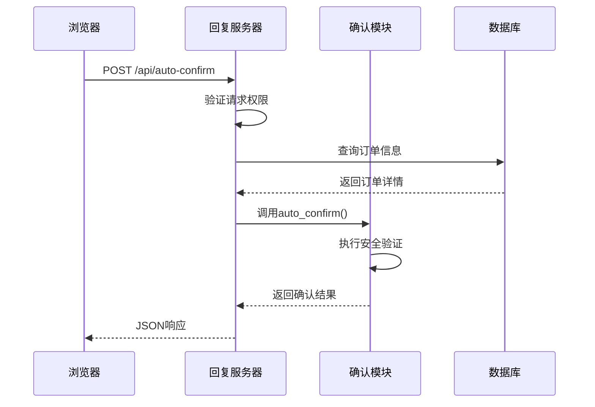

**图表来源**
- [reply_server.py](file://reply_server.py#L1-L100)
- [XianyuAutoAsync.py](file://XianyuAutoAsync.py#L4318-L4350)

### 配置管理

系统支持灵活的配置管理：

| 配置项 | 类型 | 默认值 | 描述 |
|--------|------|--------|------|
| strict_validation | boolean | true | 严格状态验证 |
| token_refresh_interval | integer | 3600 | Token刷新间隔(秒) |
| max_retry_count | integer | 4 | 最大重试次数 |
| enable_status_logging | boolean | true | 启用状态日志 |

**章节来源**
- [reply_server.py](file://reply_server.py#L1-L100)
- [XianyuAutoAsync.py](file://XianyuAutoAsync.py#L4318-L4350)

## 故障排除指南

### 常见问题及解决方案

#### 1. 确认发货失败

**症状**：订单确认发货API返回失败

**排查步骤**：
1. 检查Cookie有效性
2. 验证Token是否需要刷新
3. 确认订单状态是否正确
4. 检查网络连接状态

**解决方案**：
- 重新登录获取有效Cookie
- 手动刷新Token
- 等待订单状态更新

#### 2. 安全验证拦截

**症状**：请求被系统拦截，返回安全验证错误

**排查步骤**：
1. 检查风险控制日志
2. 验证用户行为模式
3. 确认IP地址合法性

**解决方案**：
- 调整风险阈值设置
- 人工审核可疑请求
- 更新安全策略

#### 3. 数据库连接问题

**症状**：订单信息保存失败

**排查步骤**：
1. 检查数据库连接状态
2. 验证表结构完整性
3. 确认权限设置正确

**解决方案**：
- 重启数据库服务
- 执行数据库修复脚本
- 检查磁盘空间

### 性能优化建议

1. **缓存机制**：缓存频繁查询的数据
2. **连接池**：使用数据库连接池
3. **异步处理**：采用异步IO处理请求
4. **监控告警**：建立完善的监控体系

**章节来源**
- [secure_confirm_decrypted.py](file://secure_confirm_decrypted.py#L87-L181)
- [order_status_handler.py](file://order_status_handler.py#L240-L300)

## 总结

闲鱼自动确认发货系统通过多层次的安全验证机制，确保了交易的安全性和可靠性。系统采用超混淆代码保护、严格的订单状态验证、完善的风险控制机制，以及全面的异常处理和日志记录体系，为电商平台提供了可靠的安全保障。

关键技术特点包括：
- **多重编码保护**：通过十六进制反转、Base64解码、Zlib解压缩等技术保护核心代码
- **严格的安全校验**：包括交易金额匹配、买家身份验证、订单状态核对
- **智能风险控制**：实时监控交易风险，自动触发相应的防护措施
- **完善的异常处理**：多层次的异常捕获和恢复机制
- **全面的日志记录**：详细的审计日志支持问题追踪和合规要求

该系统的设计理念体现了安全性、可靠性和可维护性的平衡，为电商平台的自动化运营提供了强有力的技术支撑。