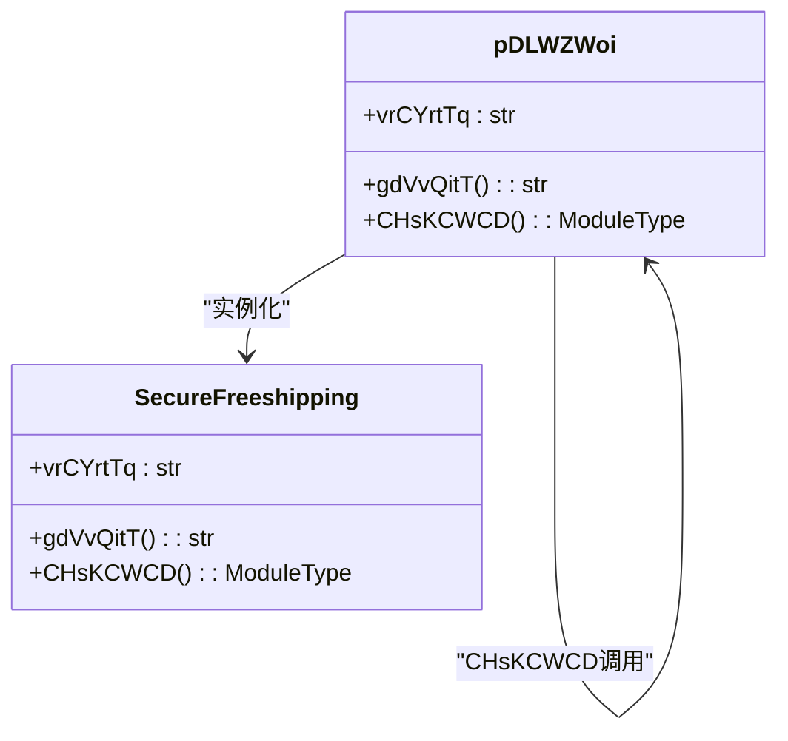
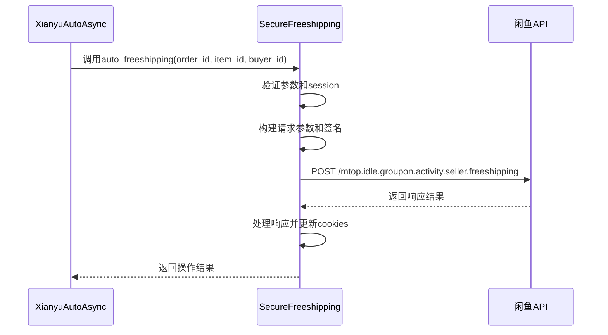
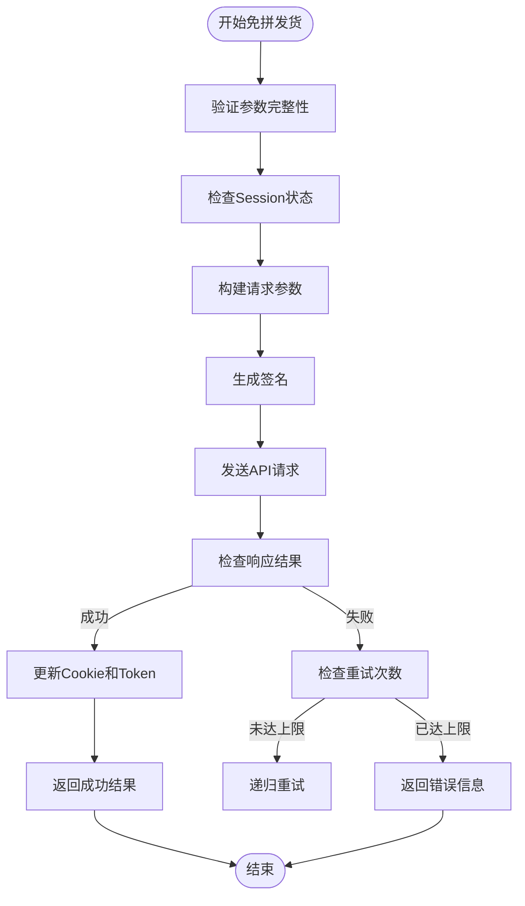
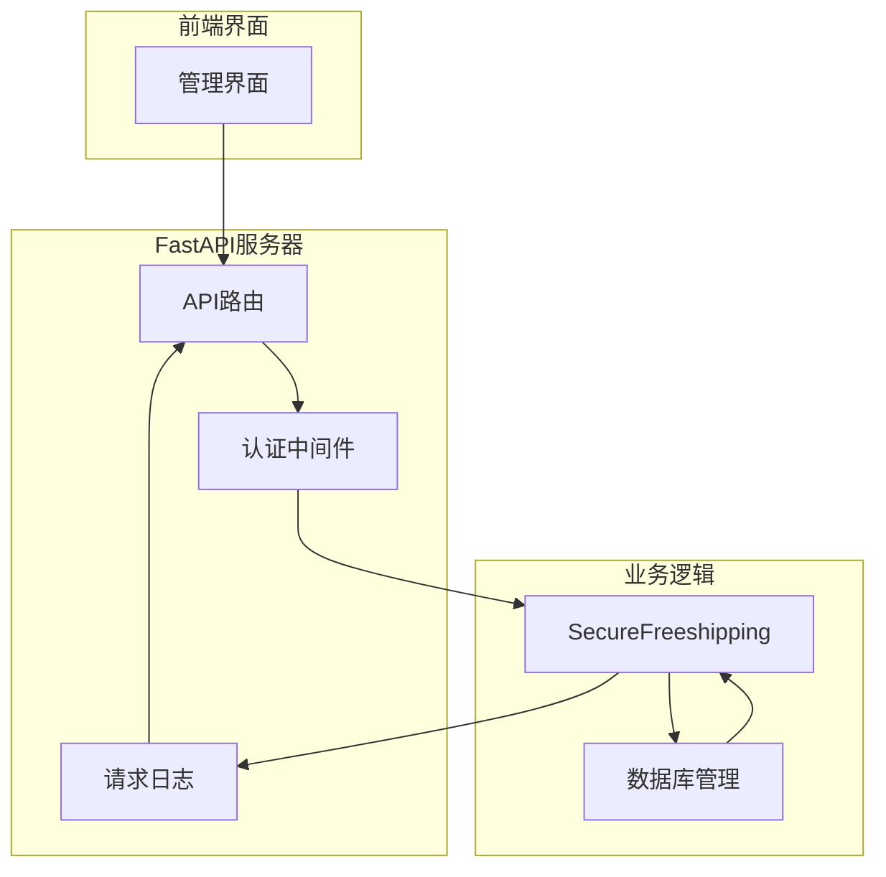
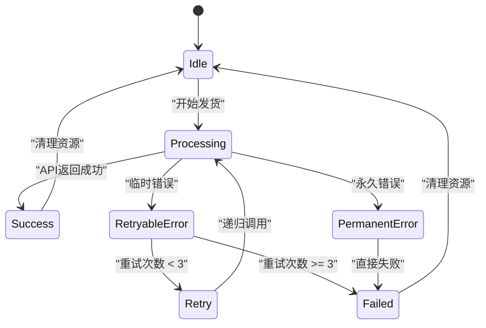
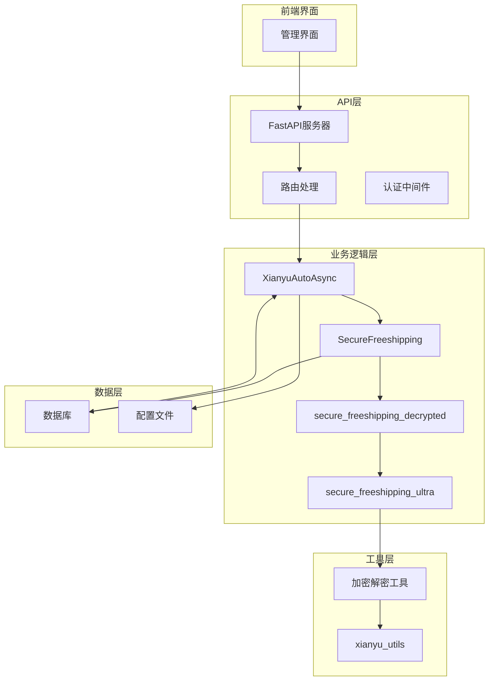

# 免拼发货接口

<cite>
**本文档引用文件**   
- [secure_freeshipping_ultra.py](file://secure_freeshipping_ultra.py)
- [secure_freeshipping_decrypted.py](file://secure_freeshipping_decrypted.py)
- [reply_server.py](file://reply_server.py)
- [XianyuAutoAsync.py](file://XianyuAutoAsync.py)
- [config.py](file://config.py)
- [utils/xianyu_utils.py](file://utils/xianyu_utils.py)
</cite>

## 目录
1. [简介](#简介)
2. [核心实现机制](#核心实现机制)
3. [调用流程与参数结构](#调用流程与参数结构)
4. [安全校验机制](#安全校验机制)
5. [FastAPI路由集成](#fastapi路由集成)
6. [成功与失败场景示例](#成功与失败场景示例)
7. [日志记录与错误处理](#日志记录与错误处理)
8. [系统架构图](#系统架构图)

## 简介

免拼发货接口是闲鱼自动回复系统中的核心功能之一，用于自动化处理闲鱼平台上的免拼订单发货操作。该接口通过多层加密和混淆技术保护核心业务逻辑，确保系统的安全性和稳定性。接口主要功能包括自动识别订单信息、执行免拼发货API调用、处理响应结果以及同步更新认证信息。

该功能通过`secure_freeshipping_ultra.py`文件中的`SecureFreeshipping`类实现，采用多层解码机制加载混淆代码，有效防止代码被逆向分析。接口与`reply_server.py`中的FastAPI路由集成，提供安全的HTTP端点供系统内部调用。

**Section sources**
- [secure_freeshipping_ultra.py](file://secure_freeshipping_ultra.py#L1-L44)
- [reply_server.py](file://reply_server.py#L308-L314)

## 核心实现机制

免拼发货接口的核心实现机制基于多层解码和动态代码加载技术。`SecureFreeshipping`类通过一系列解码步骤加载并执行混淆的Python代码，确保核心业务逻辑的安全性。

解码过程包含五个关键步骤：
1. **字符串反转**：将编码后的字符串进行反转操作
2. **Hex解码**：将反转后的字符串转换为字节数据
3. **Base64解码**：对Hex解码后的数据进行Base64解码
4. **Zlib解压**：解压缩Base64解码后的数据
5. **UTF-8解码**：将解压后的字节数据转换为可执行的Python代码字符串



**Diagram sources**
- [secure_freeshipping_ultra.py](file://secure_freeshipping_ultra.py#L11-L43)

**Section sources**
- [secure_freeshipping_ultra.py](file://secure_freeshipping_ultra.py#L15-L24)
- [secure_freeshipping_decrypted.py](file://secure_freeshipping_decrypted.py#L7-L18)

## 调用流程与参数结构

免拼发货操作的调用流程遵循严格的异步处理模式，确保高并发环境下的稳定性和可靠性。调用流程从`XianyuAutoAsync.py`中的`auto_freeshipping`方法开始，通过一系列步骤完成发货操作。

### 请求参数结构

免拼发货接口需要以下关键参数：
- **订单ID (order_id)**：闲鱼平台生成的唯一订单标识
- **商品ID (item_id)**：商品的唯一标识符
- **买家ID (buyer_id)**：购买者的用户标识
- **重试次数 (retry_count)**：当前重试次数，默认为0



**Diagram sources**
- [XianyuAutoAsync.py](file://XianyuAutoAsync.py#L4355-L4372)
- [secure_freeshipping_decrypted.py](file://secure_freeshipping_decrypted.py#L38-L130)

**Section sources**
- [secure_freeshipping_decrypted.py](file://secure_freeshipping_decrypted.py#L48-L65)
- [XianyuAutoAsync.py](file://XianyuAutoAsync.py#L4355-L4372)

## 安全校验机制

免拼发货接口实现了多层次的安全校验机制，确保操作的合法性和数据的安全性。安全校验主要通过签名验证、会话管理和重试控制三个维度实现。

### 签名生成机制

接口使用`xianyu_utils.py`中的`generate_sign`函数生成请求签名，签名算法基于MD5哈希函数，包含时间戳、token和请求数据的组合：

```python
def generate_sign(t: str, token: str, data: str) -> str:
    app_key = "34839810"
    msg = f"{token}&{t}&{app_key}&{data}"
    md5_hash = hashlib.md5()
    md5_hash.update(msg.encode('utf-8'))
    return md5_hash.hexdigest()
```

### 会话与Token管理

系统通过以下机制管理会话和认证信息：
- **Token刷新**：定期刷新_m_h5_tk token，确保会话有效性
- **Cookie同步**：在API调用后同步更新的Cookie信息
- **重试限制**：最多重试3次，防止无限重试导致的系统负载



**Diagram sources**
- [utils/xianyu_utils.py](file://utils/xianyu_utils.py#L110-L118)
- [secure_freeshipping_decrypted.py](file://secure_freeshipping_decrypted.py#L72-L80)

**Section sources**
- [secure_freeshipping_decrypted.py](file://secure_freeshipping_decrypted.py#L72-L80)
- [utils/xianyu_utils.py](file://utils/xianyu_utils.py#L110-L118)

## FastAPI路由集成

免拼发货接口通过`reply_server.py`中的FastAPI路由与系统其他组件集成。虽然免拼发货功能主要由后台任务调用，但其与FastAPI框架的集成确保了系统的统一性和可维护性。

### 集成架构

FastAPI路由主要负责以下集成任务：
- **认证验证**：通过JWT Token验证用户身份
- **依赖注入**：为业务逻辑提供必要的依赖项
- **异常处理**：统一处理API调用中的异常情况
- **日志记录**：记录所有API请求和响应信息



**Diagram sources**
- [reply_server.py](file://reply_server.py#L308-L314)
- [XianyuAutoAsync.py](file://XianyuAutoAsync.py#L4355-L4372)

**Section sources**
- [reply_server.py](file://reply_server.py#L331-L357)
- [XianyuAutoAsync.py](file://XianyuAutoAsync.py#L4355-L4372)

## 成功与失败场景示例

### 成功场景

当免拼发货操作成功时，系统将返回以下结果：
```json
{
    "success": true,
    "order_id": "1234567890"
}
```

成功场景的日志记录示例：
```
INFO  【cookie_id】✅ 自动免拼发货成功，订单ID: 1234567890
INFO  【cookie_id】自动免拼发货响应: {'ret': ['SUCCESS::调用成功'], 'data': {...}}
```

### 失败场景

当免拼发货操作失败时，系统根据失败原因返回不同的错误信息：

1. **重试次数过多**
```json
{
    "error": "免拼发货发货失败，重试次数过多"
}
```

2. **网络异常**
```json
{
    "error": "网络异常: Connection timeout",
    "order_id": "1234567890"
}
```

3. **API调用失败**
```json
{
    "error": "免拼发货发货失败: ERROR::系统错误",
    "order_id": "1234567890"
}
```

失败场景的日志记录示例：
```
WARNING  【cookie_id】❌ 自动免拼发货失败: ERROR::系统错误
ERROR  【cookie_id】自动免拼发货API请求异常: Connection timeout
```

**Section sources**
- [secure_freeshipping_decrypted.py](file://secure_freeshipping_decrypted.py#L111-L130)

## 日志记录与错误处理

免拼发货接口实现了完善的日志记录和错误处理机制，确保系统的可追溯性和稳定性。

### 日志级别与内容

系统使用不同级别的日志记录操作信息：
- **INFO级别**：记录正常的操作流程和成功结果
- **WARNING级别**：记录操作失败和重试情况
- **ERROR级别**：记录异常情况和系统错误

### 错误处理策略

系统采用以下错误处理策略：
1. **重试机制**：对于临时性错误（如网络超时），系统会自动重试最多3次
2. **异常捕获**：使用try-catch块捕获所有异常，防止程序崩溃
3. **资源清理**：在异常发生后确保相关资源被正确释放
4. **状态同步**：确保错误处理不会影响系统的整体状态



**Diagram sources**
- [secure_freeshipping_decrypted.py](file://secure_freeshipping_decrypted.py#L40-L42)
- [secure_freeshipping_decrypted.py](file://secure_freeshipping_decrypted.py#L121-L130)

**Section sources**
- [secure_freeshipping_decrypted.py](file://secure_freeshipping_decrypted.py#L40-L42)
- [secure_freeshipping_decrypted.py](file://secure_freeshipping_decrypted.py#L121-L130)

## 系统架构图



**Diagram sources**
- [reply_server.py](file://reply_server.py#L308-L314)
- [XianyuAutoAsync.py](file://XianyuAutoAsync.py#L4355-L4372)
- [secure_freeshipping_ultra.py](file://secure_freeshipping_ultra.py#L1-L44)
- [secure_freeshipping_decrypted.py](file://secure_freeshipping_decrypted.py#L1-L131)
- [utils/xianyu_utils.py](file://utils/xianyu_utils.py#L1-L200)

**Section sources**
- [reply_server.py](file://reply_server.py#L308-L314)
- [XianyuAutoAsync.py](file://XianyuAutoAsync.py#L4355-L4372)