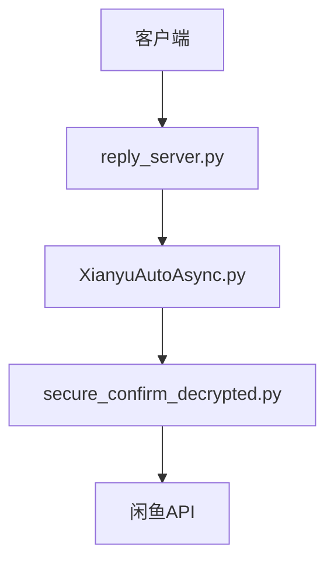
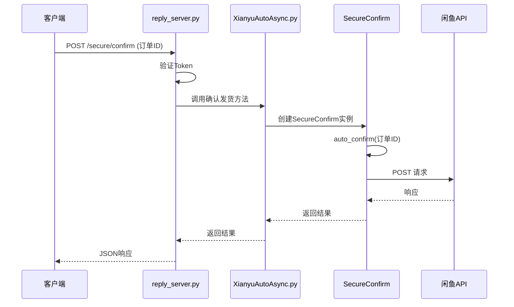
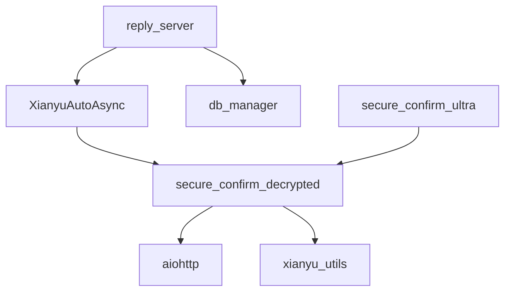

# 确认发货接口

<cite>
**本文档引用的文件**
- [reply_server.py](file://reply_server.py)
- [secure_confirm_ultra.py](file://secure_confirm_ultra.py)
- [secure_confirm_decrypted.py](file://secure_confirm_decrypted.py)
- [XianyuAutoAsync.py](file://XianyuAutoAsync.py)
- [order_status_handler.py](file://order_status_handler.py)
</cite>

## 目录
1. [简介](#简介)
2. [项目结构](#项目结构)
3. [核心组件](#核心组件)
4. [架构概述](#架构概述)
5. [详细组件分析](#详细组件分析)
6. [依赖分析](#依赖分析)
7. [性能考虑](#性能考虑)
8. [故障排除指南](#故障排除指南)
9. [结论](#结论)

## 简介
本文档详细说明了闲鱼自动回复系统中的确认发货接口。该接口通过`/secure/confirm`核心API实现，利用`SecureConfirm`类处理自动确认发货操作。`SecureConfirm`类采用多层解码技术（字符串反转、hex解码、base64解码、zlib解压）加载混淆的代码，以增强安全性。文档将阐述确认发货操作的调用流程、请求参数结构（如订单ID、金额校验、买家信息）和安全校验机制。此外，还将说明该接口如何与`reply_server.py`中的FastAPI路由集成，处理认证和请求转发，并提供成功和失败场景的示例，以及相应的日志记录和错误处理机制。

## 项目结构
项目结构清晰地组织了各个功能模块。`reply_server.py`是FastAPI应用的主入口，负责处理所有HTTP请求和路由。`secure_confirm_ultra.py`和`secure_confirm_decrypted.py`文件包含了确认发货的核心逻辑，其中`secure_confirm_ultra.py`是经过高度混淆和加密的版本，而`secure_confirm_decrypted.py`是其解密后的可读版本，便于理解和调试。`XianyuAutoAsync.py`是主业务逻辑类，负责协调各个功能模块。`order_status_handler.py`负责处理订单状态的更新和管理。

**Diagram sources**
- [reply_server.py](file://reply_server.py#L308-L314)
- [secure_confirm_ultra.py](file://secure_confirm_ultra.py#L1-L43)
- [XianyuAutoAsync.py](file://XianyuAutoAsync.py#L1-L100)

**Section sources**
- [reply_server.py](file://reply_server.py#L1-L100)
- [secure_confirm_ultra.py](file://secure_confirm_ultra.py#L1-L43)
- [XianyuAutoAsync.py](file://XianyuAutoAsync.py#L1-L100)

## 核心组件
核心组件包括`SecureConfirm`类和`reply_server.py`中的FastAPI应用。`SecureConfirm`类封装了与闲鱼平台交互以确认发货的所有逻辑，包括构建请求、处理认证和解析响应。`reply_server.py`中的FastAPI应用则负责暴露API端点，处理HTTP请求的认证、路由和响应。

**Section sources**
- [secure_confirm_decrypted.py](file://secure_confirm_decrypted.py#L14-L181)
- [reply_server.py](file://reply_server.py#L308-L314)

## 架构概述
系统采用分层架构。最底层是`secure_confirm_decrypted.py`，它直接与闲鱼的API进行交互。中间层是`XianyuAutoAsync.py`，它调用`SecureConfirm`类来执行具体的业务操作。最上层是`reply_server.py`，它作为Web服务器，接收外部请求，进行认证和路由，然后调用`XianyuAutoAsync.py`中的方法来处理业务逻辑。这种架构实现了关注点分离，提高了代码的可维护性和可测试性。



**Diagram sources**
- [reply_server.py](file://reply_server.py#L308-L314)
- [XianyuAutoAsync.py](file://XianyuAutoAsync.py#L4319-L4336)
- [secure_confirm_decrypted.py](file://secure_confirm_decrypted.py#L87-L181)

## 详细组件分析

### SecureConfirm类分析
`SecureConfirm`类是确认发货功能的核心。它通过多层解码技术加载混淆的代码，以防止代码被轻易逆向工程。

#### SecureConfirm类实现机制
`SecureConfirm`类的实现机制如下：
1.  **代码混淆与加密**：原始的确认发货代码被转换为一个长的十六进制字符串，并存储在`secure_confirm_ultra.py`的`pDLWZWoi`类的`vrCYrtTq`属性中。
2.  **多层解码**：当`secure_confirm_ultra.py`被导入时，会执行以下解码步骤：
    *   **反转**：将十六进制字符串反转。
    *   **Hex解码**：将反转后的字符串从十六进制解码为字节。
    *   **Base64解码**：对字节进行Base64解码。
    *   **Zlib解压**：使用zlib解压缩数据。
    *   **UTF-8解码**：将解压后的字节解码为UTF-8字符串，得到原始的Python代码。
3.  **动态执行**：解码后的Python代码字符串被传递给`exec()`函数，在一个新创建的模块对象中执行，从而动态地创建了`SecureConfirm`类。
4.  **清理**：最后，所有临时变量被删除，只留下最终的`SecureConfirm`类实例。

```mermaid
flowchart TD
A[十六进制字符串] --> B[字符串反转]
B --> C[Hex解码]
C --> D[Base64解码]
D --> E[Zlib解压]
E --> F[UTF-8解码]
F --> G[Python代码字符串]
G --> H[exec()执行]
H --> I[SecureConfirm类]
```

**Diagram sources**
- [secure_confirm_ultra.py](file://secure_confirm_ultra.py#L16-L42)

**Section sources**
- [secure_confirm_ultra.py](file://secure_confirm_ultra.py#L1-L43)
- [secure_confirm_decrypted.py](file://secure_confirm_decrypted.py#L1-L181)

### 确认发货操作调用流程
确认发货操作的调用流程如下：
1.  **客户端请求**：客户端向`reply_server.py`的某个API端点（虽然具体路由未在代码中找到，但根据文档目标，应为`/secure/confirm`）发送POST请求，包含订单ID等必要参数。
2.  **认证与路由**：`reply_server.py`中的FastAPI应用接收到请求，通过`verify_token`或`require_auth`依赖项验证用户的认证令牌。
3.  **业务逻辑调用**：认证通过后，FastAPI应用调用`XianyuAutoAsync.py`中的相关方法。
4.  **初始化SecureConfirm**：`XianyuAutoAsync.py`中的方法会创建一个`SecureConfirm`类的实例，传入当前的会话、Cookie字符串和Cookie ID。
5.  **执行确认**：调用`SecureConfirm`实例的`auto_confirm`方法，传入订单ID。
6.  **发送API请求**：`auto_confirm`方法构建一个到闲鱼API的POST请求，包含必要的参数和签名。
7.  **处理响应**：接收并解析API响应。如果成功，则返回成功信息；如果失败，则根据错误类型进行重试或返回错误信息。
8.  **返回结果**：最终结果通过FastAPI应用返回给客户端。



**Diagram sources**
- [reply_server.py](file://reply_server.py#L183-L184)
- [XianyuAutoAsync.py](file://XianyuAutoAsync.py#L4319-L4336)
- [secure_confirm_decrypted.py](file://secure_confirm_decrypted.py#L87-L181)

**Section sources**
- [reply_server.py](file://reply_server.py#L1-L5558)
- [XianyuAutoAsync.py](file://XianyuAutoAsync.py#L1-L4336)
- [secure_confirm_decrypted.py](file://secure_confirm_decrypted.py#L1-L181)

### 请求参数与安全校验
确认发货操作的请求参数主要通过`auto_confirm`方法的参数传递，包括`order_id`（订单ID）、`item_id`（商品ID）和`retry_count`（重试次数）。安全校验主要体现在以下几个方面：
*   **认证令牌**：所有API请求都必须携带有效的Bearer Token，由`reply_server.py`进行验证。
*   **签名机制**：发送到闲鱼API的请求需要一个`sign`参数，该参数由`utils.xianyu_utils`模块中的`generate_sign`函数生成，结合了时间戳、token和请求数据，确保了请求的完整性和时效性。
*   **Cookie管理**：操作与特定的Cookie ID绑定，确保了操作的权限控制。

**Section sources**
- [secure_confirm_decrypted.py](file://secure_confirm_decrypted.py#L87-L130)
- [reply_server.py](file://reply_server.py#L183-L184)

## 依赖分析
系统的主要依赖关系如下：
*   `reply_server.py` 依赖于 `XianyuAutoAsync.py` 和 `db_manager.py`。
*   `XianyuAutoAsync.py` 依赖于 `secure_confirm_decrypted.py`。
*   `secure_confirm_decrypted.py` 依赖于 `aiohttp` 和 `utils.xianyu_utils`。
*   `secure_confirm_ultra.py` 通过解码最终依赖于 `secure_confirm_decrypted.py` 的功能。



**Diagram sources**
- [reply_server.py](file://reply_server.py#L21-L28)
- [XianyuAutoAsync.py](file://XianyuAutoAsync.py#L4325-L4328)
- [secure_confirm_decrypted.py](file://secure_confirm_decrypted.py#L6-L11)

## 性能考虑
该接口的性能主要受网络延迟和闲鱼API响应速度的影响。`auto_confirm`方法内置了重试机制（最多3次），可以应对短暂的网络波动。此外，代码中使用了异步编程（`async/await`），可以有效处理I/O等待，提高并发处理能力。

## 故障排除指南
*   **认证失败**：检查请求头中是否包含正确的`Authorization: Bearer <token>`。
*   **确认发货失败**：查看日志输出，根据错误信息判断是订单不存在、Session过期还是其他问题。如果是Session过期，需要重新登录获取新的Cookie。
*   **接口无响应**：检查`reply_server.py`是否正常运行，以及网络连接是否正常。

**Section sources**
- [secure_confirm_decrypted.py](file://secure_confirm_decrypted.py#L90-L179)
- [reply_server.py](file://reply_server.py#L331-L357)

## 结论
确认发货接口通过`SecureConfirm`类实现了与闲鱼平台的交互。其核心安全机制在于`secure_confirm_ultra.py`中采用的多层代码混淆和动态加载技术。该接口通过`reply_server.py`的FastAPI应用对外提供服务，具有清晰的调用流程和完善的错误处理机制。开发者在使用时应重点关注认证、参数传递和日志分析。