# 自动发货执行接口

<cite>
**本文档引用的文件**   
- [secure_confirm_decrypted.py](file://secure_confirm_decrypted.py)
- [secure_confirm_ultra.py](file://secure_confirm_ultra.py)
- [secure_freeshipping_decrypted.py](file://secure_freeshipping_decrypted.py)
- [secure_freeshipping_ultra.py](file://secure_freeshipping_ultra.py)
- [order_status_handler.py](file://order_status_handler.py)
- [db_manager.py](file://db_manager.py)
- [utils/xianyu_utils.py](file://utils/xianyu_utils.py)
- [XianyuAutoAsync.py](file://XianyuAutoAsync.py)
</cite>

## 目录
1. [引言](#引言)
2. [核心API接口](#核心api接口)
3. [智能订单识别算法](#智能订单识别算法)
4. [批量发货操作](#批量发货操作)
5. [安全验证流程](#安全验证流程)
6. [日志记录机制](#日志记录机制)
7. [结论](#结论)

## 引言
本系统提供自动发货执行功能，主要通过`/secure/confirm`和`/secure/freeshipping`等核心API实现。系统采用多重安全验证机制，确保自动发货过程的安全性和可靠性。通过智能订单识别算法，系统能够准确识别订单信息并执行相应的发货操作。本文档详细说明了这些核心功能的实现方式和调用方法。

## 核心API接口
系统提供了两个核心API接口用于自动发货操作：`/secure/confirm`用于确认发货，`/secure/freeshipping`用于免拼发货。这两个接口都采用了加密和混淆技术来保护代码安全。

### 确认发货API (/secure/confirm)
`SecureConfirm`类提供了自动确认发货功能。该类通过`auto_confirm`方法实现订单的自动确认发货。


**Diagram sources**
- [secure_confirm_decrypted.py](file://secure_confirm_decrypted.py#L14-L181)

**Section sources**
- [secure_confirm_decrypted.py](file://secure_confirm_decrypted.py#L14-L181)

### 免拼发货API (/secure/freeshipping)
`SecureFreeshipping`类提供了自动免拼发货功能。该类通过`auto_freeshipping`方法实现订单的自动免拼发货。


**Diagram sources**
- [secure_freeshipping_decrypted.py](file://secure_freeshipping_decrypted.py#L7-L131)

**Section sources**
- [secure_freeshipping_decrypted.py](file://secure_freeshipping_decrypted.py#L7-L131)

## 智能订单识别算法
系统通过智能订单识别算法来确保订单信息的准确性和安全性。该算法主要包括金额校验、买家校验等安全机制。

### 金额校验机制
系统通过数据库中的订单信息进行金额校验。在`order_status_handler.py`文件中，系统定义了订单状态处理器，用于处理订单状态更新逻辑。

```mermaid
classDiagram
class OrderStatusHandler {
+config : 配置信息
+status_mapping : 状态映射
+pending_updates : 待处理的订单状态更新队列
+update_order_status(order_id, new_status, cookie_id, context) : 更新订单状态
+_is_valid_status_transition(current_status, new_status) : 检查状态转换是否合理
+_get_allowed_transitions(current_status) : 获取允许转换到的状态列表
+_check_refund_message(message, send_message) : 检查退款申请消息
+_record_status_history(order_id, from_status, to_status, context) : 记录订单状态历史
+_get_previous_status(order_id) : 获取订单的上一次状态
+_add_to_pending_updates(order_id, new_status, cookie_id, context) : 添加到待处理更新队列
+process_pending_updates(order_id) : 处理指定订单的待处理更新
+process_all_pending_updates() : 处理所有待处理的更新
+get_pending_updates_count() : 获取待处理更新的数量
+clear_old_pending_updates(max_age_hours) : 清理过期的待处理更新
+handle_system_message(message, send_message, cookie_id, msg_time) : 处理系统消息并更新订单状态
+handle_red_reminder_message(message, red_reminder, user_id, cookie_id, msg_time) : 处理红色提醒消息并更新订单状态
}
OrderStatusHandler --> OrderStatusHandler._is_valid_status_transition : "调用"
OrderStatusHandler --> OrderStatusHandler._get_allowed_transitions : "调用"
OrderStatusHandler --> OrderStatusHandler._check_refund_message : "调用"
OrderStatusHandler --> OrderStatusHandler._record_status_history : "调用"
OrderStatusHandler --> OrderStatusHandler._get_previous_status : "调用"
OrderStatusHandler --> OrderStatusHandler._add_to_pending_updates : "调用"
OrderStatusHandler --> OrderStatusHandler.process_pending_updates : "调用"
OrderStatusHandler --> OrderStatusHandler.process_all_pending_updates : "调用"
OrderStatusHandler --> OrderStatusHandler.get_pending_updates_count : "调用"
OrderStatusHandler --> OrderStatusHandler.clear_old_pending_updates : "调用"
OrderStatusHandler --> OrderStatusHandler.handle_system_message : "调用"
OrderStatusHandler --> OrderStatusHandler.handle_red_reminder_message : "调用"
```



**Diagram sources**
- [order_status_handler.py](file://order_status_handler.py#L26-L800)

**Section sources**
- [order_status_handler.py](file://order_status_handler.py#L26-L800)

### 买家校验机制
系统通过`db_manager.py`文件中的数据库管理类来实现买家校验。该类提供了持久化存储Cookie和关键字的功能。

```mermaid
classDiagram
    class DBManager {
        +db_path: 数据库路径
        +conn: 数据库连接
        +lock: 锁
        +sql_log_enabled: SQL日志是否启用
        +sql_log_level: SQL日志级别
        +init_db(): 初始化数据库表结构
        +get_system_setting(key): 获取系统设置
        +set_system_setting(key, value, description): 设置系统设置
        +get_user_by_id(user_id): 根据用户ID获取用户信息
        +get_cookie_by_id(cookie_id): 根据Cookie ID获取Cookie信息
        +get_cookies_by_user_id(user_id): 根据用户ID获取所有Cookie
        +add_cookie(cookie_id, value, user_id, auto_confirm, remark, pause_duration, username, password, show_browser): 添加Cookie
        +update_cookie_value(cookie_id, value): 更新Cookie值
        +update_cookie_remark(cookie_id, remark): 更新Cookie备注
        +update_cookie_pause_duration(cookie_id, pause_duration): 更新Cookie暂停时长
        +update_cookie_account_info(cookie_id, username, password, show_browser): 更新Cookie账号信息
        +delete_cookie(cookie_id): 删除Cookie
        +get_keywords_by_cookie_id(cookie_id): 根据Cookie ID获取关键字
        +add_keyword(cookie_id, keyword, reply, item_id, type, image_url): 添加关键字
        +update_keyword(cookie_id, keyword, reply, item_id, type, image_url): 更新关键字
        +delete_keyword(cookie_id, keyword): 删除关键字
        +get_cards(): 获取所有卡券
        +get_card_by_id(card_id): 根据ID获取卡券
        +add_card(name, type, api_config, text_content, data_content, image_url, description, enabled, delay_seconds, is_multi_spec, spec_name, spec_value, user_id): 添加卡券
        +update_card(card_id, name, type, api_config, text_content, data_content, image_url, description, enabled, delay_seconds, is_multi_spec, spec_name, spec_value): 更新卡券
        +update_card_image_url(card_id, image_url): 更新卡券图片URL
        +delete_card(card_id): 删除卡券
        +get_delivery_rules(): 获取所有发货规则
        +get_delivery_rules_by_cookie_id(cookie_id): 根据Cookie ID获取发货规则
        +get_delivery_rules_by_keyword(keyword): 根据关键字获取发货规则
        +get_delivery_rules_by_card_id(card_id): 根据卡券ID获取发货规则
        +add_delivery_rule(keyword, card_id, delivery_count, enabled, description, delivery_times): 添加发货规则
        +update_delivery_rule(rule_id, keyword, card_id, delivery_count, enabled, description): 更新发货规则
        +delete_delivery_rule(rule_id): 删除发货规则
        +get_orders(): 获取所有订单
        +get_order_by_id(order_id): 根据订单ID获取订单
        +get_orders_by_cookie_id(cookie_id): 根据Cookie ID获取订单
        +get_orders_by_buyer_id(buyer_id): 根据买家ID获取订单
        +insert_or_update_order(order_id, item_id, buyer_id, spec_name, spec_value, quantity, amount, order_status, cookie_id): 插入或更新订单
        +delete_order(order_id): 删除订单
        +get_items_by_cookie(cookie_id): 根据Cookie获取商品列表
        +get_all_items(): 获取所有商品
        +get_item_info_by_id(item_id): 根据商品ID获取商品信息
        +save_item_info(cookie_id, item_id, item_title, item_description, item_category, item_price, item_detail, is_multi_spec): 保存商品信息
        +batch_save_item_basic_info(items): 批量保存商品基本信息
        +delete_item_info(item_id): 删除商品信息
        +get_default_reply(cookie_id): 根据Cookie ID获取默认回复
        +set_default_reply(cookie_id, enabled, reply_content, reply_once): 设置默认回复
        +get_default_reply_record(cookie_id, chat_id): 根据Cookie ID和聊天ID获取默认回复记录
        +add_default_reply_record(cookie_id, chat_id): 添加默认回复记录
        +delete_default_reply_record(record_id): 删除默认回复记录
        +get_notification_channels(): 获取所有通知渠道
        +get_notification_channel_by_id(channel_id): 根据ID获取通知渠道
        +add_notification_channel(name, type, config, enabled): 添加通知渠道
        +update_notification_channel(channel_id, name, type, config, enabled): 更新通知渠道
        +delete_notification_channel(channel_id): 删除通知渠道
        +get_message_notifications(): 获取所有消息通知配置
        +get_message_notifications_by_cookie_id(cookie_id): 根据Cookie ID获取消息通知配置
        +get_message_notifications_by_channel_id(channel_id): 根据渠道ID获取消息通知配置
        +add_message_notification(cookie_id, channel_id, enabled): 添加消息通知配置
        +update_message_notification(notification_id, enabled): 更新消息通知配置
        +delete_message_notification(notification_id): 删除消息通知配置
        +get_risk_control_logs(): 获取所有风控日志
        +get_risk_control_log_by_id(log_id): 根据ID获取风控日志
        +add_risk_control_log(cookie_id, event_type, event_description, processing_result, processing_status, error_message): 添加风控日志
        +update_risk_control_log(log_id, processing_result, processing_status, error_message): 更新风控日志
        +delete_risk_control_log(log_id): 删除风控日志
        +get_ai_reply_settings(cookie_id): 根据Cookie ID获取AI回复设置
        +set_ai_reply_settings(cookie_id, ai_enabled, model_name, api_key, base_url, max_discount_percent, max_discount_amount, max_bargain_rounds, custom_prompts): 设置AI回复设置
        +get_ai_conversations(cookie_id): 根据Cookie ID获取AI对话历史
        +add_ai_conversation(cookie_id, chat_id, user_id, item_id, role, content, intent, bargain_count): 添加AI对话
        +get_ai_item_cache(item_id): 根据商品ID获取AI商品信息缓存
        +set_ai_item_cache(item_id, data, price, description): 设置AI商品信息缓存
        +delete_ai_item_cache(item_id): 删除AI商品信息缓存
        +get_user_by_username(username): 根据用户名获取用户
        +get_user_by_email(email): 根据邮箱获取用户
        +create_user(username, email, password_hash): 创建用户
        +update_user_password(user_id, password_hash): 更新用户密码
        +delete_user_and_data(user_id): 删除用户及其所有数据
        +verify_email_code(email, code, type): 验证邮箱验证码
        +add_email_verification(email, code, expires_at, type): 添加邮箱验证码
        +get_email_verification(email, type): 根据邮箱和类型获取邮箱验证码
        +delete_email_verification(email, type): 删除邮箱验证码
        +add_captcha_code(session_id, code, expires_at): 添加图形验证码
        +get_captcha_code(session_id): 根据session_id获取图形验证码
        +delete_captcha_code(session_id): 删除图形验证码
        +get_user_settings(user_id): 根据用户ID获取用户设置
        +get_user_setting(user_id, key): 根据用户ID和键获取用户设置
        +set_user_setting(user_id, key, value, description): 设置用户设置
        +delete_user_setting(user_id, key): 删除用户设置
        +get_item_multi_quantity_delivery_status(cookie_id, item_id): 获取商品多数量发货状态
        +get_item_by_id(item_id): 根据商品ID获取商品信息
        +get_items_by_cookie_id(cookie_id): 根据Cookie ID获取商品信息
        +save_image_keyword(cookie_id, keyword, image_path): 保存图片关键字
        +get_image_keyword(cookie_id, keyword): 根据Cookie ID和关键字获取图片关键字
        +delete_image_keyword(cookie_id, keyword): 删除图片关键字
        +get_all_image_keywords(): 获取所有图片关键字
        +get_image_keywords_by_cookie_id(cookie_id): 根据Cookie ID获取图片关键字
        +get_image_keywords_by_keyword(keyword): 根据关键字获取图片关键字
        +get_image_keywords_by_cookie_id_and_keyword(cookie_id, keyword): 根据Cookie ID和关键字获取图片关键字
        +get_image_keywords_by_cookie_id_and_image_path(cookie_id, image_path): 根据Cookie ID和图片路径获取图片关键字
        +get_image_keywords_by_image_path(image_path): 根据图片路径获取图片关键字
        +get_image_keywords_by_cookie_id_and_image_path_and_keyword(cookie_id, image_path, keyword): 根据Cookie ID、图片路径和关键字获取图片关键字
        +get_image_keywords_by_image_path_and_keyword(image_path, keyword): 根据图片路径和关键字获取图片关键字
        +get_image_keywords_by_cookie_id_and_keyword_and_image_path(cookie_id, keyword, image_path): 根据Cookie ID、关键字和图片路径获取图片关键字
        +get_image_keywords_by_keyword_and_image_path(keyword, image_path): 根据关键字和图片路径获取图片关键字
        +get_image_keywords_by_cookie_id_and_keyword_and_image_path_and_keyword(cookie_id, keyword1, image_path, keyword2): 根据Cookie ID、关键字1、图片路径和关键字2获取图片关键字
        +get_image_keywords_by_keyword_and_image_path_and_keyword(keyword1, image_path, keyword2): 根据关键字1、图片路径和关键字2获取图片关键字
        +get_image_keywords_by_cookie_id_and_keyword_and_image_path_and_keyword_and_image_path(cookie_id, keyword1, image_path1, keyword2, image_path2): 根据Cookie ID、关键字1、图片路径1、关键字2和图片路径2获取图片关键字
        +get_image_keywords_by_keyword_and_image_path_and_keyword_and_image_path(keyword1, image_path1, keyword2, image_path2): 根据关键字1、图片路径1、关键字2和图片路径2获取图片关键字
        +get_image_keywords_by_cookie_id_and_keyword_and_image_path_and_keyword_and_image_path_and_keyword(cookie_id, keyword1, image_path1, keyword2, image_path2, keyword3): 根据Cookie ID、关键字1、图片路径1、关键字2、图片路径2和关键字3获取图片关键字
        +get_image_keywords_by_keyword_and_image_path_and_keyword_and_image_path_and_keyword(keyword1, image_path1, keyword2, image_path2, keyword3): 根据关键字1、图片路径1、关键字2、图片路径2和关键字3获取图片关键字
        +get_image_keywords_by_cookie_id_and_keyword_and_image_path_and_keyword_and_image_path_and_keyword_and_image_path(cookie_id, keyword1, image_path1, keyword2, image_path2, keyword3, image_path3): 根据Cookie ID、关键字1、图片路径1、关键字2、图片路径2、关键字3和图片路径3获取图片关键字
        +get_image_keywords_by_keyword_and_image_path_and_keyword_and_image_path_and_keyword_and_image_path(keyword1, image_path1, keyword2, image_path2, keyword3, image_path3): 根据关键字1、图片路径1、关键字2、图片路径2、关键字3和图片路径3获取图片关键字
        +get_image_keywords_by_cookie_id_and_keyword_and_image_path_and_keyword_and_image_path_and_keyword_and_image_path_and_keyword(cookie_id, keyword1, image_path1, keyword2, image_path2, keyword3, image_path3, keyword4): 根据Cookie ID、关键字1、图片路径1、关键字2、图片路径2、关键字3、图片路径3和关键字4获取图片关键字
        +get_image_keywords_by_keyword_and_image_path_and_keyword_and_image_path_and_keyword_and_image_path_and_keyword(keyword1, image_path1, keyword2, image_path2, keyword3, image_path3, keyword4): 根据关键字1、图片路径1、关键字2、图片路径2、关键字3、图片路径3和关键字4获取图片关键字
        +get_image_keywords_by_cookie_id_and_keyword_and_image_path_and_keyword_and_image_path_and_keyword_and_image_path_and_keyword_and_image_path(cookie_id, keyword1, image_path1, keyword2, image_path2, keyword3, image_path3, keyword4, image_path4): 根据Cookie ID、关键字1、图片路径1、关键字2、图片路径2、关键字3、图片路径3、关键字4和图片路径4获取图片关键字
        +get_image_keywords_by_keyword_and_image_path_and_keyword_and_image_path_and_keyword_and_image_path_and_keyword_and_image_path(keyword1, image_path1, keyword2, image_path2, keyword3, image_path3, keyword4, image_path4): 根据关键字1、图片路径1、关键字2、图片路径2、关键字3、图片路径3、关键字4和图片路径4获取图片关键字
        +get_image_keywords_by_cookie_id_and_keyword_and_image_path_and_keyword_and_image_path_and_keyword_and_image_path_and_keyword_and_image_path_and_keyword(cookie_id, keyword1, image_path1, keyword2, image_path2, keyword3, image_path3, keyword4, image_path4, keyword5): 根据Cookie ID、关键字1、图片路径1、关键字2、图片路径2、关键字3、图片路径3、关键字4、图片路径4和关键字5获取图片关键字
        +get_image_keywords_by_keyword_and_image_path_and_keyword_and_image_path_and_keyword_and_image_path_and_keyword_and_image_path_and_keyword(keyword1, image_path1, keyword2, image_path2, keyword3, image_path3, keyword4, image_path4, keyword5): 根据关键字1、图片路径1、关键字2、图片路径2、关键字3、图片路径3、关键字4、图片路径4和关键字5获取图片关键字
        +get_image_keywords_by_cookie_id_and_keyword_and_image_path_and_keyword_and_image_path_and_keyword_and_image_path_and_keyword_and_image_path_and_keyword_and_image_path(cookie_id, keyword1, image_path1, keyword2, image_path2, keyword3, image_path3, keyword4, image_path4, keyword5, image_path5): 根据Cookie ID、关键字1、图片路径1、关键字2、图片路径2、关键字3、图片路径3、关键字4、图片路径4、关键字5和图片路径5获取图片关键字
        +get_image_keywords_by_keyword_and_image_path_and_keyword_and_image_path_and_keyword_and_image_path_and_keyword_and_image_path_and_keyword_and_image_path(keyword1, image_path1, keyword2, image_path2, keyword3, image_path3, keyword4, image_path4, keyword5, image_path5): 根据关键字1、图片路径1、关键字2、图片路径2、关键字3、图片路径3、关键字4、图片路径4、关键字5和图片路径5获取图片关键字
        +get_image_keywords_by_cookie_id_and_keyword_and_image_path_and_keyword_and_image_path_and_keyword_and_image_path_and_keyword_and_image_path_and_keyword_and_image_path_and_keyword(cookie_id, keyword1, image_path1, keyword2, image_path2, keyword3, image_path3, keyword4, image_path4, keyword5, image_path5, keyword6): 根据Cookie ID、关键字1、图片路径1、关键字2、图片路径2、关键字3、图片路径3、关键字4、图片路径4、关键字5、图片路径5和关键字6获取图片关键字
        +get_image_keywords_by_keyword_and_image_path_and_keyword_and_image_path_and_keyword_and_image_path_and_keyword_and_image_path_and_keyword_and_image_path_and_keyword(keyword1, image_path1, keyword2, image_path2, keyword3, image_path3, keyword4, image_path4, keyword5, image_path5, keyword6): 根据关键字1、图片路径1、关键字2、图片路径2、关键字3、图片路径3、关键字4、图片路径4、关键字5、图片路径5和关键字6获取图片关键字
        +get_image_keywords_by_cookie_id_and_keyword_and_image_path_and_keyword_and_image_path_and_keyword_and_image_path_and_keyword_and_image_path_and_keyword_and_image_path_and_keyword_and_image_path(cookie_id, keyword1, image_path1, keyword2, image_path2, keyword3, image_path3, keyword4, image_path4, keyword5, image_path5, keyword6, image_path6): 根据Cookie ID、关键字1、图片路径1、关键字2、图片路径2、关键字3、图片路径3、关键字4、图片路径4、关键字5、图片路径5、关键字6和图片路径6获取图片关键字
        +get_image_keywords_by_keyword_and_image_path_and_keyword_and_image_path_and_keyword_and_image_path_and_keyword_and_image_path_and_keyword_and_image_path_and_keyword_and_image_path(keyword1, image_path1, keyword2, image_path2, keyword3, image_path3, keyword4, image_path4, keyword5, image_path5, keyword6, image_path6): 根据关键字1、图片路径1、关键字2、图片路径2、关键字3、图片路径3、关键字4、图片路径4、关键字5、图片路径5、关键字6和图片路径6获取图片关键字
        +get_image_keywords_by_cookie_id_and_keyword_and_image_path_and_keyword_and_image_path_and_keyword_and_image_path_and_keyword_and_image_path_and_keyword_and_image_path_and_keyword_and_image_path_and_keyword(cookie_id, keyword1, image_path1, keyword2, image_path2, keyword3, image_path3, keyword4, image_path4, keyword5, image_path5, keyword6, image_path6, keyword7): 根据Cookie ID、关键字1、图片路径1、关键字2、图片路径2、关键字3、图片路径3、关键字4、图片路径4、关键字5、图片路径5、关键字6、图片路径6和关键字7获取图片关键字
        +get_image_keywords_by_keyword_and_image_path_and_keyword_and_image_path_and_keyword_and_image_path_and_keyword_and_image_path_and_keyword_and_image_path_and_keyword_and_image_path_and_keyword(keyword1, image_path1, keyword2, image_path2, keyword3, image_path3, keyword4, image_path4, keyword5, image_path5, keyword6, image_path6, keyword7): 根据关键字1、图片路径1、关键字2、图片路径2、关键字3、图片路径3、关键字4、图片路径4、关键字5、图片路径5、关键字6、图片路径6和关键字7获取图片关键字
        +get_image_keywords_by_cookie_id_and_keyword_and_image_path_and_keyword_and_image_path_and_keyword_and_image_path_and_keyword_and_image_path_and_keyword_and_image_path_and_keyword_and_image_path_and_keyword_and_image_path(cookie_id, keyword1, image_path1, keyword2, image_path2, keyword3, image_path3, keyword4, image_path4, keyword5, image_path5, keyword6, image_path6, keyword7, image_path7): 根据Cookie ID、关键字1、图片路径1、关键字2、图片路径2、关键字3、图片路径3、关键字4、图片路径4、关键字5、图片路径5、关键字6、图片路径6、关键字7和图片路径7获取图片关键字
        +get_image_keywords_by_keyword_and_image_path_and_keyword_and_image_path_and_keyword_and_image_path_and_keyword_and_image_path_and_keyword_and_image_path_and_keyword_and_image_path_and_keyword_and_image_path(keyword1, image_path1, keyword2, image_path2, keyword3, image_path3, keyword4, image_path4, keyword5, image_path5, keyword6, image_path6, keyword7, image_path7): 根据关键字1、图片路径1、关键字2、图片路径2、关键字3、图片路径3、关键字4、图片路径4、关键字5、图片路径5、关键字6、图片路径6、关键字7和图片路径7获取图片关键字
        +get_image_keywords_by_cookie_id_and_keyword_and_image_path_and_keyword_and_image_path_and_keyword_and_image_path_and_keyword_and_image_path_and_keyword_and_image_path_and_keyword_and_image_path_and_keyword_and_image_path_and_keyword(cookie_id, keyword1, image_path1, keyword2, image_path2, keyword3, image_path3, keyword4, image_path4, keyword5, image_path5, keyword6, image_path6, keyword7, image_path7, keyword8): 根据Cookie ID、关键字1、图片路径1、关键字2、图片路径2、关键字3、图片路径3、关键字4、图片路径4、关键字5、图片路径5、关键字6、图片路径6、关键字7、图片路径7和关键字8获取图片关键字
        +get_image_keywords_by_keyword_and_image_path_and_keyword_and_image_path_and_keyword_and_image_path_and_keyword_and_image_path_and_keyword_and_image_path_and_keyword_and_image_path_and_keyword_and_image_path_and_keyword(keyword1, image_path1, keyword2, image_path2, keyword3, image_path3, keyword4, image_path4, keyword5, image_path5, keyword6, image_path6, keyword7, image_path7, keyword8): 根据关键字1、图片路径1、关键字2、图片路径2、关键字3、图片路径3、关键字4、图片路径4、关键字5、图片路径5、关键字6、图片路径6、关键字7、图片路径7和关键字8获取图片关键字
        +get_image_keywords_by_cookie_id_and_keyword_and_image_path_and_keyword_and_image_path_and_keyword_and_image_path_and_keyword_and_image_path_and_keyword_and_image_path_and_keyword_and_image_path_and_keyword_and_image_path_and_keyword_and_image_path(cookie_id, keyword1, image_path1, keyword2, image_path2, keyword3, image_path3, keyword4, image_path4, keyword5, image_path5, keyword6, image_path6, keyword7, image_path7, keyword8, image_path8): 根据Cookie ID、关键字1、图片路径1、关键字2、图片路径2、关键字3、图片路径3、关键字4、图片路径4、关键字5、图片路径5、关键字6、图片路径6、关键字7、图片路径7、关键字8和图片路径8获取图片关键字
        +get_image_keywords_by_keyword_and_image_path_and_keyword_and_image_path_and_keyword_and_image_path_and_keyword_and_image_path_and_keyword_and_image_path_and_keyword_and_image_path_and_keyword_and_image_path_and_keyword_and_image_path(keyword1, image_path1, keyword2, image_path2, keyword3, image_path3, keyword4, image_path4, keyword5, image_path5, keyword6, image_path6, keyword7, image_path7, keyword8, image_path8): 根据关键字1、图片路径1、关键字2、图片路径2、关键字3、图片路径3、关键字4、图片路径4、关键字5、图片路径5、关键字6、图片路径6、关键字7、图片路径7、关键字8和图片路径8获取图片关键字
        +get_image_keywords_by_cookie_id_and_keyword_and_image_path_and_keyword_and_image_path_and_keyword_and_image_path_and_keyword_and_image_path_and_keyword_and_image_path_and_keyword_and_image_path_and_keyword_and_image_path_and_keyword_and_image_path_and_keyword(cookie_id, keyword1, image_path1, keyword2, image_path2, keyword3, image_path3, keyword4, image_path4, keyword5, image_path5, keyword6, image_path6, keyword7, image_path7, keyword8, image_path8, keyword9): 根据Cookie ID、关键字1、图片路径1、关键字2、图片路径2、关键字3、图片路径3、关键字4、图片路径4、关键字5、图片路径5、关键字6、图片路径6、关键字7、图片路径7、关键字8、图片路径8和关键字9获取图片关键字
        +get_image_keywords_by_keyword_and_image_path_and_keyword_and_image_path_and_keyword_and_image_path_and_keyword_and_image_path_and_keyword_and_image_path_and_keyword_and_image_path_and_keyword_and_image_path_and_keyword_and_image_path_and_keyword(keyword1, image_path1, keyword2, image_path2, keyword3, image_path3, keyword4, image_path4, keyword5, image_path5, keyword6, image_path6, keyword7, image_path7, keyword8, image_path8, keyword9): 根据关键字1、图片路径1、关键字2、图片路径2、关键字3、图片路径3、关键字4、图片路径4、关键字5、图片路径5、关键字6、图片路径6、关键字7、图片路径7、关键字8、图片路径8和关键字9获取图片关键字
        +get_image_keywords_by_cookie_id_and_keyword_and_image_path_and_keyword_and_image_path_and_keyword_and_image_path_and_keyword_and_image_path_and_keyword_and_image_path_and_keyword_and_image_path_and_keyword_and_image_path_and_keyword_and_image_path_and_keyword_and_image_path(cookie_id, keyword1, image_path1, keyword2, image_path2, keyword3, image_path3, keyword4, image_path4, keyword5, image_path5, keyword6, image_path6, keyword7, image_path7, keyword8, image_path8, keyword9, image_path9): 根据Cookie ID、关键字1、图片路径1、关键字2、图片路径2、关键字3、图片路径3、关键字4、图片路径4、关键字5、图片路径5、关键字6、图片路径6、关键字7、图片路径7、关键字8、图片路径8、关键字9和图片路径9获取图片关键字
        +get_image_keywords_by_keyword_and_image_path_and_keyword_and_image_path_and_keyword_and_image_path_and_keyword_and_image_path_and_keyword_and_image_path_and_keyword_and_image_path_and_keyword_and_image_path_and_keyword_and_image_path_and_keyword_and_image_path(keyword1, image_path1, keyword2, image_path2, keyword3, image_path3, keyword4, image_path4, keyword5, image_path5, keyword6, image_path6, keyword7, image_path7, keyword8, image_path8, keyword9, image_path9): 根据关键字1、图片路径1、关键字2、图片路径2、关键字3、图片路径3、关键字4、图片路径4、关键字5、图片路径5、关键字6、图片路径6、关键字7、图片路径7、关键字8、图片路径8、关键字9和图片路径9获取图片关键字
        +get_image_keywords_by_cookie_id_and_keyword_and_image_path_and_keyword_and_image_path_and_keyword_and_image_path_and_keyword_and_image_path_and_keyword_and_image_path_and_keyword_and_image_path_and_keyword_and_image_path_and_keyword_and_image_path_and_keyword_and_image_path_and_keyword(cookie_id, keyword1, image_path1, keyword2, image_path2, keyword3, image_path3, keyword4, image_path4, keyword5, image_path5, keyword6, image_path6, keyword7, image_path7, keyword8, image_path8, keyword9, image_path9, keyword10): 根据Cookie ID、关键字1、图片路径1、关键字2、图片路径2、关键字3、图片路径3、关键字4、图片路径4、关键字5、图片路径5、关键字6、图片路径6、关键字7、图片路径7、关键字8、图片路径8、关键字9、图片路径9和关键字10获取图片关键字
        +get_image_keywords_by_keyword_and_image_path_and_keyword_and_image_path_and_keyword_and_image_path_and_keyword_and_image_path_and_keyword_and_image_path_and_keyword_and_image_path_and_keyword_and_image_path_and_keyword_and_image_path_and_keyword_and_image_path_and_keyword(keyword1, image_path1, keyword2, image_path2, keyword3, image_path3, keyword4, image_path4, keyword5, image_path5, keyword6, image_path6, keyword7, image_path7, keyword8, image_path8, keyword9, image_path9, keyword10): 根据关键字1、图片路径1、关键字2、图片路径2、关键字3、图片路径3、关键字4、图片路径4、关键字5、图片路径5、关键字6、图片路径6、关键字7、图片路径7、关键字8、图片路径8、关键字9、图片路径9和关键字10获取图片关键字
    }
    
    DBManager --> DBManager.init_db : "调用"
    DBManager --> DBManager.get_system_setting : "调用"
    DBManager --> DBManager.set_system_setting : "调用"
    DBManager --> DBManager.get_user_by_id : "调用"
    DBManager --> DBManager.get_cookie_by_id : "调用"
    DBManager --> DBManager.get_cookies_by_user_id : "调用"
    DBManager --> DBManager.add_cookie : "调用"
    DBManager --> DBManager.update_cookie_value : "调用"
    DBManager --> DBManager.update_cookie_remark : "调用"
    DBManager --> DBManager.update_cookie_pause_duration : "调用"
    DBManager --> DBManager.update_cookie_account_info : "调用"
    DBManager --> DBManager.delete_cookie : "调用"
    DBManager --> DBManager.get_keywords_by_cookie_id : "调用"
    DBManager --> DBManager.add_keyword : "调用"
    DBManager --> DBManager.update_keyword : "调用"
    DBManager --> DBManager.delete_keyword : "调用"
    DBManager --> DBManager.get_cards : "调用"
    DBManager --> DBManager.get_card_by_id : "调用"
    DBManager --> DBManager.add_card : "调用"
    DBManager --> DBManager.update_card : "调用"
    DBManager --> DBManager.update_card_image_url : "调用"
    DBManager --> DBManager.delete_card : "调用"
    DBManager --> DBManager.get_delivery_rules : "调用"
    DBManager --> DBManager.get_delivery_rules_by_cookie_id : "调用"
    DBManager --> DBManager.get_delivery_rules_by_keyword : "调用"
    DBManager --> DBManager.get_delivery_rules_by_card_id : "调用"
    DBManager --> DBManager.add_delivery_rule : "调用"
    DBManager --> DBManager.update_delivery_rule : "调用"
    DBManager --> DBManager.delete_delivery_rule : "调用"
    DBManager --> DBManager.get_orders : "调用"
    DBManager --> DBManager.get_order_by_id : "调用"
    DBManager --> DBManager.get_orders_by_cookie_id : "调用"
    DBManager --> DBManager.get_orders_by_buyer_id : "调用"
    DBManager --> DBManager.insert_or_update_order : "调用"
    DBManager --> DBManager.delete_order : "调用"
    DBManager --> DBManager.get_items_by_cookie : "调用"
    DBManager --> DBManager.get_all_items : "调用"
    DBManager --> DBManager.get_item_info_by_id : "调用"
    DBManager --> DBManager.save_item_info : "调用"
    DBManager --> DBManager.batch_save_item_basic_info : "调用"
    DBManager --> DBManager.delete_item_info : "调用"
    DBManager --> DBManager.get_default_reply : "调用"
    DBManager --> DBManager.set_default_reply : "调用"
    DBManager --> DBManager.get_default_reply_record : "调用"
    DBManager --> DBManager.add_default_reply_record : "调用"
    DBManager --> DBManager.delete_default_reply_record : "调用"
    DBManager --> DBManager.get_notification_channels : "调用"
    DBManager --> DBManager.get_notification_channel_by_id : "调用"
    DBManager --> DBManager.add_notification_channel : "调用"
    DBManager --> DBManager.update_notification_channel : "调用"
    DBManager --> DBManager.delete_notification_channel : "调用"
    DBManager --> DBManager.get_message_notifications : "调用"
    DBManager --> DBManager.get_message_notifications_by_cookie_id : "调用"
    DBManager --> DBManager.get_message_notifications_by_channel_id : "调用"
    DBManager --> DBManager.add_message_notification : "调用"
    DBManager --> DBManager.update_message_notification : "调用"
    DBManager --> DBManager.delete_message_notification : "调用"
    DBManager --> DBManager.get_risk_control_logs : "调用"
    DBManager --> DBManager.get_risk_control_log_by_id : "调用"
    DBManager --> DBManager.add_risk_control_log : "调用"
    DBManager --> DBManager.update_risk_control_log : "调用"
    DBManager --> DBManager.delete_risk_control_log : "调用"
    DBManager --> DBManager.get_ai_reply_settings : "调用"
    DBManager --> DBManager.set_ai_reply_settings : "调用"
    DBManager --> DBManager.get_ai_conversations : "调用"
    DBManager --> DBManager.add_ai_conversation : "调用"
    DBManager --> DBManager.get_ai_item_cache : "调用"
    DBManager --> DBManager.set_ai_item_cache : "调用"
    DBManager --> DBManager.delete_ai_item_cache : "调用"
    DBManager --> DBManager.get_user_by_username : "调用"
    DBManager --> DBManager.get_user_by_email : "调用"
    DBManager --> DBManager.create_user : "调用"
    DBManager --> DBManager.update_user_password : "调用"
    DBManager --> DBManager.delete_user_and_data : "调用"
    DBManager --> DBManager.verify_email_code : "调用"
    DBManager --> DBManager.add_email_verification : "调用"
    DBManager --> DBManager.get_email_verification : "调用"
    DBManager --> DBManager.delete_email_verification : "调用"
    DBManager --> DBManager.add_captcha_code : "调用"
    DBManager --> DBManager.get_captcha_code : "调用"
    DBManager --> DBManager.delete_captcha_code : "调用"
    DBManager --> DBManager.get_user_settings : "调用"
    DBManager --> DBManager.get_user_setting : "调用"
    DBManager --> DBManager.set_user_setting : "调用"
    DBManager --> DBManager.delete_user_setting : "调用"
    DBManager --> DBManager.get_item_multi_quantity_delivery_status : "调用"
    DBManager --> DBManager.get_item_by_id : "调用"
    DBManager --> DBManager.get_items_by_cookie_id : "调用"
    DBManager --> DBManager.save_image_keyword : "调用"
    DBManager --> DBManager.get_image_keyword : "调用"
    DBManager --> DBManager.delete_image_keyword : "调用"
    DBManager --> DBManager.get_all_image_keywords : "调用"
    DBManager --> DBManager.get_image_keywords_by_cookie_id : "调用"
    DBManager --> DBManager.get_image_keywords_by_keyword : "调用"
    DBManager --> DBManager.get_image_keywords_by_cookie_id_and_keyword : "调用"
    DBManager --> DBManager.get_image_keywords_by_cookie_id_and_image_path : "调用"
    DBManager --> DBManager.get_image_keywords_by_image_path : "调用"
    DBManager --> DBManager.get_image_keywords_by_cookie_id_and_keyword_and_image_path : "调用"
    DBManager --> DBManager.get_image_keywords_by_keyword_and_image_path : "调用"
    DBManager --> DBManager.get_image_keywords_by_cookie_id_and_keyword_and_image_path_and_keyword : "调用"
    DBManager --> DBManager.get_image_keywords_by_keyword_and_image_path_and_keyword : "调用"
    DBManager --> DBManager.get_image_keywords_by_cookie_id_and_keyword_and_image_path_and_keyword_and_image_path : "调用"
    DBManager --> DBManager.get_image_keywords_by_keyword_and_image_path_and_keyword_and_image_path : "调用"
    DBManager --> DBManager.get_image_keywords_by_cookie_id_and_keyword_and_image_path_and_keyword_and_image_path_and_keyword : "调用"
    DBManager --> DBManager.get_image_keywords_by_keyword_and_image_path_and_keyword_and_image_path_and_keyword : "调用"
    DBManager --> DBManager.get_image_keywords_by_cookie_id_and_keyword_and_image_path_and_keyword_and_image_path_and_keyword_and_image_path : "调用"
    DBManager --> DBManager.get_image_keywords_by_keyword_and_image_path_and_keyword_and_image_path_and_keyword_and_image_path : "调用"
    DBManager --> DBManager.get_image_keywords_by_cookie_id_and_keyword_and_image_path_and_keyword_and_image_path_and_keyword_and_image_path_and_keyword : "调用"
    DBManager --> DBManager.get_image_keywords_by_keyword_and_image_path_and_keyword_and_image_path_and_keyword_and_image_path_and_keyword : "调用"
    DBManager --> DBManager.get_image_keywords_by_cookie_id_and_keyword_and_image_path_and_keyword_and_image_path_and_keyword_and_image_path_and_keyword_and_image_path : "调用"
    DBManager --> DBManager.get_image_keywords_by_keyword_and_image_path_and_keyword_and_image_path_and_keyword_and_image_path_and_keyword_and_image_path : "调用"
    DBManager --> DBManager.get_image_keywords_by_cookie_id_and_keyword_and_image_path_and_keyword_and_image_path_and_keyword_and_image_path_and_keyword_and_image_path_and_keyword : "调用"
    DBManager --> DBManager.get_image_keywords_by_keyword_and_image_path_and_keyword_and_image_path_and_keyword_and_image_path_and_keyword_and_image_path_and_keyword : "调用"
    DBManager --> DBManager.get_image_keywords_by_cookie_id_and_keyword_and_image_path_and_keyword_and_image_path_and_keyword_and_image_path_and_keyword_and_image_path_and_keyword_and_image_path : "调用"
    DBManager --> DBManager.get_image_keywords_by_keyword_and_image_path_and_keyword_and_image_path_and_keyword_and_image_path_and_keyword_and_image_path_and_keyword_and_image_path : "调用"
    DBManager --> DBManager.get_image_keywords_by_cookie_id_and_keyword_and_image_path_and_keyword_and_image_path_and_keyword_and_image_path_and_keyword_and_image_path_and_keyword_and_image_path_and_keyword : "调用"
    DBManager --> DBManager.get_image_keywords_by_keyword_and_image_path_and_keyword_and_image_path_and_keyword_and_image_path_and_keyword_and_image_path_and_keyword_and_image_path_and_keyword : "调用"
    DBManager --> DBManager.get_image_keywords_by_cookie_id_and_keyword_and_image_path_and_keyword_and_image_path_and_keyword_and_image_path_and_keyword_and_image_path_and_keyword_and_image_path_and_keyword_and_image_path : "调用"
    DBManager --> DBManager.get_image_keywords_by_keyword_and_image_path_and_keyword_and_image_path_and_keyword_and_image_path_and_keyword_and_image_path_and_keyword_and_image_path_and_keyword_and_image_path : "调用"
    DBManager --> DBManager.get_image_keywords_by_cookie_id_and_keyword_and_image_path_and_keyword_and_image_path_and_keyword_and_image_path_and_keyword_and_image_path_and_keyword_and_image_path_and_keyword_and_image_path_and_keyword : "调用"
    DBManager --> DBManager.get_image_keywords_by_keyword_and_image_path_and_keyword_and_image_path_and_keyword_and_image_path_and_keyword_and_image_path_and_keyword_and_image_path_and_keyword_and_image_path_and_keyword : "调用"
    DBManager --> DBManager.get_image_keywords_by_cookie_id_and_keyword_and_image_path_and_keyword_and_image_path_and_keyword_and_image_path_and_keyword_and_image_path_and_keyword_and_image_path_and_keyword_and_image_path_and_keyword_and_image_path : "调用"
    DBManager --> DBManager.get_image_keywords_by_keyword_and_image_path_and_keyword_and_image_path_and_keyword_and_image_path_and_keyword_and_image_path_and_keyword_and_image_path_and_keyword_and_image_path_and_keyword_and_image_path : "调用"
    DBManager --> DBManager.get_image_keywords_by_cookie_id_and_keyword_and_image_path_and_keyword_and_image_path_and_keyword_and_image_path_and_keyword_and_image_path_and_keyword_and_image_path_and_keyword_and_image_path_and_keyword_and_image_path_and_keyword : "调用"
    DBManager --> DBManager.get_image_keywords_by_keyword_and_image_path_and_keyword_and_image_path_and_keyword_and_image_path_and_keyword_and_image_path_and_keyword_and_image_path_and_keyword_and_image_path_and_keyword_and_image_path_and_keyword : "调用"
    DBManager --> DBManager.get_image_keywords_by_cookie_id_and_keyword_and_image_path_and_keyword_and_image_path_and_keyword_and_image_path_and_keyword_and_image_path_and_keyword_and_image_path_and_keyword_and_image_path_and_keyword_and_image_path_and_keyword_and_image_path : "调用"
    DBManager --> DBManager.get_image_keywords_by_keyword_and_image_path_and_keyword_and_image_path_and_keyword_and_image_path_and_keyword_and_image_path_and_keyword_and_image_path_and_keyword_and_image_path_and_keyword_and_image_path_and_keyword_and_image_path : "调用"
    DBManager --> DBManager.get_image_keywords_by_cookie_id_and_keyword_and_image_path_and_keyword_and_image_path_and_keyword_and_image_path_and_keyword_and_image_path_and_keyword_and_image_path_and_keyword_and_image_path_and_keyword_and_image_path_and_keyword_and_image_path_and_keyword : "调用"
    DBManager --> DBManager.get_image_keywords_by_keyword_and_image_path_and_keyword_and_image_path_and_keyword_and_image_path_and_keyword_and_image_path_and_keyword_and_image_path_and_keyword_and_image_path_and_keyword_and_image_path_and_keyword_and_image_path_and_keyword : "调用"
    DBManager --> DBManager.get_image_keywords_by_cookie_id_and_keyword_and_image_path_and_keyword_and_image_path_and_keyword_and_image_path_and_keyword_and_image_path_and_keyword_and_image_path_and_keyword_and_image_path_and_keyword_and_image_path_and_keyword_and_image_path_and_keyword_and_image_path : "调用"
    DBManager --> DBManager.get_image_keywords_by_keyword_and_image_path_and_keyword_and_image_path_and_keyword_and_image_path_and_keyword_and_image_path_and_keyword_and_image_path_and_keyword_and_image_path_and_keyword_and_image_path_and_keyword_and_image_path_and_keyword_and_image_path : "调用"
    DBManager --> DBManager.get_image_keywords_by_cookie_id_and_keyword_and_image_path_and_keyword_and_image_path_and_keyword_and_image_path_and_keyword_and_image_path_and_keyword_and_image_path_and_keyword_and_image_path_and_keyword_and_image_path_and_keyword_and_image_path_and_keyword_and_image_path_and_keyword : "调用"
    DBManager --> DBManager.get_image_keywords_by_keyword_and_image_path_and_keyword_and_image_path_and_keyword_and_image_path_and_keyword_and_image_path_and_keyword_and_image_path_and_keyword_and_image_path_and_keyword_and_image_path_and_keyword_and_image_path_and_keyword_and_image_path_and_keyword : "调用"
    DBManager --> DBManager.get_image_keywords_by_cookie_id_and_keyword_and_image_path_and_keyword_and_image_path_and_keyword_and_image_path_and_keyword_and_image_path_and_keyword_and_image_path_and_keyword_and_image_path_and_keyword_and_image_path_and_keyword_and_image_path_and_keyword_and_image_path_and_keyword_and_image_path : "调用"
    DBManager --> DBManager.get_image_keywords_by_keyword_and_image_path_and_keyword_and_image_path_and_keyword_and_image_path_and_keyword_and_image_path_and_keyword_and_image_path_and_keyword_and_image_path_and_keyword_and_image_path_and_keyword_and_image_path_and_keyword_and_image_path_and_keyword_and_image_path : "调用"
    DBManager --> DBManager.get_image_keywords_by_cookie_id_and_keyword_and_image_path_and_keyword_and_image_path_and_keyword_and_image_path_and_keyword_and_image_path_and_keyword_and_image_path_and_keyword_and_image_path_and_keyword_and_image_path_and_keyword_and_image_path_and_keyword_and_image_path_and_keyword_and_image_path_and_keyword : "调用"
    DBManager --> DBManager.get_image_keywords_by_keyword_and_image_path_and_keyword_and_image_path_and_keyword_and_image_path_and_keyword_and_image_path_and_keyword_and_image_path_and_keyword_and_image_path_and_keyword_and_image_path_and_keyword_and_image_path_and_keyword_and_image_path_and_keyword_and_image_path_and_keyword : "调用"
    DBManager --> DBManager.get_image_keywords_by_cookie_id_and_keyword_and_image_path_and_keyword_and_image_path_and_keyword_and_image_path_and_keyword_and_image_path_and_keyword_and_image_path_and_keyword_and_image_path_and_keyword_and_image_path_and_keyword_and_image_path_and_keyword_and_image_path_and_keyword_and_image_path_and_keyword_and_image_path : "调用"
    DBManager --> DBManager.get_image_keywords_by_keyword_and_image_path_and_keyword_and_image_path_and_keyword_and_image_path_and_keyword_and_image_path_and_keyword_and_image_path_and_keyword_and_image_path_and_keyword_and_image_path_and_keyword_and_image_path_and_keyword_and_image_path_and_keyword_and_image_path_and_keyword_and_image_path : "调用"
    DBManager --> DBManager.get_image_keywords_by_cookie_id_and_keyword_and_image_path_and_keyword_and_image_path_and_keyword_and_image_path_and_keyword_and_image_path_and_keyword_and_image_path_and_keyword_and_image_path_and_keyword_and_image_path_and_keyword_and_image_path_and_keyword_and_image_path_and_keyword_and_image_path_and_keyword_and_image_path_and_keyword : "调用"
    DBManager --> DBManager.get_image_keywords_by_keyword_and_image_path_and_keyword_and_image_path_and_keyword_and_image_path_and_keyword_and_image_path_and_keyword_and_image_path_and_keyword_and_image_path_and_keyword_and_image_path_and_keyword_and_image_path_and_keyword_and_image_path_and_keyword_and_image_path_and_keyword_and_image_path_and_keyword : "调用"
    DBManager --> DBManager.get_image_keywords_by_cookie_id_and_keyword_and_image_path_and_keyword_and_image_path_and_keyword_and_image_path_and_keyword_and_image_path_and_keyword_and_image_path_and_keyword_and_image_path_and_keyword_and_image_path_and_keyword_and_image_path_and_keyword_and_image_path_and_keyword_and_image_path_and_keyword_and_image_path_and_keyword_and_image_path : "调用"
    DBManager --> DBManager.get_image_keywords_by_keyword_and_image_path_and_keyword_and_image_path_and_keyword_and_image_path_and_keyword_and_image_path_and_keyword_and_image_path_and_keyword_and_image_path_and_keyword_and_image_path_and_keyword_and_image_path_and_keyword_and_image_path_and_keyword_and_image_path_and_keyword_and_image_path_and_keyword_and_image_path : "调用"
    DBManager --> DBManager.get_image_keywords_by_cookie_id_and_keyword_and_image_path_and_keyword_and_image_path_and_keyword_and_image_path_and_keyword_and_image_path_and_keyword_and_image_path_and_keyword_and_image_path_and_keyword_and_image_path_and_keyword_and_image_path_and_keyword_and_image_path_and_keyword_and_image_path_and_keyword_and_image_path_and_keyword_and_image_path_and_keyword : "调用"
    DBManager --> DBManager.get_image_keywords_by_keyword_and_image_path_and_keyword_and_image_path_and_keyword_and_image_path_and_keyword_and_image_path_and_keyword_and_image_path_and_keyword_and_image_path_and_keyword_and_image_path_and_keyword_and_image_path_and_keyword_and_image_path_and_keyword_and_image_path_and_keyword_and_image_path_and_keyword_and_image_path_and_keyword : "调用"
    DBManager --> DBManager.get_image_keywords_by_cookie_id_and_keyword_and_image_path_and_keyword_and_image_path_and_keyword_and_image_path_and_keyword_and_image_path_and_keyword_and_image_path_and_keyword_and_image_path_and_keyword_and_image_path_and_keyword_and_image_path_and_keyword_and_image_path_and_keyword_and_image_path_and_keyword_and_image_path_and_keyword_and_image_path_and_keyword_and_image_path : "调用"
    DBManager --> DBManager.get_image_keywords_by_keyword_and_image_path_and_keyword_and_image_path_and_keyword_and_image_path_and_keyword_and_image_path_and_keyword_and_image_path_and_keyword_and_image_path_and_keyword_and_image_path_and_keyword_and_image_path_and_keyword_and_image_path_and_keyword_and_image_path_and_keyword_and_image_path_and_keyword_and_image_path_and_keyword_and_image_path : "调用"
    DBManager --> DBManager.get_image_keywords_by_cookie_id_and_keyword_and_image_path_and_keyword_and_image_path_and_keyword_and_image_path_and_keyword_and_image_path_and_keyword_and_image_path_and_keyword_and_image_path_and_keyword_and_image_path_and_keyword_and_image_path_and_keyword_and_image_path_and_keyword_and_image_path_and_keyword_and_image_path_and_keyword_and_image_path_and_keyword_and_image_path_and_keyword : "调用"
    DBManager --> DBManager.get_image_keywords_by_keyword_and_image_path_and_keyword_and_image_path_and_keyword_and_image_path_and_keyword_and_image_path_and_keyword_and_image_path_and_keyword_and_image_path_and_keyword_and_image_path_and_keyword_and_image_path_and_keyword_and_image_path_and_keyword_and_image_path_and_keyword_and_image_path_and_keyword_and_image_path_and_keyword_and_image_path : "调用"
    DBManager --> DBManager.get_image_keywords_by_cookie_id_and_keyword_and_image_path_and_keyword_and_image_path_and_keyword_and_image_path_and_keyword_and_image_path_and_keyword_and_image_path_and_keyword_and_image_path_and_keyword_and_image_path_and_keyword_and_image_path_and_keyword_and_image_path_and_keyword_and_image_path_and_keyword_and_image_path_and_keyword_and_image_path_and_keyword_and_image_path_and_keyword_and_image_path : "调用"
    DBManager --> DBManager.get_image_keywords_by_keyword_and_image_path_and_keyword_and_image_path_and_keyword_and_image_path_and_keyword_and_image_path_and_keyword_and_image_path_and_keyword_and_image_path_and_keyword_and_image_path_and_keyword_and_image_path_and_keyword_and_image_path_and_keyword_and_image_path_and_keyword_and_image_path_and_keyword_and_image_path_and_keyword_and_image_path : "调用"
    DBManager --> DBManager.get_image_keywords_by_cookie_id_and_keyword_and_image_path_and_keyword_and_image_path_and_keyword_and_image_path_and_keyword_and_image_path_and_keyword_and_image_path_and_keyword_and_image_path_and_keyword_and_image_path_and_keyword_and_image_path_and_keyword_and_image_path_and_keyword_and_image_path_and_keyword_and_image_path_and_keyword_and_image_path_and_keyword_and_image_path_and_keyword_and_image_path : "调用"
    DBManager --> DBManager.get_image_keywords_by_keyword_and_image_path_and_keyword_and_image_path_and_keyword_and_image_path_and_keyword_and_image_path_and_keyword_and_image_path_and_keyword_and_image_path_and_keyword_and_image_path_and_keyword_and_image_path_and_keyword_and_image_path_and_keyword_and_image_path_and_keyword_and_image_path_and_keyword_and_image_path_and_keyword_and_image_path : "调用"
    DBManager --> DBManager.get_image_keywords_by_cookie_id_and_keyword_and_image_path_and_keyword_and_image_path_and_keyword_and_image_path_and_keyword_and_image_path_and_keyword_and_image_path_and_keyword_and_image_path_and_keyword_and_image_path_and_keyword_and_image_path_and_keyword_and_image_path_and_keyword_and_image_path_and_keyword_and_image_path_and_keyword_and_image_path_and_keyword_and_image_path_and_keyword_and_image_path_and_keyword : "调用"
    DBManager --> DBManager.get_image_keywords_by_keyword_and_image_path_and_keyword_and_image_path_and_keyword_and_image_path_and_keyword_and_image_path_and_keyword_and_image_path_and_keyword_and_image_path_and_keyword_and_image_path_and_keyword_and_image_path_and_keyword_and_image_path_and_keyword_and_image_path_and_keyword_and_image_path_and_keyword_and_image_path_and_keyword_and_image_path : "调用"
    DBManager --> DBManager.get_image_keywords_by_cookie_id_and_keyword_and_image_path_and_keyword_and_image_path_and_keyword_and_image_path_and_keyword_and_image_path_and_keyword_and_image_path_and_keyword_and_image_path_and_keyword_and_image_path_and_keyword_and_image_path_and_keyword_and_image_path_and_keyword_and_image_path_and_keyword_and_image_path_and_keyword_and_image_path_and_keyword_and_image_path_and_keyword_and_image_path_and_keyword_and_image_path : "调用"
    DBManager --> DBManager.get_image_keywords_by_keyword_and_image_path_and_keyword_and_image_path_and_keyword_and_image_path_and_keyword_and_image_path_and_keyword_and_image_path_and_keyword_and_image_path_and_keyword_and_image_path_and_keyword_and_image_path_and_keyword_and_image_path_and_keyword_and_image_path_and_keyword_and_image_path_and_keyword_and_image_path_and_keyword_and_image_path : "调用"
    DBManager --> DBManager.get_image_keywords_by_cookie_id_and_keyword_and_image_path_and_keyword_and_image_path_and_keyword_and_image_path_and_keyword_and_image_path_and_keyword_and_image_path_and_keyword_and_image_path_and_keyword_and_image_path_and_keyword_and_image_path_and_keyword_and_image_path_and_keyword_and_image_path_and_keyword_and_image_path_and_keyword_and_image_path_and_keyword_and_image_path_and_keyword_and_image_path_and_keyword_and_image_path : "调用"
    DBManager --> DBManager.get_image_keywords_by_keyword_and_image_path_and_keyword_and_image_path_and_keyword_and_image_path_and_keyword_and_image_path_and_keyword_and_image_path_and_keyword_and_image_path_and_keyword_and_image_path_and_keyword_and_image_path_and_keyword_and_image_path_and_keyword_and_image_path_and_keyword_and_image_path_and_keyword_and_image_path_and_keyword_and_image_path : "调用"
    DBManager --> DBManager.get_image_keywords_by_cookie_id_and_keyword_and_image_path_and_keyword_and_image_path_and_keyword_and_image_path_and_keyword_and_image_path_and_keyword_and_image_path_and_keyword_and_image_path_and_keyword_and_image_path_and_keyword_and_image_path_and_keyword_and_image_path_and_keyword_and_image_path_and_keyword_and_image_path_and_keyword_and_image_path_and_keyword_and_image_path_and_keyword_and_image_path_and_keyword_and_image_path_and_keyword : "调用"
    DBManager --> DBManager.get_image_keywords_by_keyword_and_image_path_and_keyword_and_image_path_and_keyword_and_image_path_and_keyword_and_image_path_and_keyword_and_image_path_and_keyword_and_image_path_and_keyword_and_image_path_and_keyword_and_image_path_and_keyword_and_image_path_and_keyword_and_image_path_and_keyword_and_image_path_and_keyword_and_image_path_and_keyword_and_image_path : "调用"
    DBManager --> DBManager.get_image_keywords_by_cookie_id_and_keyword_and_image_path_and_keyword_and_image_path_and_keyword_and_image_path_and_keyword_and_image_path_and_keyword_and_image_path_and_keyword_and_image_path_and_keyword_and_image_path_and_keyword_and_image_path_and_keyword_and_image_path_and_keyword_and_image_path_and_keyword_and_image_path_and_keyword_and_image_path_and_keyword_and_image_path_and_keyword_and_image_path_and_keyword_and_image_path_and_keyword_and_image_path : "调用"
    DBManager --> DBManager.get_image_keywords_by_keyword_and_image_path_and_keyword_and_image_path_and_keyword_and_image_path_and_keyword_and_image_path_and_keyword_and_image_path_and_keyword_and_image_path_and_keyword_and_image_path_and_keyword_and_image_path_and_keyword_and_image_path_and_keyword_and_image_path_and_keyword_and_image_path_and_keyword_and_image_path_and_keyword_and_image_path : "调用"
    DBManager --> DBManager.get_image_keywords_by_cookie_id_and_keyword_and_image_path_and_keyword_and_image_path_and_keyword_and_image_path_and_keyword_and_image_path_and_keyword_and_image_path_and_keyword_and_image_path_and_keyword_and_image_path_and_keyword_and_image_path_and_keyword_and_image_path_and_keyword_and_image_path_and_keyword_and_image_path_and_keyword_and_image_path_and_keyword_and_image_path_and_keyword_and_image_path_and_keyword_and_image_path_and_keyword_and_image_path : "调用"
    DBManager --> DBManager.get_image_keywords_by_keyword_and_image_path_and_keyword_and_image_path_and_keyword_and_image_path_and_keyword_and_image_path_and_keyword_and_image_path_and_keyword_and_image_path_and_keyword_and_image_path_and_keyword_and_image_path_and_keyword_and_image_path_and_keyword_and_image_path_and_keyword_and_image_path_and_keyword_and_image_path_and_keyword_and_image_path : "调用"
    DBManager --> DBManager.get_image_keywords_by_cookie_id_and_keyword_and_image_path_and_keyword_and_image_path_and_keyword_and_image_path_and_keyword_and_image_path_and_keyword_and_image_path_and_keyword_and_image_path_and_keyword_and_image_path_and_keyword_and_image_path_and_keyword_and_image_path_and_keyword_and_image_path_and_keyword_and_image_path_and_keyword_and_image_path_and_keyword_and_image_path_and_keyword_and_image_path_and_keyword_and_image_path_and_keyword_and_image_path : "调用"
    DBManager --> DBManager.get_image_keywords_by_keyword_and_image_path_and_keyword_and_image_path_and_keyword_and_image_path_and_keyword_and_image_path_and_keyword_and_image_path_and_keyword_and_image_path_and_keyword_and_image_path_and_keyword_and_image_path_and_keyword_and_image_path_and_keyword_and_image_path_and_keyword_and_image_path_and_keyword_and_image_path_and_keyword_and_image_path : "调用"
    DBManager --> DBManager.get_image_keywords_by_cookie_id_and_keyword_and_image_path_and_keyword_and_image_path_and_keyword_and_image_path_and_keyword_and_image_path_and_keyword_and_image_path_and_keyword_and_image_path_and_keyword_and_image_path_and_keyword_and_image_path_and_keyword_and_image_path_and_keyword_and_image_path_and_keyword_and_image_path_and_keyword_and_image_path_and_keyword_and_image_path_and_keyword_and_image_path_and_keyword_and_image_path_and_keyword_and_image_path : "调用"
    DBManager --> DBManager.get_image_keywords_by_keyword_and_image_path_and_keyword_and_image_path_and_keyword_and_image_path_and_keyword_and_image_path_and_keyword_and_image_path_and_keyword_and_image_path_and_keyword_and_image_path_and_keyword_and_image_path_and_keyword_and_image_path_and_keyword_and_image_path_and_keyword_and_image_path_and_keyword_and_image_path_and_keyword_and_image_path : "调用"
    DBManager --> DBManager.get_image_keywords_by_cookie_id_and_keyword_and_image_path_and_keyword_and_image_path_and_keyword_and_image_path_and_keyword_and_image_path_and_keyword_and_image_path_and_keyword_and_image_path_and_keyword_and_image_path_and_keyword_and_image_path_and_keyword_and_image_path_and_keyword_and_image_path_and_keyword_and_image_path_and_keyword_and_image_path_and_keyword_and_image_path_and_keyword_and_image_path_and_keyword_and_image_path_and_keyword_and_image_path : "调用"
    DBManager --> DBManager.get_image_keywords_by_keyword_and_image_path_and_keyword_and_image_path_and_keyword_and_image_path_and_keyword_and_image_path_and_keyword_and_image_path_and_keyword_and_image_path_and_keyword_and_image_path_and_keyword_and_image_path_and_keyword_and_image_path_and_keyword_and_image_path_and_keyword_and_image_path_and_keyword_and_image_path_and_keyword_and_image_path : "调用"
    DBManager --> DBManager.get_image_keywords_by_cookie_id_and_keyword_and_image_path_and_keyword_and_image_path_and_keyword_and_image_path_and_keyword_and_image_path_and_keyword_and_image_path_and_keyword_and_image_path_and_keyword_and_image_path_and_keyword_and_image_path_and_keyword_and_image_path_and_keyword_and_image_path_and_keyword_and_image_path_and_keyword_and_image_path_and_keyword_and_image_path_and_keyword_and_image_path_and_keyword_and_image_path_and_keyword_and_image_path : "调用"
    DBManager --> DBManager.get_image_keywords_by_keyword_and_image_path_and_keyword_and_image_path_and_keyword_and_image_path_and_keyword_and_image_path_and_keyword_and_image_path_and_keyword_and_image_path_and_keyword_and_image......
    DBManager --> DBManager.get_image_keywords_by_keyword_and_image_path_and_keyword_and_image_path_and_keyword_and_image_path_and_keyword_and_image_path_and_keyword_and_image_path_and_keyword_and_image_path_and_keyword_and_image_path_and_keyword_and_image_path_and_keyword_and_image_path_and_keyword_and_image_path_and_keyword_and_image_path_and_keyword_and_image_path : "调用"
    DBManager --> DBManager.get_image_keywords_by_cookie_id_and_keyword_and_image_path_and_keyword_and_image_path_and_keyword_and_image_path_and_keyword_and_image_path_and_keyword_and_image_path_and_keyword_and_image_path_and_keyword_and_image_path_and_keyword_and_image_path_and_keyword_and_image_path_and_keyword_and_image_path_and_keyword_and_image_path_and_keyword_and_image_path_and_keyword_and_image_path_and_keyword_and_image_path_and_keyword_and_image_path_and_keyword_and_image_path : "调用"
    DBManager --> DBManager.get_image_keywords_by_keyword_and_image_path_and_keyword_and_image_path_and_keyword_and_image_path_and_keyword_and_image_path_and_keyword_and_image_path_and_keyword_and_image_path_and_keyword_and_image_path_and_keyword_and_image_path_and_keyword_and_image_path_and_keyword_and_image_path_and_keyword_and_image_path_and_keyword_and_image_path_and_keyword_and_image_path : "调用"
    DBManager --> DBManager.get_image_keywords_by_cookie_id_and_keyword_and_image_path_and_keyword_and_image_path_and_keyword_and_image_path_and_keyword_and_image_path_and_keyword_and_image_path_and_keyword_and_image_path_and_keyword_and_image_path_and_keyword_and_image_path_and_keyword_and_image_path_and_keyword_and_image_path_and_keyword_and_image_path_and_keyword_and_image_path_and_keyword_and_image_path_and_keyword_and_image_path_and_keyword_and_image_path_and_keyword_and_image_path : "调用"
    DBManager --> DBManager.get_image_keywords_by_keyword_and_image_path_and_keyword_and_image_path_and_keyword_and_image_path_and_keyword_and_image_path_and_keyword_and_image_path_and_keyword_and_image_path_and_keyword_and_image_path_and_keyword_and_image_path_and_keyword_and_image_path_and_keyword_and_image_path_and_keyword_and_image_path_and_keyword_and_image_path_and_keyword_and_image_path : "调用"
    DBManager --> DBManager.get_image_keywords_by_cookie_id_and_keyword_and_image_path_and_keyword_and_image_path_and_keyword_and_image_path_and_keyword_and_image_path_and_keyword_and_image_path_and_keyword_and_image_path_and_keyword_and_image_path_and_keyword_and_image_path_and_keyword_and_image_path_and_keyword_and_image_path_and_keyword_and_image_path_and_keyword_and_image_path_and_keyword_and_image_path_and_keyword_and_image_path_and_keyword_and_image_path_and_keyword_and_image_path : "调用"
    DBManager --> DBManager.get_image_keywords_by_keyword_and_image_path_and_keyword_and_image_path_and_keyword_and_image_path_and_keyword_and_image_path_and_keyword_and_image_path_and_keyword_and_image_path_and_keyword_and_image_path_and_keyword_and_image_path_and_keyword_and_image_path_and_keyword_and_image_path_and_keyword_and_image_path_and_keyword_and_image_path_and_keyword_and_image_path : "调用"
    DBManager --> DBManager.get_image_keywords_by_cookie_id_and_keyword_and_image_path_and_keyword_and_image_path_and_keyword_and_image_path_and_keyword_and_image_path_and_keyword_and_image_path_and_keyword_and_image_path_and_keyword_and_image_path_and_keyword_and_image_path_and_keyword_and_image_path_and_keyword_and_image_path_and_keyword_and_image_path_and_keyword_and_image_path_and_keyword_and_image_path_and_keyword_and_image_path_and_keyword_and_image_path_and_keyword_and_image_path : "调用"
    DBManager --> DBManager.get_image_keywords_by_keyword_and_image_path_and_keyword_and_image_path_and_keyword_and_image_path_and_keyword_and_image_path_and_keyword_and_image_path_and_keyword_and_image_path_and_keyword_and_image_path_and_keyword_and_image_path_and_keyword_and_image_path_and_keyword_and_image_path_and_keyword_and_image_path_and_keyword_and_image_path_and_keyword_and_image_path : "调用"
    DBManager --> DBManager.get_image_keywords_by_cookie_id_and_keyword_and_image_path_and_keyword_and_image_path_and_keyword_and_image_path_and_keyword_and_image_path_and_keyword_and_image_path_and_keyword_and_image_path_and_keyword_and_image_path_and_keyword_and_image_path_and_keyword_and_image_path_and_keyword_and_image_path_and_keyword_and_image_path_and_keyword_and_image_path_and_keyword_and_image_path_and_keyword_and_image_path_and_keyword_and_image_path_and_keyword_and_image_path : "调用"
    DBManager --> DBManager.get_image_keywords_by_keyword_and_image_path_and_keyword_and_image_path_and_keyword_and_image_path_and_keyword_and_image_path_and_keyword_and_image_path_and_keyword_and_image_path_and_keyword_and_image_path_and_keyword_and_image_path_and_keyword_and_image_path_and_keyword_and_image_path_and_keyword_and_image_path_and_keyword_and_image_path_and_keyword_and_image_path : "调用"
    DBManager --> DBManager.get_image_keywords_by_cookie_id_and_keyword_and_image_path_and_keyword_and_image_path_and_keyword_and_image_path_and_keyword_and_image_path_and_keyword_and_image_path_and_keyword_and_image_path_and_keyword_and_image_path_and_keyword_and_image_path_and_keyword_and_image_path_and_keyword_and_image_path_and_keyword_and_image_path_and_keyword_and_image_path_and_keyword_and_image_path_and_keyword_and_image_path_and_keyword_and_image_path_and_keyword_and_image_path : "调用"
    DBManager --> DBManager.get_image_keywords_by_keyword_and_image_path_and_keyword_and_image_path_and_keyword_and_image_path_and_keyword_and_image_path_and_keyword_and_image_path_and_keyword_and_image_path_and_keyword_and_image_path_and_keyword_and_image_path_and_keyword_and_image_path_and_keyword_and_image_path_and_keyword_and_image_path_and_keyword......
    DBManager --> DBManager.get_image_keywords_by_keyword_and_image_path_and_keyword_and_image_path_and_keyword_and_image_path_and_keyword_and_image_path_and_keyword_and_image_path_and_keyword_and_image_path_and_keyword_and_image_path_and_keyword_and_image_path_and_keyword_and_image_path_and_keyword_and_image_path_and_keyword_and_image_path_and_keyword_and_image_path : "调用"
    DBManager --> DBManager.get_image_keywords_by_cookie_id_and_keyword_and_image_path_and_keyword_and_image_path_and_keyword_and_image_path_and_keyword_and_image_path_and_keyword_and_image_path_and_keyword_and_image_path_and_keyword_and_image_path_and_keyword_and_image_path_and_keyword_and_image_path_and_keyword_and_image_path_and_keyword_and_image_path_and_keyword_and_image_path_and_keyword_and_image_path_and_keyword_and_image_path_and_keyword_and_image_path_and_keyword_and_image_path : "调用"
    DBManager --> DBManager.get_image_keywords_by_keyword_and_image_path_and_keyword_and_image_path_and_keyword_and_image_path_and_keyword_and_image_path_and_keyword_and_image_path_and_keyword_and_image_path_and_keyword_and_image_path_and_keyword_and_image_path_and_keyword_and_image_path_and_keyword_and_image_path_and_keyword_and_image_path_and_keyword_and_image_path_and_keyword_and_image_path : "调用"
    DBManager --> DBManager.get_image_keywords_by_cookie_id_and_keyword_and_image_path_and_keyword_and_image_path_and_keyword_and_image_path_and_keyword_and_image_path_and_keyword_and_image_path_and_keyword_and_image_path_and_keyword_and_image_path_and_keyword_and_image_path_and_keyword_and_image_path_and_keyword_and_image_path_and_keyword_and_image_path_and_keyword_and_image_path_and_keyword_and_image_path_and_keyword_and_image_path_and_keyword_and_image_path_and_keyword_and_image_path : "调用"
    DBManager --> DBManager.get_image_keywords_by_keyword_and_image_path_and_keyword_and_image_path_and_keyword_and_image_path_and_keyword_and_image_path_and_keyword_and_image_path_and_keyword_and_image_path_and_keyword_and_image_path_and_keyword_and_image_path_and_keyword_and_image_path_and_keyword_and_image_path_and_keyword_and_image_path_and_keyword_and_image_path_and_keyword_and_image_path : "调用"
    DBManager --> DBManager.get_image_keywords_by_cookie_id_and_keyword_and_image_path_and_keyword_and_image_path_and_keyword_and_image_path_and_keyword_and_image_path_and_keyword_and_image_path_and_keyword_and_image_path_and_keyword_and_image_path_and_keyword_and_image_path_and_keyword_and_image_path_and_keyword_and_image_path_and_keyword_and_image_path_and_keyword_and_image_path_and_keyword_and_image_path_and_keyword_and_image_path_and_keyword_and_image_path_and_keyword_and_image_path : "调用"
    DBManager --> DBManager.get_image_keywords_by_keyword_and_image_path_and_keyword_and_image_path_and_keyword_and_image_path_and_keyword_and_image_path_and_keyword_and_image_path_and_keyword_and_image_path_and_keyword_and_image_path_and_keyword_and_image_path_and_keyword_and_image_path_and_keyword_and_image_path_and_keyword_and_image_path_and_keyword_and_image_path_and_keyword_and_image_path : "调用"
    DBManager --> DBManager.get_image_keywords_by_cookie_id_and_keyword_and_image_path_and_keyword_and_image_path_and_keyword_and_image_path_and_keyword_and_image_path_and_keyword_and_image_path_and_keyword_and_image_path_and_keyword_and_image_path_and_keyword_and_image_path_and_keyword_and_image_path_and_keyword_and_image_path_and_keyword_and_image_path_and_keyword_and_image_path_and_keyword_and_image_path_and_keyword_and_image_path_and_keyword_and_image_path_and_keyword_and_image_path : "调用"
    DBManager --> DBManager.get_image_keywords_by_keyword_and_image_path_and_keyword_and_image_path_and_keyword_and_image_path_and_keyword_and_image_path_and_keyword_and_image_path_and_keyword_and_image_path_and_keyword_and_image_path_and_keyword_and_image_path_and_keyword_and_image_path_and_keyword_and_image_path_and_keyword_and_image_path_and_keyword_and_image_path_and_keyword_and_image_path : "调用"
    DBManager --> DBManager.get_image_keywords_by_cookie_id_and_keyword_and_image_path_and_keyword_and_image_path_and_keyword_and_image_path_and_keyword_and_image_path_and_keyword_and_image_path_and_keyword_and_image_path_and_keyword_and_image_path_and_keyword_and_image_path_and_keyword_and_image_path_and_keyword_and_image_path_and_keyword_and_image_path_and_keyword_and_image_path_and_keyword_and_image_path_and_keyword_and_image_path_and_keyword_and_image_path_and_keyword_and_image_path : "调用"
    DBManager --> DBManager.get_image_keywords_by_keyword_and_image_path_and_keyword_and_image_path_and_keyword_and_image_path_and_keyword_and_image_path_and_keyword_and_image_path_and_keyword_and_image_path_and_keyword_and_image_path_and_keyword_and_image_path_and_keyword_and_image_path_and_keyword_and_image_path_and_keyword_and_image_path_and_keyword_and_image_path_and_keyword_and_image_path : "调用"
    DBManager --> DBManager.get_image_keywords_by_cookie_id_and_keyword_and_image_path_and_keyword_and_image_path_and_keyword_and_image_path_and_keyword_and_image_path_and_keyword_and_image_path_and_keyword_and_image_path_and_keyword_and_image_path_and_keyword_and_image_path_and_keyword_and_image_path_and_keyword_and_image_path_and_keyword_and_image_path_and_keyword_and_image_path_and_keyword_and_image_path_and_keyword_and_image_path_and_keyword_and_image_path_and_keyword_and_image_path : "调用"
    DBManager --> DBManager.get_image_keywords_by_keyword_and_image_path_and_keyword_and_image_path_and_keyword_and_image_path_and_keyword_and_image_path_and_keyword_and_image_path_and_keyword_and_image_path_and_keyword_and_image_path_and_keyword_and_image_path_and_keyword_and_image_path_and_keyword_and_image_path_and_keyword_and_image......