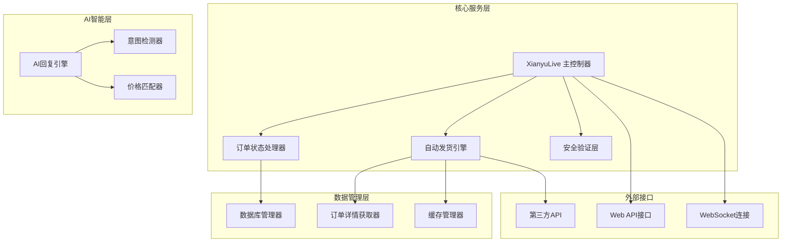
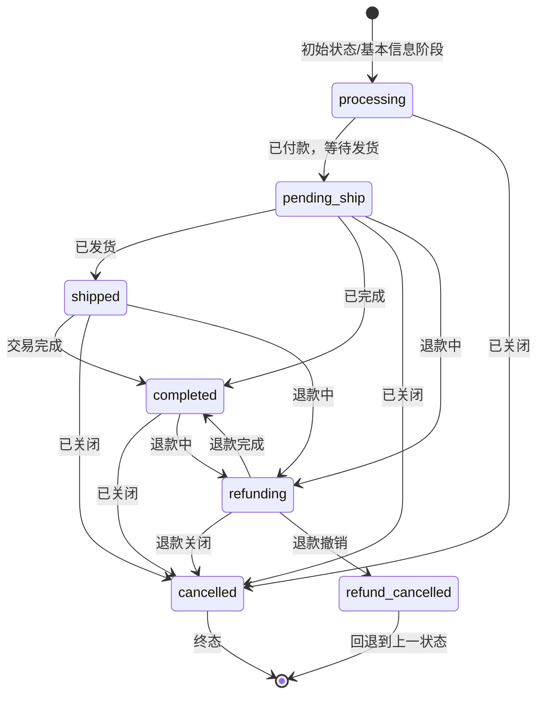
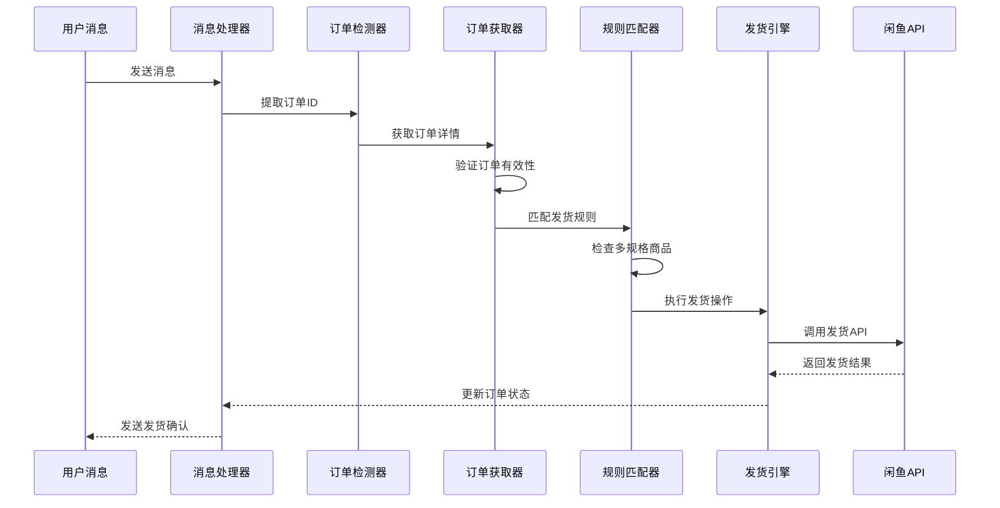
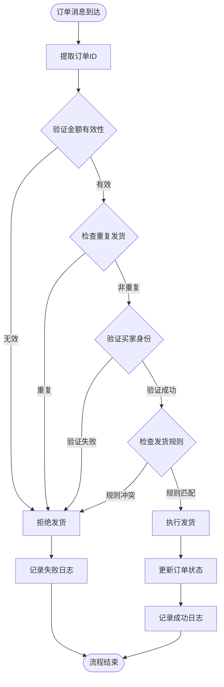
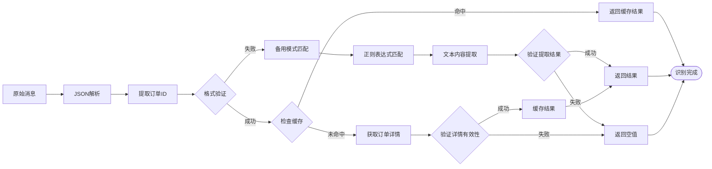
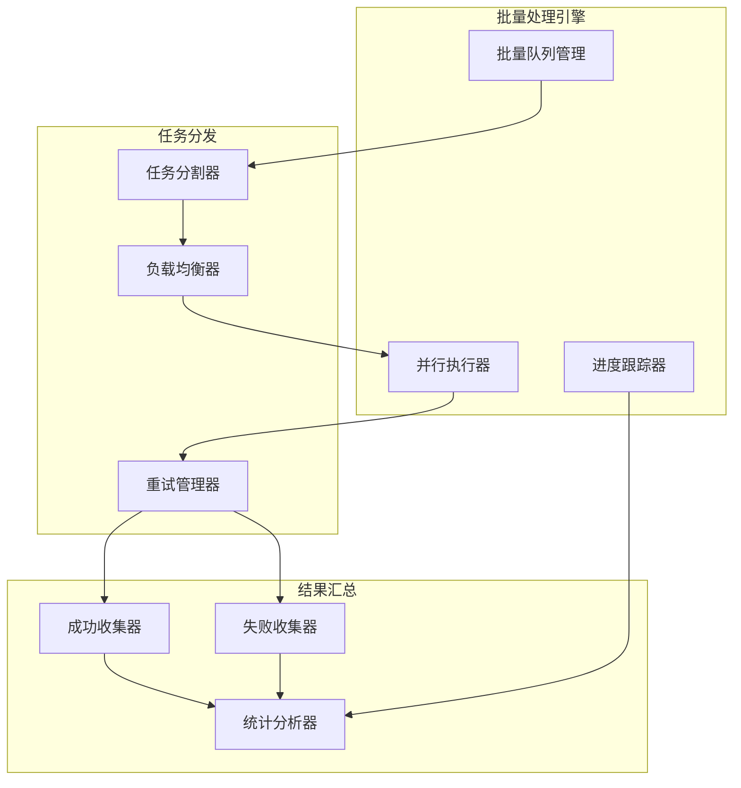
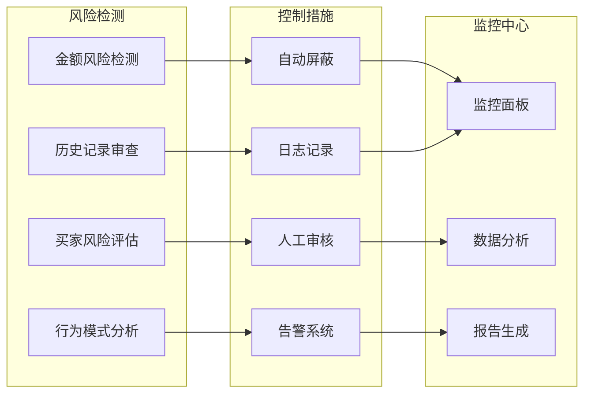
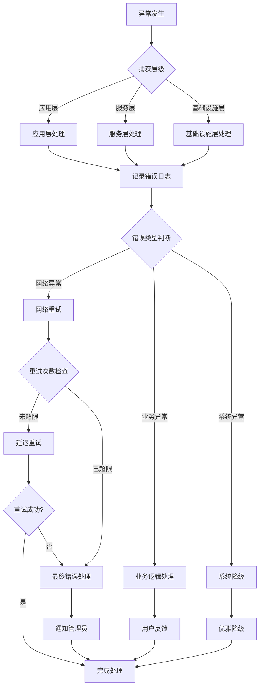
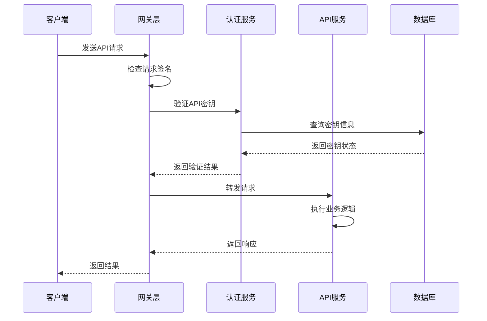

# 订单处理与自动发货接口详细文档

<cite>
**本文档引用的文件**
- [XianyuAutoAsync.py](file://XianyuAutoAsync.py)
- [order_status_handler.py](file://order_status_handler.py)
- [secure_freeshipping_ultra.py](file://secure_freeshipping_ultra.py)
- [secure_freeshipping_decrypted.py](file://secure_freeshipping_decrypted.py)
- [config.py](file://config.py)
- [db_manager.py](file://db_manager.py)
- [utils/order_detail_fetcher.py](file://utils/order_detail_fetcher.py)
- [ai_reply_engine.py](file://ai_reply_engine.py)
</cite>

## 目录
1. [系统概述](#系统概述)
2. [核心架构](#核心架构)
3. [订单状态管理系统](#订单状态管理系统)
4. [自动发货接口](#自动发货接口)
5. [安全验证机制](#安全验证机制)
6. [智能订单识别算法](#智能订单识别算法)
7. [批量发货操作](#批量发货操作)
8. [风险控制与日志记录](#风险控制与日志记录)
9. [错误处理与异常管理](#错误处理与异常管理)
10. [API接口规范](#api接口规范)

## 系统概述

闲鱼自动回复系统是一个基于Python开发的智能电商自动化平台，专门针对闲鱼平台设计。系统具备完整的订单处理与自动发货功能，支持智能订单识别、多重安全验证、批量发货操作以及全面的风险控制机制。

### 主要特性

- **智能订单识别**：基于商品信息和消息内容的自动订单识别算法
- **多重安全验证**：金额校验、买家校验、重复发货防护等安全机制
- **自动发货规则**：支持精确匹配和兜底机制的智能发货规则
- **风险控制**：完善的风控日志记录和异常处理机制
- **批量操作**：支持批量发货和批量确认功能
- **实时监控**：完整的订单状态跟踪和发货统计

## 核心架构

系统采用模块化设计，主要包含以下核心组件：



**图表来源**
- [XianyuAutoAsync.py](file://XianyuAutoAsync.py#L158-L800)
- [order_status_handler.py](file://order_status_handler.py#L26-L80)

**章节来源**
- [XianyuAutoAsync.py](file://XianyuAutoAsync.py#L158-L200)
- [order_status_handler.py](file://order_status_handler.py#L26-L60)

## 订单状态管理系统

### 状态转换规则

系统实现了严格的订单状态转换机制，确保订单状态的合法性和一致性：



**图表来源**
- [order_status_handler.py](file://order_status_handler.py#L30-L44)

### 状态验证机制

系统实现了多层次的状态验证机制：

| 验证层级 | 验证内容 | 实现方式 |
|---------|---------|---------|
| 基础验证 | 状态值合法性 | 预定义状态映射表 |
| 转换验证 | 状态转换合理性 | 状态转换规则矩阵 |
| 业务验证 | 业务逻辑合规性 | 订单状态历史检查 |
| 并发验证 | 防止并发状态更新 | 数据库事务锁定 |

**章节来源**
- [order_status_handler.py](file://order_status_handler.py#L192-L307)

## 自动发货接口

### 发货流程架构

自动发货系统采用多层防护和智能匹配机制：



**图表来源**
- [XianyuAutoAsync.py](file://XianyuAutoAsync.py#L4553-L4674)
- [utils/order_detail_fetcher.py](file://utils/order_detail_fetcher.py#L200-L350)

### 发货规则配置

系统支持灵活的发货规则配置：

| 配置项 | 类型 | 说明 | 默认值 |
|-------|------|------|--------|
| 关键字匹配 | String | 商品标题关键字 | - |
| 触发条件 | Enum | 付款消息/小刀消息等 | 付款消息 |
| 发货卡券 | Reference | 关联的回复卡券 | - |
| 发货数量 | Integer | 单次发货数量 | 1 |
| 延时设置 | Integer | 发货延时（秒） | 0 |
| 多规格支持 | Boolean | 是否支持多规格 | false |

**章节来源**
- [db_manager.py](file://db_manager.py#L293-L320)

## 安全验证机制

### 多重验证体系

系统实现了完整的安全验证机制：



**图表来源**
- [XianyuAutoAsync.py](file://XianyuAutoAsync.py#L1127-L1143)
- [secure_freeshipping_decrypted.py](file://secure_freeshipping_decrypted.py#L38-L131)

### 安全验证规则

| 验证项目 | 验证内容 | 防护措施 |
|---------|---------|---------|
| 金额校验 | 订单金额有效性 | 金额大于0且格式正确 |
| 买家校验 | 买家身份验证 | 基于闲鱼平台的买家ID验证 |
| 重复防护 | 防止重复发货 | 基于订单ID的重复检查 |
| 时间窗口 | 发货时间控制 | 10分钟冷却期机制 |
| 规则验证 | 发货规则合规性 | 多层规则匹配验证 |

**章节来源**
- [utils/order_detail_fetcher.py](file://utils/order_detail_fetcher.py#L218-L262)

## 智能订单识别算法

### 订单识别流程

系统采用多维度的智能订单识别算法：



**图表来源**
- [order_status_handler.py](file://order_status_handler.py#L81-L200)

### 识别算法特点

- **多源提取**：支持从不同消息结构中提取订单信息
- **备用机制**：当主要提取方式失败时，启用备用匹配算法
- **智能验证**：对提取结果进行多维度验证
- **缓存优化**：利用数据库缓存提升识别效率

**章节来源**
- [order_status_handler.py](file://order_status_handler.py#L81-L200)

## 批量发货操作

### 批量处理架构

系统支持高效的批量发货操作：



**图表来源**
- [XianyuAutoAsync.py](file://XianyuAutoAsync.py#L4553-L4674)

### 批量操作接口

| 操作类型 | 接口方法 | 参数说明 | 返回格式 |
|---------|---------|---------|---------|
| 单笔发货 | `auto_freeshipping` | order_id, item_id, buyer_id | JSON对象 |
| 批量发货 | `batch_auto_delivery` | order_list, delivery_rule | 批量结果数组 |
| 确认发货 | `auto_confirm` | order_id, item_id | 确认结果对象 |
| 批量确认 | `batch_auto_confirm` | order_ids | 批量确认结果 |

**章节来源**
- [secure_freeshipping_decrypted.py](file://secure_freeshipping_decrypted.py#L38-L131)

## 风险控制与日志记录

### 风控体系架构

系统建立了完善的风险控制和日志记录机制：



**图表来源**
- [db_manager.py](file://db_manager.py#L409-L422)

### 日志记录规范

| 日志类型 | 记录内容 | 存储位置 | 保留期限 |
|---------|---------|---------|---------|
| 操作日志 | 用户操作记录 | 数据库表 | 30天 |
| 错误日志 | 系统错误信息 | 文件系统 | 7天 |
| 安全日志 | 安全事件记录 | 专用表 | 90天 |
| 性能日志 | 性能指标数据 | 时间序列数据库 | 1年 |

**章节来源**
- [db_manager.py](file://db_manager.py#L409-L422)

## 错误处理与异常管理

### 异常处理策略

系统实现了多层次的异常处理机制：



**图表来源**
- [secure_freeshipping_decrypted.py](file://secure_freeshipping_decrypted.py#L111-L131)

### 错误代码与解决方案

| 错误代码 | 错误描述 | 可能原因 | 解决方案 |
|---------|---------|---------|---------|
| 4001 | 订单不存在 | 订单ID错误或订单已删除 | 检查订单ID有效性 |
| 4002 | 发货失败 | API调用失败或权限不足 | 检查API权限和网络连接 |
| 4003 | 重复发货 | 订单已被其他进程处理 | 检查重复发货防护机制 |
| 4004 | 规则不匹配 | 发货规则配置错误 | 检查规则配置和匹配逻辑 |
| 5001 | 系统内部错误 | 服务器内部异常 | 重启服务或联系技术支持 |

**章节来源**
- [secure_freeshipping_decrypted.py](file://secure_freeshipping_decrypted.py#L111-L131)

## API接口规范

### 核心API接口

系统提供了完整的RESTful API接口：

| 接口路径 | HTTP方法 | 功能描述 | 请求参数 | 响应格式 |
|---------|---------|---------|---------|---------|
| `/api/orders/status` | GET | 查询订单状态 | order_id, cookie_id | JSON对象 |
| `/api/delivery/auto` | POST | 自动发货 | order_id, item_id, buyer_id | 发货结果 |
| `/api/rules/match` | POST | 匹配发货规则 | item_id, order_info | 规则匹配结果 |
| `/api/confirm/auto` | POST | 自动确认发货 | order_id, item_id | 确认结果 |
| `/api/logs/risk` | GET | 获取风控日志 | start_time, end_time | 日志列表 |

### 接口认证机制

系统采用多层认证机制确保接口安全：



**图表来源**
- [secure_freeshipping_decrypted.py](file://secure_freeshipping_decrypted.py#L48-L82)

### 数据格式规范

所有API接口均采用标准化的数据格式：

```json
{
  "code": 200,
  "message": "操作成功",
  "data": {
    "order_id": "2856024697612814489",
    "status": "shipped",
    "timestamp": 1640995200,
    "details": {
      "spec_name": "颜色",
      "spec_value": "白色",
      "quantity": "1",
      "amount": "99.00"
    }
  }
}
```

**章节来源**
- [secure_freeshipping_decrypted.py](file://secure_freeshipping_decrypted.py#L48-L131)

## 总结

闲鱼自动回复系统通过精心设计的架构和完善的机制，实现了高效、安全、可靠的订单处理与自动发货功能。系统的核心优势包括：

1. **智能识别能力**：基于多维度算法的订单识别，准确率高
2. **安全防护机制**：多重验证和风险控制，保障交易安全
3. **灵活配置系统**：支持精细化的发货规则配置
4. **完善监控体系**：全面的日志记录和异常处理
5. **高性能架构**：支持大规模并发处理和批量操作

该系统为闲鱼卖家提供了强大的自动化工具，显著提升了运营效率和客户体验。