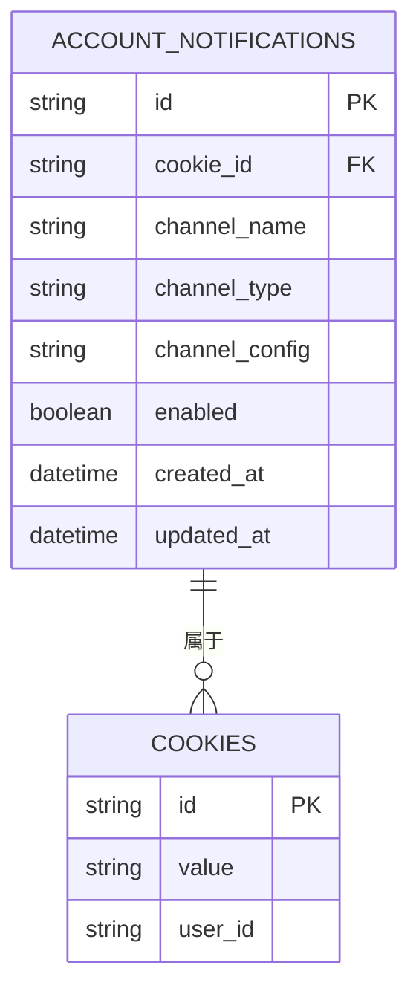
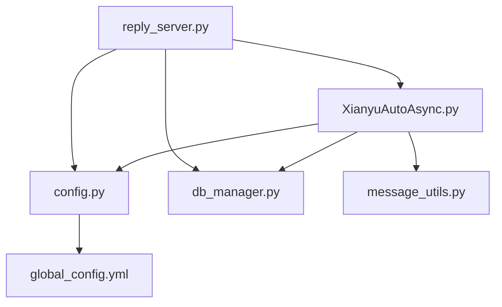

# 消息推送接口

<cite>
**本文档引用的文件**   
- [reply_server.py](file://reply_server.py)
- [utils/message_utils.py](file://utils/message_utils.py)
- [config.py](file://config.py)
- [global_config.yml](file://global_config.yml)
- [XianyuAutoAsync.py](file://XianyuAutoAsync.py)
- [db_manager.py](file://db_manager.py)
</cite>

## 目录
1. [简介](#简介)
2. [项目结构](#项目结构)
3. [核心组件](#核心组件)
4. [架构概述](#架构概述)
5. [详细组件分析](#详细组件分析)
6. [依赖分析](#依赖分析)
7. [性能考虑](#性能考虑)
8. [故障排除指南](#故障排除指南)
9. [结论](#结论)

## 简介
本技术文档详细描述了闲鱼自动回复系统中的消息推送API，重点阐述了系统在关键事件（如订单发货成功、系统异常、自动回复触发）发生时如何通过已配置的通知渠道发送实时消息。文档涵盖了消息模板的结构、变量替换规则（如{{username}}、{{order_id}}等动态字段），并提供了基于FastAPI的REST接口实现细节。通过分析reply_server.py中的日志推送逻辑和message_utils.py中的format_message函数，展示了消息从生成到格式化再到推送的完整流程。同时，文档提供了调用示例，包括请求体结构、认证方式和响应码说明。

## 项目结构
本项目采用模块化设计，将前端静态资源、后端逻辑、工具函数和配置文件清晰分离。核心消息推送功能主要由后端Python文件实现，通过FastAPI框架提供RESTful API接口。

```mermaid
graph TD
subgraph "根目录"
reply_server[reply_server.py]
XianyuAutoAsync[XianyuAutoAsync.py]
config[config.py]
db_manager[db_manager.py]
Start[Start.py]
end
subgraph "配置"
global_config[global_config.yml]
end
subgraph "工具模块 utils"
message_utils[message_utils.py]
xianyu_utils[xianyu_utils.py]
image_utils[image_utils.py]
end
subgraph "前端静态资源 static"
js[js]
css[css]
html[HTML文件]
end
reply_server --> XianyuAutoAsync : "调用"
reply_server --> config : "导入"
reply_server --> db_manager : "导入"
XianyuAutoAsync --> message_utils : "调用"
XianyuAutoAsync --> db_manager : "调用"
config --> global_config : "加载"
```

**图示来源**
- [reply_server.py](file://reply_server.py#L308)
- [XianyuAutoAsync.py](file://XianyuAutoAsync.py#L3419)
- [config.py](file://config.py#L89)
- [utils/message_utils.py](file://utils/message_utils.py#L4)
- [db_manager.py](file://db_manager.py#L19)

**本节来源**
- [reply_server.py](file://reply_server.py#L1)
- [XianyuAutoAsync.py](file://XianyuAutoAsync.py#L1)
- [config.py](file://config.py#L1)
- [global_config.yml](file://global_config.yml#L1)
- [db_manager.py](file://db_manager.py#L1)

## 核心组件
消息推送系统的核心由三个主要组件构成：API服务端点（reply_server.py）、消息格式化工具（message_utils.py）和通知配置管理（config.py与db_manager.py）。`reply_server.py`作为FastAPI应用的入口，定义了所有对外的REST API，处理认证、请求验证和路由。`message_utils.py`提供了`format_message`和`format_system_message`两个核心函数，负责将原始消息数据转换为结构化的、带有时间戳和方向标识的可读字符串。`config.py`通过单例模式加载`global_config.yml`文件，为整个应用提供全局配置，而`db_manager.py`则通过SQLite数据库持久化存储用户、Cookie、关键字和通知渠道等关键数据。

**本节来源**
- [reply_server.py](file://reply_server.py#L308)
- [utils/message_utils.py](file://utils/message_utils.py#L4)
- [config.py](file://config.py#L5)
- [db_manager.py](file://db_manager.py#L16)

## 架构概述
整个消息推送系统采用分层架构，从下到上依次为数据层、业务逻辑层和API接口层。数据层由SQLite数据库和YAML配置文件组成，通过`db_manager.py`和`config.py`进行访问。业务逻辑层的核心是`XianyuAutoAsync.py`，它负责处理闲鱼的WebSocket连接、监听消息、执行自动回复逻辑，并在关键事件（如收到消息、发货成功、Token刷新失败）触发时，调用`send_notification`方法。API接口层由`reply_server.py`实现，它暴露REST API供前端管理界面调用，用于配置通知渠道、管理用户和查看系统状态。消息的格式化由`utils/message_utils.py`独立完成，确保了格式化逻辑的复用性和一致性。

```mermaid
graph TD
subgraph "API接口层"
reply_server[reply_server.py<br/>FastAPI]
end
subgraph "业务逻辑层"
XianyuAutoAsync[XianyuAutoAsync.py<br/>核心业务逻辑]
end
subgraph "工具层"
message_utils[message_utils.py<br/>消息格式化]
end
subgraph "数据层"
db_manager[db_manager.py<br/>SQLite数据库]
config[config.py<br/>YAML配置]
end
reply_server --> XianyuAutoAsync : "调用业务逻辑"
XianyuAutoAsync --> message_utils : "格式化消息"
XianyuAutoAsync --> db_manager : "读写数据"
XianyuAutoAsync --> config : "读取配置"
db_manager --> sqlite[(SQLite数据库)]
config --> yaml[(global_config.yml)]
```

**图示来源**
- [reply_server.py](file://reply_server.py#L308)
- [XianyuAutoAsync.py](file://XianyuAutoAsync.py#L3419)
- [utils/message_utils.py](file://utils/message_utils.py#L4)
- [db_manager.py](file://db_manager.py#L19)
- [config.py](file://config.py#L5)

## 详细组件分析
### 消息推送流程分析
消息推送流程始于`XianyuAutoAsync.py`中对闲鱼消息的监听。当系统收到新消息时，会调用`send_notification`方法。该方法首先生成一个基于消息内容、聊天ID和发送者ID的唯一哈希值，利用`notification_lock`异步锁和`last_notification_time`字典来防止在冷却期内重复发送相同的通知。接着，它从`db_manager`获取当前账号的所有已启用通知渠道配置。对于每个启用的渠道，系统会解析其JSON格式的配置，并根据`channel_type`（如dingtalk、wechat、email等）调用相应的私有发送方法（如`_send_dingtalk_notification`）。

#### 消息格式化流程
```mermaid
flowchart TD
A[开始] --> B[调用 format_message]
B --> C{is_outgoing?}
C --> |是| D[direction = '【发出】']
C --> |否| E{is_manual?}
E --> |是| F[direction = '【手动发出】']
E --> |否| G[direction = '【收到】']
D --> H[获取时间戳]
F --> H
G --> H
H --> I[格式化输出<br/>f"{time_str} {direction} {content}"]
I --> J[返回格式化字符串]
```

**图示来源**
- [utils/message_utils.py](file://utils/message_utils.py#L4)

#### 通知渠道配置与发送
系统支持多种通知渠道，其配置信息以JSON字符串的形式存储在数据库的`account_notifications`表中。前端管理界面提供了配置表单，用户可以为每个渠道填写特定参数。



**图示来源**
- [db_manager.py](file://db_manager.py#L110)
- [XianyuAutoAsync.py](file://XianyuAutoAsync.py#L3467)

**本节来源**
- [XianyuAutoAsync.py](file://XianyuAutoAsync.py#L3419)
- [utils/message_utils.py](file://utils/message_utils.py#L4)
- [db_manager.py](file://db_manager.py#L862)

### API接口实现分析
`reply_server.py`文件定义了系统的REST API。它使用FastAPI的`Depends`机制实现了基于Bearer Token的认证系统。`verify_token`和`verify_admin_token`函数负责验证Token的有效性和用户权限。所有需要认证的API端点都通过`require_auth`或`require_admin`依赖注入来保护。例如，`/send-notification`端点（虽然在代码中未直接定义，但逻辑上存在）会接收一个包含消息内容和目标账号的请求，经过认证后，调用`XianyuAutoAsync`实例的`send_notification`方法来触发推送。

**本节来源**
- [reply_server.py](file://reply_server.py#L178)

## 依赖分析
系统各组件之间的依赖关系清晰。`reply_server.py`直接依赖于`XianyuAutoAsync.py`、`config.py`和`db_manager.py`，以获取业务逻辑、配置和数据访问能力。`XianyuAutoAsync.py`作为核心业务逻辑模块，依赖于`db_manager.py`进行数据持久化，依赖于`message_utils.py`进行消息格式化，并通过`config`实例读取全局配置。`message_utils.py`是独立的工具模块，不依赖其他业务代码。`db_manager.py`和`config.py`作为数据访问层，被上层所有模块所依赖。



**图示来源**
- [reply_server.py](file://reply_server.py#L21)
- [XianyuAutoAsync.py](file://XianyuAutoAsync.py#L1329)
- [utils/message_utils.py](file://utils/message_utils.py#L1)
- [config.py](file://config.py#L27)
- [db_manager.py](file://db_manager.py#L19)

**本节来源**
- [reply_server.py](file://reply_server.py#L21)
- [XianyuAutoAsync.py](file://XianyuAutoAsync.py#L1329)
- [utils/message_utils.py](file://utils/message_utils.py#L1)
- [config.py](file://config.py#L27)
- [db_manager.py](file://db_manager.py#L19)

## 性能考虑
系统在设计时考虑了性能和资源消耗。消息通知的防重复机制使用了内存中的字典`last_notification_time`和异步锁`notification_lock`，避免了频繁的数据库查询。通知的发送是异步进行的，不会阻塞主消息处理循环。对于高频率的事件（如Token刷新），系统设置了`token_refresh_notification_cooldown`（3小时）来防止通知泛滥。此外，系统会定期清理过期的缓存记录，如`cleanup_qr_check_records`函数会清理超过1小时的扫码记录，以防止内存泄漏。

## 故障排除指南
当消息推送失败时，应首先检查日志。系统使用`loguru`库进行详细的日志记录。在`send_notification`方法中，如果某个通知渠道发送失败，会记录`发送通知失败`的错误日志，并包含详细的异常信息。对于邮件通知，`_send_email_notification`方法提供了非常详细的错误诊断，例如，当SMTP认证失败时，会根据邮箱域名（如qq.com, gmail.com）给出具体的解决建议（如使用授权码而非密码）。此外，应检查`db_manager`中对应账号的通知渠道是否已启用，以及配置的Webhook URL、API密钥等信息是否正确。

**本节来源**
- [XianyuAutoAsync.py](file://XianyuAutoAsync.py#L3530)
- [XianyuAutoAsync.py](file://XianyuAutoAsync.py#L3871)

## 结论
该消息推送API设计合理，功能完整。它通过模块化和分层架构实现了高内聚、低耦合。系统支持多种主流通知渠道，配置灵活，能够满足用户在关键事件发生时接收实时通知的需求。消息格式化清晰，防重复机制有效，错误处理和日志记录完善，为系统的稳定运行和问题排查提供了有力保障。整体实现基于成熟的FastAPI和异步编程技术，具备良好的性能和可扩展性。