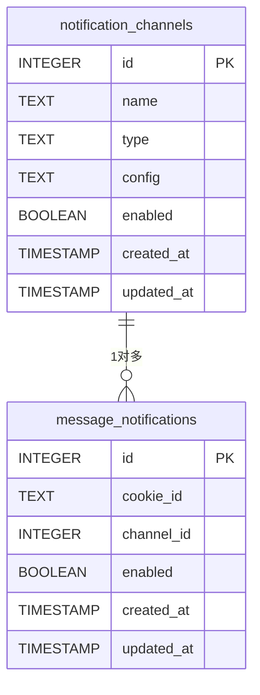
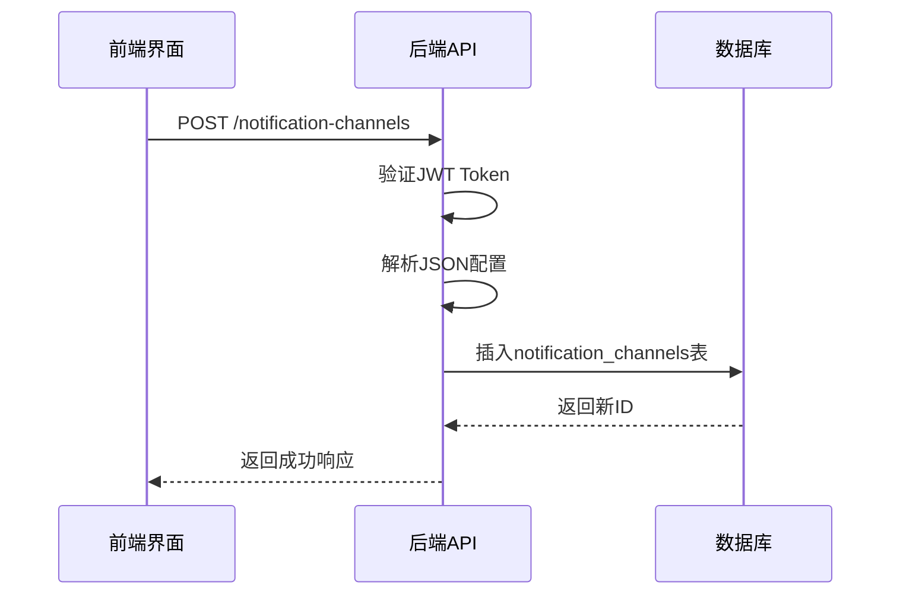

# 通知渠道配置

<cite>
**本文档引用的文件**
- [reply_server.py](file://reply_server.py)
- [db_manager.py](file://db_manager.py)
- [config.py](file://config.py)
- [global_config.yml](file://global_config.yml)
- [XianyuAutoAsync.py](file://XianyuAutoAsync.py)
- [static/js/app.js](file://static/js/app.js)
- [static/index.html](file://static/index.html)
</cite>

## 目录
1. [简介](#简介)
2. [支持的通知渠道](#支持的通知渠道)
3. [系统架构与数据模型](#系统架构与数据模型)
4. [前端界面操作指南](#前端界面操作指南)
5. [后端API逻辑分析](#后端api逻辑分析)
6. [异常处理与重试机制](#异常处理与重试机制)
7. [错误日志记录](#错误日志记录)

## 简介

本文档详细说明了闲鱼自动回复系统中通知渠道的配置方法。系统支持多种通知方式，包括QQ、钉钉、飞书、Bark、邮件、Webhook、微信和Telegram等。用户可以通过前端界面添加和测试通知渠道，并为每个账号配置相应的消息通知。后端通过API验证和存储这些配置，并在特定事件发生时发送通知。

**Section sources**
- [reply_server.py](file://reply_server.py#L2464-L2625)
- [db_manager.py](file://db_manager.py#L356-L390)

## 支持的通知渠道

系统支持以下几种通知渠道：

- **QQ通知**：通过QQ机器人发送消息。
- **钉钉通知**：通过钉钉机器人发送消息，支持加签验证。
- **飞书通知**：通过飞书机器人发送消息，支持加签验证。
- **Bark通知**：通过Bark推送服务向iOS设备发送通知。
- **邮件通知**：通过SMTP协议发送电子邮件。
- **Webhook通知**：通过HTTP POST请求发送通知到自定义的Webhook地址。
- **微信通知**：通过企业微信机器人发送消息。
- **Telegram通知**：通过Telegram机器人发送消息。

每种通知渠道都有其特定的认证机制和配置参数。

**Section sources**
- [static/js/app.js](file://static/js/app.js#L2771-L2861)
- [static/index.html](file://static/index.html#L1097-L1233)

## 系统架构与数据模型

### 数据库表结构

系统使用SQLite数据库来存储通知渠道的相关信息。主要涉及两个表：`notification_channels` 和 `message_notifications`。

#### notification_channels 表

该表用于存储所有通知渠道的配置信息。

| 字段名 | 类型 | 约束 | 说明 |
|-------|------|------|------|
| id | INTEGER | PRIMARY KEY AUTOINCREMENT | 通知渠道ID |
| name | TEXT | NOT NULL | 通知渠道名称 |
| type | TEXT | NOT NULL CHECK (type IN ('qq','ding_talk','dingtalk','feishu','lark','bark','email','webhook','wechat','telegram')) | 通知渠道类型 |
| config | TEXT | NOT NULL | 配置数据（JSON格式） |
| enabled | BOOLEAN | DEFAULT TRUE | 是否启用 |
| created_at | TIMESTAMP | DEFAULT CURRENT_TIMESTAMP | 创建时间 |
| updated_at | TIMESTAMP | DEFAULT CURRENT_TIMESTAMP | 更新时间 |

#### message_notifications 表

该表用于存储账号与通知渠道之间的关联关系。

| 字段名 | 类型 | 约束 | 说明 |
|-------|------|------|------|
| id | INTEGER | PRIMARY KEY AUTOINCREMENT | 主键ID |
| cookie_id | TEXT | NOT NULL | 账号ID |
| channel_id | INTEGER | NOT NULL | 通知渠道ID |
| enabled | BOOLEAN | DEFAULT TRUE | 是否启用 |
| created_at | TIMESTAMP | DEFAULT CURRENT_TIMESTAMP | 创建时间 |
| updated_at | TIMESTAMP | DEFAULT CURRENT_TIMESTAMP | 更新时间 |
| FOREIGN KEY (cookie_id) REFERENCES cookies(id) ON DELETE CASCADE | - | - | 外键约束 |
| FOREIGN KEY (channel_id) REFERENCES notification_channels(id) ON DELETE CASCADE | - | - | 外键约束 |
| UNIQUE(cookie_id, channel_id) | - | - | 唯一性约束 |



**Diagram sources**
- [db_manager.py](file://db_manager.py#L356-L365)
- [db_manager.py](file://db_manager.py#L380-L390)

## 前端界面操作指南

### 添加通知渠道

1. 登录系统后，进入“通知渠道管理”页面。
2. 点击对应通知渠道类型的“配置”按钮（如QQ通知、钉钉通知等）。
3. 在弹出的模态框中填写相应的配置参数：
   - **名称**：为该通知渠道设置一个易于识别的名称。
   - **配置参数**：根据所选渠道类型填写对应的认证信息（如Webhook URL、API密钥、SMTP配置等）。
4. 点击“保存”按钮完成添加。

### 测试通知渠道

1. 在通知渠道列表中找到刚添加的渠道。
2. 点击“测试”按钮。
3. 系统会尝试发送一条测试消息到指定的通知渠道。
4. 根据返回结果判断配置是否正确。

### 配置账号通知

1. 进入“消息通知配置”页面。
2. 选择需要配置通知的账号。
3. 从下拉菜单中选择已添加的通知渠道。
4. 启用或禁用该通知配置。
5. 点击“保存”按钮完成配置。

**Section sources**
- [static/js/app.js](file://static/js/app.js#L3137-L3180)
- [static/index.html](file://static/index.html#L1239-L1265)

## 后端API逻辑分析

### API端点

系统提供了以下API端点来管理通知渠道：

- `GET /notification-channels`：获取所有通知渠道。
- `POST /notification-channels`：创建新的通知渠道。
- `GET /notification-channels/{channel_id}`：获取指定ID的通知渠道。
- `PUT /notification-channels/{channel_id}`：更新指定ID的通知渠道。
- `DELETE /notification-channels/{channel_id}`：删除指定ID的通知渠道。
- `GET /message-notifications/account/{cid}`：获取指定账号的消息通知配置。
- `POST /message-notifications/{accountId}`：设置账号的消息通知配置。
- `DELETE /message-notifications/account/{cid}`：删除账号的所有消息通知配置。

### 配置验证与存储

当用户通过前端界面提交通知渠道配置时，后端会进行以下处理：

1. **验证用户身份**：通过JWT Token验证当前用户的身份。
2. **解析配置数据**：将前端传来的JSON格式配置数据解析为字典对象。
3. **保存到数据库**：调用`db_manager.create_notification_channel`方法将配置信息保存到`notification_channels`表中。
4. **返回结果**：成功则返回成功消息和新创建的渠道ID，失败则抛出HTTP异常。



**Diagram sources**
- [reply_server.py](file://reply_server.py#L2477-L2490)
- [db_manager.py](file://db_manager.py#L356-L365)

## 异常处理与重试机制

### 异常处理

在发送通知过程中，可能会遇到各种异常情况，如网络超时、认证失败、服务器错误等。系统通过以下方式处理异常：

1. **捕获异常**：在发送通知的异步函数中使用try-except块捕获所有异常。
2. **记录日志**：将异常信息记录到日志文件中，便于后续排查问题。
3. **继续执行**：即使某个通知渠道发送失败，也不会影响其他渠道的通知发送。

### 重试机制

目前系统未实现自动重试机制，但可以通过以下方式手动重试：

1. 检查日志中的错误信息，确认问题原因。
2. 修改相应的配置参数。
3. 再次触发通知事件或手动测试通知渠道。

未来可以考虑引入指数退避算法实现自动重试功能。

**Section sources**
- [XianyuAutoAsync.py](file://XianyuAutoAsync.py#L3530-L3538)
- [XianyuAutoAsync.py](file://XianyuAutoAsync.py#L3593-L3597)

## 错误日志记录

系统使用loguru库进行日志记录，所有通知相关的操作都会被记录下来。日志级别包括INFO、WARNING、ERROR和DEBUG。

### 日志内容

- **INFO**：记录正常的操作流程，如“开始发送QQ通知”、“钉钉通知发送成功”等。
- **WARNING**：记录非致命的警告信息，如“钉钉通知配置为空”、“飞书通知发送失败”等。
- **ERROR**：记录严重的错误信息，如“发送QQ通知异常”、“飞书通知异常详情”等。
- **DEBUG**：记录详细的调试信息，用于开发和维护。

### 日志格式

日志采用统一的格式，包含时间戳、日志级别、模块名、函数名、行号和消息内容。例如：

```
2024-03-15 14:30:25.123 | INFO     | XianyuAutoAsync:_send_qq_notification:3555 - 📱 QQ通知 - 开始处理配置数据: {'qq_number': '123456789'}
```

**Section sources**
- [XianyuAutoAsync.py](file://XianyuAutoAsync.py#L3555-L3556)
- [XianyuAutoAsync.py](file://XianyuAutoAsync.py#L3584-L3585)