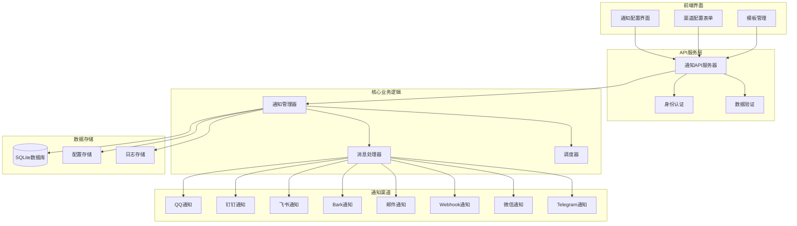
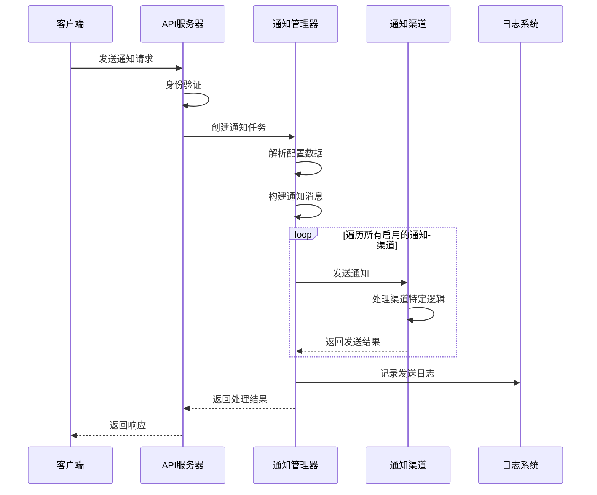
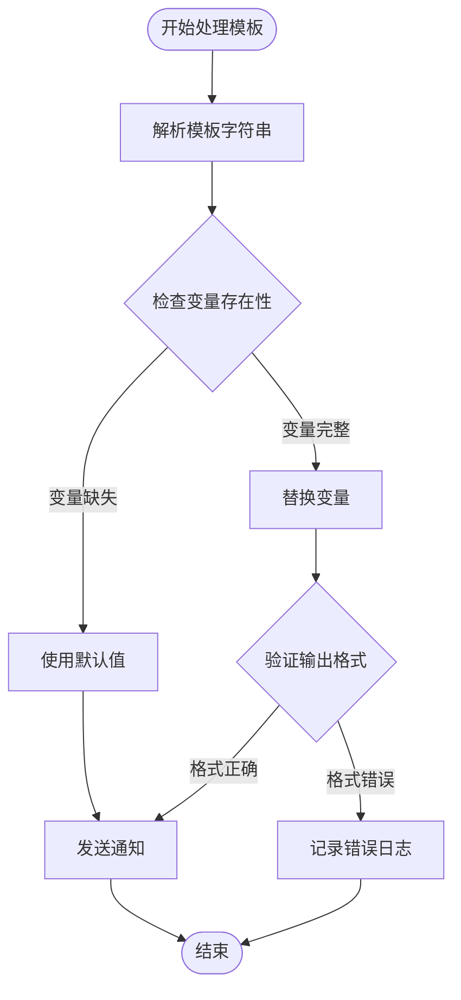
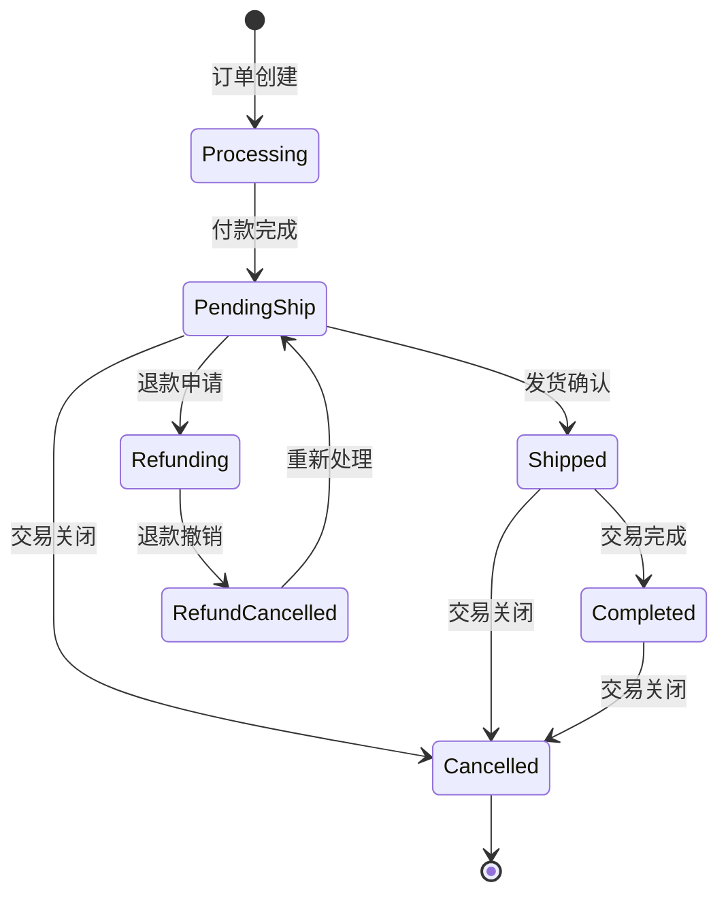

# 通知系统接口文档

<cite>
**本文档引用的文件**
- [XianyuAutoAsync.py](file://XianyuAutoAsync.py)
- [db_manager.py](file://db_manager.py)
- [reply_server.py](file://reply_server.py)
- [order_status_handler.py](file://order_status_handler.py)
- [static/js/app.js](file://static/js/app.js)
- [static/css/notifications.css](file://static/css/notifications.css)
- [static/index.html](file://static/index.html)
- [config.py](file://config.py)
- [global_config.yml](file://global_config.yml)
- [utils/message_utils.py](file://utils/message_utils.py)
</cite>

## 目录
1. [简介](#简介)
2. [系统架构](#系统架构)
3. [通知渠道配置](#通知渠道配置)
4. [消息推送API](#消息推送api)
5. [通知模板与变量替换](#通知模板与变量替换)
6. [关键事件通知](#关键事件通知)
7. [状态回调机制](#状态回调机制)
8. [API接口文档](#api接口文档)
9. [错误处理与监控](#错误处理与监控)
10. [最佳实践](#最佳实践)

## 简介

闲鱼自动回复系统的通知系统是一个功能完善的多渠道消息通知平台，支持多种通知方式，包括QQ、钉钉、飞书、Bark、邮件、Webhook、微信和Telegram等。该系统能够实现实时通知推送，支持模板化消息生成，并具备完善的配置管理和状态回调机制。

### 主要特性

- **多渠道支持**：支持10种不同类型的通知渠道
- **模板化消息**：支持变量替换和动态内容生成
- **实时推送**：基于WebSocket的消息实时通知
- **防重复机制**：智能去重和冷却时间控制
- **状态管理**：完整的订单状态跟踪和回调
- **配置管理**：灵活的通知渠道配置和管理

## 系统架构



**图表来源**
- [XianyuAutoAsync.py](file://XianyuAutoAsync.py#L3420-L3538)
- [reply_server.py](file://reply_server.py#L2464-L2527)

**章节来源**
- [XianyuAutoAsync.py](file://XianyuAutoAsync.py#L3420-L3538)
- [db_manager.py](file://db_manager.py#L841-L913)

## 通知渠道配置

### 支持的通知渠道类型

系统支持以下10种通知渠道：

| 渠道类型 | 英文名称 | 描述 | 配置要求 |
|---------|---------|------|----------|
| QQ通知 | qq | 通过第三方API发送QQ私聊消息 | QQ号码 |
| 钉钉通知 | dingtalk | 企业钉钉群机器人通知 | Webhook URL + Secret |
| 飞书通知 | feishu/lark | 飞书群机器人通知 | Webhook URL |
| Bark通知 | bark | iOS设备推送通知 | Device Key + 服务器地址 |
| 邮件通知 | email | SMTP邮件通知 | SMTP服务器 + 认证信息 |
| Webhook通知 | webhook | HTTP回调通知 | Webhook URL + 方法 |
| 微信通知 | wechat | 企业微信机器人通知 | Webhook URL |
| Telegram通知 | telegram | Telegram机器人通知 | Bot Token + Chat ID |

### 渠道配置参数详解

#### QQ通知配置
```json
{
  "qq_number": "123456789",
  "config": "123456789"
}
```

#### 钉钉通知配置
```json
{
  "webhook_url": "https://oapi.dingtalk.com/robot/send?access_token=xxx",
  "secret": "SECxxx"
}
```

#### 飞书通知配置
```json
{
  "webhook_url": "https://open.feishu.cn/open_api/chat/send"
}
```

#### Bark通知配置
```json
{
  "server_url": "https://api.day.app",
  "device_key": "your_device_key",
  "title": "闲鱼通知",
  "sound": "alert",
  "icon": "",
  "group": "xianyu",
  "url": ""
}
```

#### 邮件通知配置
```json
{
  "smtp_server": "smtp.gmail.com",
  "smtp_port": 587,
  "email_user": "your-email@gmail.com",
  "email_password": "your-password-or-app-password",
  "recipient_email": "recipient@example.com"
}
```

#### Webhook通知配置
```json
{
  "webhook_url": "https://your-server.com/webhook",
  "http_method": "POST",
  "headers": "{\"Authorization\": \"Bearer token\", \"Content-Type\": \"application/json\"}"
}
```

#### 微信通知配置
```json
{
  "webhook_url": "https://qyapi.weixin.qq.com/cgi-bin/webhook/send?key=your-key"
}
```

#### Telegram通知配置
```json
{
  "bot_token": "123456789:ABCdefGHIjklMNOpqrsTUVwxyz",
  "chat_id": "123456789"
}
```

**章节来源**
- [static/js/app.js](file://static/js/app.js#L2725-L2864)
- [db_manager.py](file://db_manager.py#L841-L860)

## 消息推送API

### 核心推送流程



**图表来源**
- [XianyuAutoAsync.py](file://XianyuAutoAsync.py#L3420-L3538)
- [reply_server.py](file://reply_server.py#L2464-L2527)

### 消息发送机制

#### 防重复发送机制

系统实现了智能的防重复发送机制，防止同一消息在短时间内重复发送：

```python
# 防重复检查逻辑
notification_key = f"{chat_id or 'unknown'}_{send_user_id}_{send_message}"
notification_hash = hashlib.md5(notification_key.encode('utf-8')).hexdigest()

# 检查冷却时间
current_time = time.time()
if notification_hash in self.last_notification_time:
    time_since_last = current_time - self.last_notification_time[notification_hash]
    if time_since_last < self.notification_cooldown:
        remaining_seconds = int(self.notification_cooldown - time_since_last)
        logger.warning(f"通知在冷却期内（剩余 {remaining_seconds} 秒），跳过重复发送")
        return
```

#### 异步消息处理

系统采用异步处理模式，确保高并发场景下的性能：

```python
async def send_notification(self, send_user_name: str, send_user_id: str, send_message: str, item_id: str = None, chat_id: str = None):
    # 异步锁保护防重复检查
    async with self.notification_lock:
        # 执行通知发送逻辑
        pass
```

**章节来源**
- [XianyuAutoAsync.py](file://XianyuAutoAsync.py#L3420-L3538)

## 通知模板与变量替换

### 模板变量系统

系统支持丰富的变量替换功能，允许动态生成通知内容：

#### 基础变量
- `{send_user_name}`: 发送者用户名
- `{send_user_id}`: 发送者用户ID
- `{send_message}`: 消息内容
- `{item_id}`: 商品ID
- `{chat_id}`: 聊天ID
- `{order_id}`: 订单ID（自动发货时可用）

#### 订单状态变量
- `{order_status}`: 订单当前状态
- `{order_amount}`: 订单金额
- `{buyer_name}`: 买家姓名
- `{seller_name}`: 卖家姓名

### 模板处理流程



**图表来源**
- [XianyuAutoAsync.py](file://XianyuAutoAsync.py#L3103-L3117)
- [XianyuAutoAsync.py](file://XianyuAutoAsync.py#L4760-L4769)

### 自动发货模板示例

系统提供了专门的自动发货模板处理机制：

```python
def _process_delivery_content_with_description(self, delivery_content: str, card_description: str) -> str:
    """处理发货内容和备注信息，实现变量替换"""
    if not card_description or not card_description.strip():
        return delivery_content
    
    # 替换备注中的变量
    processed_description = card_description.replace('{DELIVERY_CONTENT}', delivery_content)
    return processed_description
```

**章节来源**
- [XianyuAutoAsync.py](file://XianyuAutoAsync.py#L3103-L3117)
- [XianyuAutoAsync.py](file://XianyuAutoAsync.py#L4760-L4769)

## 关键事件通知

### 订单状态变更通知

系统能够实时监控订单状态变化，并触发相应的通知：

#### 订单状态类型
- **处理中** (processing): 初始状态/基本信息阶段
- **待发货** (pending_ship): 已付款，等待发货
- **已发货** (shipped): 发货确认后
- **已完成** (completed): 交易完成
- **退款中** (refunding): 退款中/退货中
- **退款撤销** (refund_cancelled): 退款撤销（临时状态）
- **已关闭** (cancelled): 交易关闭

#### 状态变更处理流程



**图表来源**
- [order_status_handler.py](file://order_status_handler.py#L48-L67)

### 自动发货通知

当系统自动完成发货操作时，会触发专门的发货通知：

```python
# 自动发货通知逻辑
match channel_type:
    case 'qq':
        await self._send_qq_notification(config_data, notification_message)
    case 'dingtalk':
        await self._send_dingtalk_notification(config_data, notification_message)
    case 'feishu':
        await self._send_feishu_notification(config_data, notification_message)
    # ... 其他渠道
```

### 系统异常通知

系统会在遇到异常情况时发送告警通知：

- **Token刷新失败**: 当认证令牌失效时
- **WebSocket连接异常**: 当与闲鱼服务器连接断开时
- **订单状态更新失败**: 当无法正确更新订单状态时

**章节来源**
- [order_status_handler.py](file://order_status_handler.py#L48-L67)
- [XianyuAutoAsync.py](file://XianyuAutoAsync.py#L824-L848)
- [XianyuAutoAsync.py](file://XianyuAutoAsync.py#L4285-L4311)

## 状态回调机制

### 回调接口设计

系统提供了完整的状态回调机制，支持外部系统集成：

#### 回调数据格式
```json
{
  "event": "order_status_change",
  "order_id": "123456789",
  "status": "shipped",
  "timestamp": 1640995200,
  "details": {
    "tracking_number": "SF1234567890",
    "shipping_address": "北京市朝阳区xxx街道",
    "estimated_delivery": "2023-01-02"
  }
}
```

#### 回调触发条件
- 订单状态发生变更
- 自动发货完成
- 系统异常发生
- 用户操作完成

### Webhook回调实现

```python
async def _send_webhook_notification(self, config_data: dict, message: str):
    """发送Webhook通知"""
    try:
        import aiohttp
        import json
        
        webhook_url = config_data.get('webhook_url', '')
        http_method = config_data.get('http_method', 'POST').upper()
        headers = json.loads(config_data.get('headers', '{}'))
        
        data = {
            "message": message,
            "timestamp": time.time(),
            "source": "闲鱼自动回复系统"
        }
        
        async with aiohttp.ClientSession() as session:
            if http_method == 'POST':
                async with session.post(webhook_url, json=data, headers=headers, timeout=10) as response:
                    if response.status == 200:
                        logger.info(f"Webhook通知发送成功")
                    else:
                        logger.warning(f"Webhook通知发送失败: {response.status}")
            # ... PUT方法处理
    except Exception as e:
        logger.error(f"发送Webhook通知异常: {self._safe_str(e)}")
```

**章节来源**
- [XianyuAutoAsync.py](file://XianyuAutoAsync.py#L3963-L3993)

## API接口文档

### 通知渠道管理API

#### 获取所有通知渠道
```http
GET /notification-channels
Authorization: Bearer {token}
```

**响应示例**:
```json
[
  {
    "id": 1,
    "name": "钉钉通知",
    "type": "dingtalk",
    "config": "{\"webhook_url\":\"https://...\",\"secret\":\"SEC...\"}",
    "enabled": true,
    "created_at": "2023-01-01T10:00:00Z",
    "updated_at": "2023-01-01T10:00:00Z"
  }
]
```

#### 创建通知渠道
```http
POST /notification-channels
Authorization: Bearer {token}
Content-Type: application/json

{
  "name": "飞书通知",
  "type": "feishu",
  "config": "{\"webhook_url\":\"https://...\"}",
  "enabled": true
}
```

#### 更新通知渠道
```http
PUT /notification-channels/{channel_id}
Authorization: Bearer {token}
Content-Type: application/json

{
  "name": "更新后的名称",
  "config": "{\"webhook_url\":\"https://...\"}",
  "enabled": true
}
```

#### 删除通知渠道
```http
DELETE /notification-channels/{channel_id}
Authorization: Bearer {token}
```

### 消息通知配置API

#### 获取账号通知配置
```http
GET /message-notifications/{cookie_id}
Authorization: Bearer {token}
```

#### 设置消息通知
```http
POST /message-notifications/{cookie_id}
Authorization: Bearer {token}
Content-Type: application/json

{
  "channel_id": 1,
  "enabled": true
}
```

#### 删除账号通知配置
```http
DELETE /message-notifications/account/{cookie_id}
Authorization: Bearer {token}
```

**章节来源**
- [reply_server.py](file://reply_server.py#L2464-L2625)

## 错误处理与监控

### 错误分类与处理

系统实现了完善的错误处理机制：

#### 网络错误
- **连接超时**: 自动重试机制
- **HTTP错误**: 根据状态码进行不同处理
- **DNS解析失败**: 记录错误并跳过该渠道

#### 配置错误
- **无效的Webhook URL**: 验证URL格式
- **认证失败**: 记录失败原因
- **参数缺失**: 提供默认值或拒绝请求

#### 业务错误
- **订单状态不匹配**: 记录日志但继续处理
- **通知渠道不可用**: 跳过该渠道
- **模板变量缺失**: 使用默认值

### 监控指标

系统监控以下关键指标：
- **通知发送成功率**
- **各渠道发送耗时**
- **防重复检查命中率**
- **错误发生频率**
- **配置有效性检查**

### 日志记录

系统采用分级日志记录：
- **INFO**: 正常操作记录
- **WARNING**: 警告信息（如防重复、渠道不可用）
- **ERROR**: 错误信息（如网络异常、配置错误）
- **DEBUG**: 详细的调试信息

**章节来源**
- [XianyuAutoAsync.py](file://XianyuAutoAsync.py#L3593-L3597)
- [XianyuAutoAsync.py](file://XianyuAutoAsync.py#L3530-L3538)

## 最佳实践

### 配置建议

1. **多渠道配置**: 建议至少配置2-3个不同的通知渠道，确保消息可靠送达
2. **防重复设置**: 合理设置冷却时间（建议30-60秒）
3. **模板优化**: 使用清晰简洁的通知模板，包含必要的上下文信息
4. **监控告警**: 为关键通知渠道设置监控，及时发现故障

### 性能优化

1. **异步处理**: 充分利用异步特性，提高并发处理能力
2. **连接池**: 对于Webhook等需要HTTP连接的渠道，使用连接池
3. **缓存策略**: 缓存频繁使用的配置信息
4. **批量处理**: 对于大量相似通知，考虑批量处理

### 安全考虑

1. **认证机制**: 使用强认证令牌，定期轮换
2. **敏感信息**: 敏感配置信息加密存储
3. **访问控制**: 实施严格的API访问控制
4. **审计日志**: 记录所有重要操作的审计日志

### 故障排除

1. **常见问题**: 检查网络连接、配置格式、认证信息
2. **调试工具**: 使用详细的日志信息进行问题定位
3. **降级策略**: 在主要渠道故障时，自动切换到备用渠道
4. **恢复机制**: 实现自动重试和故障恢复机制