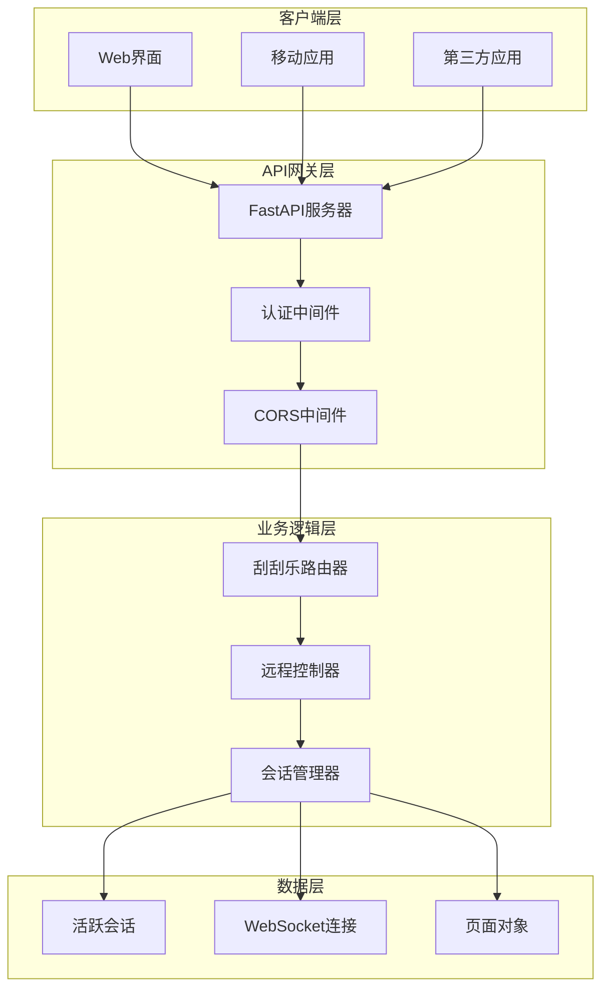

# HTTP RESTful接口文档

<cite>
**本文档中引用的文件**
- [api_captcha_remote.py](file://api_captcha_remote.py)
- [utils/captcha_remote_control.py](file://utils/captcha_remote_control.py)
- [reply_server.py](file://reply_server.py)
- [README.md](file://README.md)
</cite>

## 目录
1. [简介](#简介)
2. [项目架构概览](#项目架构概览)
3. [核心API端点](#核心api端点)
4. [详细端点说明](#详细端点说明)
5. [数据模型定义](#数据模型定义)
6. [错误处理](#错误处理)
7. [使用示例](#使用示例)
8. [最佳实践](#最佳实践)

## 简介

本文档详细描述了闲鱼自动回复系统中刮刮乐远程控制的HTTP RESTful接口。该系统提供了完整的WebSocket和HTTP接口，用于远程操作滑块验证过程，支持实时截图传输和鼠标事件处理。

### 主要功能特性

- **实时远程控制**：通过WebSocket实现实时截图传输和鼠标事件处理
- **HTTP备用方案**：提供HTTP接口作为WebSocket的备用方案
- **会话管理**：完整的会话生命周期管理，包括创建、监控和销毁
- **状态检查**：多种状态检查接口，支持轮询和实时监控
- **安全认证**：基于JWT的认证机制，确保接口安全访问

## 项目架构概览



**架构图来源**
- [api_captcha_remote.py](file://api_captcha_remote.py#L17-L19)
- [reply_server.py](file://reply_server.py#L308-L322)

## 核心API端点

系统提供以下核心REST API端点：

| 方法 | URL路径 | 描述 | 用途 |
|------|---------|------|------|
| GET | `/api/captcha/sessions` | 获取所有活跃会话 | 列出当前所有正在处理的验证会话 |
| GET | `/api/captcha/session/{session_id}` | 获取指定会话详情 | 获取特定会话的详细信息和状态 |
| GET | `/api/captcha/screenshot/{session_id}` | 获取最新截图 | 获取指定会话的最新验证码截图 |
| POST | `/api/captcha/mouse_event` | 处理鼠标事件 | HTTP方式处理鼠标点击和拖拽操作 |
| POST | `/api/captcha/check_completion` | 检查完成状态 | 检查验证是否已经完成 |
| DELETE | `/api/captcha/session/{session_id}` | 关闭会话 | 终止指定的验证会话 |
| GET | `/api/captcha/status/{session_id}` | 获取验证状态 | 轮询检查验证完成状态 |

**节来源**
- [api_captcha_remote.py](file://api_captcha_remote.py#L162-L244)

## 详细端点说明

### 1. 获取所有活跃会话列表

**端点**: `GET /api/captcha/sessions`

**描述**: 获取系统中所有当前活跃的验证会话信息。

**请求参数**: 无

**响应格式**:
```json
{
  "count": 3,
  "sessions": [
    {
      "session_id": "user12345",
      "completed": false,
      "has_websocket": true
    },
    {
      "session_id": "user67890",
      "completed": true,
      "has_websocket": false
    }
  ]
}
```

**状态码**:
- `200 OK`: 成功获取会话列表
- `500 Internal Server Error`: 服务器内部错误

**使用场景**: 
- 管理员监控系统状态
- 前端界面显示当前处理中的验证任务
- 系统健康检查和统计

**节来源**
- [api_captcha_remote.py](file://api_captcha_remote.py#L162-L176)

### 2. 获取指定会话详情

**端点**: `GET /api/captcha/session/{session_id}`

**描述**: 获取指定验证会话的详细信息，包括截图、验证码信息和视口大小。

**路径参数**:
- `session_id` (字符串): 会话唯一标识符

**响应格式**:
```json
{
  "session_id": "user12345",
  "screenshot": "data:image/jpeg;base64,/9j/4AAQSkZJRgABA...",
  "captcha_info": {
    "selector": "#nocaptcha",
    "x": 100,
    "y": 200,
    "width": 300,
    "height": 100,
    "in_iframe": false
  },
  "viewport": {
    "width": 1280,
    "height": 720
  },
  "completed": false
}
```

**状态码**:
- `200 OK`: 成功获取会话信息
- `404 Not Found`: 会话不存在
- `500 Internal Server Error`: 服务器内部错误

**使用场景**:
- 前端界面显示验证码截图
- 获取验证码的位置和尺寸信息
- 检查会话状态和完整性

**节来源**
- [api_captcha_remote.py](file://api_captcha_remote.py#L179-L193)

### 3. 获取最新截图

**端点**: `GET /api/captcha/screenshot/{session_id}`

**描述**: 获取指定会话的最新验证码截图，通常用于实时预览。

**路径参数**:
- `session_id` (字符串): 会话唯一标识符

**响应格式**:
```json
{
  "screenshot": "data:image/jpeg;base64,/9j/4AAQSkZJRgABA..."
}
```

**状态码**:
- `200 OK`: 成功获取截图
- `404 Not Found`: 无法获取截图或会话不存在
- `500 Internal Server Error`: 截图生成失败

**使用场景**:
- 实时预览验证码状态
- 验证码识别和处理
- 用户界面更新

**节来源**
- [api_captcha_remote.py](file://api_captcha_remote.py#L196-L204)

### 4. 处理鼠标事件（HTTP方式）

**端点**: `POST /api/captcha/mouse_event`

**描述**: 处理鼠标事件（HTTP方式）。**注意：此接口不推荐使用，建议优先采用WebSocket实现实时交互。**

**请求体**:
```json
{
  "session_id": "user12345",
  "event_type": "down",
  "x": 150,
  "y": 250
}
```

**响应格式**:
```json
{
  "success": true,
  "completed": false
}
```

**状态码**:
- `200 OK`: 事件处理成功
- `400 Bad Request`: 处理失败或参数错误
- `500 Internal Server Error`: 服务器内部错误

**事件类型**:
- `down`: 鼠标按下
- `move`: 鼠标移动
- `up`: 鼠标释放

**使用场景**:
- HTTP客户端无法使用WebSocket的情况
- 简单的鼠标操作需求
- 测试和调试目的

**重要提示**: 此接口为HTTP轮询方式，相比WebSocket实时通信效率较低，建议仅在特殊情况下使用。

**节来源**
- [api_captcha_remote.py](file://api_captcha_remote.py#L207-L226)

### 5. 检查验证完成状态

**端点**: `POST /api/captcha/check_completion`

**描述**: 检查指定会话的验证是否已经完成。

**请求体**:
```json
{
  "session_id": "user12345"
}
```

**响应格式**:
```json
{
  "session_id": "user12345",
  "completed": true
}
```

**状态码**:
- `200 OK`: 检查成功
- `500 Internal Server Error`: 检查失败

**使用场景**:
- 轮询检查验证状态
- 自动化脚本状态监控
- 业务流程状态判断

**节来源**
- [api_captcha_remote.py](file://api_captcha_remote.py#L229-L237)

### 6. 关闭会话

**端点**: `DELETE /api/captcha/session/{session_id}`

**描述**: 关闭指定的验证会话，终止相关操作。

**路径参数**:
- `session_id` (字符串): 会话唯一标识符

**响应格式**:
```json
{
  "success": true
}
```

**状态码**:
- `200 OK`: 会话成功关闭
- `500 Internal Server Error`: 关闭失败

**使用场景**:
- 用户取消验证操作
- 系统异常处理
- 资源清理和回收

**节来源**
- [api_captcha_remote.py](file://api_captcha_remote.py#L240-L244)

### 7. 获取验证状态（轮询方式）

**端点**: `GET /api/captcha/status/{session_id}`

**描述**: 获取验证状态，主要用于前端轮询检查验证是否完成。

**路径参数**:
- `session_id` (字符串): 会话唯一标识符

**响应格式**:
```json
{
  "success": true,
  "completed": false,
  "session_exists": true,
  "session_id": "user12345"
}
```

**状态码**:
- `200 OK`: 获取状态成功
- `500 Internal Server Error`: 获取状态失败

**使用场景**:
- 前端轮询检查验证进度
- 简单的状态查询
- 兼容性支持

**节来源**
- [api_captcha_remote.py](file://api_captcha_remote.py#L251-L275)

## 数据模型定义

### MouseEvent模型

鼠标事件数据结构，用于HTTP方式的鼠标操作。

| 字段名 | 类型 | 描述 | 必填 |
|--------|------|------|------|
| session_id | string | 会话唯一标识符 | 是 |
| event_type | string | 事件类型：down/move/up | 是 |
| x | integer | X坐标位置 | 是 |
| y | integer | Y坐标位置 | 是 |

**节来源**
- [api_captcha_remote.py](file://api_captcha_remote.py#L21-L26)

### SessionCheckRequest模型

会话检查请求数据结构。

| 字段名 | 类型 | 描述 | 必填 |
|--------|------|------|------|
| session_id | string | 会话唯一标识符 | 是 |

**节来源**
- [api_captcha_remote.py](file://api_captcha_remote.py#L29-L31)

### 会话状态数据结构

每个活跃会话包含以下信息：

| 字段名 | 类型 | 描述 |
|--------|------|------|
| session_id | string | 会话唯一标识符 |
| screenshot | string | Base64编码的JPEG截图 |
| captcha_info | object | 验证码位置和尺寸信息 |
| viewport | object | 视口大小信息 |
| completed | boolean | 验证是否完成 |
| has_websocket | boolean | 是否有WebSocket连接 |

**节来源**
- [utils/captcha_remote_control.py](file://utils/captcha_remote_control.py#L17-L369)

## 错误处理

### 常见错误码

| 状态码 | 错误类型 | 描述 | 解决方案 |
|--------|----------|------|----------|
| 400 | Bad Request | 请求参数错误或处理失败 | 检查请求参数格式和有效性 |
| 404 | Not Found | 会话不存在或资源未找到 | 确认会话ID正确性和会话状态 |
| 500 | Internal Server Error | 服务器内部错误 | 检查系统日志，联系技术支持 |

### 错误响应格式

```json
{
  "detail": "具体的错误描述"
}
```

### 错误处理最佳实践

1. **重试机制**: 对于临时性错误，实施指数退避重试
2. **超时处理**: 设置合理的请求超时时间
3. **状态检查**: 在操作前检查会话状态
4. **日志记录**: 记录详细的错误信息用于调试

## 使用示例

### 示例1：获取所有活跃会话

```bash
curl -X GET "http://localhost:8000/api/captcha/sessions" \
  -H "Content-Type: application/json"
```

**响应**:
```json
{
  "count": 2,
  "sessions": [
    {
      "session_id": "user12345",
      "completed": false,
      "has_websocket": true
    },
    {
      "session_id": "user67890",
      "completed": true,
      "has_websocket": false
    }
  ]
}
```

### 示例2：获取会话详情

```bash
curl -X GET "http://localhost:8000/api/captcha/session/user12345" \
  -H "Content-Type: application/json"
```

**响应**:
```json
{
  "session_id": "user12345",
  "screenshot": "data:image/jpeg;base64,/9j/4AAQSkZJRgABA...",
  "captcha_info": {
    "selector": "#nocaptcha",
    "x": 100,
    "y": 200,
    "width": 300,
    "height": 100,
    "in_iframe": false
  },
  "viewport": {
    "width": 1280,
    "height": 720
  },
  "completed": false
}
```

### 示例3：处理鼠标事件

```bash
curl -X POST "http://localhost:8000/api/captcha/mouse_event" \
  -H "Content-Type: application/json" \
  -d '{
    "session_id": "user12345",
    "event_type": "down",
    "x": 150,
    "y": 250
  }'
```

**响应**:
```json
{
  "success": true,
  "completed": false
}
```

### 示例4：检查完成状态

```bash
curl -X POST "http://localhost:8000/api/captcha/check_completion" \
  -H "Content-Type: application/json" \
  -d '{
    "session_id": "user12345"
  }'
```

**响应**:
```json
{
  "session_id": "user12345",
  "completed": true
}
```

### 示例5：关闭会话

```bash
curl -X DELETE "http://localhost:8000/api/captcha/session/user12345" \
  -H "Content-Type: application/json"
```

**响应**:
```json
{
  "success": true
}
```

## 最佳实践

### 1. 推荐的交互方式

**优先使用WebSocket**:
- 实时性更好，延迟更低
- 支持双向通信
- 更适合频繁的鼠标操作

**HTTP接口作为备用**:
- 适用于无法使用WebSocket的环境
- 简单的单向操作
- 作为WebSocket故障的备选方案

### 2. 性能优化建议

**截图质量控制**:
- WebSocket连接使用高质量截图
- HTTP接口使用中等质量截图
- 根据网络状况动态调整质量

**会话管理**:
- 及时关闭不再需要的会话
- 定期清理过期的会话数据
- 监控会话数量和资源使用

**错误处理**:
- 实施适当的重试机制
- 设置合理的超时时间
- 记录详细的错误日志

### 3. 安全考虑

**认证和授权**:
- 确保所有API请求都经过认证
- 实施适当的权限控制
- 使用HTTPS加密传输

**输入验证**:
- 验证所有输入参数的有效性
- 防止注入攻击
- 限制请求频率

### 4. 监控和维护

**健康检查**:
- 定期检查API可用性
- 监控响应时间和成功率
- 设置告警机制

**日志记录**:
- 记录所有API调用
- 包含必要的上下文信息
- 定期清理和归档日志

**版本管理**:
- 保持API版本兼容性
- 提供清晰的变更日志
- 为用户提供迁移指导

通过遵循这些最佳实践，可以确保刮刮乐远程控制API的稳定、安全和高效运行，为用户提供优质的远程验证体验。