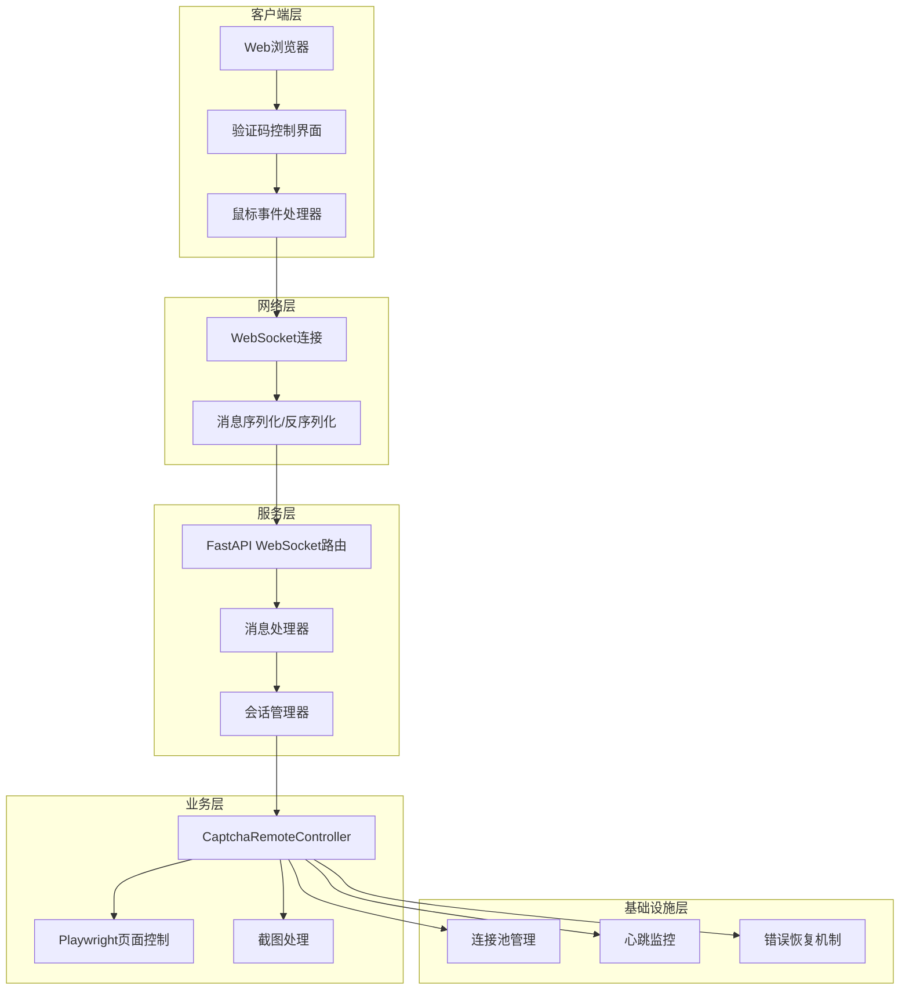
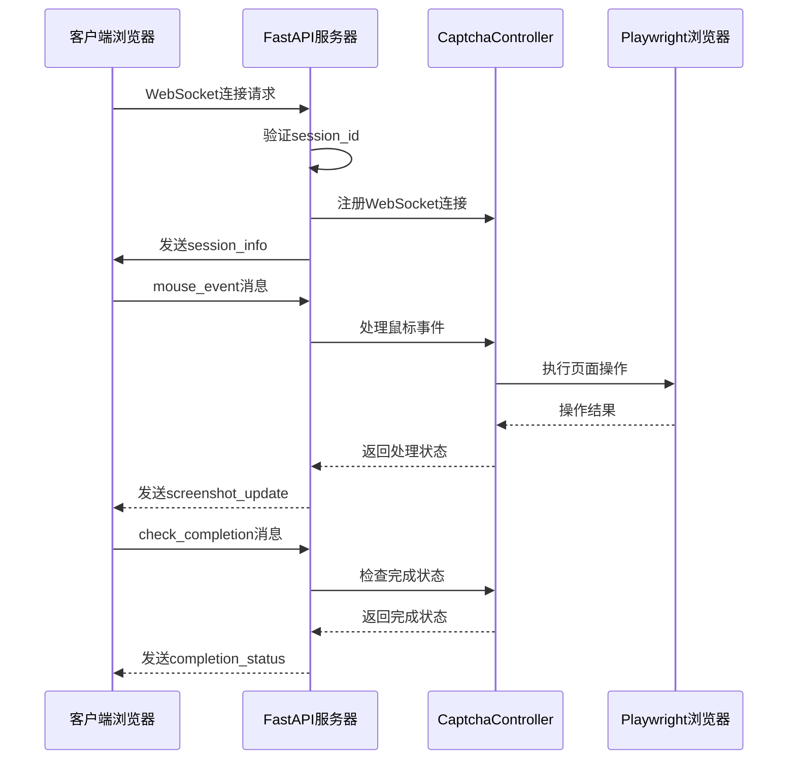
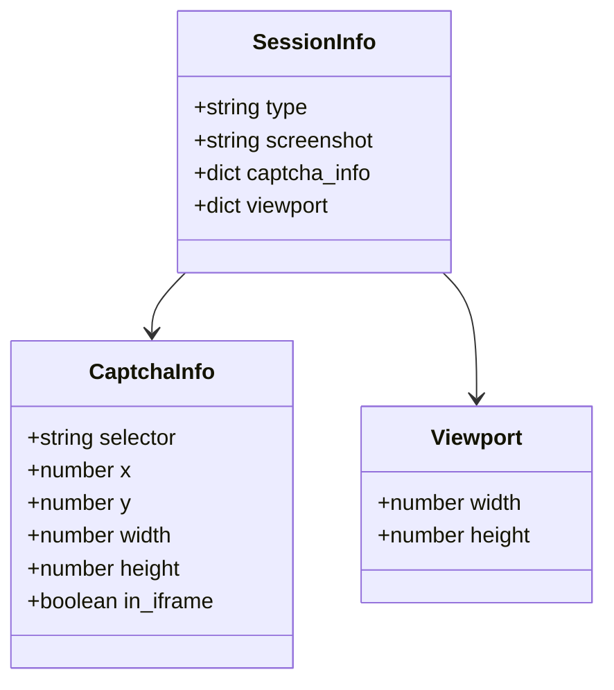
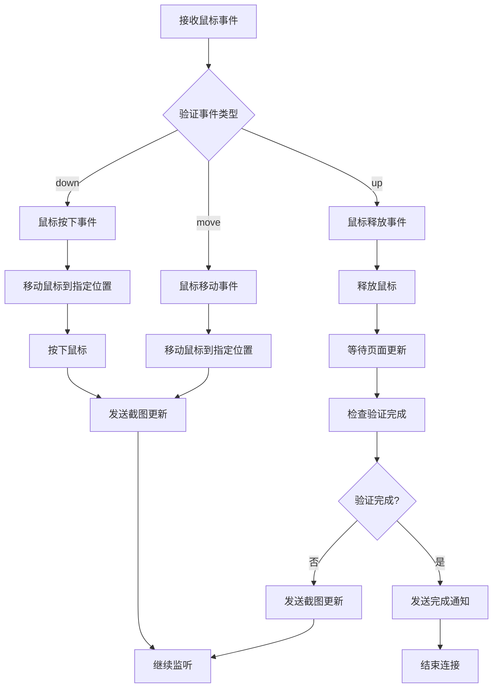
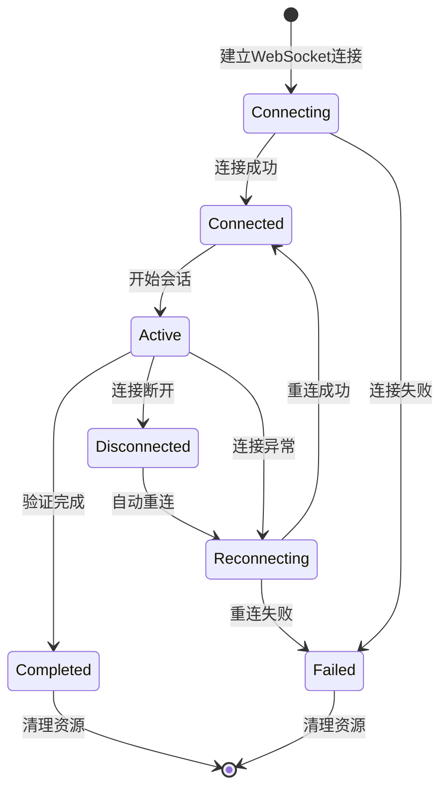
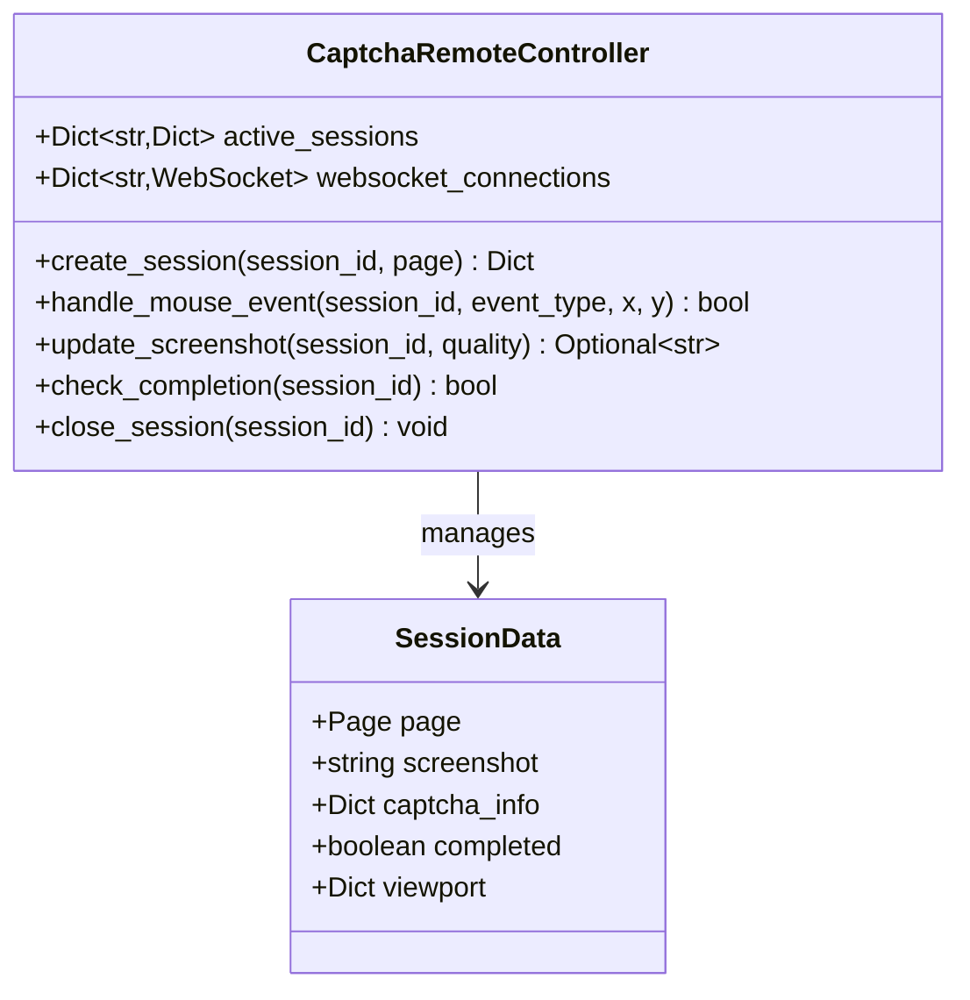
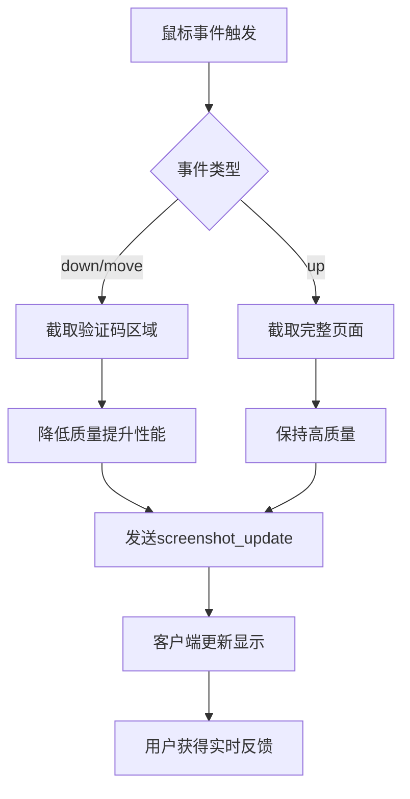
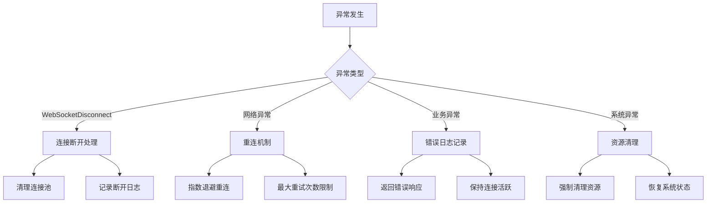
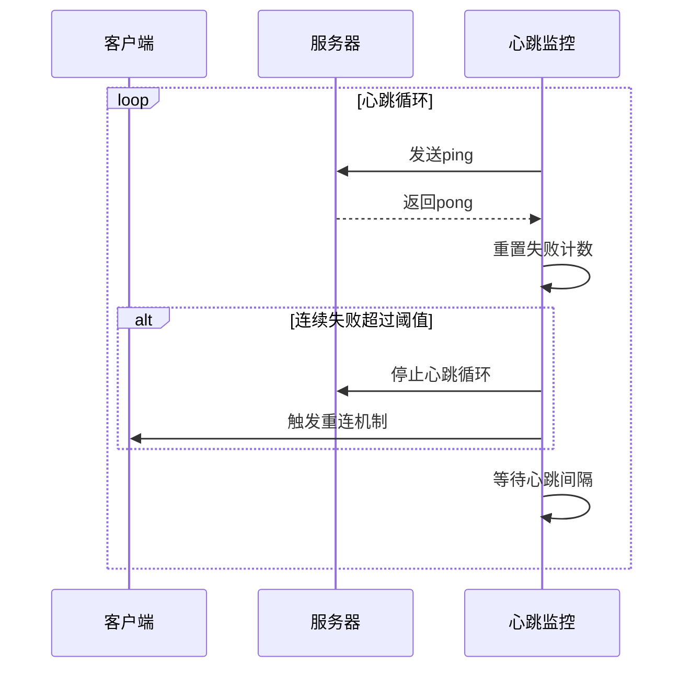
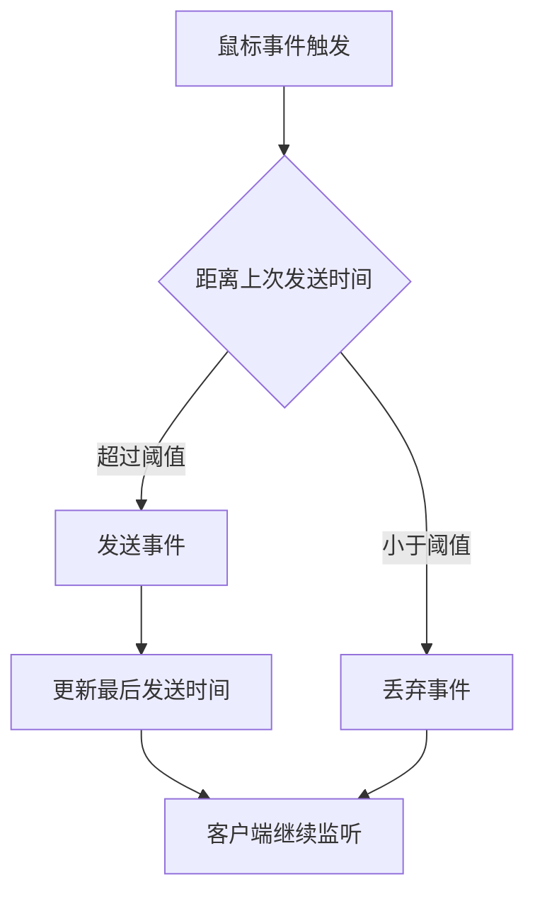

# WebSocket实时通信接口

<cite>
**本文档中引用的文件**
- [api_captcha_remote.py](file://api_captcha_remote.py)
- [utils/captcha_remote_control.py](file://utils/captcha_remote_control.py)
- [captcha_control.html](file://captcha_control.html)
- [utils/ws_utils.py](file://utils/ws_utils.py)
- [XianyuAutoAsync.py](file://XianyuAutoAsync.py)
</cite>

## 目录
1. [简介](#简介)
2. [系统架构概览](#系统架构概览)
3. [WebSocket端点详解](#websocket端点详解)
4. [消息类型与协议](#消息类型与协议)
5. [连接管理与生命周期](#连接管理与生命周期)
6. [实时控制机制](#实时控制机制)
7. [错误处理与恢复](#错误处理与恢复)
8. [性能优化策略](#性能优化策略)
9. [故障排除指南](#故障排除指南)
10. [总结](#总结)

## 简介

本文档详细描述了基于FastAPI的WebSocket实时通信接口，专门用于刮刮乐验证码的远程控制。该系统通过WebSocket实现实时传输截图、接收鼠标事件和提供验证码自动化操作功能，为用户提供直观的远程控制体验。

核心特性包括：
- 实时验证码截图传输
- 鼠标事件远程控制
- 心跳机制保持连接活跃
- 自动化完成状态检测
- 完善的错误处理和连接恢复

## 系统架构概览

WebSocket实时通信系统采用分层架构设计，包含以下核心组件：

**图表来源**
- [api_captcha_remote.py](file://api_captcha_remote.py#L38-L156)
- [utils/captcha_remote_control.py](file://utils/captcha_remote_control.py#L14-L369)

**章节来源**
- [api_captcha_remote.py](file://api_captcha_remote.py#L1-L319)
- [utils/captcha_remote_control.py](file://utils/captcha_remote_control.py#L1-L369)

## WebSocket端点详解

### 主要端点结构

系统的核心WebSocket端点位于 `/api/captcha/ws/{session_id}`，提供完整的实时通信功能。

**图表来源**
- [api_captcha_remote.py](file://api_captcha_remote.py#L38-L156)
- [utils/captcha_remote_control.py](file://utils/captcha_remote_control.py#L197-L238)

### 端点实现细节

WebSocket端点的实现包含以下关键步骤：

1. **连接接受与验证**：服务器接受WebSocket连接并验证会话ID
2. **会话信息初始化**：向客户端发送初始的验证码截图、元数据和视口信息
3. **持续消息监听**：维护长连接并持续处理客户端消息
4. **资源清理**：连接断开时清理相关资源

**章节来源**
- [api_captcha_remote.py](file://api_captcha_remote.py#L38-L156)

## 消息类型与协议

### 核心消息类型

系统定义了多种消息类型来支持完整的实时通信需求：

| 消息类型 | 方向 | 描述 | 数据结构 |
|---------|------|------|----------|
| `session_info` | 服务器→客户端 | 初始会话信息 | 包含截图、验证码信息、视口尺寸 |
| `mouse_event` | 客户端→服务器 | 鼠标事件 | 事件类型(down/move/up)和坐标 |
| `screenshot_update` | 服务器→客户端 | 截图更新 | 实时更新的验证码截图 |
| `completed` | 服务器→客户端 | 验证完成通知 | 验证成功的最终通知 |
| `check_completion` | 客户端→服务器 | 手动检查完成状态 | 请求当前完成状态 |
| `completion_status` | 服务器→客户端 | 完成状态响应 | 当前验证完成状态 |
| `ping` | 客户端→服务器 | 心跳请求 | 简单的心跳消息 |
| `pong` | 服务器→客户端 | 心跳响应 | 心跳确认响应 |

### 会话信息格式

**图表来源**
- [api_captcha_remote.py](file://api_captcha_remote.py#L53-L58)
- [utils/captcha_remote_control.py](file://utils/captcha_remote_control.py#L98-L158)

### 鼠标事件处理流程

**图表来源**
- [api_captcha_remote.py](file://api_captcha_remote.py#L77-L126)
- [utils/captcha_remote_control.py](file://utils/captcha_remote_control.py#L197-L238)

**章节来源**
- [api_captcha_remote.py](file://api_captcha_remote.py#L77-L141)
- [utils/captcha_remote_control.py](file://utils/captcha_remote_control.py#L197-L238)

## 连接管理与生命周期

### 连接状态管理

系统实现了完善的连接状态管理机制，包括连接建立、维护和清理的完整生命周期。

### 会话注册与管理

CaptchaRemoteController负责管理所有活跃的WebSocket连接和会话状态：

**图表来源**
- [utils/captcha_remote_control.py](file://utils/captcha_remote_control.py#L14-L369)

### 连接池管理

系统通过websocket_connections字典维护活跃的WebSocket连接池，支持多客户端同时连接：

**章节来源**
- [utils/captcha_remote_control.py](file://utils/captcha_remote_control.py#L14-L369)
- [api_captcha_remote.py](file://api_captcha_remote.py#L47-L156)

## 实时控制机制

### 鼠标事件处理

系统提供了精确的鼠标事件处理机制，支持完整的鼠标操作序列：

1. **事件捕获**：客户端捕获鼠标按下、移动和释放事件
2. **坐标转换**：将屏幕坐标转换为Canvas坐标
3. **事件转发**：将鼠标事件转发给服务器进行处理
4. **实时反馈**：根据操作结果实时更新界面状态

### 截图实时更新

系统实现了智能的截图更新机制：

**图表来源**
- [utils/captcha_remote_control.py](file://utils/captcha_remote_control.py#L160-L195)
- [captcha_control.html](file://captcha_control.html#L491-L550)

### 完成状态检测

系统实现了多层次的完成状态检测机制：

1. **DOM元素检查**：检查验证码相关DOM元素是否存在
2. **可见性验证**：确认元素是否真正可见
3. **内容分析**：分析页面内容判断验证状态
4. **多次确认**：通过多次检查避免误判

**章节来源**
- [utils/captcha_remote_control.py](file://utils/captcha_remote_control.py#L240-L316)
- [captcha_control.html](file://captcha_control.html#L420-L465)

## 错误处理与恢复

### 异常分类与处理

系统对不同类型的异常进行了分类处理：

### 连接断开清理逻辑

当WebSocket连接断开时，系统执行以下清理操作：

1. **连接池清理**：从websocket_connections中移除断开的连接
2. **资源释放**：释放相关的页面资源和内存
3. **状态重置**：重置会话状态为未连接
4. **日志记录**：记录连接断开的原因和时间

### 心跳机制

系统实现了完善的心跳机制来维持连接活跃：

**图表来源**
- [XianyuAutoAsync.py](file://XianyuAutoAsync.py#L5221-L5281)

**章节来源**
- [api_captcha_remote.py](file://api_captcha_remote.py#L142-L156)
- [XianyuAutoAsync.py](file://XianyuAutoAsync.py#L5221-L5281)

## 性能优化策略

### 截图质量优化

系统采用了多层次的性能优化策略：

1. **自适应质量调整**：根据操作类型动态调整截图质量
   - 鼠标按下/移动时使用低质量(30%)以提升性能
   - 验证完成时使用高质量(75-80%)保证准确性

2. **区域截取优化**：只截取验证码相关区域而非整个页面
3. **缓存机制**：避免重复的截图操作
4. **异步处理**：使用异步操作避免阻塞主线程

### 消息节流机制

客户端实现了消息节流机制来防止过度频繁的消息发送：

**图表来源**
- [captcha_control.html](file://captcha_control.html#L514-L528)

### 连接复用

系统支持多个客户端同时连接同一个会话，通过会话ID进行区分管理。

**章节来源**
- [utils/captcha_remote_control.py](file://utils/captcha_remote_control.py#L160-L195)
- [captcha_control.html](file://captcha_control.html#L514-L528)

## 故障排除指南

### 常见问题诊断

| 问题症状 | 可能原因 | 解决方案 |
|---------|---------|---------|
| 连接频繁断开 | 网络不稳定 | 检查网络连接，启用自动重连 |
| 截图更新缓慢 | 图片质量过高 | 调整截图质量参数 |
| 鼠标事件无响应 | 事件坐标计算错误 | 检查坐标转换逻辑 |
| 验证完成检测失败 | DOM元素检查不准确 | 增加检查元素数量 |
| 心跳超时 | 服务器负载过高 | 调整心跳间隔时间 |

### 日志分析

系统提供了详细的日志记录功能，帮助诊断问题：

1. **连接日志**：记录连接建立、断开和重连过程
2. **操作日志**：记录鼠标事件和截图更新操作
3. **错误日志**：记录异常情况和错误堆栈
4. **性能日志**：记录操作耗时和系统状态

### 调试工具

系统提供了多种调试工具：

- **会话状态查询**：通过REST API查看活跃会话
- **截图获取**：直接获取当前验证码截图
- **完成状态检查**：手动检查验证完成状态

**章节来源**
- [api_captcha_remote.py](file://api_captcha_remote.py#L162-L245)

## 总结

WebSocket实时通信接口为刮刮乐验证码提供了完整的远程控制解决方案。通过精心设计的架构和完善的错误处理机制，系统实现了：

1. **实时性**：毫秒级的响应时间和流畅的用户体验
2. **可靠性**：完善的连接管理和自动恢复机制
3. **可扩展性**：支持多客户端同时连接和会话管理
4. **易维护性**：清晰的代码结构和详细的日志记录

该系统不仅解决了验证码自动化的技术难题，还为类似的人机交互场景提供了可参考的实现方案。通过持续的优化和改进，系统能够适应各种复杂的网络环境和业务需求。