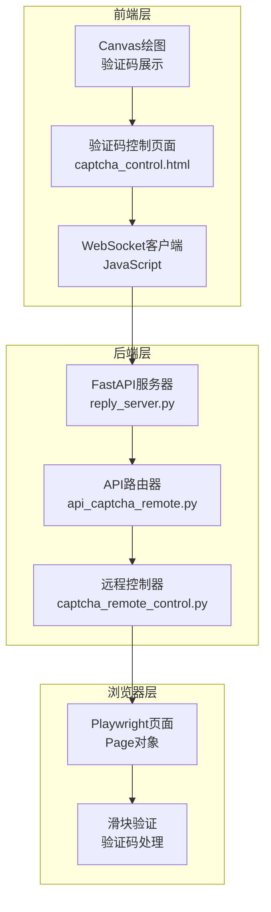
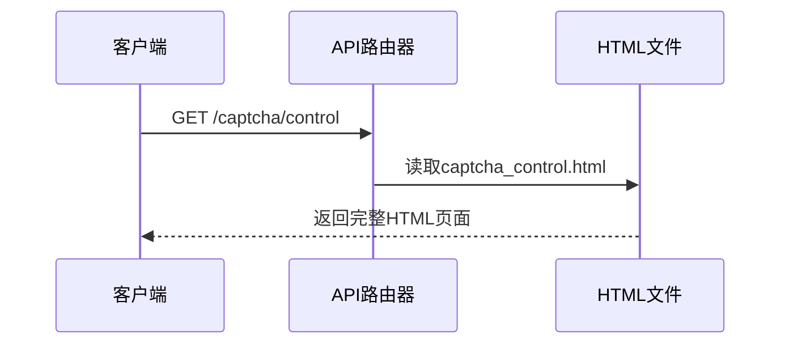
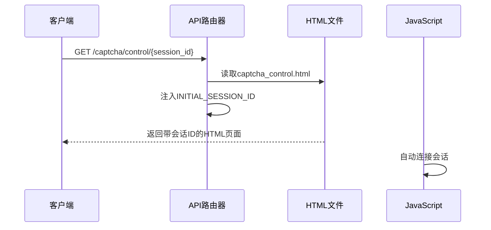
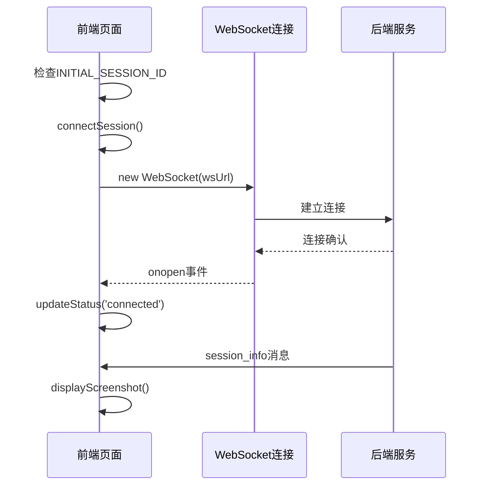
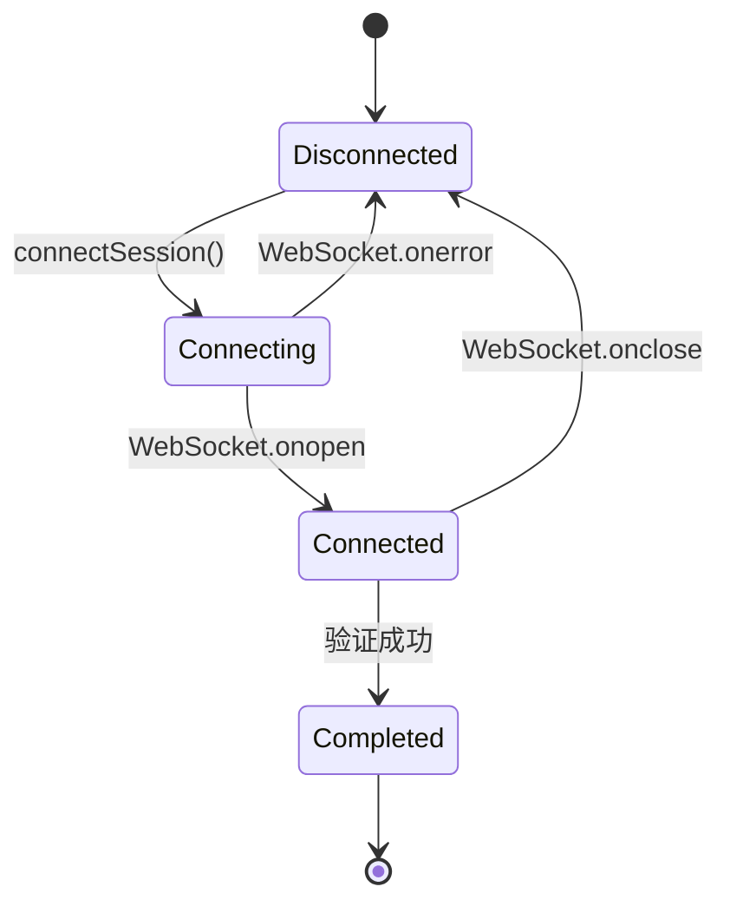
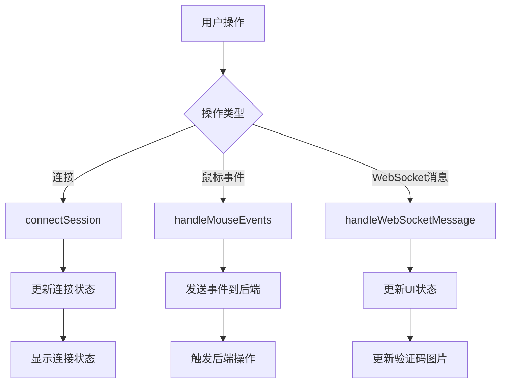
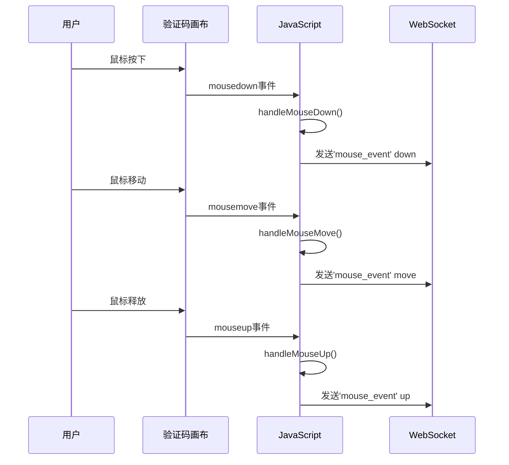
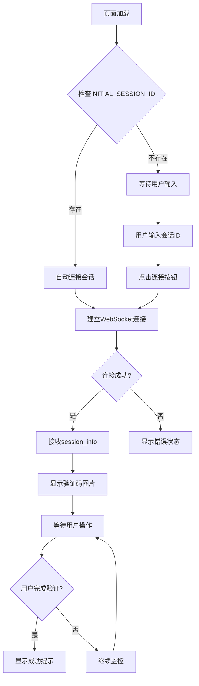
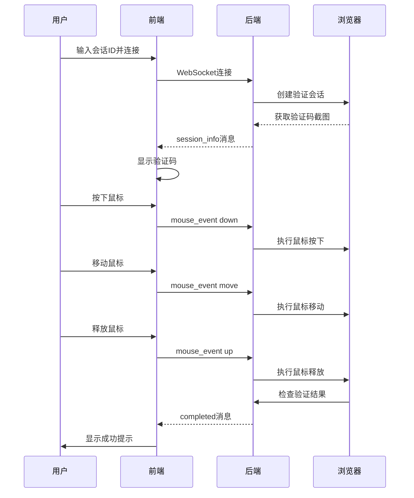

# 前端控制面板集成指南

<cite>
**本文档中引用的文件**
- [captcha_control.html](file://captcha_control.html)
- [api_captcha_remote.py](file://api_captcha_remote.py)
- [utils/captcha_remote_control.py](file://utils/captcha_remote_control.py)
- [utils/ws_utils.py](file://utils/ws_utils.py)
- [Start.py](file://Start.py)
- [reply_server.py](file://reply_server.py)
</cite>

## 目录
1. [简介](#简介)
2. [系统架构概览](#系统架构概览)
3. [核心路由分析](#核心路由分析)
4. [前端页面结构](#前端页面结构)
5. [WebSocket连接机制](#websocket连接机制)
6. [前端状态管理](#前端状态管理)
7. [用户交互处理](#用户交互处理)
8. [完整工作流程](#完整工作流程)
9. [技术实现细节](#技术实现细节)
10. [故障排除指南](#故障排除指南)

## 简介

本文档详细说明了如何集成和使用刮刮乐验证码控制面板的前端系统。该系统通过WebSocket实现实时交互，允许用户远程控制滑块验证过程，提供了完整的前端控制界面和后端服务支持。

## 系统架构概览

前端控制面板采用前后端分离架构，主要组件包括：



**图表来源**
- [captcha_control.html](file://captcha_control.html#L1-L572)
- [api_captcha_remote.py](file://api_captcha_remote.py#L1-L319)
- [utils/captcha_remote_control.py](file://utils/captcha_remote_control.py#L1-L369)

## 核心路由分析

### captcha_control_page路由

`/captcha/control`端点提供基础的验证码控制页面，适用于通用场景：



**图表来源**
- [api_captcha_remote.py](file://api_captcha_remote.py#L278-L300)

### captcha_control_page_with_session路由

`/captcha/control/{session_id}`端点提供带预设会话ID的控制页面，适用于嵌入式场景：



**图表来源**
- [api_captcha_remote.py](file://api_captcha_remote.py#L302-L318)

**章节来源**
- [api_captcha_remote.py](file://api_captcha_remote.py#L278-L318)

## 前端页面结构

### 页面布局组件

验证码控制页面采用现代化的响应式设计，主要包含以下组件：

| 组件 | 功能 | HTML元素 |
|------|------|----------|
| 状态指示器 | 显示连接状态 | `.status` |
| 会话输入区 | 输入和连接会话 | `.session-input` |
| 指示说明 | 操作指导 | `.instructions` |
| 信息面板 | 显示会话信息 | `.info-panel` |
| 验证码画布 | 展示验证码图片 | `#captchaCanvas` |
| 日志面板 | 显示操作日志 | `.log` |

### 嵌入模式支持

页面支持嵌入模式，通过URL参数或iframe检测自动调整布局：

```javascript
// 嵌入模式检测逻辑
const isEmbed = urlParams.get('embed') === '1' || window.self !== window.top;
```

**章节来源**
- [captcha_control.html](file://captcha_control.html#L248-L335)

## WebSocket连接机制

### 连接建立流程

前端JavaScript通过WebSocket与后端建立实时连接：



**图表来源**
- [captcha_control.html](file://captcha_control.html#L385-L417)

### 消息类型处理

前端WebSocket客户端处理多种消息类型：

| 消息类型 | 处理函数 | 功能描述 |
|----------|----------|----------|
| `session_info` | `handleWebSocketMessage()` | 接收初始会话信息和验证码截图 |
| `screenshot_update` | `handleWebSocketMessage()` | 接收更新的验证码截图 |
| `completed` | `handleWebSocketMessage()` | 验证成功通知 |
| `error` | `handleWebSocketMessage()` | 错误信息处理 |

### 连接状态管理



**章节来源**
- [captcha_control.html](file://captcha_control.html#L385-L417)
- [captcha_control.html](file://captcha_control.html#L420-L465)

## 前端状态管理

### INITIAL_SESSION_ID注入机制

系统通过JavaScript全局变量`INITIAL_SESSION_ID`实现会话ID的自动注入：

```javascript
// 注入机制实现
if (window.INITIAL_SESSION_ID) {
    document.getElementById('sessionIdInput').value = window.INITIAL_SESSION_ID;
    connectSession();
}
```

### 前端状态变量

| 变量名 | 类型 | 用途 |
|--------|------|------|
| `currentSessionId` | String | 当前活动会话ID |
| `captchaOffset` | Object | 验证码容器偏移量 |
| `isMouseDown` | Boolean | 鼠标按下状态 |
| `lastMoveTime` | Number | 最后鼠标移动时间 |
| `moveThrottle` | Number | 鼠标事件节流间隔 |

### 状态更新机制



**图表来源**
- [captcha_control.html](file://captcha_control.html#L337-L341)
- [captcha_control.html](file://captcha_control.html#L360-L368)

**章节来源**
- [captcha_control.html](file://captcha_control.html#L303-L341)
- [captcha_control.html](file://captcha_control.html#L360-L368)

## 用户交互处理

### 鼠标事件捕获

前端实现了完整的鼠标事件捕获和处理机制：



**图表来源**
- [captcha_control.html](file://captcha_control.html#L491-L551)

### 坐标转换机制

系统实现了精确的坐标转换，将浏览器坐标转换为页面实际坐标：

```javascript
function getMouseCoords(event) {
    const rect = canvas.getBoundingClientRect();
    const scaleX = canvas.width / rect.width;
    const scaleY = canvas.height / rect.height;
    
    const canvasX = Math.round((event.clientX - rect.left) * scaleX);
    const canvasY = Math.round((event.clientY - rect.top) * scaleY);
    
    return {
        x: canvasX + captchaOffset.x,
        y: canvasY + captchaOffset.y
    };
}
```

### 事件节流机制

为了避免频繁的鼠标事件导致性能问题，系统实现了事件节流：

```javascript
const moveThrottle = 5; // 每5ms最多发送一次
const now = Date.now();
if (now - lastMoveTime < moveThrottle) {
    return; // 跳过这次事件
}
lastMoveTime = now;
```

**章节来源**
- [captcha_control.html](file://captcha_control.html#L491-L567)

## 完整工作流程

### 页面加载流程



**图表来源**
- [captcha_control.html](file://captcha_control.html#L313-L341)
- [captcha_control.html](file://captcha_control.html#L385-L417)

### 验证过程流程



**图表来源**
- [captcha_control.html](file://captcha_control.html#L491-L551)
- [api_captcha_remote.py](file://api_captcha_remote.py#L77-L107)

**章节来源**
- [captcha_control.html](file://captcha_control.html#L313-L341)
- [captcha_control.html](file://captcha_control.html#L385-L417)
- [captcha_control.html](file://captcha_control.html#L491-L551)

## 技术实现细节

### 图片渲染优化

前端实现了高效的图片渲染机制：

```javascript
function displayScreenshot(base64Image) {
    const img = new Image();
    img.onload = () => {
        // 动态调整canvas尺寸
        if (canvas.width !== img.width || canvas.height !== img.height) {
            canvas.width = img.width;
            canvas.height = img.height;
        }
        
        // 性能优化的图像平滑
        ctx.imageSmoothingEnabled = true;
        ctx.imageSmoothingQuality = 'low';
        
        ctx.drawImage(img, 0, 0);
        document.getElementById('loading').style.display = 'none';
        canvas.style.display = 'block';
    };
    img.src = `data:image/jpeg;base64,${base64Image}`;
}
```

### 错误处理机制

系统实现了完善的错误处理和恢复机制：

| 错误类型 | 处理策略 | 用户反馈 |
|----------|----------|----------|
| WebSocket连接失败 | 显示错误状态，禁用连接按钮 | "连接错误"状态指示 |
| 会话不存在 | 显示错误消息 | "会话不存在"提示 |
| 验证失败 | 显示警告，重置状态 | "验证未通过，请重试" |
| 网络中断 | 自动重连，恢复连接状态 | 连接状态自动更新 |

### 性能优化策略

1. **事件节流**: 鼠标移动事件每5ms最多发送一次
2. **图片压缩**: 使用JPEG格式，质量可调
3. **按需更新**: 只在必要时更新验证码截图
4. **内存管理**: 及时清理不再使用的资源

**章节来源**
- [captcha_control.html](file://captcha_control.html#L467-L489)
- [captcha_control.html](file://captcha_control.html#L514-L519)

## 故障排除指南

### 常见问题及解决方案

| 问题 | 可能原因 | 解决方案 |
|------|----------|----------|
| 无法连接WebSocket | 网络问题或端口被占用 | 检查网络连接，确认端口可用 |
| 验证码图片不显示 | 图片数据损坏或格式错误 | 检查后端截图生成逻辑 |
| 鼠标事件无响应 | 事件监听器未正确绑定 | 检查DOM元素加载状态 |
| 会话超时 | 会话未及时更新 | 检查心跳机制和连接状态 |

### 调试工具

前端提供了详细的日志系统：

```javascript
function log(message, type = 'info') {
    const logEl = document.getElementById('log');
    const entry = document.createElement('div');
    entry.className = `log-entry ${type}`;
    const timestamp = new Date().toLocaleTimeString();
    entry.textContent = `[${timestamp}] ${message}`;
    logEl.appendChild(entry);
    logEl.scrollTop = logEl.scrollHeight;
}
```

### 监控指标

系统提供以下监控指标：

- 连接状态：connected/disconnected/completed
- 验证状态：待处理/验证中/已完成
- 操作计数：鼠标事件数量
- 错误统计：各类错误发生次数

**章节来源**
- [captcha_control.html](file://captcha_control.html#L350-L358)
- [captcha_control.html](file://captcha_control.html#L420-L465)

## 结论

前端控制面板提供了完整的刮刮乐验证码远程控制解决方案，通过WebSocket实现实时交互，支持会话管理和状态跟踪。系统具有良好的扩展性和稳定性，能够满足各种应用场景的需求。

开发者可以通过本指南快速集成和部署验证码控制面板，实现自动化验证流程的远程控制功能。