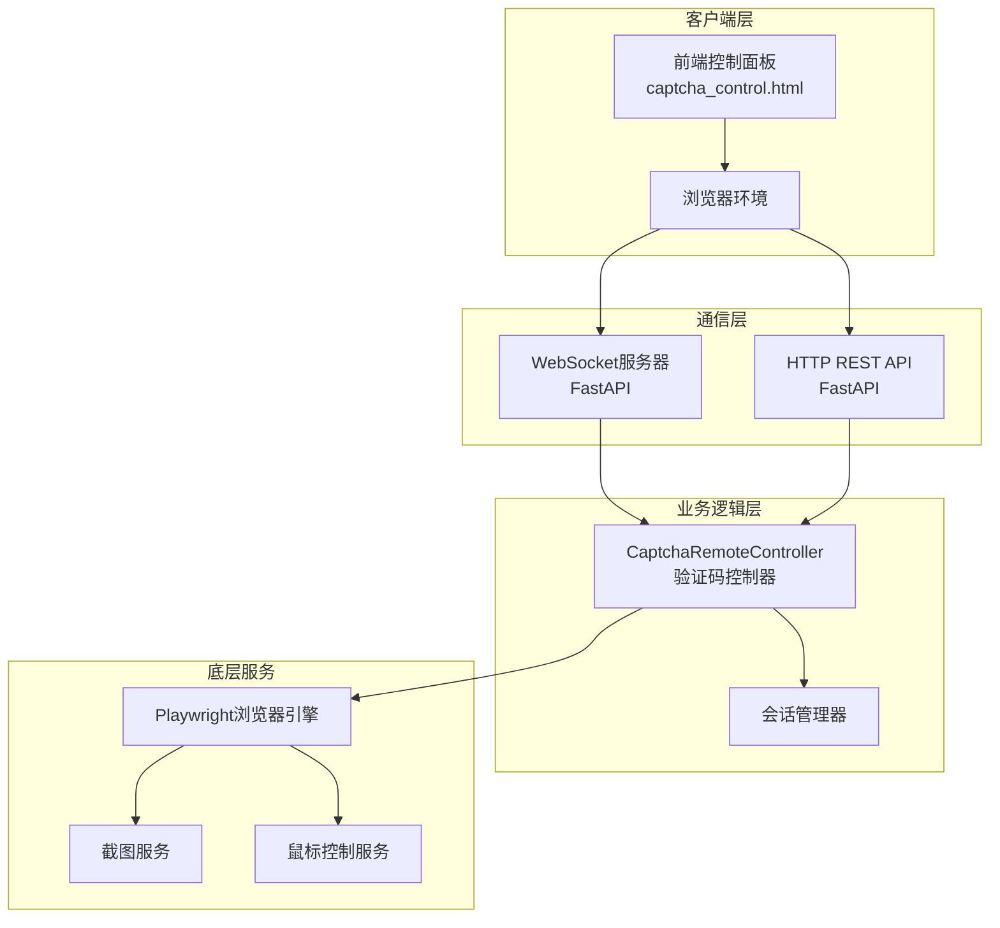
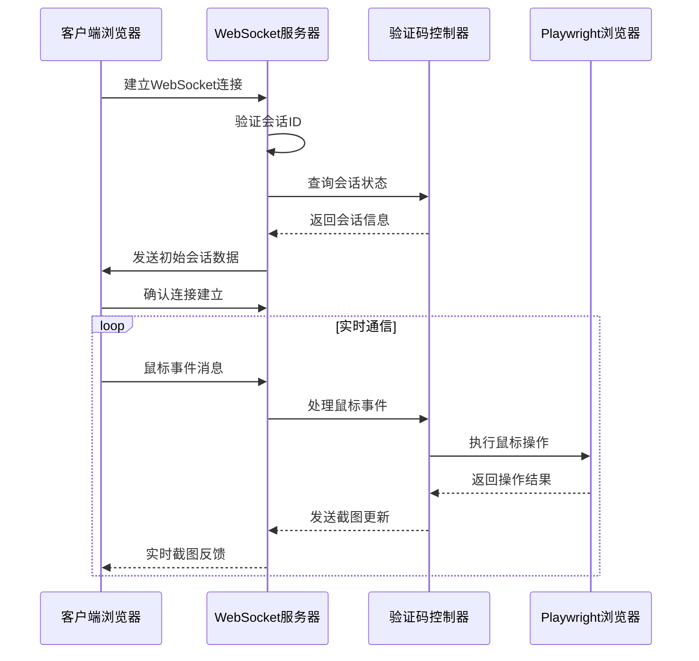
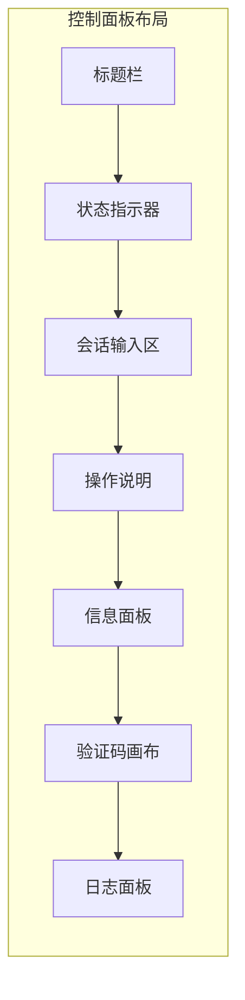
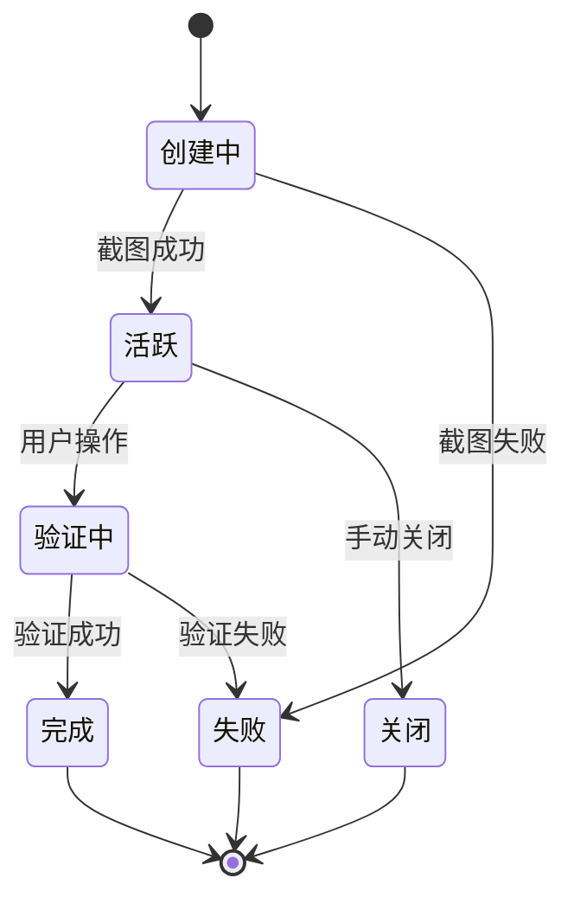
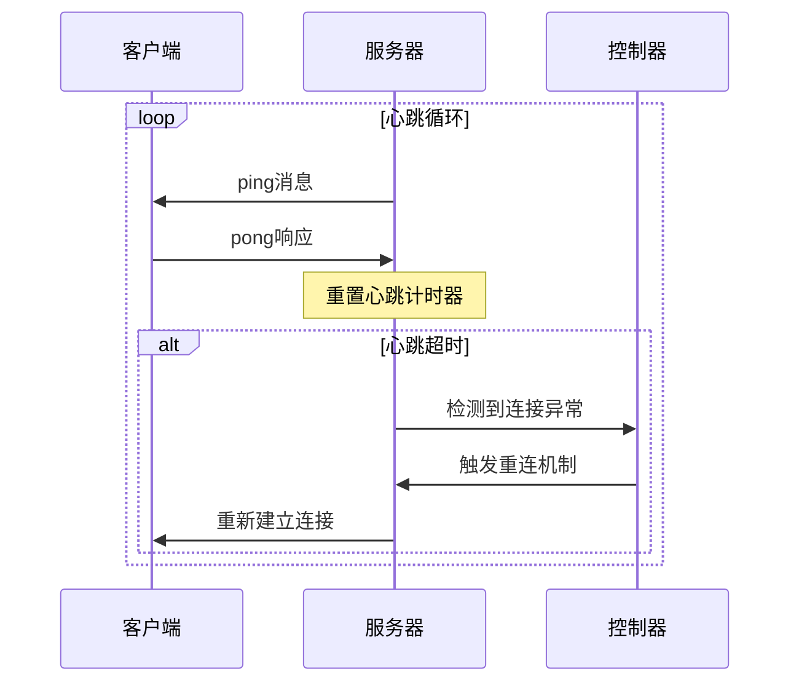
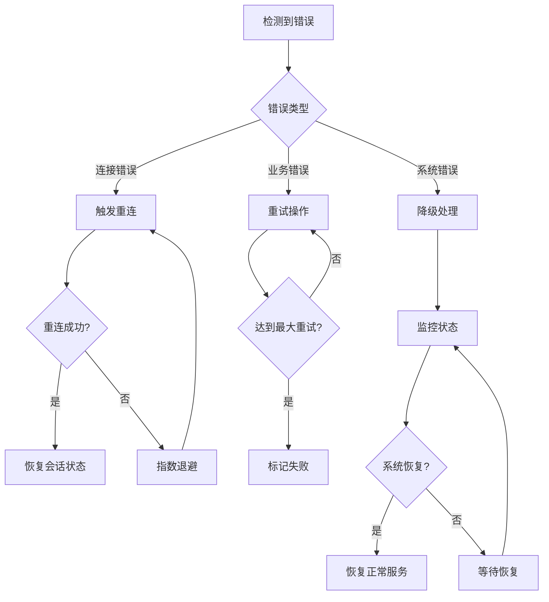

# 验证码远程控制接口

<cite>
**本文档中引用的文件**
- [api_captcha_remote.py](file://api_captcha_remote.py)
- [utils/captcha_remote_control.py](file://utils/captcha_remote_control.py)
- [utils/ws_utils.py](file://utils/ws_utils.py)
- [captcha_control.html](file://captcha_control.html)
- [config.py](file://config.py)
- [global_config.yml](file://global_config.yml)
- [reply_server.py](file://reply_server.py)
</cite>

## 目录
1. [简介](#简介)
2. [系统架构](#系统架构)
3. [WebSocket实时通信](#websocket实时通信)
4. [HTTP RESTful接口](#http-restful接口)
5. [前端控制面板](#前端控制面板)
6. [会话管理](#会话管理)
7. [消息格式规范](#消息格式规范)
8. [心跳机制](#心跳机制)
9. [错误处理与故障恢复](#错误处理与故障恢复)
10. [集成指南](#集成指南)
11. [最佳实践](#最佳实践)

## 简介

验证码远程控制接口是一个基于WebSocket和HTTP RESTful协议的综合解决方案，专门用于远程人工干预滑块验证过程。该系统提供了实时的屏幕截图传输、鼠标事件处理和验证状态监控功能，支持高效的刮刮乐验证操作。

### 核心特性

- **实时通信**：基于WebSocket的双向实时数据传输
- **多协议支持**：同时提供WebSocket和HTTP RESTful两种交互方式
- **高性能截图**：智能截取验证码区域，优化传输效率
- **精确鼠标控制**：毫秒级鼠标事件精度，支持复杂的验证操作
- **智能状态监控**：实时验证状态跟踪和完成检测
- **自动重连机制**：网络中断后的自动恢复能力

## 系统架构



**图表来源**
- [api_captcha_remote.py](file://api_captcha_remote.py#L1-L50)
- [utils/captcha_remote_control.py](file://utils/captcha_remote_control.py#L1-L50)

**章节来源**
- [api_captcha_remote.py](file://api_captcha_remote.py#L1-L319)
- [utils/captcha_remote_control.py](file://utils/captcha_remote_control.py#L1-L369)

## WebSocket实时通信

### 连接建立流程

WebSocket连接采用标准的握手协议，支持自动重连和心跳保持：



**图表来源**
- [api_captcha_remote.py](file://api_captcha_remote.py#L38-L156)
- [utils/captcha_remote_control.py](file://utils/captcha_remote_control.py#L197-L239)

### 消息格式定义

#### 1. 鼠标事件消息

| 字段名 | 类型 | 描述 | 示例 |
|--------|------|------|------|
| type | string | 消息类型，固定为"mouse_event" | "mouse_event" |
| event_type | string | 事件类型：down/move/up | "down" |
| x | integer | 鼠标X坐标（页面坐标系） | 120 |
| y | integer | 鼠标Y坐标（页面坐标系） | 250 |

#### 2. 截图更新消息

| 字段名 | 类型 | 描述 | 示例 |
|--------|------|------|------|
| type | string | 消息类型，固定为"screenshot_update" | "screenshot_update" |
| screenshot | string | Base64编码的JPEG图像数据 | "iVBORw0KGgoAAAANS..." |

#### 3. 完成状态消息

| 字段名 | 类型 | 描述 | 示例 |
|--------|------|------|------|
| type | string | 消息类型，固定为"completed" | "completed" |
| message | string | 完成状态描述 | "验证成功！" |

#### 4. 心跳消息

| 字段名 | 类型 | 描述 | 示例 |
|--------|------|------|------|
| type | string | 消息类型，固定为"ping"/"pong" | "ping" |
| timestamp | integer | 时间戳（可选） | 1640995200000 |

**章节来源**
- [api_captcha_remote.py](file://api_captcha_remote.py#L38-L156)
- [utils/captcha_remote_control.py](file://utils/captcha_remote_control.py#L197-L239)

## HTTP RESTful接口

### 会话管理端点

#### 获取活跃会话列表

**GET** `/api/captcha/sessions`

获取所有当前活跃的验证会话信息。

**响应格式：**
```json
{
    "count": 3,
    "sessions": [
        {
            "session_id": "user123",
            "completed": false,
            "has_websocket": true
        }
    ]
}
```

#### 获取指定会话信息

**GET** `/api/captcha/session/{session_id}`

获取特定会话的详细信息。

**响应格式：**
```json
{
    "session_id": "user123",
    "screenshot": "iVBORw0KGgoAAAANS...",
    "captcha_info": {
        "selector": "#nocaptcha",
        "x": 120,
        "y": 250,
        "width": 300,
        "height": 100
    },
    "viewport": {
        "width": 1920,
        "height": 1080
    },
    "completed": false
}
```

#### 获取最新截图

**GET** `/api/captcha/screenshot/{session_id}`

获取指定会话的最新截图。

**响应格式：**
```json
{
    "screenshot": "iVBORw0KGgoAAAANS..."
}
```

### 鼠标事件处理

#### 处理鼠标事件（HTTP方式）

**POST** `/api/captcha/mouse_event`

通过HTTP POST方式处理鼠标事件（不推荐，建议使用WebSocket）。

**请求体：**
```json
{
    "session_id": "user123",
    "event_type": "down",
    "x": 120,
    "y": 250
}
```

**响应格式：**
```json
{
    "success": true,
    "completed": false
}
```

### 状态检查

#### 检查验证完成状态

**POST** `/api/captcha/check_completion`

手动检查指定会话的验证完成状态。

**请求体：**
```json
{
    "session_id": "user123"
}
```

**响应格式：**
```json
{
    "session_id": "user123",
    "completed": false
}
```

#### 获取验证状态（轮询方式）

**GET** `/api/captcha/status/{session_id}`

用于前端轮询检查验证状态。

**响应格式：**
```json
{
    "success": true,
    "completed": false,
    "session_exists": true,
    "session_id": "user123"
}
```

### 会话控制

#### 关闭会话

**DELETE** `/api/captcha/session/{session_id}`

关闭指定的验证会话。

**响应格式：**
```json
{
    "success": true
}
```

**章节来源**
- [api_captcha_remote.py](file://api_captcha_remote.py#L161-L244)

## 前端控制面板

### 页面结构

前端控制面板采用现代化的Web界面设计，提供直观的验证码操作体验：



**图表来源**
- [captcha_control.html](file://captcha_control.html#L1-L100)

### 主要功能组件

#### 1. 状态监控

- **连接状态**：实时显示WebSocket连接状态
- **验证进度**：跟踪验证过程中的各个阶段
- **操作历史**：记录所有用户操作和系统响应

#### 2. 验证码画布

- **高分辨率显示**：支持高质量的验证码图像展示
- **精确坐标**：自动转换鼠标坐标到页面坐标
- **实时更新**：验证过程中的动态截图更新

#### 3. 操作控制

- **鼠标事件捕获**：精确的鼠标按下、移动、释放事件
- **节流机制**：避免高频事件导致的性能问题
- **坐标转换**：自动处理画布坐标与页面坐标的转换

### 集成示例

#### 嵌入式集成

```javascript
// 创建嵌入式验证码控制面板
const iframe = document.createElement('iframe');
iframe.src = '/api/captcha/control/user123?embed=1';
iframe.style.width = '100%';
iframe.style.height = '600px';
iframe.style.border = 'none';
document.body.appendChild(iframe);
```

#### 独立窗口模式

```javascript
// 打开独立的验证码控制窗口
const controlWindow = window.open(
    '/api/captcha/control/user123',
    '验证码控制',
    'width=900,height=700'
);
```

**章节来源**
- [captcha_control.html](file://captcha_control.html#L1-L572)
- [api_captcha_remote.py](file://api_captcha_remote.py#L277-L319)

## 会话管理

### 会话生命周期



### 会话数据结构

每个活跃会话维护以下数据结构：

| 字段名 | 类型 | 描述 |
|--------|------|------|
| page | Page | Playwright页面对象 |
| screenshot | string | Base64编码的截图数据 |
| captcha_info | dict | 验证码位置和尺寸信息 |
| completed | boolean | 验证完成标志 |
| viewport | dict | 视口尺寸信息 |

### 会话创建流程

1. **会话初始化**：生成唯一会话ID并创建Playwright页面
2. **验证码定位**：自动识别验证码容器的位置和尺寸
3. **初始截图**：截取验证码区域的首张截图
4. **状态注册**：将会话信息注册到活跃会话池
5. **连接建立**：等待客户端连接并传输初始数据

**章节来源**
- [utils/captcha_remote_control.py](file://utils/captcha_remote_control.py#L17-L89)

## 消息格式规范

### WebSocket消息类型

#### 1. 会话信息消息

```json
{
    "type": "session_info",
    "screenshot": "base64_jpeg_data",
    "captcha_info": {
        "selector": "#nocaptcha",
        "x": 120,
        "y": 250,
        "width": 300,
        "height": 100
    },
    "viewport": {
        "width": 1920,
        "height": 1080
    }
}
```

#### 2. 截图更新消息

```json
{
    "type": "screenshot_update",
    "screenshot": "base64_jpeg_data"
}
```

#### 3. 完成通知消息

```json
{
    "type": "completed",
    "message": "验证成功！"
}
```

#### 4. 错误消息

```json
{
    "type": "error",
    "message": "会话不存在"
}
```

### HTTP请求/响应格式

#### 鼠标事件请求

```json
{
    "session_id": "user123",
    "event_type": "down",
    "x": 120,
    "y": 250
}
```

#### 会话状态响应

```json
{
    "session_id": "user123",
    "completed": false,
    "has_websocket": true
}
```

**章节来源**
- [api_captcha_remote.py](file://api_captcha_remote.py#L21-L32)

## 心跳机制

### WebSocket心跳

系统实现了完善的心跳机制来维持长连接的稳定性：



**图表来源**
- [utils/ws_utils.py](file://utils/ws_utils.py#L16-L89)

### 心跳配置

| 参数 | 默认值 | 描述 |
|------|--------|------|
| ping_interval | None | WebSocket ping间隔（禁用内置心跳） |
| ping_timeout | None | WebSocket ping超时时间 |
| 心跳间隔 | 15秒 | 自定义心跳发送间隔 |
| 超时时间 | 30秒 | 心跳响应超时阈值 |

### 重连策略

1. **指数退避**：重连失败时采用指数退避算法
2. **最大重试**：限制最大重试次数防止无限重连
3. **状态恢复**：重连成功后恢复之前的会话状态
4. **优雅降级**：在网络不稳定时降低消息发送频率

**章节来源**
- [utils/ws_utils.py](file://utils/ws_utils.py#L16-L89)

## 错误处理与故障恢复

### 错误分类

#### 1. 连接错误

- **网络中断**：WebSocket连接意外断开
- **服务器不可达**：目标服务器无响应
- **认证失败**：无效的会话ID或权限不足

#### 2. 业务错误

- **会话不存在**：请求的会话ID无效
- **验证码未找到**：无法识别验证码位置
- **操作超时**：鼠标操作执行超时

#### 3. 系统错误

- **资源不足**：内存或CPU使用率过高
- **依赖服务异常**：Playwright或其他依赖服务故障
- **配置错误**：系统配置不正确

### 故障恢复机制



### 监控指标

#### 关键性能指标

| 指标名称 | 描述 | 正常范围 |
|----------|------|----------|
| 连接成功率 | WebSocket连接成功的比例 | > 95% |
| 消息延迟 | 消息发送到接收的时间差 | < 100ms |
| 截图成功率 | 成功获取截图的比例 | > 90% |
| 验证成功率 | 验证操作成功的比例 | > 85% |

#### 告警阈值

- **连接断开**：连续3次心跳失败
- **性能下降**：消息延迟超过200ms
- **资源告警**：CPU使用率超过80%
- **业务异常**：验证失败率超过10%

**章节来源**
- [utils/ws_utils.py](file://utils/ws_utils.py#L73-L89)
- [utils/captcha_remote_control.py](file://utils/captcha_remote_control.py#L334-L364)

## 集成指南

### 前端集成步骤

#### 1. 基础HTML集成

```html
<!DOCTYPE html>
<html>
<head>
    <title>验证码远程控制</title>
</head>
<body>
    <!-- 验证码控制面板 -->
    <div id="captcha-container"></div>
    
    <script>
        // 加载验证码控制脚本
        const script = document.createElement('script');
        script.src = '/static/js/captcha-control.js';
        document.body.appendChild(script);
    </script>
</body>
</html>
```

#### 2. JavaScript API调用

```javascript
// 创建验证码控制器实例
const captchaController = new CaptchaController({
    apiUrl: '/api/captcha',
    sessionId: 'user123',
    onEvent: (event) => {
        console.log('验证码事件:', event);
    },
    onError: (error) => {
        console.error('验证码错误:', error);
    }
});

// 连接到WebSocket
await captchaController.connect();

// 处理鼠标事件
captchaController.onMouseEvent({
    type: 'mouse_event',
    event_type: 'down',
    x: 120,
    y: 250
});
```

#### 3. 嵌入式集成

```javascript
// 嵌入到现有页面中
class EmbeddedCaptchaControl {
    constructor(containerId, sessionId) {
        this.container = document.getElementById(containerId);
        this.sessionId = sessionId;
        this.iframe = null;
    }
    
    render() {
        this.iframe = document.createElement('iframe');
        this.iframe.src = `/api/captcha/control/${this.sessionId}?embed=1`;
        this.iframe.style.width = '100%';
        this.iframe.style.height = '400px';
        this.iframe.style.border = 'none';
        
        this.container.innerHTML = '';
        this.container.appendChild(this.iframe);
    }
}
```

### 后端集成步骤

#### 1. FastAPI应用配置

```python
from fastapi import FastAPI
from api_captcha_remote import router as captcha_router

app = FastAPI()

# 注册验证码路由
app.include_router(captcha_router, prefix="/api")

# 静态文件服务
import os
from fastapi.staticfiles import StaticFiles
app.mount("/static", StaticFiles(directory="static"), name="static")
```

#### 2. 会话管理集成

```python
from utils.captcha_remote_control import captcha_controller

class CaptchaSessionManager:
    @staticmethod
    async def create_session(session_id: str, page):
        """创建新的验证码会话"""
        return await captcha_controller.create_session(session_id, page)
    
    @staticmethod
    async def handle_mouse_event(session_id: str, event_type: str, x: int, y: int):
        """处理鼠标事件"""
        return await captcha_controller.handle_mouse_event(session_id, event_type, x, y)
    
    @staticmethod
    async def check_completion(session_id: str):
        """检查验证完成状态"""
        return await captcha_controller.check_completion(session_id)
```

#### 3. WebSocket客户端集成

```python
from utils.ws_utils import WebSocketClient

class RemoteCaptchaClient:
    def __init__(self, url: str, session_id: str):
        self.client = WebSocketClient(
            url=f"{url}/api/captcha/ws/{session_id}",
            headers={"Authorization": "Bearer token"},
            on_message=self.handle_message
        )
    
    async def connect(self):
        """连接到远程验证码服务"""
        return await self.client.connect()
    
    async def send_mouse_event(self, event_type: str, x: int, y: int):
        """发送鼠标事件"""
        message = {
            "type": "mouse_event",
            "event_type": event_type,
            "x": x,
            "y": y
        }
        return await self.client.send(json.dumps(message))
    
    def handle_message(self, message):
        """处理接收到的消息"""
        data = json.loads(message)
        print(f"收到消息: {data['type']}")
```

### 配置管理

#### 1. 环境配置

```yaml
# global_config.yml
SLIDER_VERIFICATION:
  max_concurrent: 5      # 最大并发验证数
  wait_timeout: 120      # 等待超时时间（秒）
  
WEBSOCKET_HEADERS:
  Accept-Encoding: gzip, deflate, br
  User-Agent: Mozilla/5.0 (Windows NT 10.0; Win64; x64)
  
HEARTBEAT_INTERVAL: 15    # 心跳间隔（秒）
HEARTBEAT_TIMEOUT: 30     # 心跳超时（秒）
```

#### 2. 安全配置

```python
# 安全配置示例
SECURITY_CONFIG = {
    'max_session_age': 3600,      # 会话最大存活时间
    'max_reconnect_attempts': 5,  # 最大重连次数
    'message_throttle': 10,       # 消息节流频率（毫秒）
    'session_cleanup_interval': 300  # 会话清理间隔（秒）
}
```

**章节来源**
- [config.py](file://config.py#L1-L126)
- [global_config.yml](file://global_config.yml#L1-L77)

## 最佳实践

### 性能优化

#### 1. 截图优化策略

- **区域截取**：只截取验证码区域而非整个页面
- **质量调节**：根据网络状况动态调整截图质量
- **缓存机制**：避免重复获取相同的截图
- **压缩传输**：使用Base64编码减少传输体积

#### 2. 网络优化

- **连接复用**：复用WebSocket连接处理多个会话
- **消息批处理**：合并多个小消息为批量消息
- **压缩传输**：启用WebSocket压缩功能
- **CDN加速**：将静态资源部署到CDN

#### 3. 资源管理

- **会话池化**：复用活跃会话减少创建开销
- **垃圾回收**：及时清理完成的会话资源
- **内存监控**：监控内存使用情况防止泄漏
- **并发控制**：限制同时处理的会话数量

### 安全考虑

#### 1. 访问控制

- **会话隔离**：确保不同用户的会话相互隔离
- **权限验证**：验证用户对会话的操作权限
- **速率限制**：限制API调用频率防止滥用
- **审计日志**：记录所有敏感操作

#### 2. 数据保护

- **传输加密**：使用WSS协议保证传输安全
- **数据脱敏**：不在日志中记录敏感信息
- **存储安全**：安全存储会话数据和配置信息
- **备份恢复**：定期备份重要数据

### 监控与运维

#### 1. 监控指标

```python
# 监控指标收集示例
class CaptchaMetrics:
    def __init__(self):
        self.metrics = {
            'connections_total': 0,
            'messages_sent': 0,
            'messages_received': 0,
            'errors_total': 0,
            'session_duration': [],
            'response_times': []
        }
    
    def record_connection(self):
        self.metrics['connections_total'] += 1
    
    def record_message(self, direction):
        if direction == 'sent':
            self.metrics['messages_sent'] += 1
        else:
            self.metrics['messages_received'] += 1
    
    def record_error(self):
        self.metrics['errors_total'] += 1
    
    def get_metrics(self):
        return self.metrics.copy()
```

#### 2. 日志管理

- **结构化日志**：使用JSON格式记录结构化日志
- **分级记录**：根据严重程度使用不同的日志级别
- **日志轮转**：定期轮转和压缩日志文件
- **实时监控**：实时监控关键错误和异常

#### 3. 故障排查

- **诊断工具**：提供内置的诊断和调试工具
- **健康检查**：定期检查系统健康状态
- **自动告警**：异常情况自动触发告警
- **故障转移**：支持多节点部署和故障转移

### 扩展性设计

#### 1. 微服务架构

- **服务拆分**：将验证码处理、会话管理等功能拆分为独立服务
- **API网关**：统一管理API入口和路由
- **服务发现**：动态发现和注册服务实例
- **负载均衡**：支持水平扩展和负载均衡

#### 2. 插件机制

- **事件钩子**：提供丰富的事件钩子供插件扩展
- **中间件**：支持中间件模式处理通用逻辑
- **配置热更新**：支持运行时更新配置
- **版本兼容**：保持向后兼容性

通过遵循这些最佳实践，可以构建一个高性能、高可用、易维护的验证码远程控制接口系统，满足大规模生产环境的需求。