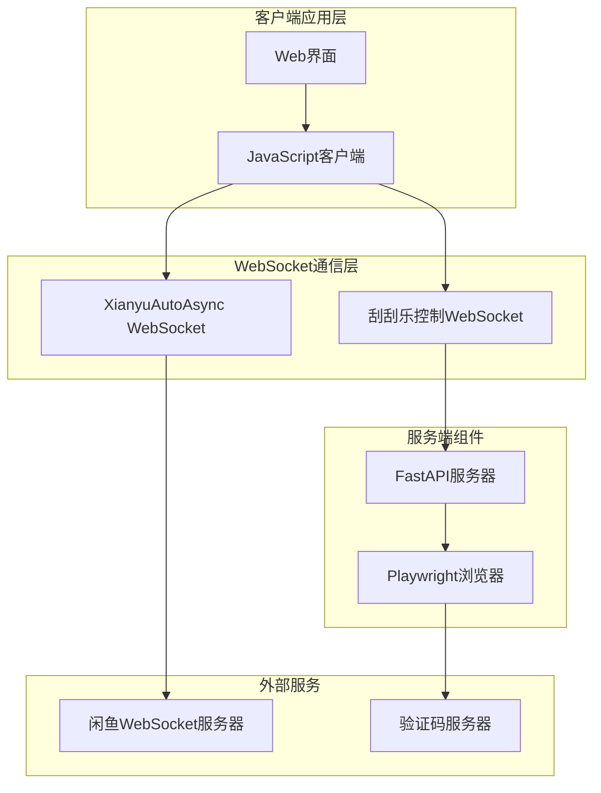
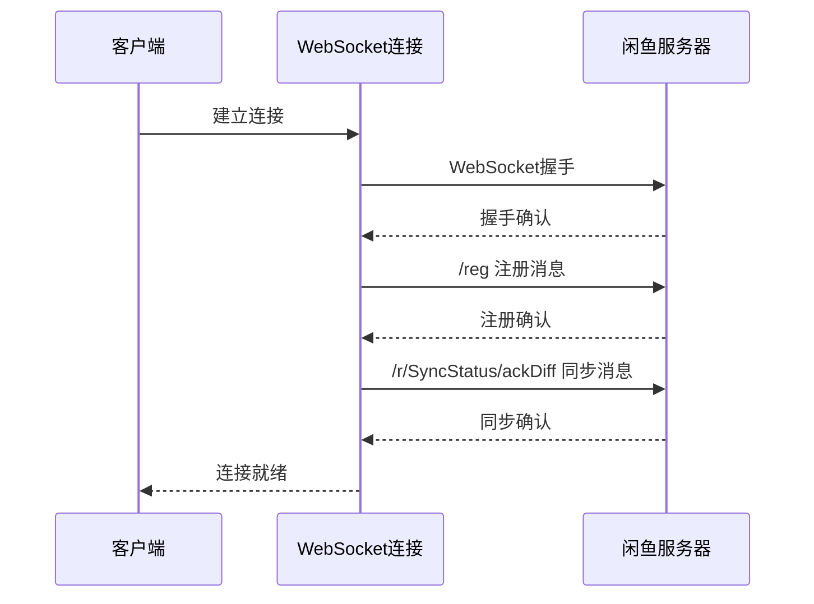
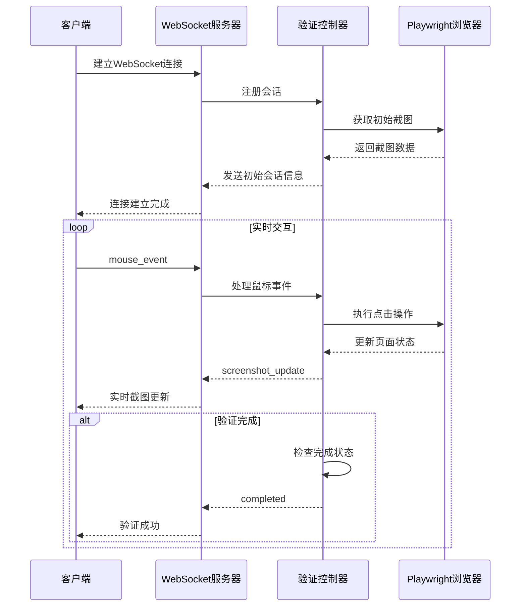
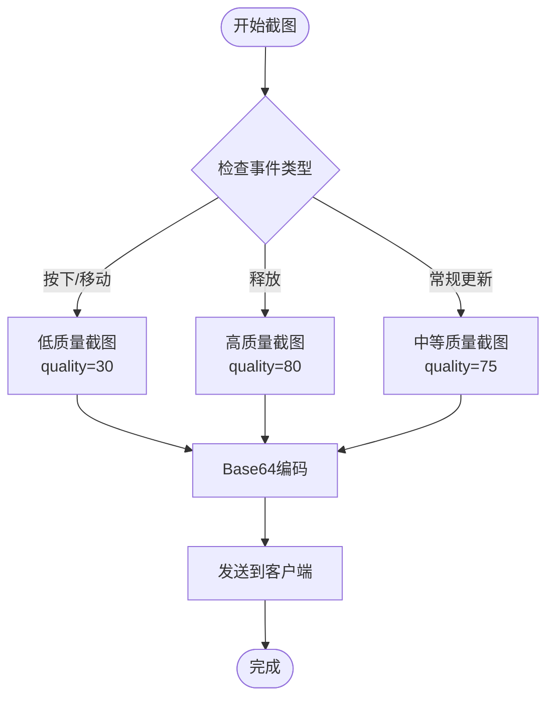
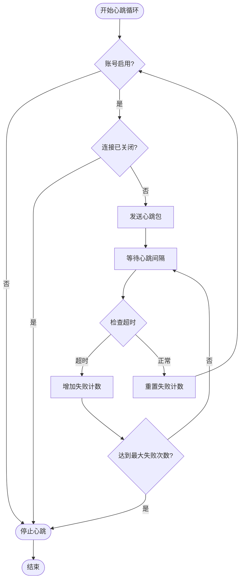
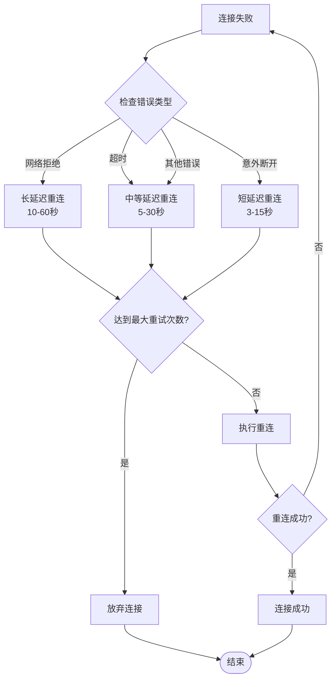

# WebSocket实时通信接口

<cite>
**本文档中引用的文件**
- [XianyuAutoAsync.py](file://XianyuAutoAsync.py)
- [api_captcha_remote.py](file://api_captcha_remote.py)
- [utils/captcha_remote_control.py](file://utils/captcha_remote_control.py)
- [utils/ws_utils.py](file://utils/ws_utils.py)
- [static/js/app.js](file://static/js/app.js)
- [config.py](file://config.py)
</cite>

## 目录
1. [简介](#简介)
2. [系统架构概览](#系统架构概览)
3. [闲鱼平台WebSocket通信](#闲鱼平台websocket通信)
4. [刮刮乐远程控制WebSocket接口](#刮刮乐远程控制websocket接口)
5. [消息格式与事件类型](#消息格式与事件类型)
6. [连接管理与心跳机制](#连接管理与心跳机制)
7. [错误处理与重连策略](#错误处理与重连策略)
8. [JavaScript客户端示例](#javascript客户端示例)
9. [最佳实践与性能优化](#最佳实践与性能优化)

## 简介

本文档详细说明了闲鱼自动回复系统中使用的WebSocket通信协议。系统包含两个主要的WebSocket通信模块：

1. **闲鱼平台通信**：与闲鱼官方WebSocket服务器建立连接，实现实时消息收发和状态更新
2. **刮刮乐远程控制**：提供WebSocket接口用于远程操作滑块验证，支持实时截图传输和鼠标事件处理

## 系统架构概览



**图表来源**
- [XianyuAutoAsync.py](file://XianyuAutoAsync.py#L1-L50)
- [api_captcha_remote.py](file://api_captcha_remote.py#L1-L50)

## 闲鱼平台WebSocket通信

### 连接建立机制

闲鱼平台的WebSocket连接通过`XianyuAutoAsync`类实现，采用多步骤初始化过程：



**图表来源**
- [XianyuAutoAsync.py](file://XianyuAutoAsync.py#L6714-L7658)

### 连接配置

系统使用以下配置参数建立WebSocket连接：

| 参数 | 默认值 | 描述 |
|------|--------|------|
| `WEBSOCKET_URL` | `wss://wss-goofish.dingtalk.com/` | WebSocket服务器地址 |
| `HEARTBEAT_INTERVAL` | 15秒 | 心跳间隔时间 |
| `HEARTBEAT_TIMEOUT` | 30秒 | 心跳超时时间 |
| `TOKEN_REFRESH_INTERVAL` | 72000秒 | Token刷新间隔 |

**节来源**
- [config.py](file://config.py#L94-L98)

### 消息格式规范

闲鱼平台WebSocket消息遵循统一的JSON格式：

```json
{
    "lwp": "/r/MessageSend/sendByReceiverScope",
    "headers": {
        "mid": "生成的唯一消息ID"
    },
    "body": [
        {
            "uuid": "消息唯一标识",
            "cid": "聊天ID@goofish",
            "conversationType": 1,
            "content": {
                "contentType": 101,
                "custom": {
                    "type": 1,
                    "data": "Base64编码的消息内容"
                }
            },
            "redPointPolicy": 0,
            "extension": {
                "extJson": "{}"
            },
            "ctx": {
                "appVersion": "1.0",
                "platform": "web"
            },
            "mtags": {},
            "msgReadStatusSetting": 1
        },
        {
            "actualReceivers": [
                "接收者ID@goofish",
                "发送者ID@goofish"
            ]
        }
    ]
}
```

**节来源**
- [XianyuAutoAsync.py](file://XianyuAutoAsync.py#L8287-L8323)

### 事件类型与处理

系统支持多种WebSocket事件类型：

| 事件类型 | 描述 | 处理方式 |
|----------|------|----------|
| `/reg` | 用户注册事件 | 发送用户身份验证信息 |
| `/r/SyncStatus/ackDiff` | 同步状态确认 | 确认消息同步状态 |
| `/!` | 心跳包 | 维持连接活跃状态 |
| `/r/MessageSend/sendByReceiverScope` | 消息发送 | 发送聊天消息 |
| `/r/SingleChatConversation/create` | 单聊会话创建 | 建立聊天会话 |

**节来源**
- [XianyuAutoAsync.py](file://XianyuAutoAsync.py#L5162-L5196)

## 刮刮乐远程控制WebSocket接口

### WebSocket端点设计

系统提供`/api/captcha/ws/{session_id}`端点用于刮刮乐远程控制：



**图表来源**
- [api_captcha_remote.py](file://api_captcha_remote.py#L38-L156)
- [utils/captcha_remote_control.py](file://utils/captcha_remote_control.py#L17-L369)

### 消息类型定义

刮刮乐控制WebSocket支持以下消息类型：

| 消息类型 | 数据格式 | 描述 |
|----------|----------|------|
| `mouse_event` | `{event_type, x, y}` | 鼠标事件（按下/移动/释放） |
| `screenshot_update` | `{screenshot}` | 截图更新通知 |
| `completed` | `{message}` | 验证完成通知 |
| `session_info` | `{screenshot, captcha_info, viewport}` | 会话信息 |
| `error` | `{message}` | 错误信息 |
| `ping` | `{}` | 心跳检测 |
| `pong` | `{}` | 心跳响应 |

**节来源**
- [api_captcha_remote.py](file://api_captcha_remote.py#L21-L33)

### 截图传输优化

系统采用JPEG格式进行截图传输，支持动态质量调整：



**图表来源**
- [utils/captcha_remote_control.py](file://utils/captcha_remote_control.py#L160-L195)

**节来源**
- [utils/captcha_remote_control.py](file://utils/captcha_remote_control.py#L160-L195)

## 消息格式与事件类型

### JSON序列化标准

所有WebSocket消息均采用JSON格式进行序列化，支持以下数据类型：

```json
{
    "type": "消息类型",
    "timestamp": "ISO时间戳",
    "payload": {
        "key": "value",
        "nested": {
            "array": [1, 2, 3],
            "boolean": true,
            "nullValue": null
        }
    }
}
```

### 错误消息格式

当发生错误时，系统返回标准化的错误消息：

```json
{
    "error": {
        "code": "错误代码",
        "message": "错误描述",
        "details": "详细信息",
        "timestamp": "错误时间"
    }
}
```

### 连接状态事件

系统维护详细的连接状态信息：

```json
{
    "connection": {
        "status": "connected/disconnected/reconnecting",
        "sessionId": "会话ID",
        "timestamp": "状态变更时间",
        "reason": "状态变更原因"
    }
}
```

## 连接管理与心跳机制

### 心跳包结构

系统使用简单的心跳包维持连接活跃：

```json
{
    "lwp": "/!",
    "headers": {
        "mid": "唯一消息ID"
    }
}
```

### 心跳机制流程



**图表来源**
- [XianyuAutoAsync.py](file://XianyuAutoAsync.py#L5221-L5270)

**节来源**
- [XianyuAutoAsync.py](file://XianyuAutoAsync.py#L5198-L5270)

### 连接状态管理

系统维护详细的连接状态信息：

| 状态 | 描述 | 触发条件 |
|------|------|----------|
| `DISCONNECTED` | 未连接 | 初始状态或连接断开 |
| `CONNECTING` | 连接中 | 正在建立WebSocket连接 |
| `CONNECTED` | 已连接 | 连接建立完成 |
| `RECONNECTING` | 重连中 | 连接异常，正在重连 |
| `FAILED` | 连接失败 | 连接尝试失败 |
| `CLOSED` | 已关闭 | 连接主动关闭 |

**节来源**
- [XianyuAutoAsync.py](file://XianyuAutoAsync.py#L29-L36)

## 错误处理与重连策略

### 重连机制

系统实现了智能重连策略，根据错误类型和失败次数调整重连间隔：



**图表来源**
- [XianyuAutoAsync.py](file://XianyuAutoAsync.py#L453-L466)

### 错误分类与处理

系统对不同类型的错误采用不同的处理策略：

| 错误类型 | 处理策略 | 重试间隔 | 最大重试次数 |
|----------|----------|----------|--------------|
| 网络连接问题 | 指数退避重试 | 10-60秒 | 5次 |
| WebSocket断开 | 快速重连 | 3-15秒 | 3次 |
| 认证失败 | 立即重试 | 5秒 | 1次 |
| 服务器错误 | 延迟重试 | 30秒 | 3次 |

**节来源**
- [XianyuAutoAsync.py](file://XianyuAutoAsync.py#L453-L466)

### 异常恢复机制

系统提供多层次的异常恢复机制：

1. **连接级恢复**：自动重连WebSocket连接
2. **消息级恢复**：重新发送失败的消息
3. **会话级恢复**：重建会话状态
4. **系统级恢复**：重启相关后台任务

## JavaScript客户端示例

### 基础WebSocket连接

以下示例展示了如何建立与闲鱼平台的WebSocket连接：

```javascript
class XianyuWebSocketClient {
    constructor(baseUrl, cookie, userId) {
        this.baseUrl = baseUrl;
        this.cookie = cookie;
        this.userId = userId;
        this.ws = null;
        this.isConnected = false;
        this.messageQueue = [];
        this.retryCount = 0;
        this.maxRetries = 5;
    }
    
    async connect() {
        try {
            // 建立WebSocket连接
            this.ws = new WebSocket(this.baseUrl);
            
            // 设置事件监听器
            this.setupEventListeners();
            
            // 等待连接建立
            await this.waitForConnection();
            
            // 发送注册消息
            await this.register();
            
            return true;
        } catch (error) {
            console.error('WebSocket连接失败:', error);
            return false;
        }
    }
    
    setupEventListeners() {
        this.ws.onopen = () => {
            this.isConnected = true;
            console.log('WebSocket连接已建立');
            this.retryCount = 0;
        };
        
        this.ws.onmessage = (event) => {
            const message = JSON.parse(event.data);
            this.handleMessage(message);
        };
        
        this.ws.onerror = (error) => {
            console.error('WebSocket错误:', error);
        };
        
        this.ws.onclose = () => {
            this.isConnected = false;
            console.log('WebSocket连接已关闭');
            this.attemptReconnect();
        };
    }
    
    async waitForConnection(timeout = 5000) {
        return new Promise((resolve, reject) => {
            const startTime = Date.now();
            
            const checkConnection = () => {
                if (this.isConnected) {
                    resolve();
                } else if (Date.now() - startTime > timeout) {
                    reject(new Error('连接超时'));
                } else {
                    setTimeout(checkConnection, 100);
                }
            };
            
            checkConnection();
        });
    }
    
    async register() {
        const registerMessage = {
            lwp: "/reg",
            headers: {
                "cache-header": "app-key token ua wv",
                "app-key": "你的应用密钥",
                "token": "你的访问令牌",
                "ua": "浏览器用户代理",
                "dt": "j",
                "wv": "im:3,au:3,sy:6",
                "sync": "0,0;0;0;",
                "did": "设备ID",
                "mid": this.generateMid()
            }
        };
        
        await this.sendMessage(registerMessage);
    }
    
    async sendMessage(message) {
        if (!this.isConnected) {
            this.messageQueue.push(message);
            return false;
        }
        
        try {
            const messageStr = JSON.stringify(message);
            this.ws.send(messageStr);
            return true;
        } catch (error) {
            console.error('发送消息失败:', error);
            this.messageQueue.push(message);
            return false;
        }
    }
    
    handleMessage(message) {
        console.log('收到消息:', message);
        
        // 处理不同类型的消息
        switch (message.lwp) {
            case '/!':
                this.handleHeartbeat(message);
                break;
            case '/r/MessageSend/sendByReceiverScope':
                this.handleSendMessageResponse(message);
                break;
            default:
                this.handleGenericMessage(message);
        }
    }
    
    handleHeartbeat(message) {
        // 处理心跳响应
        console.log('收到心跳响应');
    }
    
    handleSendMessageResponse(message) {
        // 处理消息发送响应
        console.log('消息发送状态:', message);
    }
    
    handleGenericMessage(message) {
        // 处理其他类型的消息
        console.log('通用消息处理:', message);
    }
    
    async attemptReconnect() {
        if (this.retryCount >= this.maxRetries) {
            console.error('达到最大重试次数，放弃重连');
            return;
        }
        
        const delay = Math.min(1000 * Math.pow(2, this.retryCount), 30000);
        console.log(`将在 ${delay}ms 后尝试重连（第 ${this.retryCount + 1} 次）`);
        
        await new Promise(resolve => setTimeout(resolve, delay));
        this.retryCount++;
        this.connect();
    }
    
    generateMid() {
        // 生成唯一消息ID
        return 'xxxxxxxx-xxxx-4xxx-yxxx-xxxxxxxxxxxx'.replace(/[xy]/g, function(c) {
            const r = Math.random() * 16 | 0;
            const v = c === 'x' ? r : (r & 0x3 | 0x8);
            return v.toString(16);
        });
    }
    
    async sendHeartbeat() {
        const heartbeatMessage = {
            lwp: "/!",
            headers: {
                mid: this.generateMid()
            }
        };
        
        await this.sendMessage(heartbeatMessage);
    }
    
    async sendChatMessage(conversationId, content) {
        const message = {
            lwp: "/r/MessageSend/sendByReceiverScope",
            headers: {
                mid: this.generateMid()
            },
            body: [{
                uuid: this.generateMid(),
                cid: `${conversationId}@goofish`,
                conversationType: 1,
                content: {
                    contentType: 101,
                    custom: {
                        type: 1,
                        data: btoa(JSON.stringify({
                            contentType: 1,
                            text: {
                                text: content
                            }
                        }))
                    }
                },
                redPointPolicy: 0,
                extension: {
                    extJson: "{}"
                },
                ctx: {
                    appVersion: "1.0",
                    platform: "web"
                },
                mtags: {},
                msgReadStatusSetting: 1
            }, {
                actualReceivers: [
                    `${conversationId}@goofish`,
                    `${this.userId}@goofish`
                ]
            }]
        };
        
        await this.sendMessage(message);
    }
    
    close() {
        if (this.ws) {
            this.ws.close();
        }
    }
}

// 使用示例
const client = new XianyuWebSocketClient(
    'wss://wss-goofish.dingtalk.com/',
    '你的Cookie字符串',
    '你的用户ID'
);

client.connect().then(success => {
    if (success) {
        console.log('连接成功！');
        // 发送消息示例
        client.sendChatMessage('目标用户ID', '你好，这是测试消息');
    }
});
```

### 刮刮乐控制WebSocket客户端

以下是刮刮乐远程控制的JavaScript客户端示例：

```javascript
class CaptchaControlClient {
    constructor(sessionId, apiUrl = '/api/captcha') {
        this.sessionId = sessionId;
        this.apiUrl = apiUrl;
        this.ws = null;
        this.isConnected = false;
        this.screenshotCanvas = document.getElementById('captchaScreenshot');
        this.statusIndicator = document.getElementById('captchaStatus');
        this.mouseEventListener = null;
    }
    
    connect() {
        const wsUrl = `${this.apiUrl}/ws/${this.sessionId}`;
        this.ws = new WebSocket(wsUrl);
        
        this.setupWebSocketHandlers();
    }
    
    setupWebSocketHandlers() {
        this.ws.onopen = () => {
            this.isConnected = true;
            console.log('刮刮乐控制WebSocket连接已建立');
            this.showStatus('连接已建立');
        };
        
        this.ws.onmessage = (event) => {
            const message = JSON.parse(event.data);
            this.handleWebSocketMessage(message);
        };
        
        this.ws.onerror = (error) => {
            console.error('WebSocket错误:', error);
            this.showStatus('连接错误');
        };
        
        this.ws.onclose = () => {
            this.isConnected = false;
            console.log('刮刮乐控制WebSocket连接已关闭');
            this.showStatus('连接已断开');
        };
    }
    
    handleWebSocketMessage(message) {
        switch (message.type) {
            case 'session_info':
                this.handleSessionInfo(message);
                break;
            case 'screenshot_update':
                this.handleScreenshotUpdate(message);
                break;
            case 'completed':
                this.handleVerificationComplete(message);
                break;
            case 'error':
                this.handleError(message);
                break;
            case 'pong':
                this.handlePong();
                break;
            default:
                console.log('未知消息类型:', message);
        }
    }
    
    handleSessionInfo(info) {
        console.log('会话信息:', info);
        this.showStatus('会话已建立');
        
        // 显示初始截图
        if (info.screenshot) {
            this.displayScreenshot(info.screenshot);
        }
    }
    
    handleScreenshotUpdate(update) {
        console.log('截图更新');
        this.displayScreenshot(update.screenshot);
    }
    
    handleVerificationComplete(result) {
        console.log('验证完成:', result.message);
        this.showStatus('验证完成');
        this.disableMouseEvents();
    }
    
    handleError(error) {
        console.error('错误:', error.message);
        this.showStatus(`错误: ${error.message}`);
    }
    
    handlePong() {
        console.log('收到心跳响应');
    }
    
    displayScreenshot(base64Image) {
        if (this.screenshotCanvas) {
            const ctx = this.screenshotCanvas.getContext('2d');
            const img = new Image();
            
            img.onload = () => {
                this.screenshotCanvas.width = img.width;
                this.screenshotCanvas.height = img.height;
                ctx.drawImage(img, 0, 0);
            };
            
            img.src = `data:image/jpeg;base64,${base64Image}`;
        }
    }
    
    enableMouseEvents() {
        if (this.screenshotCanvas && !this.mouseEventListener) {
            this.mouseEventListener = (event) => {
                const rect = this.screenshotCanvas.getBoundingClientRect();
                const x = event.clientX - rect.left;
                const y = event.clientY - rect.top;
                
                this.sendMouseEvent('down', x, y);
                
                const onMouseMove = (moveEvent) => {
                    const moveX = moveEvent.clientX - rect.left;
                    const moveY = moveEvent.clientY - rect.top;
                    this.sendMouseEvent('move', moveX, moveY);
                };
                
                const onMouseUp = () => {
                    document.removeEventListener('mousemove', onMouseMove);
                    document.removeEventListener('mouseup', onMouseUp);
                    this.sendMouseEvent('up', x, y);
                };
                
                document.addEventListener('mousemove', onMouseMove);
                document.addEventListener('mouseup', onMouseUp);
            };
            
            this.screenshotCanvas.addEventListener('mousedown', this.mouseEventListener);
        }
    }
    
    disableMouseEvents() {
        if (this.screenshotCanvas && this.mouseEventListener) {
            this.screenshotCanvas.removeEventListener('mousedown', this.mouseEventListener);
            this.mouseEventListener = null;
        }
    }
    
    sendMouseEvent(eventType, x, y) {
        if (this.isConnected) {
            const message = {
                type: 'mouse_event',
                event_type: eventType,
                x: Math.round(x),
                y: Math.round(y)
            };
            
            this.ws.send(JSON.stringify(message));
        }
    }
    
    checkCompletion() {
        if (this.isConnected) {
            const message = {
                type: 'check_completion'
            };
            
            this.ws.send(JSON.stringify(message));
        }
    }
    
    ping() {
        if (this.isConnected) {
            const message = {
                type: 'ping'
            };
            
            this.ws.send(JSON.stringify(message));
        }
    }
    
    showStatus(message) {
        if (this.statusIndicator) {
            this.statusIndicator.textContent = message;
        }
    }
    
    close() {
        if (this.ws) {
            this.ws.close();
        }
    }
}

// 使用示例
const captchaClient = new CaptchaControlClient('your-session-id');

captchaClient.connect();

// 启用鼠标事件
captchaClient.enableMouseEvents();

// 定期检查完成状态
setInterval(() => {
    captchaClient.checkCompletion();
}, 5000);

// 定期发送心跳
setInterval(() => {
    captchaClient.ping();
}, 10000);
```

## 最佳实践与性能优化

### 连接池管理

对于多账号场景，建议实现连接池管理：

```javascript
class WebSocketConnectionPool {
    constructor(maxConnections = 5) {
        this.maxConnections = maxConnections;
        this.connections = new Map();
        this.availableConnections = [];
        this.connectionRequests = [];
    }
    
    async getConnection(accountId) {
        // 检查已有连接
        if (this.connections.has(accountId)) {
            return this.connections.get(accountId);
        }
        
        // 等待可用连接
        let connection = null;
        
        if (this.availableConnections.length > 0) {
            connection = this.availableConnections.pop();
        } else if (this.connections.size < this.maxConnections) {
            // 创建新连接
            connection = await this.createConnection(accountId);
        } else {
            // 等待可用连接
            return new Promise((resolve) => {
                this.connectionRequests.push({ accountId, resolve });
            });
        }
        
        if (connection) {
            this.connections.set(accountId, connection);
        }
        
        return connection;
    }
    
    releaseConnection(accountId) {
        const connection = this.connections.get(accountId);
        if (connection) {
            this.connections.delete(accountId);
            this.availableConnections.push(connection);
            
            // 处理等待的连接请求
            if (this.connectionRequests.length > 0) {
                const { accountId, resolve } = this.connectionRequests.shift();
                resolve(connection);
            }
        }
    }
    
    async createConnection(accountId) {
        // 创建新的WebSocket连接
        const connection = new XianyuWebSocketClient(
            'wss://wss-goofish.dingtalk.com/',
            '账号Cookie',
            accountId
        );
        
        await connection.connect();
        return connection;
    }
}
```

### 消息队列优化

实现智能消息队列以提高可靠性：

```javascript
class MessageQueue {
    constructor(maxQueueSize = 1000, retryInterval = 5000) {
        this.queue = [];
        this.maxQueueSize = maxQueueSize;
        this.retryInterval = retryInterval;
        this.isProcessing = false;
        this.retryTimer = null;
    }
    
    enqueue(message) {
        if (this.queue.length >= this.maxQueueSize) {
            // 移除最旧的消息
            this.queue.shift();
        }
        
        this.queue.push({
            message,
            timestamp: Date.now(),
            retryCount: 0,
            maxRetries: 3
        });
        
        this.processQueue();
    }
    
    async processQueue() {
        if (this.isProcessing || this.queue.length === 0) {
            return;
        }
        
        this.isProcessing = true;
        
        while (this.queue.length > 0) {
            const item = this.queue[0];
            
            try {
                const success = await this.sendMessage(item.message);
                
                if (success) {
                    this.queue.shift();
                    item.retryCount = 0;
                } else {
                    item.retryCount++;
                    
                    if (item.retryCount >= item.maxRetries) {
                        this.queue.shift();
                        console.warn('消息发送失败，达到最大重试次数:', item.message);
                    } else {
                        // 保持在队列中等待重试
                        break;
                    }
                }
            } catch (error) {
                console.error('发送消息失败:', error);
                item.retryCount++;
                
                if (item.retryCount >= item.maxRetries) {
                    this.queue.shift();
                    console.warn('消息发送异常，达到最大重试次数:', item.message);
                } else {
                    // 保持在队列中等待重试
                    break;
                }
            }
            
            // 等待一段时间再处理下一个消息
            await new Promise(resolve => setTimeout(resolve, 100));
        }
        
        this.isProcessing = false;
        
        // 如果队列中还有消息，安排下次处理
        if (this.queue.length > 0) {
            clearTimeout(this.retryTimer);
            this.retryTimer = setTimeout(() => this.processQueue(), this.retryInterval);
        }
    }
    
    async sendMessage(message) {
        // 实现具体的发送逻辑
        // 返回true表示发送成功，false表示发送失败
        return true;
    }
}
```

### 性能监控指标

建议监控以下关键性能指标：

| 指标 | 描述 | 目标值 |
|------|------|--------|
| 连接建立时间 | WebSocket连接建立所需时间 | < 5秒 |
| 消息延迟 | 消息发送到接收的延迟 | < 100毫秒 |
| 连接成功率 | 成功建立连接的比例 | > 95% |
| 消息丢失率 | 发送但未收到确认的消息比例 | < 1% |
| 重连频率 | 平均重连次数 | < 1次/小时 |

### 错误恢复策略

实现多层次的错误恢复机制：

```javascript
class RobustWebSocketClient {
    constructor(baseUrl, options = {}) {
        this.baseUrl = baseUrl;
        this.options = {
            maxReconnectAttempts: 10,
            initialReconnectDelay: 1000,
            maxReconnectDelay: 30000,
            reconnectMultiplier: 2,
            heartbeatInterval: 30000,
            ...options
        };
        
        this.ws = null;
        this.isConnected = false;
        this.reconnectAttempts = 0;
        this.heartbeatTimer = null;
        this.messageQueue = [];
        this.eventHandlers = new Map();
    }
    
    connect() {
        return new Promise((resolve, reject) => {
            this.ws = new WebSocket(this.baseUrl);
            
            this.ws.onopen = () => {
                this.isConnected = true;
                this.reconnectAttempts = 0;
                this.startHeartbeat();
                this.processMessageQueue();
                resolve();
            };
            
            this.ws.onmessage = (event) => {
                const message = JSON.parse(event.data);
                this.handleMessage(message);
            };
            
            this.ws.onerror = (error) => {
                console.error('WebSocket错误:', error);
                this.handleConnectionError();
            };
            
            this.ws.onclose = () => {
                this.isConnected = false;
                this.stopHeartbeat();
                this.handleConnectionClose();
            };
        });
    }
    
    handleMessage(message) {
        const handlers = this.eventHandlers.get(message.type) || [];
        handlers.forEach(handler => handler(message));
    }
    
    on(eventType, handler) {
        if (!this.eventHandlers.has(eventType)) {
            this.eventHandlers.set(eventType, []);
        }
        
        this.eventHandlers.get(eventType).push(handler);
    }
    
    send(message) {
        if (this.isConnected) {
            return this.ws.send(JSON.stringify(message));
        } else {
            this.messageQueue.push(message);
            return false;
        }
    }
    
    processMessageQueue() {
        while (this.messageQueue.length > 0 && this.isConnected) {
            const message = this.messageQueue.shift();
            this.send(message);
        }
    }
    
    startHeartbeat() {
        this.heartbeatTimer = setInterval(() => {
            if (this.isConnected) {
                this.send({ type: 'heartbeat' });
            }
        }, this.options.heartbeatInterval);
    }
    
    stopHeartbeat() {
        if (this.heartbeatTimer) {
            clearInterval(this.heartbeatTimer);
            this.heartbeatTimer = null;
        }
    }
    
    handleConnectionError() {
        this.reconnect();
    }
    
    handleConnectionClose() {
        this.reconnect();
    }
    
    reconnect() {
        if (this.reconnectAttempts >= this.options.maxReconnectAttempts) {
            console.error('达到最大重连次数，放弃重连');
            return;
        }
        
        const delay = Math.min(
            this.options.initialReconnectDelay * Math.pow(this.options.reconnectMultiplier, this.reconnectAttempts),
            this.options.maxReconnectDelay
        );
        
        console.log(`将在 ${delay}ms 后尝试重连（第 ${this.reconnectAttempts + 1} 次）`);
        
        setTimeout(() => {
            this.reconnectAttempts++;
            this.connect();
        }, delay);
    }
    
    close() {
        if (this.ws) {
            this.ws.close();
        }
        
        this.stopHeartbeat();
    }
}
```

通过遵循这些最佳实践和优化策略，可以构建稳定、高效的WebSocket通信系统，确保闲鱼自动回复系统的可靠性和性能。