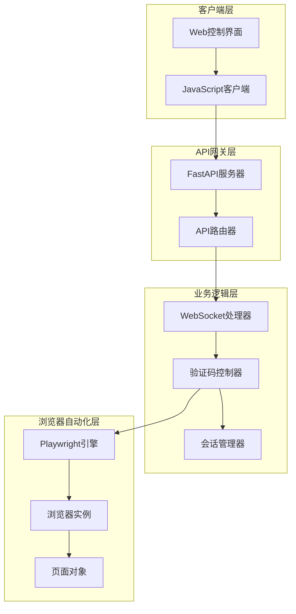
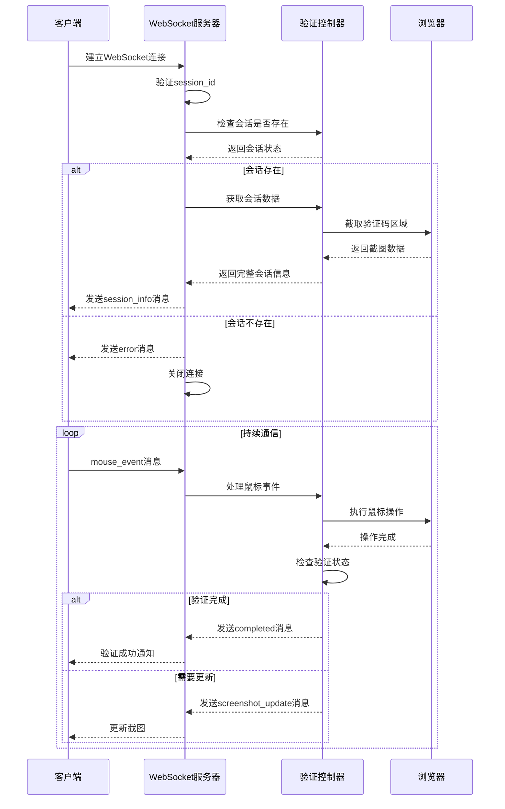
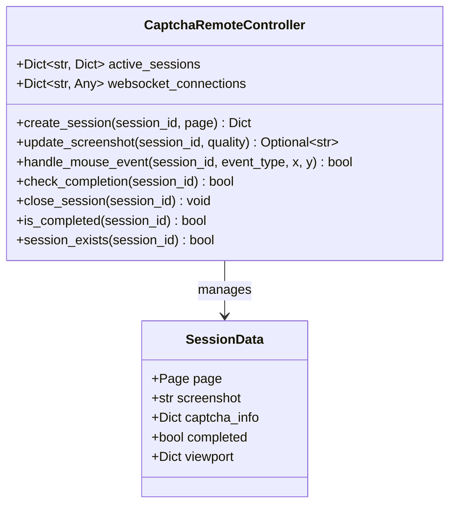
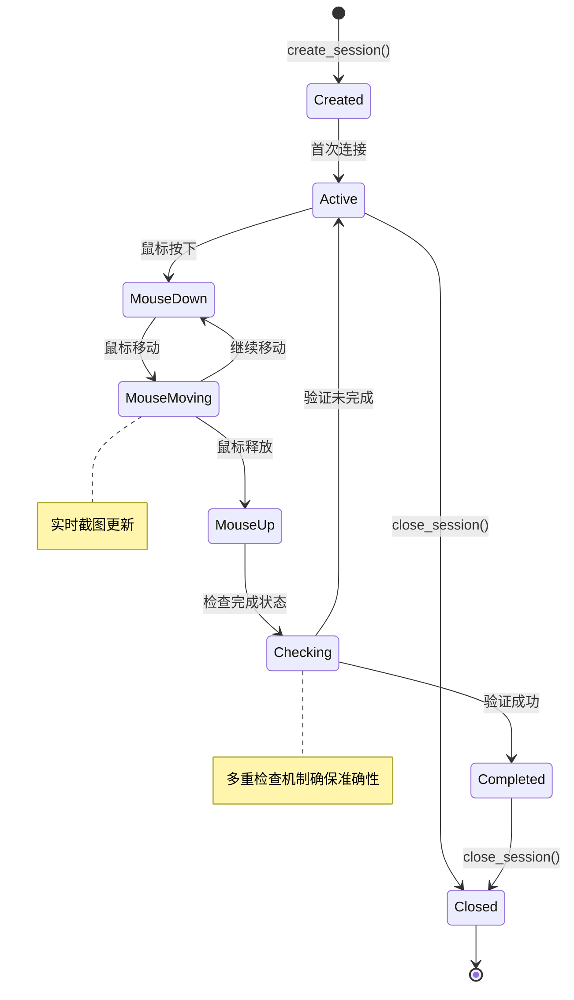
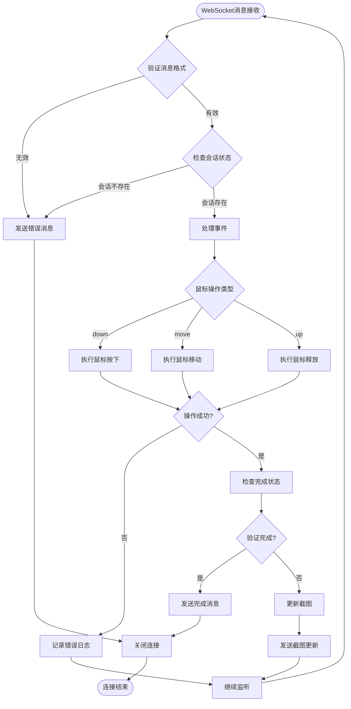
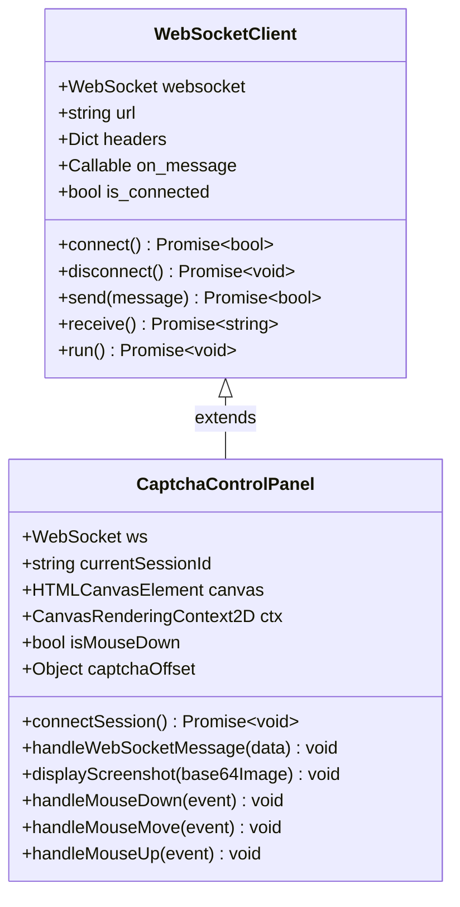

# 刮刮乐远程控制WebSocket接口文档

<cite>
**本文档中引用的文件**
- [api_captcha_remote.py](file://api_captcha_remote.py)
- [utils/captcha_remote_control.py](file://utils/captcha_remote_control.py)
- [utils/ws_utils.py](file://utils/ws_utils.py)
- [config.py](file://config.py)
- [captcha_control.html](file://captcha_control.html)
</cite>

## 目录
1. [简介](#简介)
2. [系统架构概览](#系统架构概览)
3. [WebSocket端点详解](#websocket端点详解)
4. [消息协议规范](#消息协议规范)
5. [会话管理机制](#会话管理机制)
6. [错误处理与状态管理](#错误处理与状态管理)
7. [JavaScript客户端实现](#javascript客户端实现)
8. [API端点参考](#api端点参考)
9. [性能优化策略](#性能优化策略)
10. [故障排除指南](#故障排除指南)

## 简介

刮刮乐远程控制WebSocket接口是一个基于FastAPI的实时通信系统，专门设计用于远程控制滑块验证过程。该系统通过WebSocket提供实时的屏幕截图传输和鼠标事件处理功能，使用户能够通过Web界面手动完成复杂的滑块验证挑战。

### 核心特性

- **实时屏幕截图传输**：通过WebSocket向客户端推送最新的验证码截图
- **精确鼠标事件控制**：支持按下、移动、释放三种鼠标事件类型
- **智能验证检测**：自动检测验证是否完成并通知客户端
- **会话状态管理**：维护多个并发验证会话的状态信息
- **错误恢复机制**：具备完善的错误处理和连接恢复能力

## 系统架构概览



**图表来源**
- [api_captcha_remote.py](file://api_captcha_remote.py#L17-L319)
- [utils/captcha_remote_control.py](file://utils/captcha_remote_control.py#L14-L369)

**章节来源**
- [api_captcha_remote.py](file://api_captcha_remote.py#L1-L319)
- [utils/captcha_remote_control.py](file://utils/captcha_remote_control.py#L1-L369)

## WebSocket端点详解

### `/ws/{session_id}` 端点

这是系统的核心WebSocket端点，负责处理客户端与服务器之间的实时通信。

#### 连接建立流程



**图表来源**
- [api_captcha_remote.py](file://api_captcha_remote.py#L38-L156)
- [utils/captcha_remote_control.py](file://utils/captcha_remote_control.py#L197-L238)

#### 连接生命周期管理

WebSocket连接的完整生命周期包括以下阶段：

1. **连接初始化**：客户端发起WebSocket连接请求
2. **会话验证**：服务器验证指定的session_id是否存在
3. **初始数据传输**：发送包含截图、验证码信息和视口尺寸的session_info消息
4. **持续通信**：处理客户端发送的鼠标事件和心跳消息
5. **状态检查**：定期检查验证完成状态
6. **连接清理**：断开连接时清理相关资源

**章节来源**
- [api_captcha_remote.py](file://api_captcha_remote.py#L38-L156)

## 消息协议规范

### JSON消息格式

所有WebSocket消息均采用JSON格式进行序列化，确保跨平台兼容性和可读性。

#### session_info消息

当客户端首次连接时，服务器发送此消息以提供初始状态信息：

| 字段名 | 类型 | 描述 | 示例值 |
|--------|------|------|--------|
| type | string | 消息类型标识符 | "session_info" |
| screenshot | string | Base64编码的JPEG截图 | "iVBORw0KGgoAAAANS..." |
| captcha_info | object | 验证码区域信息 | 见下方详细说明 |
| viewport | object | 浏览器视口尺寸 | {"width": 1920, "height": 1080} |

**captcha_info字段详情**：
- `selector`: CSS选择器字符串
- `x`, `y`: 验证码区域左上角坐标
- `width`, `height`: 验证码区域尺寸
- `in_iframe`: 是否位于iframe中

#### mouse_event消息

客户端发送的鼠标事件消息格式：

| 字段名 | 类型 | 描述 | 必需 | 示例值 |
|--------|------|------|------|--------|
| type | string | 消息类型标识符 | 是 | "mouse_event" |
| event_type | string | 事件类型 | 是 | "down", "move", "up" |
| x | integer | X坐标 | 是 | 125 |
| y | integer | Y坐标 | 是 | 320 |

#### screenshot_update消息

服务器主动推送的截图更新消息：

| 字段名 | 类型 | 描述 | 示例值 |
|--------|------|------|--------|
| type | string | 消息类型标识符 | "screenshot_update" |
| screenshot | string | Base64编码的JPEG截图 | "iVBORw0KGgoAAAANS..." |

#### completed消息

验证成功完成时的通知消息：

| 字段名 | 类型 | 描述 | 示例值 |
|--------|------|------|--------|
| type | string | 消息类型标识符 | "completed" |
| message | string | 完成状态描述 | "验证成功！" |

#### 错误消息

当发生错误时，服务器发送标准化的错误消息：

| 字段名 | 类型 | 描述 | 示例值 |
|--------|------|------|--------|
| type | string | 消息类型标识符 | "error" |
| message | string | 错误描述信息 | "会话不存在" |

**章节来源**
- [api_captcha_remote.py](file://api_captcha_remote.py#L21-L32)
- [api_captcha_remote.py](file://api_captcha_remote.py#L53-L57)

## 会话管理机制

### captcha_controller.active_sessions

系统使用全局的CaptchaRemoteController实例来管理所有活跃的验证会话。每个会话包含完整的状态信息：



**图表来源**
- [utils/captcha_remote_control.py](file://utils/captcha_remote_control.py#L14-L369)

### 会话状态流转



**图表来源**
- [utils/captcha_remote_control.py](file://utils/captcha_remote_control.py#L240-L316)

### 会话数据结构

每个活跃会话的数据结构包含以下关键信息：

| 字段名 | 类型 | 描述 | 用途 |
|--------|------|------|------|
| page | Page | Playwright页面对象 | 执行浏览器操作 |
| screenshot | string | Base64编码的截图 | 向客户端提供视觉反馈 |
| captcha_info | dict | 验证码区域定位信息 | 精确的鼠标坐标转换 |
| completed | bool | 验证完成标志 | 控制会话生命周期 |
| viewport | dict | 浏览器视口信息 | 坐标系转换计算 |

**章节来源**
- [utils/captcha_remote_control.py](file://utils/captcha_remote_control.py#L17-L55)

## 错误处理与状态管理

### 异常处理策略

系统实现了多层次的错误处理机制：



**图表来源**
- [api_captcha_remote.py](file://api_captcha_remote.py#L142-L156)
- [utils/captcha_remote_control.py](file://utils/captcha_remote_control.py#L197-L238)

### 连接状态监控

系统提供了多种连接状态监控机制：

| 监控指标 | 实现方式 | 用途 |
|----------|----------|------|
| WebSocket连接状态 | readyState属性检查 | 检测连接是否正常 |
| 会话存在性 | active_sessions字典查询 | 验证会话有效性 |
| 验证完成状态 | check_completion方法 | 自动状态同步 |
| 心跳检测 | ping/pong消息交换 | 连接健康度评估 |

### 错误恢复机制

当遇到网络中断或其他异常情况时，系统采用以下恢复策略：

1. **自动重连**：客户端检测到连接断开后自动尝试重新连接
2. **状态重建**：重新建立连接后重新获取最新的会话状态
3. **事件重放**：对于非关键事件（如move事件）可以适当丢弃
4. **会话清理**：长时间无响应的会话自动清理资源

**章节来源**
- [api_captcha_remote.py](file://api_captcha_remote.py#L142-L156)
- [utils/captcha_remote_control.py](file://utils/captcha_remote_control.py#L328-L332)

## JavaScript客户端实现

### 客户端架构设计

JavaScript客户端采用事件驱动的架构，负责处理WebSocket连接、用户交互和状态更新：



**图表来源**
- [utils/ws_utils.py](file://utils/ws_utils.py#L6-L89)
- [captcha_control.html](file://captcha_control.html#L302-L571)

### 核心功能实现

#### WebSocket连接管理

客户端实现了完整的WebSocket连接生命周期管理：

```javascript
// 连接建立流程
async function connectSession() {
    const sessionId = document.getElementById('sessionIdInput').value.trim();
    if (!sessionId) {
        alert('请输入会话ID');
        return;
    }
    
    currentSessionId = sessionId;
    ws = new WebSocket(`ws://${window.location.host}/api/captcha/ws/${sessionId}`);
    
    ws.onopen = () => {
        updateStatus('connected', '已连接');
        log('WebSocket 连接成功', 'success');
    };
    
    ws.onmessage = (event) => {
        const data = JSON.parse(event.data);
        handleWebSocketMessage(data);
    };
    
    ws.onerror = (error) => {
        updateStatus('disconnected', '连接错误');
        log(`WebSocket 错误: ${error}`, 'error');
    };
    
    ws.onclose = () => {
        updateStatus('disconnected', '连接已关闭');
        log('WebSocket 连接关闭', 'info');
    };
}
```

#### 鼠标事件处理

客户端精确处理各种鼠标事件并转换为服务器可识别的消息格式：

```javascript
// 鼠标按下事件
function handleMouseDown(event) {
    if (!ws || ws.readyState !== WebSocket.OPEN) return;
    
    isMouseDown = true;
    const coords = getMouseCoords(event);
    
    ws.send(JSON.stringify({
        type: 'mouse_event',
        event_type: 'down',
        x: coords.x,
        y: coords.y
    }));
}

// 鼠标移动事件（带节流）
function handleMouseMove(event) {
    if (!ws || ws.readyState !== WebSocket.OPEN || !isMouseDown) return;
    
    const now = Date.now();
    if (now - lastMoveTime < moveThrottle) return;
    lastMoveTime = now;
    
    const coords = getMouseCoords(event);
    
    ws.send(JSON.stringify({
        type: 'mouse_event',
        event_type: 'move',
        x: coords.x,
        y: coords.y
    }));
}

// 鼠标释放事件
function handleMouseUp(event) {
    if (!ws || ws.readyState !== WebSocket.OPEN || !isMouseDown) return;
    
    isMouseDown = false;
    const coords = getMouseCoords(event);
    
    document.getElementById('verificationStatus').textContent = '验证中...';
    
    ws.send(JSON.stringify({
        type: 'mouse_event',
        event_type: 'up',
        x: coords.x,
        y: coords.y
    }));
}
```

#### 坐标转换算法

为了确保鼠标事件的精确性，客户端实现了复杂的坐标转换算法：

```javascript
function getMouseCoords(event) {
    const rect = canvas.getBoundingClientRect();
    const scaleX = canvas.width / rect.width;
    const scaleY = canvas.height / rect.height;
    
    const canvasX = Math.round((event.clientX - rect.left) * scaleX);
    const canvasY = Math.round((event.clientY - rect.top) * scaleY);
    
    return {
        x: canvasX + captchaOffset.x,
        y: canvasY + captchaOffset.y
    };
}
```

### 用户界面交互

#### 实时状态更新

客户端通过多种方式向用户展示当前状态：

```javascript
function updateStatus(status, text) {
    const statusEl = document.getElementById('status');
    const statusTextEl = document.getElementById('statusText');
    
    statusEl.className = `status ${status}`;
    statusTextEl.textContent = text;
    
    document.getElementById('connectionStatus').textContent = text;
}
```

#### 日志记录系统

系统内置了详细的日志记录功能，帮助调试和监控：

```javascript
function log(message, type = 'info') {
    const logEl = document.getElementById('log');
    const entry = document.createElement('div');
    entry.className = `log-entry ${type}`;
    const timestamp = new Date().toLocaleTimeString();
    entry.textContent = `[${timestamp}] ${message}`;
    logEl.appendChild(entry);
    logEl.scrollTop = logEl.scrollHeight;
}
```

**章节来源**
- [captcha_control.html](file://captcha_control.html#L302-L571)
- [utils/ws_utils.py](file://utils/ws_utils.py#L6-L89)

## API端点参考

### WebSocket端点

#### GET `/api/captcha/control/{session_id}`
- **描述**：返回带会话ID的滑块控制页面
- **参数**：session_id (路径参数)
- **响应**：HTML页面或404错误

#### GET `/api/captcha/control`
- **描述**：返回基础的滑块控制页面
- **响应**：HTML页面或提示信息

#### GET `/api/captcha/status/{session_id}`
- **描述**：获取验证状态（轮询检查）
- **参数**：session_id (路径参数)
- **响应**：包含验证状态的JSON对象

### HTTP端点

#### GET `/api/captcha/sessions`
- **描述**：获取所有活跃的验证会话
- **响应**：包含会话列表的JSON对象

#### GET `/api/captcha/session/{session_id}`
- **描述**：获取指定会话的详细信息
- **参数**：session_id (路径参数)
- **响应**：包含会话数据的JSON对象
- **错误**：404 Not Found（会话不存在）

#### GET `/api/captcha/screenshot/{session_id}`
- **描述**：获取最新截图
- **参数**：session_id (路径参数)
- **响应**：包含Base64截图的JSON对象
- **错误**：404 Not Found（无法获取截图）

#### POST `/api/captcha/mouse_event`
- **描述**：处理鼠标事件（HTTP方式，不推荐）
- **请求体**：MouseEvent对象
- **响应**：包含成功状态和完成状态的JSON对象
- **错误**：400 Bad Request（处理失败）

#### POST `/api/captcha/check_completion`
- **描述**：检查验证是否完成
- **请求体**：SessionCheckRequest对象
- **响应**：包含完成状态的JSON对象

#### DELETE `/api/captcha/session/{session_id}`
- **描述**：关闭指定会话
- **参数**：session_id (路径参数)
- **响应**：包含成功状态的JSON对象

**章节来源**
- [api_captcha_remote.py](file://api_captcha_remote.py#L162-L319)

## 性能优化策略

### 图像传输优化

系统采用了多种图像传输优化技术：

#### 分级质量策略

| 场景 | 质量设置 | 用途 | 性能影响 |
|------|----------|------|----------|
| 验证过程中 | 30 | 实时更新，降低CPU占用 | 极高 |
| 验证完成后 | 80 | 最终确认，保证清晰度 | 中等 |
| 初始加载 | 75 | 平衡质量和性能 | 较低 |

#### 区域截取优化

系统只截取验证码相关的区域，而不是整个页面：

```python
# 验证码容器区域截取
x = max(0, captcha_info['x'] - 10)
y = max(0, captcha_info['y'] - 10)
width = captcha_info['width'] + 20
height = captcha_info['height'] + 20
```

### 网络通信优化

#### 消息节流机制

客户端实现了智能的消息节流机制，避免过度频繁的网络请求：

```javascript
let lastMoveTime = 0;
let moveThrottle = 5; // 每5ms最多发送一次

function handleMouseMove(event) {
    const now = Date.now();
    if (now - lastMoveTime < moveThrottle) return;
    lastMoveTime = now;
    
    // 发送鼠标移动事件...
}
```

#### 连接复用策略

系统支持多个客户端同时连接到同一个会话，提高资源利用率：

```python
# WebSocket连接存储
captcha_controller.websocket_connections[session_id] = websocket
```

### 内存管理优化

#### 智能会话清理

系统实现了自动的会话清理机制：

```python
# 会话超时清理
async def auto_cleanup_sessions():
    while True:
        await asyncio.sleep(300)  # 每5分钟检查一次
        expired_sessions = [
            sid for sid, data in captcha_controller.active_sessions.items()
            if not data.get('active', True)
        ]
        for sid in expired_sessions:
            await captcha_controller.close_session(sid)
```

**章节来源**
- [utils/captcha_remote_control.py](file://utils/captcha_remote_control.py#L119-L125)
- [utils/captcha_remote_control.py](file://utils/captcha_remote_control.py#L160-L195)

## 故障排除指南

### 常见问题诊断

#### 连接问题

**症状**：WebSocket连接失败或频繁断开
**可能原因**：
1. 网络防火墙阻止WebSocket连接
2. 服务器负载过高
3. 客户端WebSocket实现问题

**解决方案**：
1. 检查防火墙设置，确保WebSocket端口开放
2. 监控服务器资源使用情况
3. 验证客户端WebSocket连接代码

#### 验证失败问题

**症状**：验证码验证总是失败
**可能原因**：
1. 鼠标坐标转换错误
2. 截图更新不及时
3. 验证逻辑过于严格

**解决方案**：
1. 检查坐标转换算法
2. 调整截图更新频率
3. 优化验证检测逻辑

#### 性能问题

**症状**：界面卡顿或响应缓慢
**可能原因**：
1. 图像质量设置过高
2. 消息发送频率过高
3. 会话数量过多

**解决方案**：
1. 降低图像质量设置
2. 增加消息节流间隔
3. 实施会话数量限制

### 调试工具和技巧

#### 日志分析

系统提供了详细的日志记录功能，帮助诊断问题：

```python
# 启用详细日志
logger.add("captcha_debug.log", level="DEBUG")

# 关键操作日志
logger.info(f"✅ 创建远程控制会话: {session_id}")
logger.error(f"❌ WebSocket 错误: {e}")
```

#### 状态监控

通过HTTP端点监控系统状态：

```bash
# 获取活跃会话列表
curl http://localhost:8000/api/captcha/sessions

# 检查特定会话状态
curl http://localhost:8000/api/captcha/session/{session_id}
```

#### 客户端调试

浏览器开发者工具中的WebSocket监控：

1. 打开浏览器开发者工具
2. 切换到Network标签页
3. 查找WebSocket连接
4. 监控消息发送和接收

**章节来源**
- [api_captcha_remote.py](file://api_captcha_remote.py#L142-L156)
- [utils/captcha_remote_control.py](file://utils/captcha_remote_control.py#L328-L332)

## 结论

刮刮乐远程控制WebSocket接口是一个功能完整、性能优化的实时控制系统。它通过精心设计的架构和协议，实现了高效的远程验证码处理能力。系统的模块化设计使其易于扩展和维护，而完善的错误处理机制确保了服务的稳定性。

### 主要优势

1. **实时性强**：基于WebSocket的双向通信确保了最低的延迟
2. **精度高**：精确的坐标转换和鼠标事件处理
3. **性能优**：多层次的优化策略保证了良好的用户体验
4. **稳定性好**：完善的错误处理和恢复机制
5. **易扩展**：模块化设计便于功能扩展

### 未来改进方向

1. **移动端支持**：添加对移动设备触摸事件的支持
2. **AI辅助**：集成机器学习算法辅助验证
3. **集群部署**：支持多节点分布式部署
4. **监控增强**：添加更详细的性能监控和告警机制