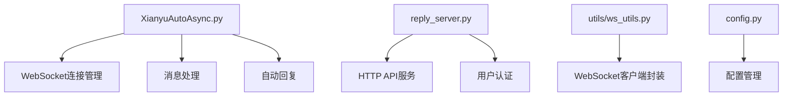
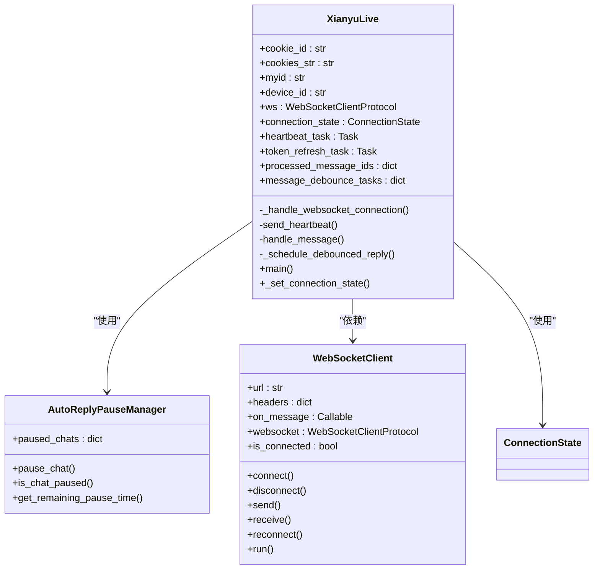
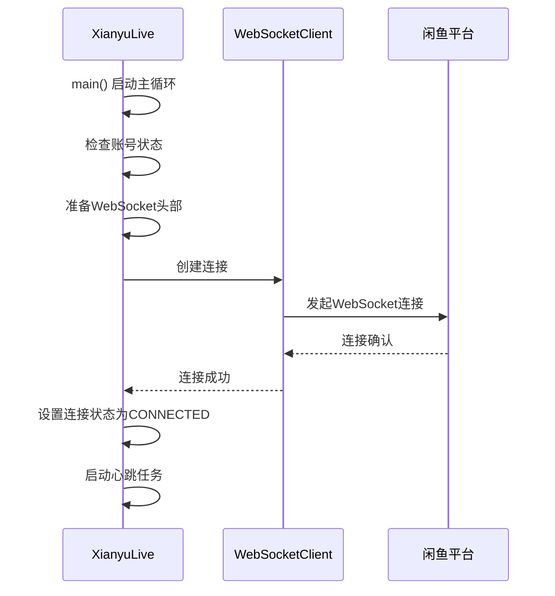
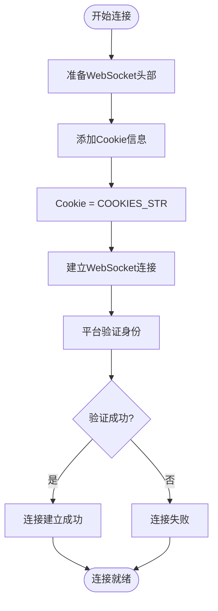
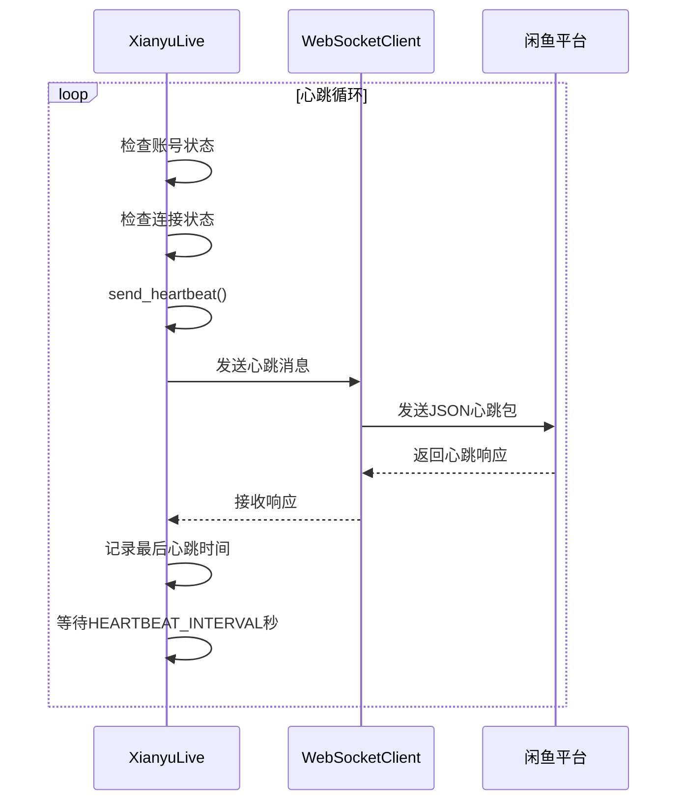
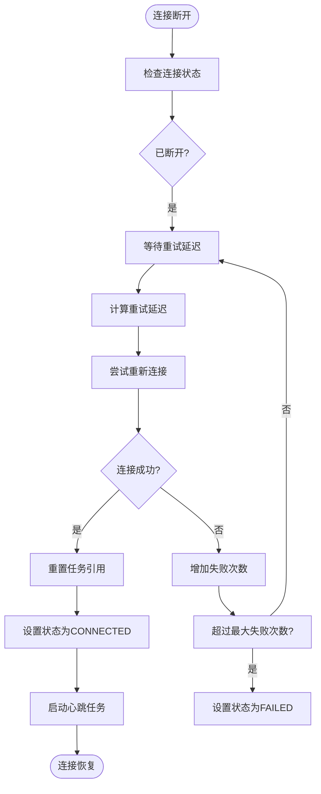
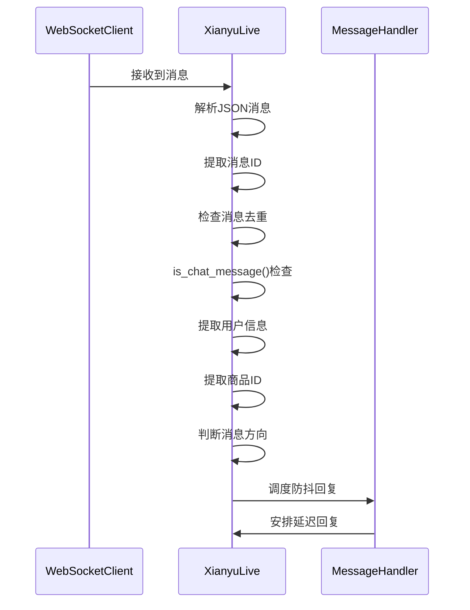
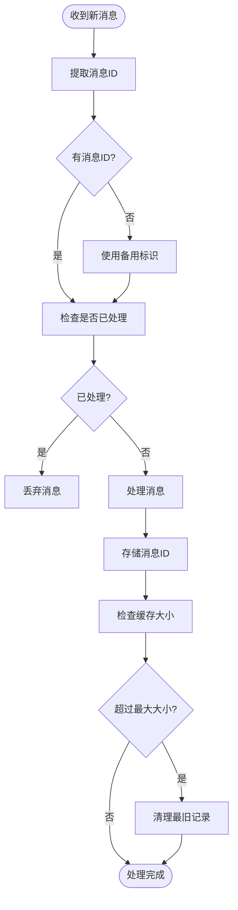
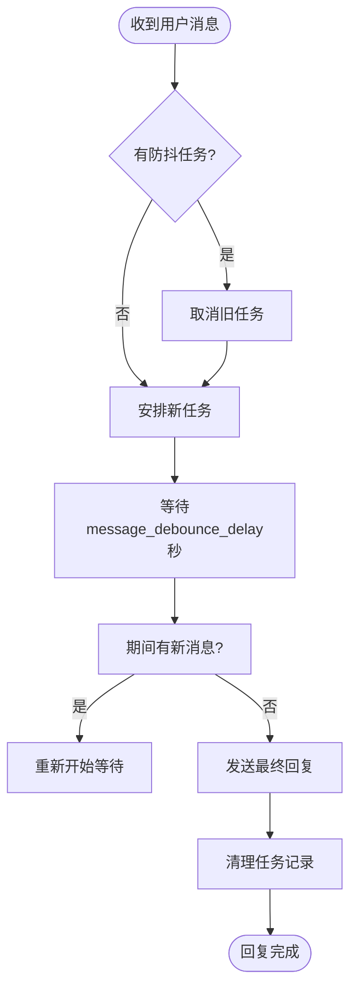
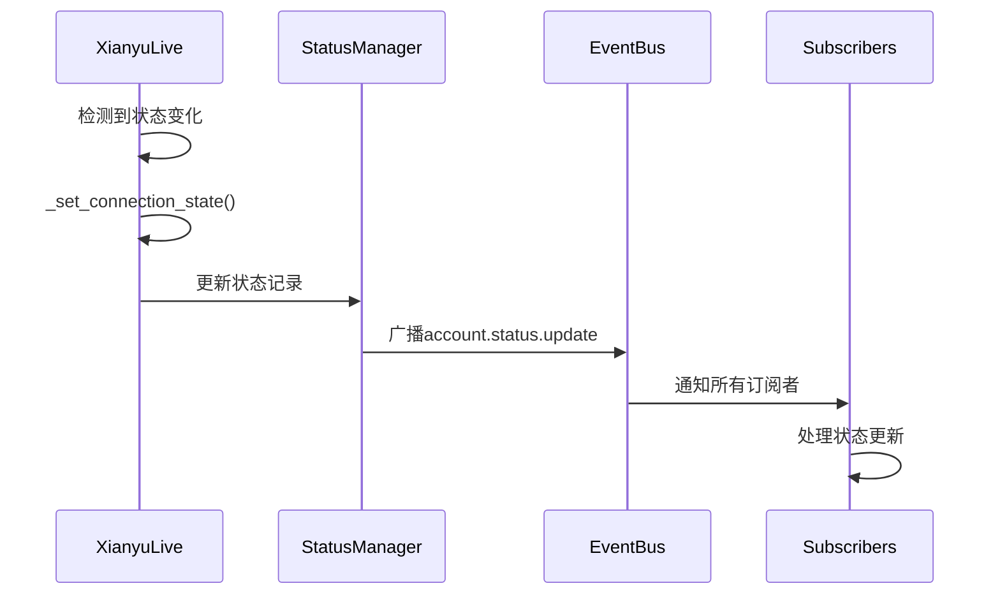

# 闲鱼平台WebSocket通信

<cite>
**本文档引用的文件**   
- [XianyuAutoAsync.py](file://XianyuAutoAsync.py)
- [reply_server.py](file://reply_server.py)
- [config.py](file://config.py)
- [utils/ws_utils.py](file://utils/ws_utils.py)
</cite>

## 目录
1. [引言](#引言)
2. [项目结构](#项目结构)
3. [核心组件](#核心组件)
4. [连接建立与认证机制](#连接建立与认证机制)
5. [心跳与重连机制](#心跳与重连机制)
6. [消息处理流程](#消息处理流程)
7. [系统事件广播](#系统事件广播)
8. [客户端交互示例](#客户端交互示例)
9. [结论](#结论)

## 引言
本文档详细说明了闲鱼平台WebSocket通信机制的实现，重点分析了在`XianyuAutoAsync.py`文件中实现的连接管理、消息处理和状态同步功能。文档涵盖了连接建立、认证、心跳、重连、消息去重、防抖处理以及系统内部事件广播等核心机制，为开发者提供了全面的技术参考。

## 项目结构
项目采用模块化设计，主要功能分散在不同的文件和目录中。WebSocket通信的核心逻辑位于`XianyuAutoAsync.py`，而API服务和前端交互则由`reply_server.py`提供。



**图源**
- [XianyuAutoAsync.py](file://XianyuAutoAsync.py)
- [reply_server.py](file://reply_server.py)
- [utils/ws_utils.py](file://utils/ws_utils.py)
- [config.py](file://config.py)

**章节源**
- [XianyuAutoAsync.py](file://XianyuAutoAsync.py)
- [reply_server.py](file://reply_server.py)

## 核心组件
系统的核心是`XianyuLive`类，它负责管理与闲鱼平台的WebSocket连接和所有相关业务逻辑。



**图源**
- [XianyuAutoAsync.py](file://XianyuAutoAsync.py#L158-L8372)
- [utils/ws_utils.py](file://utils/ws_utils.py#L6-L89)

**章节源**
- [XianyuAutoAsync.py](file://XianyuAutoAsync.py#L158-L8372)
- [utils/ws_utils.py](file://utils/ws_utils.py#L6-L89)

## 连接建立与认证机制
系统通过WebSocket与闲鱼平台建立实时通信连接，连接的建立和认证依赖于Cookie和Token机制。

### 连接建立流程
连接建立流程由`XianyuLive`类的`main`方法驱动，通过异步循环尝试建立和维护连接。



**图源**
- [XianyuAutoAsync.py](file://XianyuAutoAsync.py#L7623-L7649)
- [utils/ws_utils.py](file://utils/ws_utils.py#L16-L27)

### 认证机制
系统使用Cookie进行身份认证，Cookie信息从配置文件中读取，并在WebSocket连接建立时作为头部信息发送。



**图源**
- [XianyuAutoAsync.py](file://XianyuAutoAsync.py#L641-L643)
- [config.py](file://config.py#L92-L93)

**章节源**
- [XianyuAutoAsync.py](file://XianyuAutoAsync.py#L628-L790)
- [config.py](file://config.py#L1-L126)

## 心跳与重连机制
为了保持连接的活跃状态并处理网络异常，系统实现了心跳和自动重连机制。

### 心跳保持策略
心跳包通过`send_heartbeat`方法定期发送，确保服务器知道客户端仍然在线。



**图源**
- [XianyuAutoAsync.py](file://XianyuAutoAsync.py#L5197-L5271)

### 自动重连逻辑
当连接意外断开时，系统会自动尝试重连。重连逻辑由`_handle_websocket_connection`方法管理。



**图源**
- [XianyuAutoAsync.py](file://XianyuAutoAsync.py#L6754-L6768)
- [XianyuAutoAsync.py](file://XianyuAutoAsync.py#L240-L257)

**章节源**
- [XianyuAutoAsync.py](file://XianyuAutoAsync.py#L5197-L5271)
- [XianyuAutoAsync.py](file://XianyuAutoAsync.py#L6754-L6768)

## 消息处理流程
系统对接收到的WebSocket消息进行解析和处理，实现了消息去重和防抖机制。

### 消息接收与解析
消息处理流程从WebSocket接收到消息开始，经过解析、过滤和处理等多个步骤。



**图源**
- [XianyuAutoAsync.py](file://XianyuAutoAsync.py#L7300-L7499)

### 消息去重机制
系统使用`processed_message_ids`字典来存储已处理的消息ID，防止同一条消息被重复处理。



**图源**
- [XianyuAutoAsync.py](file://XianyuAutoAsync.py#L735-L740)

### 防抖处理
系统使用`message_debounce_tasks`来管理防抖任务，避免对用户连续发送的消息进行多次回复。



**图源**
- [XianyuAutoAsync.py](file://XianyuAutoAsync.py#L729-L733)

**章节源**
- [XianyuAutoAsync.py](file://XianyuAutoAsync.py#L6878-L6996)
- [XianyuAutoAsync.py](file://XianyuAutoAsync.py#L6922-L6949)

## 系统事件广播
系统通过内部机制广播账号状态变更等重要事件。

### 账号状态更新事件
当账号状态发生变化时，系统会触发`account.status.update`事件。



**图源**
- [XianyuAutoAsync.py](file://XianyuAutoAsync.py#L195-L215)

**章节源**
- [XianyuAutoAsync.py](file://XianyuAutoAsync.py#L195-L215)

## 客户端交互示例
以下Python代码示例展示了如何通过`reply_server`暴露的接口与WebSocket连接进行交互。

```python
import requests
import json

# 设置API端点和认证令牌
API_URL = "http://localhost:8000"
AUTH_TOKEN = "your_auth_token_here"

def send_message(cookie_id, message):
    """发送消息到指定账号的WebSocket连接"""
    headers = {
        "Authorization": f"Bearer {AUTH_TOKEN}",
        "Content-Type": "application/json"
    }
    
    payload = {
        "cookie_id": cookie_id,
        "msg_time": "2024-01-01 12:00:00",
        "user_url": "https://www.goofish.com/user/123",
        "send_user_id": "123456",
        "send_user_name": "买家",
        "item_id": "987654",
        "send_message": message,
        "chat_id": "chat_123"
    }
    
    response = requests.post(
        f"{API_URL}/xianyu/reply", 
        json=payload, 
        headers=headers
    )
    
    if response.status_code == 200:
        result = response.json()
        if result.get("code") == 200:
            print(f"消息发送成功: {result['data']['send_msg']}")
        else:
            print(f"消息发送失败: {result.get('msg')}")
    else:
        print(f"API请求失败: {response.status_code}")

# 使用示例
if __name__ == "__main__":
    send_message("account_001", "您好，有什么可以帮您？")
```

**章节源**
- [reply_server.py](file://reply_server.py#L288-L307)

## 结论
本文档详细阐述了闲鱼平台WebSocket通信系统的实现机制。系统通过精心设计的连接管理、心跳重连、消息处理和事件广播机制，实现了稳定可靠的实时通信功能。`XianyuAutoAsync.py`文件中的`XianyuLive`类是整个系统的核心，它不仅管理着WebSocket连接的生命周期，还处理了复杂的业务逻辑，包括自动回复、订单处理和状态同步。通过`reply_server.py`提供的API接口，外部系统可以方便地与WebSocket连接进行交互，实现了功能的解耦和扩展性。