# 前端架构

<cite>
**本文档引用的文件**
- [index.html](file://static/index.html)
- [login.html](file://static/login.html)
- [register.html](file://static/register.html)
- [app.js](file://static/js/app.js)
- [app.css](file://static/css/app.css)
- [variables.css](file://static/css/variables.css)
- [layout.css](file://static/css/layout.css)
- [dashboard.css](file://static/css/dashboard.css)
- [components.css](file://static/css/components.css)
- [admin.css](file://static/css/admin.css)
- [ws_utils.py](file://Qoder_workspace/xianyu-auto-reply/utils/ws_utils.py)
</cite>

## 目录
1. [项目概述](#项目概述)
2. [技术栈与架构](#技术栈与架构)
3. [HTML页面结构](#html页面结构)
4. [CSS样式体系](#css样式体系)
5. [JavaScript架构](#javascript架构)
6. [主题系统与多主题支持](#主题系统与多主题支持)
7. [前端与后端交互](#前端与后端交互)
8. [移动端适配策略](#移动端适配策略)
9. [可访问性考虑](#可访问性考虑)
10. [组件树结构](#组件树结构)
11. [性能优化策略](#性能优化策略)
12. [总结](#总结)

## 项目概述

该项目是一个基于闲鱼平台的自动回复管理系统，采用现代化的前端架构设计，提供了完整的Web管理界面。系统支持账号管理、商品管理、自动回复配置、订单处理等功能模块，具备响应式设计和多主题支持能力。

## 技术栈与架构

### 核心技术栈
- **HTML5**: 语义化标记和结构化内容
- **CSS3**: 响应式设计和现代样式特性
- **JavaScript (ES6+)**: 原生JavaScript实现业务逻辑
- **Bootstrap 5**: 组件库和栅格系统
- **Bootstrap Icons**: 图标系统
- **WebSocket**: 实时通信支持

### 架构设计原则
- **模块化设计**: 按功能划分独立的CSS模块和JavaScript组件
- **响应式优先**: 移动端优先的设计理念
- **渐进增强**: 基础功能优先，高级特性逐步增强
- **可维护性**: 清晰的代码结构和命名规范

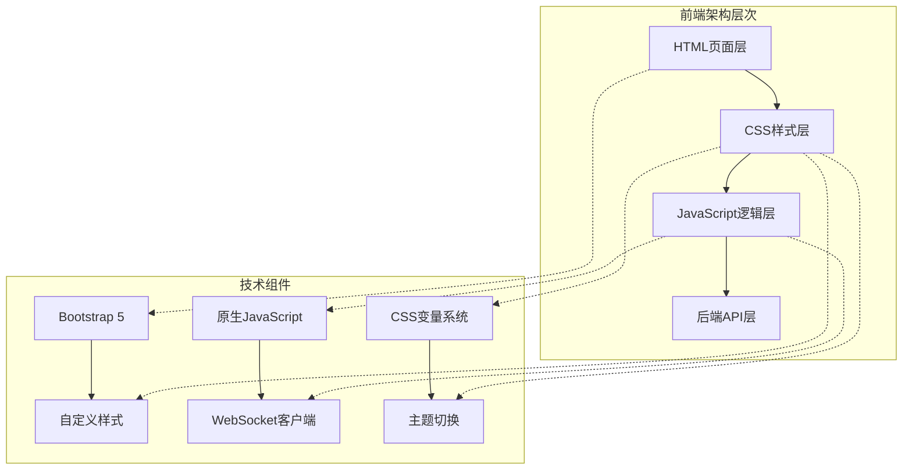
```mermaid
graph TB
subgraph "前端架构层次"
A[HTML页面层] --> B[CSS样式层]
B --> C[JavaScript逻辑层]
C --> D[后端API层]
end
subgraph "技术组件"
E[Bootstrap 5] --> F[自定义样式]
G[原生JavaScript] --> H[WebSocket客户端]
I[CSS变量系统] --> J[主题切换]
end
A -.-> E
B -.-> F
C -.-> G
C -.-> H
B -.-> I
B -.-> J
```

**图表来源**
- [index.html](file://static/index.html#L1-L20)
- [app.css](file://static/css/app.css#L1-L14)
- [app.js](file://static/js/app.js#L1-L20)

## HTML页面结构

### 主页面架构

系统采用经典的侧边栏导航布局，主页面包含以下核心结构：

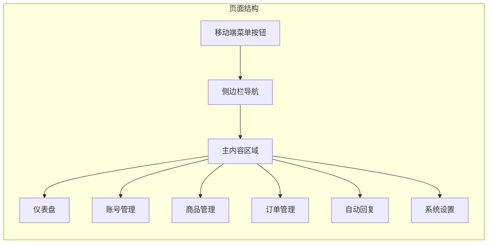
```mermaid
graph LR
subgraph "页面结构"
A[移动端菜单按钮] --> B[侧边栏导航]
B --> C[主内容区域]
C --> D[仪表盘]
C --> E[账号管理]
C --> F[商品管理]
C --> G[订单管理]
C --> H[自动回复]
C --> I[系统设置]
end
```

**图表来源**
- [index.html](file://static/index.html#L13-L150)

### 页面组件层次

| 组件层级 | 描述 | 文件位置 |
|---------|------|----------|
| 容器层 | 整体页面容器和布局 | index.html |
| 导航层 | 侧边栏菜单和面包屑 | sidebar/nav |
| 内容层 | 各功能模块内容区域 | content-section |
| 表单层 | 输入表单和交互组件 | forms/components |
| 数据层 | 表格和列表展示 | tables/lists |

**章节来源**
- [index.html](file://static/index.html#L1-L800)

### 登录页面设计

登录页面采用简洁的卡片式设计，支持多种登录方式：

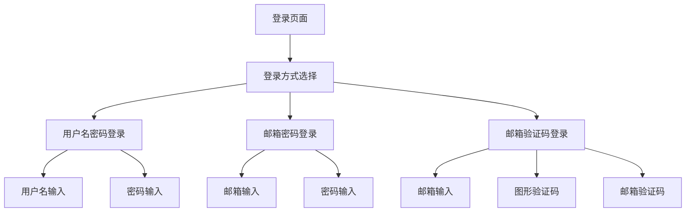
```mermaid
flowchart TD
A[登录页面] --> B[登录方式选择]
B --> C[用户名密码登录]
B --> D[邮箱密码登录]
B --> E[邮箱验证码登录]
C --> F[用户名输入]
C --> G[密码输入]
D --> H[邮箱输入]
D --> I[密码输入]
E --> J[邮箱输入]
E --> K[图形验证码]
E --> L[邮箱验证码]
```

**图表来源**
- [login.html](file://static/login.html#L129-L210)

**章节来源**
- [login.html](file://static/login.html#L1-L724)
- [register.html](file://static/register.html#L1-L576)

## CSS样式体系

### 样式架构组织

系统采用模块化的CSS架构，按功能划分不同的样式文件：

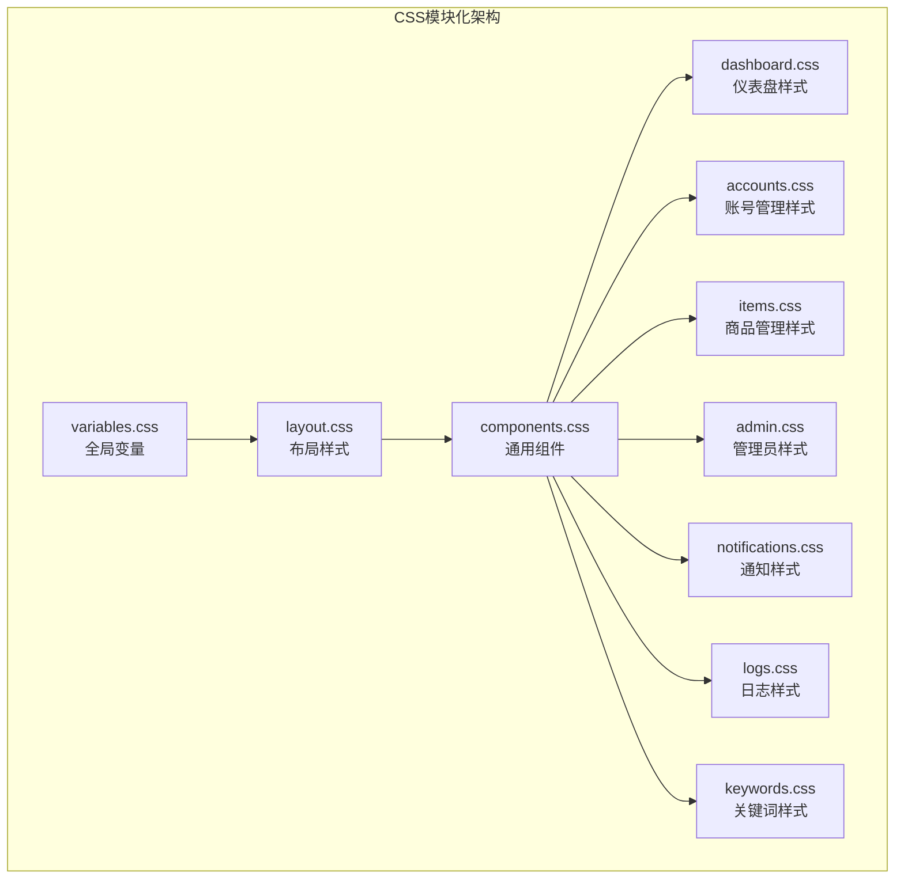
```mermaid
graph TB
subgraph "CSS模块化架构"
A[variables.css<br/>全局变量] --> B[layout.css<br/>布局样式]
B --> C[components.css<br/>通用组件]
C --> D[dashboard.css<br/>仪表盘样式]
C --> E[accounts.css<br/>账号管理样式]
C --> F[items.css<br/>商品管理样式]
C --> G[admin.css<br/>管理员样式]
C --> H[notifications.css<br/>通知样式]
C --> I[logs.css<br/>日志样式]
C --> J[keywords.css<br/>关键词样式]
end
```

**图表来源**
- [app.css](file://static/css/app.css#L1-L14)
- [variables.css](file://static/css/variables.css#L1-L27)

### CSS变量系统

系统使用CSS自定义属性实现主题定制和动态样式控制：

| 变量类别 | 变量名称 | 默认值 | 用途 |
|---------|----------|--------|------|
| 主色调 | `--primary-color` | `#4f46e5` | 主要品牌色 |
| 辅助色 | `--secondary-color` | `#6b7280` | 次要文本色 |
| 成功色 | `--success-color` | `#10b981` | 成功状态色 |
| 警告色 | `--warning-color` | `#f59e0b` | 警告状态色 |
| 错误色 | `--danger-color` | `#ef4444` | 错误状态色 |
| 阴影 | `--shadow-sm` | `0 1px 2px 0 rgba(...)` | 浅阴影效果 |
| 字体 | `--font-family` | `'Inter', 'Segoe UI'` | 主字体族 |

**章节来源**
- [variables.css](file://static/css/variables.css#L4-L18)

### 组件样式规范

系统定义了一套统一的组件样式规范：

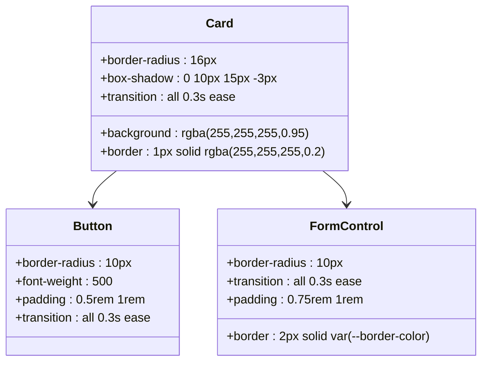
```mermaid
classDiagram
class Card {
+background : rgba(255,255,255,0.95)
+border : 1px solid rgba(255,255,255,0.2)
+border-radius : 16px
+box-shadow : 0 10px 15px -3px
+transition : all 0.3s ease
}
class Button {
+border-radius : 10px
+font-weight : 500
+padding : 0.5rem 1rem
+transition : all 0.3s ease
}
class FormControl {
+border-radius : 10px
+border : 2px solid var(--border-color)
+transition : all 0.3s ease
+padding : 0.75rem 1rem
}
Card --> Button
Card --> FormControl
```

**图表来源**
- [components.css](file://static/css/components.css#L14-L28)
- [components.css](file://static/css/components.css#L43-L53)

**章节来源**
- [layout.css](file://static/css/layout.css#L1-L171)
- [components.css](file://static/css/components.css#L1-L414)

## JavaScript架构

### 核心功能模块

系统JavaScript采用模块化设计，主要功能模块包括：

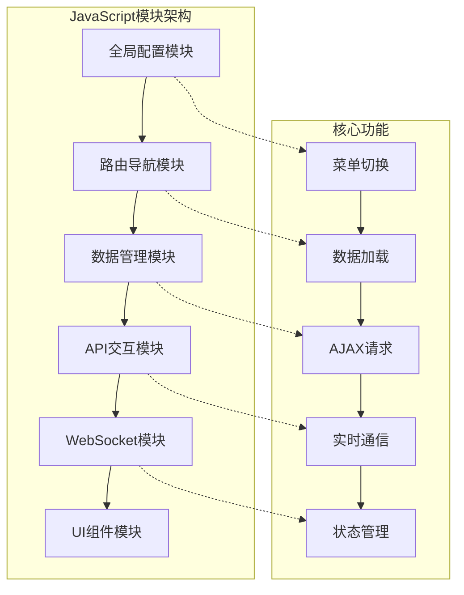
```mermaid
graph TB
subgraph "JavaScript模块架构"
A[全局配置模块] --> B[路由导航模块]
B --> C[数据管理模块]
C --> D[API交互模块]
D --> E[WebSocket模块]
E --> F[UI组件模块]
end
subgraph "核心功能"
G[菜单切换] --> H[数据加载]
H --> I[AJAX请求]
I --> J[实时通信]
J --> K[状态管理]
end
A -.-> G
B -.-> H
C -.-> I
D -.-> J
E -.-> K
```

**图表来源**
- [app.js](file://static/js/app.js#L1-L20)

### DOM操作与事件绑定

系统采用原生JavaScript进行DOM操作和事件处理：

| 功能模块 | 主要函数 | 用途 |
|---------|----------|------|
| 路由管理 | `showSection()` | 页面内容切换 |
| 数据加载 | `loadDashboard()` | 仪表盘数据获取 |
| 表单处理 | `addKeyword()` | 关键词添加/编辑 |
| WebSocket | `connectWebSocket()` | 实时通信连接 |
| 状态管理 | `updateDashboardStats()` | 界面状态更新 |

**章节来源**
- [app.js](file://static/js/app.js#L37-L145)

### AJAX请求封装

系统实现了统一的AJAX请求封装机制：

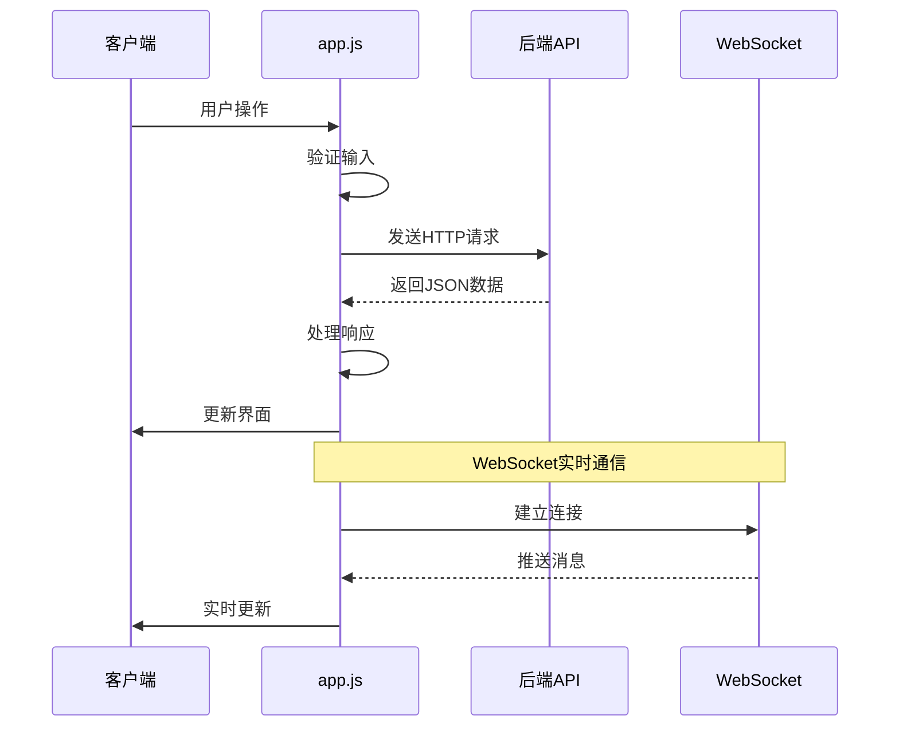
```mermaid
sequenceDiagram
participant Client as 客户端
participant AppJS as app.js
participant API as 后端API
participant WS as WebSocket
Client->>AppJS : 用户操作
AppJS->>AppJS : 验证输入
AppJS->>API : 发送HTTP请求
API-->>AppJS : 返回JSON数据
AppJS->>AppJS : 处理响应
AppJS->>Client : 更新界面
Note over AppJS,WS : WebSocket实时通信
AppJS->>WS : 建立连接
WS-->>AppJS : 推送消息
AppJS->>Client : 实时更新
```

**图表来源**
- [app.js](file://static/js/app.js#L147-L240)

### WebSocket客户端实现

系统集成了WebSocket客户端，支持实时通信：

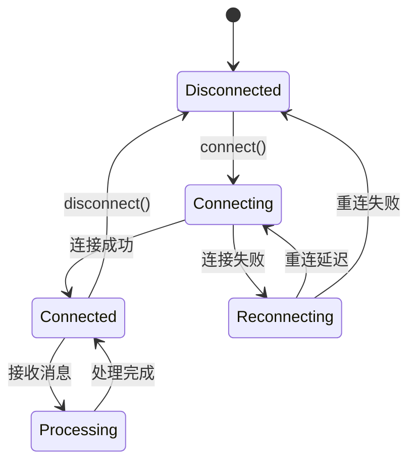
```mermaid
stateDiagram-v2
[*] --> Disconnected
Disconnected --> Connecting : connect()
Connecting --> Connected : 连接成功
Connecting --> Reconnecting : 连接失败
Connected --> Disconnected : disconnect()
Reconnecting --> Connecting : 重连延迟
Reconnecting --> Disconnected : 重连失败
Connected --> Processing : 接收消息
Processing --> Connected : 处理完成
```

**图表来源**
- [ws_utils.py](file://Qoder_workspace/xianyu-auto-reply/utils/ws_utils.py#L6-L89)

**章节来源**
- [app.js](file://static/js/app.js#L1-L800)
- [ws_utils.py](file://Qoder_workspace/xianyu-auto-reply/utils/ws_utils.py#L1-L89)

## 主题系统与多主题支持

### CSS变量驱动的主题系统

系统采用CSS自定义属性实现主题切换，支持动态颜色调整：

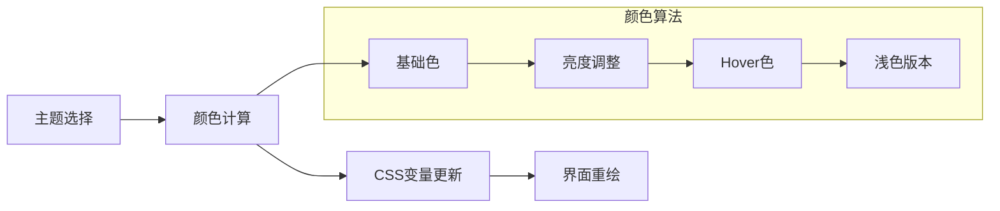
```mermaid
flowchart LR
A[主题选择] --> B[颜色计算]
B --> C[CSS变量更新]
C --> D[界面重绘]
subgraph "颜色算法"
E[基础色] --> F[亮度调整]
F --> G[Hover色]
G --> H[浅色版本]
end
B --> E
```

**图表来源**
- [app.js](file://static/js/app.js#L4957-L4981)

### 主题切换机制

系统支持动态主题切换，通过JavaScript修改CSS变量实现：

| 颜色类型 | 变量名 | 计算方法 | 用途 |
|---------|--------|----------|------|
| 基础色 | `--primary-color` | 用户选择 | 主要品牌色 |
| 悬停色 | `--primary-hover` | 调整亮度(-20%) | 按钮悬停效果 |
| 浅色版 | `--primary-light` | 调整亮度(+10%) | 背景高亮 |
| 边框色 | `--border-color` | 固定值 | 边框和分割线 |

**章节来源**
- [app.js](file://static/js/app.js#L4957-L4992)

## 前端与后端交互

### API交互模式

系统采用RESTful API设计，支持多种HTTP方法：

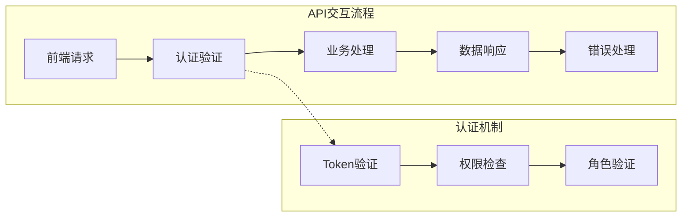
```mermaid
graph LR
subgraph "API交互流程"
A[前端请求] --> B[认证验证]
B --> C[业务处理]
C --> D[数据响应]
D --> E[错误处理]
end
subgraph "认证机制"
F[Token验证] --> G[权限检查]
G --> H[角色验证]
end
B -.-> F
```

**图表来源**
- [login.html](file://static/login.html#L368-L400)

### 登录认证流程

系统实现了完整的登录认证机制：

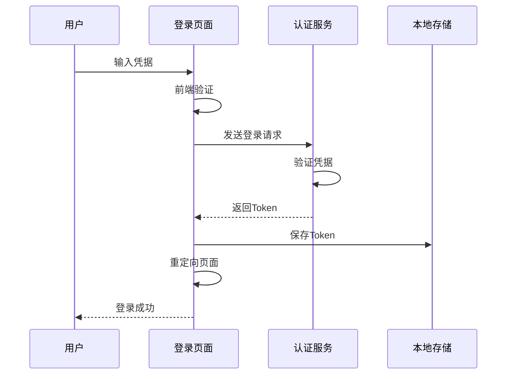
```mermaid
sequenceDiagram
participant User as 用户
participant Login as 登录页面
participant Auth as 认证服务
participant Storage as 本地存储
User->>Login : 输入凭据
Login->>Login : 前端验证
Login->>Auth : 发送登录请求
Auth->>Auth : 验证凭据
Auth-->>Login : 返回Token
Login->>Storage : 保存Token
Login->>Login : 重定向页面
Login-->>User : 登录成功
```

**图表来源**
- [login.html](file://static/login.html#L307-L408)

### 数据获取与更新机制

系统采用多种数据获取策略：

| 数据类型 | 获取方式 | 缓存策略 | 更新频率 |
|---------|----------|----------|----------|
| 仪表盘数据 | 定时轮询 | 内存缓存 | 30秒 |
| 关键词列表 | 按需加载 | 30秒缓存 | 手动刷新 |
| 商品数据 | 分页加载 | 无缓存 | 实时 |
| 订单数据 | 实时推送 | 内存缓存 | WebSocket |

**章节来源**
- [login.html](file://static/login.html#L1-L724)
- [app.js](file://static/js/app.js#L147-L240)

## 移动端适配策略

### 响应式设计原则

系统采用移动优先的响应式设计策略：

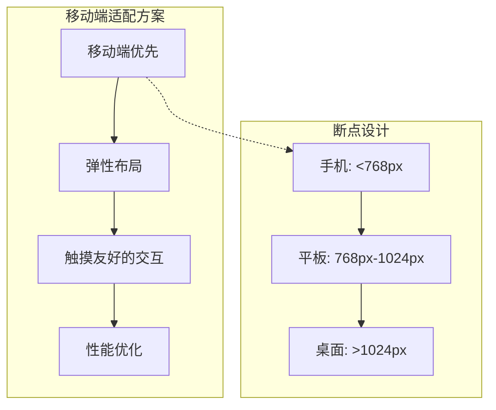
```mermaid
graph TB
subgraph "移动端适配方案"
A[移动端优先] --> B[弹性布局]
B --> C[触摸友好的交互]
C --> D[性能优化]
end
subgraph "断点设计"
E[手机: <768px] --> F[平板: 768px-1024px]
F --> G[桌面: >1024px]
end
A -.-> E
```

**图表来源**
- [layout.css](file://static/css/layout.css#L130-L147)

### 移动端交互优化

| 交互类型 | 设计策略 | 实现方式 |
|---------|----------|----------|
| 导航切换 | 侧边栏抽屉 | CSS transform动画 |
| 表单输入 | 触摸友好 | 增大点击区域 |
| 数据展示 | 滚动优化 | 虚拟滚动 |
| 操作反馈 | 触觉反馈 | 微交互动画 |

### 屏幕尺寸适配

系统针对不同屏幕尺寸进行了优化：

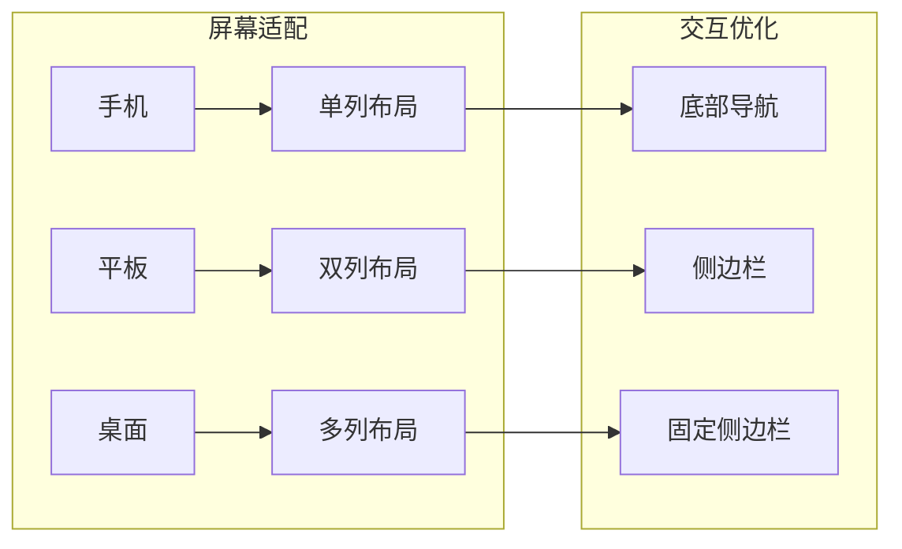
```mermaid
graph LR
subgraph "屏幕适配"
A[手机] --> B[单列布局]
C[平板] --> D[双列布局]
E[桌面] --> F[多列布局]
end
subgraph "交互优化"
B --> G[底部导航]
D --> H[侧边栏]
F --> I[固定侧边栏]
end
```

**图表来源**
- [components.css](file://static/css/components.css#L275-L313)

**章节来源**
- [layout.css](file://static/css/layout.css#L130-L171)
- [components.css](file://static/css/components.css#L275-L313)

## 可访问性考虑

### 语义化HTML结构

系统采用语义化HTML标记，确保内容结构清晰：

| 元素类型 | 使用场景 | 可访问性优势 |
|---------|----------|-------------|
| `<header>` | 页面头部 | 快速定位主要内容 |
| `<nav>` | 导航区域 | 提供导航结构 |
| `<main>` | 主要内容 | 确保内容焦点 |
| `<footer>` | 页面底部 | 提供辅助信息 |
| `<article>` | 独立内容 | 支持内容重用 |

### 交互元素设计

系统注重交互元素的可访问性设计：

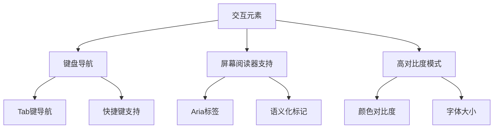
```mermaid
flowchart TD
A[交互元素] --> B[键盘导航]
A --> C[屏幕阅读器支持]
A --> D[高对比度模式]
B --> E[Tab键导航]
B --> F[快捷键支持]
C --> G[Aria标签]
C --> H[语义化标记]
D --> I[颜色对比度]
D --> J[字体大小]
```

### 键盘导航支持

系统支持完整的键盘导航：

| 功能 | 键盘快捷键 | 实现方式 |
|------|-----------|----------|
| 导航切换 | Tab/Shift+Tab | focus管理 |
| 表单操作 | Enter/Space | 键盘事件监听 |
| 模态框关闭 | Escape | 事件捕获 |
| 链接跳转 | Enter | 原生行为 |

**章节来源**
- [index.html](file://static/index.html#L1-L800)
- [login.html](file://static/login.html#L1-L724)

## 组件树结构

### 主要UI模块划分

系统采用模块化的组件树结构：

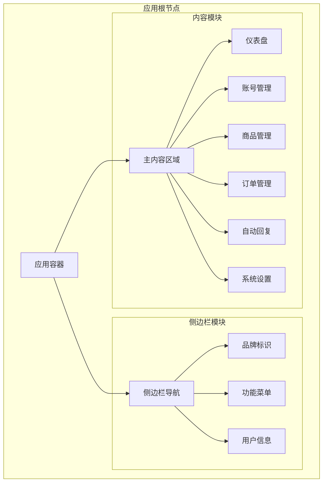
```mermaid
graph TB
subgraph "应用根节点"
A[应用容器] --> B[侧边栏导航]
A --> C[主内容区域]
subgraph "侧边栏模块"
B --> D[品牌标识]
B --> E[功能菜单]
B --> F[用户信息]
end
subgraph "内容模块"
C --> G[仪表盘]
C --> H[账号管理]
C --> I[商品管理]
C --> J[订单管理]
C --> K[自动回复]
C --> L[系统设置]
end
end
```

**图表来源**
- [index.html](file://static/index.html#L18-L150)

### 组件层次关系

| 层级 | 组件名称 | 功能描述 | 子组件 |
|------|----------|----------|--------|
| 1 | 应用容器 | 整体布局容器 | - |
| 2 | 侧边栏 | 导航和功能入口 | 品牌、菜单、用户 |
| 3 | 内容区域 | 功能模块容器 | 仪表盘、管理模块 |
| 4 | 功能模块 | 具体业务功能 | 表格、表单、图表 |
| 5 | 交互组件 | 用户交互元素 | 按钮、输入框、卡片 |

### 数据流架构

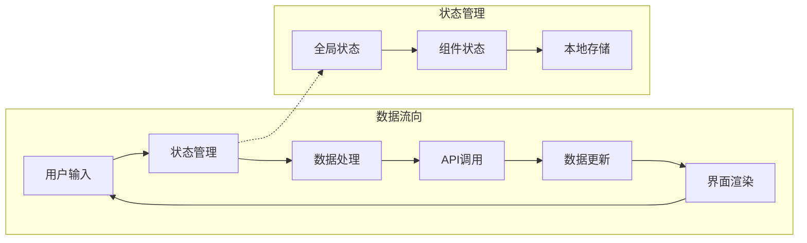
```mermaid
graph LR
subgraph "数据流向"
A[用户输入] --> B[状态管理]
B --> C[数据处理]
C --> D[API调用]
D --> E[数据更新]
E --> F[界面渲染]
F --> A
end
subgraph "状态管理"
G[全局状态] --> H[组件状态]
H --> I[本地存储]
end
B -.-> G
```

**图表来源**
- [app.js](file://static/js/app.js#L37-L145)

**章节来源**
- [index.html](file://static/index.html#L1-L800)

## 性能优化策略

### 代码分割与懒加载

系统采用多种性能优化策略：

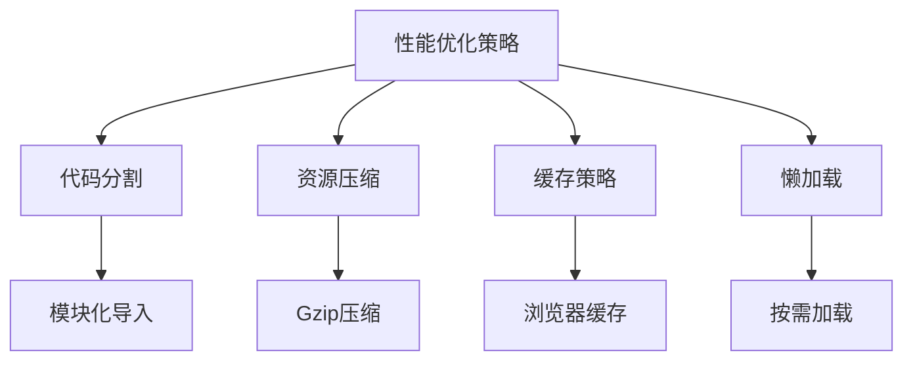
```mermaid
flowchart TD
A[性能优化策略] --> B[代码分割]
A --> C[资源压缩]
A --> D[缓存策略]
A --> E[懒加载]
B --> F[模块化导入]
C --> G[Gzip压缩]
D --> H[浏览器缓存]
E --> I[按需加载]
```

### 加载性能优化

| 优化方面 | 实现方式 | 性能提升 |
|---------|----------|----------|
| 首屏加载 | 代码分割 | 减少初始包大小 |
| 资源加载 | CDN加速 | 提高资源下载速度 |
| 数据加载 | 分页加载 | 减少一次性数据传输 |
| 界面渲染 | 虚拟滚动 | 优化大量数据展示 |

### 内存管理

系统实现了完善的内存管理机制：

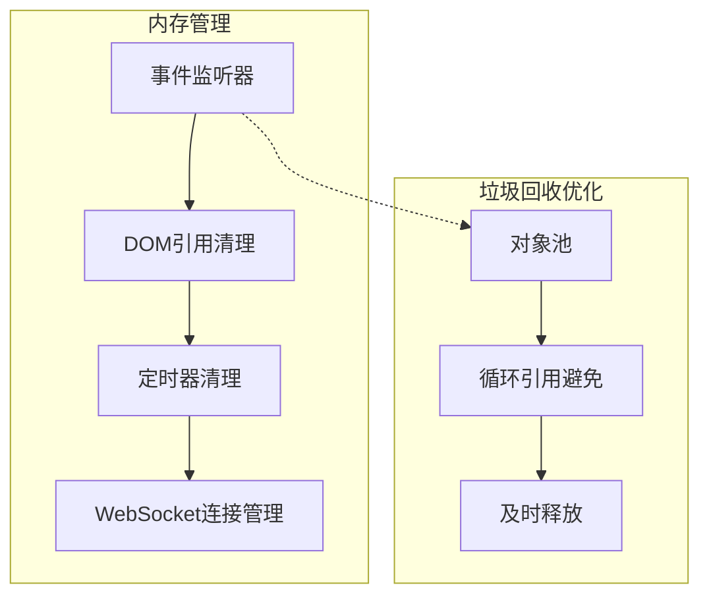
```mermaid
graph TB
subgraph "内存管理"
A[事件监听器] --> B[DOM引用清理]
B --> C[定时器清理]
C --> D[WebSocket连接管理]
end
subgraph "垃圾回收优化"
E[对象池] --> F[循环引用避免]
F --> G[及时释放]
end
A -.-> E
```

**章节来源**
- [app.js](file://static/js/app.js#L1-L800)

## 总结

该前端架构设计体现了现代Web开发的最佳实践，具有以下特点：

### 技术优势
- **模块化架构**: 清晰的功能模块划分，便于维护和扩展
- **响应式设计**: 完善的移动端适配，支持多设备访问
- **性能优化**: 多层次的性能优化策略，确保流畅体验
- **可访问性**: 完整的可访问性支持，满足无障碍要求

### 架构特色
- **CSS变量系统**: 支持动态主题切换，提升用户体验
- **原生JavaScript**: 避免第三方库依赖，保持轻量化
- **WebSocket集成**: 实现实时通信，提高交互效率
- **语义化标记**: 符合Web标准，利于SEO和可访问性

### 扩展性
系统架构具备良好的扩展性，支持：
- 新功能模块的快速集成
- 主题系统的灵活扩展
- 第三方组件的无缝接入
- 多语言国际化支持

该架构为闲鱼自动回复管理系统提供了坚实的技术基础，能够满足复杂业务场景的需求，同时保持良好的开发体验和用户体验。