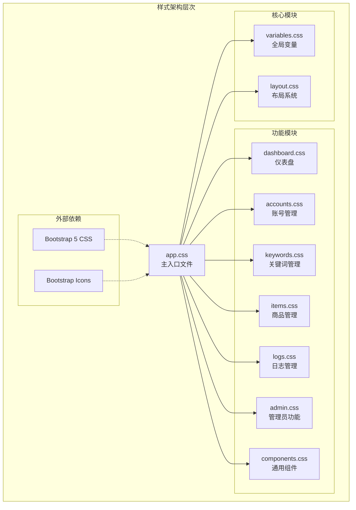
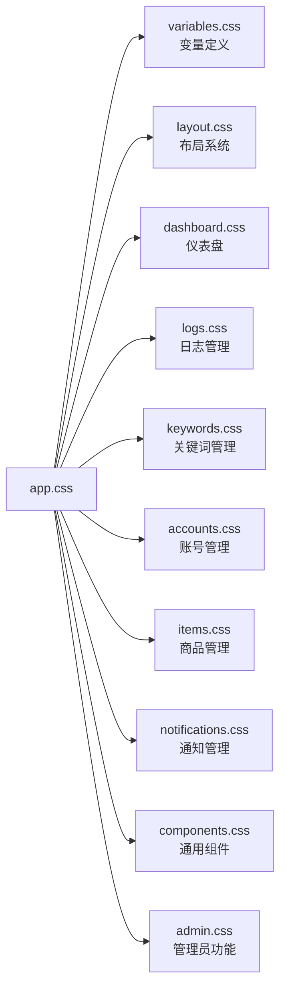
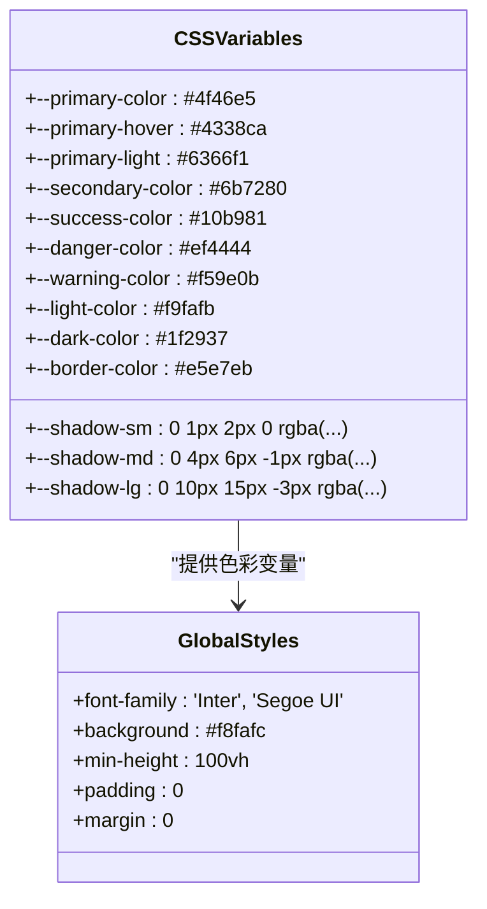
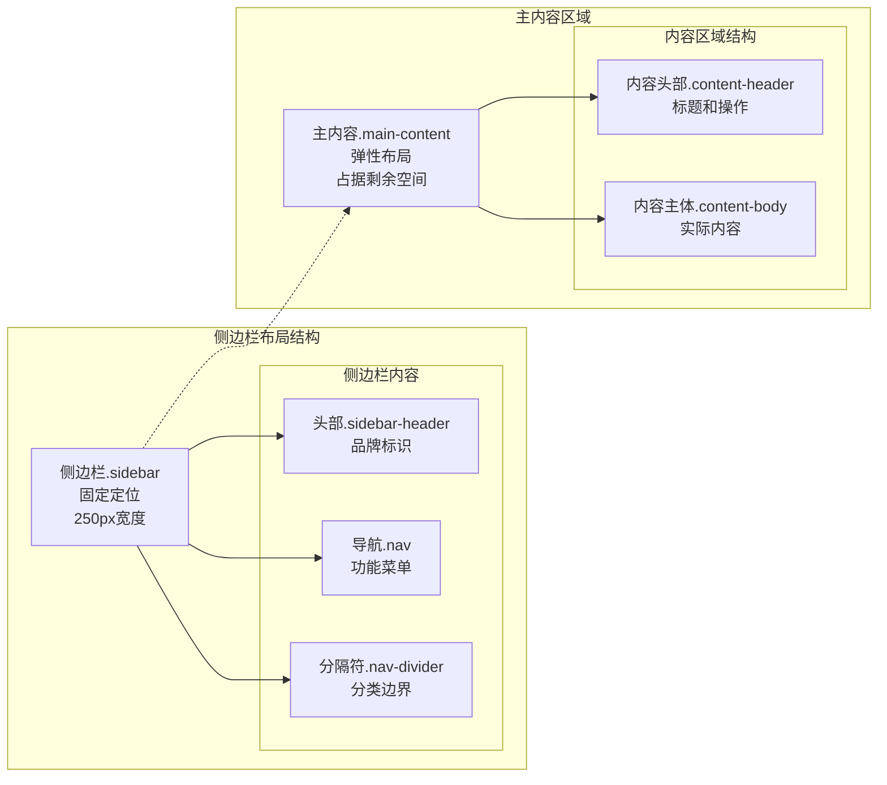
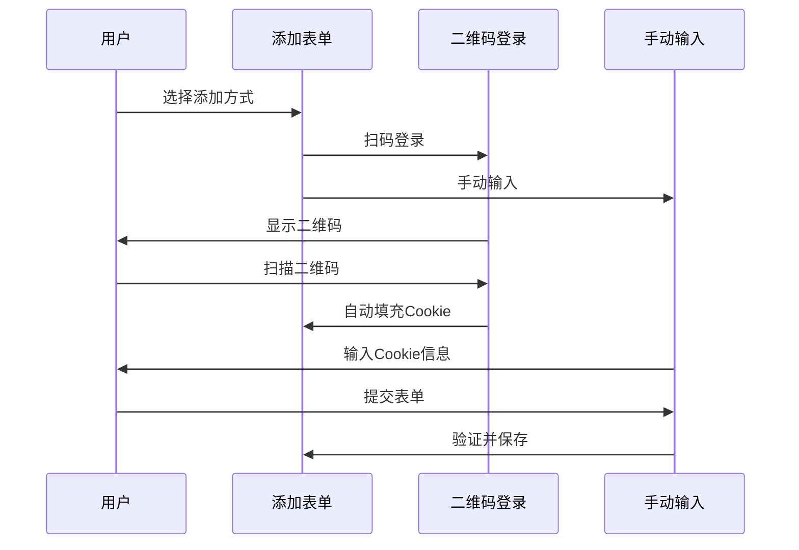
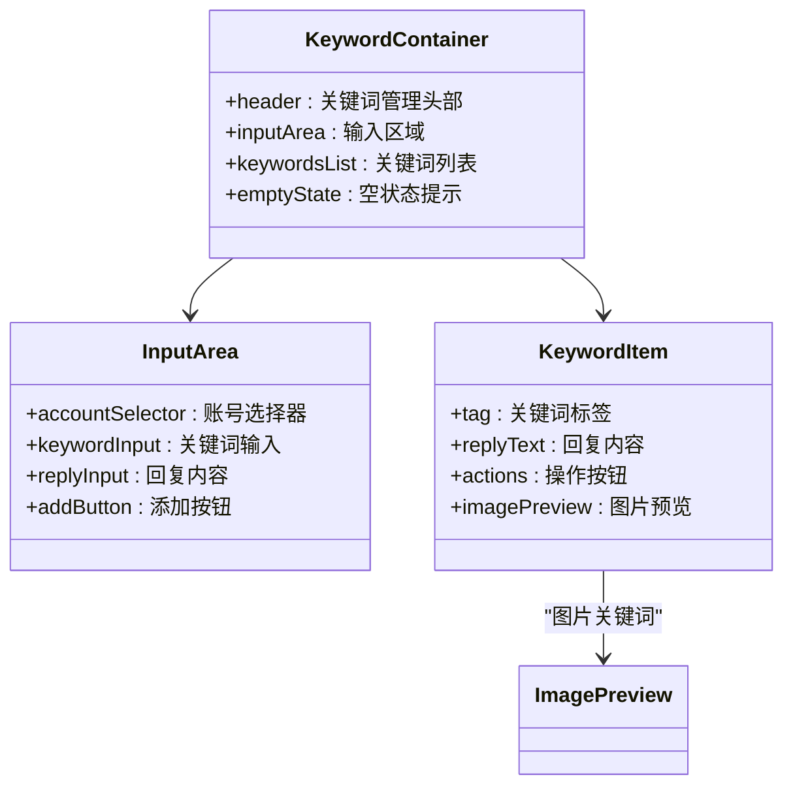
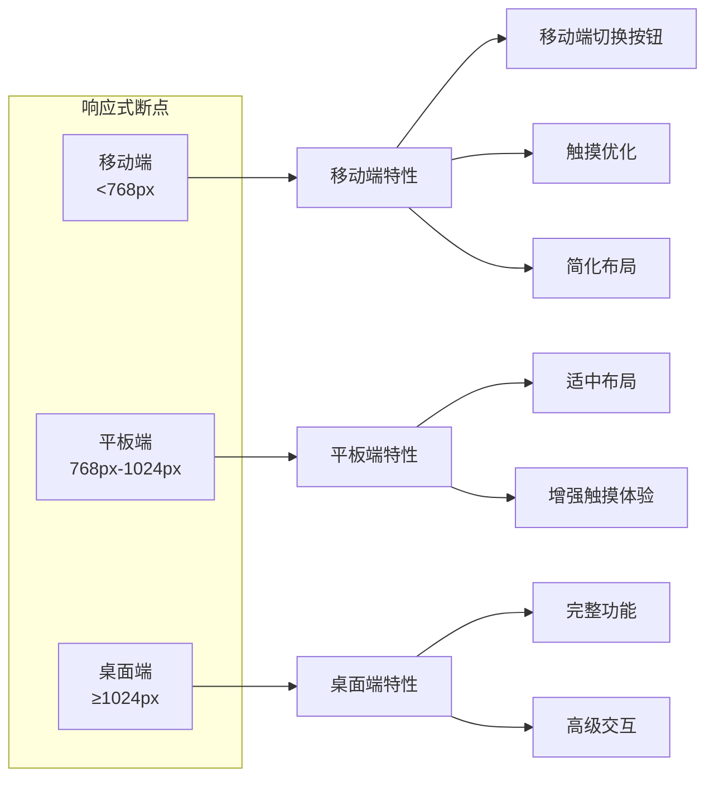
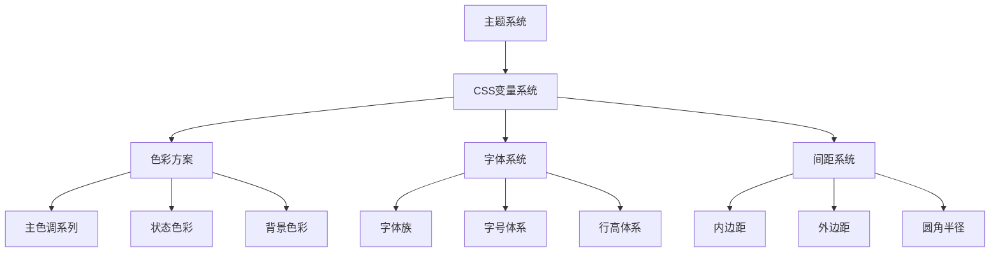
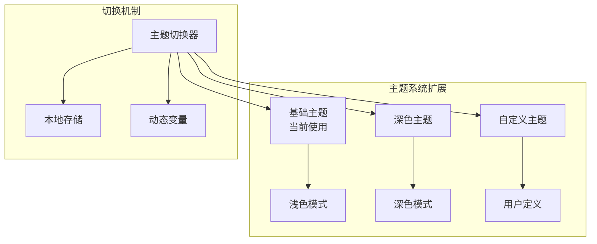

# 前端样式系统设计文档

<cite>
**本文档引用的文件**
- [app.css](file://static/css/app.css)
- [variables.css](file://static/css/variables.css)
- [layout.css](file://static/css/layout.css)
- [dashboard.css](file://static/css/dashboard.css)
- [accounts.css](file://static/css/accounts.css)
- [components.css](file://static/css/components.css)
- [admin.css](file://static/css/admin.css)
- [keywords.css](file://static/css/keywords.css)
- [items.css](file://static/css/items.css)
- [logs.css](file://static/css/logs.css)
- [index.html](file://static/index.html)
- [login.html](file://static/login.html)
- [register.html](file://static/register.html)
</cite>

## 目录
1. [项目概述](#项目概述)
2. [样式架构设计](#样式架构设计)
3. [核心CSS变量系统](#核心css变量系统)
4. [布局系统分析](#布局系统分析)
5. [功能模块样式](#功能模块样式)
6. [响应式设计策略](#响应式设计策略)
7. [主题切换机制](#主题切换机制)
8. [性能优化考虑](#性能优化考虑)
9. [最佳实践总结](#最佳实践总结)

## 项目概述

该项目采用现代化的前端样式架构，基于CSS3和Bootstrap 5构建了一套完整的UI样式系统。整个样式体系通过模块化设计实现了高度的可维护性和扩展性，支持多主题切换和移动端适配。

### 技术栈特点
- **CSS3原生特性**：充分利用现代CSS3的布局、动画和视觉效果能力
- **Bootstrap 5集成**：结合Bootstrap 5的组件系统和栅格系统
- **模块化架构**：通过@import机制实现样式的模块化组织
- **响应式设计**：全面支持移动设备和桌面设备的适配

## 样式架构设计

### 整体架构图



**图表来源**
- [app.css](file://static/css/app.css#L1-L14)
- [variables.css](file://static/css/variables.css#L1-L27)
- [layout.css](file://static/css/layout.css#L1-L171)

### @import机制设计

app.css作为样式系统的主入口，通过@import机制按顺序加载各个功能模块的样式文件：



**节来源**
- [app.css](file://static/css/app.css#L1-L14)

## 核心CSS变量系统

### 变量定义架构

variables.css定义了整个应用的色彩体系和基础样式变量：



**图表来源**
- [variables.css](file://static/css/variables.css#L4-L17)
- [variables.css](file://static/css/variables.css#L20-L26)

### 色彩系统设计

系统采用分层的色彩体系，支持多种语义化的颜色变量：

| 变量类别 | 颜色变量 | 用途说明 |
|---------|---------|----------|
| 主色调系列 | `--primary-color` | 主要功能按钮、导航高亮 |
| 辅助色调 | `--secondary-color` | 文本颜色、次要元素 |
| 成功状态 | `--success-color` | 操作成功、积极反馈 |
| 错误状态 | `--danger-color` | 操作警告、危险操作 |
| 警告状态 | `--warning-color` | 警告提示、注意事项 |
| 背景色彩 | `--light-color`/`--dark-color` | 背景色、对比色 |
| 边框色彩 | `--border-color` | 边框颜色、分割线 |

### 阴影系统

定义了三种不同强度的阴影效果：
- `--shadow-sm`: 轻微阴影，用于卡片基础效果
- `--shadow-md`: 中等阴影，用于交互元素
- `--shadow-lg`: 强烈阴影，用于重要容器

**节来源**
- [variables.css](file://static/css/variables.css#L1-L27)

## 布局系统分析

### 侧边栏布局架构

layout.css实现了经典的左侧导航+右侧内容的布局模式：



**图表来源**
- [layout.css](file://static/css/layout.css#L4-L171)

### 导航系统设计

导航系统采用扁平化设计，支持鼠标悬停和激活状态：

```mermaid
stateDiagram-v2
[*] --> Normal : 默认状态
Normal --> Hover : 鼠标悬停
Hover --> Normal : 鼠标离开
Normal --> Active : 点击激活
Active --> Normal : 切换页面
state Hover {
background : rgba(255,255,255,0.1)
border-left : 3px solid rgba(255,255,255,0.5)
}
state Active {
background : rgba(255,255,255,0.15)
border-left : 3px solid white
}
```

**图表来源**
- [layout.css](file://static/css/layout.css#L82-L92)

### 响应式布局策略

系统实现了完整的移动端适配方案：

```mermaid
flowchart TD
Desktop[桌面端<br/>≥768px] --> SidebarFixed[侧边栏固定<br/>250px宽度]
Desktop --> MainContent[主内容区域<br/>占据剩余空间]
Mobile[移动端<br/><768px] --> SidebarHidden[侧边栏隐藏<br/>translateX(-100%)]
Mobile --> MobileToggle[移动端切换按钮<br/>fixed定位]
Mobile --> MainContentMobile[主内容区域<br/>全宽显示]
MobileToggle --> SidebarShow[点击显示<br/>transform: translateX(0)]
SidebarShow --> SidebarHidden
```

**图表来源**
- [layout.css](file://static/css/layout.css#L131-L161)

**节来源**
- [layout.css](file://static/css/layout.css#L1-L171)

## 功能模块样式

### 仪表盘模块 (dashboard.css)

仪表盘模块采用网格布局展示统计数据：

```mermaid
graph GRID
GRID[row1: 统计卡片网格<br/>row2: 操作按钮<br/>row3: 数据表格]
row1 --> StatCard1[账号总数<br/>成功卡片]
row1 --> StatCard2[关键词总数<br/>警告卡片]
row1 --> StatCard3[启用账号<br/>信息卡片]
row1 --> StatCard4[订单总数<br/>警告卡片]
row2 --> ActionButtons[批量操作按钮]
row3 --> DataTable[账户详情表格<br/>hover效果]
```

**图表来源**
- [dashboard.css](file://static/css/dashboard.css#L1-L69)

### 账号管理模块 (accounts.css)

账号管理模块提供了完整的账号生命周期管理功能：



**图表来源**
- [accounts.css](file://static/css/accounts.css#L1-L228)

### 关键词管理模块 (keywords.css)

关键词管理模块支持文本和图片两种类型的关键词：



**图表来源**
- [keywords.css](file://static/css/keywords.css#L1-L404)

**节来源**
- [dashboard.css](file://static/css/dashboard.css#L1-L69)
- [accounts.css](file://static/css/accounts.css#L1-L228)
- [keywords.css](file://static/css/keywords.css#L1-L404)

## 响应式设计策略

### 断点系统

系统采用标准的移动优先响应式设计策略：



### 移动端优化

针对移动端设备进行了专门的优化：

| 优化项目 | 实现方式 | 效果说明 |
|---------|---------|----------|
| 字体大小 | 相对单位rem/em | 自适应屏幕尺寸 |
| 间距调整 | 缩小padding/margin | 减少垂直空间占用 |
| 按钮尺寸 | 增大触摸目标 | 提升触摸体验 |
| 滚动优化 | 自定义滚动条 | 改善滚动流畅度 |
| 表格优化 | 水平滚动 | 保持数据完整性 |

**节来源**
- [accounts.css](file://static/css/accounts.css#L195-L227)
- [components.css](file://static/css/components.css#L275-L313)
- [keywords.css](file://static/css/keywords.css#L377-L403)

## 主题切换机制

### CSS变量驱动的主题系统

系统通过CSS变量实现了灵活的主题切换机制：



### 多主题支持

虽然当前版本主要使用单一主题，但架构设计支持未来扩展多主题功能：



**节来源**
- [variables.css](file://static/css/variables.css#L4-L17)

## 性能优化考虑

### 样式加载优化

1. **模块化加载**：通过@import机制实现按需加载
2. **缓存策略**：利用浏览器缓存机制提升加载速度
3. **压缩优化**：生产环境下的CSS压缩处理

### 渲染性能优化

1. **硬件加速**：合理使用CSS3变换和过渡效果
2. **减少重绘**：避免频繁修改影响布局的属性
3. **选择器优化**：使用高效的CSS选择器

### 移动端性能

1. **触摸优化**：增大触摸目标，提升交互体验
2. **滚动优化**：自定义滚动条，改善滚动流畅度
3. **内存管理**：及时清理不需要的DOM元素

## 最佳实践总结

### 设计原则

1. **一致性原则**：统一的色彩、字体、间距规范
2. **可用性原则**：以用户为中心的设计理念
3. **可访问性原则**：支持键盘导航和屏幕阅读器
4. **响应式原则**：移动端优先的设计策略

### 开发规范

1. **命名规范**：采用BEM命名法，确保类名语义化
2. **模块化开发**：每个功能模块独立维护样式
3. **版本控制**：通过CSS变量管理样式版本
4. **测试覆盖**：在不同设备和浏览器上进行测试

### 扩展建议

1. **主题系统**：建立完整的主题切换机制
2. **动画系统**：添加标准化的动画效果
3. **组件库**：提取可复用的UI组件
4. **文档体系**：建立完整的样式文档

这套前端样式系统展现了现代Web开发的最佳实践，通过模块化设计、CSS变量系统和响应式布局，为用户提供了一致且优秀的视觉体验。系统的架构设计既保证了当前功能的实现，也为未来的功能扩展奠定了良好的基础。