# 前端结构

<cite>
**本文档引用的文件**
- [index.html](file://static/index.html)
- [login.html](file://static/login.html)
- [register.html](file://static/register.html)
- [layout.css](file://static/css/layout.css)
- [app.css](file://static/css/app.css)
- [variables.css](file://static/css/variables.css)
- [dashboard.css](file://static/css/dashboard.css)
- [app.js](file://static/js/app.js)
</cite>

## 目录
1. [项目概述](#项目概述)
2. [HTML页面结构](#html页面结构)
3. [CSS架构设计](#css架构设计)
4. [JavaScript交互逻辑](#javascript交互逻辑)
5. [响应式设计实现](#响应式设计实现)
6. [页面导航系统](#页面导航系统)
7. [表单处理机制](#表单处理机制)
8. [API交互模式](#api交互模式)
9. [主题切换与多主题支持](#主题切换与多主题支持)
10. [移动端适配策略](#移动端适配策略)

## 项目概述

该项目是一个基于HTML5构建的响应式Web管理系统，采用现代化的前端技术栈，提供了完整的闲鱼自动回复管理功能。系统采用模块化的页面结构设计，支持多主题切换和移动端适配，具备完善的表单验证和API交互机制。

### 技术特性
- **HTML5语义化结构**：使用标准的HTML5标签和语义化标记
- **响应式设计**：基于Bootstrap框架的移动优先设计理念
- **模块化CSS架构**：采用SCSS风格的模块化CSS组织方式
- **异步JavaScript交互**：基于Promise的现代JavaScript编程模式
- **多主题支持**：内置主题切换机制和自定义变量系统

## HTML页面结构

### 主页面结构设计

系统的核心页面采用统一的HTML5结构模板，包含头部、侧边栏导航、主内容区域和底部信息。

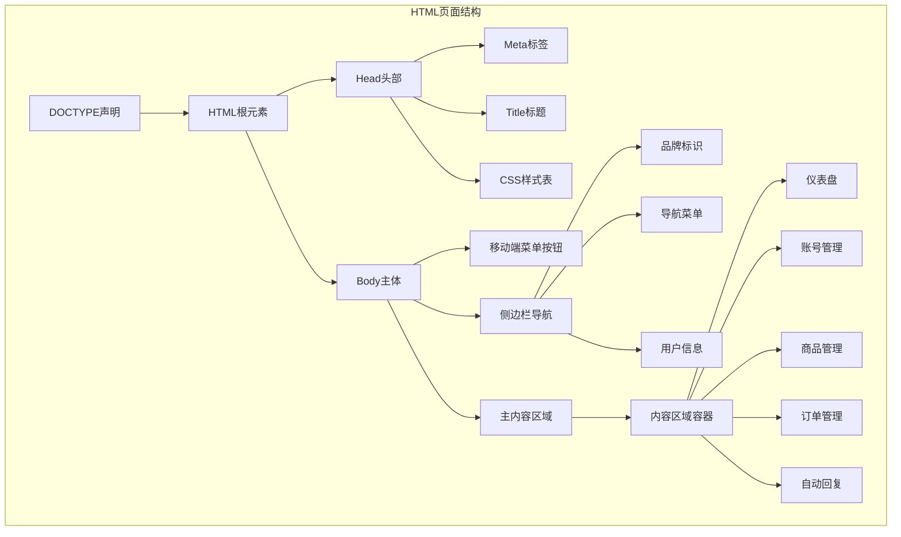

**图表来源**
- [index.html](file://static/index.html#L1-L100)

### 登录页面结构

登录页面采用简洁的单页应用设计，支持多种登录方式和验证码验证。

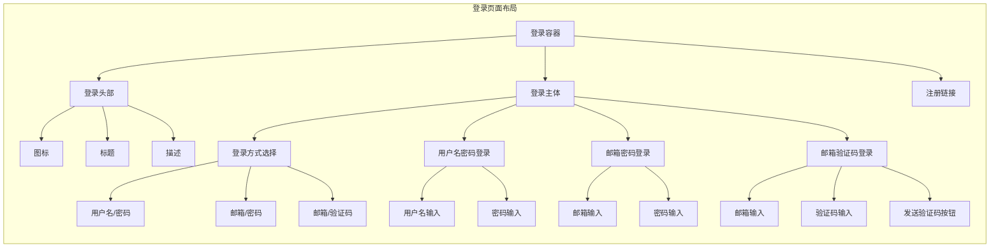

**图表来源**
- [login.html](file://static/login.html#L120-L220)

### 注册页面结构

注册页面提供完整的用户注册流程，包含图形验证码和邮箱验证机制。

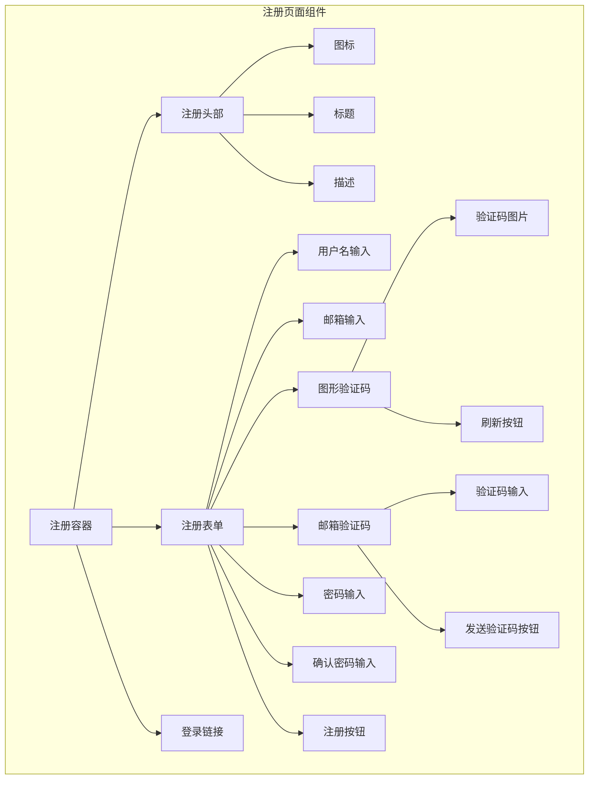

**图表来源**
- [register.html](file://static/register.html#L170-L260)

**章节来源**
- [index.html](file://static/index.html#L1-L3719)
- [login.html](file://static/login.html#L1-L724)
- [register.html](file://static/register.html#L1-L576)

## CSS架构设计

### 全局变量系统

系统采用CSS自定义属性的全局变量系统，支持主题切换和颜色管理。

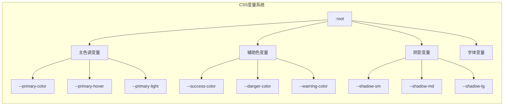

**图表来源**
- [variables.css](file://static/css/variables.css#L4-L18)

### 布局架构

系统采用模块化的CSS架构，将不同功能区域分离到独立的样式文件中。

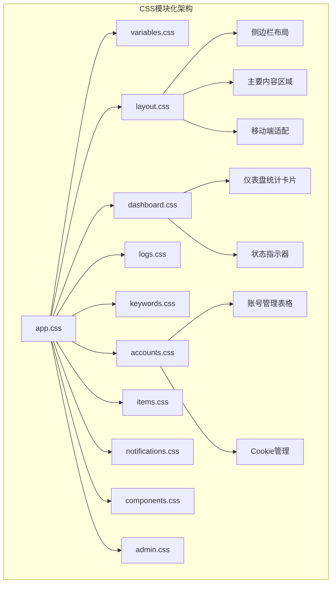

**图表来源**
- [app.css](file://static/css/app.css#L1-L14)

### 样式组织原则

1. **模块化分离**：每个功能区域使用独立的CSS文件
2. **变量驱动**：通过CSS自定义属性实现主题一致性
3. **响应式优先**：采用移动优先的设计理念
4. **语义化命名**：使用描述性的类名和ID

**章节来源**
- [variables.css](file://static/css/variables.css#L1-L27)
- [layout.css](file://static/css/layout.css#L1-L171)
- [dashboard.css](file://static/css/dashboard.css#L1-L69)

## JavaScript交互逻辑

### 导航系统实现

系统采用基于JavaScript的SPA（单页应用）导航模式，通过动态切换内容区域实现页面切换。

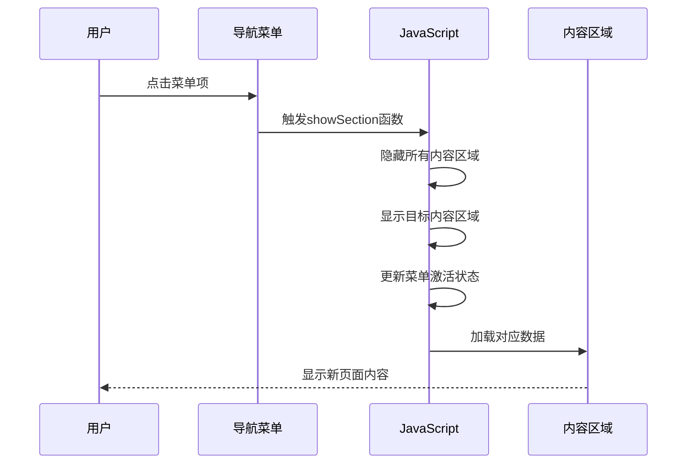

**图表来源**
- [app.js](file://static/js/app.js#L38-L133)

### 表单验证机制

系统实现了多层次的表单验证机制，包括前端验证和后端验证。

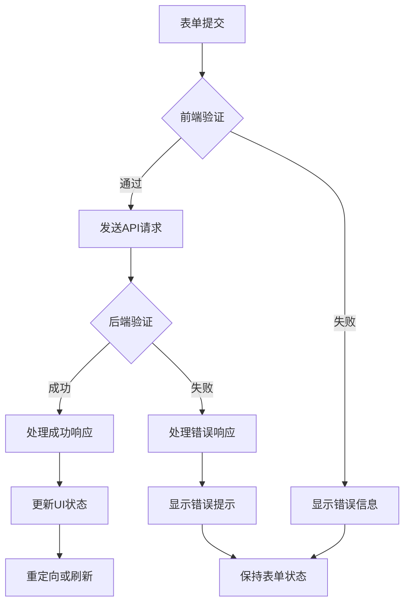

**图表来源**
- [app.js](file://static/js/app.js#L668-L800)

### 异步数据加载

系统采用Promise-based的异步数据加载模式，支持并发请求和错误处理。

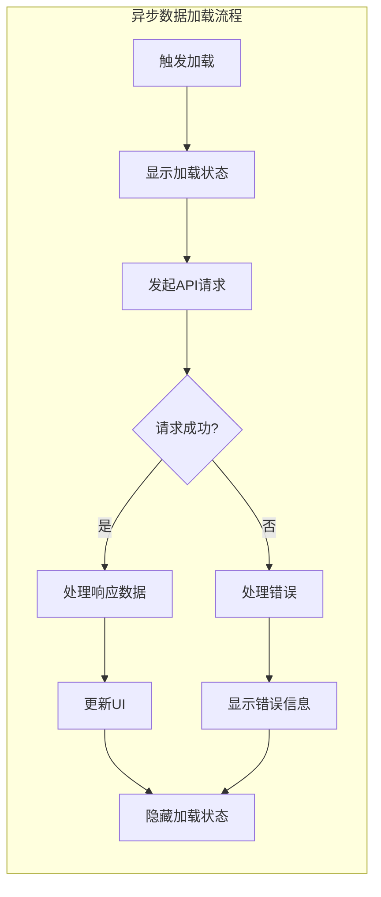

**图表来源**
- [app.js](file://static/js/app.js#L1049-L1060)

**章节来源**
- [app.js](file://static/js/app.js#L1-L800)

## 响应式设计实现

### 断点系统

系统采用Bootstrap的响应式断点系统，支持多种设备尺寸。

| 断点 | 最小宽度 | 设备类型 | 布局调整 |
|------|----------|----------|----------|
| xs | 0px | 超小屏幕 | 默认布局 |
| sm | 576px | 小屏幕 | 中等布局 |
| md | 768px | 中等屏幕 | 大布局 |
| lg | 992px | 大屏幕 | 超大布局 |
| xl | 1200px | 超大屏幕 | 超宽布局 |

### 移动端适配策略

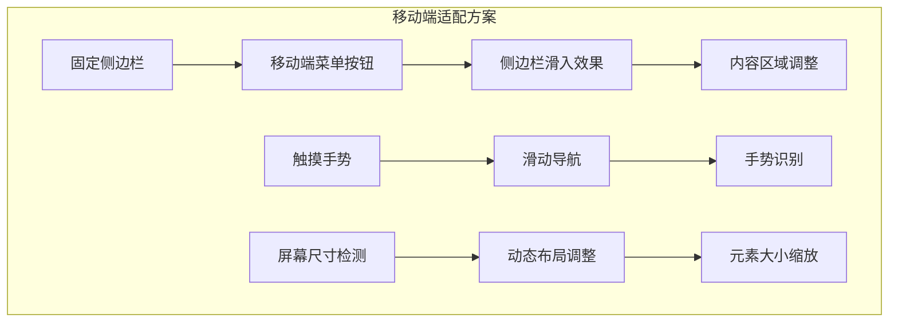

**图表来源**
- [layout.css](file://static/css/layout.css#L130-L162)

### 响应式表格设计

系统为不同屏幕尺寸提供了优化的表格显示方案：

- **桌面端**：完整表格布局，支持列排序和筛选
- **平板端**：简化表格，合并部分列
- **手机端**：垂直堆叠显示，支持滑动查看更多

**章节来源**
- [layout.css](file://static/css/layout.css#L130-L171)

## 页面导航系统

### 侧边栏导航架构

系统采用固定侧边栏导航设计，提供清晰的功能分类和快速访问入口。

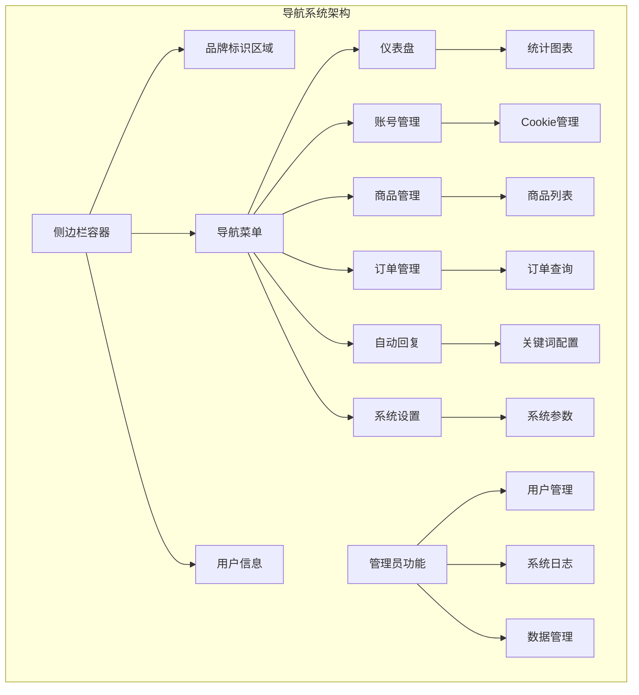

**图表来源**
- [index.html](file://static/index.html#L18-L139)

### 导航状态管理

系统实现了智能的导航状态管理，包括：

1. **当前页面高亮**：自动识别并高亮当前页面对应的菜单项
2. **面包屑导航**：显示当前页面的层级路径
3. **权限控制**：根据用户角色显示相应的功能菜单
4. **动态加载**：按需加载对应页面的数据和资源

**章节来源**
- [index.html](file://static/index.html#L18-L139)
- [app.js](file://static/js/app.js#L38-L133)

## 表单处理机制

### 表单验证体系

系统实现了完整的表单验证体系，涵盖前端验证、后端验证和实时反馈。

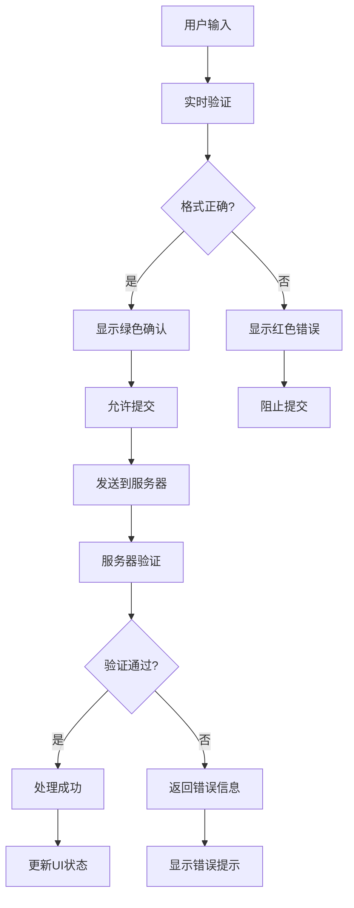

**图表来源**
- [login.html](file://static/login.html#L307-L408)
- [register.html](file://static/register.html#L467-L540)

### 表单提交流程

系统采用异步表单提交模式，提供流畅的用户体验。

1. **预验证阶段**：客户端进行基本格式验证
2. **加载状态**：显示加载指示器防止重复提交
3. **API调用**：通过Fetch API发送数据到后端
4. **响应处理**：根据响应结果更新UI状态
5. **错误恢复**：提供错误重试和用户指导

**章节来源**
- [login.html](file://static/login.html#L307-L408)
- [register.html](file://static/register.html#L467-L540)

## API交互模式

### 请求响应架构

系统采用RESTful API设计模式，支持多种HTTP方法和数据格式。

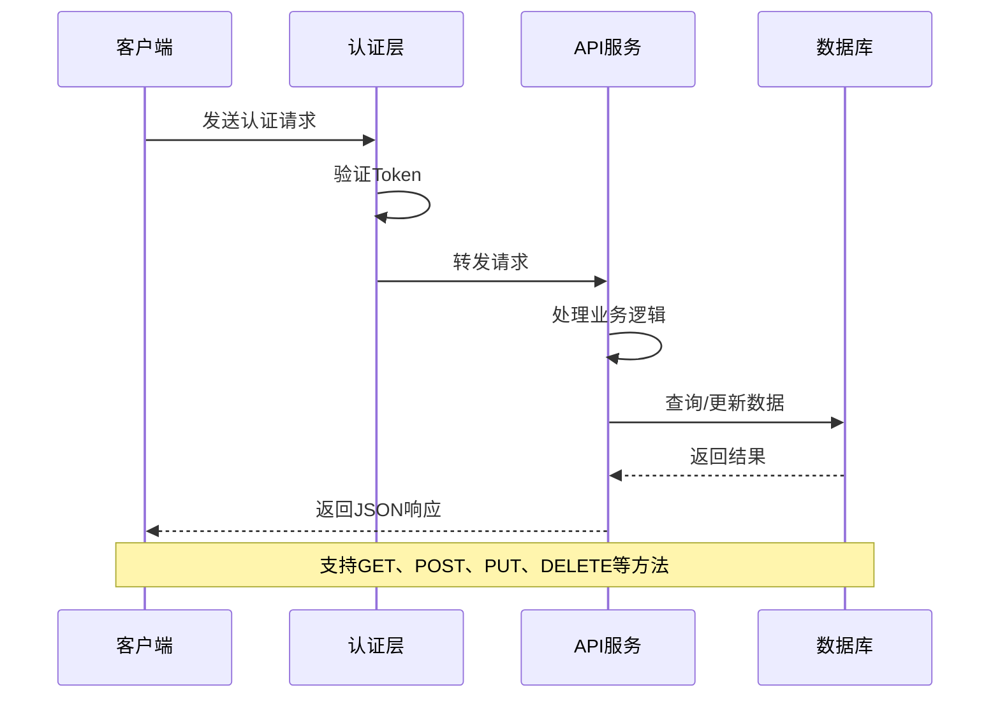

**图表来源**
- [app.js](file://static/js/app.js#L158-L238)

### 错误处理机制

系统实现了完善的错误处理机制：

1. **网络错误**：处理连接超时和网络中断
2. **服务器错误**：处理5xx状态码和内部错误
3. **验证错误**：处理4xx状态码和数据验证失败
4. **用户友好提示**：将技术错误转换为用户可理解的提示

### 缓存策略

系统采用多层缓存策略提升性能：

- **内存缓存**：JavaScript对象缓存频繁访问的数据
- **本地存储**：使用localStorage缓存用户偏好设置
- **CDN缓存**：静态资源通过CDN缓存加速加载

**章节来源**
- [app.js](file://static/js/app.js#L158-L238)

## 主题切换与多主题支持

### 主题变量系统

系统采用CSS自定义属性实现主题切换，支持动态修改颜色和样式。

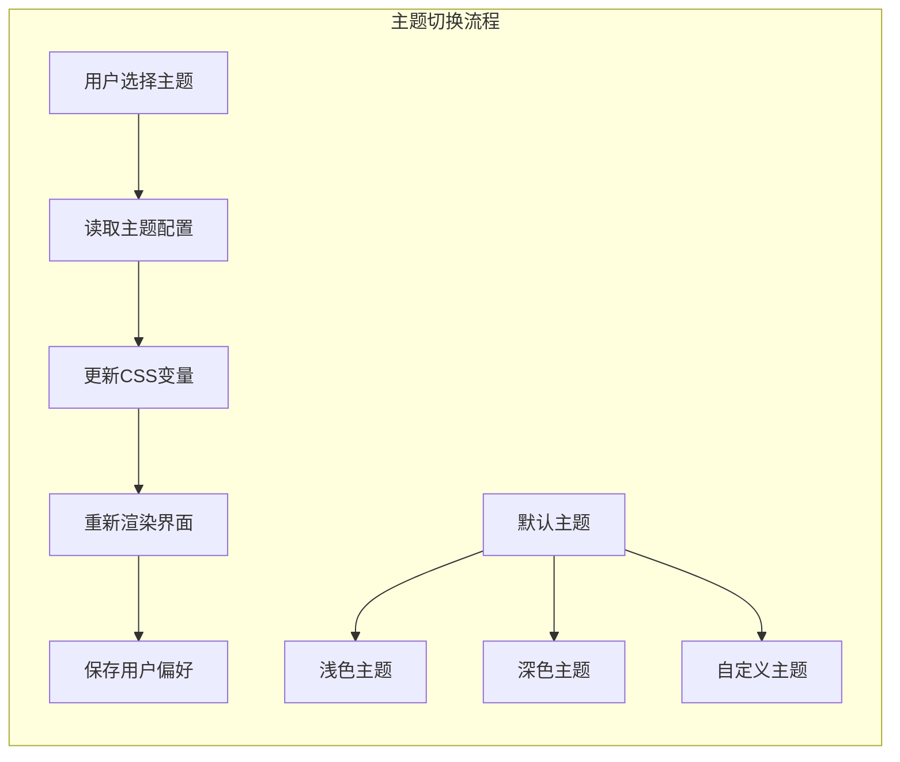

**图表来源**
- [variables.css](file://static/css/variables.css#L4-L18)

### 主题持久化

系统支持主题偏好的持久化存储：

1. **本地存储**：将用户选择的主题保存到localStorage
2. **自动检测**：根据系统偏好自动选择合适主题
3. **实时切换**：无需刷新页面即可切换主题

**章节来源**
- [variables.css](file://static/css/variables.css#L1-L27)

## 移动端适配策略

### 移动端导航

系统为移动端提供了专门的导航解决方案：

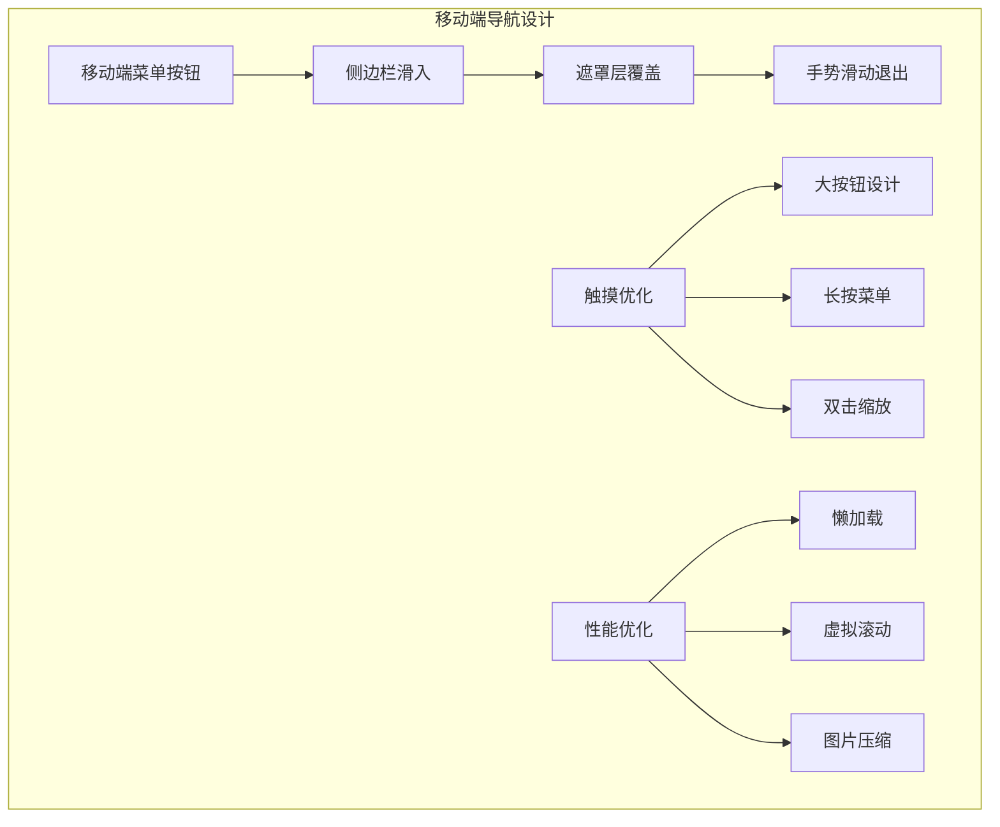

**图表来源**
- [layout.css](file://static/css/layout.css#L130-L162)

### 移动端表单优化

针对移动设备的特殊优化：

1. **输入法优化**：自动调整键盘布局和输入框大小
2. **触摸友好的控件**：增大按钮和链接的点击区域
3. **手势支持**：支持滑动、长按等触摸手势
4. **响应式字体**：根据屏幕尺寸自动调整字体大小

### 性能优化策略

移动端性能优化包括：

- **资源压缩**：CSS、JavaScript文件压缩和合并
- **图片优化**：使用WebP格式和响应式图片
- **懒加载**：延迟加载非首屏内容
- **缓存策略**：合理设置缓存头和版本控制

**章节来源**
- [layout.css](file://static/css/layout.css#L130-L171)

## 总结

该前端系统展现了现代Web开发的最佳实践，通过模块化的架构设计、响应式的布局方案和完善的交互机制，为用户提供了一致且高效的使用体验。系统的可扩展性和维护性得到了很好的平衡，为后续的功能扩展奠定了坚实的基础。

### 核心优势

1. **架构清晰**：模块化的CSS和JavaScript组织方式
2. **用户体验**：流畅的导航和响应式设计
3. **技术先进**：采用现代的Web技术和最佳实践
4. **易于维护**：清晰的代码结构和文档化

### 技术特色

- **HTML5语义化**：充分利用HTML5的新特性和语义化标签
- **CSS模块化**：采用SCSS风格的模块化CSS架构
- **JavaScript异步**：基于Promise的现代JavaScript编程模式
- **响应式设计**：全面的移动端适配和响应式布局