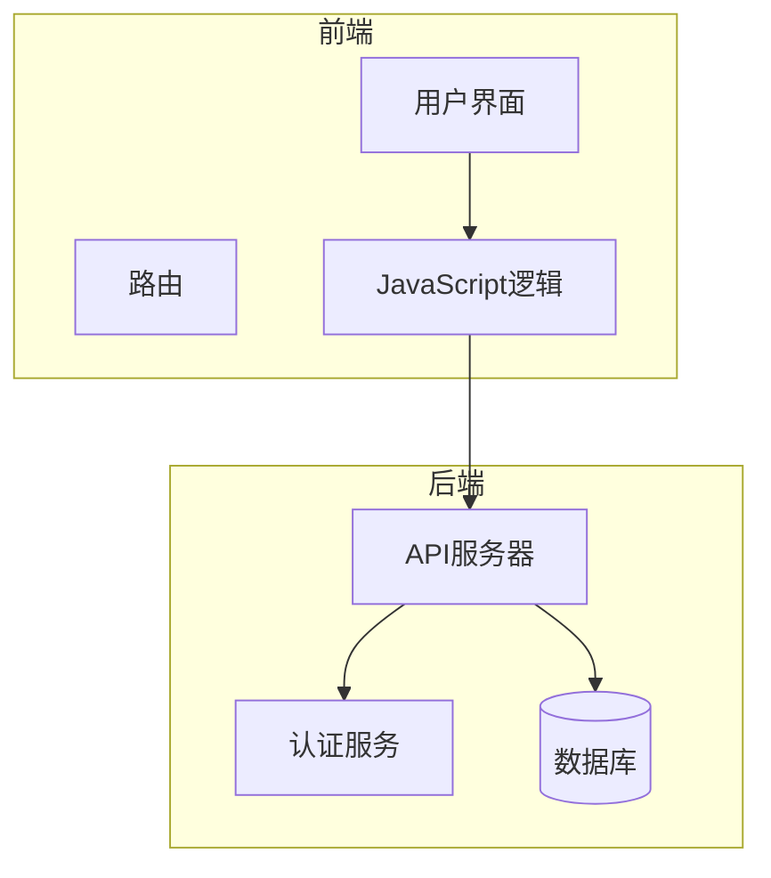
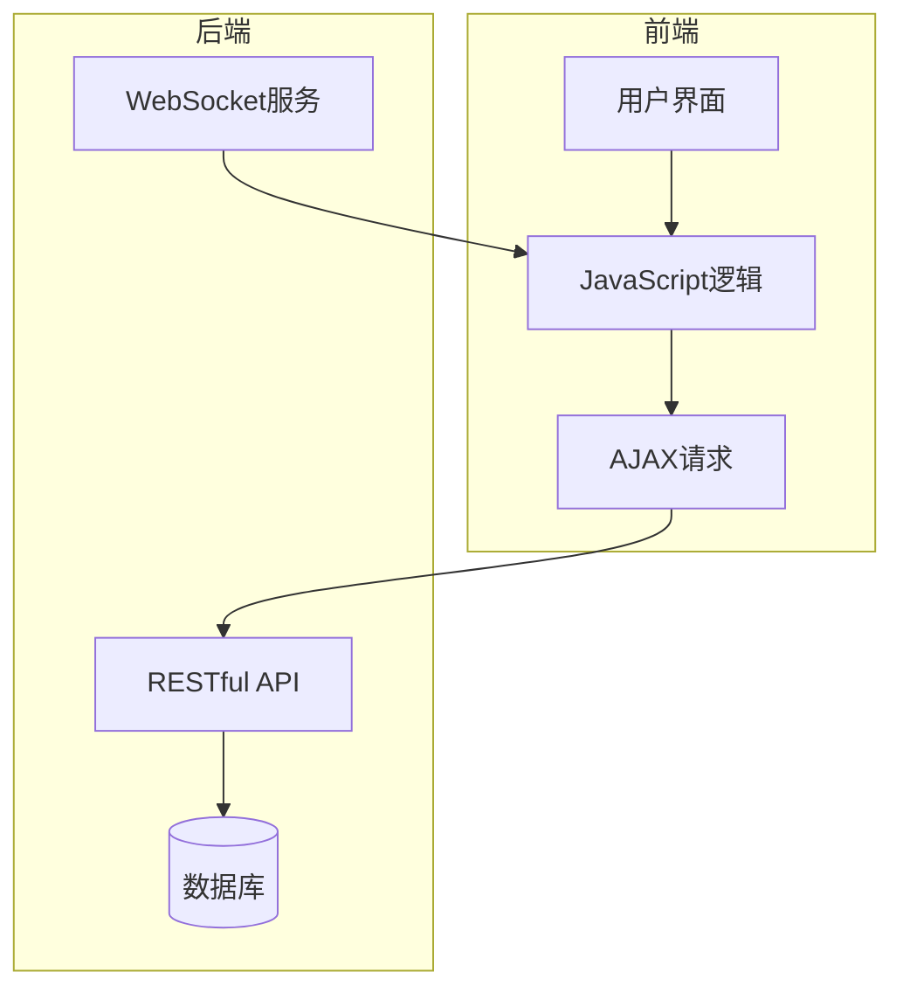
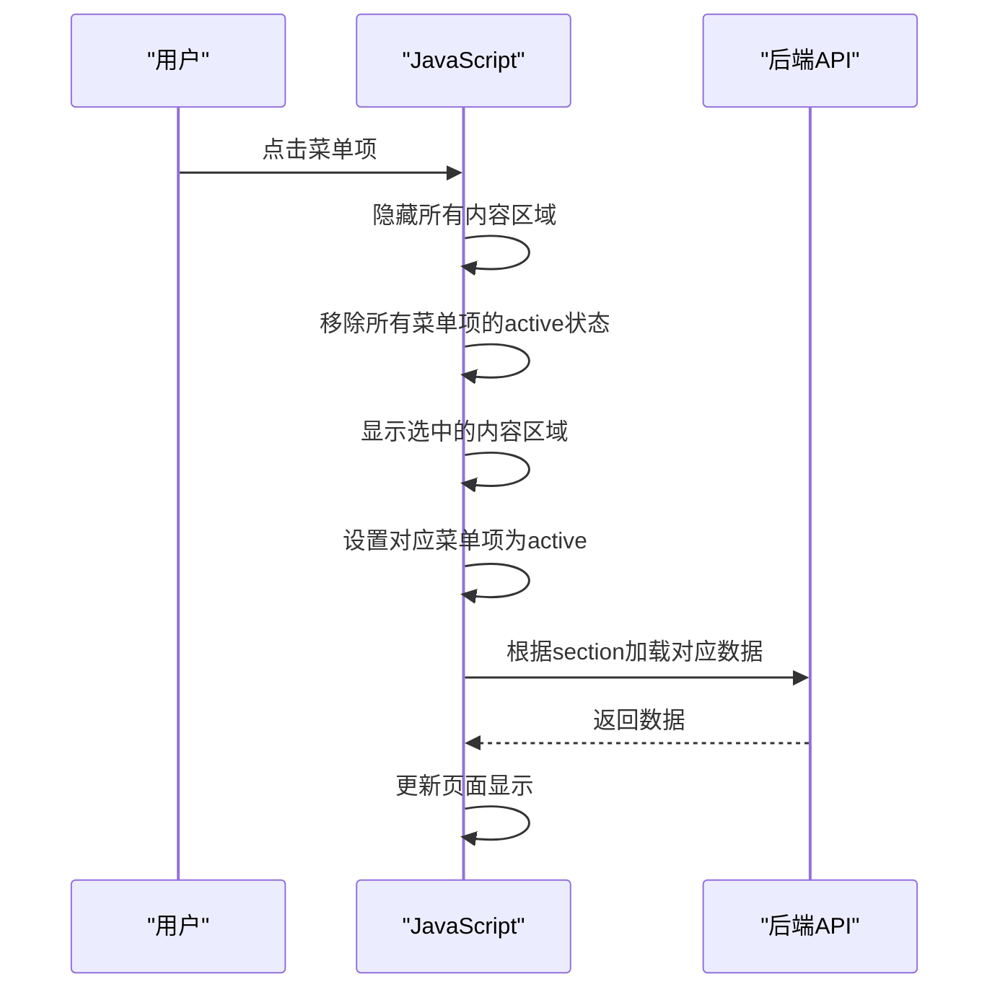
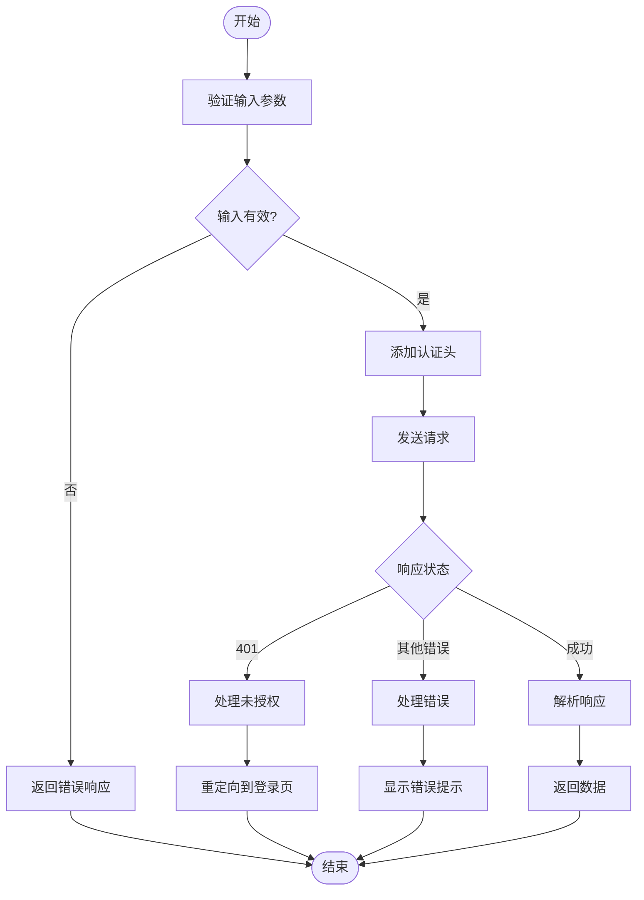
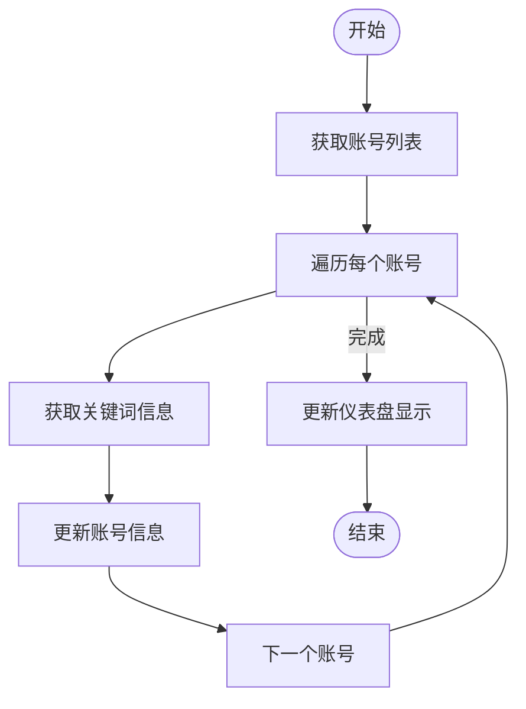
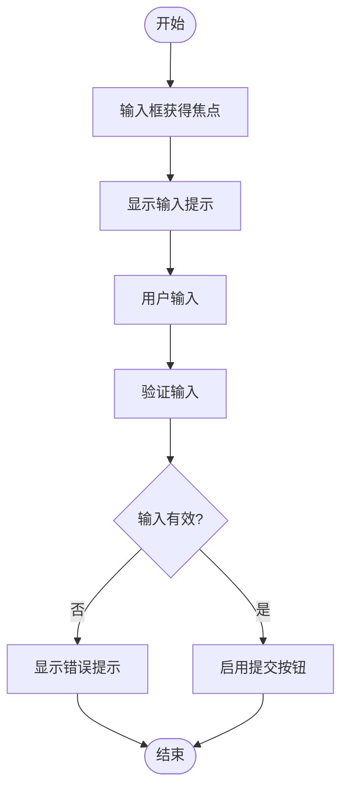
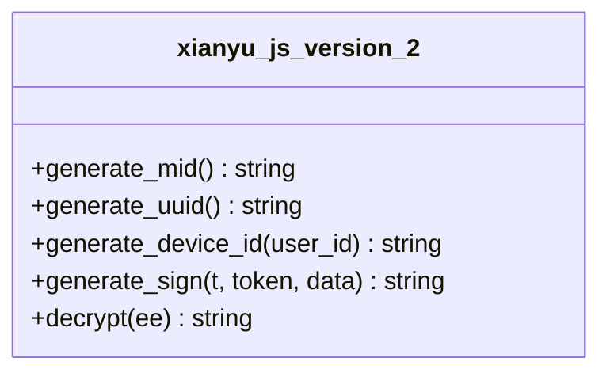
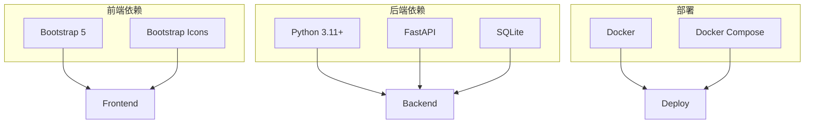

# 前端行为

<cite>
**本文档引用的文件**   
- [app.js](file://static/js/app.js)
- [xianyu_js_version_2.js](file://static/xianyu_js_version_2.js)
- [index.html](file://static/index.html)
- [app.css](file://static/css/app.css)
</cite>

## 目录
1. [引言](#引言)
2. [项目结构](#项目结构)
3. [核心组件](#核心组件)
4. [架构概述](#架构概述)
5. [详细组件分析](#详细组件分析)
6. [依赖分析](#依赖分析)
7. [性能考虑](#性能考虑)
8. [故障排除指南](#故障排除指南)
9. [结论](#结论)
10. [附录](#附录) (如有必要)

## 引言
本项目是一个功能完整的闲鱼自动回复和管理系统，采用现代化的技术架构，支持多用户、多账号管理，具备智能回复、自动发货、自动确认发货、商品管理等企业级功能。系统基于Python异步编程，使用FastAPI提供RESTful API，SQLite数据库存储，支持Docker一键部署。前端界面采用Bootstrap 5 + Vanilla JavaScript + 响应式设计，提供了丰富的用户交互功能。

## 项目结构
项目结构清晰，分为核心文件、工具模块、前端界面、Docker部署、Nginx配置、配置文件和数据目录等部分。前端界面主要位于`static/`目录下，包含HTML、CSS、JavaScript文件和相关资源。`static/js/app.js`是前端行为系统的核心文件，负责处理所有客户端交互逻辑。

**Diagram sources**
- [index.html](file://static/index.html#L1-L3719)
- [app.js](file://static/js/app.js#L1-L11826)

## 核心组件

`app.js`文件是前端交互逻辑的核心，实现了菜单导航、页面切换、AJAX请求封装、数据加载与渲染、表单验证和用户交互处理等功能。通过DOM操作动态更新页面内容，实现无刷新数据加载。文件中定义了多个全局变量和函数，用于管理应用状态和处理用户交互。

**Section sources**
- [app.js](file://static/js/app.js#L1-L11826)

## 架构概述

系统采用前后端分离的架构，前端通过RESTful API与后端进行通信。前端使用原生JavaScript构建，不依赖任何框架，通过AJAX请求与后端API交互，实现数据的加载和更新。系统支持WebSocket实时通信，用于实时监控和状态更新。

**Diagram sources**
- [app.js](file://static/js/app.js#L1-L11826)
- [README.md](file://README.md#L1-L1145)

## 详细组件分析

### 菜单导航与页面切换
`app.js`中的`showSection`函数负责处理菜单导航和页面切换。当用户点击侧边栏的菜单项时，该函数会被调用，隐藏所有内容区域，移除所有菜单项的active状态，然后显示选中的内容区域，并设置对应菜单项为active。同时，根据不同的section加载对应的数据。

**Diagram sources**
- [app.js](file://static/js/app.js#L39-L145)

### AJAX请求封装
`app.js`中封装了AJAX请求，通过`fetchJSON`函数统一处理API请求。该函数添加了认证头，处理了未授权、HTTP错误等情况，并提供了错误处理和加载动画的显示与隐藏。

**Diagram sources**
- [app.js](file://static/js/app.js#L1108-L1149)

### 数据加载与渲染
系统通过AJAX请求从后端API获取数据，然后使用JavaScript动态更新DOM，实现数据的加载与渲染。例如，在加载仪表盘数据时，会先获取账号列表，然后为每个账号获取关键词信息，最后更新仪表盘的显示。

**Diagram sources**
- [app.js](file://static/js/app.js#L157-L241)

### 表单验证与用户交互
系统实现了丰富的表单验证和用户交互功能。例如，在添加关键词时，会验证关键词和回复内容是否为空，并在输入框获得焦点时显示相应的提示。同时，系统还实现了键盘快捷键，如ESC键取消编辑，Enter键切换输入框等。

**Diagram sources**
- [app.js](file://static/js/app.js#L1994-L2054)

### xianyu_js_version_2.js分析
`xianyu_js_version_2.js`文件包含了一些JavaScript工具函数，如生成mid、uuid、device_id和sign等。这些函数可能用于与闲鱼API的交互，确保请求的合法性和安全性。

**Diagram sources**
- [xianyu_js_version_2.js](file://static/xianyu_js_version_2.js#L1-L569)

## 依赖分析

系统前端依赖Bootstrap 5框架和Bootstrap Icons，用于构建响应式界面和显示图标。后端依赖Python 3.11+、FastAPI、SQLite等。系统通过Docker容器化部署，支持一键部署。

**Diagram sources**
- [README.md](file://README.md#L1-L1145)

## 性能考虑

系统通过缓存机制提高性能，如在`app.js`中定义了`accountKeywordCache`和`cacheTimestamp`，用于缓存账号关键词数量，避免频繁请求后端API。同时，系统使用异步编程，确保UI的响应性。

## 故障排除指南

当系统出现问题时，可以检查以下几点：
1. 确认后端服务是否正常运行
2. 检查网络连接是否正常
3. 查看浏览器控制台是否有JavaScript错误
4. 检查API请求是否成功
5. 确认认证token是否有效

**Section sources**
- [app.js](file://static/js/app.js#L1101-L1105)

## 结论
本项目通过原生JavaScript构建了一个功能完整的客户端行为系统，实现了菜单导航、页面切换、AJAX请求封装、数据加载与渲染、表单验证和用户交互处理等功能。系统架构清晰，代码组织良好，具有良好的可维护性和扩展性。

## 附录
无