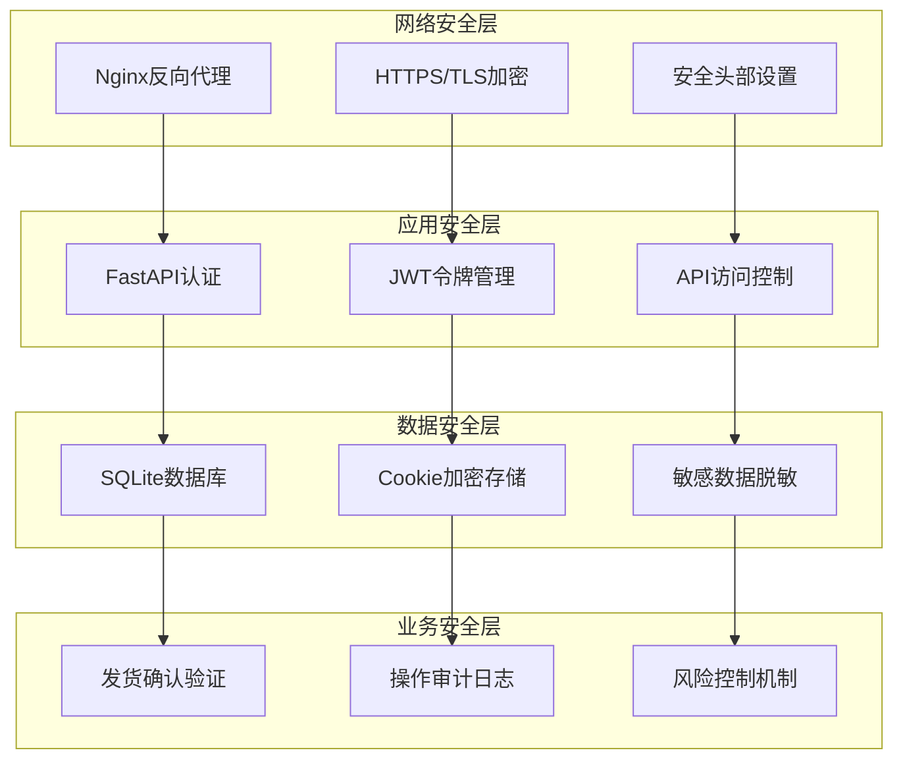
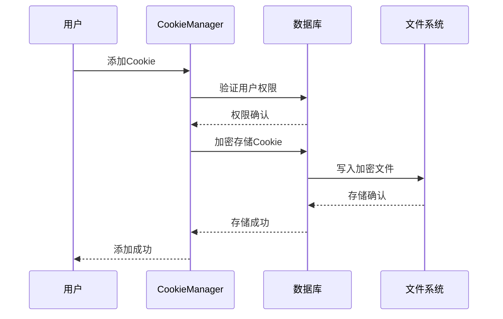
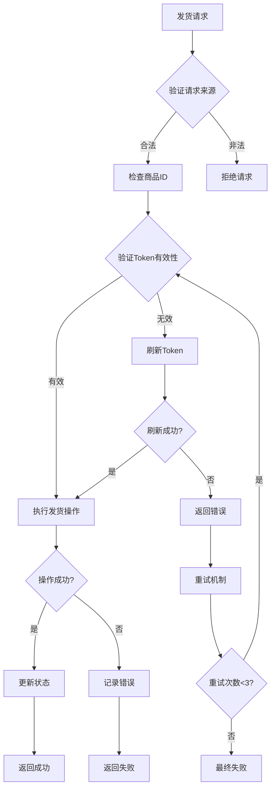
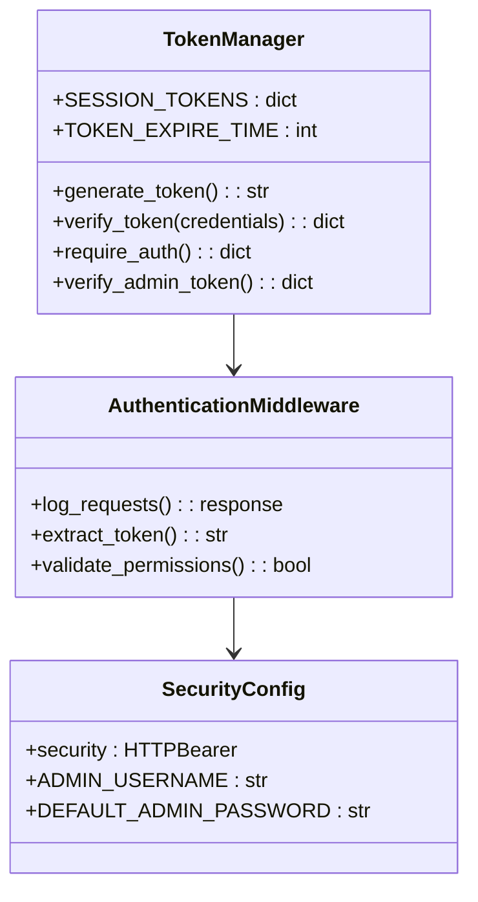
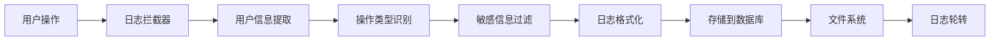
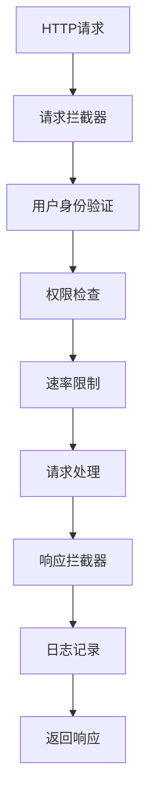
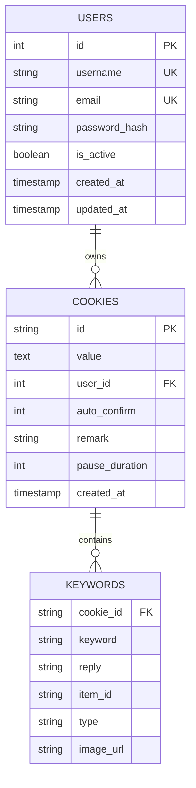

# 安全指南

<cite>
**本文档引用的文件**
- [config.py](file://config.py)
- [cookie_manager.py](file://cookie_manager.py)
- [secure_confirm_decrypted.py](file://secure_confirm_decrypted.py)
- [secure_freeshipping_decrypted.py](file://secure_freeshipping_decrypted.py)
- [usage_statistics.py](file://usage_statistics.py)
- [db_manager.py](file://db_manager.py)
- [global_config.yml](file://global_config.yml)
- [reply_server.py](file://reply_server.py)
- [nginx/nginx.conf](file://nginx/nginx.conf)
- [static/xianyu_js_version_2.js](file://static/xianyu_js_version_2.js)
</cite>

## 目录
1. [简介](#简介)
2. [系统安全架构概述](#系统安全架构概述)
3. [配置安全管理](#配置安全管理)
4. [Cookie安全存储与管理](#cookie安全存储与管理)
5. [发货确认安全验证](#发货确认安全验证)
6. [JWT令牌安全机制](#jwt令牌安全机制)
7. [操作日志审计](#操作日志审计)
8. [API安全防护](#api安全防护)
9. [数据库安全](#数据库安全)
10. [部署安全配置](#部署安全配置)
11. [安全最佳实践](#安全最佳实践)
12. [故障排除指南](#故障排除指南)

## 简介

本安全指南旨在为闲鱼自动回复系统提供全面的安全防护措施，涵盖系统各层面的安全配置、数据保护、访问控制和监控审计。系统采用多层次安全架构，包括配置加密、Cookie管理、API认证、数据库保护等核心安全组件。

## 系统安全架构概述

系统采用分层安全架构，包含以下核心安全组件：



**图表来源**
- [nginx/nginx.conf](file://nginx/nginx.conf#L48-L87)
- [reply_server.py](file://reply_server.py#L308-L358)

## 配置安全管理

### 敏感配置项保护

系统配置文件包含多个敏感配置项，必须采取适当的保护措施：

| 配置项 | 类型 | 安全级别 | 保护措施 |
|--------|------|----------|----------|
| JWT密钥 | 文本 | 高 | 环境变量存储 |
| 数据库密码 | 文本 | 高 | 加密存储 |
| API密钥 | 文本 | 高 | 环境变量 |
| SMTP凭据 | 文本 | 中 | 加密存储 |
| 管理员密码 | 哈希 | 高 | SHA256哈希 |

### 环境变量配置

推荐使用环境变量替代明文配置，避免敏感信息泄露：

```yaml
# 推荐的环境变量配置示例
DB_PATH=/data/xianyu_data.db
ADMIN_PASSWORD=admin123
SMTP_PASSWORD=your_secure_password
JWT_SECRET_KEY=your_random_jwt_secret
```

**章节来源**
- [config.py](file://config.py#L1-L126)
- [global_config.yml](file://global_config.yml#L1-L77)

## Cookie安全存储与管理

### Cookie存储机制

系统采用安全的Cookie存储和管理机制，确保用户凭据的安全性：



**图表来源**
- [cookie_manager.py](file://cookie_manager.py#L184-L202)
- [db_manager.py](file://db_manager.py#L1-L800)

### Cookie管理安全特性

1. **用户隔离**：每个Cookie与特定用户绑定，防止跨用户访问
2. **加密存储**：敏感信息在数据库中加密存储
3. **权限控制**：只有Cookie所属用户才能操作
4. **实时同步**：内存与数据库状态实时同步

### Cookie生命周期管理

系统提供完整的Cookie生命周期管理，包括：

- **添加验证**：检查Cookie格式和有效性
- **权限验证**：确保用户对Cookie的操作权限
- **状态监控**：实时监控Cookie运行状态
- **异常处理**：自动处理Cookie失效和重连

**章节来源**
- [cookie_manager.py](file://cookie_manager.py#L1-L428)

## 发货确认安全验证

### 安全验证流程

系统实现了双重安全验证机制，防止误操作和恶意调用：



**图表来源**
- [secure_confirm_decrypted.py](file://secure_confirm_decrypted.py#L87-L181)
- [secure_freeshipping_decrypted.py](file://secure_freeshipping_decrypted.py#L38-L131)

### 防误操作机制

1. **商品ID验证**：确保使用真实的商品ID进行操作
2. **Token刷新**：自动处理Token过期情况
3. **重试机制**：最多3次重试机会
4. **状态确认**：操作完成后确认执行结果

### 防恶意调用

系统实施多层防护措施：

- **请求频率限制**：防止高频攻击
- **来源验证**：检查请求来源合法性
- **参数校验**：严格验证输入参数
- **操作审计**：记录所有操作行为

**章节来源**
- [secure_confirm_decrypted.py](file://secure_confirm_decrypted.py#L1-L181)
- [secure_freeshipping_decrypted.py](file://secure_freeshipping_decrypted.py#L1-L131)

## JWT令牌安全机制

### 令牌生成与管理

系统采用基于FastAPI的JWT认证机制，提供安全的用户身份验证：



**图表来源**
- [reply_server.py](file://reply_server.py#L178-L200)

### 令牌安全特性

1. **随机生成**：使用secrets模块生成强随机令牌
2. **过期机制**：24小时自动过期
3. **权限分离**：普通用户和管理员权限区分
4. **实时验证**：每次请求都验证令牌有效性

### 令牌刷新策略

系统实现智能令牌刷新机制：

- **自动刷新**：接近过期时自动刷新
- **安全注销**：主动登出时立即清除令牌
- **并发安全**：线程安全的令牌存储
- **内存管理**：定期清理过期令牌

**章节来源**
- [reply_server.py](file://reply_server.py#L1-L200)

## 操作日志审计

### 日志记录机制

系统提供全面的操作审计功能，记录所有关键操作：



**图表来源**
- [usage_statistics.py](file://usage_statistics.py#L1-L178)
- [reply_server.py](file://reply_server.py#L331-L358)

### 审计功能特性

1. **用户追踪**：记录操作用户和时间戳
2. **操作分类**：区分不同类型的系统操作
3. **敏感信息保护**：自动过滤敏感数据
4. **实时监控**：支持实时日志查看

### 日志数据分析

系统提供多种日志分析功能：

- **用户行为分析**：统计用户操作模式
- **异常检测**：识别可疑操作行为
- **性能监控**：跟踪系统性能指标
- **合规审计**：满足审计合规要求

**章节来源**
- [usage_statistics.py](file://usage_statistics.py#L1-L178)

## API安全防护

### 认证与授权

系统实现严格的API访问控制：

| 接口类型 | 认证要求 | 权限级别 | 访问范围 |
|----------|----------|----------|----------|
| 用户认证 | Bearer Token | 无限制 | 公开 |
| 用户管理 | 管理员权限 | 管理员 | 系统级 |
| Cookie操作 | 用户权限 | 用户 | 账户级 |
| 系统设置 | 管理员权限 | 管理员 | 全局 |

### 安全中间件

系统内置多层安全中间件：



**图表来源**
- [reply_server.py](file://reply_server.py#L331-L358)

### 输入验证与防护

系统实施全面的输入验证：

1. **参数验证**：严格验证API输入参数
2. **SQL注入防护**：使用参数化查询
3. **XSS防护**：输出编码处理
4. **CSRF防护**：令牌验证机制

**章节来源**
- [reply_server.py](file://reply_server.py#L200-L400)

## 数据库安全

### 数据库设计安全

系统采用安全的数据库设计原则：



**图表来源**
- [db_manager.py](file://db_manager.py#L70-L200)

### 数据保护措施

1. **用户数据隔离**：每个用户数据独立存储
2. **敏感信息加密**：密码使用SHA256哈希
3. **访问权限控制**：基于用户ID的访问控制
4. **数据备份保护**：加密备份文件

### 数据完整性保障

- **外键约束**：确保数据关联完整性
- **事务处理**：保证操作原子性
- **数据验证**：输入数据严格验证
- **备份恢复**：定期备份和恢复测试

**章节来源**
- [db_manager.py](file://db_manager.py#L1-L800)

## 部署安全配置

### Nginx安全配置

系统采用强化的Nginx安全配置：

```nginx
# 安全头部配置
add_header X-Frame-Options "SAMEORIGIN" always;
add_header X-XSS-Protection "1; mode=block" always;
add_header X-Content-Type-Options "nosniff" always;
add_header Referrer-Policy "no-referrer-when-downgrade" always;
add_header Content-Security-Policy "default-src 'self' http: https: data: blob: 'unsafe-inline'" always;

# HTTPS配置
ssl_certificate /etc/ssl/certs/your-cert.crt;
ssl_certificate_key /etc/ssl/private/your-key.key;
ssl_protocols TLSv1.2 TLSv1.3;
ssl_ciphers HIGH:!aNULL:!MD5;
```

### 网络安全

1. **HTTPS强制**：所有通信使用HTTPS加密
2. **端口限制**：仅开放必要端口
3. **防火墙配置**：限制外部访问
4. **DDoS防护**：流量限制和防护

**章节来源**
- [nginx/nginx.conf](file://nginx/nginx.conf#L48-L87)

## 安全最佳实践

### 密钥管理

1. **定期轮换**：定期更换JWT密钥和数据库密码
2. **强密码策略**：使用复杂密码组合
3. **密钥存储**：使用环境变量或密钥管理服务
4. **访问控制**：限制密钥访问权限

### 系统维护

1. **定期更新**：及时更新系统和依赖包
2. **漏洞扫描**：定期进行安全漏洞扫描
3. **备份策略**：建立完善的备份和恢复机制
4. **监控告警**：设置安全事件监控和告警

### 用户管理

1. **最小权限原则**：用户仅获得必要权限
2. **定期审查**：定期审查用户权限
3. **账户锁定**：失败登录尝试后锁定账户
4. **会话管理**：合理设置会话超时时间

### 应急响应

1. **事件响应计划**：制定安全事件响应流程
2. **数据泄露应对**：快速识别和应对数据泄露
3. **系统恢复**：建立快速系统恢复机制
4. **事后分析**：进行安全事件事后分析

## 故障排除指南

### 常见安全问题

| 问题类型 | 症状 | 可能原因 | 解决方案 |
|----------|------|----------|----------|
| 认证失败 | 401错误 | 令牌过期或无效 | 重新登录获取新令牌 |
| 权限拒绝 | 403错误 | 用户权限不足 | 检查用户角色和权限 |
| 数据库连接 | 连接失败 | 数据库文件损坏 | 检查数据库文件完整性 |
| Cookie失效 | 操作失败 | Cookie过期或无效 | 重新添加有效Cookie |

### 安全诊断工具

1. **日志分析**：查看系统日志定位问题
2. **网络抓包**：分析网络通信安全性
3. **权限检查**：验证用户权限设置
4. **配置验证**：检查配置文件正确性

### 性能优化

1. **缓存策略**：合理使用缓存提高性能
2. **连接池**：使用数据库连接池
3. **异步处理**：采用异步处理提升效率
4. **资源监控**：监控系统资源使用情况

**章节来源**
- [reply_server.py](file://reply_server.py#L365-L400)

## 结论

本安全指南提供了闲鱼自动回复系统的全面安全防护方案。通过实施配置加密、Cookie安全存储、API认证、数据库保护等多层次安全措施，系统能够有效防范各种安全威胁。建议定期审查和更新安全配置，保持系统安全防护的有效性。

安全是一个持续的过程，需要不断监控、评估和改进。建议建立完善的安全管理体系，定期进行安全培训和演练，确保系统始终处于安全状态。