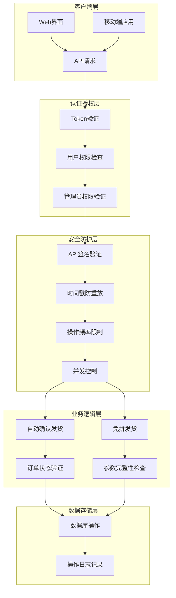
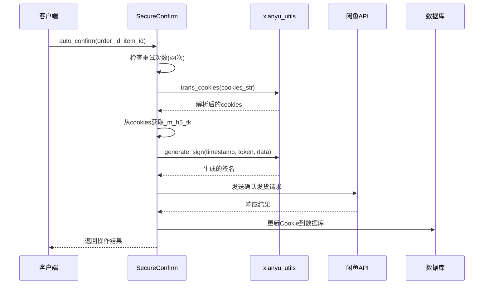
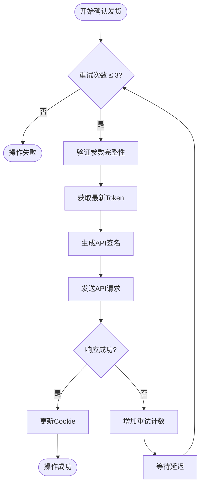
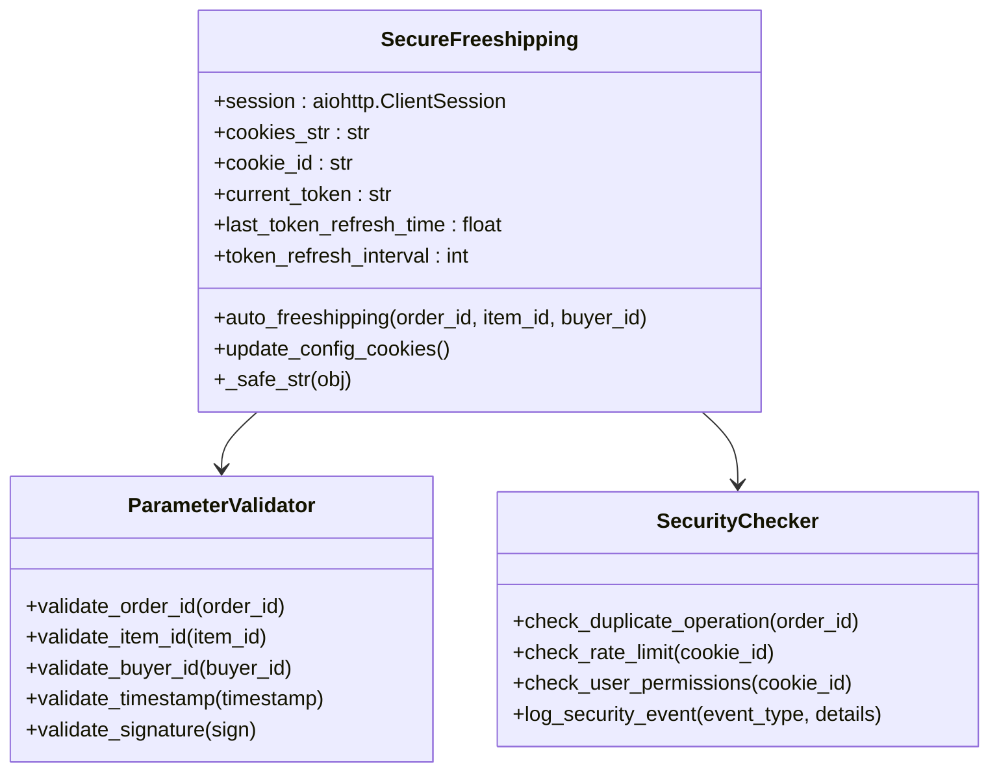
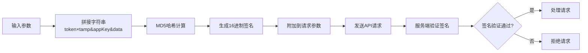
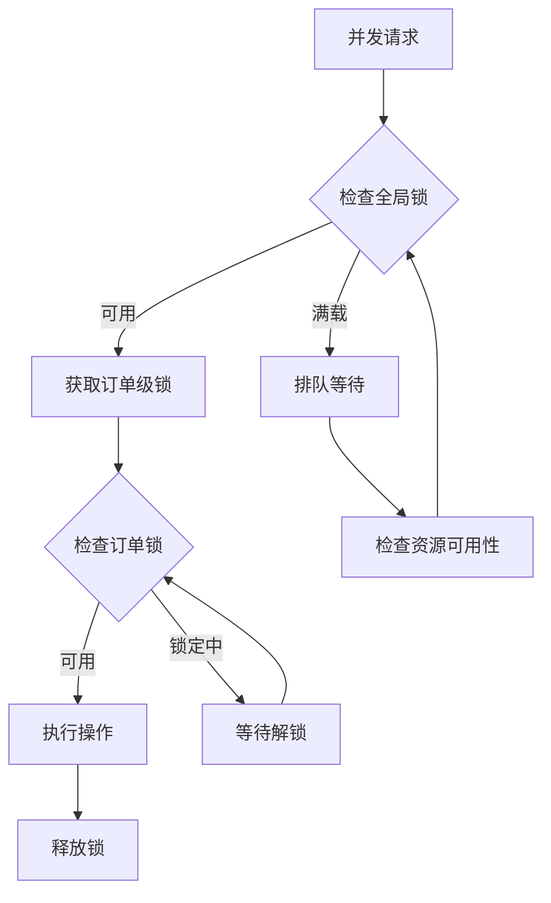
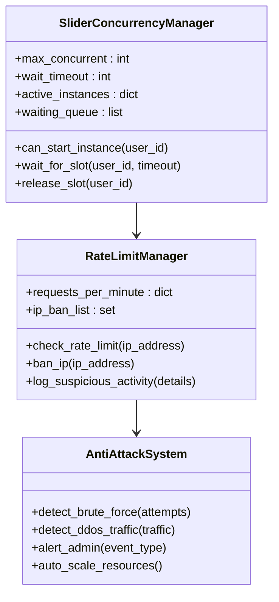
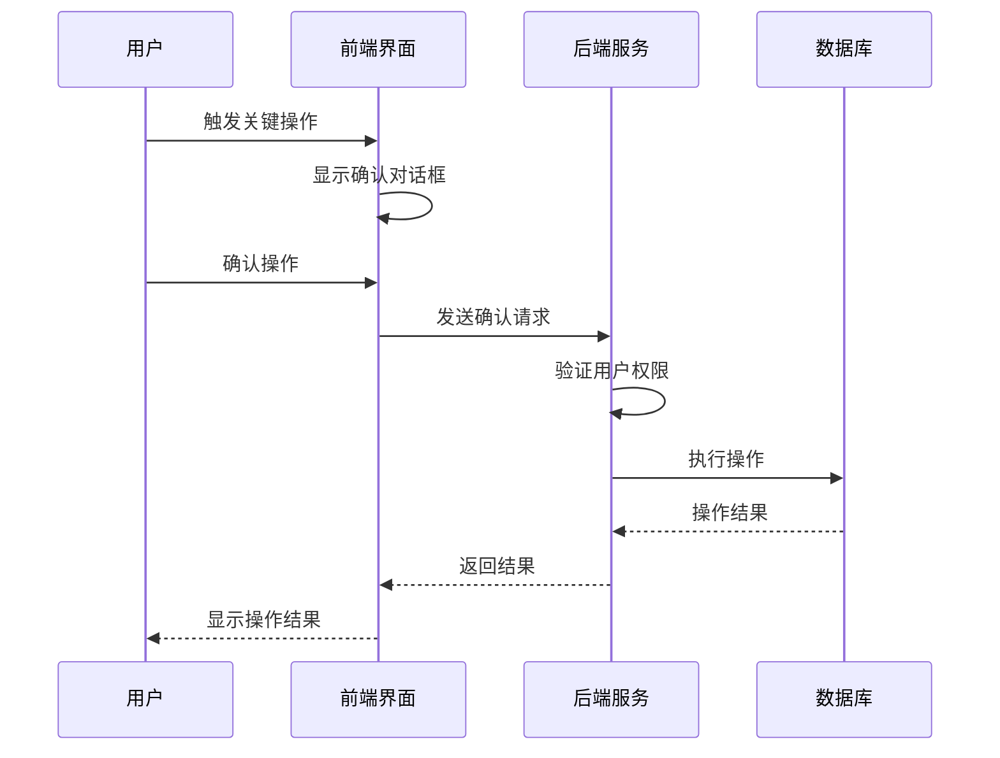
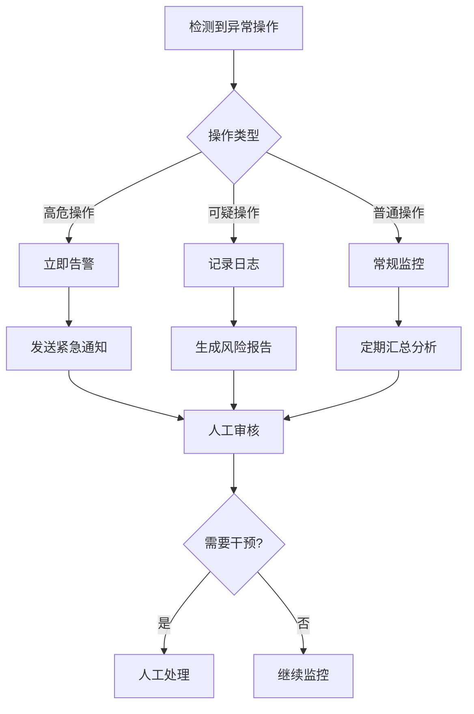
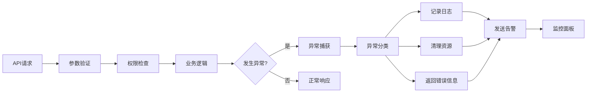

# 操作安全

<cite>
**本文档中引用的文件**
- [secure_confirm_decrypted.py](file://secure_confirm_decrypted.py)
- [secure_freeshipping_decrypted.py](file://secure_freeshipping_decrypted.py)
- [XianyuAutoAsync.py](file://XianyuAutoAsync.py)
- [config.py](file://config.py)
- [utils/xianyu_utils.py](file://utils/xianyu_utils.py)
- [db_manager.py](file://db_manager.py)
- [reply_server.py](file://reply_server.py)
- [api_captcha_remote.py](file://api_captcha_remote.py)
- [utils/xianyu_slider_stealth.py](file://utils/xianyu_slider_stealth.py)
- [static/js/app.js](file://static/js/app.js)
</cite>

## 目录
1. [概述](#概述)
2. [安全架构总览](#安全架构总览)
3. [自动确认发货安全机制](#自动确认发货安全机制)
4. [免拼发货安全验证](#免拼发货安全验证)
5. [API签名与防重放机制](#api签名与防重放机制)
6. [操作安全防护体系](#操作安全防护体系)
7. [防攻击与限流机制](#防攻击与限流机制)
8. [安全最佳实践](#安全最佳实践)
9. [异常处理与监控](#异常处理与监控)
10. [总结](#总结)

## 概述

本系统构建了一套完整的操作安全防护体系，重点针对自动发货和免拼发货场景设计了多重安全验证机制。通过Token签名验证、时间戳防重放、操作确认、防重复执行等技术手段，确保自动化操作的安全性和可靠性。

系统采用分层安全架构，从API层面到业务逻辑层面都设置了相应的安全防护措施，有效防止恶意调用、自动化攻击和误操作风险。

## 安全架构总览

**图表来源**
- [reply_server.py](file://reply_server.py#L188-L212)
- [XianyuAutoAsync.py](file://XianyuAutoAsync.py#L158-L180)

## 自动确认发货安全机制

### 多重Token验证体系

系统在自动确认发货过程中实施了严格的Token验证机制：

**图表来源**
- [secure_confirm_decrypted.py](file://secure_confirm_decrypted.py#L87-L181)

### 订单状态验证机制

系统实现了严格的订单状态验证流程：

| 验证项目 | 检查内容 | 安全级别 |
|---------|---------|---------|
| 订单存在性 | 验证订单ID有效性 | 高 |
| 订单状态 | 检查订单是否处于可确认状态 | 高 |
| 商品所有权 | 验证卖家是否拥有对应商品 | 高 |
| 时间窗口 | 检查操作是否在允许的时间范围内 | 中 |
| 防重复 | 防止对同一订单重复确认 | 高 |

### 重试策略与防刷机制

**图表来源**
- [secure_confirm_decrypted.py](file://secure_confirm_decrypted.py#L87-L181)

**章节来源**
- [secure_confirm_decrypted.py](file://secure_confirm_decrypted.py#L87-L181)

## 免拼发货安全验证

### 参数完整性校验

免拼发货功能实现了严格的参数校验机制：

**图表来源**
- [secure_freeshipping_decrypted.py](file://secure_freeshipping_decrypted.py#L7-L131)

### 防误操作设计

系统通过以下机制防止误操作：

1. **参数预验证**：在发送请求前验证所有必要参数
2. **操作确认**：对于关键操作提供二次确认机制
3. **操作范围限制**：限制操作只能针对特定账号的商品
4. **时间窗口控制**：防止在不适当的时间进行操作

**章节来源**
- [secure_freeshipping_decrypted.py](file://secure_freeshipping_decrypted.py#L38-L131)

## API签名与防重放机制

### 签名算法实现

系统采用MD5签名算法确保API请求的完整性和真实性：

**图表来源**
- [utils/xianyu_utils.py](file://utils/xianyu_utils.py#L110-L118)

### 时间戳防重放机制

| 组件 | 验证内容 | 防护效果 |
|------|---------|---------|
| 请求时间戳 | 验证请求时间与服务器时间差 | 防止重放攻击 |
| Token有效期 | 检查Token是否过期 | 防止使用过期凭证 |
| 请求间隔 | 控制请求频率 | 防止暴力破解 |
| IP白名单 | 限制访问来源IP | 增强访问控制 |

**章节来源**
- [utils/xianyu_utils.py](file://utils/xianyu_utils.py#L110-L118)

## 操作安全防护体系

### 并发控制机制

系统实现了多层次的并发控制：

**图表来源**
- [XianyuAutoAsync.py](file://XianyuAutoAsync.py#L158-L180)

### 操作频率限制

系统通过多种机制控制操作频率：

1. **订单确认冷却**：10分钟内不重复确认同一订单
2. **发货冷却**：10分钟内不重复发货同一商品
3. **API调用限制**：限制单位时间内API调用次数
4. **用户级别限制**：不同用户享有不同的操作频率限制

**章节来源**
- [XianyuAutoAsync.py](file://XianyuAutoAsync.py#L675-L682)

## 防攻击与限流机制

### 滑块验证并发管理

系统实现了智能的滑块验证并发控制：

**图表来源**
- [utils/xianyu_slider_stealth.py](file://utils/xianyu_slider_stealth.py#L34-L67)

### IP黑名单机制

系统具备自动识别和处理恶意IP的能力：

| 功能 | 实现方式 | 效果 |
|------|---------|------|
| 异常检测 | 监控异常请求模式 | 及时发现攻击行为 |
| 自动封禁 | 达到阈值自动封禁IP | 防止持续攻击 |
| 动态调整 | 根据威胁级别调整策略 | 平衡安全性和可用性 |
| 人工审核 | 支持人工解除封禁 | 避免误伤正常用户 |

**章节来源**
- [utils/xianyu_slider_stealth.py](file://utils/xianyu_slider_stealth.py#L34-L67)

## 安全最佳实践

### 操作前二次确认

系统在关键操作前实施二次确认机制：

### 关键操作日志记录

系统对所有关键操作进行详细日志记录：

| 日志级别 | 记录内容 | 用途 |
|---------|---------|------|
| DEBUG | 详细的操作步骤和参数 | 开发调试 |
| INFO | 操作执行结果和时间戳 | 正常监控 |
| WARNING | 异常操作和警告信息 | 风险监控 |
| ERROR | 操作失败和错误详情 | 故障排查 |
| CRITICAL | 安全事件和重大异常 | 应急响应 |

### 异常操作告警

系统建立了完善的异常操作告警机制：

**章节来源**
- [XianyuAutoAsync.py](file://XianyuAutoAsync.py#L107-L135)

## 异常处理与监控

### 完整的异常处理链路

系统实现了多层次的异常处理机制：

### 实时监控指标

系统监控以下关键指标：

| 指标类别 | 监控项目 | 阈值设置 | 告警级别 |
|---------|---------|---------|---------|
| 性能指标 | API响应时间 | >2秒 | 警告 |
| 错误指标 | 错误率 | >5% | 警告 |
| 安全指标 | 异常操作次数 | >10次/分钟 | 严重 |
| 资源指标 | CPU使用率 | >80% | 警告 |

**章节来源**
- [reply_server.py](file://reply_server.py#L331-L357)

## 总结

本系统构建了全面的操作安全防护体系，通过以下核心机制确保安全性：

1. **多重身份验证**：Token验证、用户权限检查、管理员权限验证
2. **API安全保护**：签名验证、时间戳防重放、参数完整性检查
3. **操作安全控制**：防重复执行、操作频率限制、二次确认机制
4. **攻击防护**：并发控制、速率限制、IP黑名单、滑块验证
5. **监控告警**：实时监控、异常检测、自动告警、人工审核

这套安全体系有效防范了恶意调用、自动化攻击和误操作风险，为自动化发货业务提供了可靠的安全保障。通过持续的安全监控和机制优化，系统能够适应不断变化的安全威胁环境。