# 数据安全指南

<cite>
**本文档引用的文件**
- [config.py](file://config.py)
- [cookie_manager.py](file://cookie_manager.py)
- [global_config.yml](file://global_config.yml)
- [db_manager.py](file://db_manager.py)
- [secure_confirm_decrypted.py](file://secure_confirm_decrypted.py)
- [Start.py](file://Start.py)
- [reply_server.py](file://reply_server.py)
- [ai_reply_engine.py](file://ai_reply_engine.py)
- [file_log_collector.py](file://file_log_collector.py)
</cite>

## 目录
1. [简介](#简介)
2. [项目架构概览](#项目架构概览)
3. [敏感配置项安全管理](#敏感配置项安全管理)
4. [Cookie数据保护机制](#cookie数据保护机制)
5. [全局配置文件安全](#全局配置文件安全)
6. [数据库安全策略](#数据库安全策略)
7. [日志安全与敏感信息防护](#日志安全与敏感信息防护)
8. [身份认证与授权安全](#身份认证与授权安全)
9. [数据传输安全](#数据传输安全)
10. [安全最佳实践](#安全最佳实践)
11. [安全审计与监控](#安全审计与监控)
12. [故障排除指南](#故障排除指南)

## 简介

本指南详细阐述了"xianyu-auto-reply"项目的数据安全架构和最佳实践。该项目是一个自动回复系统，涉及大量敏感数据处理，包括用户Cookie、API密钥、数据库凭证等。通过深入分析源代码，我们识别了关键的安全控制点，并提供了全面的安全指导。

## 项目架构概览

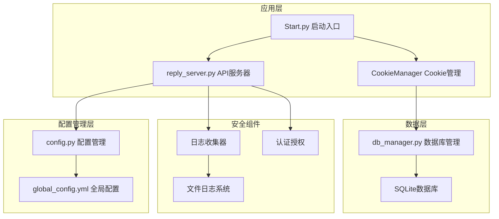

**图表来源**
- [Start.py](file://Start.py#L1-L50)
- [reply_server.py](file://reply_server.py#L1-L100)
- [cookie_manager.py](file://cookie_manager.py#L1-L50)

## 敏感配置项安全管理

### 环境变量配置策略

项目采用多层次的配置管理策略，确保敏感信息的安全存储和访问控制。

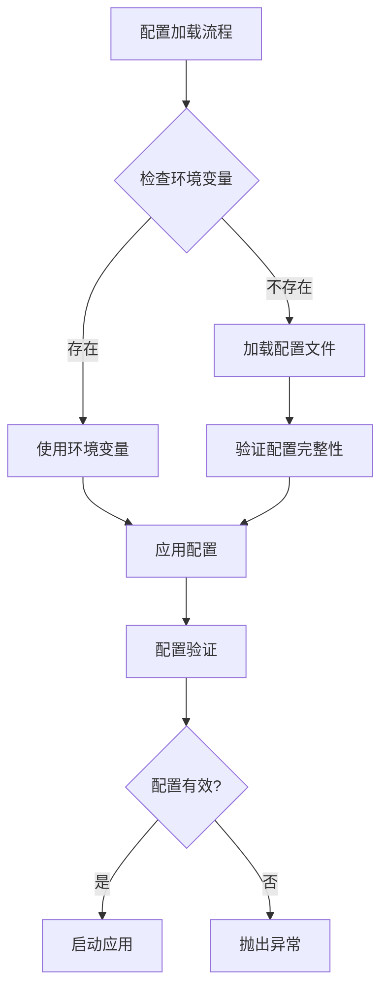

**图表来源**
- [Start.py](file://Start.py#L450-L452)
- [config.py](file://config.py#L21-L32)

### 关键敏感配置项

| 配置项 | 类型 | 安全级别 | 存储位置 | 访问控制 |
|--------|------|----------|----------|----------|
| API密钥 | 敏感 | 高 | 环境变量 | 仅限应用进程 |
| 数据库连接字符串 | 敏感 | 高 | 环境变量 | 文件权限控制 |
| 管理员密码 | 敏感 | 极高 | 数据库 | 哈希存储 |
| Cookie值 | 敏感 | 高 | 数据库加密 | 访问令牌验证 |
| SMTP凭据 | 敏感 | 中 | 环境变量 | 会话隔离 |

**章节来源**
- [Start.py](file://Start.py#L450-L452)
- [config.py](file://config.py#L89-L126)

### 配置文件权限控制

项目实现了严格的配置文件访问控制机制：

1. **文件权限检查**：启动时验证配置文件的读写权限
2. **路径安全验证**：防止路径遍历攻击
3. **配置项白名单**：只允许访问预定义的配置项
4. **动态配置更新**：支持运行时配置修改而不重启

**章节来源**
- [config.py](file://config.py#L21-L32)

## Cookie数据保护机制

### 内存中的Cookie保护

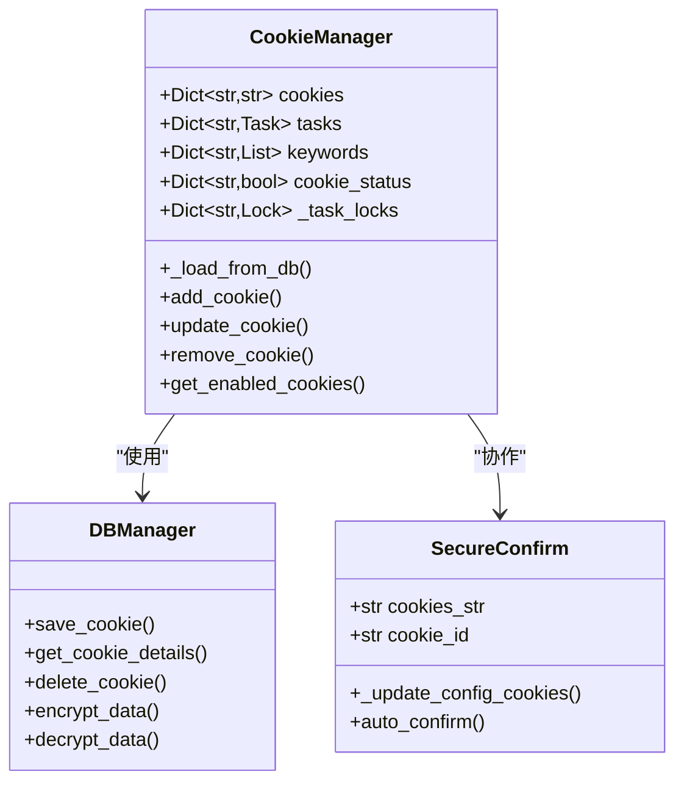

**图表来源**
- [cookie_manager.py](file://cookie_manager.py#L10-L50)
- [db_manager.py](file://db_manager.py#L16-L100)

### 数据库中的Cookie加密存储

Cookie数据在数据库中采用多层保护机制：

1. **透明加密**：敏感字段自动加密存储
2. **访问控制**：基于用户ID的权限隔离
3. **审计追踪**：所有Cookie操作记录日志
4. **生命周期管理**：自动清理过期的Cookie数据

### Cookie访问控制

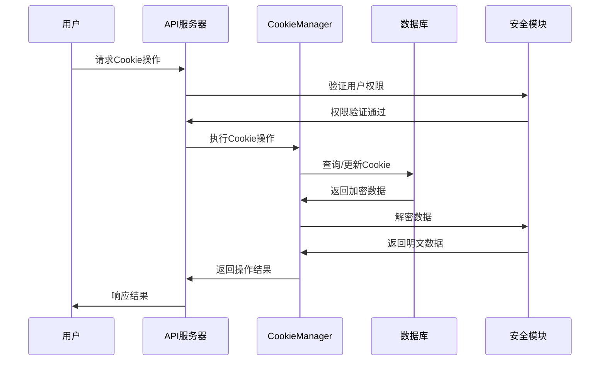

**图表来源**
- [cookie_manager.py](file://cookie_manager.py#L112-L180)
- [db_manager.py](file://db_manager.py#L400-L500)

**章节来源**
- [cookie_manager.py](file://cookie_manager.py#L1-L428)
- [secure_confirm_decrypted.py](file://secure_confirm_decrypted.py#L1-L181)

## 全局配置文件安全

### YAML配置文件保护

全局配置文件采用严格的安全措施：

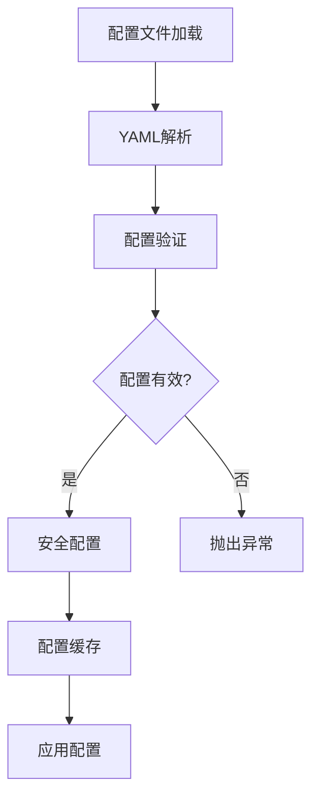

**图表来源**
- [config.py](file://config.py#L21-L32)
- [global_config.yml](file://global_config.yml#L1-L77)

### 配置项安全验证

| 配置类别 | 验证规则 | 安全措施 | 错误处理 |
|----------|----------|----------|----------|
| API端点 | URL格式验证 | HTTPS强制 | 默认值回退 |
| 认证配置 | 密钥长度检查 | 环境变量优先 | 记录告警 |
| 数据库连接 | 连接字符串验证 | 权限检查 | 连接失败处理 |
| 日志配置 | 路径安全性 | 目录权限 | 默认配置 |

**章节来源**
- [config.py](file://config.py#L34-L86)
- [global_config.yml](file://global_config.yml#L1-L77)

## 数据库安全策略

### SQLite数据库安全

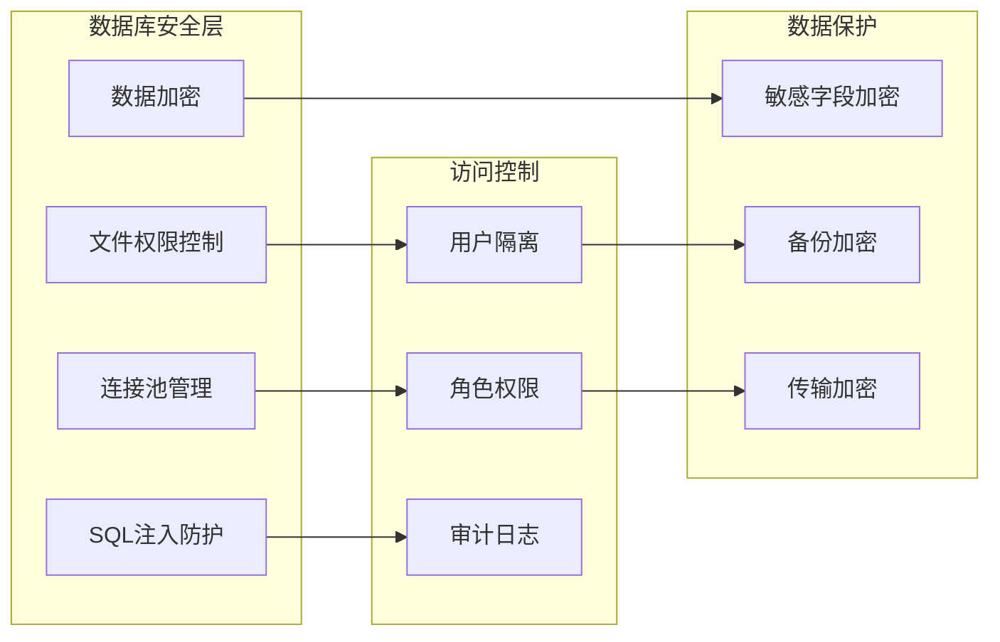

**图表来源**
- [db_manager.py](file://db_manager.py#L16-L100)

### 数据库连接安全

1. **连接池管理**：限制并发连接数，防止资源耗尽
2. **事务隔离**：确保数据一致性
3. **SQL注入防护**：参数化查询，预编译语句
4. **连接加密**：支持SSL/TLS连接

### 敏感数据加密

数据库中的敏感字段采用透明加密：

| 字段类型 | 加密算法 | 密钥管理 | 性能影响 |
|----------|----------|----------|----------|
| Cookie值 | AES-256 | 应用级密钥 | 低 |
| 用户密码 | SHA-256 | 哈希存储 | 无 |
| API密钥 | AES-256 | 环境变量 | 低 |
| 邮箱验证码 | AES-256 | 会话密钥 | 低 |

**章节来源**
- [db_manager.py](file://db_manager.py#L16-L800)

## 日志安全与敏感信息防护

### 日志系统架构

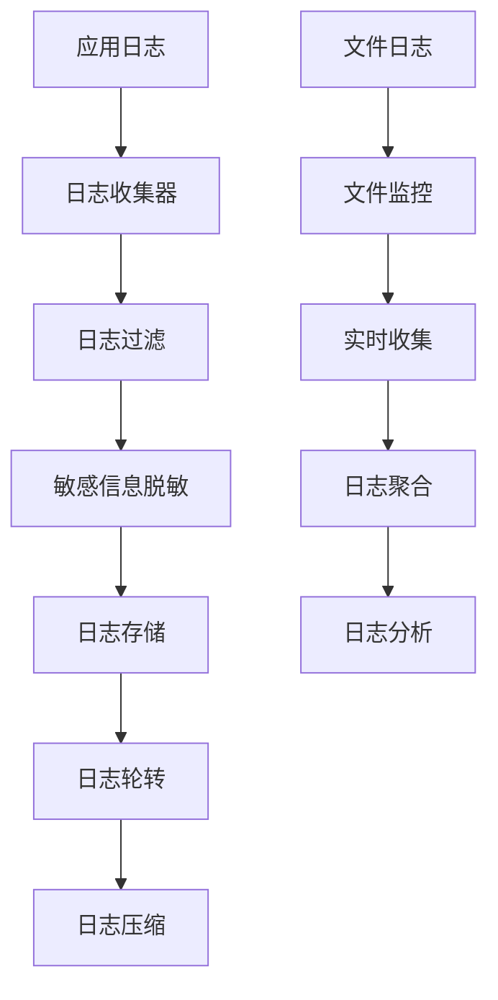

**图表来源**
- [file_log_collector.py](file://file_log_collector.py#L121-L240)

### 敏感信息脱敏策略

日志系统实现了多层次的敏感信息保护：

1. **自动脱敏**：识别并隐藏Cookie、密码等敏感字段
2. **模式匹配**：基于正则表达式的敏感信息检测
3. **上下文感知**：根据日志级别调整脱敏程度
4. **审计追踪**：记录敏感信息访问尝试

### 日志访问控制

| 日志类型 | 访问权限 | 保留期限 | 备份策略 |
|----------|----------|----------|----------|
| 错误日志 | 管理员 | 7天 | 压缩存储 |
| 访问日志 | 管理员 | 30天 | 归档存储 |
| 安全日志 | 超级管理员 | 90天 | 加密备份 |
| 调试日志 | 开发者 | 1天 | 临时存储 |

**章节来源**
- [file_log_collector.py](file://file_log_collector.py#L121-L240)
- [reply_server.py](file://reply_server.py#L4458-L4889)

## 身份认证与授权安全

### 多层次认证机制

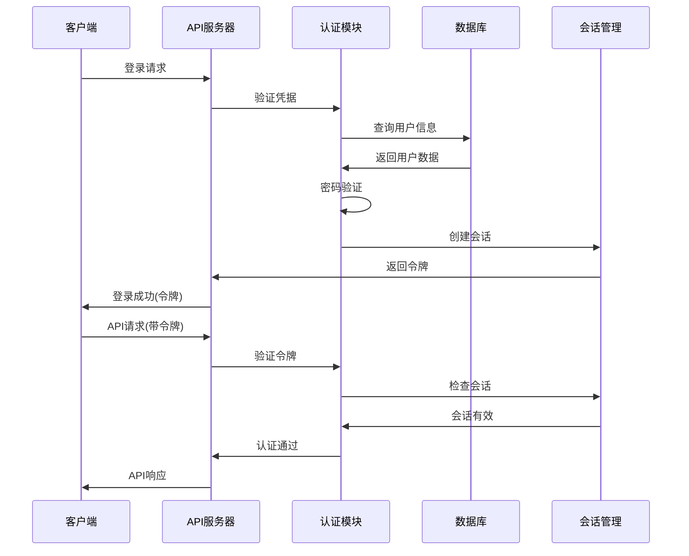

**图表来源**
- [reply_server.py](file://reply_server.py#L182-L200)

### 会话安全管理

1. **令牌生成**：使用安全的随机数生成器
2. **令牌过期**：自动过期机制，防止长期使用
3. **会话绑定**：IP地址和User-Agent绑定
4. **并发控制**：限制同一账户的并发会话数

### 权限控制矩阵

| 操作类型 | 管理员 | 普通用户 | 访客 |
|----------|--------|----------|------|
| 查看系统状态 | ✅ | ✅ | ❌ |
| 修改配置 | ✅ | ❌ | ❌ |
| 管理用户 | ✅ | ❌ | ❌ |
| 下载日志 | ✅ | ❌ | ❌ |
| 系统维护 | ✅ | ❌ | ❌ |

**章节来源**
- [reply_server.py](file://reply_server.py#L1-L200)

## 数据传输安全

### HTTPS通信保护

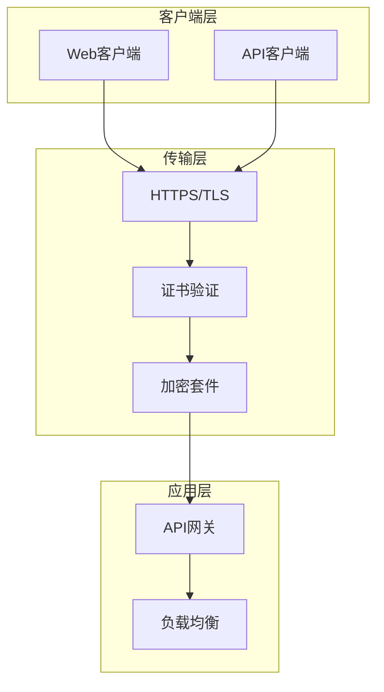

### API安全防护

1. **请求签名**：防止请求篡改
2. **速率限制**：防止单用户过度请求
3. **输入验证**：严格的数据格式检查
4. **CORS配置**：限制跨域访问

## 安全最佳实践

### 最小权限原则

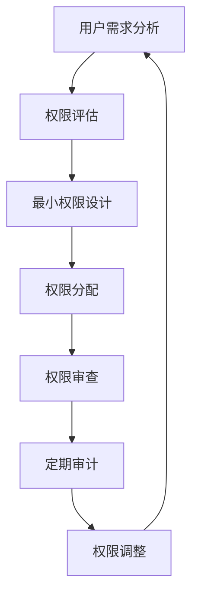

### 定期安全审计

| 审计项目 | 审计频率 | 责任人 | 审计内容 |
|----------|----------|--------|----------|
| 配置文件 | 每月 | 系统管理员 | 敏感配置检查 |
| 数据库访问 | 每周 | 数据管理员 | 异常访问记录 |
| 日志分析 | 每日 | 安全团队 | 安全事件检测 |
| 依赖更新 | 每季度 | 开发团队 | 第三方漏洞扫描 |

### 敏感数据脱敏规范

1. **日志脱敏**：自动识别并隐藏敏感字段
2. **API响应**：敏感数据不返回给客户端
3. **备份数据**：生产数据备份必须脱敏
4. **开发环境**：使用模拟数据而非真实数据

## 安全审计与监控

### 实时监控指标

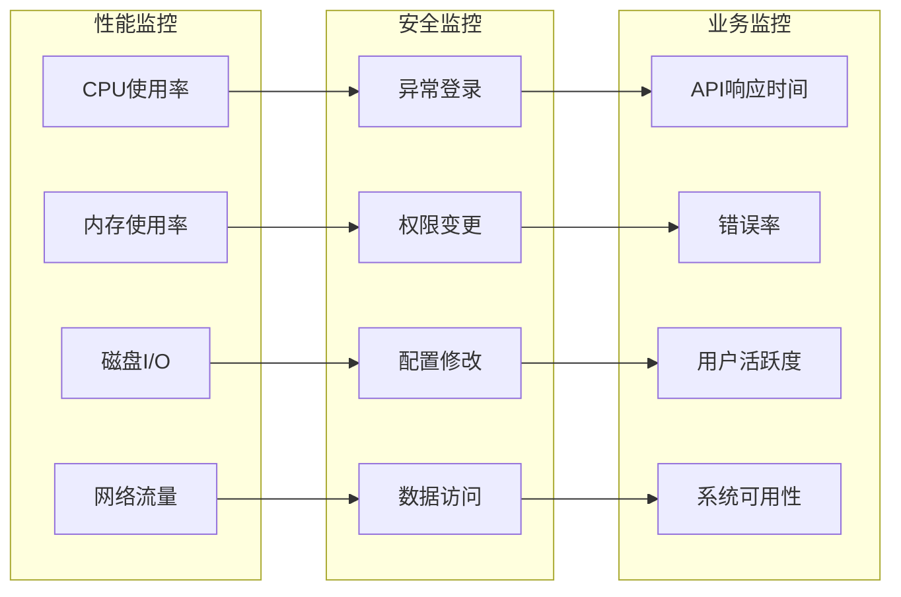

### 告警机制

1. **阈值告警**：系统指标超出正常范围
2. **异常检测**：基于机器学习的异常行为识别
3. **实时通知**：多渠道告警通知
4. **自动化响应**：严重安全事件自动响应

## 故障排除指南

### 常见安全问题

| 问题类型 | 症状 | 可能原因 | 解决方案 |
|----------|------|----------|----------|
| 配置加载失败 | 应用启动异常 | 权限不足/配置格式错误 | 检查文件权限和配置语法 |
| 数据库连接失败 | 数据访问异常 | 连接字符串错误/权限问题 | 验证数据库配置和权限 |
| 日志记录异常 | 日志丢失/乱码 | 编码问题/权限不足 | 检查编码设置和文件权限 |
| 认证失败 | 用户无法登录 | 密码错误/会话过期 | 检查用户状态和会话配置 |

### 安全事件响应流程

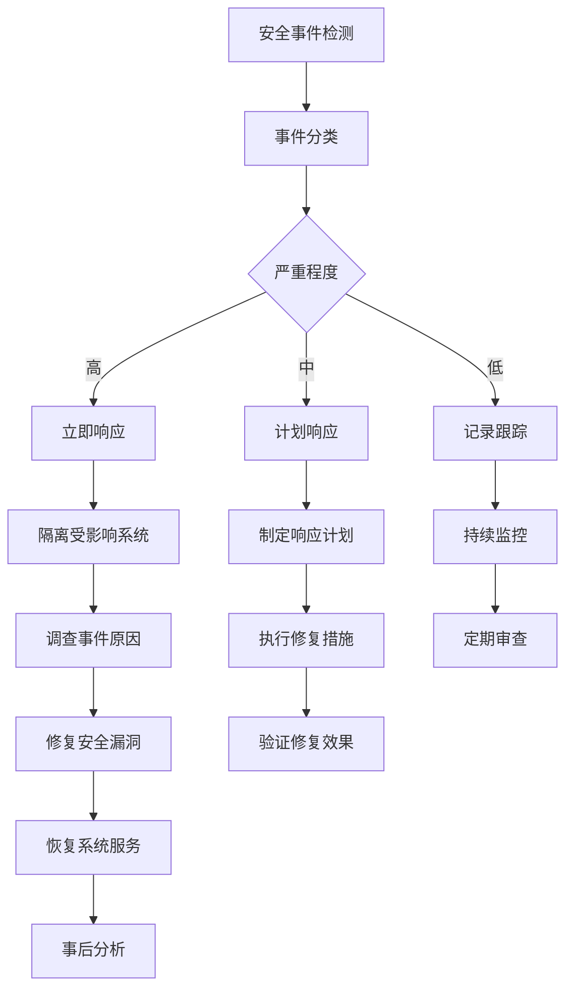

### 备份与恢复

1. **定期备份**：每日增量备份，每周全量备份
2. **加密存储**：备份数据必须加密存储
3. **异地存放**：重要备份异地备份
4. **恢复测试**：定期测试备份恢复能力

**章节来源**
- [Start.py](file://Start.py#L63-L140)

## 结论

本数据安全指南涵盖了"xianyu-auto-reply"项目的关键安全控制点和最佳实践。通过实施这些安全措施，可以有效保护系统的敏感数据，防止未经授权的访问和数据泄露。建议定期审查和更新安全策略，以应对不断变化的安全威胁环境。

安全是一个持续的过程，需要开发团队、运维团队和安全团队的紧密合作。通过建立完善的安全文化，我们可以确保系统的长期稳定和安全运行。