# 日志审计指南

<cite>
**本文档中引用的文件**
- [usage_statistics.py](file://usage_statistics.py)
- [cookie_manager.py](file://cookie_manager.py)
- [file_log_collector.py](file://file_log_collector.py)
- [config.py](file://config.py)
- [global_config.yml](file://global_config.yml)
- [db_manager.py](file://db_manager.py)
- [Start.py](file://Start.py)
- [reply_server.py](file://reply_server.py)
</cite>

## 目录
1. [简介](#简介)
2. [系统架构概览](#系统架构概览)
3. [用户使用统计匿名化机制](#用户使用统计匿名化机制)
4. [Cookie管理器日志记录规范](#cookie管理器日志记录规范)
5. [日志级别与配置管理](#日志级别与配置管理)
6. [敏感信息过滤与保护策略](#敏感信息过滤与保护策略)
7. [日志文件管理与轮转](#日志文件管理与轮转)
8. [安全审计与异常监控](#安全审计与异常监控)
9. [日志管理最佳实践](#日志管理最佳实践)
10. [故障排查指南](#故障排查指南)
11. [总结](#总结)

## 简介

本指南详细说明了Xianyu Auto Reply系统中的日志审计机制，涵盖用户使用统计的匿名化处理、关键操作的日志记录规范、日志级别设置、敏感信息过滤以及安全审计功能。通过系统化的日志管理，确保系统操作的可追溯性和安全性。

## 系统架构概览

系统采用多层次的日志审计架构，包含以下核心组件：

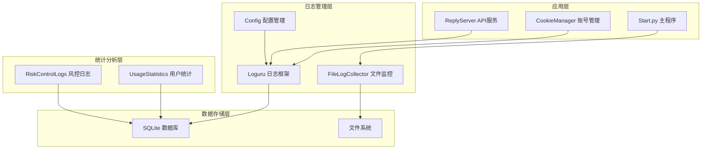

**图表来源**
- [Start.py](file://Start.py#L517-L518)
- [file_log_collector.py](file://file_log_collector.py#L18-L29)
- [cookie_manager.py](file://cookie_manager.py#L10-L21)

## 用户使用统计匿名化机制

### 匿名ID生成算法

系统通过`usage_statistics.py`模块实现用户使用统计的匿名化处理，确保用户隐私得到保护。

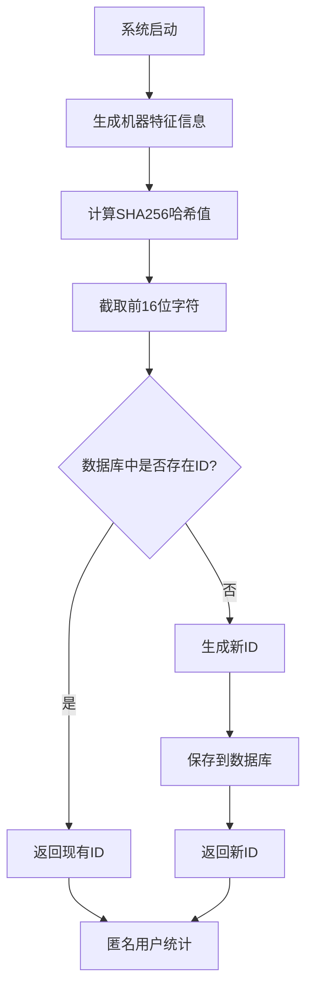

**图表来源**
- [usage_statistics.py](file://usage_statistics.py#L28-L70)

### 匿名化处理机制

系统采用以下步骤确保用户隐私保护：

1. **机器特征收集**：收集平台信息、Python版本等系统特征
2. **哈希生成**：使用SHA256算法生成固定长度的匿名标识符
3. **持久化存储**：将匿名ID保存到数据库，确保Docker重建时ID不变
4. **随机备用**：当系统信息获取失败时，使用时间戳生成MD5哈希

**章节来源**
- [usage_statistics.py](file://usage_statistics.py#L28-L70)

### 统计数据上报流程

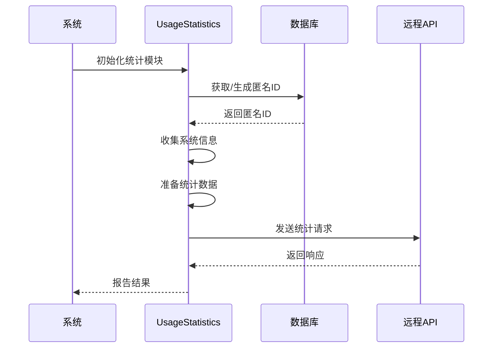

**图表来源**
- [usage_statistics.py](file://usage_statistics.py#L137-L144)

## Cookie管理器日志记录规范

### 关键操作日志记录

Cookie管理器实现了全面的操作日志记录，涵盖以下关键场景：

#### 账号生命周期管理

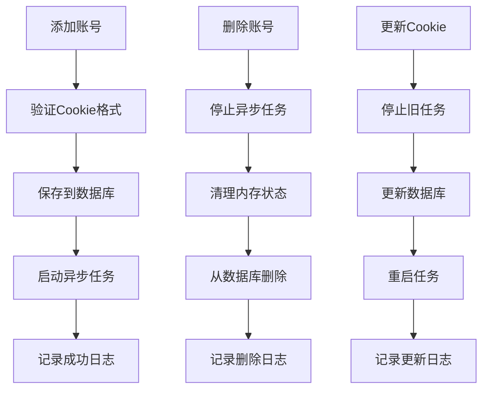

**图表来源**
- [cookie_manager.py](file://cookie_manager.py#L112-L181)
- [cookie_manager.py](file://cookie_manager.py#L224-L277)

#### 日志记录规范

系统在以下场景记录详细日志：

1. **账号添加**：记录Cookie ID、用户ID、关键词数量
2. **账号删除**：记录删除的Cookie ID和清理过程
3. **Cookie更新**：记录更新前后状态和重启任务过程
4. **状态变更**：记录启用/禁用状态的变化
5. **任务管理**：记录任务启动、停止和异常情况

**章节来源**
- [cookie_manager.py](file://cookie_manager.py#L112-L181)
- [cookie_manager.py](file://cookie_manager.py#L224-L277)

### 错误处理与异常日志

系统实现了完善的错误处理机制：

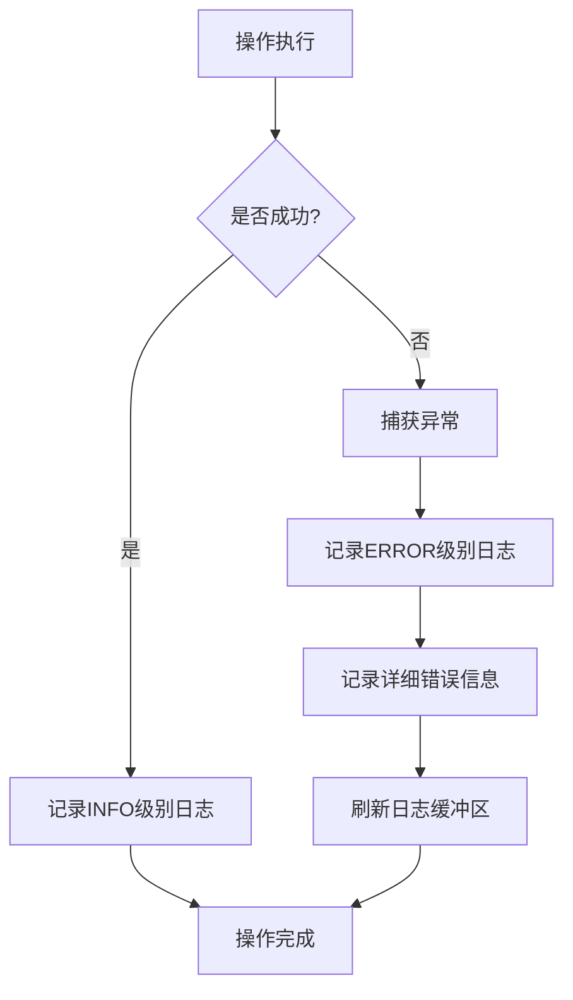

**图表来源**
- [cookie_manager.py](file://cookie_manager.py#L60-L111)

## 日志级别与配置管理

### 配置文件结构

系统通过`global_config.yml`文件统一管理日志配置：

| 配置项 | 类型 | 默认值 | 说明 |
|--------|------|--------|------|
| LOG_CONFIG.level | String | INFO | 日志级别 |
| LOG_CONFIG.rotation | String | 1 day | 日志轮转周期 |
| LOG_CONFIG.retention | String | 7 days | 日志保留期限 |
| LOG_CONFIG.format | String | 自定义格式 | 日志输出格式 |
| LOG_CONFIG.compression | String | zip | 日志压缩格式 |

**章节来源**
- [global_config.yml](file://global_config.yml#L49-L55)

### 日志格式规范

系统采用结构化的日志格式：

```
{time:YYYY-MM-DD HH:mm:ss.SSS} | {level} | {name}:{function}:{line} - {message}
```

示例输出：
```
2024-12-15 14:30:25.123 | INFO | __main__:main:45 - 系统启动完成
2024-12-15 14:30:26.456 | ERROR | cookie_manager:_run_xianyu:85 - XianyuLive任务异常
```

### 动态日志配置

系统支持运行时动态调整日志配置：

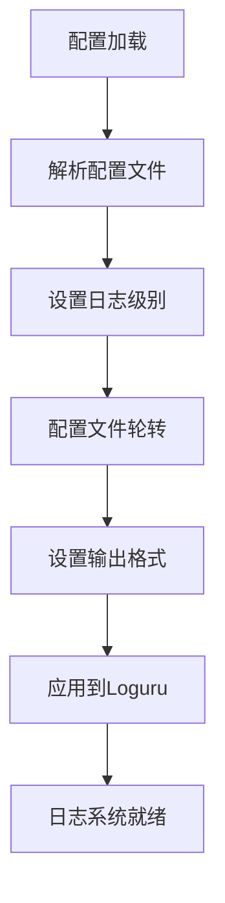

**图表来源**
- [config.py](file://config.py#L21-L33)

**章节来源**
- [config.py](file://config.py#L21-L33)
- [global_config.yml](file://global_config.yml#L49-L55)

## 敏感信息过滤与保护策略

### 数据库敏感信息保护

系统在数据库操作中实施多重保护措施：

#### SQL日志过滤

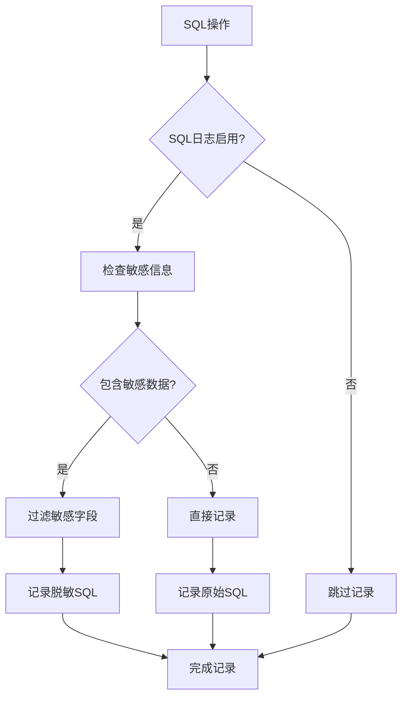

**图表来源**
- [db_manager.py](file://db_manager.py#L53-L62)

#### 敏感字段识别

系统自动识别并保护以下敏感字段：

| 字段类型 | 示例字段 | 保护策略 |
|----------|----------|----------|
| 认证信息 | password_hash, api_key | 完全过滤 |
| 个人数据 | email, username | 部分脱敏 |
| 系统密钥 | secret_key, token | 完全隐藏 |
| Cookie值 | cookie_value | 部分保留 |

**章节来源**
- [db_manager.py](file://db_manager.py#L53-L62)

### 文件系统保护

#### 日志文件权限控制

系统确保日志文件的安全访问：

1. **文件权限**：设置适当的文件权限（建议640）
2. **目录保护**：日志目录具有适当的访问控制
3. **轮转保护**：旧日志文件自动压缩和加密

#### 实时监控保护

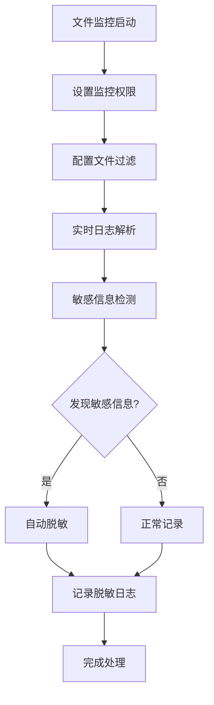

**图表来源**
- [file_log_collector.py](file://file_log_collector.py#L78-L101)

**章节来源**
- [file_log_collector.py](file://file_log_collector.py#L78-L101)

## 日志文件管理与轮转

### 文件轮转策略

系统采用智能的日志轮转机制：

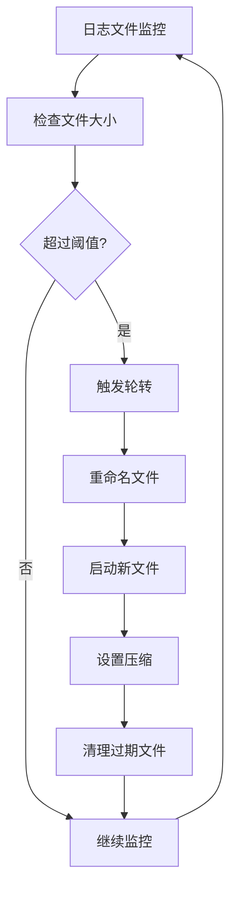

**图表来源**
- [file_log_collector.py](file://file_log_collector.py#L78-L101)

### 轮转配置参数

| 参数 | 默认值 | 说明 |
|------|--------|------|
| rotation | 10 MB | 单文件最大大小 |
| retention | 3 days | 保留期限 |
| compression | zip | 压缩格式 |
| buffering | 1 | 缓冲模式 |

**章节来源**
- [file_log_collector.py](file://file_log_collector.py#L63-L71)

### 集中日志收集

系统提供实时日志收集功能：

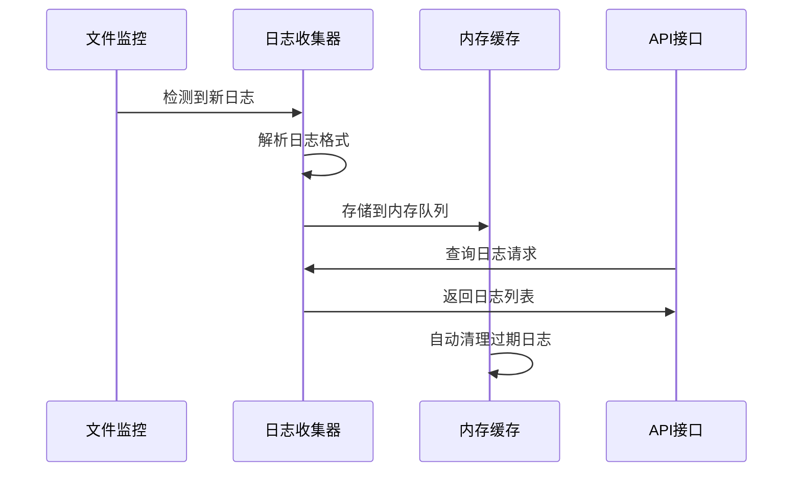

**图表来源**
- [file_log_collector.py](file://file_log_collector.py#L78-L101)

**章节来源**
- [file_log_collector.py](file://file_log_collector.py#L78-L101)

## 安全审计与异常监控

### 风控日志系统

系统实现了完整的风控日志记录机制：

#### 风控事件类型

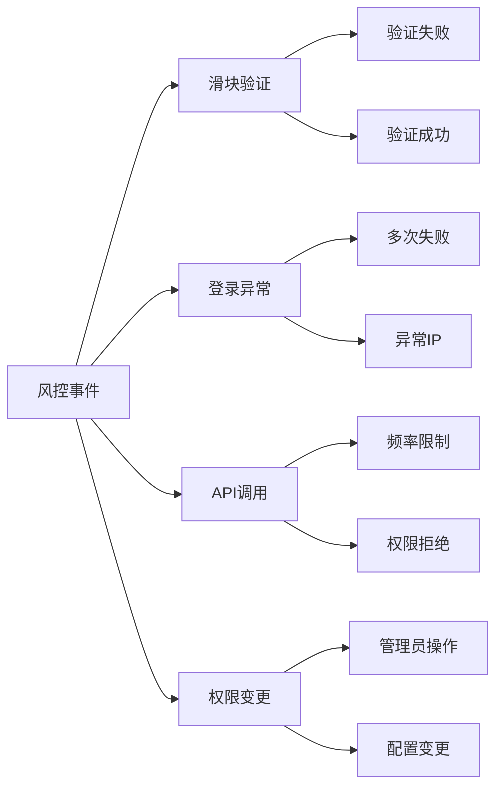

**图表来源**
- [db_manager.py](file://db_manager.py#L4908-L4948)

#### 风控日志记录规范

系统记录以下关键信息：

| 字段 | 类型 | 说明 |
|------|------|------|
| cookie_id | String | 关联的账号ID |
| event_type | String | 事件类型 |
| event_description | String | 事件描述 |
| processing_result | String | 处理结果 |
| processing_status | String | 处理状态 |
| error_message | String | 错误信息 |

**章节来源**
- [db_manager.py](file://db_manager.py#L4908-L4948)

### 异常行为监控

#### 实时监控指标

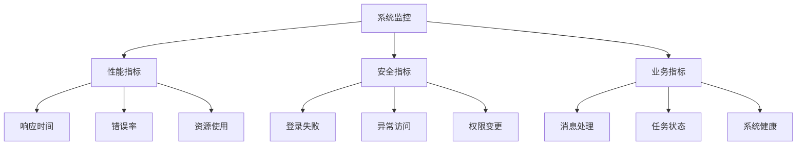

#### 告警机制

系统支持多种告警触发条件：

1. **阈值告警**：超出预设阈值时触发
2. **异常检测**：识别异常行为模式
3. **实时通知**：通过多种渠道发送告警

**章节来源**
- [reply_server.py](file://reply_server.py#L4423-L4478)

## 日志管理最佳实践

### 日志轮转最佳实践

#### 轮转策略配置

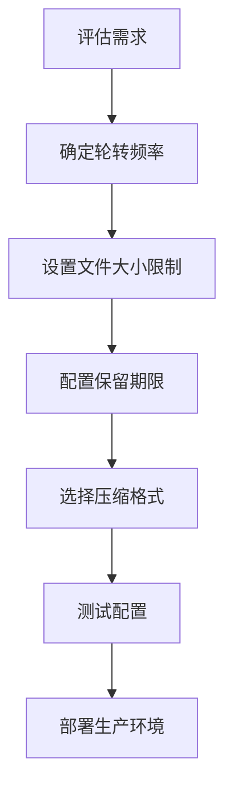

#### 推荐配置参数

| 场景 | rotation | retention | compression |
|------|----------|-----------|-------------|
| 生产环境 | 50MB | 7天 | zip |
| 开发环境 | 10MB | 3天 | none |
| 高负载环境 | 20MB | 1天 | gzip |

### 集中日志管理

#### 日志聚合架构

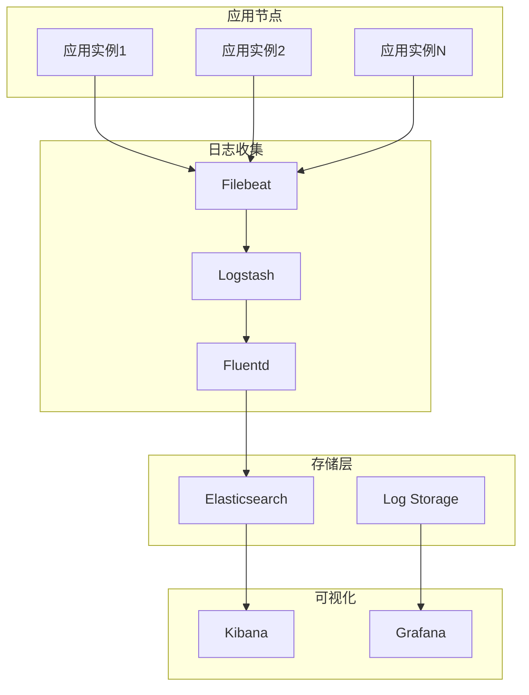

### 异常行为监控最佳实践

#### 监控指标体系

```mermaid
mindmap
root((监控指标))
性能指标
响应时间
错误率
吞吐量
资源使用率
安全指标
登录失败次数
异常访问IP
权限变更
API调用频率
业务指标
消息处理量
任务成功率
系统可用性
用户活跃度
```

#### 告警规则设计

1. **基线建立**：建立正常运行基线
2. **阈值设定**：设置合理的告警阈值
3. **降噪处理**：避免告警风暴
4. **分级响应**：不同级别的响应机制

### 日志分析与优化

#### 日志分析流程

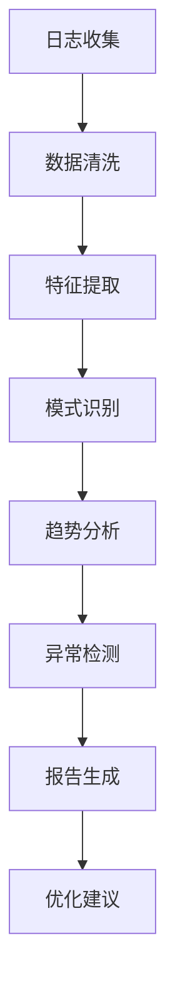

#### 性能优化策略

1. **索引优化**：合理设计日志索引
2. **查询优化**：优化日志查询语句
3. **存储优化**：选择合适的存储方案
4. **传输优化**：减少网络传输开销

## 故障排查指南

### 常见问题诊断

#### 日志收集问题

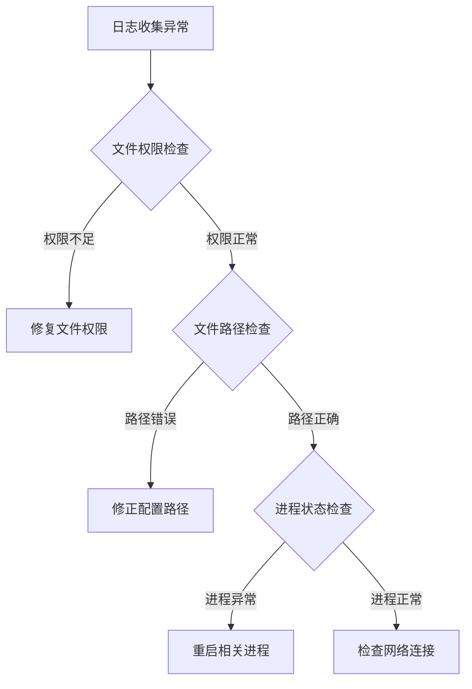

#### 性能问题排查

1. **CPU使用率过高**
   - 检查日志轮转配置
   - 优化日志格式
   - 减少不必要的日志输出

2. **磁盘空间不足**
   - 调整保留期限
   - 增加轮转频率
   - 清理过期日志

3. **内存使用过高**
   - 优化内存缓存
   - 调整队列大小
   - 启用垃圾回收

### 调试工具与技巧

#### 日志查询技巧

```bash
# 按时间范围查询
grep "2024-12-15 14:00:00" xianyu.log | head -100

# 按错误级别过滤
grep "\[ERROR\]" xianyu.log | wc -l

# 按关键词搜索
grep -i "exception\|error\|fail" xianyu.log

# 统计各级别日志数量
awk '{print $2}' xianyu.log | sort | uniq -c
```

#### 实时监控命令

```bash
# 实时跟踪日志文件
tail -f xianyu.log

# 监控日志文件大小
watch -n 5 "ls -lh xianyu.log"

# 检查日志轮转状态
ls -la logs/
```

**章节来源**
- [file_log_collector.py](file://file_log_collector.py#L148-L161)

### 故障恢复流程

#### 自动恢复机制

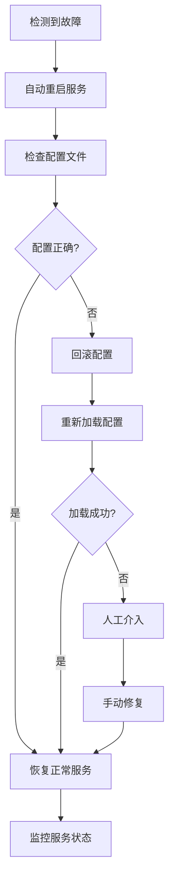

#### 手动恢复步骤

1. **服务重启**：重启相关服务进程
2. **配置验证**：检查配置文件语法
3. **权限修复**：修正文件和目录权限
4. **磁盘清理**：释放磁盘空间
5. **监控验证**：确认服务正常运行

## 总结

本指南全面介绍了Xianyu Auto Reply系统的日志审计机制，涵盖了从用户统计匿名化到安全审计的完整体系。通过系统化的日志管理，实现了：

1. **隐私保护**：通过匿名化技术和敏感信息过滤，确保用户隐私安全
2. **可追溯性**：完整的操作日志记录，支持系统行为的全程追踪
3. **安全审计**：实时的风险控制和异常监控，及时发现和处理安全威胁
4. **运维支持**：完善的日志管理和故障排查工具，提升运维效率

系统采用Loguru作为核心日志框架，结合自定义的文件监控和数据库存储，构建了高效、可靠的日志审计体系。通过合理的配置和最佳实践，可以满足生产环境的高要求日志管理需求。

建议运维团队根据实际需求，定期审查和优化日志配置，确保日志系统的持续有效性和安全性。